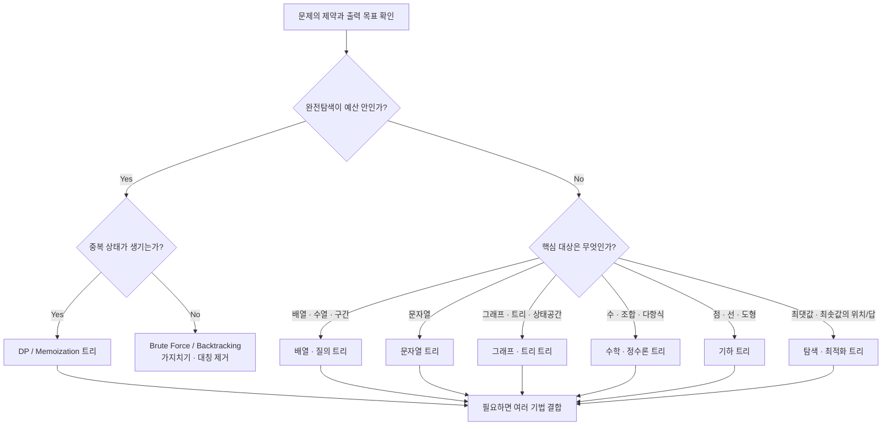
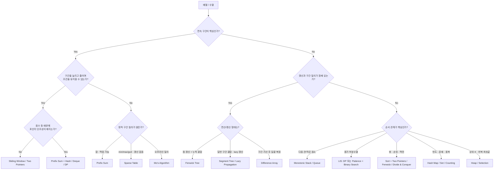
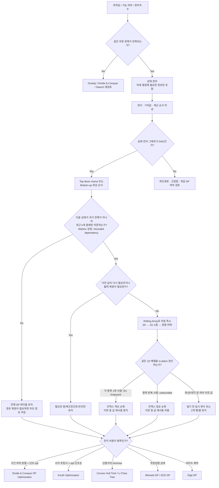
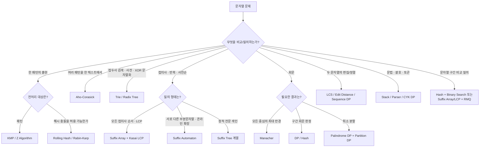
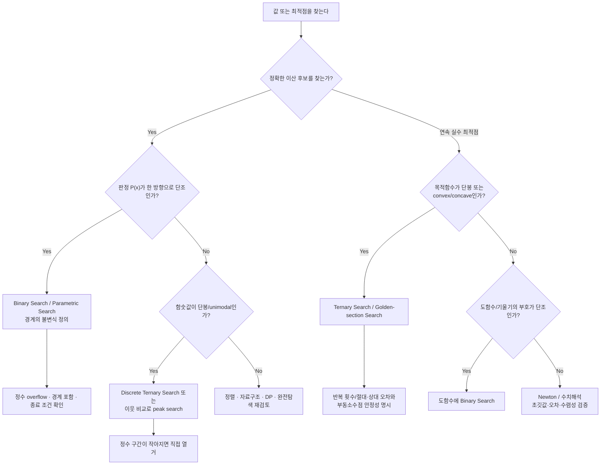
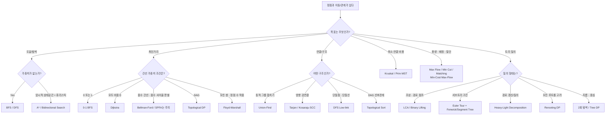
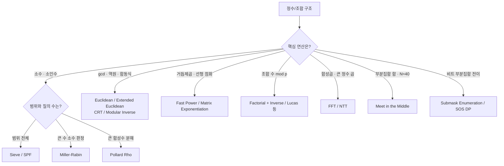
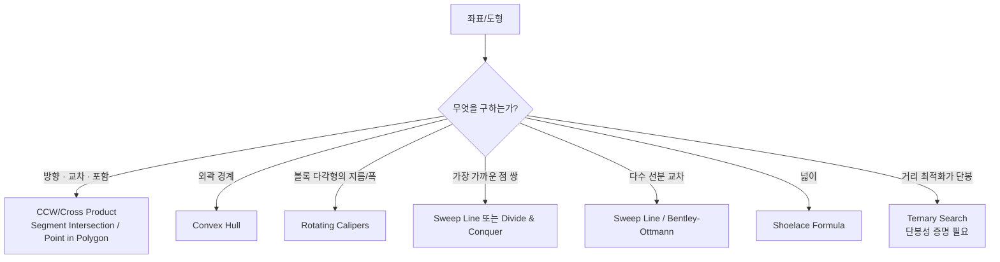
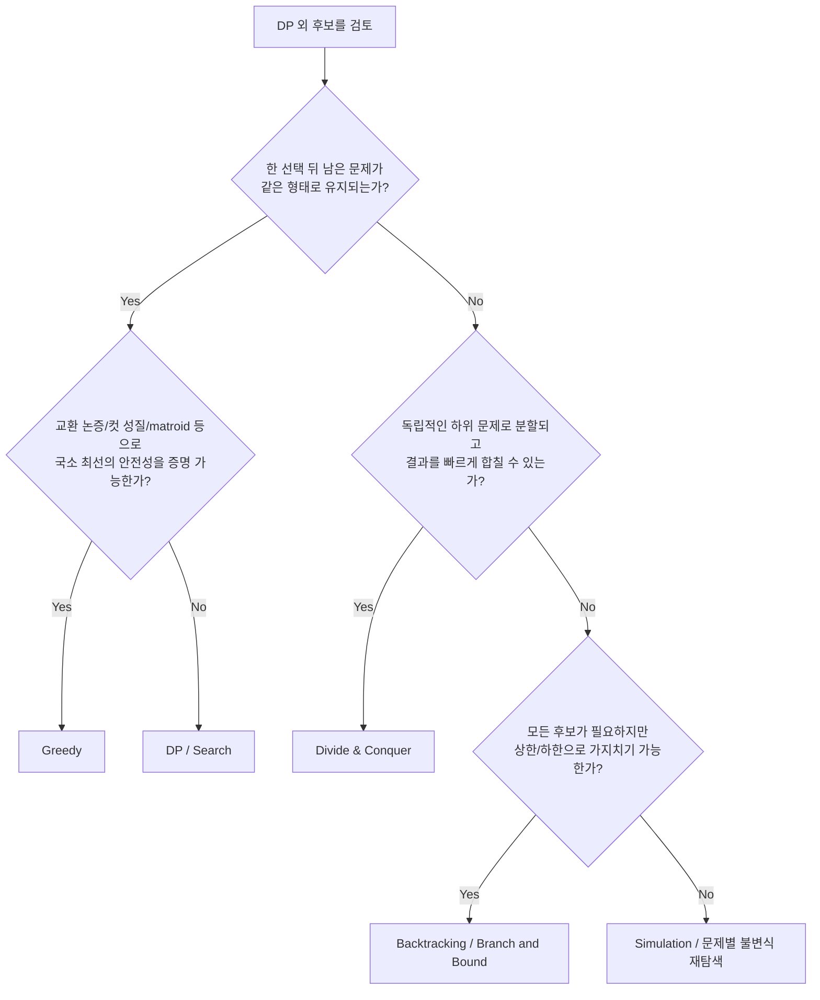

# 알고리즘 의사 결정 Flow Chart

문제의 겉모양이 아니라 **제약 → 구조 → 목표 → 성질 → 구현 최적화** 순서로 후보를 좁히는 지도입니다. 하나의 거대한 트리로 모든 알고리즘을 억지로 배타 분류하지 않고, 먼저 전체 라우터에서 영역을 고른 뒤 해당 세부 트리로 내려갑니다.

> 같은 문제에 여러 트리가 동시에 적용될 수 있습니다. 예: 문자열 매칭 + DP, 트리 + 구간 자료구조, 그래프 + 비트마스크 DP.

## 0. 복잡도 예산부터 정하기

| 대략적인 입력 크기 `N` | 먼저 검토할 시간복잡도 |
| --- | --- |
| `N ≤ 20` | `O(2^N)`, meet-in-the-middle, bitmask DP |
| `N ≤ 40` | `O(2^(N/2))`, meet-in-the-middle |
| `N ≤ 500` | `O(N^3)` 가능성 검토 |
| `N ≤ 5,000` | `O(N^2)` 가능성 검토 |
| `N ≤ 2×10^5` | 보통 `O(N log N)` 이하 |
| `N ≥ 10^6` | 보통 `O(N)` 또는 작은 상수의 `O(N log N)` |

수치 범위가 작으면 `N` 대신 값의 범위 `V`를 이용하는 counting, sieve, frequency DP도 후보입니다. 메모리는 상태 수 × 상태 하나의 크기로 별도 계산합니다.

## 1. 전체 라우터

## 2. 배열 · 수열 · 구간

## 3. DP 설계와 차원 · 메모리 최적화

### DP 차원 축소 체크리스트

1. `dp[i][...]`에서 `i+1` 계산에 실제로 참조되는 층을 식으로 표시한다.
2. 최근 `k`개 층만 참조하면 상태 전이는 `k`차 Markov 성질을 가지므로 오래된 층을 버릴 수 있다.
3. in-place 갱신 시 순회 방향이 문제의 의미를 바꾸는지 확인한다. 0/1 선택은 보통 역순, 무제한 선택은 보통 정순이다.
4. 최적값만 필요한지, 실제 선택/경로 복원도 필요한지 구분한다. 복원이 필요하면 부모 배열, checkpoint 재계산, Hirschberg 같은 별도 기법이 필요할 수 있다.
5. 시간 차원은 줄여도 다른 상태 축이 미래를 구분하는 데 필요하면 제거하면 안 된다.

## 4. 문자열

## 5. 탐색 · 수치 최적화

> Ternary search는 단순히 “정렬됨”이 아니라 **목적함수의 단봉성**이 증명될 때 사용합니다. 판정의 참/거짓이 단조라면 binary search가 우선입니다.

## 6. 그래프 · 트리 · 상태공간

## 7. 수학 · 정수론 · 조합

## 8. 기하

## 9. Greedy · 분할정복 · 탐색 판별

## 10. 최종 선택 전 검증 질문

1. 입력 크기와 시간·메모리 예산에 맞는가?
2. 알고리즘의 핵심 전제(단조성, 단봉성, 비음수 가중치, 최적 부분 구조 등)를 **증명**했는가?
3. 온라인/오프라인, 정적/동적, 단일/반복 질의를 구분했는가?
4. 중복 값, 빈 입력, overflow, 음수, disconnected graph, cycle을 처리하는가?
5. DP 상태가 미래를 구분하는 최소 정보인가? 최근 층만 참조한다면 rolling array로 줄일 수 있는가?
6. in-place DP의 순회 방향이 0/1 선택과 무제한 선택의 의미를 보존하는가?
7. 정답뿐 아니라 경로·선택 복원이 필요한가?
8. 더 단순한 알고리즘이 같은 복잡도를 달성하지 않는가?

## 핵심 단서 색인

| 관찰 가능한 단서 | 우선 검토할 후보 |
| --- | --- |
| `P(x)`가 false→true 또는 true→false로 한 번만 변함 | Binary/Parametric Search |
| 목적함수가 한 번만 증가 후 감소(또는 반대) | Ternary/Golden-section Search |
| 최근 `k`개 DP 층만 다음 상태에 영향 | Rolling Array, 차원 축소 |
| 0/1 항목을 1D knapsack으로 압축 | 용량 역순 순회 |
| 무제한 항목을 1D knapsack으로 압축 | 용량 정순 순회 |
| 연속 구간의 양끝을 이동해도 조건 변화가 단조 | Sliding Window / Two Pointers |
| 음수 때문에 window 합의 단조성이 깨짐 | Prefix Sum + Hash/Deque |
| 다음 큰/작은 원소, 히스토그램 | Monotonic Stack |
| 여러 패턴을 한 텍스트에서 검색 | Aho-Corasick |
| 접미사 순서·LCP·반복 부분문자열 | Suffix Array + LCP |
| 온라인 부분문자열 상태·서로 다른 부분문자열 | Suffix Automaton |
| 모든 회문 중심의 반경 | Manacher |
| 가중치 0/1 최단거리 | 0-1 BFS |
| 선형식들의 최솟값/최댓값이 DP 전이 | CHT / Li Chao Tree |
| 트리 경로 갱신·질의 | HLD + Segment Tree |
| `N≈40` 부분집합 탐색 | Meet in the Middle |

이 문서는 알고리즘 이름의 백과사전이 아니라, **문제에서 증명 가능한 성질을 찾아 후보를 좁히는 의사 결정 지도**로 사용합니다.
