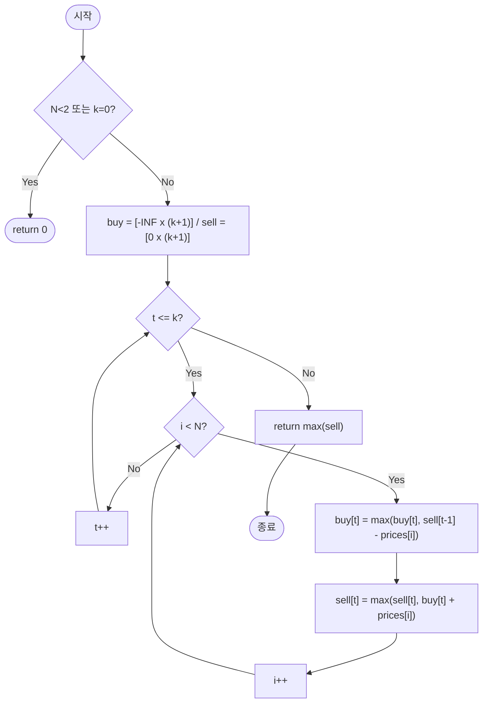

# bestTimeToBuyAndSellStockK — 주식 매매 최대 이익 (최대 k회 거래)

## 성능 목표 예측

| 항목 | 값 |
|------|-----|
| 입력 크기 | $1 \leq N \leq 1{,}000$ |
| 최대 거래 횟수 | $0 \leq k \leq 100$ |
| 가격 범위 | $0 \leq prices[i] \leq 10{,}000$ |

**naive 접근의 문제점**: 모든 $k$-조합을 날짜 범위에서 열거하면, $k$회 매수·매도 쌍을 선택하는 경우의 수는 $\binom{2N}{2k}$ 수준이다. $N=1000, k=100$ 이면 천문학적이어서 불가능하다.

**목표 복잡도**: 시간 $O(Nk)$, 공간 $O(k)$. $N \cdot k = 10^5$ 수준으로 충분히 통과한다.

**공간 복잡도**: 상태 배열을 1D로 롤링하면 $O(k)$. 2D $O(Nk)$ 로도 구현 가능하나 메모리 낭비다.

---

## 목표 함수

```ts
function bestTimeToBuyAndSellStockK(k: number, prices: number[]): number
```

| 파라미터 | 의미 | 제약 |
|----------|------|------|
| `k` | 최대 거래 횟수 | $0 \leq k \leq 100$ |
| `prices` | 날짜별 주식 가격 배열 | $1 \leq N \leq 1{,}000$, $0 \leq prices[i] \leq 10{,}000$ |

**반환값**: 최대 $k$번의 매수·매도 쌍으로 얻을 수 있는 최대 이익. 거래하지 않는 경우 $0$.

**엣지케이스**:

| 입력 | 기대 출력 | 이유 |
|------|-----------|------|
| `k=0, prices=[1,2,3]` | `0` | 거래 불가 |
| `k=1, prices=[5]` | `0` | 매도 날 없음 |
| `k=2, prices=[3,2,6,5,0,3]` | `7` | 2회 거래로 최적화 |
| `k=100, prices=[1,2,3,4,5]` | `4` | $k \geq \lfloor N/2 \rfloor$ 이면 무제한 거래와 동일 |

---

## 핵심 아이디어

### 원형 아이디어와 naive 접근

단순하게 생각하면, 날짜 $N$개 중에서 매수일과 매도일을 $k$쌍 선택하는 모든 경우를 열거한다.

```
for all combinations of k buy-sell pairs (i1 <= j1 < i2 <= j2 < ... < ik <= jk):
    profit = sum(prices[jt] - prices[it])
    best = max(best, profit)
```

조합의 수가 $\binom{2N}{2k}$ 로 폭발하여 실용적이지 않다.

### 어떤 관찰이 돌파구가 되는가

- **관찰 1**: 거래 횟수 $t$와 날짜 $i$로 상태를 분해할 수 있다. "$t$번 거래 완료 후 $i$일 이후부터의 최적 이익"은 이전 결정에 독립적이다 — 최적 부분 구조가 성립한다.
- **관찰 2**: 날짜를 순서대로 처리하면서 "현재 $t$번째 매수 완료 상태"와 "$t$번째 매도 완료 상태" 두 값만 추적하면 된다.
- **관찰 3**: 거래 횟수 $t$를 외부 루프로 두고, 각 날짜에 대해 $buy[t]$와 $sell[t]$를 갱신하면 내부 루프가 $O(N)$, 전체가 $O(Nk)$가 된다.

### 관찰을 형식화: 상태/구조 정의

두 배열을 정의한다.

$$buy[t] = \text{t번째 매수를 완료한 상태에서의 최대 누적 이익}$$
$$sell[t] = \text{t번째 매도를 완료한 상태에서의 최대 누적 이익}$$

각 날 $i$를 처리할 때, $t$번째 거래에 대해:
- 매수 상태 갱신: $i$일에 새로 매수하거나, 이미 매수 중인 상태 유지
- 매도 상태 갱신: $i$일에 매도하거나, 이미 매도한 상태 유지

이 정의가 "거래 횟수 $\times$ 보유 여부"의 2D 상태를 날짜 루프와 분리해 처리하는 구조다. 2D 배열 $dp[t][i]$로 정의할 수도 있지만 공간이 $O(Nk)$로 늘어난다.

### 점화식 또는 핵심 연산

외부 루프 $t = 1, \ldots, k$, 내부 루프 $i = 0, \ldots, N-1$:

$$buy[t] \leftarrow \max\bigl(buy[t],\; sell[t-1] - prices[i]\bigr)$$

$$sell[t] \leftarrow \max\bigl(sell[t],\; buy[t] + prices[i]\bigr)$$

- $sell[t-1] - prices[i]$: $(t-1)$번째 매도 이익에서 $i$일 가격을 내고 $t$번째 매수를 하는 경우
- $buy[t] + prices[i]$: $t$번째 매수 상태에서 $i$일에 매도하는 경우
- 각 항의 $\max$: "오늘 행동하지 않고 이전 상태를 유지"하는 경우를 포함

초기 조건: $buy[t] = -\infty$ (아직 매수 전, 유효하지 않은 상태), $sell[0] = 0$ (거래 전 이익 $0$).

결과: $\max_{0 \leq t \leq k} sell[t]$.

### 정당성 — 왜 이것이 옳은가

$sell[t-1]$은 $t$번째 거래를 시작하기 전에 이미 최적화된 값이다. 내부 루프 $i$가 증가할 때, $buy[t]$는 "$i$일 이전까지 가장 유리한 $t$번째 매수 시점"을 반영한다. 매도일 $j \geq i$에서 $sell[t]$를 갱신할 때 이미 최적 $buy[t]$를 참조하므로, 귀납적으로 모든 날짜 조합을 커버한다.

$k \geq \lfloor N/2 \rfloor$이면 사실상 무제한 거래와 동일하다. 이 경우 별도 처리를 추가하면 성능을 높일 수 있다.

주의: 같은 날 매도 후 재매수는 수식 구조상 자연스럽게 허용되며($sell[t-1]$과 $buy[t]$ 갱신이 같은 $i$에서 발생), 결과에 영향을 주지 않는다(이익이 0이 추가될 뿐).

### 구현 디테일과 최적화

- `buy`와 `sell` 배열을 1D $(k+1)$ 크기로 유지해 $O(k)$ 공간으로 해결한다.
- 내부 루프에서 `buy[t]`와 `sell[t]` 갱신 순서가 중요하다. `sell[t]`는 갱신된 `buy[t]`를 참조하므로 `buy[t]` 먼저 갱신해야 한다.
- `sell[t-1]`은 현재 $t$ 루프에서 갱신되지 않으므로 순서 의존 문제가 없다.
- **함정**: `buy[t]`를 초기화할 때 반드시 $-\infty$를 사용해야 한다. `0`으로 초기화하면 "매수 안 함 = 이익 0"이 되어 잘못된 전이가 발생한다.
- **함정**: 루프 순서를 $t$ 바깥, $i$ 안쪽으로 두면 각 거래 번호마다 전체 날짜를 순회해 정확한 전이가 보장된다. 순서를 바꾸면 같은 날 여러 번 거래를 허용하는 오류가 생긴다.

---

## 수도 코드와 Activity Diagram

### 의사코드

```
function bestTimeToBuyAndSellStockK(k, prices):
    if len(prices) < 2 or k == 0: return 0

    buy  ← array of size k+1, filled with -Infinity   // 불변식: t번 매수 완료 최대 이익
    sell ← array of size k+1, filled with 0           // 불변식: t번 매도 완료 최대 이익

    for t from 1 to k:
        for i from 0 to N-1:
            buy[t]  ← max(buy[t],  sell[t-1] - prices[i])  // i일에 t번째 매수
            sell[t] ← max(sell[t], buy[t]    + prices[i])  // i일에 t번째 매도

    return max(sell)
```

### Activity Diagram



**핵심 불변식**: 외부 루프 $t$ 완료 시점에 $sell[t]$ = 정확히 $t$번 거래를 수행했을 때의 최대 이익이며, $0 \leq sell[t-1] \leq sell[t]$가 항상 성립한다 (거래 횟수가 늘수록 이익이 줄어들지 않음).

---

## 복잡도 분석 심화

| 접근 방식 | 시간 | 공간 | 비고 |
|-----------|------|------|------|
| 완전 탐색 (조합 열거) | $O(\binom{2N}{2k})$ | $O(k)$ | 불가 |
| 2D DP $dp[k][N]$ | $O(Nk)$ | $O(Nk)$ | 공간 낭비 |
| 1D 롤링 DP | $O(Nk)$ | $O(k)$ | 최적 |

**$k \geq \lfloor N/2 \rfloor$ 인 경우 최적화**: 이 경우 사실상 무제한 거래와 동일하므로, 연속하는 양수 상승분을 모두 취하면 된다. $O(N)$에 해결 가능하다.

```
if k >= N / 2:
    return sum(max(0, prices[i] - prices[i-1]) for i in 1..N-1)
```

**수치 예시 추적** ($k=2$, $prices=[3,2,6,5,0,3]$):

| $t=1$ 내부 루프 | $i$ | $prices[i]$ | $buy[1]$ | $sell[1]$ |
|---------|-----|-------------|----------|-----------|
| 초기 | — | — | $-\infty$ | $0$ |
| $i=0$ | 0 | 3 | $\max(-\infty, 0-3)=-3$ | $\max(0,-3+3)=0$ |
| $i=1$ | 1 | 2 | $\max(-3, 0-2)=-2$ | $\max(0,-2+2)=0$ |
| $i=2$ | 2 | 6 | $\max(-2, 0-6)=-2$ | $\max(0,-2+6)=4$ |
| $t=2$ 내부 루프 참조 $sell[1]=4$ | | | | |

$t=2$ 루프 후 $sell[2]=7$ ($[2,6]$과 $[0,3]$ 거래). 결과 $\max(sell[1], sell[2]) = 7$.
