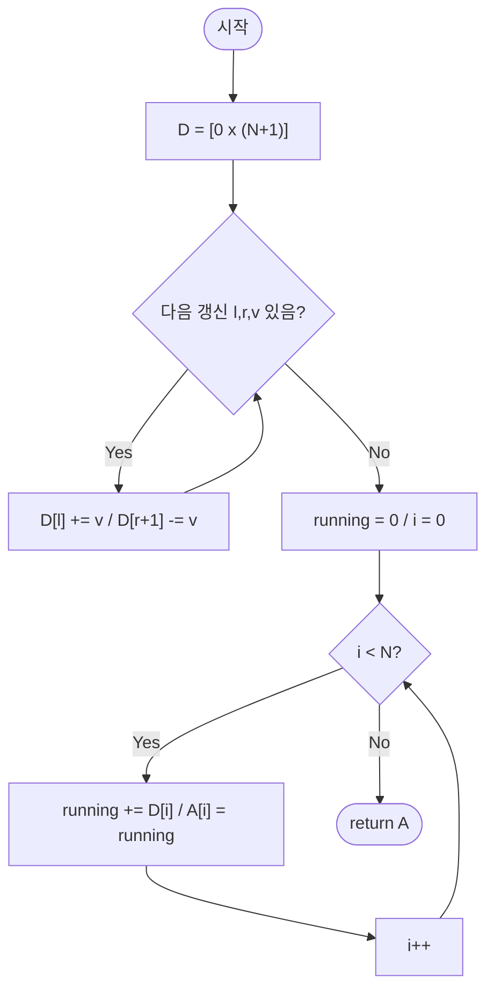

# diffArrayRangeUpdate — 구간 갱신 + 점 질의 (차분 배열)

## 성능 목표 예측

| 항목 | 값 |
|------|-----|
| 배열 길이 | $1 \leq N \leq 100{,}000$ |
| 갱신 횟수 | $1 \leq Q \leq 100{,}000$ |
| 갱신 값 범위 | $-10{,}000 \leq v \leq 10{,}000$ |

**naive 접근의 문제점**: 각 갱신 $\text{update}(l, r, v)$를 직접 수행하면 $O(r-l+1)$이고, 최악의 경우 $O(N)$이다. 갱신이 $Q$개이면 전체 $O(NQ) = 10^{10}$으로 시간 초과가 발생한다.

**목표 복잡도**: 갱신 $O(1)$, 복원 $O(N)$, 전체 $O(N+Q)$. 갱신을 "경계 이벤트"로 기록하고 마지막에 누적합 한 번으로 복원한다.

**공간 복잡도**: 차분 배열 $D$ 하나 $O(N+1)$이면 충분하다.

---

## 목표 함수

```ts
function diffArrayRangeUpdate(
  N: number,
  updates: Array<[number, number, number]>,
): number[]
```

| 파라미터 | 의미 | 제약 |
|----------|------|------|
| `N` | 배열 길이 | $1 \leq N \leq 100{,}000$ |
| `updates` | 구간 갱신 목록 $[(l, r, v), \ldots]$ | $0 \leq l \leq r \leq N-1$, $-10^4 \leq v \leq 10^4$ |

**반환값**: 모든 갱신 적용 후의 배열 $A$ (초기값 모두 $0$).

**엣지케이스**:

| 입력 | 기대 출력 | 이유 |
|------|-----------|------|
| `N=5, updates=[]` | `[0,0,0,0,0]` | 갱신 없음 |
| `N=3, updates=[[1,1,5]]` | `[0,5,0]` | 단일 원소 갱신 |
| `N=3, updates=[[0,2,3],[ 0,1,-1]]` | `[2,2,3]` | 겹치는 구간 |
| `N=1, updates=[[0,0,10000]]` | `[10000]` | 경계 최대값 |

---

## 핵심 아이디어

### 원형 아이디어와 naive 접근

가장 단순한 접근: 갱신마다 범위 전체를 순회한다.

```
A ← [0, 0, ..., 0]  (길이 N)

for each (l, r, v) in updates:
    for i from l to r:
        A[i] += v
```

갱신 하나에 $O(N)$, 총 $Q$개이면 $O(NQ) = 10^{10}$으로 불가능하다. 같은 인덱스를 여러 번 방문하는 중복 계산이 낭비의 원인이다.

### 어떤 관찰이 돌파구가 되는가

- **관찰 1**: 구간 $[l, r]$에 $v$를 더하는 연산은 "$l$에서 시작", "$r$ 직후에 끝남"이라는 두 이벤트로 표현할 수 있다. 배열 전체를 갱신할 필요 없이 경계만 기록하면 된다.
- **관찰 2**: 경계 이벤트를 차분 배열 $D$에 기록한 뒤, 마지막에 $D$의 누적합을 취하면 원래 배열 $A$가 복원된다. 이 누적합은 $O(N)$이다.
- **관찰 3**: 여러 갱신의 경계 이벤트는 단순히 덧셈으로 $D$에 합산되므로, $Q$개의 갱신을 각 $O(1)$에 처리할 수 있다.

### 관찰을 형식화: 상태/구조 정의

차분 배열 $D$를 길이 $N+1$로 정의한다 ($D[N]$은 경계 처리를 위한 버퍼).

갱신 $\text{update}(l, r, v)$를 수행할 때:

$$D[l] \mathrel{+}= v, \quad D[r+1] \mathrel{-}= v$$

이것이 왜 충분한가? $D$의 누적합 $A[i] = \sum_{k=0}^{i} D[k]$를 계산하면:
- $i < l$: $D[l]$의 $+v$가 아직 포함되지 않아 이 갱신의 효과 $= 0$
- $l \leq i \leq r$: $D[l]$의 $+v$는 포함, $D[r+1]$의 $-v$는 아직 포함되지 않아 효과 $= +v$
- $i > r$: $D[l]$의 $+v$와 $D[r+1]$의 $-v$가 모두 포함되어 효과 $= 0$

여러 갱신의 효과가 $D$에 선형으로 합산되므로 교환 법칙이 성립한다. 다른 자료구조(예: 세그먼트 트리)로도 동일한 문제를 풀 수 있지만, "갱신 후 전체 복원"이 목적인 경우 차분 배열이 가장 단순하다.

### 점화식 또는 핵심 연산

**갱신 단계** ($Q$번, 각 $O(1)$):

$$D[l] \mathrel{+}= v$$
$$D[r+1] \mathrel{-}= v$$

**복원 단계** ($N$번, 각 $O(1)$):

$$A[i] = A[i-1] + D[i] \quad (i = 0, 1, \ldots, N-1)$$

- $D[l] \mathrel{+}= v$: $l$ 이후의 모든 누적합에 $v$를 추가하겠다는 선언
- $D[r+1] \mathrel{-}= v$: $r+1$ 이후의 모든 누적합에서 $v$를 제거하겠다는 취소

### 정당성 — 왜 이것이 옳은가

귀납적으로 증명한다. 갱신이 하나뿐인 경우, $D[l]$에 $+v$, $D[r+1]$에 $-v$를 기록하고 누적합을 취하면 $A[i] = v \cdot \mathbf{1}[l \leq i \leq r]$이 성립한다 (직접 계산으로 확인 가능).

여러 갱신이 있을 때, $D$는 각 갱신의 경계 이벤트를 단순히 더하므로 누적합의 선형성에 의해 각 갱신의 효과가 독립적으로 합산된다. 따라서 $Q$개의 갱신 후 최종 $A[i] = \sum_{\text{갱신 }(l,r,v): l \leq i \leq r} v$가 정확히 성립한다.

까다로운 케이스: $r = N-1$이면 $D[N]$에 $-v$를 기록하는데, 복원 루프가 $i = 0 \ldots N-1$까지만 돌므로 $D[N]$은 실제로 사용되지 않는다. 그러나 배열 크기를 $N+1$로 할당해야 인덱스 범위 오류가 발생하지 않는다.

### 구현 디테일과 최적화

- $D$ 배열을 $N+1$ 크기로 할당해야 한다. $N$ 크기로 할당하면 $r = N-1$인 갱신에서 $D[N]$ 접근 시 범위 오류가 발생한다.
- **함정**: $D[r+1]$에 $-v$를 기록하는 것을 빠뜨리면, 갱신 범위가 $r$ 이후로도 계속 적용된다.
- **함정**: 복원 시 `running` 변수 대신 $A[i] += A[i-1]$으로 in-place 갱신하면 추가 배열 없이 처리할 수 있다 (공간 상수).
- 음수 $v$도 완전히 동일한 방식으로 동작한다. $D[l] -= |v|$, $D[r+1] += |v|$가 된다.

---

## 수도 코드와 Activity Diagram

### 의사코드

```
function diffArrayRangeUpdate(N, updates):
    D ← 크기 N+1의 0 배열       // 불변식: 경계 이벤트만 기록, 실제 배열 아님

    for each (l, r, v) in updates:
        D[l]   += v              // l 이후 누적합에 v 추가
        D[r+1] -= v              // r+1 이후 누적합에서 v 제거

    A ← 크기 N의 배열
    running ← 0                  // 불변식: D[0..i-1] 의 누적합 = A[i-1]
    for i from 0 to N-1:
        running += D[i]          // 현재 인덱스의 경계 이벤트 반영
        A[i] ← running           // 불변식: A[i] = 모든 갱신의 i에 대한 누적 효과

    return A
```

### Activity Diagram



**핵심 불변식**: 복원 루프 진입 시점에 `running` $= \sum_{k=0}^{i-1} D[k]$ = 인덱스 $i-1$까지의 모든 갱신 효과 합산값이며, 루프 종료 후 $A[i] = \sum_{\text{갱신}(l,r,v): l \leq i \leq r} v$가 정확히 성립한다.
