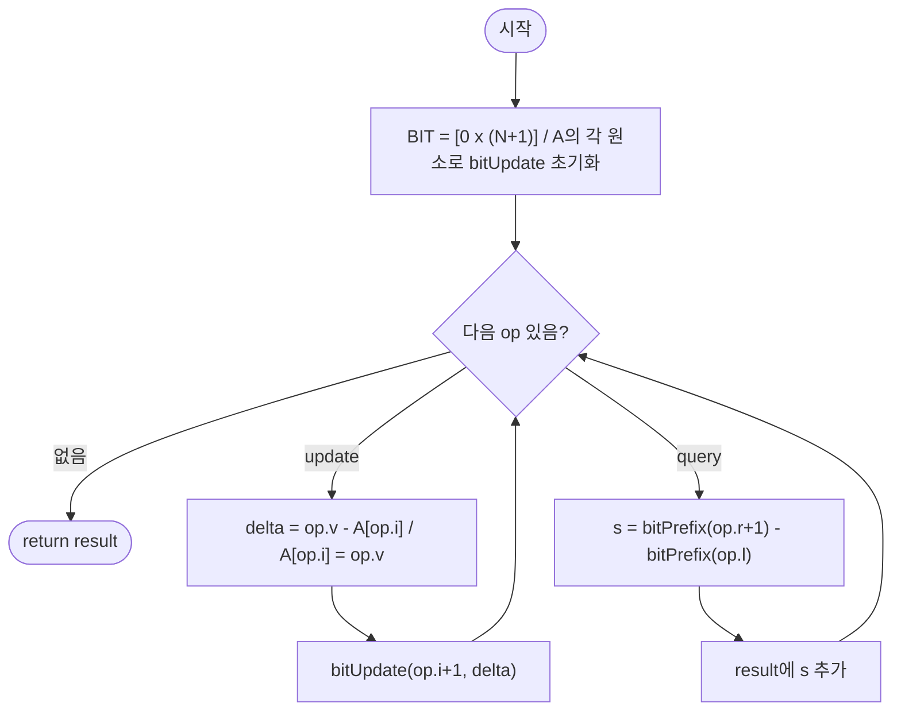

# fenwickRangeSum — 구간 합 질의 (동적 갱신, Fenwick Tree)

## 성능 목표 예측

| 항목 | 값 |
|------|-----|
| 배열 길이 | $1 \leq N \leq 100{,}000$ |
| 연산 수 | $1 \leq Q \leq 100{,}000$ |
| 원소 범위 | $-10{,}000 \leq A[i], v \leq 10{,}000$ |

**naive 접근의 문제점**: 정적 배열에 누적합을 전처리하면 질의는 $O(1)$이지만, 갱신 시 영향 받는 모든 누적합을 재계산해야 하므로 $O(N)$이다. $Q$개의 갱신이 있으면 전체 $O(NQ) = 10^{10}$으로 시간 초과가 발생한다.

**목표 복잡도**: 갱신 $O(\log N)$, 질의 $O(\log N)$, 전체 $O((N+Q) \log N) \approx 3.4 \times 10^6$. 충분히 통과한다.

**공간 복잡도**: BIT 배열 하나 $O(N)$.

---

## 목표 함수

```ts
function fenwickRangeSum(A: number[], ops: FenwickOp[]): number[]

type FenwickOp =
  | { type: "update"; i: number; v: number }
  | { type: "query"; l: number; r: number }
```

| 파라미터 | 의미 | 제약 |
|----------|------|------|
| `A` | 초기 정수 배열 | $1 \leq N \leq 100{,}000$ |
| `ops` | 갱신/질의 연산 목록 | $1 \leq Q \leq 100{,}000$ |

**반환값**: `query` 연산 결과만 순서대로 담은 배열.

**엣지케이스**:

| 입력 | 기대 출력 | 이유 |
|------|-----------|------|
| ops에 query만 있음 | 초기 배열 기반 구간 합 | 갱신 없음 |
| ops에 update만 있음 | `[]` | query가 없어 결과 없음 |
| `l == r`인 query | 단일 원소 값 | 길이 1 구간 |
| update 후 같은 구간 query | 갱신 반영된 합 | 동적 갱신 정확성 |

---

## 핵심 아이디어

### 원형 아이디어와 naive 접근

가장 단순한 접근: 배열 $A$를 그대로 유지하고, 질의마다 직접 합산한다.

```
update(i, v): A[i] = v                         // O(1)
query(l, r):  return sum(A[l..r])              // O(N)
```

질의가 $O(N)$이므로 $Q$개의 질의에 $O(NQ) = 10^{10}$이 된다. 반대로 누적합 배열을 유지하면 질의는 $O(1)$이지만 갱신이 $O(N)$이 된다.

### 어떤 관찰이 돌파구가 되는가

- **관찰 1**: 갱신과 질의 모두 $O(\log N)$으로 균형을 맞추는 자료구조가 필요하다. 배열의 인덱스를 이진수로 표현할 때 구조적 패턴이 존재한다.
- **관찰 2**: 각 인덱스 $i$의 최하위 비트(LSB) $= i \mathbin{\&} (-i)$는 $i$가 책임지는 구간의 길이를 결정한다. $BIT[i]$가 $A[i - \text{LSB}(i) + 1 \ldots i]$의 합을 저장하면, 접두어 합을 $O(\log N)$번의 덧셈으로 계산할 수 있다.
- **관찰 3**: 갱신 시에는 LSB를 더해가며 영향 받는 셀만 갱신하면 되고, 질의 시에는 LSB를 빼가며 필요한 구간만 더하면 된다. 두 연산 모두 $O(\log N)$번의 반복으로 끝난다.

### 관찰을 형식화: 상태/구조 정의

BIT 배열을 1-indexed로 정의한다 ($BIT[1..N]$).

$$BIT[i] = \sum_{k = i - \text{LSB}(i) + 1}^{i} A[k-1] \quad \text{(0-indexed A 기준)}$$

$$\text{LSB}(i) = i \mathbin{\&} (-i)$$

이 정의가 왜 이 형태여야 하는가: LSB 기반 구간 분할은 이진 표현의 자릿수 구조를 활용해 $O(\log N)$ 안에 접두어 합을 분해할 수 있는 유일한 단순한 방법이다. 다른 크기의 구간(예: 고정 크기 블록)을 쓰면 갱신이나 질의 중 하나가 $O(\sqrt{N})$ 또는 그 이상이 된다.

### 점화식 또는 핵심 연산

**접두어 합 $\text{prefix}(r)$ ($= \sum_{k=1}^{r} A[k-1]$):**

$$\text{prefix}(r) = BIT[r] + BIT[r - \text{LSB}(r)] + BIT[r - \text{LSB}(r) - \text{LSB}(\ldots)] + \ldots$$

$r$에서 LSB를 빼가며 $r > 0$인 동안 반복한다. 각 단계에서 $r$의 최하위 1 비트가 제거되므로 최대 $\lfloor \log_2 N \rfloor + 1$번 반복한다.

**구간 합:**

$$\text{sum}(l, r) = \text{prefix}(r+1) - \text{prefix}(l)$$

- $\text{prefix}(r+1)$: $A[0..r]$의 합
- $\text{prefix}(l)$: $A[0..l-1]$의 합

**점 갱신 $\text{update}(i, \delta)$ (1-indexed $i$):**

$i$에서 LSB를 더해가며 $i \leq N$인 동안 $BIT[i] \mathrel{+}= \delta$를 반복한다.

### 정당성 — 왜 이것이 옳은가

$\text{prefix}(r)$의 정확성: 임의의 양의 정수 $r$은 이진 표현에서 $O(\log r)$개의 1 비트를 가진다. LSB를 빼가면 각 단계에서 하나의 1 비트가 제거되어 정확히 그 비트에 해당하는 구간이 $BIT$에서 읽힌다. 이 구간들이 $[1, r]$ 을 완전히 분할하므로 합이 올바르다.

$\text{update}(i, \delta)$의 정확성: $BIT[j]$는 $j - \text{LSB}(j) < i \leq j$인 경우에만 $A[i]$를 포함한다. LSB를 더해가면 정확히 이 조건을 만족하는 모든 $j$를 순서대로 방문한다.

음수 원소도 동일하게 동작한다 — $\delta$에 음수가 허용되며 덧셈 연산이 그대로 적용된다.

### 구현 디테일과 최적화

- **1-indexed**: BIT는 1부터 시작해야 한다. $BIT[0]$은 사용하지 않는다 ($\text{LSB}(0) = 0$이라 갱신 루프가 무한 루프에 빠진다).
- **갱신 시 delta 계산**: `update(i, v)` 연산은 $A[i]$를 $v$로 교체하는 것이므로, $\delta = v - A[i]$를 BIT에 적용하고 $A[i] \leftarrow v$로 동기화해야 한다. $A$ 배열을 별도로 유지하지 않으면 $\delta$ 계산이 불가능하다.
- **초기화**: 초기 배열 $A$를 BIT에 반영할 때 각 $A[i]$에 대해 $\text{update}(i+1, A[i])$를 호출한다. 총 $O(N \log N)$이다.
- **함정**: `prefix(l)` 인자에 `op.l`을 그대로 쓰면 0-indexed 오프셋 오류가 발생한다. $\text{sum}(l, r) = \text{prefix}(r+1) - \text{prefix}(l)$임을 주의한다 (1-indexed BIT 기준).
- **함정**: 갱신 루프 `i += LSB(i)`에서 $N$을 초과하면 중단해야 한다. 초과 상태에서 `BIT[i]`에 접근하면 범위 오류가 발생한다.

---

## 수도 코드와 Activity Diagram

### 의사코드

```
function fenwickRangeSum(A, ops):
    N   ← len(A)
    BIT ← 크기 N+1의 0 배열           // 불변식: BIT[i] = A[i-LSB(i)+1..i]의 합 (1-indexed)

    for i from 0 to N-1:             // 초기 배열 반영
        bitUpdate(BIT, i+1, A[i], N)

    result ← []
    for each op in ops:
        if op.type == "update":
            delta ← op.v - A[op.i]   // 불변식: A와 BIT 항상 동기화
            A[op.i] ← op.v
            bitUpdate(BIT, op.i+1, delta, N)
        else:  // query
            s ← bitPrefix(BIT, op.r+1) - bitPrefix(BIT, op.l)
            result.push(s)

    return result

bitUpdate(BIT, i, delta, N):
    while i <= N:                    // 불변식: BIT[i]는 A[i]를 포함하는 모든 셀 갱신
        BIT[i] += delta
        i += i & (-i)               // 다음 상위 셀로 이동

bitPrefix(BIT, i):
    sum ← 0                         // 불변식: sum = BIT가 덮는 구간들의 합
    while i > 0:
        sum += BIT[i]
        i -= i & (-i)               // 다음 하위 구간으로 이동
    return sum
```

### Activity Diagram



**핵심 불변식**: 임의 시점에 $BIT[i] = \sum_{k=i-\text{LSB}(i)+1}^{i} A[k-1]$이 항상 성립하며, $A$ 배열과 $BIT$는 항상 동기화된 상태를 유지한다. 이 불변식이 깨지면 질의 결과가 잘못된다.
