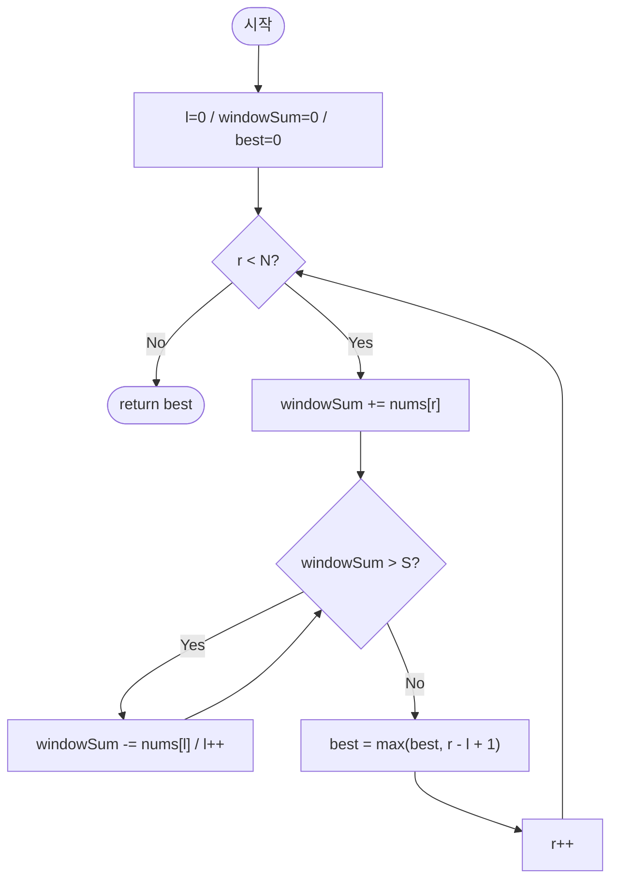

# longestSubarrayAtMostSum — 합 ≤ S인 가장 긴 연속 부분 배열

## 성능 목표 예측

| 항목 | 값 |
|------|-----|
| 입력 크기 | $1 \leq N \leq 100{,}000$ |
| 원소 범위 | $0 \leq nums[i] \leq 10{,}000$ (비음의 정수) |
| 합 상한 | $0 \leq S \leq 10^9$ |

**naive 접근의 문제점**: 모든 시작점 $l$과 끝점 $r \geq l$을 열거하고 합을 계산하면 $O(N^2)$이다. $N = 10^5$에서 $10^{10}$ 연산으로 시간 초과가 발생한다.

**목표 복잡도**: 시간 $O(N)$, 공간 $O(1)$. 투 포인터(슬라이딩 윈도우)로 각 인덱스를 최대 한 번 방문한다.

**공간 복잡도**: 포인터와 합 변수만 유지하면 $O(1)$이다.

---

## 목표 함수

```ts
function longestSubarrayAtMostSum(nums: number[], S: number): number
```

| 파라미터 | 의미 | 제약 |
|----------|------|------|
| `nums` | 비음의 정수 배열 | $1 \leq N \leq 100{,}000$, $0 \leq nums[i] \leq 10{,}000$ |
| `S` | 합 상한 | $0 \leq S \leq 10^9$ |

**반환값**: 합이 $S$ 이하인 연속 부분 배열 중 가장 긴 것의 길이. 없으면 $0$.

**엣지케이스**:

| 입력 | 기대 출력 | 이유 |
|------|-----------|------|
| `S=0, nums=[1,2,3]` | `0` | 합 $\leq 0$인 구간 없음 (모두 양수) |
| `S=0, nums=[0,0,0]` | `3` | 모두 $0$이면 합 $= 0 \leq S$ |
| `S=100, nums=[1,2,3]` | `3` | 전체 합 $6 \leq 100$ |
| `S=3, nums=[4,1,2]` | `2` | 첫 원소가 $S$ 초과 — 포함 불가 |

---

## 핵심 아이디어

### 원형 아이디어와 naive 접근

모든 시작점 $l$과 끝점 $r \geq l$의 쌍을 열거해 합을 계산한다.

```
best = 0
for l from 0 to N-1:
    s = 0
    for r from l to N-1:
        s += nums[r]
        if s <= S:
            best = max(best, r - l + 1)
        else:
            break  // 비음의 정수이므로 더 늘어도 합이 증가
```

최악 $O(N^2)$이다. 각 $l$마다 $r$을 처음부터 확장하는 중복 계산이 낭비의 원인이다.

### 어떤 관찰이 돌파구가 되는가

- **관찰 1**: 배열의 원소가 모두 비음수이면, 구간 $[l, r]$의 합은 $r$을 늘릴 때 단조 증가하고 $l$을 늘릴 때 단조 감소한다. 이 단조성이 투 포인터를 가능하게 한다.
- **관찰 2**: 구간 $[l, r]$의 합이 $S$를 초과하면, $r$을 더 늘려도 합이 감소하지 않는다. 따라서 $l$을 오른쪽으로 이동해 합을 줄여야 한다.
- **관찰 3**: $l$과 $r$ 각각 최대 $N$번 이동하므로 전체 연산이 $O(N)$이다. 음수 원소가 있으면 $l$ 이동 시 합이 오히려 증가할 수 있어 이 전략이 성립하지 않는다.

### 관찰을 형식화: 상태/구조 정의

두 포인터 $l$, $r$과 현재 윈도우 합 $windowSum$을 유지한다.

**불변식**: $r$ 처리 후 while 종료 시점에 $windowSum \leq S$이며, $[l, r]$ 구간이 합 $\leq S$를 만족하는 가장 긴 구간 (끝점 $r$ 고정 시).

이 정의가 왜 이 형태여야 하는가: $r$을 고정하고 $l$을 가능한 한 왼쪽에 두는 전략이 최적이다. $l$을 필요 이상으로 오른쪽에 두면 구간이 짧아져 손해다. 단조 증가 합 성질 때문에 $l$을 한 번 이동하면 다시 왼쪽으로 돌아올 필요가 없다.

### 점화식 또는 핵심 연산

$r = 0, 1, \ldots, N-1$에 대해:

$$windowSum \mathrel{+}= nums[r]$$

$windowSum > S$인 동안:

$$windowSum \mathrel{-}= nums[l], \quad l \mathrel{+}= 1$$

그 후:

$$best = \max(best, r - l + 1)$$

- $windowSum \mathrel{+}= nums[r]$: 윈도우를 오른쪽으로 확장
- $windowSum \mathrel{-}= nums[l], l\mathrel{+}=1$: 합이 $S$ 초과이면 왼쪽 원소 제거
- $r - l + 1$: 현재 유효한 윈도우 크기

### 정당성 — 왜 이것이 옳은가

답의 최적성을 증명한다. 어떤 최적 구간 $[l^*, r^*]$이 있다고 하자. $r$이 $r^*$에 도달하는 시점에, $l \leq l^*$임을 귀납적으로 보인다.

$r < r^*$인 동안 $l$은 합이 $S$ 초과일 때만 이동한다. $[l^*, r]$ 구간의 합이 항상 $\leq [l^*, r^*]$의 합 $\leq S$이므로, $l > l^*$로 이동할 필요가 없다. 따라서 $r = r^*$ 시점에 $l \leq l^*$이고 $r^* - l + 1 \geq r^* - l^* + 1 = $ 최적 길이가 된다.

비음의 정수 보장: `while windowSum > S` 루프에서 $l \leq r$이 성립한다. $nums[l] \geq 0$이므로 $l$을 이동하면 $windowSum$이 단조 감소해 루프가 반드시 종료된다. 음수 원소가 있으면 $l$ 이동 시 합이 증가해 무한 루프 위험이 생긴다.

### 구현 디테일과 최적화

- `windowSum`을 누적합 배열 없이 실시간으로 관리해 $O(1)$ 공간을 달성한다.
- **함정**: `while` 대신 `if`를 사용하면 합이 $S$를 크게 초과할 때 윈도우를 충분히 줄이지 못한다. 반드시 `while`을 사용해야 한다.
- **함정**: `l > r` 조건 없이 `l++`를 반복하면 이론상 $l > r$이 될 수 있다. 비음의 배열에서는 $nums[r]$ 자체가 $S$ 초과인 경우에만 이 상황이 발생하며, 그 후 $windowSum = 0$이 되어 루프가 종료된다.
- 모든 원소가 $0$인 경우: $windowSum$이 항상 $0 \leq S$이므로 $l$이 이동하지 않고 $best = N$이 된다.
- $S = 0$이고 모두 양수인 경우: $r = 0$에서 이미 $windowSum = nums[0] > 0 = S$이므로 $l$을 이동해 $l = 1$, $r - l + 1 = 0$이 된다. $best = 0$ 반환.

---

## 수도 코드와 Activity Diagram

### 의사코드

```
function longestSubarrayAtMostSum(nums, S):
    l         ← 0
    windowSum ← 0                      // 불변식: nums[l..r-1]의 합
    best      ← 0                      // 불변식: 지금까지 본 유효 구간의 최대 길이

    for r from 0 to N-1:
        windowSum += nums[r]           // 윈도우 확장

        while windowSum > S:           // 합이 상한 초과 시 왼쪽 축소
            windowSum -= nums[l]
            l++

        // 불변식: windowSum <= S, [l, r]이 유효한 구간
        best ← max(best, r - l + 1)

    return best
```

### Activity Diagram



**핵심 불변식**: `while` 종료 직후 $windowSum \leq S$이며 $[l, r]$은 합 $\leq S$를 만족하는 끝점 $r$ 고정 시 가장 긴 구간이다. $l \leq r+1$이 항상 성립한다.
