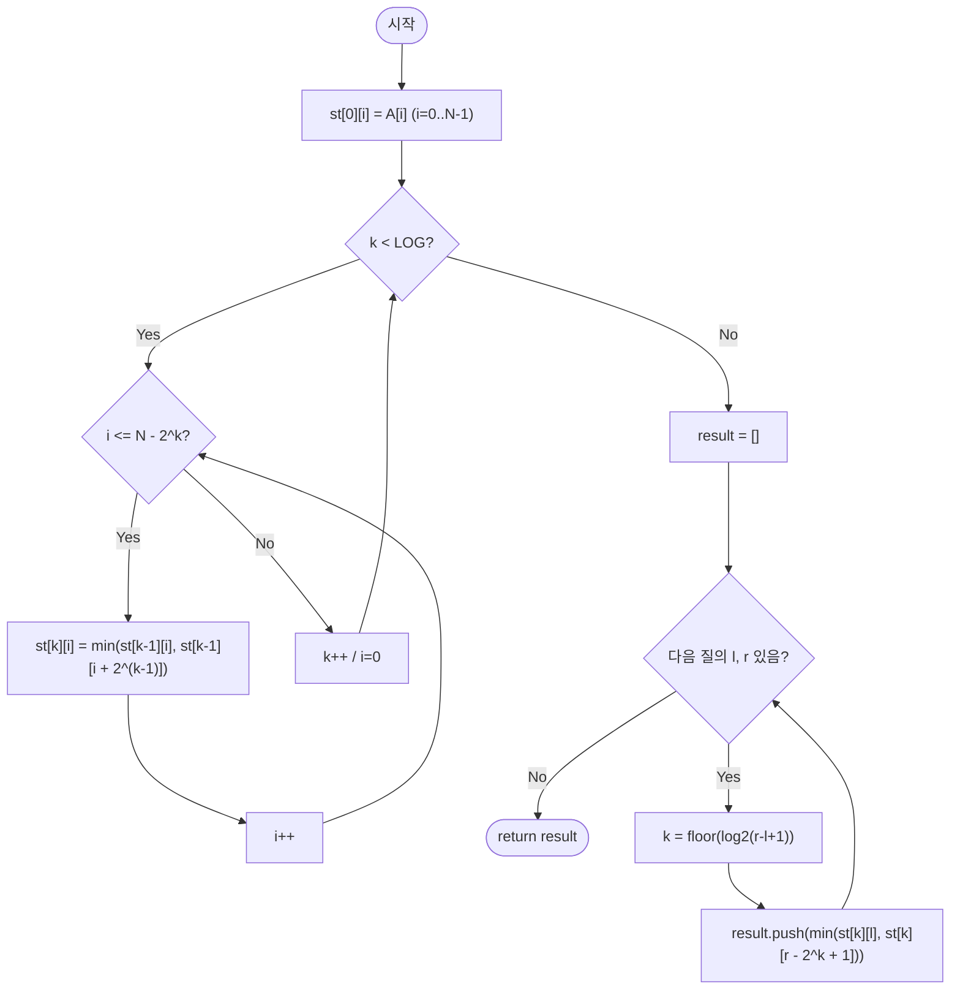

# sparseTableRangeMin — 구간 최솟값 질의 (정적 배열, Sparse Table)

## 성능 목표 예측

| 항목 | 값 |
|------|-----|
| 배열 길이 | $1 \leq N \leq 100{,}000$ |
| 질의 수 | $1 \leq Q \leq 100{,}000$ |
| 원소 범위 | $-10^9 \leq A[i] \leq 10^9$ |

**naive 접근의 문제점**: 각 질의마다 구간을 선형 탐색하면 $O(N)$이다. $Q$개에 전체 $O(NQ) = 10^{10}$으로 시간 초과가 발생한다.

**목표 복잡도**: 전처리 $O(N \log N)$, 질의당 $O(1)$, 전체 $O(N \log N + Q) \approx 1.7 \times 10^6$. 정적 배열이라는 조건 덕분에 질의를 $O(1)$로 낮출 수 있다.

**공간 복잡도**: $O(N \log N)$ — 테이블의 각 레벨 $k$에 $N$개의 값을 저장한다.

---

## 목표 함수

```ts
function sparseTableRangeMin(A: number[], queries: Array<[number, number]>): number[]
```

| 파라미터 | 의미 | 제약 |
|----------|------|------|
| `A` | 정수 배열 (정적) | $1 \leq N \leq 100{,}000$ |
| `queries` | 질의 배열 $[(l, r), \ldots]$ | $1 \leq Q \leq 100{,}000$, $0 \leq l \leq r \leq N-1$ |

**반환값**: 각 질의 구간 $[l, r]$의 최솟값 배열.

**엣지케이스**:

| 입력 | 기대 출력 | 이유 |
|------|-----------|------|
| `l == r` | `[A[l]]` | 단일 원소 |
| `N=1, queries=[[0,0]]` | `[A[0]]` | 배열 길이 1 |
| `queries=[]` | `[]` | 질의 없음 |
| 음수 원소 포함 | 올바른 최솟값 | $\min$ 연산이 음수에서도 동작 |

---

## 핵심 아이디어

### 원형 아이디어와 naive 접근

각 질의마다 구간을 직접 탐색한다.

```
for each (l, r) in queries:
    result.push(min(A[l], A[l+1], ..., A[r]))
```

$O(N)$씩 $Q$번이므로 $O(NQ) = 10^{10}$이다. Segment Tree는 갱신이 있을 때 유용하지만, 갱신이 없으면 $O(\log N)$ 질의가 최적이 아니다 — $O(1)$ 질의를 달성할 수 있다.

### 어떤 관찰이 돌파구가 되는가

- **관찰 1**: $\min$ 연산은 멱등성(idempotent)이 있다: $\min(x, x) = x$. 따라서 같은 원소를 두 번 포함해도 결과가 변하지 않는다. 이것이 구간을 "겹쳐서" 덮는 것을 허용한다.
- **관찰 2**: $2$의 거듭제곱 길이의 구간($2^0, 2^1, 2^2, \ldots$)의 최솟값을 미리 계산해두면, 임의 길이 구간을 두 개의 $2^k$-구간으로 덮을 수 있다 (겹침 허용).
- **관찰 3**: 구간 $[l, r]$의 길이 $len = r - l + 1$에 대해 $k = \lfloor \log_2 len \rfloor$로 설정하면, $[l, l+2^k-1]$과 $[r-2^k+1, r]$이 $[l, r]$을 완전히 덮는다. 두 구간의 최솟값이 $[l, r]$의 최솟값이다.

### 관찰을 형식화: 상태/구조 정의

Sparse Table $st$를 2D 배열로 정의한다.

$$st[k][i] = \min\bigl(A[i], A[i+1], \ldots, A[i + 2^k - 1]\bigr)$$

즉, $st[k][i]$는 인덱스 $i$에서 시작하는 길이 $2^k$인 구간의 최솟값이다.

유효 범위: $0 \leq k \leq \lfloor \log_2 N \rfloor$, $0 \leq i \leq N - 2^k$.

이 정의가 왜 이 형태여야 하는가: 모든 가능한 구간을 저장하면 $O(N^2)$ 공간이 필요하다. $2^k$ 길이 구간만 저장하면 $O(N \log N)$ 공간으로 줄어들고, 겹침 허용 덕분에 임의 구간을 두 개의 저장된 구간으로 표현할 수 있다. 이것이 $\min$의 멱등성이 없는 연산(예: 합)에서는 같은 기법이 동작하지 않는 이유다.

### 점화식 또는 핵심 연산

**전처리 단계** ($O(N \log N)$):

$$st[0][i] = A[i] \quad (0 \leq i < N)$$

$$st[k][i] = \min\bigl(st[k-1][i],\; st[k-1][i + 2^{k-1}]\bigr) \quad (k \geq 1,\; 0 \leq i \leq N - 2^k)$$

유도: $st[k][i]$는 길이 $2^k$인 구간이다. 이를 절반으로 나누면 $[i, i+2^{k-1}-1]$과 $[i+2^{k-1}, i+2^k-1]$이다. 각각 $st[k-1][i]$와 $st[k-1][i+2^{k-1}]$이다.

**질의 단계** ($O(1)$):

$$k = \lfloor \log_2(r - l + 1) \rfloor$$

$$\text{min}(l, r) = \min\bigl(st[k][l],\; st[k][r - 2^k + 1]\bigr)$$

- $st[k][l]$: 구간 $[l, l+2^k-1]$의 최솟값
- $st[k][r-2^k+1]$: 구간 $[r-2^k+1, r]$의 최솟값
- 두 구간의 합집합이 $[l, r]$을 완전히 덮는다 ($2^k \leq r-l+1$이므로)

### 정당성 — 왜 이것이 옳은가

귀납적으로 $st[k][i] = \min(A[i..i+2^k-1])$임을 증명한다.

기저 ($k=0$): $st[0][i] = A[i]$는 단일 원소의 최솟값이다.

귀납 단계: $st[k-1][\cdot]$이 올바르다고 가정한다. $st[k][i] = \min(st[k-1][i], st[k-1][i+2^{k-1}]) = \min(A[i..i+2^{k-1}-1], A[i+2^{k-1}..i+2^k-1]) = \min(A[i..i+2^k-1])$.

질의 정확성: $k = \lfloor \log_2(r-l+1) \rfloor$이면 $2^k \leq r-l+1$이고 $2^{k+1} > r-l+1$이다. 두 구간 $[l, l+2^k-1]$과 $[r-2^k+1, r]$은:
- 겹침: $l+2^k-1 \geq r-2^k+1 \Leftrightarrow 2^{k+1} \geq r-l+2$. $2^{k+1} > r-l+1$이므로 $2^{k+1} \geq r-l+2$이 성립.
- 합집합이 $[l, r]$을 덮음: 두 구간의 시작이 $l$이고 끝이 $r$임은 자명하다.

$\min$의 멱등성에 의해 겹치는 부분이 결과에 영향을 주지 않는다.

### 구현 디테일과 최적화

- **$\log_2$ 계산**: 질의마다 `Math.floor(Math.log2(r-l+1))`을 계산하거나, 미리 $\log_2$ 룩업 테이블을 $O(N)$에 구축해 $O(1)$에 접근한다. 룩업 테이블: `log2[1] = 0`, `log2[i] = log2[i/2] + 1`.
- **전처리 루프 순서**: 반드시 $k$ 바깥, $i$ 안쪽으로 순회해야 한다. $st[k][i]$가 $st[k-1][i]$와 $st[k-1][i+2^{k-1}]$을 참조하므로, $k-1$ 레벨이 완전히 채워진 후 $k$ 레벨을 채워야 한다.
- **함정**: `st[k][i + 2^(k-1)]`에서 $i + 2^{k-1}$이 $N$을 초과하면 범위 오류가 발생한다. 루프 상한을 `N - 2^k`로 제한해야 한다.
- **함정**: 질의에서 $r - 2^k + 1 < l$이 되는 경우는 없다 ($k = \lfloor \log_2(r-l+1) \rfloor \leq r-l$이므로 $r - 2^k + 1 \geq r - (r-l) = l$).
- **합 연산에 적용 불가**: $\min$이 아닌 합을 구해야 하면 겹침 허용이 잘못된 결과를 낸다. 합 질의에는 누적합 또는 Fenwick Tree를 사용해야 한다.

---

## 수도 코드와 Activity Diagram

### 의사코드

```
function sparseTableRangeMin(A, queries):
    N   ← len(A)
    LOG ← floor(log2(N)) + 1
    st  ← LOG × N 크기의 2D 배열            // 불변식: st[k][i] = A[i..i+2^k-1]의 최솟값

    for i from 0 to N-1:
        st[0][i] ← A[i]                    // 불변식: 길이 1 구간

    for k from 1 to LOG-1:
        for i from 0 to N - (1 << k):
            st[k][i] ← min(st[k-1][i],     // 왼쪽 절반
                           st[k-1][i + (1 << (k-1))])  // 오른쪽 절반

    result ← []
    for each (l, r) in queries:
        k ← floor(log2(r - l + 1))         // 두 구간이 [l,r]을 덮는 최대 지수
        result.push(min(st[k][l],
                        st[k][r - (1 << k) + 1]))

    return result
```

### Activity Diagram



**핵심 불변식**: 전처리 완료 후 $st[k][i] = \min(A[i], \ldots, A[i+2^k-1])$이 모든 유효한 $(k, i)$ 쌍에 대해 성립하며, 테이블은 질의 단계에서 변경되지 않는다. $\min$의 멱등성에 의해 겹치는 두 구간의 $\min$이 전체 구간의 $\min$과 동일하다.
