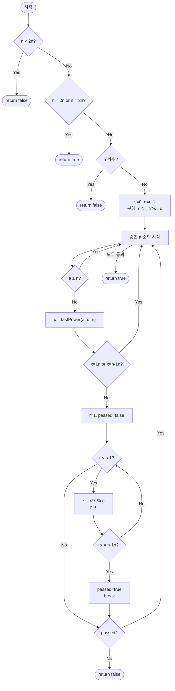

# millerRabin — 밀러-라빈 소수 판정 해설

## 성능 목표 예측

| 항목 | 값 |
|------|-----|
| 입력 범위 | bigint $n < 2^{64}$ |
| 시간 복잡도 | $O(k \log^2 n)$ ($k = 12$, 증인 수) |
| 공간 복잡도 | $O(1)$ |

**naive 접근의 한계.** 시행 나눗셈은 $O(\sqrt{n})$이다. $n \approx 2^{64}$이면 $\sqrt{n} \approx 2^{32} \approx 4 \times 10^9$번의 나눗셈이 필요해 실용 불가능하다. 페르마 테스트 $a^{n-1} \equiv 1 \pmod{n}$는 카마이클 수(예: 561)에서 잘못 통과하는 문제가 있다.

**목표 복잡도와 근거.** 각 증인 $a$에 대해 `fastPower`로 $a^d \bmod n$을 $O(\log n)$ 번의 곱셈으로 계산하고, 이후 최대 $s = O(\log n)$번의 제곱 연산을 수행한다. 총 $k \cdot O(\log^2 n)$이지만 $k = 12$는 상수이고 실제로는 매우 빠르다. 64-bit 범위에서 이 12개 증인으로 결정적으로 올바르다.

**공간 트레이드오프.** 상태 변수만 사용하므로 $O(1)$ 추가 공간이다.

---

## 목표 함수

```ts
function millerRabin(n: bigint): boolean
```

| 파라미터 | 의미 | 제약 |
|----------|------|------|
| `n` | 판별할 정수 | bigint, $n < 2^{64}$ |

**반환값**: $n$이 소수이면 `true`, 합성수이면 `false`.

**엣지케이스**:
1. `n = 0n` 또는 `n = 1n` → `false`
2. `n = 2n` → `true` (최소 소수)
3. `n = 4n` → `false` (짝수 합성수)
4. `n = 561n` → `false` (카마이클 수, 페르마 테스트는 통과하지만 밀러-라빈은 탐지)
5. `n = 18446744073709551557n` ($2^{64}$ 미만의 큰 소수) → `true`

---

## 핵심 아이디어

### 원형 아이디어와 naive 접근

페르마의 소정리는 "$p$가 소수이고 $\gcd(a, p) = 1$이면 $a^{p-1} \equiv 1 \pmod{p}$"임을 보장한다. 이를 뒤집어 "$a^{n-1} \not\equiv 1 \pmod{n}$이면 $n$은 합성수"라는 테스트로 쓸 수 있다. 그러나 카마이클 수는 모든 $a$에 대해 페르마 테스트를 통과하는 합성수이므로 페르마 테스트만으로는 불충분하다.

### 어떤 관찰이 돌파구가 되는가

- **핵심 관찰 1**: 소수 $p$에서 $x^2 \equiv 1 \pmod{p}$의 해는 $x \equiv \pm 1 \pmod{p}$뿐이다. 즉, 소수에서는 "제곱해서 1이 되기 전 단계"가 반드시 $-1$이어야 한다.
- **핵심 관찰 2**: $n - 1 = 2^s \cdot d$ ($d$ 홀수)로 분해하면, $a^{n-1} = (a^d)^{2^s}$이다. $a^d$부터 시작해 반복적으로 제곱하는 과정에서, 소수라면 $\equiv -1$을 반드시 한 번 거쳐야 $\equiv 1$이 된다.
- **핵심 관찰 3**: 합성수는 위 조건을 위반하는 증인 $a$가 존재한다. 적절한 증인 집합을 쓰면 64-bit 이하에서 결정적으로 올바른 판정이 가능하다.

### 관찰을 형식화: 상태/구조 정의

$n - 1 = 2^s \cdot d$ ($d$ 홀수)로 분해한다. 증인 $a$에 대해 수열을 정의한다:

$$x_0 = a^d \bmod n, \quad x_{r+1} = x_r^2 \bmod n \quad (r = 0, 1, \ldots, s-1)$$

$n$이 소수라면 이 수열에서 반드시 다음 중 하나가 성립한다:
1. $x_0 \equiv 1 \pmod{n}$ (초기값이 이미 1)
2. 어떤 $r \in \{0, 1, \ldots, s-1\}$에서 $x_r \equiv -1 \pmod{n}$ (제곱 전에 -1 등장)

이 조건이 성립하지 않으면 $n$은 확실히 합성수이다("강한 합성수 증인"이 발견됨).

이 형태여야 하는 이유: 소수에서 $x^2 \equiv 1$의 해가 $\pm 1$뿐이라는 사실을 반복 제곱 과정에서 추적하기 때문이다. 합성수에서는 $x^2 \equiv 1$이어도 $x \not\equiv \pm 1$인 해가 존재할 수 있다.

### 점화식 또는 핵심 연산

$$n - 1 = 2^s \cdot d, \quad d \text{ 홀수}$$

증인 $a$에 대한 강한 의사 소수 조건:

$$a^d \equiv 1 \pmod{n} \quad \text{또는} \quad \exists\, r \in [0, s) : a^{2^r d} \equiv -1 \pmod{n}$$

**유도**: $n$이 소수라고 하자. $a^{n-1} \equiv 1 \pmod{n}$ (페르마). $a^{n-1} = (a^{d})^{2^s}$이므로, $a^{d \cdot 2^s} \equiv 1$이다. $a^d \not\equiv 1$이면 최초로 $\equiv 1$이 되는 시점 $r^* \in [1, s]$이 존재하며, 그 직전 $a^{d \cdot 2^{r^*-1}} \equiv x$에서 $x^2 \equiv 1$이고 $x \not\equiv 1$이므로 (소수에서) $x \equiv -1$이어야 한다.

### 정당성 — 왜 이것이 옳은가

**결정적 정확성**: $n < 2^{64}$이면 $\{2, 3, 5, 7, 11, 13, 17, 19, 23, 29, 31, 37\}$ 12개 증인만으로 오류가 없음이 계산으로 확인됐다.

**귀납 정당성**: 소수 $n$이면 모든 증인에 대해 강한 의사 소수 조건이 만족된다(위 유도). 따라서 어떤 증인에서도 `false`를 반환하지 않는다.

**까다로운 케이스**: $n = 2, 3$은 특수 처리(즉시 `true`)가 필요하다. 짝수 $n$은 $d$ 분해 전에 걸러야 한다. $a \geq n$인 증인은 건너뛰어야 한다 ($a \bmod n$을 쓰거나 스킵).

### 구현 디테일과 최적화

- **$n - 1 = 2^s \cdot d$ 분해**: `d = n - 1`, `s = 0`으로 시작해 `d % 2n === 0n`인 동안 `d /= 2n`, `s++`를 반복한다.
- **빠른 사전 걸러내기**: `n < 2n`, `n === 2n`, `n === 3n`, `n % 2n === 0n`을 먼저 처리해 불필요한 연산을 피한다.
- **증인 범위 체크**: $a \geq n$인 증인은 `continue`로 건너뛴다 (예: $n = 2, 3$인 경우).
- **bigint 곱셈 비용**: bigint 모듈러 곱셈은 JS number보다 느리므로, 가능하면 $n < 2^{53}$이면 number로 처리하는 최적화도 가능하다.
- **함정**: $s = 0$이 되는 경우($n - 1$이 홀수, 즉 $n$이 짝수)는 사전 걸러내기로 방지해야 한다.

---

## 수도 코드와 Activity Diagram

### 의사코드

```
WITNESSES = [2n, 3n, 5n, 7n, 11n, 13n, 17n, 19n, 23n, 29n, 31n, 37n]

function millerRabin(n):
    if n < 2n: return false
    if n == 2n or n == 3n: return true
    if n % 2n == 0n: return false

    // n-1 = 2^s * d (d 홀수) 분해
    s = 0; d = n - 1n
    // 불변식: n - 1 = 2^s * d
    while d % 2n == 0n:
        d /= 2n; s += 1

    for each a in WITNESSES:
        if a >= n: continue              // 유효하지 않은 증인 스킵

        x = fastPower(a, d, n)           // x = a^d mod n
        if x == 1n or x == n - 1n:
            continue                     // 이 증인 통과

        // 불변식: x = a^(d * 2^r) mod n, r 증가
        passed = false
        for r = 1 to s - 1:
            x = x * x % n               // x = a^(d * 2^r) mod n
            if x == n - 1n:
                passed = true; break    // -1 발견 → 통과
        if not passed: return false     // 강한 합성수 증인 발견

    return true                         // 모든 증인 통과 → 소수
```

### Activity Diagram



**핵심 불변식**: 증인 $a$의 내부 루프에서, $x = a^{d \cdot 2^r} \bmod n$이 항상 성립하며 $r$이 증가할수록 $n - 1$이 나타나야 한다.
