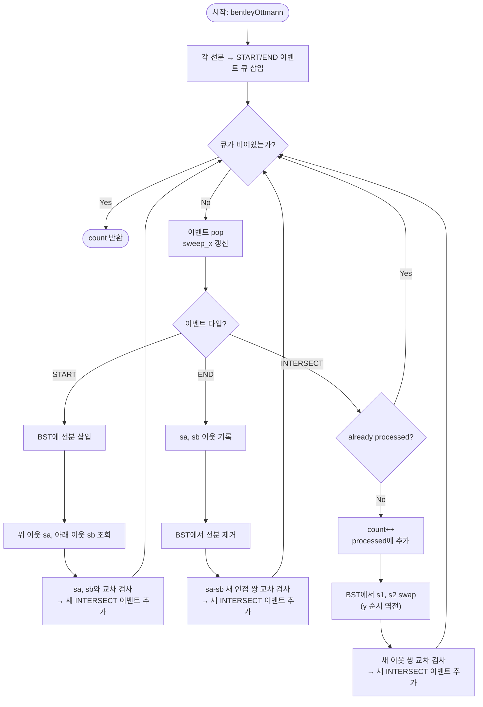

# bentleyOttmann 해설 — 스위프 라인

## 성능 목표 예측

| 제약 항목 | 값 |
|-----------|-----|
| 선분 수 $n$ | $1 \leq n \leq 10^5$ |
| 교차 쌍 수 $k$ | $0 \leq k \leq \binom{n}{2}$ |
| 좌표 범위 | $-10^9 \leq x, y \leq 10^9$ |

**naive 접근의 시간복잡도**

가장 단순한 접근은 모든 선분 쌍에 대해 교차 여부를 검사하는 브루트 포스다.

$$T_{\text{naive}}(n) = \binom{n}{2} = \frac{n(n-1)}{2} = O(n^2)$$

$n = 10^5$에서 $\approx 5 \times 10^9$ 비교가 필요하므로 제한 초과다. 이 방법은 "두 선분이 멀리 있어 절대 교차할 수 없어도" 비교를 건너뛸 방법이 없다. 핵심 낭비는 "근처에 없는 선분 쌍도 비교한다"는 것이다.

**목표 복잡도**: $O((n + k) \log n)$ — 이벤트 $n + k$번 처리, 각 처리마다 우선순위 큐·BST 연산 $O(\log n)$.

**공간 복잡도**: $O(n + k)$ — 이벤트 큐 최대 $n + k$개, BST 최대 $n$개 선분.

**메모리 트레이드오프**: 교차 이벤트를 발견할 때마다 큐에 추가하므로 $k$가 크면 메모리도 증가한다. $k = O(n^2)$인 최악의 경우 공간도 $O(n^2)$이 되어 실용적 한계가 있다.

---

## 목표 함수

```typescript
function bentleyOttmann(segments: Segment[]): number
```

| 파라미터 | 타입 | 의미 | 제약 |
|----------|------|------|------|
| `segments` | `Segment[]` | 선분 배열 | $1 \leq n \leq 10^5$, 좌표 $[-10^9, 10^9]$ |

**반환값**: 교차하는 선분 **쌍**의 수 ($\geq 0$). 같은 점에서 여러 쌍이 만나도 쌍 단위로 카운트한다.

$$\text{count}(S) = |\{(i, j) \mid i < j,\; s_i \cap s_j \neq \emptyset\}|$$

**엣지케이스**:
1. **공유 끝점**: 두 선분이 끝점만 공유해도 교차 1쌍으로 카운트.
2. **겹치는 구간**: 두 선분이 구간을 공유 → 교차 1쌍으로 카운트.
3. **단일 선분** ($n = 1$): 교차 불가, 0 반환.
4. **수직 선분** ($x_1 = x_2$): 이벤트 처리 순서에 주의. 시작과 끝이 같은 $x$에서 발생.

---

## 핵심 아이디어

### 원형 아이디어와 naive 접근

브루트 포스의 문제는 "공간적으로 멀리 있는 선분 쌍도 비교한다"는 것이다. 이를 해결하기 위한 첫 번째 생각은 "어떤 두 선분도 교차하기 직전에는 스위프 라인 위에서 서로 인접해 있어야 한다"는 관찰이다. 이 관찰이 있더라도, 모든 $x$ 위치에서 인접 관계를 다시 확인하면 여전히 비효율적이다. 폭발 지점은 "연속적인 $x$를 처리할 수 없다"는 것이다. 이를 해결하기 위해 상태가 변하는 특정 $x$ 위치(이벤트)에서만 처리하는 이벤트 기반 접근이 필요하다.

### 어떤 관찰이 돌파구가 되는가

- **관찰 1**: 스위프 라인이 이동하면서 선분들의 $y$ 좌표 순서가 바뀌는 순간은 정확히 세 가지 이벤트에서만 발생한다: 선분 시작, 선분 끝, 교차점. 이 이벤트 외에는 BST의 순서가 변하지 않는다.
- **관찰 2**: 두 선분이 교차하려면, 교차점 바로 직전에 스위프 라인에서 두 선분이 반드시 **인접**해 있어야 한다. 따라서 인접하지 않은 선분 쌍은 교차 검사 자체를 건너뛸 수 있다.
- **관찰 3**: 교차점에서 두 선분의 $y$ 순서가 교환된다. 이 swap 이후에 새로 인접해진 쌍만 추가로 교차를 검사하면 된다.

### 관찰을 형식화: 상태/구조 정의

**이벤트 큐**: $x$ 좌표 기준 최솟값 우선 큐(min-heap). 동일 $x$에서 우선순위: 시작 이벤트 < 교차 이벤트 < 끝 이벤트. (시작이 끝보다 먼저 처리되어야 새 선분이 삽입된 후 교차를 확인할 수 있다.)

**상태 BST**: 현재 스위프 라인($x = x_{\text{sweep}}$)과 교차하는 모든 선분을 $y$ 좌표 오름차순으로 관리하는 균형 이진 탐색 트리. 스위프 $x$가 변할 때마다 각 선분의 현재 $y$ 값이 바뀌므로, BST의 비교 함수가 동적으로 계산된다.

**처리된 쌍 집합**: 이미 카운트된 교차 쌍을 저장. 중복 카운트를 방지.

이 형태여야 하는 이유: BST가 현재 스위프 라인에서의 $y$ 순서를 유지하므로, 이웃 관계 조회($O(\log n)$), 삽입, 삭제가 모두 $O(\log n)$에 처리된다. 순서 관계가 동적으로 바뀌므로 정적 자료구조는 사용할 수 없다.

### 점화식 또는 핵심 연산

**3종류 이벤트 처리 유도**:

**이벤트 1 — 시작(Start)**:

선분 $s$를 BST에 삽입한다. 삽입 위치에서 위(predecessor) 이웃 $s_a$와 아래(successor) 이웃 $s_b$를 찾는다.

- $s$와 $s_a$가 교차하면 → 교차 이벤트를 큐에 추가 (미추가인 경우에만).
- $s$와 $s_b$가 교차하면 → 교차 이벤트를 큐에 추가 (미추가인 경우에만).

**왜 위아래 이웃만 보는가**: 삽입된 선분은 바로 인접한 선분과만 교차할 수 있다 (관찰 2). 더 멀리 있는 선분과 교차한다면, 반드시 먼저 인접 선분과 교차해야 한다는 것이 볼록성으로 보장된다.

**이벤트 2 — 끝(End)**:

선분 $s$를 BST에서 제거하기 전에, 위 이웃 $s_a$와 아래 이웃 $s_b$를 기록한다. 제거 후 $s_a$와 $s_b$가 새로 인접해지므로, 이 쌍이 교차하면 이벤트를 큐에 추가한다.

**이벤트 3 — 교차(Intersection)**:

쌍 $(s_1, s_2)$를 카운트. BST에서 두 선분의 순서를 swap한다. (교차점 이후 $y$ 순서가 역전됨.) Swap 후 새로 인접해진 쌍의 교차를 추가 검사한다.

**각 항의 의미**:
- BST 삽입·삭제: 현재 활성 선분 집합을 $y$ 순으로 유지.
- 이웃 쌍 교차 검사: 관찰 2에 의해 인접 쌍만 검사하면 충분.
- swap: 교차점을 지난 후 두 선분의 위아래가 바뀜. BST 순서를 업데이트.
- 처리된 집합: 같은 교차 쌍이 여러 경로로 발견될 수 있으므로 중복 방지.

### 정당성 — 왜 이것이 옳은가

**불변식**: 임의의 시점에서 BST의 선분들은 현재 스위프 $x$를 기준으로 $y$ 좌표 오름차순으로 정렬되어 있다.

**완전성**: 어떤 두 선분 $s_i$, $s_j$가 교차한다면, 그 교차점의 $x$좌표에 교차 이벤트가 큐에 존재한다. 이 이벤트는 처음에는 없지만, 두 선분이 인접해지는 시점(시작/끝/이전 교차 이벤트)에서 큐에 추가된다. 귀납적으로 모든 교차가 발견됨이 보장된다.

**정확성**: 중복 처리 방지를 위해 `processed` 집합을 사용한다. 큐에 같은 이벤트가 여러 번 들어갈 수 있지만, 이미 처리된 쌍은 카운트하지 않는다.

**까다로운 케이스**:
- **동시 교차점**: 여러 선분이 한 점에서 만나면 같은 $x$에서 여러 교차 이벤트가 발생한다. 처리 순서에 따라 BST 순서가 달라질 수 있어 구현이 복잡해진다.
- **수직 선분**: $x$ 범위가 한 점($x_{\text{start}} = x_{\text{end}}$)이면 시작과 끝 이벤트가 같은 $x$에서 발생한다. 처리 순서를 시작 → 끝으로 보장해야 한다.
- **수치 오차**: 교차점 $x$ 좌표를 부동소수로 계산할 때 오차가 생긴다. 정수 연산으로 처리하거나 엡실론 비교를 사용한다.

### 구현 디테일과 최적화

- **단순화 접근**: 교차 개수만 필요하다면 완전한 Bentley-Ottmann 구현 대신, 각 이벤트 처리 시 이웃 쌍을 `segmentsIntersect`로 직접 검사하고 집합으로 중복 제거하는 방식을 쓸 수 있다. 이론적 복잡도는 $O(n^2)$ 최악 가능성이 있지만 평균적으로 빠르다.
- **이벤트 우선순위**: 동일 $x$에서 START < INTERSECT < END 순서를 보장해야 한다. 순서가 틀리면 선분이 삽입되기 전에 교차 이벤트를 처리하는 오류가 생긴다.
- **BST 구현**: JavaScript에서는 직접 균형 BST를 구현하거나 서드파티 라이브러리를 사용해야 한다. 스위프 $x$가 변할 때마다 비교 함수가 달라지므로, 비교 함수를 클로저로 관리한다.
- **함정**: 교차 이벤트를 큐에 추가할 때 이미 처리된 쌍인지 확인하지 않으면 중복 교차 이벤트가 쌓여 $O(k^2)$ 처리가 될 수 있다.

---

## 수도 코드와 Activity Diagram

### 의사코드

```
function bentleyOttmann(segments):
  events = PriorityQueue()  // x 기준 min-heap, 우선순위: START < INTERSECT < END

  for each segment s in segments:
    left  = endpoint with smaller x (또는 아래 y if x 동일)
    right = endpoint with larger x
    events.push(START,  left.x,  s)
    events.push(END,    right.x, s)

  // 불변식: bst는 sweep_x 기준으로 활성 선분들이 y 오름차순 정렬됨
  bst = BalancedBST(compareBy: y at current sweep_x)
  count = 0
  processed = Set()  // 이미 카운트한 교차 쌍 집합

  function addIntersectionEvent(s1, s2):
    key = (min(id(s1), id(s2)), max(id(s1), id(s2)))
    if key not in processed and segmentsIntersect(s1, s2):
      ix = intersectionX(s1, s2)
      if ix > sweep_x:  // 미래 이벤트만 추가
        events.push(INTERSECT, ix, s1, s2)

  while events not empty:
    event = events.pop()
    sweep_x = event.x  // 불변식: sweep_x 단조 증가

    if event.type == START:
      s = event.segment
      bst.insert(s)
      sa = bst.predecessor(s)  // 위 이웃
      sb = bst.successor(s)    // 아래 이웃
      if sa: addIntersectionEvent(s, sa)
      if sb: addIntersectionEvent(s, sb)

    elif event.type == END:
      s = event.segment
      sa = bst.predecessor(s)
      sb = bst.successor(s)
      bst.remove(s)
      // s 제거 후 sa-sb가 새로 인접
      if sa and sb: addIntersectionEvent(sa, sb)

    elif event.type == INTERSECT:
      (s1, s2) = event.segments  // s1이 s2보다 아래 (교차 전)
      key = (min(id(s1), id(s2)), max(id(s1), id(s2)))
      if key in processed: continue  // 이미 카운트됨
      count += 1
      processed.add(key)

      // BST에서 s1, s2 swap (교차 후 위아래 역전)
      bst.swap(s1, s2)

      // swap 후 새 이웃 확인
      sa = bst.predecessor(s1)  // s2 아래 이웃 (swap 전 s2 위)
      sb = bst.successor(s2)    // s1 위 이웃 (swap 전 s1 아래)
      if sa: addIntersectionEvent(s1, sa)
      if sb: addIntersectionEvent(s2, sb)

  return count
```

### Activity Diagram



**핵심 불변식**: `bst`는 현재 `sweep_x` 기준으로 활성 선분들이 $y$ 좌표 오름차순으로 정렬된 상태를 항상 유지한다. 이 불변식이 성립하는 한, 인접 쌍 검사만으로 모든 교차를 빠짐없이 발견할 수 있다. `count`는 단조 증가하며, `processed` 집합이 중복 카운트를 차단한다.
