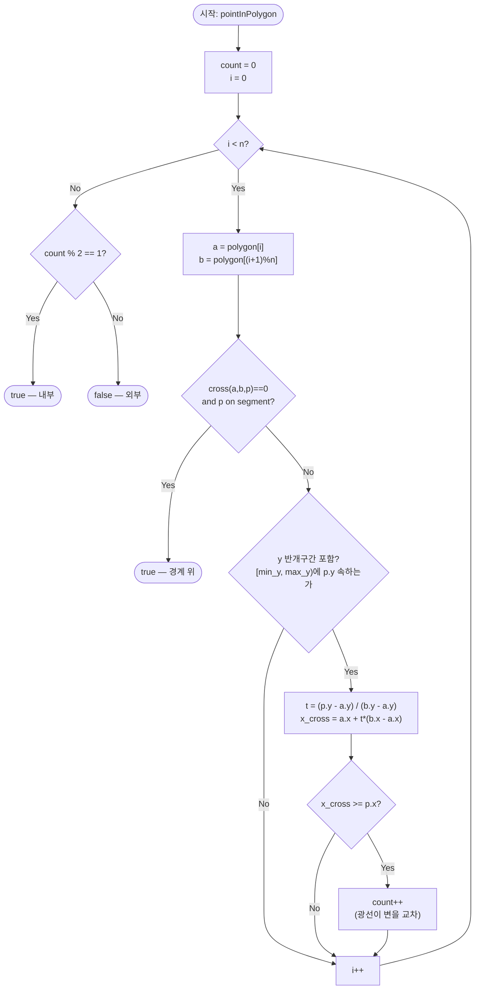

# pointInPolygon 해설 — Ray Casting

## 성능 목표 예측

| 제약 항목 | 값 |
|-----------|-----|
| 정점 수 $n$ | $3 \leq n \leq 10^5$ |
| 좌표 범위 | $-10^9 \leq x, y \leq 10^9$ |

**naive 접근의 문제점**

가장 직관적인 접근은 다각형을 삼각형으로 분할한 뒤 점이 어느 삼각형 안에 있는지 순차 탐색하는 것이다. 삼각분할에 $O(n \log n)$이 필요하고, 분할된 삼각형 수가 $O(n)$개이므로 쿼리 당 $O(n)$이다. 전처리 비용이 크고 구현이 복잡하다.

또 다른 접근은 볼록 다각형에서만 유효한 이진 탐색($O(\log n)$)이다. 오목 다각형에는 적용할 수 없다.

**목표 복잡도**: $O(n)$ — 모든 변을 한 번 순회하며 광선 교차 횟수를 센다. 볼록·오목 무관.

**공간 복잡도**: $O(1)$ — 교차 카운터와 임시 변수만 사용.

**메모리 트레이드오프**: 없음. 입력 배열을 수정하거나 복사하지 않는다.

---

## 목표 함수

```typescript
function pointInPolygon(p: Point, polygon: Point[]): boolean
```

| 파라미터 | 타입 | 의미 | 제약 |
|----------|------|------|------|
| `p` | `Point` = `[number, number]` | 내외부를 판정할 점 | 좌표 $[-10^9, 10^9]$ |
| `polygon` | `Point[]` | 단순 다각형의 정점 배열 | $3 \leq n \leq 10^5$, 단순 다각형 |

**반환값**: 점이 다각형 내부 또는 경계 위에 있으면 `true`, 외부이면 `false`.

**엣지케이스**:
1. **변 위의 점**: 점이 정확히 다각형의 어느 변 위에 있으면 `true`.
2. **정점 위의 점**: 점이 정확히 다각형의 꼭짓점과 일치하면 `true`.
3. **오목 다각형**: Ray Casting은 볼록·오목 구분 없이 동작한다.
4. **정점 순서 무관**: 시계·반시계 방향 모두 올바르게 처리된다.

---

## 핵심 아이디어

### 원형 아이디어와 naive 접근

가장 단순한 생각은 "점 $p$에서 무한히 멀리 있는 임의의 외부 점 $q$까지 선분을 그어, 이 선분이 다각형의 변과 교차하는 횟수를 센다"는 것이다. 교차 횟수가 홀수이면 내부, 짝수이면 외부다.

이 원형 아이디어의 폭발 지점은 광선이 정점을 정확히 통과할 때다. 그 정점을 공유하는 두 변에서 각각 교차로 카운트되면 2번 세어져 오류가 발생한다. 또한 광선이 변과 정확히 일치(collinear)하는 케이스도 무한히 많은 교차로 처리될 수 있다.

### 어떤 관찰이 돌파구가 되는가

- **관찰 1**: Jordan 곡선 정리에 의해, 단순 닫힌 곡선은 평면을 내부와 외부로 나눈다. 임의 방향의 광선과 경계의 교차 횟수 홀짝성으로 내/외부를 판정할 수 있다.
- **관찰 2**: 광선 방향을 $+x$ 수평으로 고정하면, 각 변과의 교차 판정이 단순 비교로 줄어든다. 교차점 $x$좌표를 명시적으로 구할 필요조차 없이 비교만 하면 된다.
- **관찰 3**: 정점 통과 문제는 변의 $y$ 구간을 **반개구간** $[\min_y, \max_y)$으로 처리하면 해결된다. 정점 하나는 아래쪽 변에 포함되고 위쪽 변에는 포함되지 않으므로, 정확히 1번만 카운트된다.

### 관찰을 형식화: 상태/구조 정의

**광선**: 점 $p = (x_0, y_0)$에서 $+x$ 방향으로 쏘는 반직선 $\{(x, y_0) \mid x \geq x_0\}$.

**변의 교차 조건**: 변 $\overline{v_i v_{i+1}}$가 광선과 교차하려면:

1. **$y$ 범위 조건**: 반개구간 $[\min(v_{i,y}, v_{i+1,y}),\; \max(v_{i,y}, v_{i+1,y}))$이 $y_0$를 포함해야 한다.
   $$\min(v_{i,y}, v_{i+1,y}) \leq y_0 < \max(v_{i,y}, v_{i+1,y})$$
2. **$x$ 방향 조건**: 교차점의 $x$좌표가 $x_0$ 이상이어야 한다.

이 형태여야 하는 근거: 반개구간이 핵심이다. 정점 $v_k$에서 $y_k = y_0$인 경우, 변 $\overline{v_{k-1} v_k}$에서는 $v_k$가 $\max_y$이므로 제외되고, 변 $\overline{v_k v_{k+1}}$에서는 $v_k$가 $\min_y$이므로 포함된다. 따라서 정점을 공유하는 두 변 중 정확히 하나만 카운트된다.

**누적 상태**: `count` = 지금까지 광선이 교차한 변의 수.

### 점화식 또는 핵심 연산

**교차점 $x$좌표 유도**:

변의 매개변수 표현: $(x, y) = v_i + t(v_{i+1} - v_i)$, $0 \leq t \leq 1$.

$y = y_0$로 놓으면:
$$t = \frac{y_0 - v_{i,y}}{v_{i+1,y} - v_{i,y}}$$

$$x_{\text{cross}} = v_{i,x} + t(v_{i+1,x} - v_{i,x})$$

이 $x_{\text{cross}} \geq x_0$이면 카운트를 증가시킨다.

**각 항의 의미**:
- $t$: 변 위에서 교차점의 위치 (0 = $v_i$, 1 = $v_{i+1}$).
- $x_{\text{cross}}$: 광선($y = y_0$)과 변의 교차점 $x$좌표.
- $x_{\text{cross}} \geq x_0$: 교차점이 점 $p$의 오른쪽에 있음 ($+x$ 방향 광선과 교차).

**최종 판정**:
$$\text{inside}(p) = (\text{count} \bmod 2 = 1)$$

### 정당성 — 왜 이것이 옳은가

**Jordan 곡선 정리**: 단순 닫힌 다각형 경계는 평면을 내부와 외부로 분리한다. 임의의 외부 점에서 $p$까지의 경로는 경계를 짝수 번 넘으므로, $p$가 외부이면 카운트가 짝수다. 반대로 내부이면 홀수다.

**불변식**: 루프의 각 이터레이션 이후, `count`는 $y_0$ 수평선이 지금까지 처리된 변들과 교차하며 $p$의 오른쪽에 있는 교차점의 수다.

**까다로운 케이스**:
- **수평 변** ($v_{i,y} = v_{i+1,y} = y_0$): $\min_y = \max_y = y_0$이므로 반개구간 조건 $\min \leq y_0 < \max$가 성립하지 않는다. 수평 변은 자동으로 스킵된다. 이는 옳은 동작이다. 수평 변과의 교차를 경계 위 여부로 별도 처리해야 한다.
- **경계 위 점**: 점이 정확히 변 위에 있을 때는 외적과 bounding box 체크로 별도 판정(`true` 반환)한다. 수치 오차로 인해 $t$ 계산이 부정확해질 수 있는 경우를 피한다.

### 구현 디테일과 최적화

- **경계 먼저 체크**: 각 변에 대해 외적 = 0이고 bounding box 안에 있으면 즉시 `true`를 반환한다. 이 체크를 $y$ 범위 체크보다 먼저 두면 경계 위 케이스를 빠짐없이 잡는다.
- **부동소수 비교**: $x_{\text{cross}}$ 계산에 실수 나눗셈이 포함된다. 좌표가 정수라도 $t$가 분수가 될 수 있다. 수치 오차가 걱정된다면, $x_{\text{cross}} \geq x_0$ 조건을 교차 곱으로 변환해 정수 연산으로 처리할 수 있다.
- **함정**: 반개구간을 잘못 구현하면 (예: 양쪽 모두 닫힌 구간) 정점에서 2번 카운트되어 틀린 결과가 나온다. 반드시 한쪽을 열린 구간으로 처리해야 한다.
- **오목 다각형 정확성**: Ray Casting은 오목 다각형에서도 동작한다. 광선이 요철 구간을 통과할 때 들어가면 카운트+1, 나오면 카운트+1이 되어 짝수로 상쇄된다.

---

## 수도 코드와 Activity Diagram

### 의사코드

```
function cross(a, b, p):
  return (b.x - a.x) * (p.y - a.y) - (b.y - a.y) * (p.x - a.x)

function onSegment(a, b, p):
  // cross(a, b, p) == 0이 보장된 상태에서 호출
  return min(a.x, b.x) <= p.x <= max(a.x, b.x)
     and min(a.y, b.y) <= p.y <= max(a.y, b.y)

function pointInPolygon(p, polygon):
  n = len(polygon)
  count = 0  // 불변식: 지금까지 +x 광선이 교차한 변의 수

  for i in 0..n-1:
    a = polygon[i]
    b = polygon[(i + 1) % n]

    // 경계 위 체크: 변 또는 정점 위에 있으면 즉시 true
    if cross(a, b, p) == 0 and onSegment(a, b, p):
      return true

    // 반개구간 [min_y, max_y)으로 y 포함 여부 확인
    // 불변식: 한 정점에서 정확히 한 번만 카운트됨
    if (a.y <= p.y and p.y < b.y) or (b.y <= p.y and p.y < a.y):
      // y = p.y에서 변과 광선의 교차점 x좌표
      t = (p.y - a.y) / (b.y - a.y)
      x_cross = a.x + t * (b.x - a.x)
      if x_cross >= p.x:  // 교차점이 p의 오른쪽 (또는 p와 일치)
        count += 1

  // 불변식: count가 홀수 ⟺ 내부
  return count % 2 == 1
```

### Activity Diagram



**핵심 불변식**: 반개구간 $[\min(v_{i,y}, v_{i+1,y}),\; \max(v_{i,y}, v_{i+1,y}))$으로 $y$를 판단하면, 정점 $y = y_0$인 경우 인접 두 변 중 정확히 하나에서만 카운트된다. 따라서 `count`의 홀짝성이 내/외부를 정확히 판별한다.
