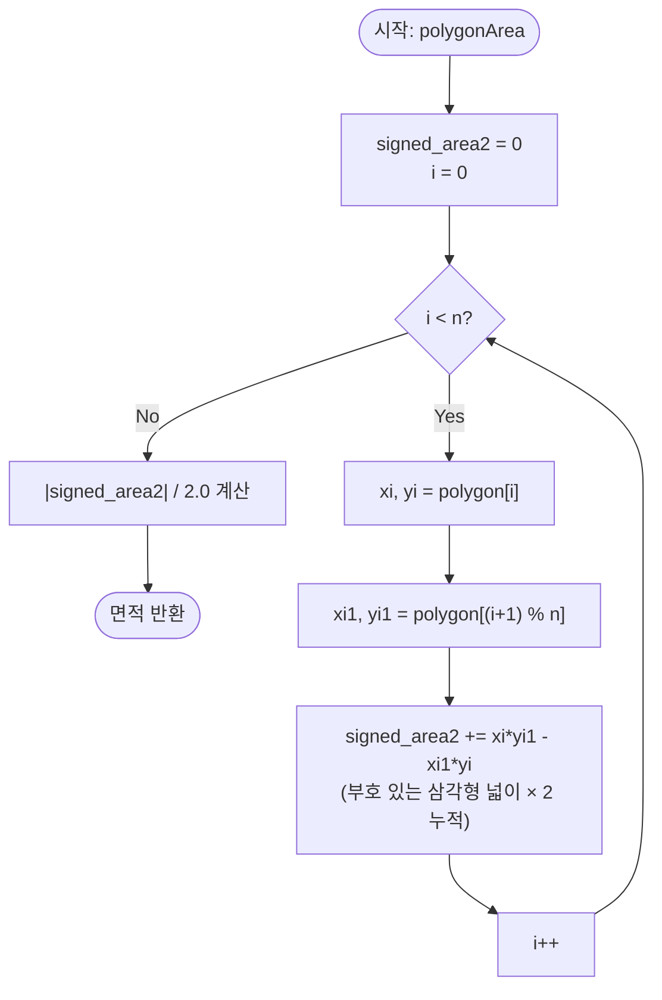

# polygonArea 해설 — Shoelace Formula (신발끈 공식)

## 성능 목표 예측

| 제약 항목 | 값 |
|-----------|-----|
| 정점 수 $n$ | $3 \leq n \leq 10^5$ |
| 좌표 범위 | $-10^9 \leq x, y \leq 10^9$ |

**naive 접근의 문제점**

가장 단순한 접근은 다각형을 삼각형으로 삼각분할한 뒤 각 삼각형의 넓이를 더하는 것이다. 임의 다각형의 삼각분할은 $O(n \log n)$의 알고리즘이 필요하고, 오목 다각형에서는 올바른 분할 자체가 어렵다. 또 다른 접근인 "정점을 순서대로 이어 사다리꼴 분해"도 같은 $O(n)$이지만 구현이 복잡하다.

**목표 복잡도**: $O(n)$ — 정점을 한 번 순회하며 외적 누적. 정렬·재귀·자료구조 불필요.

**공간 복잡도**: $O(1)$ — 누적 변수 하나만 사용. 입력 배열을 복사하거나 변환하지 않는다.

**메모리 트레이드오프**: 없음. 단일 패스로 처리 가능.

---

## 목표 함수

```typescript
function polygonArea(polygon: Point[]): number
```

| 파라미터 | 타입 | 의미 | 제약 |
|----------|------|------|------|
| `polygon` | `Point[]` | 단순 다각형의 정점 배열 | $3 \leq n \leq 10^5$, 자기교차 없음 |

**반환값**: 다각형의 넓이 ($\geq 0$, 부동소수). 정점 순서(시계/반시계)와 무관하게 동일한 값을 반환한다.

**엣지케이스**:
1. **퇴화 다각형**: 모든 점이 공선 — 넓이 0 반환.
2. **삼각형** ($n = 3$): 일반 삼각형 넓이 공식과 동일한 결과.
3. **오목 다각형**: 볼록·오목 구분 없이 동일하게 적용된다.
4. **정수 좌표 오버플로우**: $|x \cdot y| \leq 10^{18}$로 JavaScript `number`의 안전 정수 범위($2^{53} \approx 9 \times 10^{15}$)를 초과할 수 있다. 누적합이 여러 항의 합이므로 실용적으로는 오차가 작지만, 정밀도가 중요하면 BigInt를 고려해야 한다.

---

## 핵심 아이디어

### 원형 아이디어와 naive 접근

가장 단순한 생각은 "귀와 삼각형 분할(Ear Clipping)"이다. 오목하지 않은 귀(ear)를 찾아 삼각형으로 잘라내고 나머지 다각형에 재귀 적용한다. 구현은 $O(n^2)$이고, 올바른 귀를 찾는 로직이 복잡하다. $n = 10^5$에서 $10^{10}$ 연산이 발생하므로 제한 초과다.

"사다리꼴 분해"는 각 변에서 x축까지의 사다리꼴 면적을 부호 있는 값으로 더하는 방법이다. 이 아이디어의 핵심을 더 순수하게 표현하면 "원점을 기준으로 한 삼각형 분해"가 된다. 이것이 Shoelace Formula의 기원이다.

### 어떤 관찰이 돌파구가 되는가

- **관찰 1**: 삼각형 원점–$A$–$B$의 넓이는 외적 $\frac{1}{2}|A_x B_y - A_y B_x|$로 계산된다. 절댓값 없이 부호 있는 값을 쓰면 방향 정보가 포함된다.
- **관찰 2**: 임의의 다각형을 원점과 각 변으로 이루어진 삼각형들의 합으로 분해하면, 다각형 바깥 영역은 부호가 반대가 되어 자동으로 상쇄된다. 따라서 원점의 위치와 무관하게 정확한 면적이 나온다.
- **관찰 3**: 모든 항을 합산한 뒤 절댓값을 취하면 정점 순서(시계/반시계)가 면적에 영향을 주지 않는다.

### 관찰을 형식화: 상태/구조 정의

**부호 있는 면적(Signed Area)**:

원점 O, 점 $A = (x_i, y_i)$, 점 $B = (x_{i+1}, y_{i+1})$로 이루어진 삼각형의 부호 있는 면적은:

$$S_{\text{signed}}(O, A, B) = \frac{1}{2}(x_i y_{i+1} - x_{i+1} y_i)$$

이것이 이 형태여야 하는 이유: 원점을 공통 꼭짓점으로 쓰면 모든 삼각형을 단 두 변수 $(x_i, y_i)$, $(x_{i+1}, y_{i+1})$만으로 표현할 수 있다. 원점이 다각형 밖에 있더라도 부호 상쇄에 의해 올바른 넓이가 도출된다.

**누적 상태**: $\text{signed\_area2}$ = 지금까지 더한 외적 합 (면적의 2배).

### 점화식 또는 핵심 연산

**유도 과정**:

다각형의 정점 $v_0, v_1, \ldots, v_{n-1}$에 대해, 각 변 $\overline{v_i v_{i+1}}$과 원점 $O$로 이루어진 삼각형의 부호 있는 면적을 모두 더한다. 인덱스는 순환하므로 $v_n = v_0$이다.

$$A = \frac{1}{2}\left|\sum_{i=0}^{n-1}(x_i y_{i+1} - x_{i+1} y_i)\right|$$

각 항 $x_i y_{i+1} - x_{i+1} y_i$는 벡터 $\overrightarrow{Ov_i}$와 $\overrightarrow{Ov_{i+1}}$의 외적(z성분)이다.

**왜 부호 상쇄가 일어나는가**:

원점이 다각형 내부에 있을 때, 모든 삼각형의 부호가 같아 그냥 더해진다. 원점이 외부에 있을 때, 다각형 밖을 덮는 삼각형은 음수 부호를 가지게 되고, 이것이 다각형 내부 삼각형의 합에서 자동으로 빼진다. 결과적으로 어떤 위치의 원점을 써도 다각형 순수 면적만 남는다.

**각 항의 의미**:
- $x_i y_{i+1}$: 변의 "오른쪽" 기여.
- $x_{i+1} y_i$: 변의 "왼쪽" 기여.
- 두 항의 차이: 변이 기여하는 부호 있는 삼각형 넓이의 2배.
- 절댓값 $|\cdot|$: 정점 순서에 따른 부호 제거.

### 정당성 — 왜 이것이 옳은가

**Green 정리에 의한 정당화**: Shoelace Formula는 Green 정리의 특수 적용이다.

$$A = \frac{1}{2}\oint (x\,dy - y\,dx)$$

다각형 경계를 선분 $v_i \to v_{i+1}$로 근사하면 각 선분에서 $\int(x\,dy - y\,dx) = x_i y_{i+1} - x_{i+1} y_i$가 된다. 이것의 합이 Shoelace Formula다.

**귀납 불변식**: 루프 $i$회 완료 후 `signed_area2`는 원점–$v_0$–$v_1$–$\cdots$–$v_i$로 이루어진 부채꼴 도형의 부호 있는 면적의 2배다. 마지막 변 $v_{n-1} \to v_0$을 더하면 다각형이 닫힌다.

**까다로운 케이스**:
- 오목 다각형: 일부 삼각형이 음수 부호를 갖지만, 합산하면 올바른 면적이 나온다.
- 시계 방향 정점: 전체 합이 음수가 되지만, 절댓값을 취하므로 무관하다.
- 자기교차 다각형: 교차 영역이 이중으로 상쇄되어 올바른 면적이 나오지 않는다. 이 알고리즘의 유효 범위는 단순 다각형에 한정된다.

### 구현 디테일과 최적화

- **인덱스 순환**: `(i + 1) % n`으로 마지막 변 $v_{n-1} \to v_0$을 자동 처리.
- **나눗셈 지연**: 전체 합산 후 마지막에 2로 나눔. 매 단계 나눗셈보다 오차가 적다.
- **오버플로우 방지**: $|x_i y_{i+1}|$의 최대치가 $10^{18}$이므로, 항의 수가 많아지면 합이 `Number.MAX_SAFE_INTEGER`를 초과할 수 있다. 실제 문제에서 상쇄에 의해 합이 작아지는 경우가 많지만, 엄밀한 구현은 BigInt를 고려한다.
- **함정**: $v_n = v_0$를 명시적으로 배열에 추가하면 마지막 변을 두 번 더할 수 있다. 순환 인덱스만 사용하고 배열을 변경하지 않는 것이 안전하다.

---

## 수도 코드와 Activity Diagram

### 의사코드

```
function polygonArea(polygon):
  n = len(polygon)
  signed_area2 = 0  // 불변식: 처리된 변들에 대한 외적 합 (면적 × 2)

  for i in 0..n-1:
    xi  = polygon[i].x
    yi  = polygon[i].y
    xi1 = polygon[(i + 1) % n].x  // 불변식: 순환 인덱스로 마지막 변 자동 처리
    yi1 = polygon[(i + 1) % n].y
    // 불변식: 각 항은 원점-v[i]-v[i+1] 삼각형의 부호 있는 면적 × 2
    signed_area2 += xi * yi1 - xi1 * yi

  // 불변식: signed_area2 == 다각형 부호 있는 면적 × 2
  return |signed_area2| / 2.0
```

### Activity Diagram



**핵심 불변식**: 루프 완료 시 `signed_area2`는 반시계 방향 정점이면 양수, 시계 방향이면 음수인 다각형 면적의 2배다. 절댓값과 1/2 적용으로 방향 무관 면적이 도출된다.

---

## 관련 정리와 확장

### Pick의 정리와의 관계

정수 좌표 다각형에서 Pick의 정리가 성립한다:

$$A = I + \frac{B}{2} - 1$$

여기서 $I$는 내부 격자점 수, $B$는 경계 격자점 수다. Shoelace Formula로 $A$를 구하면 Pick의 정리를 통해 $I$를 역산할 수 있다.

### 자기교차 다각형에서의 한계

Shoelace Formula는 단순 다각형에서만 올바른 면적을 계산한다. 자기교차 다각형에서는 교차 영역이 방향에 따라 양수·음수 기여를 하여 올바른 면적이 나오지 않는다. 이 알고리즘을 사용하기 전에 입력이 단순 다각형임을 사전 검증해야 한다.

### 수치 정밀도 요약

| 좌표 유형 | $|x \cdot y|$ 최대치 | 안전 여부 |
|-----------|---------------------|-----------|
| 정수 $\leq 10^4$ | $\leq 10^8$ | 안전 |
| 정수 $\leq 10^6$ | $\leq 10^{12}$ | 안전 |
| 정수 $\leq 10^9$ | $\leq 10^{18}$ | 위험 (BigInt 권장) |
| 부동소수 | 오차 누적 | 주의 |
