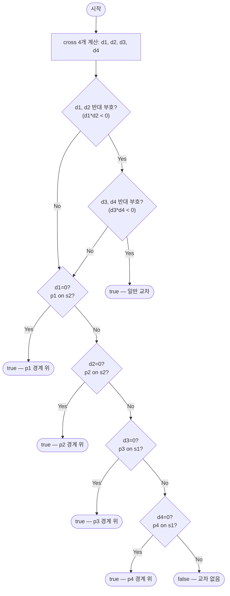

# segmentsIntersect 해설 — CCW 외적 교차 판정

## 성능 목표 예측

| 제약 항목 | 값 |
|-----------|-----|
| 입력 선분 수 | 2개 (고정) |
| 좌표 범위 | $-10^9 \leq x, y \leq 10^9$ |

**naive 접근과 왜 그것으로 충분한가**

이 문제는 선분 2개만 다루므로 입력 크기가 상수다. naive 접근인 "선분 방정식을 연립하여 교점을 구한다"도 $O(1)$이지만, 부동소수 나눗셈을 수반하기 때문에 수치 오차가 생긴다. 특히 두 선분이 거의 평행하거나 한 선분이 매우 짧을 때 불안정하다.

**목표 복잡도**: $O(1)$ — 외적 4회 + 정수 비교만 수행. 부동소수 나눗셈 없음.

**공간 복잡도**: $O(1)$ — 임시 변수 4개(d1, d2, d3, d4)만 사용. 추가 자료구조 불필요.

**메모리 트레이드오프**: 없음. 입력 그대로 처리.

---

## 목표 함수

```typescript
function segmentsIntersect(s1: Segment, s2: Segment): boolean
```

| 파라미터 | 타입 | 의미 | 제약 |
|----------|------|------|------|
| `s1` | `Segment` = `[Point, Point]` | 첫 번째 선분 $\overline{p_1 p_2}$ | 좌표 $[-10^9, 10^9]$ |
| `s2` | `Segment` = `[Point, Point]` | 두 번째 선분 $\overline{p_3 p_4}$ | 좌표 $[-10^9, 10^9]$ |

**반환값**: 두 선분이 한 점이라도 공유하면 `true`, 완전히 분리되어 있으면 `false`.

**교차의 정의**: T자·L자·끝점 접촉·겹침 구간 모두 교차로 간주.

**엣지케이스**:
1. **점으로 퇴화**: $p_1 = p_2$ — $s_1$이 한 점일 때, 그 점이 $s_2$ 위에 있으면 `true`.
2. **완전 겹침**: 두 선분이 공선이고 bounding box가 중첩 — `true`.
3. **평행 비겹침**: 두 선분이 공선이지만 떨어져 있음 — `false`.
4. **끝점 접촉**: $p_2 = p_3$처럼 끝점이 정확히 일치 — `true`.

---

## 핵심 아이디어

### 원형 아이디어와 naive 접근

가장 직관적인 풀이는 선분을 직선 방정식으로 표현한 뒤 연립한다.

$$s_1: P = p_1 + t(p_2 - p_1), \quad 0 \leq t \leq 1$$
$$s_2: P = p_3 + u(p_4 - p_3), \quad 0 \leq u \leq 1$$

$t, u$에 대해 연립하면 교점이 나온다. 그러나 이 방법은 두 직선이 평행할 때 분모가 0이 되어 별도 분기가 필요하고, 부동소수 나눗셈이 수치 오차를 만든다. 정수 좌표에서도 결과가 부동소수가 되기 때문에 정확한 판정이 어렵다. 폭발 지점은 "공선이면서 겹침" 케이스로, 분기를 빠뜨리기 쉽다.

### 어떤 관찰이 돌파구가 되는가

- **관찰 1**: 두 선분이 교차한다는 것은 "각 선분의 두 끝점이 상대 선분을 포함하는 직선을 기준으로 서로 반대쪽에 있다"와 동치다(일반 위치). 이 "어느 쪽"은 외적의 부호로 판별할 수 있다.
- **관찰 2**: 외적 $\mathrm{cross}(a, b, c) = (b_x - a_x)(c_y - a_y) - (b_y - a_y)(c_x - a_x)$는 순수 정수 연산이므로 수치 오차가 없다. 나눗셈이 필요하지 않다.
- **관찰 3**: 공선인 경우(외적 = 0)는 bounding box 겹침으로 판별할 수 있다. 이 역시 정수 비교만으로 처리된다.

### 관찰을 형식화: 상태/구조 정의

**방향 함수** $\mathrm{ccw}(a, b, c)$를 다음과 같이 정의한다.

$$\mathrm{cross}(a, b, c) = (b_x - a_x)(c_y - a_y) - (b_y - a_y)(c_x - a_x)$$

- $> 0$: $a \to b \to c$가 반시계(좌회전). $c$는 직선 $ab$의 왼쪽.
- $= 0$: 세 점 공선. $c$는 직선 $ab$ 위.
- $< 0$: 시계(우회전). $c$는 직선 $ab$의 오른쪽.

이 형태여야 하는 근거: 부호만으로 "어느 쪽"을 판별하므로 실제 교점 좌표를 계산할 필요가 없다. 교차 판정에 필요한 정보가 부호 4개로 압축된다.

네 개의 방향값을 정의한다:

$$d_1 = \mathrm{cross}(p_3, p_4, p_1), \quad d_2 = \mathrm{cross}(p_3, p_4, p_2)$$
$$d_3 = \mathrm{cross}(p_1, p_2, p_3), \quad d_4 = \mathrm{cross}(p_1, p_2, p_4)$$

### 점화식 또는 핵심 연산

**유도 과정**:

$d_1$은 "$p_1$이 직선 $p_3 p_4$에 대해 어느 쪽인가"를 나타내고, $d_2$는 "$p_2$가 어느 쪽인가"를 나타낸다. $d_1 \cdot d_2 < 0$이면 $p_1$과 $p_2$가 직선 $p_3 p_4$의 서로 다른 쪽에 있다. 동시에 $d_3 \cdot d_4 < 0$이면 $p_3$과 $p_4$가 직선 $p_1 p_2$의 서로 다른 쪽에 있다. 두 조건이 모두 성립하면 두 선분은 서로를 가로질러 교차한다.

**일반 교차 조건**:
$$d_1 \cdot d_2 < 0 \;\land\; d_3 \cdot d_4 < 0 \implies \text{교차}$$

**공선 조건**: 어느 하나라도 $d_i = 0$이면, 해당 끝점이 상대 직선 위에 있다. 이때 그 끝점이 선분의 bounding box 안에 있는지 확인한다.

$$\mathrm{onSegment}(a, b, p) \iff \min(a_x, b_x) \leq p_x \leq \max(a_x, b_x) \;\land\; \min(a_y, b_y) \leq p_y \leq \max(a_y, b_y)$$

**각 항의 의미**:
- $d_1 \cdot d_2 < 0$: $s_1$의 양 끝점이 $s_2$를 포함하는 직선을 가로지름.
- $d_3 \cdot d_4 < 0$: $s_2$의 양 끝점이 $s_1$을 포함하는 직선을 가로지름.
- 두 조건의 동시 성립: 두 선분이 서로를 "막아서" 교차.

### 정당성 — 왜 이것이 옳은가

**불변식**: 두 선분이 교차하는 일반 위치에서, 각 선분의 두 끝점은 상대 선분의 연장선을 기준으로 반드시 서로 다른 쪽에 위치한다. 이는 볼록 집합(선분)의 분리 정리에 의해 보장된다.

**귀납 정당화**: $d_1 \cdot d_2 < 0$이므로 $p_1$은 직선 $p_3 p_4$의 한쪽에, $p_2$는 반대쪽에 있다. 연속성에 의해 $s_1$은 직선 $p_3 p_4$를 반드시 한 점에서 가로지른다. $d_3 \cdot d_4 < 0$ 조건이 추가되면, 그 교점이 선분 $s_2$ 위에 있음이 보장된다.

**까다로운 케이스**:
- 곱 $d_1 \cdot d_2$는 두 값의 부호가 같으면 양수, 반대면 음수이다. JavaScript에서 최대 $|d_i| \leq 2 \times 10^{18}$이므로 정수 곱이 53비트를 초과한다. 따라서 곱을 직접 계산하지 않고 `sign(d1) !== sign(d2)`로 부호를 비교해야 오버플로우를 피할 수 있다.
- $d_1 = 0$이고 $d_2 = 0$인 경우(완전 공선)는 두 조건 모두 "등호 포함"으로 처리하면 자동으로 bounding box 경로로 진입한다.

### 구현 디테일과 최적화

- **부호 비교**: `d1 * d2 < 0` 대신 `(d1 > 0 && d2 < 0) || (d1 < 0 && d2 > 0)`으로 작성해 오버플로우를 방지한다.
- **경계 접촉**: 문제 정의가 끝점 접촉을 교차로 포함하므로, 공선 4가지 체크(onSegment)를 반드시 수행한다.
- **조기 종료**: 일반 교차 조건에서 `true`가 확정되면 공선 체크는 불필요하다.
- **함정**: $p_1 = p_2$(점으로 퇴화)인 경우 $d_3 = d_4 = 0$이 되어 공선 경로를 탄다. onSegment 체크에서 올바르게 처리된다.

---

## 수도 코드와 Activity Diagram

### 의사코드

```
function cross(a, b, c):
  // 불변식: 정수 연산만 사용, 나눗셈 없음
  return (b.x - a.x) * (c.y - a.y) - (b.y - a.y) * (c.x - a.x)

function onSegment(a, b, p):
  // 불변식: cross(a, b, p) == 0이 보장된 상태에서 호출
  return min(a.x, b.x) <= p.x <= max(a.x, b.x)
     and min(a.y, b.y) <= p.y <= max(a.y, b.y)

function sameSign(x, y):
  // 부호 비교 (오버플로우 방지)
  return (x > 0 && y > 0) || (x < 0 && y < 0)

function segmentsIntersect(s1=[p1,p2], s2=[p3,p4]):
  // d1, d2: p1, p2가 직선 p3p4에 대해 어느 쪽인지
  d1 = cross(p3, p4, p1)  // 불변식: 직선 p3p4 기준 p1의 방향
  d2 = cross(p3, p4, p2)  // 불변식: 직선 p3p4 기준 p2의 방향
  // d3, d4: p3, p4가 직선 p1p2에 대해 어느 쪽인지
  d3 = cross(p1, p2, p3)  // 불변식: 직선 p1p2 기준 p3의 방향
  d4 = cross(p1, p2, p4)  // 불변식: 직선 p1p2 기준 p4의 방향

  // 일반 교차: 양쪽 모두 서로 반대편
  if !sameSign(d1, d2) and d1 != 0 and d2 != 0
   and !sameSign(d3, d4) and d3 != 0 and d4 != 0:
    return true

  // 공선 케이스: 끝점이 상대 선분 위에 있는지
  if d1 == 0 and onSegment(p3, p4, p1): return true
  if d2 == 0 and onSegment(p3, p4, p2): return true
  if d3 == 0 and onSegment(p1, p2, p3): return true
  if d4 == 0 and onSegment(p1, p2, p4): return true

  return false
```

### Activity Diagram



**핵심 불변식**: $d_1 \cdot d_2 < 0 \;\land\; d_3 \cdot d_4 < 0$ ⟺ 일반 위치 교차. 등호($= 0$)는 공선이므로 bounding box로 별도 판정.
