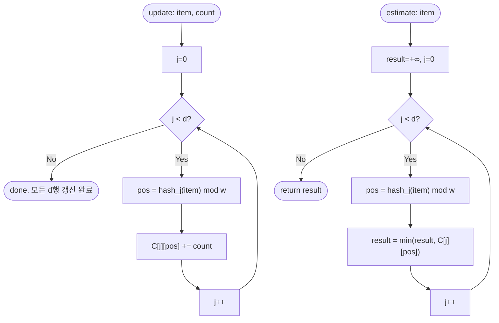

# Count-Min Sketch 해설

## 성능 목표 예측

| 제약 항목 | 값 |
|-----------|-----|
| 카운터 배열 폭 $w$ | $\leq 10^4$ |
| 해시 함수 개수(깊이) $d$ | $\leq 16$ |
| 스트림 길이 $n$ | $\leq 10^5$ |

**naive 접근의 문제점**: 원소별 정확한 빈도를 유지하는 해시 맵(`Map<string, number>`)은 고유 원소 수 $u$에 비례하는 $O(u)$ 공간이 필요하다. 스트리밍 환경에서 $u$가 수백만을 넘으면 수십 MB 이상이 소요된다. 모든 원소를 메모리에 보관하면서 정확한 카운팅을 하는 것은 실시간 네트워크 트래픽 분석이나 대용량 로그 처리에서 비현실적이다.

**목표 복잡도**: 갱신과 조회 모두 $O(d)$. $d \leq 16$이므로 사실상 $O(1)$이다. 전체 스트림 처리는 $O(nd)$이다.

**공간 복잡도**: $O(w \cdot d)$개의 정수. $w = 10^4$, $d = 16$이면 $1.6 \times 10^5$개 정수 ≈ 640KB. 정확도 파라미터 $\varepsilon$(허용 오차 비율)와 실패 확률 $\delta$로부터 $w = \lceil e/\varepsilon \rceil$, $d = \lceil \ln(1/\delta) \rceil$을 계산하여 공간-정확도 트레이드오프를 조절한다.

---

## 목표 함수

```ts
class CountMinSketch {
  constructor(width: number, depth: number): CountMinSketch
  update(item: string, count: number): void
  estimate(item: string): number
}
```

| 파라미터 | 의미 | 제약 |
|---------|------|------|
| `width` | 각 행의 카운터 수 $w$ | $1 \leq w \leq 10^4$ |
| `depth` | 해시 함수(행) 수 $d$ | $1 \leq d \leq 16$ |
| `item` | 빈도를 갱신하거나 조회할 문자열 원소 | 임의 문자열 |
| `count` | 해당 원소가 이번에 등장한 횟수 | $\geq 1$ |

**반환값**: `estimate`는 실제 빈도 $f(x)$의 상한 추정값 $\hat{f}(x)$를 반환한다. 구체적으로 $f(x) \leq \hat{f}(x)$이며, 과대추정 오차는 확률 $1 - \delta$ 이상으로 $\varepsilon N$ 이하임이 보장된다.

**엣지케이스**:
1. 한 번도 `update`하지 않은 원소에 `estimate` 호출 → 0 반환 (모든 카운터가 0).
2. 동일한 `item`에 `update`를 여러 번 호출 → 각 호출의 `count`가 누적된다.
3. $w = 1$인 경우 → 모든 원소가 하나의 버킷을 공유하여 추정 오차가 매우 커진다.
4. 스트림 총 합 $N$이 매우 큰 경우 → 오차 상한 $\varepsilon N$이 커지므로 희귀 원소의 추정은 부정확하다.
5. 모든 원소가 동일한 경우 → 충돌이 없어 추정값이 실제 빈도와 일치한다.

---

## 핵심 아이디어

### 원형 아이디어와 naive 접근

빈도를 정확히 추적하려면 `Map<string, number>`에 원소별 카운터를 유지하면 된다. 시간복잡도는 갱신·조회 모두 $O(1)$ 기댓값이지만, 공간이 고유 원소 수 $u$에 비례한다. 스트리밍 시나리오에서 $u$가 수백만을 넘으면 메모리를 감당할 수 없다.

**폭발 지점**: 정확한 빈도를 보장하면 공간을 줄일 수 없다. 추정값이 실제 빈도보다 크거나 같은 경우(과대추정)만 허용한다면, 해시 충돌을 적극 활용하여 공간을 대폭 줄일 수 있다.

### 어떤 관찰이 돌파구가 되는가

- **관찰 1**: 단일 카운터 배열에 해시로 원소를 매핑하면, 충돌하는 원소들의 카운트가 합산되어 과대추정이 발생한다. 이 오차를 없애는 것은 불가능하지만, 여러 독립 행의 최솟값을 취하면 오차를 줄일 수 있다.
- **관찰 2**: 카운터는 오직 증가만 한다. 따라서 $\hat{f}(x) \geq f(x)$는 항등적으로 성립한다. 최솟값을 취하면 "가장 충돌이 적은 행"의 추정을 얻으므로 오차를 최소화한다.
- **관찰 3**: $d$개의 독립 해시 행이 모두 동시에 크게 오염될 확률은 지수적으로 감소한다. 실패 확률 $\delta$를 $d = \lceil \ln(1/\delta) \rceil$로 제어할 수 있다.

### 관찰을 형식화: 상태/구조 정의

$d \times w$ 정수 행렬 $C$를 유지한다. 각 행 $j \in [0, d)$는 독립 해시 함수 $h_j$에 대응한다.

$$C \in \mathbb{Z}_{\geq 0}^{d \times w}, \quad h_j : \Sigma^* \to [0, w)$$

이 형태여야 하는 근거: 각 행이 독립 해시를 사용하므로, 특정 행에서 원소 $x$와 충돌하는 원소 집합이 다른 행과 달라진다. 모든 행에서 동시에 같은 원소들이 충돌할 가능성은 지수적으로 낮다.

### 점화식 또는 핵심 연산

**갱신 연산**:
$$\text{update}(x, c) \triangleq \forall j \in [0, d), \; C[j][h_j(x) \bmod w] \mathrel{+}= c$$

**추정 연산**:
$$\hat{f}(x) = \min_{0 \leq j < d} C[j][h_j(x) \bmod w]$$

**정확도 보장** (확률 $\geq 1 - \delta$):
$$f(x) \leq \hat{f}(x) \leq f(x) + \varepsilon \cdot N$$

여기서 $N = \sum_y f(y)$는 스트림 총 카운트이다.

**유도**: 행 $j$에서 $x$와 충돌하는 임의 원소 $y \neq x$가 같은 버킷에 떨어질 확률은 $1/w$이다. $w = \lceil e/\varepsilon \rceil$으로 설정하면 행 $j$의 오차 기댓값이 $\varepsilon N / e$이다. Markov 부등식에 의해 단일 행이 오차 $\varepsilon N$을 초과할 확률이 $1/e$ 미만이다. $d$개 행 모두가 동시에 초과할 확률은 $(1/e)^d \leq \delta$이다.

### 정당성 — 왜 이것이 옳은가

**하한 정당성** ($\hat{f}(x) \geq f(x)$): 카운터는 단조 증가한다. $C[j][h_j(x)]$는 $x$의 실제 빈도에 다른 원소들의 충돌 기여가 더해진 값이다. 따라서 어떤 행 $j$를 선택하든 $C[j][h_j(x)] \geq f(x)$이고, 최솟값을 취해도 $f(x)$ 이상임이 보장된다.

**불변식**: 임의의 시점에서 모든 $j \in [0, d)$에 대해 $C[j][h_j(x)] \geq f(x)$가 성립한다.

**까다로운 케이스**: 소수의 원소가 매우 높은 빈도를 가질 때, 그 원소들이 $x$와 같은 버킷에 충돌하면 오차가 커진다. 이것이 Count-Min Sketch가 Heavy Hitter(자주 등장하는 원소)에는 잘 작동하고, 희귀 원소에는 상대적으로 부정확한 이유다. 총 카운트 $N$이 클수록 오차 상한 $\varepsilon N$도 커진다.

### 구현 디테일과 최적화

**해시 함수 구성**: 두 기반 해시값 $a = \text{hash}_1(x)$, $b = \text{hash}_2(x)$로 double hashing을 적용한다:
$$h_j(x) = (a + j \cdot b) \bmod w, \quad j = 0, 1, \ldots, d-1$$

**보존형 갱신(Conservative Update)**: 표준 갱신 대신, $C[j][h_j(x)] < \hat{f}(x) + c$인 행만 갱신하면 오차를 더 줄일 수 있다. 단, 먼저 `estimate`를 계산해야 하므로 구현이 복잡해진다.

**함정**: 동일한 해시 씨드(seed)를 모든 행에 사용하면 독립성이 깨진다. 행마다 다른 씨드나 다른 해시 파라미터를 사용해야 한다.

---

## 수도 코드와 Activity Diagram

### 의사코드

```
class CountMinSketch(w, d):
    C = 2D array[d][w], initialized to 0
    // 불변식: C[j][h_j(x) mod w] ≥ f(x), ∀j ∈ [0, d)
    //         카운터는 단조 증가하므로 과소추정은 절대 발생하지 않는다

update(item, count):
    for j in 0 .. d-1:
        pos = hash_j(item) mod w     // 불변식: 0 ≤ pos < w
        C[j][pos] += count           // 단조 증가 → 하한 불변식 유지

estimate(item) → number:
    result = +Infinity
    for j in 0 .. d-1:
        pos = hash_j(item) mod w
        result = min(result, C[j][pos])  // 가장 오염이 적은 행 선택
    return result                         // 반환값 ≥ 실제 빈도 항상 보장

hash_j(item):
    a = hash1(item), b = hash2(item)
    return (a + j * b) mod w             // double hashing으로 독립성 근사
```

### Activity Diagram



**핵심 불변식**: 갱신 후 임의의 행 $j$에서 $C[j][h_j(x) \bmod w] \geq f(x)$가 항상 성립하며, 최솟값을 취함으로써 과대추정 오차를 최소화하고 확률적 정확도 상한을 보장한다.
