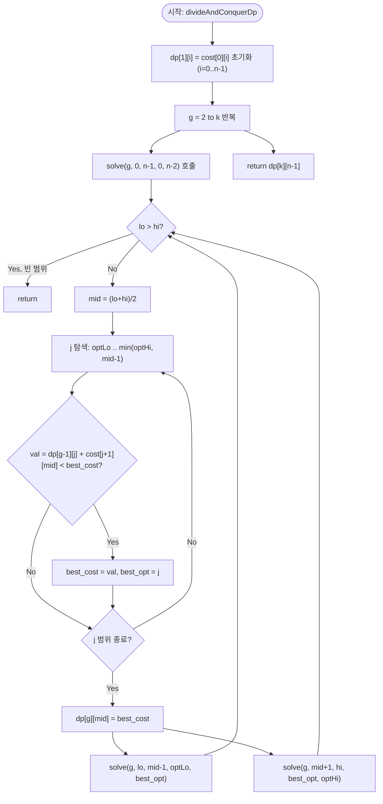

# divideAndConquerDp 해설

## 성능 목표 예측

| 항목 | 값 |
|------|-----|
| 입력 크기 $n$ | $1 \leq n \leq 500$ |
| 분할 수 $k$ | $1 \leq k \leq n$ |
| 비용 행렬 값 범위 | $0 \leq \text{cost}[i][j]$, 사각 부등식 만족 |

**naive DP의 한계.** 점화식

$$dp[g][i] = \min_{g-1 \leq j < i} \bigl( dp[g-1][j] + \text{cost}[j+1][i] \bigr)$$

를 순진하게 구현하면 각 계층 $g$에서 $i$가 $n$개, 각각 최대 $n$개의 $j$를 탐색하므로 한 계층에 $O(n^2)$, 전체 $k$계층에 $O(kn^2)$. $n = 500, k = 500$이면 $1.25 \times 10^8$으로 허용 범위 근처지만, $n$이 더 크거나 $k$가 늘어나면 금방 한계에 달한다.

**목표 복잡도와 근거.** 비용 함수가 사각 부등식을 만족하면 최적 분할점 $\text{opt}(g, i)$가 $i$에 대해 단조 증가한다. 이 단조성을 활용해 분할 정복으로 탐색 범위를 매 레벨마다 반씩 좁히면 한 계층에 $O(n \log n)$, 전체 $O(kn \log n)$이 달성된다.

**공간 복잡도.** $dp$ 배열 $(k+1) \times n = O(kn)$. 이전 계층 결과만 참조하면 $O(n)$으로 줄일 수 있으나 구현 복잡도가 높아진다.

---

## 목표 함수

```ts
function divideAndConquerDp(cost: number[][], k: number): number
```

### 파라미터 표

| 파라미터 | 의미 | 제약 |
|---------|------|------|
| `cost` | $n \times n$ 비용 행렬. `cost[i][j]`는 구간 $[i, j]$를 한 그룹으로 묶는 비용 | $0 \leq \text{cost}[i][j]$, 사각 부등식 만족 |
| `k` | 분할할 연속 구간의 수 | $1 \leq k \leq n$ |

**반환값.** $[0, n-1]$을 정확히 $k$개의 연속 구간으로 분할했을 때의 최소 총 비용.

### 엣지케이스

1. **$k = 1$** — 전체 배열을 하나의 구간으로 묶으므로 `cost[0][n-1]` 반환.
2. **$k = n$** — 각 원소가 하나의 구간이 되므로 $\sum_{i=0}^{n-1} \text{cost}[i][i]$ 반환.
3. **$n = 1, k = 1$** — 원소 하나, 구간 하나, `cost[0][0]` 반환.
4. **비용 행렬이 사각 부등식을 만족하지 않는 경우** — 분할 정복 DP를 적용하면 최적해를 놓칠 수 있다. 이 경우 naive $O(kn^2)$ DP를 사용해야 한다.

---

## 핵심 아이디어

### 원형 아이디어와 naive 접근

가장 직관적인 풀이는 "그룹 수 $g$를 1씩 늘려가며 마지막 분할점 $j$를 모두 시도"하는 DP다.

```
for g in 1..k:
    for i in g-1..n-1:            // i: 현재 구간의 끝
        dp[g][i] = INF
        for j in g-2..i-1:        // j: 이전 구간의 끝 (분할점)
            dp[g][i] = min(dp[g][i], dp[g-1][j] + cost[j+1][i])
```

**폭발 지점**: 안쪽 루프(`j` 탐색)가 최대 $n$번 돌므로, 전체 $k \times n \times n = O(kn^2)$. $n = 1000, k = 1000$이면 $10^9$ 연산으로 불가능해진다.

### 어떤 관찰이 돌파구가 되는가

- **관찰 1.** $\text{cost}[i][j]$가 사각 부등식(Quadrangle Inequality, QI)을 만족한다. 즉 $a \leq b \leq c \leq d$이면 $\text{cost}[a][c] + \text{cost}[b][d] \leq \text{cost}[a][d] + \text{cost}[b][c]$. 이 조건은 비용 함수가 "구간이 겹치면 더 싸다"는 단조 구조임을 의미한다.
- **관찰 2.** QI가 성립하면 최적 분할점 $\text{opt}(g, i)$가 $i$에 대해 단조 비감소다. 즉 $i < i'$이면 $\text{opt}(g, i) \leq \text{opt}(g, i')$. 이 단조성이 핵심 최적화 조건이다.
- **관찰 3.** 단조성이 있으면 구간 $[lo, hi]$ 안의 모든 $i$에 대한 최적점을 구할 때, 중앙 $\text{mid}$의 최적점을 먼저 구하면 좌측 구간의 최적점은 $[\text{optLo}, \text{opt}_{mid}]$, 우측 구간의 최적점은 $[\text{opt}_{mid}, \text{optHi}]$로 범위가 절반씩 좁혀진다.

### 관찰을 형식화: 상태/구조 정의

**상태 정의:**

$$dp[g][i] = [0, n-1] \text{을 정확히 } g \text{개 연속 구간으로 분할할 때, 마지막 구간이 } (j^*, i] \text{인 최소 비용}$$

기저: $dp[1][i] = \text{cost}[0][i]$ (구간 $[0, i]$ 전체를 하나의 그룹으로).

이 형태여야 하는 이유: "이전 계층 $g-1$의 결과를 재사용"하려면 이전 그룹의 끝점 $j$와 다음 그룹의 비용 $\text{cost}[j+1][i]$가 독립적으로 분리되어야 한다. 이 분리 구조가 QI와 결합해 최적점 단조성을 만든다.

**최적점 단조성의 의미:**

$$\text{opt}(g, 0) \leq \text{opt}(g, 1) \leq \cdots \leq \text{opt}(g, n-1)$$

분할 정복에서 재귀 트리의 각 레벨마다 탐색 범위의 총합이 $O(n)$이고, 레벨 수가 $O(\log n)$이므로 한 계층 전체가 $O(n \log n)$이 된다.

### 점화식 또는 핵심 연산

점화식 (이미 알려진 것을 유도 과정으로 재확인):

$$dp[g][i] = \min_{j \in [\text{optLo}, \min(\text{optHi},\, i-1)]} \bigl( dp[g-1][j] + \text{cost}[j+1][i] \bigr)$$

유도: naive 탐색 범위 $[g-2, i-1]$ 전체를 사각 부등식 기반 단조성으로 $[\text{optLo}, \min(\text{optHi}, i-1)]$로 좁혔다. 각 항의 의미:

- $dp[g-1][j]$: 앞 $g-1$개 구간을 $[0, j]$에 최적으로 배치한 비용.
- $\text{cost}[j+1][i]$: 마지막 $g$번째 구간 $[j+1, i]$의 비용.
- $\text{optLo}$, $\text{optHi}$: 현재 $i$ 범위에서 최적점이 존재할 수 있는 하한·상한.

### 정당성 — 왜 이것이 옳은가

**QI가 단조성을 보장하는 이유.** 두 분할점 $j_1 < j_2$와 두 끝점 $i_1 < i_2$에 대해 QI를 이용하면 $\text{cost}[j_1+1][i_1] + \text{cost}[j_2+1][i_2] \leq \text{cost}[j_2+1][i_1] + \text{cost}[j_1+1][i_2]$가 성립한다. 이 부등식과 $dp[g-1]$의 단조성을 결합하면 $\text{opt}(g, i_1) \leq \text{opt}(g, i_2)$가 귀납적으로 증명된다.

**분할 정복의 정당성.** `solve(g, lo, hi, optLo, optHi)` 호출 시 불변식: 임의의 $i \in [lo, hi]$에 대해 $\text{opt}(g, i) \in [\text{optLo}, \text{optHi}]$. 중앙 `mid`의 최적점 $\text{opt}_{mid}$를 선형 탐색으로 구하면, 단조성에 의해 좌측($i < \text{mid}$)의 최적점은 $\leq \text{opt}_{mid}$, 우측($i > \text{mid}$)의 최적점은 $\geq \text{opt}_{mid}$임이 보장된다.

**까다로운 케이스.** 탐색 범위에서 `optHi`와 `mid-1` 중 작은 값을 상한으로 사용해야 한다. $j$는 $i$ 미만이어야 하므로(`j < i = mid`), `min(optHi, mid-1)`이 실제 탐색 상한이 된다. 이를 빠뜨리면 자기 자신을 분할점으로 택하는 잘못된 경우가 발생한다.

### 구현 디테일과 최적화

- **계층 순서**: 각 계층 $g$에서 `solve`를 호출하기 전에 $g-1$ 계층이 완전히 채워져 있어야 한다. 계층 순서를 반드시 $g = 1, 2, \ldots, k$로 처리한다.
- **INF 값 선택**: $\text{cost}[i][j]$가 최대 $n \cdot \max\_cost$ 수준이므로, INF를 충분히 크게(`Number.MAX_SAFE_INTEGER / 2` 등) 설정해 덧셈 오버플로를 방지한다.
- **공간 최적화**: `dp[g]`는 `dp[g-1]`만 참조하므로 두 행만 유지(롤링 배열)하면 공간을 $O(n)$으로 줄일 수 있다.
- **기저 경계**: `lo > hi`이면 즉시 반환해야 한다. 재귀 종료 조건을 빠뜨리면 무한 재귀가 발생한다.

---

## 수도 코드와 Activity Diagram

### 의사코드

```
function divideAndConquerDp(cost, k):
    n = |cost|
    INF = 매우 큰 수

    // dp[g][i]: g개 구간으로 [0..i] 분할 최소 비용
    dp = (k+1) × n 배열, 초기값 INF
    dp[0][-1] = 0    // 센티넬: 0그룹 → -1 위치 (경계 표현)

    // 기저: 그룹 1
    for i in 0..n-1:
        dp[1][i] = cost[0][i]       // [0..i] 전체를 하나의 구간으로

    // 그룹 2..k
    for g in 2..k:
        dp[g] = 전부 INF            // 불변식: 새 계층 초기화
        solve(g, 0, n-1, 0, n-2)    // [0..n-1] 범위, 최적점 탐색 범위 [0..n-2]

    return dp[k][n-1]

function solve(g, lo, hi, optLo, optHi):
    // 불변식 진입: opt(g, i) ∈ [optLo, optHi] for all i ∈ [lo, hi]
    if lo > hi: return              // 빈 범위, 종료

    mid = (lo + hi) / 2
    best_cost = INF
    best_opt  = optLo               // 최적점 초기값 (하한)

    // mid에 대한 최적 분할점을 [optLo, min(optHi, mid-1)] 범위에서 선형 탐색
    for j in optLo .. min(optHi, mid - 1):
        val = dp[g-1][j] + cost[j+1][mid]
        if val < best_cost:
            best_cost = val         // 더 작은 비용 발견
            best_opt  = j           // 최적점 갱신

    dp[g][mid] = best_cost          // mid의 최적값 확정

    // 단조성 활용: 좌측은 [optLo, best_opt], 우측은 [best_opt, optHi]
    solve(g, lo,    mid - 1, optLo,    best_opt)
    solve(g, mid+1, hi,      best_opt, optHi)
    // 불변식 유지: 좌측 opt ≤ best_opt ≤ 우측 opt
```

**핵심 불변식:** `solve(g, lo, hi, optLo, optHi)` 진입 시 임의의 $i \in [lo, hi]$에 대해 $\text{opt}(g, i) \in [\text{optLo}, \text{optHi}]$가 성립하며, `dp[g-1]`은 완전히 채워진 상태다.

### Activity Diagram


