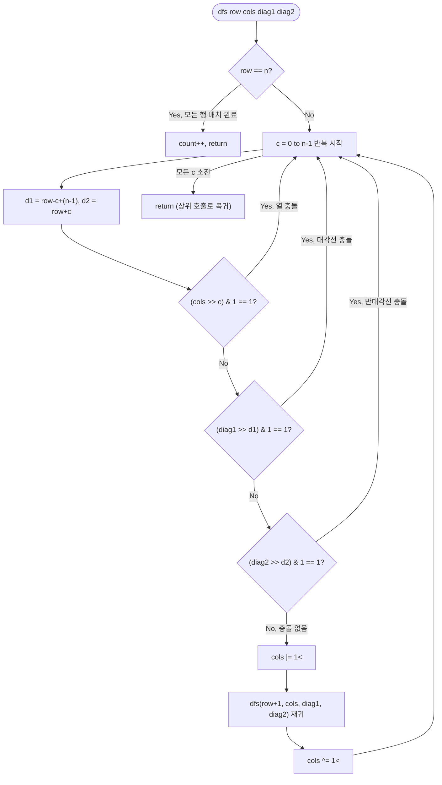

# nQueens 해설

## 성능 목표 예측

| 항목 | 값 |
|------|-----|
| 입력 $n$ | $1 \leq n \leq 12$ |
| 알려진 해의 수 | $n=1:1$, $n=4:2$, $n=8:92$, $n=12:14200$ |

**naive 완전 탐색의 한계.** $n \times n$ 보드의 $n^2$개 칸 중 $n$개를 고르는 모든 방법은 $\binom{n^2}{n}$이다. $n = 8$이면 약 $4.4 \times 10^9$로 너무 많다. 각 행마다 정확히 1개의 퀸만 놓는다는 제약을 활용하면 $n^n$가지로 줄어들지만, $n = 12$에서 $12^{12} \approx 8.9 \times 10^{12}$로 여전히 불가능하다.

**목표 복잡도와 근거.** 행마다 순서대로 퀸을 놓고, 충돌이 발생하면 즉시 가지를 치는 백트래킹(DFS + 가지치기)으로 탐색 노드를 급격히 줄인다. 최악은 $O(n!)$이지만 가지치기 효과로 실제 탐색 노드는 훨씬 적다 ($n=12$에서 해가 14,200개). 비트마스크로 충돌 검사를 $O(1)$로 단축하면 상수 계수도 작아진다.

**공간 복잡도.** 재귀 깊이 $n$, 각 레벨에서 비트마스크 3개를 인자로 전달. 전체 $O(n)$.

---

## 목표 함수

```ts
function nQueens(n: number): number
```

### 파라미터 표

| 파라미터 | 의미 | 제약 |
|---------|------|------|
| `n` | 체스판 크기 및 배치할 퀸의 수 | $1 \leq n \leq 12$ |

**반환값.** $n \times n$ 체스판에 $n$개의 퀸이 서로 공격하지 않도록 배치하는 방법의 수.

### 엣지케이스

1. **$n = 1$** — 1×1 보드에 퀸 1개를 놓는 방법은 1가지. 반환값 `1`.
2. **$n = 2, 3$** — 서로 공격하지 않는 배치가 존재하지 않는다. 반환값 `0`.
3. **$n = 4$** — 유효한 배치 2가지. 대칭(좌우 반전)이 서로 다른 해로 계산된다.
4. **$n = 12$** — 반환값 `14200`. 가지치기 없이 탐색하면 불가능하지만 비트마스크 백트래킹으로 빠르게 처리된다.

---

## 핵심 아이디어

### 원형 아이디어와 naive 접근

가장 단순한 생각은 "모든 열 배치를 순열로 표현하고, 대각선 충돌을 검사한다"는 것이다. 각 행에 퀸을 하나씩 배치하면 열 충돌을 자동으로 배제할 수 있고, 가능한 배치는 $n!$가지 열 순열이다.

```
for each permutation p of [0..n-1]:    // p[r] = r행에 놓일 열 번호
    if no diagonal conflicts:
        count++
```

**폭발 지점**: 순열 생성 자체가 $O(n!)$이고, $n = 12$에서 $12! = 479,001,600$이다. 순열마다 대각선 검사에 $O(n)$이 추가로 필요하다. 또한 충돌이 이미 발생한 상태에서도 순열 생성을 멈추지 않는다는 점이 핵심 낭비다.

### 어떤 관찰이 돌파구가 되는가

- **관찰 1.** 행 $r$에 퀸을 놓을 때 충돌이 발생하면, 그 행의 배치를 변경하기 전까지 이후 모든 행의 배치가 의미 없다. 따라서 충돌 시 **즉시 되돌아가** 다른 열을 시도해야 한다. 이것이 가지치기(pruning)의 핵심이다.
- **관찰 2.** 충돌 검사를 매번 $O(r)$ 스캔으로 하는 대신, 세 종류의 집합(사용된 열, 대각선 방향, 반대각선 방향)을 비트마스크로 관리하면 $O(1)$에 확인할 수 있다.
- **관찰 3.** 세 비트마스크 — `cols`, `diag1`($r - c$ 방향), `diag2`($r + c$ 방향) — 를 재귀 호출 인자로 전달하고, 배치 후 XOR로 되돌리면 상태 복원이 $O(1)$이다.

### 관찰을 형식화: 상태/구조 정의

**상태 정의.** 재귀 `dfs(row, cols, diag1, diag2)`는 행 `row`부터 $n-1$행까지 퀸을 배치하는 경우의 수를 반환한다. 단,

- `cols`: 이미 사용된 열의 비트셋. 비트 $c$가 1이면 열 $c$에 퀸이 있다.
- `diag1`: 사용된 $r - c$ 방향(좌상→우하 대각선) 비트셋. 비트 $d = r - c + (n-1)$이 1이면 해당 대각선 사용 중.
- `diag2`: 사용된 $r + c$ 방향(우상→좌하 반대각선) 비트셋. 비트 $d = r + c$가 1이면 해당 반대각선 사용 중.

이 형태여야 하는 이유: 두 퀸 $(r_1, c_1)$과 $(r_2, c_2)$가 같은 대각선에 있으면 $r_1 - c_1 = r_2 - c_2$ (또는 $r_1 + c_1 = r_2 + c_2$). 이 값을 비트 위치로 사용하면 집합 연산 하나로 충돌 여부를 확인할 수 있다. 배치 가능한 열은 세 마스크의 OR 값이 0인 비트들이다.

**비트마스크 인덱스:**

$$d_1 = r - c + (n-1) \quad \text{(음수 방지를 위해 } n-1 \text{ 오프셋)}$$
$$d_2 = r + c$$

### 점화식 또는 핵심 연산

**재귀 관계:**

$$\text{dfs}(row) = \sum_{c : \text{valid}(row, c)} \text{dfs}(row + 1, \text{cols} \cup \{c\}, \text{diag1} \cup \{d_1\}, \text{diag2} \cup \{d_2\})$$

기저: $row = n$이면 모든 행에 퀸이 배치 완료 — `1` 반환.

각 항의 의미:
- $\text{valid}(row, c)$: 비트 $c$가 `cols`, `diag1[d1]`, `diag2[d2]` 모두에서 0인 경우. 즉 세 마스크를 OR 하고 열 $c$에 해당하는 비트를 확인.
- `cols | (1 << c)`: 열 $c$를 사용 중으로 표시.
- `diag1 | (1 << d1)`: 대각선 $d_1 = row - c + (n-1)$를 사용 중으로 표시.
- `diag2 | (1 << d2)`: 반대각선 $d_2 = row + c$를 사용 중으로 표시.

### 정당성 — 왜 이것이 옳은가

**완전성.** 모든 유효한 배치는 각 행에 퀸이 정확히 1개인 구성이므로, `dfs`가 `row = 0`에서 `n-1`까지 순서대로 탐색하면 유효한 배치를 빠짐없이 방문한다.

**건전성.** `valid(row, c)` 조건을 통과한 경우에만 재귀를 진행한다. 이 조건이 열 충돌, 대각선 충돌, 반대각선 충돌 세 가지를 모두 배제하므로, `row = n`에 도달한 경우는 반드시 유효한 배치다.

**백트래킹의 정당성.** 비트마스크를 OR로 설정하고 XOR로 복원하는 방식은 배치 전 상태로 정확히 되돌린다. XOR 복원이 올바른 이유: $A \oplus B \oplus B = A$. 따라서 `cols ^= 1 << c`는 이전에 `cols |= 1 << c`로 설정한 비트를 정확히 지운다.

**까다로운 케이스.**

1. **$d_1 = r - c + (n-1)$의 범위**: $r \in [0, n-1]$, $c \in [0, n-1]$이면 $d_1 \in [0, 2n-2]$. 최대 $2n - 2 = 22$ (for $n = 12$). 32비트 정수의 비트마스크로 충분히 커버된다.
2. **$d_2 = r + c$의 범위**: 최대 $2n - 2 = 22$. 동일하게 안전하다.
3. **XOR로 비트 복원 시 전제**: 반드시 이전에 OR로 설정한 비트여야 한다. 이미 0인 비트를 XOR하면 1이 되어 상태가 오염된다. `valid` 조건이 "아직 사용되지 않은 비트"만 선택하므로 이 전제가 항상 만족된다.

### 구현 디테일과 최적화

- **유효 열 열거 최적화**: `available = ((1 << n) - 1) & ~(cols | diag1 | diag2)`로 유효한 열을 비트셋으로 구하고, 비트마다 `available & -available`로 최하위 비트를 하나씩 추출하면 충돌 열을 아예 시도하지 않는다. 내부 루프 횟수가 `n`이 아닌 "유효한 열의 수"로 줄어든다.
- **대칭 활용**: $n$-Queens 해는 좌우 대칭이므로, 첫 행의 열 $c$와 $n-1-c$에 놓는 경우는 대칭이다. 첫 행의 절반만 탐색하고 $\times 2$하면 속도가 약 2배 빨라진다. 단, $n$이 홀수이면 중앙 열은 별도로 처리한다.
- **비트마스크가 int 범위를 넘지 않는지**: $n \leq 12$이면 `diag1`, `diag2`의 인덱스 최대값이 22. 32비트 정수로 안전하다.

---

## 수도 코드와 Activity Diagram

### 의사코드

```
function nQueens(n):
    count = 0                     // 유효한 배치 수 누적

    function dfs(row, cols, diag1, diag2):
        // 불변식 진입: cols, diag1, diag2는 0~(row-1)행의 배치를 정확히 반영
        if row == n:
            count += 1            // 모든 행 배치 완료 → 유효한 해
            return

        for c in 0..n-1:
            d1 = row - c + (n - 1)   // 대각선(\) 인덱스
            d2 = row + c             // 반대각선(/) 인덱스

            // 충돌 검사: 세 마스크 모두에서 해당 비트가 0이어야 유효
            if (cols >> c) & 1:  continue   // 열 충돌
            if (diag1 >> d1) & 1: continue  // 대각선 충돌
            if (diag2 >> d2) & 1: continue  // 반대각선 충돌

            // 배치: 비트 설정
            cols  |= 1 << c
            diag1 |= 1 << d1
            diag2 |= 1 << d2

            dfs(row + 1, cols, diag1, diag2)   // 다음 행으로 재귀

            // 되돌리기: XOR로 비트 복원 (A ⊕ B ⊕ B = A)
            cols  ^= 1 << c
            diag1 ^= 1 << d1
            diag2 ^= 1 << d2
        // 불변식 복원: dfs 반환 후 cols, diag1, diag2는 호출 전 상태와 동일

    dfs(0, 0, 0, 0)    // 0행부터 탐색, 초기 마스크 모두 0 (아무 퀸 없음)
    return count
```

**핵심 불변식:** `dfs(row, ...)` 진입 시 `cols`, `diag1`, `diag2`는 행 $0 \sim row-1$의 배치 상태를 정확히 반영하며, `dfs` 반환 후에는 호출 전 상태로 완전히 복원된다.

### Activity Diagram


