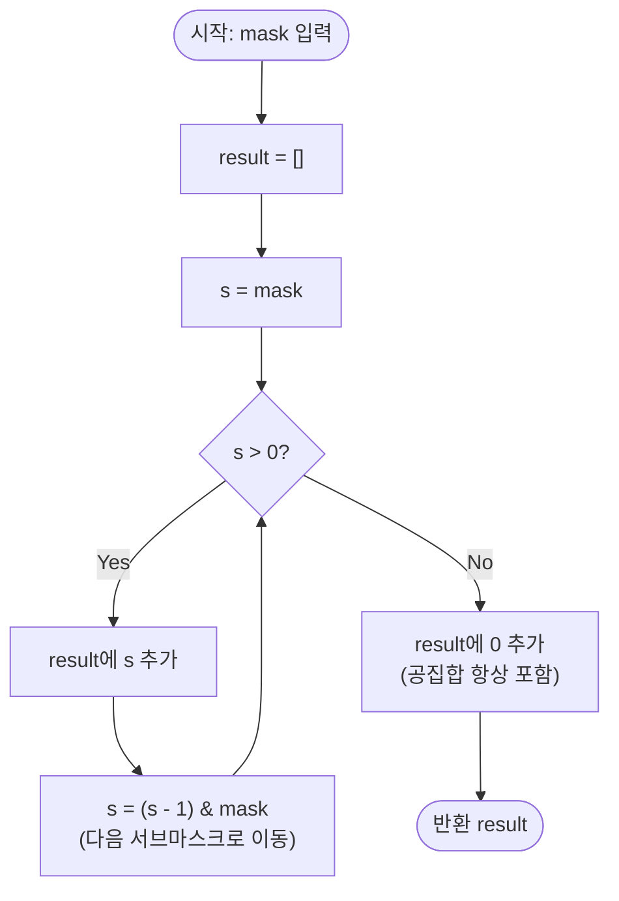

# 부분집합 순회 (Submask Enumeration) 해설

## 성능 목표 예측

| 항목 | 값 |
|------|-----|
| 입력 크기 | `0 ≤ mask ≤ 2^20` |
| 세팅된 비트 수 | `k = popcount(mask)`, `0 ≤ k ≤ 20` |
| 서브마스크 개수 | $2^k$ 개 |

**naive 접근의 한계:** 가장 단순한 방법은 `0`부터 `mask`까지 모든 정수를 순회하면서 `(s & mask) === s`를 확인하는 것이다. 이 경우 시간복잡도는 $O(2^{20}) \approx 10^6$이다. 단일 mask에 대해서는 허용 범위이나, 모든 $2^{20}$개의 mask에 대해 이 방법을 적용하면 총 $O(2^{20} \times 2^{20}) = O(2^{40})$ 이 되어 완전히 불가능하다.

**목표 복잡도:** 단일 mask에 대해 $O(2^k)$ — 실제로 존재하는 서브마스크 수만큼만 순회한다. 이는 이론적 하한이기도 하다(결과 배열 크기가 $2^k$이므로 최소 $2^k$ 번 연산이 필요하다).

**전체 복잡도:** 0부터 $2^n - 1$까지의 모든 mask에 대해 서브마스크를 열거하면 합산 횟수는 $3^n$이다. 각 비트 위치가 "mask에 없음 / mask에는 있지만 s에 없음 / 둘 다 있음"의 3가지 상태를 가지기 때문이다.

**공간 복잡도:** $O(2^k)$ — 반환하는 결과 배열에 $2^k$개의 서브마스크를 담는다. 추가 작업 공간은 $O(1)$이다.

---

## 목표 함수

```ts
function enumerateSubmasks(mask: number): number[]
```

| 파라미터 | 의미 | 제약 |
|----------|------|------|
| `mask` | 기준 비트마스크 정수 | `0 ≤ mask ≤ 2^20` |

**반환값:** `mask`의 모든 서브마스크를 **내림차순**으로 담은 배열. 공집합(`0`)을 반드시 포함한다. 서브마스크의 정의: 정수 `s`가 `mask`의 서브마스크 $\Leftrightarrow$ `(s & mask) === s`, 즉 $s$의 모든 세팅 비트가 `mask`에도 세팅되어 있다.

**엣지케이스:**

1. `mask = 0` → `[0]`: 공집합은 항상 자신의 서브마스크이므로 정확히 1개를 반환한다.
2. `mask = 1` → `[1, 0]`: 세팅 비트가 1개이면 서브마스크는 $2^1 = 2$개이다.
3. `mask = 0b11111...1` ($k=20$) → 내림차순으로 $2^{20} \approx 10^6$개: 최대 입력에서도 정상 동작해야 한다.

---

## 핵심 아이디어

### 원형 아이디어와 naive 접근

가장 직관적인 방법은 `0`부터 `mask`까지 모든 후보를 나열하고 서브마스크 조건을 검사하는 것이다.

```
for s in 0..mask:
    if (s & mask) === s:
        result.push(s)
```

이 방법은 정확하지만 $O(mask)$ 시간이 걸린다. mask = $2^{20}$이면 $10^6$회, 단일 호출에서는 허용되지만, 모든 mask에 대해 반복 적용하면 총 $O(2^{40})$으로 폭발한다. 또한 출력 배열이 오름차순이므로 내림차순을 원한다면 뒤집는 추가 비용도 필요하다.

**폭발 지점:** 이 방법은 $O(mask)$이지 $O(2^k)$가 아니다. $k \ll 20$인 희소 mask(예: k=1이면 서브마스크는 2개뿐이지만 $2^{20}$번 순회)에서 낭비가 극심하다.

### 어떤 관찰이 돌파구가 되는가

- **관찰 1:** $s$의 서브마스크 중 $s$ 바로 아래(s보다 작은 것 중 최대)는 $s - 1$에서 `mask` 밖의 비트를 제거한 $(s-1) \,\&\, mask$이다.
- **관찰 2:** $(s-1)$은 $s$의 최하위 1비트를 0으로 바꾸고 그 아래를 모두 1로 채운다. `& mask`를 적용하면 `mask` 외부의 비트가 제거되므로, 결과는 $s$보다 작으면서 `mask`의 서브마스크인 가장 큰 수가 된다.
- **관찰 3:** 이 과정을 $s > 0$인 동안 반복하면 서브마스크를 중복 없이, 내림차순으로, 빠짐없이 열거할 수 있다.

### 관찰을 형식화: 상태/구조 정의

루프 변수 $s$를 다음과 같이 정의한다.

$$s_0 = mask, \quad s_{i+1} = (s_i - 1) \,\&\, mask \quad (s_i > 0)$$

이 점화식이 **"mask의 서브마스크를 내림차순으로 빠짐없이 생성하는 열"**을 정의함을 보인다. 이 형태여야 하는 근거는 다음과 같다. 임의로 서브마스크를 열거하는 방법 중 각 단계에서 $O(1)$ 비트 연산만으로 다음 서브마스크로 이동할 수 있는 유일한 패턴이 이 점화식이다. 정렬이나 재귀 없이 선형 루프만으로 $O(2^k)$를 달성한다.

### 점화식 또는 핵심 연산

$$s_{\text{next}} = (s - 1) \,\&\, mask$$

**각 항의 의미:**
- $s - 1$: $s$의 최하위 1비트(위치 $p$)를 0으로 만들고 위치 $p$ 미만을 모두 1로 채운다.
- $\&\, mask$: `mask`에 없는 비트(항상 0인 위치)를 제거한다. 이 과정에서 "mask의 서브마스크 중 s보다 작으면서 가장 큰 수"가 선택된다.

**유도 예시** ($s = \text{0b}1010 = 10$, $mask = \text{0b}1011 = 11$):

$$s - 1 = \text{0b}1001 = 9, \quad (s-1) \,\&\, mask = \text{0b}1001 \,\&\, \text{0b}1011 = \text{0b}1001 = 9$$

다음 단계: $s = 9 = \text{0b}1001$

$$s - 1 = \text{0b}1000 = 8, \quad (s-1) \,\&\, mask = \text{0b}1000 = 8$$

### 정당성 — 왜 이것이 옳은가

**귀납적 불변식:** 루프 시작 시 $s$는 항상 `mask`의 서브마스크이다. 즉 $(s \,\&\, mask) = s$가 성립한다.

- **기저:** $s_0 = mask$이고, $(mask \,\&\, mask) = mask$이므로 성립한다.
- **귀납:** $(s \,\&\, mask) = s$라 가정하자. $s_{\text{next}} = (s-1) \,\&\, mask$이면, $(s_{\text{next}} \,\&\, mask) = ((s-1) \,\&\, mask) \,\&\, mask = (s-1) \,\&\, mask = s_{\text{next}}$이므로 성립한다.

**빠짐없음:** $s$와 $s_{\text{next}}$ 사이에 `mask`의 서브마스크 $t$ ($s_{\text{next}} < t < s$)가 존재한다고 가정하자. $t < s$이므로 $t \leq s-1$이고, $t$는 `mask`의 서브마스크이므로 $(t \,\&\, mask) = t$이다. 따라서 $t \leq (s-1) \,\&\, mask = s_{\text{next}}$인데 이는 $t > s_{\text{next}}$에 모순이다.

**까다로운 케이스:** $s = 0$일 때 루프를 종료하고 0을 별도로 추가해야 한다. $0$은 항상 `mask`의 서브마스크($(0 \,\&\, mask) = 0$)이며, 루프 조건 `s > 0`에서 걸러지기 때문에 반드시 수동으로 추가해야 한다.

### 구현 디테일과 최적화

- **루프 조건:** `while (s > 0)`이면 0을 제외한 서브마스크만 처리된다. 루프 종료 후 `result.push(0)`을 반드시 추가한다.
- **mask = 0인 경우:** $s_0 = 0$이므로 루프가 아예 실행되지 않는다. `result.push(0)` 한 번으로 `[0]`이 반환된다. 별도 분기 처리 불필요하다.
- **배열 사전 할당:** 서브마스크 개수가 $2^k$임을 알면 `new Array(1 << popcount(mask))`로 미리 할당하여 동적 push 비용을 줄일 수 있다.
- **함정:** `for (let s = mask; s; s = (s-1) & mask)`로 작성할 때 루프 종료 후 0을 추가하지 않는 실수가 흔하다. 0은 반드시 포함해야 한다.

---

## 수도 코드와 Activity Diagram

### 의사코드

```
function enumerateSubmasks(mask):
  result ← []          // 불변식: result의 모든 원소는 mask의 서브마스크

  s ← mask             // 불변식: s는 항상 mask의 서브마스크 (s & mask === s)
  while s > 0:
    result.append(s)   // 현재 서브마스크 수집
    s ← (s - 1) & mask // 불변식 유지: 다음 서브마스크 = mask 서브마스크 중 s 미만 최대값

  result.append(0)     // 공집합은 항상 서브마스크; 루프에서 처리되지 않으므로 별도 추가
  return result
```

### Activity Diagram



**핵심 불변식:** 루프 진입 시 `s`는 항상 `mask`의 서브마스크이다. 즉 `(s & mask) === s`가 매 반복에서 성립한다.

---

### 실행 예시 (mask = 0b1011 = 11)

| 단계 | s (2진) | s (10진) | 연산 | 수집값 |
|------|---------|----------|------|--------|
| 초기 | `1011` | 11 | — | 11 |
| 1회 | `(1010) & 1011 = 1010` | 10 | — | 10 |
| 2회 | `(1001) & 1011 = 1001` | 9 | — | 9 |
| 3회 | `(1000) & 1011 = 1000` | 8 | — | 8 |
| 4회 | `(0111) & 1011 = 0011` | 3 | — | 3 |
| 5회 | `(0010) & 1011 = 0010` | 2 | — | 2 |
| 6회 | `(0001) & 1011 = 0001` | 1 | — | 1 |
| 7회 | s = 0, 루프 종료 | — | 0 별도 추가 | 0 |

결과: `[11, 10, 9, 8, 3, 2, 1, 0]` — $2^3 = 8$개 (popcount(11) = 3)

**$3^n$ 분석:** 0부터 $2^2 - 1 = 3$까지의 모든 mask에 대해 서브마스크를 열거하면 총 $3^2 = 9$개의 (mask, submask) 쌍이 존재한다. 각 비트 위치마다 3가지 상태가 독립적으로 존재하기 때문이다.
