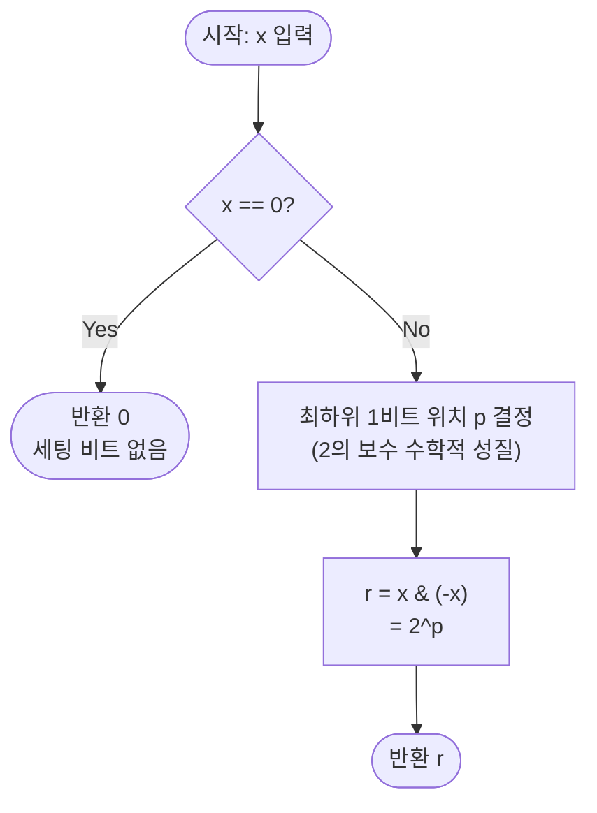

# 최하위 1비트 (Lowest Set Bit) 해설

## 성능 목표 예측

| 항목 | 값 |
|------|-----|
| 입력 범위 | 32비트 정수 (`-2^31 ≤ x ≤ 2^31 - 1`) |
| 입력 크기 | 단일 정수, 배열 없음 |

**naive 접근의 한계:** 가장 단순한 방법은 비트 위치 0부터 31까지 순서대로 `(x >> i) & 1`을 검사하여 처음으로 1이 나오는 위치를 찾는 것이다. 이 경우 최악의 시간복잡도는 $O(32) = O(1)$로 나쁘지 않지만, 최하위 1비트 위치 $p$가 클수록($p$가 31에 가까울수록) 불필요한 순회가 길어진다. 또한 비트 위치 번호를 반환하는 것이 아니라 "해당 비트만 남긴 값"을 반환해야 하므로 추가 계산(`1 << p`)이 필요하다.

**목표 복잡도:** $O(1)$ — 단일 비트 연산 `x & (-x)` 한 번으로 끝난다. 이는 이론적 하한이기도 하다. 입력 1개를 읽는 데 이미 $\Omega(1)$이 필요하므로 $O(1)$보다 빠를 수 없다.

**공간 복잡도:** $O(1)$ — 중간 변수 없이 단일 연산 결과를 반환한다.

**트레이드오프:** 이 문제는 메모리-시간 트레이드오프가 없다. 단순히 2의 보수 표현의 수학적 성질을 이용하므로 공간을 더 쓴다고 더 빨라지지 않는다.

---

## 목표 함수

```ts
function lowestSetBit(x: number): number
```

| 파라미터 | 의미 | 제약 |
|----------|------|------|
| `x` | 32비트 정수 | `-2^31 ≤ x ≤ 2^31 - 1` |

**반환값:** `x`의 최하위(가장 낮은 비트 위치) 1비트만 1로 남기고 나머지를 0으로 한 값. 예: `x = 0b1100 = 12`이면 최하위 1비트는 위치 2이므로 결과는 `0b0100 = 4`이다.

**엣지케이스:**

1. `x = 0` → `0`: 세팅된 비트가 없으므로 0을 반환한다. `0 & (-0) = 0 & 0 = 0`으로 올바르게 처리된다.
2. `x = 1` → `1`: 최하위 비트가 위치 0이므로 결과는 $2^0 = 1$이다.
3. `x = -2147483648` (= $-2^{31}$, 최솟값) → `2147483648` (= $2^{31}$으로 표현 불가이므로 JavaScript에서 bigint가 필요할 수 있음): 이 경우 `x & (-x)`는 비트 31만 세팅된 값이다. JavaScript의 `number`는 53비트 정수를 정확히 표현하므로 32비트 범위에서는 정상 동작한다.

---

## 핵심 아이디어

### 원형 아이디어와 naive 접근

최하위 1비트를 찾는 가장 단순한 방법은 비트를 하나씩 검사하는 것이다.

```
for i in 0..31:
    if (x >> i) & 1 == 1:
        return 1 << i
return 0
```

이 방법은 정확하게 동작하지만 최악의 경우 32번 반복한다. 더 근본적인 문제는 이 방법이 "최하위 1비트를 찾는다"는 구조적 의미를 이용하지 않고 기계적으로 탐색한다는 점이다. 폭발 지점은 없지만(32번 이상 반복하지 않으므로), 2의 보수 표현을 활용하면 단 한 번의 연산으로 동일한 결과를 얻을 수 있다.

### 어떤 관찰이 돌파구가 되는가

- **관찰 1:** 현대 컴퓨터는 음의 정수를 2의 보수(two's complement)로 표현한다. 즉 $-x = \sim x + 1$이다.
- **관찰 2:** $x$의 최하위 1비트 위치를 $p$라 하면, $x$는 "위치 $p$에 1, 위치 $p$ 미만에 모두 0"이고 위치 $p$ 초과는 임의의 비트 패턴을 가진다. $\sim x + 1$ 연산은 위치 $p$ 미만은 0으로, 위치 $p$는 1로, 위치 $p$ 초과는 $x$와 반전된 비트 패턴으로 만든다.
- **관찰 3:** 따라서 $x \,\&\, (-x)$는 정확히 위치 $p$에만 1이고 나머지는 0인 값이 된다. 이것이 바로 최하위 1비트만 남긴 값이다.

### 관찰을 형식화: 상태/구조 정의

$x$를 비트 열로 표현할 때 최하위 1비트 위치 $p$를 기준으로 분리한다.

$$x = \underbrace{b_{31} \cdots b_{p+1}}_{p \text{ 초과, 임의}} \underbrace{1}_{p \text{ 번째}} \underbrace{0 \cdots 0}_{p \text{ 미만, 모두 0}}$$

$\sim x$는 모든 비트를 반전한다.

$$\sim x = \underbrace{\bar{b}_{31} \cdots \bar{b}_{p+1}}_{p \text{ 초과, 반전}} \underbrace{0}_{p \text{ 번째}} \underbrace{1 \cdots 1}_{p \text{ 미만, 모두 1}}$$

$\sim x + 1 = -x$는 가장 낮은 1비트(위치 $p$)에서 올림(carry)이 발생하여 멈춘다.

$$-x = \underbrace{\bar{b}_{31} \cdots \bar{b}_{p+1}}_{p \text{ 초과, 반전}} \underbrace{1}_{p \text{ 번째}} \underbrace{0 \cdots 0}_{p \text{ 미만, 모두 0}}$$

이 구조 정의가 핵심이다. $-x$는 "위치 $p$ 미만은 $x$와 동일하게 0, 위치 $p$는 $x$와 동일하게 1, 위치 $p$ 초과는 $x$와 반전"이다.

### 점화식 또는 핵심 연산

$$\text{lowestSetBit}(x) = x \,\&\, (-x)$$

**각 비트 위치별 분석:**

| 위치 | $x$의 비트 | $-x$의 비트 | $x \,\&\, (-x)$ |
|------|-----------|------------|-----------------|
| $p$ 미만 | $0$ | $0$ | $0$ |
| $p$ 번째 | $1$ | $1$ | $1$ |
| $p$ 초과 | $b_i$ (임의) | $\bar{b}_i$ (반전) | $b_i \,\&\, \bar{b}_i = 0$ |

위치 $p$ 초과에서 $x$와 $-x$의 비트는 서로 반전 관계이므로 AND 결과는 항상 0이다. 따라서 $x \,\&\, (-x)$는 정확히 위치 $p$에만 1인 값, 즉 $2^p$가 된다.

### 정당성 — 왜 이것이 옳은가

**2의 보수 덧셈의 carry 불변식으로 정당화한다.**

$\sim x$를 계산하면 위치 $p$ 미만의 모든 비트가 1이 된다(원래 0이었으므로). $\sim x + 1$을 계산할 때, 위치 0부터 올림이 연쇄적으로 전파되어 위치 $p-1$까지 모두 0이 된다. 위치 $p$에서 $\sim x$는 0이었으므로 올림을 받아 1이 되고, 올림이 멈춘다. 위치 $p$ 초과는 $\sim x$의 비트가 그대로 유지된다($1 + 0 = 1$이고 올림 없음).

**까다로운 케이스:** $x = 0$이면 모든 비트가 0이므로 최하위 1비트가 없다. $-0 = 0$이므로 $0 \,\&\, 0 = 0$이 반환된다. 이는 "세팅된 비트 없음"의 올바른 표현이다.

JavaScript의 `number` 타입은 비트 연산 시 내부적으로 32비트 정수로 변환한 후 연산한다. 따라서 $x < 0$인 경우에도 2의 보수 연산이 정확히 적용된다.

### 구현 디테일과 최적화

- **단 한 줄:** `return x & (-x)` 가 전부이다. 별도 분기나 루프가 필요하지 않다.
- **Fenwick Tree(BIT) 응용:** BIT의 인덱스 $i$가 담당하는 구간 길이는 `lowestSetBit(i)`이다. 업데이트 시 `i += lowestSetBit(i)`, 쿼리 시 `i -= lowestSetBit(i)`로 이동하면 $O(\log N)$ 안에 prefix sum을 처리한다.
- **비트 DP 응용:** 비트마스크 DP에서 `mask`에서 특정 원소를 제거할 때 `mask & ~(1 << i)` 대신 활용 가능한 경우가 있다.
- **함정:** JavaScript에서 `-x`는 단항 마이너스(-) 연산자로, 부동소수점 음수를 만든다. 그러나 비트 AND(`&`) 연산자는 두 피연산자를 모두 32비트 정수로 변환하므로 올바르게 작동한다. 단, `x = 2^31` 이상의 값에서는 정밀도 손실이 발생할 수 있으므로 주의해야 한다.

---

## 수도 코드와 Activity Diagram

### 의사코드

```
function lowestSetBit(x):
  // 불변식: x는 32비트 정수
  // -x는 2의 보수로 (~x + 1)과 동일
  // x & (-x)는 x의 최하위 1비트 위치 p에서만 1이고 나머지는 0
  return x & (-x)
  // 반환값 r에 대해 r & (r - 1) === 0이 항상 성립 (2의 거듭제곱 또는 0)
```

### Activity Diagram



**핵심 불변식:** 반환값 `r`은 항상 2의 거듭제곱이거나 0이다. 즉 `r & (r - 1) === 0`이 항상 성립한다.

---

### 실행 예시

| x (10진) | x (2진, 8비트) | $-x$ (2진, 8비트) | $x \,\&\, (-x)$ | 결과 | $p$ |
|----------|--------------|-----------------|-----------------|------|-----|
| 12 | `0000 1100` | `1111 0100` | `0000 0100` | 4 | 2 |
| 1  | `0000 0001` | `1111 1111` | `0000 0001` | 1 | 0 |
| 8  | `0000 1000` | `1111 1000` | `0000 1000` | 8 | 3 |
| 6  | `0000 0110` | `1111 1010` | `0000 0010` | 2 | 1 |
| 0  | `0000 0000` | `0000 0000` | `0000 0000` | 0 | — |

**$x = 12$ 상세 분해:**

$$12 = \text{0b}00001100, \quad \sim 12 = \text{0b}11110011, \quad -12 = \sim 12 + 1 = \text{0b}11110100$$

$$12 \,\&\, (-12) = \text{0b}00001100 \,\&\, \text{0b}11110100 = \text{0b}00000100 = 4$$

위치 $p = 2$에서 $2^2 = 4$가 올바르게 추출된다.
