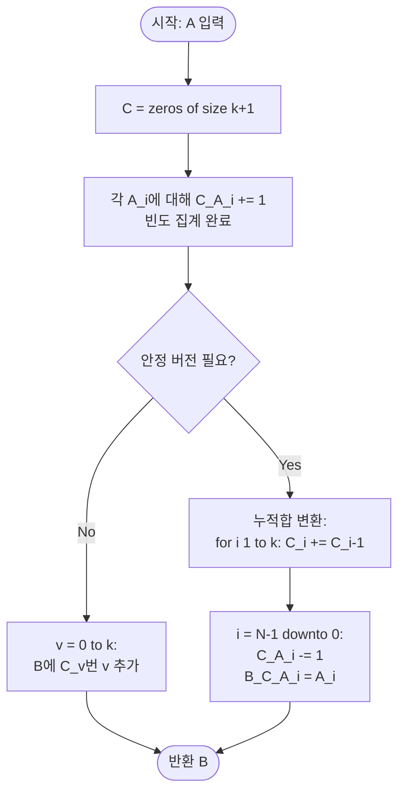

# Counting Sort — 해설

## 성능 목표 예측

| 항목 | 값 |
|------|----|
| 입력 크기 N | 1 ≤ N ≤ 100,000 |
| 값 범위 k | 0 ≤ A[i] ≤ 1,000 |
| 목표 시간 복잡도 | **O(N + k)** |
| 공간 복잡도 | **O(N + k)** |

**naive 접근의 복잡도와 한계:**
가장 단순한 접근은 비교 기반 정렬이다. 예를 들어 버블 정렬은 $O(N^2)$이고, $N = 100{,}000$이면 $10^{10}$ 연산으로 시간 초과가 확실하다. 퀵소트·머지소트 같은 비교 기반 정렬은 $\Omega(N \log N)$ 하한을 가지며, $N = 10^5$에서 약 $1.7 \times 10^6$ 연산으로 통과 가능하다. 그러나 이 문제에는 더 강한 구조가 있다.

**목표 복잡도의 근거:**
원소 값이 $[0, k]$로 제한된 정수이면, 비교 없이 **빈도 계수**만으로 정렬이 가능하다. 이는 비교 기반 정렬의 $\Omega(N \log N)$ 정보-이론적 하한을 우회한다. 빈도 배열 $C$의 크기는 $k + 1 = 1{,}001$이고, $k \ll N$ 이므로 $O(N + k) \approx O(N)$이 성립한다.

**공간 트레이드오프:**
빈도 배열 $C$에 $O(k)$, 출력 배열 $B$에 $O(N)$ 추가 공간을 사용한다. $k$가 $N$보다 훨씬 크다면 Counting Sort는 오히려 손해이므로 적용 전에 $k \ll N$ 여부를 확인해야 한다.

---

## 목표 함수

```ts
function countingSort(A: number[]): number[]
```

| 파라미터 | 의미 | 제약 |
|---------|------|------|
| `A` | 비음 정수 배열 | $1 \leq N \leq 100{,}000$ |
| `A[i]` | 각 원소의 값 | $0 \leq A[i] \leq 1{,}000$ |

**반환값:** 오름차순으로 정렬된 새 배열. 원본 배열 `A`는 변경하지 않는다.

**엣지케이스:**

| 케이스 | 입력 예시 | 기대 출력 |
|--------|----------|----------|
| 빈 입력 | `[]` | `[]` |
| 단일 원소 | `[5]` | `[5]` |
| 동일 값만 존재 | `[3, 3, 3]` | `[3, 3, 3]` |
| 최솟값·최댓값 경계 | `[0, 1000, 500]` | `[0, 500, 1000]` |
| 이미 정렬된 입력 | `[1, 2, 3]` | `[1, 2, 3]` |

---

## 핵심 아이디어

### 원형 아이디어와 naive 접근

문제를 가장 단순하게 풀면, 두 원소를 비교해서 더 작은 것을 앞으로 보내는 방식을 반복한다. 버블 정렬 의사코드:

```
for i from 0 to N-1:
    for j from i+1 to N-1:
        if A[i] > A[j]: swap(A[i], A[j])
```

이 접근은 $N = 100{,}000$에서 최악 $\frac{N(N-1)}{2} \approx 5 \times 10^9$ 비교를 수행하므로 시간 초과다. 퀵소트·머지소트로 개선해도 $\Theta(N \log N)$이 최선인데, 여기서 핵심 낭비를 발견할 수 있다: **비교 자체가 불필요하다.** 값의 범위가 알려져 있으면, 각 값이 몇 번 나타났는지를 세는 것만으로도 순서를 결정할 수 있다.

### 어떤 관찰이 돌파구가 되는가

- **관찰 1 (값 범위의 제한성):** 원소가 $[0, 1{,}000]$ 정수로 제한되어 있으므로 가능한 값이 1,001종류뿐이다. 이 유한한 집합을 인덱스로 사용할 수 있다.
- **관찰 2 (빈도만으로 순서 결정 가능):** 정렬된 배열은 "0이 몇 개, 1이 몇 개, ..., 1000이 몇 개"를 순서대로 나열한 것과 동일하다. 비교 없이 **빈도 정보**만으로 출력을 구성할 수 있다.
- **관찰 3 (중복 계산 제거):** 비교 기반 정렬에서는 같은 값끼리 비교가 반복된다. 빈도 배열을 쓰면 같은 값을 한 번만 처리한다.

### 관찰을 형식화: 상태/구조 정의

위 관찰을 토대로 **빈도 배열** $C$를 정의한다:

$$C[v] = |\{i \mid A[i] = v\}|, \quad v \in [0, k]$$

$C$는 크기 $k + 1$인 정수 배열이고, $C[v]$는 값 $v$가 입력에 나타난 횟수다. 이 정의가 왜 이 형태여야 하는가: $v$를 인덱스로 직접 사용해야 O(1) 접근이 가능하며, 해시맵을 쓰면 상수 인수가 커지고 구현이 복잡해진다. $k = 1{,}000$이 고정이므로 배열의 메모리 낭비도 없다.

누적합 버전에서는 $C[v] \leftarrow C[v] + C[v-1]$ 변환을 통해 $C[v]$가 "$v$ 이하인 원소의 총 개수"를 나타내도록 재정의한다. 이로써 각 값의 출력 배열 내 최종 위치 범위를 $O(k)$에 확정할 수 있다.

### 점화식 또는 핵심 연산

**단순 버전 (안정성 불필요 시)의 출력 구성:**

$$B = [v \text{ repeated } C[v] \text{ times}, \text{ for } v = 0, 1, \ldots, k]$$

즉, $v = 0$부터 $k$까지 순서대로 $C[v]$개의 $v$를 출력 배열에 붙여 넣는다. 이 연산이 옳은 이유: $C[v]$개만큼 $v$를 출력하면 원래 배열의 원소 개수를 정확히 유지하고, $v$를 오름차순으로 처리하므로 정렬 조건 $B[i] \leq B[i+1]$을 보장한다.

**안정 버전 (누적합 활용)의 배치 수식:**

누적합 변환 후 각 $A[i]$의 출력 위치:
$$\text{pos}(A[i]) = C[A[i]] - 1, \quad C[A[i]] \mathrel{-}= 1$$

- $C[A[i]]$: 현재 $A[i]$ 이하 원소 중 아직 배치되지 않은 마지막 위치 + 1
- 감소 연산: 같은 값이 여러 번 나올 때 각 인스턴스가 서로 다른 위치에 배치되도록 함

### 정당성 — 왜 이것이 옳은가

빈도 배열을 채우는 루프를 완료하면 $\sum_{v=0}^{k} C[v] = N$이 성립하므로 원소를 하나도 잃지 않는다. $v$를 0부터 $k$까지 오름차순으로 처리하며 출력하므로, 출력 배열은 자동으로 오름차순이다. 동일한 값 $v$는 $C[v]$개 연속으로 출력되므로 중복 원소도 올바르게 처리된다. 안정 버전에서 배치를 뒤에서 앞으로 수행하면 같은 값의 원소들이 입력에서의 상대 순서를 유지한다(귀납적으로: 마지막 원소가 가장 높은 위치에 배치되고, 이전 원소들은 그 앞에 순서대로 놓인다). 값 범위 $A[i] \in [0, k]$ 조건이 만족되는 한 배열 인덱스 초과 문제는 발생하지 않는다.

### 구현 디테일과 최적화

- **배열 크기 고정 vs 동적:** `k = 1000`으로 고정하거나 `Math.max(...A)`로 동적 계산 가능하다. 동적으로 구하면 입력에 큰 값이 없을 때 불필요한 순회를 줄인다.
- **단순 버전 vs 안정 버전:** 이 문제에서는 안정성이 요구되지 않으므로 단순 버전이 코드가 짧고 이해하기 쉽다.
- **흔한 함정 — 누적합 방향:** 누적합을 왼쪽에서 오른쪽으로 계산해야 한다. 반대 방향으로 계산하면 위치 정보가 뒤집혀 틀린 결과가 나온다.
- **흔한 함정 — 안정 배치 방향:** 안정 버전에서 원본 배열을 앞에서 뒤로 처리하면 동일 값의 상대 순서가 역전된다. 반드시 뒤에서 앞으로(`i = N-1 downto 0`) 처리해야 안정성이 보장된다.
- **공간 절감:** 단순 버전은 보조 배열이 $O(k)$뿐이다. 안정 버전은 $O(N + k)$가 필요하다.

---

## 수도 코드와 Activity Diagram

### 의사코드

**단순 버전 (안정성 불필요 시):**

```
function countingSort(A):
    k = 1000
    C = array of zeros, size k+1    // 불변식: C[v] = A에서 v의 빈도

    for v in A:
        C[v] += 1                   // 각 값의 빈도 집계

    // 불변식: sum(C) = N
    B = []
    for v from 0 to k:
        repeat C[v] times:
            B.append(v)             // v를 C[v]번 오름차순으로 출력

    // 불변식: B는 오름차순, len(B) = N
    return B
```

**안정 버전 (누적합 활용):**

```
function countingSort(A):
    k = max(A)                       // 실제 최댓값으로 범위 제한
    C = array of zeros, size k+1     // 불변식: C[v] = v의 빈도

    // 1단계: 빈도 집계
    for v in A:
        C[v] += 1

    // 2단계: 누적합 → 출력 시작 위치
    // 불변식 변환 후: C[v] = v 이하인 원소의 총 개수
    for i from 1 to k:
        C[i] += C[i-1]

    // 3단계: 뒤에서 앞으로 배치 (안정성 보장)
    // 불변식: 처리된 A[i..N-1]의 원소는 B의 올바른 위치에 있다
    B = array of size len(A)
    for i from len(A)-1 downto 0:
        v = A[i]
        C[v] -= 1
        B[C[v]] = v

    return B
```

### Activity Diagram



**핵심 불변식:** 단순 버전 종료 시 $B[j] \leq B[j+1]$ (오름차순), $|B| = N$ (원소 보존). 안정 버전의 누적합 변환 후 $C[v]$는 출력 배열에서 $v$ 이하 원소들의 끝 위치 + 1을 나타낸다.

---

**예시:** $A = [3, 0, 1, 3, 1, 0]$

```
빈도 집계: C = [2, 2, 0, 2, 0, ...]
                 0  1  2  3  4
단순 출력:  [0, 0, 1, 1, 3, 3]
```
