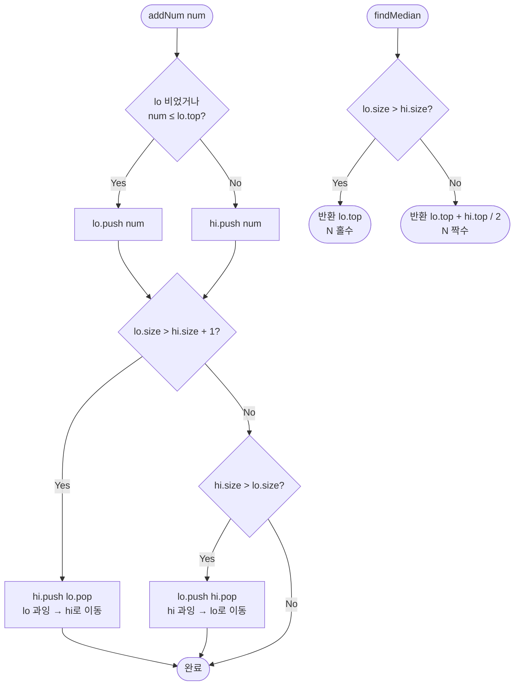

# Find Median from Data Stream — 해설

## 성능 목표 예측

| 항목 | 값 |
|------|----|
| 호출 횟수 Q | 1 ≤ Q ≤ 100,000 |
| 값 범위 | −10⁹ ≤ num ≤ 10⁹ |
| `addNum` 목표 시간 | **O(log N)** |
| `findMedian` 목표 시간 | **O(1)** |
| 공간 복잡도 | **O(N)** |

**naive 접근의 복잡도와 한계:**
가장 단순한 구현: 동적 배열에 원소를 추가하고, `findMedian` 호출 시 정렬 후 중앙값을 반환한다.

```
addNum(num):    arr.push(num)            // O(1)
findMedian():   arr.sort(); return 중앙값  // O(N log N)
```

`findMedian`이 $Q$번 호출되면 총 비용 $O(Q \cdot N \log N) = O(Q^2 \log Q) \approx 10^{10} \cdot 17 \approx 1.7 \times 10^{11}$ 연산으로 완전히 불가능하다. 삽입 시 정렬을 유지하는 방법도 `addNum`이 $O(N)$ (배열 삽입)이 되어 $O(Q^2) = 10^{10}$으로 시간 초과다.

**목표 복잡도의 근거:**
$Q$번의 `addNum`과 `findMedian` 조합에서 총 비용 $O(Q \log Q)$이어야 한다. `addNum` $O(\log N)$, `findMedian` $O(1)$이면 $Q$번 각각 호출 시 $O(Q \log Q)$이 된다. 이를 달성하려면 "중앙값 후보"에 $O(1)$ 접근하면서 삽입 시 구조를 $O(\log N)$에 유지하는 자료구조가 필요하다.

---

## 목표 함수

```ts
class MedianFinder {
  addNum(num: number): void
  findMedian(): number
}
```

| 메서드 | 의미 | 제약 |
|--------|------|------|
| `addNum(num)` | 스트림에 `num` 추가 | $-10^9 \leq \text{num} \leq 10^9$ |
| `findMedian()` | 지금까지 추가된 수의 중앙값 반환 | 최소 1회 이상 `addNum` 후 호출 |

**중앙값 정의:**

$$\text{median} = \begin{cases} \text{sort}(S)\!\left[\frac{N-1}{2}\right] & (N \text{ 홀수}) \\ \dfrac{\text{sort}(S)\!\left[\frac{N}{2}-1\right] + \text{sort}(S)\!\left[\frac{N}{2}\right]}{2} & (N \text{ 짝수}) \end{cases}$$

**엣지케이스:**

| 케이스 | 예시 | 결과 | 비고 |
|--------|------|------|------|
| 원소 1개 | `addNum(5)` → `findMedian()` | `5` | 홀수, 중앙 원소 |
| 원소 2개 | `addNum(1), addNum(3)` → `findMedian()` | `2.0` | 짝수, 평균 |
| 음수 포함 | `addNum(-1), addNum(0)` → `findMedian()` | `-0.5` | 음수 정상 처리 |
| 동일 값 반복 | `addNum(5), addNum(5)` → `findMedian()` | `5.0` | 중복 정상 처리 |
| 경계값 | `addNum(-10⁹), addNum(10⁹)` → `findMedian()` | `0.0` | 합산 오버플로우 주의 |

---

## 핵심 아이디어

### 원형 아이디어와 naive 접근

중앙값은 정렬된 배열의 정중앙 원소다. 따라서 새 원소가 들어올 때마다 전체를 재정렬하면 항상 정확한 중앙값을 얻을 수 있다.

```
class MedianFinder:
    arr = []
    addNum(num):
        arr.push(num)
        arr.sort()               // O(N log N)
    findMedian():
        N = len(arr)
        if N % 2 == 1:
            return arr[(N-1)/2]
        else:
            return (arr[N/2-1] + arr[N/2]) / 2
```

이 접근의 낭비: 매번 전체를 재정렬한다. 실제로 변한 것은 원소 1개뿐인데, 이전 정렬 결과를 전혀 재활용하지 않는다. 또한 중앙값을 구하기 위해 배열 전체의 순서를 알 필요가 없다. **정렬 배열의 절반씩 경계 값만 알면 충분하다.**

### 어떤 관찰이 돌파구가 되는가

- **관찰 1 (중앙값의 구조):** 정렬된 배열 $S$를 하위 절반 $S_L$과 상위 절반 $S_R$로 나누면, 중앙값은 $S_L$의 최댓값과 $S_R$의 최솟값으로만 결정된다. 나머지 원소의 정확한 순서는 불필요하다.
- **관찰 2 (효율적인 극값 접근):** "최솟값에 $O(1)$ 접근 + $O(\log N)$ 삽입"을 지원하는 자료구조가 min-heap이고, "최댓값에 $O(1)$ 접근"은 max-heap이다. 두 힙을 조합하면 두 절반의 경계값에 각각 $O(1)$ 접근이 가능하다.
- **관찰 3 (크기 불변식이 중앙값을 결정):** 두 힙의 크기 차이가 0 또는 1이면, 원소 총 개수의 홀짝성에 따라 중앙값을 힙 루트로부터 즉시 계산할 수 있다. 크기 불균형이 발생할 때만 원소를 이동하면 된다.

### 관찰을 형식화: 상태/구조 정의

두 힙을 다음과 같이 정의한다:

- `lo`: max-heap, 하위 절반 원소들. 크기 $= \lceil N/2 \rceil$.
- `hi`: min-heap, 상위 절반 원소들. 크기 $= \lfloor N/2 \rfloor$.

**두 핵심 불변식:**

$$\text{(값 불변식) } \text{lo.top()} \leq \text{hi.top()} \quad \text{(하위 최댓값 ≤ 상위 최솟값)}$$

$$\text{(크기 불변식) } |\text{lo}| - |\text{hi}| \in \{0, 1\} \quad \text{(lo는 hi보다 0개 또는 1개 더 많음)}$$

이 정의가 왜 이 형태여야 하는가: `lo`에 1개 더 넣는 비대칭 설계로 $N$이 홀수일 때 중앙값이 자연스럽게 `lo.top()`이 된다. 두 힙 크기를 완전히 같게 유지하면 홀수 $N$ 처리에 분기가 추가로 필요하다. 반대로 `hi`에 1개 더 넣으면 `hi.top()`이 중앙값이 되는데, lo가 max-heap이어서 `lo.top()`이 더 자연스러운 접근이다.

### 점화식 또는 핵심 연산

**`addNum(num)` 삽입 과정 (3단계):**

**1단계: 올바른 힙에 삽입**

$$\text{if } \text{lo.isEmpty()} \text{ or } \text{num} \leq \text{lo.top()}: \quad \text{lo.push(num)}$$
$$\text{else}: \quad \text{hi.push(num)}$$

- `num ≤ lo.top()`: `num`은 하위 절반에 속함 → `lo`에 삽입
- `num > lo.top()`: `num`은 상위 절반에 속함 → `hi`에 삽입

**2단계: 크기 불변식 복원**

$$\text{if } |\text{lo}| > |\text{hi}| + 1: \quad \text{hi.push(lo.pop())}$$
$$\text{elif } |\text{hi}| > |\text{lo}|: \quad \text{lo.push(hi.pop())}$$

- 첫 번째 조건: `lo`가 너무 크면 `lo`의 최댓값을 `hi`로 이동
- 두 번째 조건: `hi`가 더 크면 `hi`의 최솟값을 `lo`로 이동

**`findMedian()` 계산:**

$$\text{findMedian()} = \begin{cases} \text{lo.top()} & |\text{lo}| > |\text{hi}| \\ (\text{lo.top()} + \text{hi.top()}) / 2 & |\text{lo}| = |\text{hi}| \end{cases}$$

### 정당성 — 왜 이것이 옳은가

값 불변식의 유지를 귀납으로 보인다. `addNum` 1단계에서 `num`을 `lo`에 넣으면 `lo.top()`이 변할 수 있다. 그러나 `num ≤ lo.top()` 조건이 새 top에도 성립하거나, 2단계에서 원소를 이동함으로써 값 불변식이 복원된다. 구체적으로: `num`을 `hi`에 넣은 경우(`num > lo.top()`) `hi.top() ≤ num`이 되어 `lo.top() < num ≤ hi.top()`이 성립한다.

크기 불변식은 2단계에서 명시적으로 복원하므로 항상 유지된다.

`findMedian`의 정확성: 크기 불변식이 성립하면 $N$이 홀수일 때 `lo`가 1개 더 많으므로 중앙값은 `lo.top()`이다. $N$이 짝수이면 두 힙 크기가 같고, 값 불변식에 의해 `lo.top() ≤ hi.top()`이므로 평균이 올바른 중앙값이다.

**경계값 처리:** `-10^9`와 `10^9`를 동시에 보유하면 합산 시 최대 $2 \times 10^9$으로 JavaScript number (64-bit float) 범위 내에 있어 오버플로우가 발생하지 않는다.

### 구현 디테일과 최적화

- **JavaScript에는 내장 힙이 없다:** 직접 구현하거나, max-heap은 값에 음수를 취해 min-heap으로 구현하는 트릭을 쓴다. `lo.push(x)` → min-heap에 `-x`를, `lo.top()` → `-min-heap.top()`.
- **대안 삽입 절차 (항상 lo 먼저):**
  ```
  addNum(num):
      lo.push(num)
      hi.push(lo.pop())     // lo의 최댓값을 hi로 올림 → 값 불변식 보장
      if hi.size() > lo.size():
          lo.push(hi.pop()) // 크기 불변식 복원
  ```
  이 방법은 삽입 판단 분기 없이 항상 2~3번의 힙 연산으로 처리한다.
- **흔한 함정 — 크기 불변식 방향 혼동:** `lo`와 `hi`를 반대로 정의하거나 크기 조건을 잘못 설정하면, 홀수/짝수 판단이 뒤집혀 중앙값이 1 어긋난다.
- **흔한 함정 — 값 불변식 위반:** 삽입 후 크기만 복원하고 값 불변식을 확인하지 않으면, `lo.top() > hi.top()`인 상태가 될 수 있다. 이는 다음 `findMedian` 호출 시 틀린 결과를 낸다.
- **공간 최적화:** 두 힙의 총 원소 수가 $N$이므로 추가 공간 절감의 여지가 없다. 원소를 중복 저장하지 않는 것이 중요하다.

---

## 수도 코드와 Activity Diagram

### 의사코드

```
class MedianFinder:
    lo = MaxHeap()    // 하위 절반. 불변식: 크기 = ⌈N/2⌉
    hi = MinHeap()    // 상위 절반. 불변식: 크기 = ⌊N/2⌋
    // 값 불변식: lo.top() ≤ hi.top() (항상 유지)

    function addNum(num):
        // 1단계: 값 범위에 따라 올바른 힙에 삽입
        if lo.isEmpty() or num <= lo.top():
            lo.push(num)               // 하위 절반에 속함
        else:
            hi.push(num)               // 상위 절반에 속함

        // 2단계: 크기 불변식 복원
        if lo.size() > hi.size() + 1:
            hi.push(lo.pop())          // lo가 과잉 → hi로 이동
        elif hi.size() > lo.size():
            lo.push(hi.pop())          // hi가 과잉 → lo로 이동
        // 종료 시 불변식: |lo| - |hi| ∈ {0, 1}

    function findMedian():
        // 불변식 성립 시 항상 O(1)
        if lo.size() > hi.size():
            return lo.top()                    // N 홀수: 중앙 원소
        else:
            return (lo.top() + hi.top()) / 2   // N 짝수: 두 중앙의 평균
```

### Activity Diagram



**핵심 불변식:** `lo.top() ≤ hi.top()` (값 불변식), `|lo.size() - hi.size()| ≤ 1` (크기 불변식). 이 두 불변식이 모든 `addNum` 호출 후 성립하면 `findMedian`은 O(1)에 올바른 결과를 반환한다.

---

**예시:** 순서대로 1, 2, 3, 4, 5 삽입

```
addNum(1): lo=[1],     hi=[]      median = 1        (N=1, 홀수)
addNum(2): lo=[1],     hi=[2]     median = (1+2)/2 = 1.5  (N=2, 짝수)
addNum(3): lo=[2,1],   hi=[3]     median = 2        (N=3, 홀수)
addNum(4): lo=[2,1],   hi=[3,4]   median = (2+3)/2 = 2.5  (N=4, 짝수)
addNum(5): lo=[3,2,1], hi=[4,5]   median = 3        (N=5, 홀수)

각 단계의 값 불변식: lo.top() ≤ hi.top() 항상 성립
  1단계: lo.top()=1, hi 없음 (비어있으면 패스)
  2단계: lo.top()=1 ≤ hi.top()=2 ✓
  3단계: lo.top()=2 ≤ hi.top()=3 ✓
  4단계: lo.top()=2 ≤ hi.top()=3 ✓
  5단계: lo.top()=3 ≤ hi.top()=4 ✓
```
