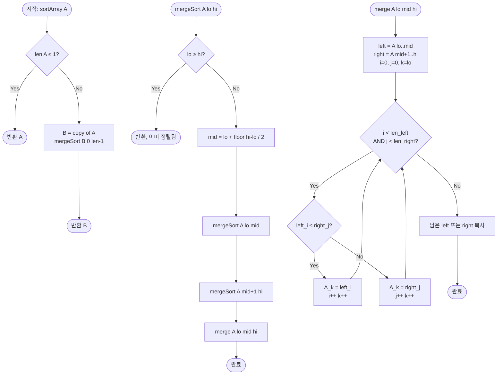

# Sort Array — 해설

## 성능 목표 예측

| 항목 | 값 |
|------|----|
| 입력 크기 N | 1 ≤ N ≤ 100,000 |
| 값 범위 | −10⁹ ≤ A[i] ≤ 10⁹ |
| 목표 시간 복잡도 | **O(N log N)** |
| 목표 공간 복잡도 | **O(N)** |

**naive 접근의 복잡도와 한계:**
버블 정렬, 선택 정렬 등 $O(N^2)$ 알고리즘은 $N = 100{,}000$에서 $10^{10}$ 연산으로 시간 초과가 확실하다. 삽입 정렬도 최악 $O(N^2)$이며, 이 문제는 임의의 입력을 전제하므로 최악 케이스를 피할 수 없다.

**목표 복잡도의 근거:**
비교 기반 정렬의 정보-이론적 하한은 $\Omega(N \log N)$이다. $N!$개의 가능한 순열을 구별하려면 최소 $\log_2(N!) \approx N \log_2 N$ 비트의 정보가 필요하기 때문이다. $N = 10^5$에서 $O(N \log N) \approx 1.7 \times 10^6$ 연산으로 충분히 통과 가능하다.

값 범위가 $[-10^9, 10^9]$로 넓어 Counting Sort나 Radix Sort는 메모리·패스 수 측면에서 비효율적이므로, 비교 기반 정렬 중 $O(N \log N)$ 최악 보장이 있는 **Merge Sort**를 선택한다.

**비교 알고리즘 선택표:**

| 알고리즘 | 최악 | 추가 공간 | 안정 | 선택 이유 |
|---------|------|---------|------|---------|
| Quicksort | O(N²) | O(log N) | 불안정 | 최악 케이스 위험 |
| Merge Sort | O(N log N) | O(N) | 안정 | 최악 보장 + 안정 |
| Heapsort | O(N log N) | O(1) | 불안정 | 상수 인수가 크다 |

---

## 목표 함수

```ts
function sortArray(A: number[]): number[]
```

| 파라미터 | 의미 | 제약 |
|---------|------|------|
| `A` | 정렬할 정수 배열 | $1 \leq N \leq 100{,}000$ |
| `A[i]` | 각 원소의 값 | $-10^9 \leq A[i] \leq 10^9$ |

**반환값:** 오름차순으로 정렬된 새 배열 $B$. 다음을 만족한다:

$$B[0] \leq B[1] \leq \cdots \leq B[N-1], \quad \text{multiset}(B) = \text{multiset}(A)$$

**엣지케이스:**

| 케이스 | 입력 | 기대 출력 | 비고 |
|--------|------|----------|------|
| 빈 입력 | `[]` | `[]` | 재귀 기저 처리 |
| 단일 원소 | `[5]` | `[5]` | 분할 없이 반환 |
| 이미 정렬 | `[1,2,3,4]` | `[1,2,3,4]` | O(N log N) 소요됨 (Merge Sort는 적응적이지 않음) |
| 역순 | `[4,3,2,1]` | `[1,2,3,4]` | 최악 케이스에서도 O(N log N) 보장 |
| 중복 포함 | `[3,1,3,2]` | `[1,2,3,3]` | multiset 동일성 확인 |
| 음수 포함 | `[-5,3,-1,0]` | `[-5,-1,0,3]` | 값 범위 경계 |

---

## 핵심 아이디어

### 원형 아이디어와 naive 접근

가장 단순한 접근: 정렬된 원소를 하나씩 선택해서 결과에 붙인다 (선택 정렬).

```
B = []
while A is not empty:
    minVal = min(A)          // O(N) 선형 탐색
    remove minVal from A
    B.append(minVal)
return B
```

이 방법은 매 단계마다 $O(N)$ 탐색을 $N$번 반복하므로 총 $O(N^2)$이다. 핵심 낭비: 이전 단계에서 얻은 비교 결과를 전혀 재활용하지 않는다. 예를 들어 $A[j] > A[k]$라는 정보는 다음 단계에서도 여전히 유효하지만 버려진다.

### 어떤 관찰이 돌파구가 되는가

- **관찰 1 (분할 후 병합의 효율성):** 배열을 두 절반으로 나누어 각각 정렬하면, 두 정렬된 배열의 병합은 $O(N)$ 두 포인터 알고리즘으로 수행 가능하다. 이 병합이 전체 정렬 문제의 핵심 연산이다.
- **관찰 2 (재귀 호출 트리의 구조):** 분할을 계속하면 길이 1인 배열에 도달하고, 이는 자명하게 정렬된 상태다. 병합을 역순으로 올라오면서 점차 큰 정렬 배열을 만든다. 각 레벨에서 총 $O(N)$ 병합이 발생하고, 레벨 수는 $\log N$이므로 총 $O(N \log N)$.
- **관찰 3 (중복 계산 없음):** 병합 시 이미 정렬된 부분의 순서가 확정되어 다시 비교하지 않는다. 이것이 $O(N^2)$ 대신 $O(N \log N)$이 되는 이유다.

### 관찰을 형식화: 상태/구조 정의

**재귀 상태:** 처리할 구간 `[lo, hi]`.

$$\text{불변식: } \text{mergeSort}(A, \text{lo}, \text{hi}) \text{ 종료 후, } A[\text{lo}..\text{hi}]\text{는 오름차순}$$

**병합 단계의 상태:**
- 입력: 정렬된 $A[\text{lo}..\text{mid}]$와 정렬된 $A[\text{mid+1}..\text{hi}]$
- 포인터: $i$ (왼쪽 구간 현재 위치), $j$ (오른쪽 구간 현재 위치), $k$ (출력 위치)
- 불변식: $A[\text{lo}..\text{k-1}]$은 좌우 구간의 원소 중 가장 작은 $k - \text{lo}$개가 오름차순으로 채워진 상태

이 정의가 왜 이 형태여야 하는가: 구간 `[lo, hi]`를 절반씩 나누면 깊이가 정확히 $\lceil \log_2 N \rceil$이고, 각 레벨의 총 병합 작업이 $O(N)$임이 보장된다. 세 등분이나 다른 비율로 나누면 레벨 수가 달라지고 총 비용도 변한다 ($k$-way merge의 경우 $O(N \log_k N \cdot k)$로 상수가 커질 수 있다).

### 점화식 또는 핵심 연산

**분할 정복 점화식:**

$$T(N) = 2T(N/2) + O(N)$$

- $2T(N/2)$: 두 절반을 각각 재귀 정렬하는 비용
- $O(N)$: 두 정렬된 절반을 병합하는 비용

마스터 정리 케이스 2: $a = 2$, $b = 2$, $f(N) = O(N) = O(N^{\log_2 2}) = O(N^1)$ → $T(N) = O(N \log N)$.

**병합의 두 포인터 연산:**

```
while i < len(left) and j < len(right):
    if left[i] ≤ right[j]:
        out[k++] = left[i++]    // 왼쪽 원소가 더 작거나 같으면 먼저 선택 (안정 정렬)
    else:
        out[k++] = right[j++]   // 오른쪽 원소가 더 작으면 선택
// 남은 원소 복사
나머지 left[i..] 또는 right[j..] 복사
```

- `left[i] ≤ right[j]`: 안정 정렬을 위해 같을 때 왼쪽을 먼저 선택
- 한쪽이 소진되면 나머지를 그대로 복사 (이미 정렬됨)

### 정당성 — 왜 이것이 옳은가

귀납 증명: **기저** $N = 1$이면 자명하게 정렬됨. **귀납 단계**: $N < k$인 모든 입력에서 `mergeSort`가 올바르게 정렬함을 가정하면, 크기 $k$인 입력에서 두 절반($\leq k/2$)을 올바르게 정렬한 후, 두 정렬된 배열의 병합이 올바른지 보인다. 병합의 정확성: 두 포인터 알고리즘은 매 단계에서 두 배열의 현재 최솟값 중 더 작은 것을 선택하므로, 출력은 항상 오름차순이고 원소를 하나도 빠뜨리지 않는다.

**원소 보존:** 병합에서 $i + j$ (처리된 원소 수) = $k - \text{lo}$가 항상 유지되므로 원소 손실이 없다.

**안정 정렬 증명:** `left[i] ≤ right[j]`일 때 왼쪽을 먼저 선택하므로, 원래 배열에서 같은 값의 원소는 앞에 있던 것이 먼저 출력된다. 재귀적으로, 하위 정렬도 안정하므로 전체가 안정하다.

### 구현 디테일과 최적화

- **보조 배열 전략:** 매 병합마다 새 배열을 할당하면 GC 부하가 크다. 미리 크기 $N$인 보조 배열을 할당해두고 재사용하면 상수 인수가 줄어든다.
- **소규모 구간 최적화:** 구간 크기가 8~16 이하이면 삽입 정렬로 처리하는 하이브리드(Timsort 방식)가 캐시 친화적이다.
- **이미 정렬된 구간 조기 종료:** 병합 전 `A[mid] ≤ A[mid+1]`이면 이미 정렬된 상태이므로 병합을 건너뛸 수 있다.
- **흔한 함정 — mid 계산:** `(lo + hi) / 2` 대신 `lo + Math.floor((hi - lo) / 2)`를 사용해야 큰 값에서 정수 오버플로우를 피한다 (JavaScript number는 53비트 정수 범위를 지원하므로 이 문제에서는 발생하지 않지만, 습관적으로 안전한 방식을 사용한다).
- **흔한 함정 — 좌우 범위 혼동:** `mergeSort(A, lo, mid)`와 `mergeSort(A, mid+1, hi)`에서 `mid`와 `mid+1`을 혼동하면 무한 재귀 또는 중복 처리가 발생한다. 특히 `lo == mid`인 경우(구간 크기 2)를 수동으로 트레이스해서 검증한다.
- **흔한 함정 — 병합 후 복사 누락:** 보조 배열로 병합한 뒤 원본 배열로 복사하는 단계를 빠뜨리면 상위 재귀에서 정렬되지 않은 배열을 사용하게 된다.

---

## 수도 코드와 Activity Diagram

### 의사코드

```
function sortArray(A):
    if len(A) <= 1: return A           // 기저 케이스
    B = copy of A                      // 불변식: multiset(B) = multiset(A)
    mergeSort(B, 0, len(B) - 1)
    return B

function mergeSort(A, lo, hi):
    // 불변식: 종료 시 A[lo..hi]는 오름차순
    if lo >= hi: return                // 구간 크기 ≤ 1이면 이미 정렬됨
    mid = lo + floor((hi - lo) / 2)   // 중간점 (오버플로우 방지)
    mergeSort(A, lo, mid)             // 좌반부 재귀 정렬
    mergeSort(A, mid+1, hi)           // 우반부 재귀 정렬
    merge(A, lo, mid, hi)             // 두 정렬 구간 병합

function merge(A, lo, mid, hi):
    // 불변식 진입: A[lo..mid] 오름차순, A[mid+1..hi] 오름차순
    left  = A[lo..mid]    // 복사
    right = A[mid+1..hi]  // 복사
    i = 0, j = 0, k = lo
    while i < len(left) and j < len(right):
        if left[i] <= right[j]:       // ≤: 안정 정렬 (같을 때 왼쪽 우선)
            A[k++] = left[i++]
        else:
            A[k++] = right[j++]
    // 남은 원소 복사 (불변식: 남은 원소들은 이미 오름차순)
    while i < len(left):  A[k++] = left[i++]
    while j < len(right): A[k++] = right[j++]
    // 불변식 종료: A[lo..hi] 오름차순
```

### Activity Diagram



**핵심 불변식:** `mergeSort(A, lo, hi)` 종료 후 `A[lo..hi]`는 항상 오름차순. `merge` 진입 시 `A[lo..mid]`와 `A[mid+1..hi]`는 각각 오름차순. `merge` 내 루프 불변식: `A[lo..k-1]`은 두 부분 배열에서 가장 작은 `k-lo`개의 원소가 오름차순으로 채워진 상태.

---

**재귀 호출 트리 예시** ($N = 8$):

```
            mergeSort [0..7]
           /                  \
  mergeSort [0..3]       mergeSort [4..7]
     /        \              /        \
[0..1]       [2..3]       [4..5]     [6..7]
 /   \        /   \        /   \      /   \
[0]  [1]    [2]  [3]    [4]  [5]   [6]  [7]
     ↑ 기저              ↑ 기저
     merge →              merge →
  병합 레벨 0              병합 레벨 0
          merge →                  merge →
        병합 레벨 1                병합 레벨 1
                       merge →
                     병합 레벨 2 (최종)
```

각 레벨에서 총 $N$개 원소가 병합되며, 레벨 수 = $\log_2 8 = 3$ → 총 $O(N \log N)$.
