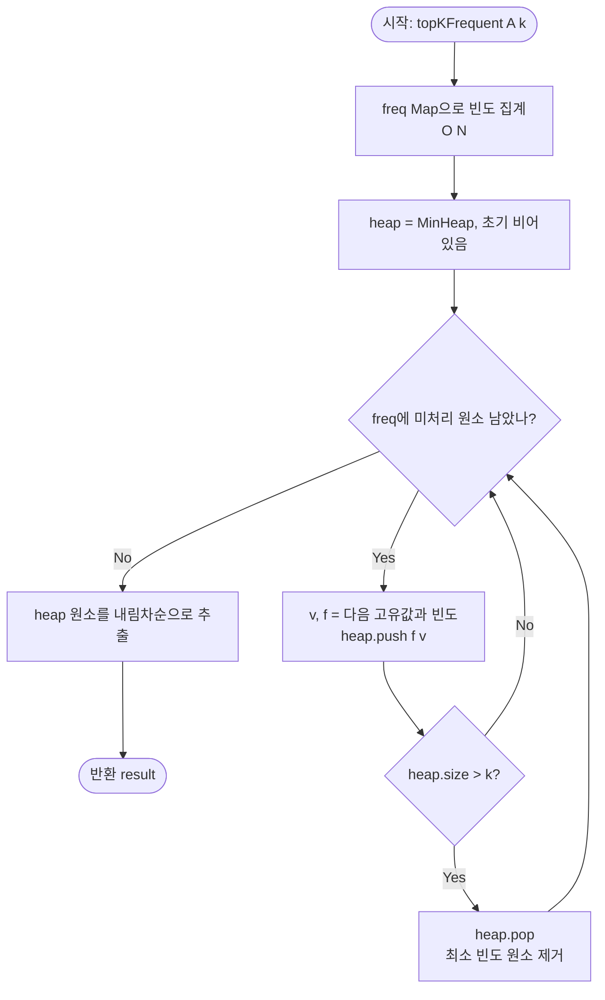

# Top K Frequent Elements — 해설

## 성능 목표 예측

| 항목 | 값 |
|------|----|
| 입력 크기 N | 1 ≤ N ≤ 100,000 |
| 값 범위 | −10⁹ ≤ A[i] ≤ 10⁹ |
| k 범위 | 1 ≤ k ≤ 고유값 개수 |
| Min-Heap 시간 | **O(N log k)** |
| Bucket Sort 시간 | **O(N)** |
| 공간 복잡도 | **O(N)** |

**naive 접근의 복잡도와 한계:**
가장 단순한 접근: HashMap으로 빈도를 구한 후 전체 고유값을 빈도 기준으로 정렬해 상위 k개를 선택한다.

```
freq = buildFreqMap(A)              // O(N)
entries = freq.entries().sort(...)  // O(M log M), M = 고유값 수
return entries.slice(0, k).map(...)
```

$M \leq N$이므로 $O(N \log N)$이며 $N = 10^5$에서 통과 가능하다. 그러나 전체 $M$개의 고유값을 정렬하는 것은 $k$개만 필요할 때 과분한 작업이다. $k \ll M$이면 Min-Heap으로 $O(N \log k)$, Bucket Sort로 $O(N)$까지 줄일 수 있다.

**목표 복잡도의 근거:**
- Min-Heap: $M$개 고유값을 크기 $k$ 힙으로 처리하면 $O(M \log k) \leq O(N \log k)$. $k \ll N$이면 $O(N \log k) \ll O(N \log N)$.
- Bucket Sort: 빈도의 최댓값은 $N$이므로, 크기 $N+1$인 버킷에 고유값을 분류 후 뒤에서 훑으면 $O(N)$. 추가 공간 $O(N)$.

---

## 목표 함수

```ts
function topKFrequent(A: number[], k: number): number[]
```

| 파라미터 | 의미 | 제약 |
|---------|------|------|
| `A` | 정수 배열 | $1 \leq N \leq 100{,}000$ |
| `A[i]` | 각 원소의 값 | $-10^9 \leq A[i] \leq 10^9$ |
| `k` | 반환할 상위 빈도 원소 수 | $1 \leq k \leq$ 고유값 개수 |

**반환값:** 빈도 상위 $k$개 원소 배열 (빈도 내림차순. 동률 시 순서 임의).

수식으로 표현하면:
$$R \subseteq \{v \mid v \in A\},\ |R| = k,\ \forall u \notin R, v \in R: f(v) \geq f(u)$$

여기서 $f(v) = |\{i \mid A[i] = v\}|$ (빈도).

**엣지케이스:**

| 케이스 | 입력 | 기대 출력 | 비고 |
|--------|------|----------|------|
| k = 1 | `A=[1,1,2,3]`, `k=1` | `[1]` | 최빈값 1개 |
| k = 고유값 수 | `A=[1,2,3]`, `k=3` | `[1,2,3]` (임의 순서) | 모든 고유값 반환 |
| 모두 동빈도 | `A=[1,2,3]`, `k=2` | 임의 2개 | 동률 처리 |
| 하나만 있음 | `A=[5,5,5]`, `k=1` | `[5]` | 고유값 1개 |
| 음수 포함 | `A=[-1,-1,2]`, `k=1` | `[-1]` | HashMap 키로 음수 지원 |

---

## 핵심 아이디어

### 원형 아이디어와 naive 접근

가장 단순한 접근: 배열의 모든 고유값과 그 빈도를 구한 후, 빈도 기준으로 전체 정렬해서 상위 $k$개를 반환한다.

```
freq = {}
for v in A:
    freq[v] = (freq[v] ?? 0) + 1      // O(N): 빈도 집계

entries = Object.entries(freq)         // (값, 빈도) 쌍 목록
entries.sort((a, b) => b[1] - a[1])   // O(M log M): 빈도 내림차순 정렬
return entries.slice(0, k).map(e => e[0])  // 상위 k개 추출
```

이 방법은 $O(N + M \log M)$이며 작동한다. 핵심 낭비: 상위 $k$개만 필요한데 $M$개 전체를 정렬한다. $k = 1$이면 최댓값 한 개를 찾는 문제인데 전체 정렬의 낭비가 명확하다. 이 낭비를 없애는 두 가지 접근이 있다.

### 어떤 관찰이 돌파구가 되는가

**Min-Heap 접근의 관찰:**
- **관찰 1 (크기 k 후보군 유지):** 현재까지 본 원소 중 "상위 k개 후보"를 유지하고, 새 원소가 후보군의 최솟값보다 빈도가 높으면 최솟값을 교체한다. 이를 위해 크기 $k$의 최소 힙이 필요하다.
- **관찰 2 (Min-Heap이 적합한 이유):** 후보군에서 "추방 대상"은 가장 빈도가 낮은 원소다. 최소 힙은 루트에 최솟값을 유지하므로 $O(1)$ 접근과 $O(\log k)$ 삽입/삭제가 가능하다.

**Bucket Sort 접근의 관찰:**
- **관찰 3 (빈도 범위의 제한성):** 어떤 원소의 빈도도 $[1, N]$ 범위다. 빈도를 인덱스로 사용하는 버킷 배열 $B[0..N]$을 만들어 $B[f(v)]$에 $v$를 넣으면, 빈도가 큰 버킷부터 뒤에서 훑어 $k$개를 수집할 수 있다.

### 관찰을 형식화: 상태/구조 정의

**접근 1 — Min-Heap의 상태:**

크기 $k$ Min-Heap, 각 원소는 `(빈도, 값)` 쌍.

$$\text{힙 불변식: 크기} \leq k, \quad \text{힙 루트} = \text{현재 후보군 중 최소 빈도}$$

이 불변식이 $M$개 고유값을 모두 처리한 후 성립하면, 힙의 $k$개 원소가 전체 빈도 상위 $k$개임이 보장된다. 힙이 $k$개를 초과할 때마다 최소 빈도를 제거하므로 항상 "현재까지의 상위 $k$개 후보"만 남는다.

**접근 2 — Bucket Sort의 상태:**

크기 $N+1$인 배열 $B$, $B[i]$는 빈도가 $i$인 고유값들의 목록.

$$B[f(v)]\text{에 } v\text{가 포함됨} \quad \forall v \in \text{고유값}$$

이 상태가 확정되면 $i = N, N-1, \ldots, 0$ 순서로 훑으면서 $k$개가 모이면 반환한다.

### 점화식 또는 핵심 연산

**접근 1 — Min-Heap의 삽입/교체 연산:**

고유값 $v$, 빈도 $f = \text{freq}[v]$에 대해:

$$\text{if heap.size()} < k: \quad \text{heap.push}(f, v)$$
$$\text{elif } f > \text{heap.top().freq}: \quad \text{heap.pop(); heap.push}(f, v)$$
$$\text{else}: \quad \text{건너뜀}$$

- `heap.size() < k`: 아직 $k$개 미만이면 무조건 삽입
- `f > heap.top().freq`: 현재 후보군의 최소 빈도보다 크면 최솟값을 교체
- 같거나 작으면: 현재 후보군에 들어갈 자격이 없으므로 건너뜀

각 고유값에 대해 $O(\log k)$이므로 $M$개 처리 시 총 $O(M \log k) \leq O(N \log k)$.

**접근 2 — Bucket Sort의 수집 연산:**

$$\text{for } i = N \text{ downto } 0: \quad \text{result} \mathrel{+}= B[i]; \quad \text{if } |\text{result}| \geq k: \text{ return result}[:k]$$

- $i = N$부터 시작: 빈도가 높은 버킷부터 수집 (빈도 내림차순)
- $k$개 모이면 즉시 반환: 불필요한 버킷 순회 생략

총 비용: 버킷 배열 초기화 $O(N)$ + 고유값 분배 $O(M)$ + 수집 $O(N)$ = $O(N)$.

### 정당성 — 왜 이것이 옳은가

**Min-Heap 정당성:** 귀납법으로 증명한다. 힙 불변식이 성립한다고 가정하면, 새 원소 삽입 후에도 성립함을 보인다. 힙 크기 $< k$이면 삽입 후 여전히 "현재까지의 상위 후보". 힙 크기 $= k$일 때 새 원소 빈도가 루트보다 크면: 루트는 확실히 상위 $k$개가 아니므로 교체가 옳다. 루트보다 작거나 같으면: 힙의 모든 원소보다 빈도가 작거나 같으므로 상위 $k$개가 아니다. 모든 $M$개 처리 후 힙의 $k$개가 전체 상위 $k$개임이 귀납적으로 성립한다.

**Bucket Sort 정당성:** $B[i]$에 빈도가 정확히 $i$인 고유값들이 들어있으므로, $i = N$부터 $0$까지 훑으면 빈도 내림차순으로 고유값이 나온다. 처음 $k$개를 수집하면 상위 $k$개가 된다. 동률(같은 빈도)이 있을 때 같은 버킷의 원소는 임의 순서로 나오며, 문제에서 동률 시 순서가 임의여도 된다고 명시되어 있으므로 정당하다.

**동률 처리:** 두 원소 $u, v$가 $f(u) = f(v)$이고 $k$개 경계에 걸쳐 있으면, 어느 쪽을 선택해도 조건 $f(v) \geq f(u)$ (단 $u \notin R$, $v \in R$)을 만족할 수 없다. 그러나 문제가 동률 시 임의 선택을 허용하므로, 어떤 것을 선택해도 유효하다.

### 구현 디테일과 최적화

- **JavaScript에는 내장 힙이 없다:** 직접 구현하거나 정렬을 활용해야 한다. Min-Heap 없이 풀려면 Bucket Sort 방식이 더 간단하다.
- **HashMap vs. 객체:** JavaScript `{}` 객체를 HashMap으로 쓸 수 있지만, 음수 키가 문자열로 변환되므로 `Map`을 사용하는 것이 더 안전하다.
- **Bucket Sort에서 빈도 0 버킷 처리:** 빈도가 0인 버킷은 존재하지 않으므로 `B[0]`은 항상 비어있다. $i = N$부터 $1$까지만 훑어도 된다.
- **결과 순서 보장:** 문제가 빈도 내림차순을 요구하면, Min-Heap에서 pop은 오름차순이므로 결과를 역순으로 구성해야 한다(`prepend` 또는 최종 `reverse()`).
- **흔한 함정 — 힙 비교 기준:** Min-Heap의 비교 대상은 빈도(`f`)여야 한다. 값(`v`)으로 비교하면 빈도 기준 순위가 틀린다. `(f, v)` 튜플을 사용하고 `f`를 기준으로 비교한다.
- **흔한 함정 — Bucket 인덱스 범위:** 버킷 배열 크기를 `N+1`로 해야 빈도가 $N$인 케이스 (배열 원소가 모두 같은 경우)를 처리할 수 있다. 크기를 $N$으로 하면 인덱스 초과가 발생한다.
- **흔한 함정 — 수집 중단 타이밍:** Bucket Sort에서 `result.length == k`가 되는 시점에 즉시 반환해야 한다. 동일 버킷에 여러 원소가 있을 때 $k$를 초과하지 않도록 주의한다.

---

## 수도 코드와 Activity Diagram

### 의사코드

**접근 1: Min-Heap (O(N log k))**

```
function topKFrequent(A, k):
    // 1단계: 빈도 집계
    freq = new Map()                      // 불변식: freq[v] = v의 빈도
    for v in A:
        freq.set(v, (freq.get(v) ?? 0) + 1)

    // 2단계: 크기 k Min-Heap 유지
    // 불변식: heap.size() ≤ k, heap은 현재까지 상위 k개 후보
    heap = MinHeap()  // (빈도, 값) 쌍, 빈도 기준 최소힙
    for [v, f] of freq.entries():
        heap.push([f, v])
        if heap.size() > k:
            heap.pop()               // 가장 낮은 빈도 원소 제거

    // 3단계: 결과 추출 (내림차순)
    // 불변식: heap에 정확히 k개, 전체 빈도 상위 k개
    result = []
    while heap is not empty:
        [f, v] = heap.pop()          // pop 순서는 빈도 오름차순
        result.unshift(v)            // 앞에 붙여서 내림차순 유지
    return result
```

**접근 2: Bucket Sort (O(N))**

```
function topKFrequent(A, k):
    // 1단계: 빈도 집계
    freq = new Map()
    for v in A:
        freq.set(v, (freq.get(v) ?? 0) + 1)

    // 2단계: 버킷 배열 구성
    // 불변식: B[i]는 빈도가 정확히 i인 고유값들의 목록
    B = array of empty lists, size N+1
    for [v, f] of freq.entries():
        B[f].push(v)

    // 3단계: 높은 빈도부터 수집
    // 불변식: result는 지금까지 수집한 빈도 상위 원소들
    result = []
    for i from N downto 1:
        for v of B[i]:
            result.push(v)
            if result.length == k:
                return result         // k개 모이면 즉시 반환

    return result
```

### Activity Diagram (Min-Heap 방식)



**핵심 불변식:** Min-Heap 방식에서 각 고유값 처리 후 힙 크기 $\leq k$이고, 힙은 지금까지 처리된 고유값 중 빈도 상위 $k$개 후보를 보유한다. 모든 고유값 처리 완료 시 힙의 $k$개 원소가 전체 상위 $k$개다.

---

**예시:** $A = [1, 1, 1, 2, 2, 3]$, $k = 2$

```
빈도 집계: freq = {1:3, 2:2, 3:1}

Min-Heap 방식:
  push (3, 1): heap = [(3,1)]         크기=1 ≤ k=2
  push (2, 2): heap = [(2,2),(3,1)]   크기=2 = k
  push (1, 3): heap = [(1,3),(2,2),(3,1)] → pop (1,3) → heap = [(2,2),(3,1)]
  결과 추출 (오름차순으로 pop): (2,2), (3,1) → 역순으로 [1, 2]

Bucket Sort 방식:
  B[1] = [3], B[2] = [2], B[3] = [1]
  i=3: result = [1], 아직 k=2 미만
  i=2: result = [1, 2], k=2 달성 → 반환 [1, 2]
```
