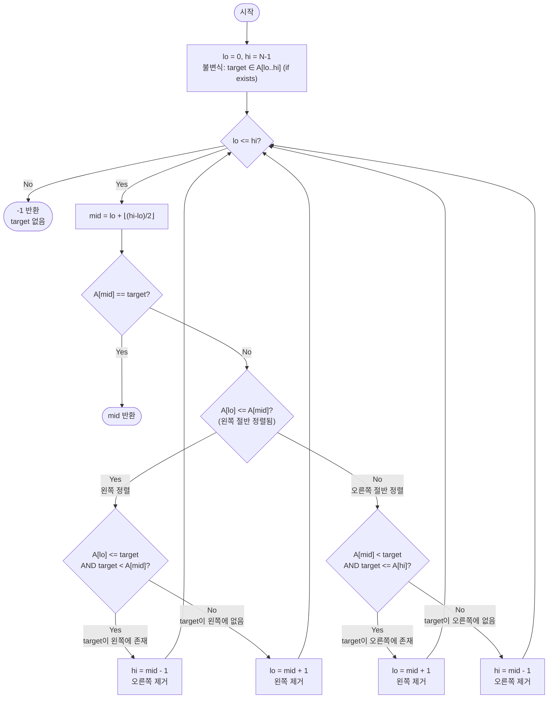

# Search in Rotated Sorted Array — 해설

## 성능 목표 예측

| 항목 | 값 |
|------|-----|
| 입력 크기 | $1 \leq N \leq 10^6$ |
| 원소 값 범위 | $-10^4 \leq A[i], \text{target} \leq 10^4$ |
| 모든 원소 | 서로 다름 (중복 없음) |
| 목표 시간 복잡도 | $O(\log N)$ |
| 목표 공간 복잡도 | $O(1)$ |

**naive 접근의 한계 분석**: 가장 단순한 접근은 배열을 처음부터 끝까지 순회하는 선형 탐색이다. 시간복잡도 $O(N)$이고, $N = 10^6$이면 최악의 경우 $10^6$회 비교를 해야 한다. 기능적으로는 동작하지만, 배열이 "회전된 정렬 배열"이라는 구조적 정보를 전혀 활용하지 않는다.

또 다른 naive 접근은 "회전점(pivot index)을 먼저 찾고, 이후 일반 이진 탐색을 수행"하는 것이다. 회전점 탐색에 $O(\log N)$, 탐색에 $O(\log N)$이면 전체 $O(\log N)$이지만, 코드가 두 단계로 나뉘어 복잡해진다. **한 번의 이진 탐색 패스로 처리하는 방법이 있을까?**

**목표 복잡도 달성**: 회전된 배열을 mid로 나누면 두 절반 중 하나는 반드시 완전히 정렬되어 있다는 성질이 있다. 정렬된 절반에서 target의 포함 여부를 $O(1)$로 판정할 수 있으므로, 매 반복마다 절반을 제거하는 이진 탐색이 가능하다.

**공간 복잡도**: 포인터 `lo`, `hi`, `mid` 만 사용하므로 $O(1)$이다.

---

## 목표 함수

```typescript
function searchInRotatedSortedArray(A: number[], target: number): number
```

| 파라미터 | 의미 | 제약 |
|----------|------|------|
| `A` | 알 수 없는 위치에서 회전된 오름차순 정렬 배열 | $1 \leq N \leq 10^6$, 모든 원소 유일 |
| `target` | 찾을 목표값 | $-10^4 \leq \text{target} \leq 10^4$ |
| **반환** | `A[i] === target`을 만족하는 인덱스 `i`; 없으면 `-1` | — |

**엣지케이스**:

| 케이스 | 입력 예시 | 기대 출력 | 이유 |
|--------|-----------|-----------|------|
| 회전 없음 (완전 정렬) | `A=[1,2,3,4,5]`, `target=3` | `2` | 일반 이진 탐색과 동일하게 작동 |
| 회전 후 첫 원소 탐색 | `A=[4,5,6,7,0,1,2]`, `target=4` | `0` | 회전점 이후 처음 원소 |
| 회전 후 마지막 원소 탐색 | `A=[4,5,6,7,0,1,2]`, `target=2` | `6` | 원래 배열의 마지막 원소 |
| target이 없음 | `A=[4,5,6,7,0,1,2]`, `target=3` | `-1` | 존재하지 않는 값 |
| 단일 원소, 일치 | `A=[1]`, `target=1` | `0` | 배열 크기 1, 일치 |
| 단일 원소, 불일치 | `A=[1]`, `target=0` | `-1` | 배열 크기 1, 불일치 |
| 회전점이 배열 중간 | `A=[3,4,5,1,2]`, `target=1` | `3` | 오른쪽 절반 정렬 구간에서 탐색 |

---

## 핵심 아이디어

### 원형 아이디어와 naive 접근

배열이 "정렬되어 있다"면 이진 탐색이 가능하다. 그런데 배열이 회전되어 있으면 단조성이 깨진다. 가장 단순한 회피책은 선형 탐색이다:

```
for i from 0 to N-1:
    if A[i] == target:
        return i
return -1
```

$O(N)$ 시간이고 회전 여부와 관계없이 동작한다. 하지만 $N = 10^6$에서 시간 낭비가 크고, **배열이 두 개의 정렬된 서브배열로 구성되어 있다**는 구조를 전혀 활용하지 않는다.

더 정교한 naive 접근은 "회전점을 먼저 찾는" 전처리 단계를 추가하는 것이다:

```
pivot ← find_rotation_point(A)  // O(log N): A[pivot] > A[pivot+1]인 점 탐색
// 이후 pivot을 경계로 왼쪽/오른쪽 중 하나에서 일반 이진 탐색
```

이 접근은 동작하지만 두 번의 이진 탐색 패스를 요구한다. 더 중요한 문제는 **회전점 탐색 자체도 특수한 이진 탐색이므로, 논리가 분리되어 코드 복잡도가 증가**한다는 점이다.

### 어떤 관찰이 돌파구가 되는가

- **관찰 1 (한쪽 절반의 완전 정렬 보장)**: 회전된 배열은 "두 개의 정렬된 서브배열이 이어붙여진 형태"다. 회전점은 배열 전체에서 단 하나이므로, 임의의 위치 `mid`를 잡으면 왼쪽 절반 $[lo, mid]$과 오른쪽 절반 $[mid, hi]$ 중 회전점을 포함하지 않는 절반이 반드시 존재하고, 그 절반은 완전히 정렬되어 있다.
- **관찰 2 (정렬된 절반에서의 O(1) 판정)**: 절반이 완전히 정렬되어 있다면, target이 그 절반의 범위 $[A[\text{lo}], A[\text{mid}]]$ 또는 $[A[\text{mid}], A[\text{hi}]]$ 안에 있는지를 양끝 값의 비교만으로 $O(1)$에 판정할 수 있다.
- **관찰 3 (어느 절반이 정렬됐는지 판별)**: `A[lo] <= A[mid]`이면 왼쪽 절반이 정렬된 것이고, `A[mid] < A[lo]`이면 오른쪽 절반이 정렬된 것이다. 이 조건 하나로 두 경우를 구별할 수 있다.

### 관찰을 형식화: 상태/구조 정의

일반 이진 탐색과 동일하게 탐색 구간을 닫힌 구간 $[\text{lo}, \text{hi}]$로 정의하고, 루프 전체에 다음 불변식을 유지한다:

> **불변식**: target이 배열 안에 존재한다면, 반드시 $A[\text{lo} \ldots \text{hi}]$ 구간 안에 있다.

초기에 $\text{lo} = 0$, $\text{hi} = N - 1$로 설정하면 자명하게 성립한다. 중요한 점은, **매 반복마다 "정렬된 절반"을 먼저 식별하고, 그 절반을 기준으로 target의 존재 여부를 판정한다**는 것이다. 불변식이 유지되는 한, 안전하게 절반을 제거할 수 있다.

*왜 "회전점을 먼저 구한 뒤 일반 이진 탐색"으로 정의하지 않는가*: 회전점을 구하는 것 자체가 별도의 이진 탐색이고, 매 탐색마다 상태를 재계산해야 한다. 반면 위 정의는 단일 루프 안에서 구간을 줄여가므로 코드가 더 간결하고 효율적이다.

### 점화식 또는 핵심 연산

각 반복에서 중간점을 계산한다:

$$\text{mid} = \text{lo} + \left\lfloor \frac{\text{hi} - \text{lo}}{2} \right\rfloor$$

이후 두 가지 케이스로 분기한다:

**Case 1: $A[\text{lo}] \leq A[\text{mid}]$ (왼쪽 절반 $[\text{lo}, \text{mid}]$이 정렬됨)**

$$(\text{lo}', \text{hi}') = \begin{cases}
  (\text{lo}, \text{mid} - 1) & A[\text{lo}] \leq \text{target} < A[\text{mid}] \quad \text{(target이 왼쪽에 있음)} \\
  (\text{mid} + 1, \text{hi}) & \text{그 외} \quad \text{(target이 오른쪽에 있음)}
\end{cases}$$

- $A[\text{lo}] \leq \text{target} < A[\text{mid}]$: 정렬된 왼쪽 절반의 범위 안에 target이 있으므로, 오른쪽을 제거한다.
- 그 외: target이 왼쪽에 없으므로 왼쪽을 제거한다.

**Case 2: $A[\text{mid}] < A[\text{lo}]$ (오른쪽 절반 $[\text{mid}, \text{hi}]$이 정렬됨)**

$$(\text{lo}', \text{hi}') = \begin{cases}
  (\text{mid} + 1, \text{hi}) & A[\text{mid}] < \text{target} \leq A[\text{hi}] \quad \text{(target이 오른쪽에 있음)} \\
  (\text{lo}, \text{mid} - 1) & \text{그 외} \quad \text{(target이 왼쪽에 있음)}
\end{cases}$$

- $A[\text{mid}] < \text{target} \leq A[\text{hi}]$: 정렬된 오른쪽 절반의 범위 안에 target이 있으므로, 왼쪽을 제거한다.
- 그 외: target이 오른쪽에 없으므로 오른쪽을 제거한다.

### 정당성 — 왜 이것이 옳은가

**핵심 보조 사실**: 임의의 구간 $[\text{lo}, \text{hi}]$에서 $\text{mid}$를 잡으면, 회전점은 $[\text{lo}, \text{mid}]$와 $[\text{mid}, \text{hi}]$ 중 최대 한 쪽에만 존재한다. 따라서 나머지 한 쪽은 완전히 정렬된 상태다.

**불변식 유지 증명**: Case 1에서 $A[\text{lo}] \leq \text{target} < A[\text{mid}]$이고 왼쪽 절반 $[\text{lo}, \text{mid}]$이 완전히 정렬되어 있다면, target은 확실히 $[\text{lo}, \text{mid}-1]$ 안에 있다. 따라서 `hi = mid - 1`로 갱신해도 불변식이 유지된다. 반대로 위 조건이 성립하지 않으면, 정렬된 왼쪽 절반에 target이 없으므로 target은 오른쪽에 있다. `lo = mid + 1`로 갱신해도 불변식이 유지된다. Case 2도 대칭적으로 동일하다.

**까다로운 케이스**: 회전이 없을 때 ($A$가 완전히 정렬됨), `A[lo] <= A[mid]`가 항상 성립하므로 Case 1만 실행된다. 이는 일반 이진 탐색과 정확히 동일하게 동작한다.

**`A[lo] <= A[mid]` 등호 포함**: `lo == mid`이면 (`hi - lo == 0` 또는 `hi - lo == 1`일 때) $A[\text{lo}] = A[\text{mid}]$가 성립한다. 이 경우 왼쪽 단일 원소 구간은 당연히 정렬되어 있다. 등호를 포함해야 이 경우도 올바르게 처리된다.

### 구현 디테일과 최적화

- **`A[lo] <= A[mid]` vs `A[lo] < A[mid]`**: 등호를 빠뜨리면 `lo == mid` 케이스에서 Case 1이 아닌 Case 2로 분기하게 되어, 정렬된 오른쪽 절반이라고 잘못 판단한다. 모든 원소가 유일하므로 `A[lo] == A[mid]`인 유일한 경우는 `lo == mid`이고, 이때 왼쪽 절반이 단일 원소이므로 Case 1로 처리하는 것이 맞다.
- **범위 조건의 방향**: Case 1에서 `target < A[mid]`로 엄격 부등호를 쓰는 이유는, `A[mid] == target`인 경우 루프 시작 시 이미 조기 반환(`return mid`)하기 때문이다. 마찬가지로 Case 2에서 `target > A[mid]`도 엄격 부등호다.
- **오버플로 방지**: `mid = lo + Math.floor((hi - lo) / 2)` 사용.
- **무한 루프 방지**: 매 반복에서 구간이 반드시 줄어드는지 확인. `lo = mid + 1` 또는 `hi = mid - 1` 형태이므로 구간이 최소 1 감소하여 무한 루프가 발생하지 않는다.
- **중복 원소가 있는 변형**: 문제에서 중복 원소가 허용되면 `A[lo] == A[mid]`이 `lo != mid`일 때도 발생할 수 있다. 이 경우 두 절반 중 어느 쪽이 정렬됐는지 판단하기 어려우므로, 단순히 `lo++`로 한 칸 이동하는 대안적 처리가 필요하다 (최악 $O(N)$이 됨).

---

## 수도 코드와 Activity Diagram

### 의사코드

```
function searchInRotatedSortedArray(A, target):
    lo ← 0                              // 불변식: target ∈ A[lo..hi] (if exists)
    hi ← length(A) - 1                 // 초기 구간은 전체 배열

    while lo <= hi:
        mid ← lo + floor((hi - lo) / 2) // 오버플로 방지

        if A[mid] == target:
            return mid                  // 발견

        if A[lo] <= A[mid]:            // 왼쪽 절반 [lo, mid]이 완전히 정렬됨
            if A[lo] <= target and target < A[mid]:
                hi ← mid - 1          // target은 정렬된 왼쪽에 있음 → 오른쪽 제거
                                       // 불변식 유지: target ∈ A[lo..mid-1]
            else:
                lo ← mid + 1          // target은 정렬된 왼쪽에 없음 → 왼쪽 제거
                                       // 불변식 유지: target ∈ A[mid+1..hi]

        else:                           // 오른쪽 절반 [mid, hi]이 완전히 정렬됨
            if A[mid] < target and target <= A[hi]:
                lo ← mid + 1          // target은 정렬된 오른쪽에 있음 → 왼쪽 제거
                                       // 불변식 유지: target ∈ A[mid+1..hi]
            else:
                hi ← mid - 1          // target은 정렬된 오른쪽에 없음 → 오른쪽 제거
                                       // 불변식 유지: target ∈ A[lo..mid-1]

    return -1                           // lo > hi: target 없음
```

**핵심 불변식**: target이 A 안에 존재한다면, 루프의 모든 시점에서 반드시 $A[\text{lo} \ldots \text{hi}]$ 구간 안에 있다.

### Activity Diagram



**핵심 불변식**: $\text{target} \in A \Rightarrow \text{target} \in A[\text{lo} \ldots \text{hi}]$
