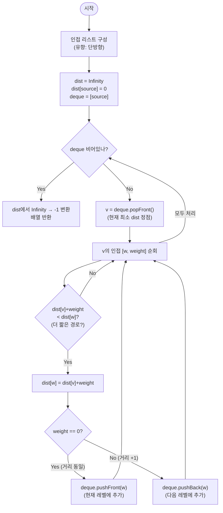

# zeroOneBfs 해설

## 성능 목표 예측

| 제약 | 값 |
|------|----|
| 정점 수 $V$ | $1 \leq V \leq 10^5$ |
| 간선 수 $E$ | $0 \leq E \leq 10^5$ |
| 간선 가중치 $w$ | $w \in \{0, 1\}$ |
| 그래프 종류 | 유향 |

**naive 접근의 비용**: 모든 경로를 열거해 최소 가중치 합을 구한다 → 지수 시간, 불가.

**Dijkstra 사용**: 모든 간선을 일반 가중치로 처리하면 $O((V + E) \log V)$.
$V = E = 10^5$이면 약 $10^5 \times 17 \approx 1.7 \times 10^6$ → 통과는 하지만 불필요하게 느리다.

**관찰**: 가중치가 $0$ 또는 $1$뿐이다. 우선순위 큐(힙) 없이도 단조성을 유지할 수 있다.

**목표**: Deque 기반 0-1 BFS로 $O(V + E)$ 달성.
$V + E \leq 2 \times 10^5$으로 매우 빠르다.

**공간 트레이드오프**: 인접 리스트 $O(V + E)$ + dist 배열 $O(V)$ + deque $O(V)$.

---

## 목표 함수

```ts
function zeroOneBfs(n: number, edges: [number, number, number][], source: number): number[]
```

| 파라미터 | 의미 | 제약 |
|----------|------|------|
| `n` | 정점 수 | $1 \leq n \leq 10^5$ |
| `edges` | 유향 간선 `[u, v, w]`, $w \in \{0, 1\}$ | $0 \leq E \leq 10^5$ |
| `source` | 출발 정점 $s$ | $0 \leq s < n$ |
| 반환 | 길이 $n$ 배열, `dist[i]` = $s \to i$ 최소 가중치 합; 도달 불가 시 $-1$ | — |

**엣지케이스**

1. **자기 자신**: `dist[source] = 0`. 출발점까지 거리는 0이다.
2. **도달 불가 정점**: Infinity 상태로 남으므로 $-1$로 변환해 반환한다.
3. **가중치 0만 있는 경로**: 모두 pushFront → 순서 무관하게 즉시 처리됨.
4. **가중치 1만 있는 경로**: 일반 BFS와 동일하게 동작.

---

## 핵심 아이디어

### 원형 아이디어와 naive 접근

출발점 $s$에서 목적지 $v$까지 가는 모든 경로를 열거해 가중치 합이 최소인 것을 찾는다.

```
function dist(s, v):
  minCost = Infinity
  for path in all_paths(s, v):
    minCost = min(minCost, sum(weights(path)))
  return minCost
```

경로 수는 지수적 → 불가.

DFS로 탐욕적으로 탐색해도, DFS는 현재 방문 순서가 "비용 최소"를 보장하지 않는다. 가중치 0 간선을 먼저 따라가도 나중에 더 짧은 경로를 놓칠 수 있다.

Dijkstra는 어떤가? 힙으로 최소 비용 정점을 꺼내면 정확하다. 하지만 힙의 push/pop이 $O(\log V)$이므로 $O((V + E) \log V)$. 가중치가 $\{0, 1\}$인데 힙을 쓰는 것은 과도하다.

문제의 근원: Dijkstra가 $O(\log V)$ 비용을 지불하는 이유는 힙이 임의 가중치를 정렬하기 때문이다. 가중치가 $\{0, 1\}$뿐이라면 이 정렬 비용 없이도 단조성을 유지할 수 있다.

### 어떤 관찰이 돌파구가 되는가

- **관찰 1**: 무가중치 BFS에서 큐는 항상 거리 $d$와 $d+1$ 두 레벨만 포함한다는 불변식을 만족한다. 가중치 $\{0, 1\}$ BFS에서도 비슷한 불변식을 만들 수 있다.
- **관찰 2**: 가중치 0 간선을 따라가면 거리가 증가하지 않는다. 따라서 가중치 0 이웃은 현재 레벨($d$)과 동일하므로 큐의 "앞"에 넣어도 단조성이 유지된다.
- **관찰 3**: 가중치 1 간선을 따라가면 거리가 1 증가한다. 이 이웃은 다음 레벨($d+1$)이므로 큐의 "뒤"에 넣어야 한다.
- **관찰 4**: 양방향 큐(deque)를 사용하면 앞과 뒤 모두 $O(1)$ push/pop이 가능하다. 따라서 힙의 $O(\log V)$를 $O(1)$로 줄일 수 있다.

### 관찰을 형식화: 상태/구조 정의

상태:

$$\text{dist}[v] = \text{s에서 v까지 현재까지 발견된 최소 가중치 합}$$

초기값: $\text{dist}[s] = 0$, $\text{dist}[v] = \infty$ ($v \neq s$).

자료구조: 양방향 큐(deque). 다음 불변식을 유지한다.

$$\text{deque 내 정점들의 dist 값은 단조 비감소이며,}$$
$$\text{앞쪽은 현재 처리 중인 최소 거리 } d, \text{ 뒤쪽은 최대 } d+1$$

왜 Dijkstra처럼 "이미 확정된" 정점을 재처리하는 방식인가? 같은 정점이 deque에 여러 번 들어갈 수 있다(거리가 더 짧은 경로가 뒤늦게 발견될 때). `newDist < dist[w]` 조건으로 필터하면 최신 최솟값만 적용된다.

### 점화식 또는 핵심 연산

정점 $v$를 deque 앞에서 꺼낼 때, 인접 $[w, \text{weight}]$에 대해:

$$\text{newDist} = \text{dist}[v] + \text{weight}$$

$$\text{if } \text{newDist} < \text{dist}[w]: \begin{cases}
\text{dist}[w] \leftarrow \text{newDist} \\
\text{weight} = 0 \Rightarrow \text{deque.pushFront}(w) \\
\text{weight} = 1 \Rightarrow \text{deque.pushBack}(w)
\end{cases}$$

각 항의 의미:
- $\text{newDist} < \text{dist}[w]$: 더 짧은 경로 발견. 갱신 필요.
- pushFront: 가중치 0 → 거리 증가 없음. $w$는 현재 레벨 $d$에 속하므로 앞에 넣어 먼저 처리.
- pushBack: 가중치 1 → 거리 $+1$. $w$는 다음 레벨 $d+1$에 속하므로 뒤에 넣어 나중에 처리.

### 정당성 — 왜 이것이 옳은가

deque의 불변식 "앞쪽 $\leq$ 뒤쪽 dist"가 항상 유지됨을 귀납적으로 증명한다.

- 가중치 0 이웃 $w$: $\text{dist}[w] = \text{dist}[v]$. deque의 현재 최솟값과 같으므로 앞에 넣어도 단조성 유지.
- 가중치 1 이웃 $w$: $\text{dist}[w] = \text{dist}[v] + 1$. deque의 현재 최댓값 + 1이므로 뒤에 넣어도 단조성 유지.

이 불변식 덕분에 deque 앞에서 꺼내는 정점은 항상 현재 처리 가능한 최소 거리 정점이다. 이는 Dijkstra에서 힙의 최솟값을 꺼내는 것과 동일한 보장을 제공한다.

까다로운 케이스: 같은 정점 $w$가 deque에 여러 번 들어갈 수 있다. $\text{newDist} < \text{dist}[w]$ 조건이 없으면 동일 정점을 여러 번 처리해 복잡도가 $O(V \cdot E)$로 증가한다. 이 조건이 "stale entry"를 걸러내는 역할을 한다.

까다로운 케이스: 가중치 0 간선만 있는 경로에서 deque 앞에 계속 삽입되므로, 결국 가중치 0 경로가 모두 처리된 뒤 가중치 1 경로가 처리된다. 이는 올바른 순서이다.

### 구현 디테일과 최적화

**stale entry 처리**: Dijkstra와 동일하게, deque에서 꺼낸 정점의 dist가 이미 기록된 값보다 크면(다른 경로로 이미 더 짧게 도달) 스킵한다. `if dist[v] < recorded: continue` 패턴.

**deque 구현**: 네이티브 JavaScript에는 deque가 없다. 배열 + 포인터(head/tail)로 양방향 큐를 구현하거나, 두 개의 스택(push-front 스택 + push-back 스택)을 조합한다.

**Infinity를 -1로 변환**: 최종 결과에서 $\text{dist}[v] = \infty$인 정점을 $-1$로 바꾼다. `Infinity`를 그대로 반환하지 않도록 주의.

**유향 그래프 처리**: 이 문제의 간선은 유향이다. 인접 리스트에 단방향만 등록한다. 무향으로 잘못 등록하면 반대 방향 간선이 존재하지 않아야 할 경로를 만들어 오답이 된다.

**BFS와의 차이**: 일반 BFS는 가중치가 1인 균등 비용을 가정한다. 0-1 BFS는 가중치 0 간선을 특별히 처리해 비용 구조의 비균일성을 흡수한다.

---

## 수도 코드와 Activity Diagram

### 의사코드

```
function zeroOneBfs(n, edges, source):
  adj[0..n-1] = 빈 리스트
  for [u, v, w] in edges:
    adj[u].push([v, w])          -- 유향: 단방향만 등록

  dist[0..n-1] = Infinity        -- 불변식: dist[v]는 현재까지 발견된 최단 거리 (갱신 가능)
  dist[source] = 0
  deque = [source]               -- 양방향 큐 초기화

  while deque is not empty:
    v = deque.popFront()         -- 불변식: v는 현재 deque 중 최소 dist 정점
    for [w, weight] in adj[v]:
      newDist = dist[v] + weight
      if newDist < dist[w]:      -- 더 짧은 경로 발견
        dist[w] = newDist
        if weight == 0:
          deque.pushFront(w)     -- 불변식: 앞쪽은 현재 거리 d (증가 없음)
        else:
          deque.pushBack(w)      -- 불변식: 뒤쪽은 거리 d+1

  return dist.map(d => d == Infinity ? -1 : d)  -- 도달 불가 → -1
```

**핵심 불변식:**
deque 내 정점들의 `dist` 값은 단조 비감소이며, 앞쪽은 거리 $d$, 뒤쪽은 최대 $d+1$이다. 이 불변식이 성립해야 `popFront()`가 항상 최소 거리 정점을 꺼내며, Dijkstra와 동일한 결과를 $O(1)$ push/pop 비용으로 달성한다.

### Activity Diagram


