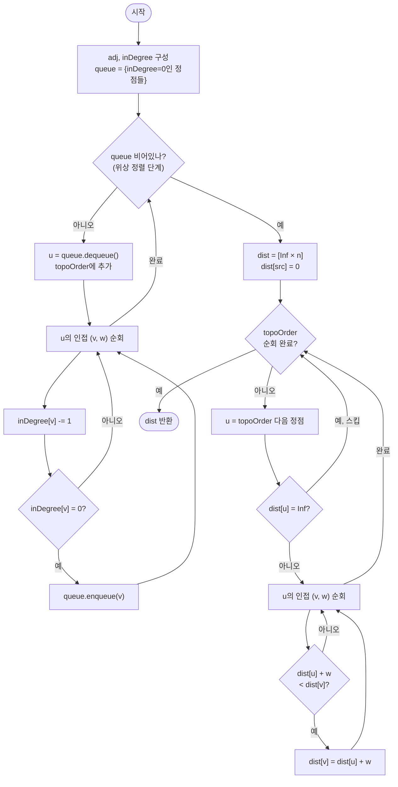

# DAG 최단 경로 해설

## 성능 목표 예측

| 항목 | 값 |
|------|-----|
| V (정점 수) | $1 \leq V \leq 10^5$ |
| E (간선 수) | $0 \leq E \leq 2 \times 10^5$ |
| 가중치 범위 | $-10^9 \leq w(u, v) \leq 10^9$ |
| 구조 제약 | DAG (사이클 없음) |

### Naive 접근의 한계

음수 간선이 있으므로 Dijkstra는 사용 불가다. 대안으로 Bellman-Ford를 적용하면:

$$O(V \cdot E) = 10^5 \times 2 \times 10^5 = 2 \times 10^{10} \to \text{시간 초과}$$

SPFA의 평균 복잡도도 최악의 경우 $O(V \cdot E)$이며, DAG라는 구조를 활용하지 못한다. DAG임을 이용하면 $O(V + E)$로 해결할 수 있다.

### 목표 복잡도와 근거

$$O(V + E) = O(10^5 + 2 \times 10^5) = O(3 \times 10^5) \to \text{최적}$$

위상 정렬 $O(V + E)$ + 완화 단계 $O(V + E)$ = 총 $O(V + E)$. DAG이므로 사이클이 없고, 위상 순서를 이용하면 각 정점을 정확히 한 번만 처리해도 된다.

### 공간 복잡도

- 인접 리스트: $O(V + E)$
- 진입 차수 배열: $O(V)$
- 위상 순서 배열: $O(V)$
- 거리 배열: $O(V)$
- 전체: $O(V + E)$

## 목표 함수

```ts
function dagShortestPath(
  n: number,
  edges: [number, number, number][],
  src: number,
): number[]
```

| 파라미터 | 의미 | 제약 |
|---------|------|------|
| `n` | 정점의 개수 $V$ | $1 \leq n \leq 10^5$ |
| `edges` | 방향 간선 목록 `[u, v, w]` | 음수 가중치 허용 |
| `src` | 시작 정점 $s$ | $0 \leq src < n$ |

**반환값**: 길이 $V$의 배열 `dist`. `dist[v]`는 $s \to v$ 최단 경로 비용이며, 도달 불가능하면 `Infinity`.

**엣지케이스**:
1. `dist[src] = 0`: 자기 자신까지의 거리는 항상 0
2. 위상 순서에서 `src`보다 앞에 있는 정점: `dist = Infinity` (src에서 도달 불가)
3. 음수 가중치 간선이 있어도 DAG이면 음수 사이클 없음 → 알고리즘 정상 동작
4. $V = 1$, 간선 없음: `dist = [0]` 반환 (src가 유일한 정점)

## 핵심 아이디어

### 원형 아이디어와 naive 접근

DAG에서 최단 경로를 구하는 가장 단순한 접근은 DFS로 모든 경로를 열거하는 것이다.

```
function naive(u, target, current_cost):
    if u == target: return current_cost
    best = Infinity
    for (v, w) in adj[u]:
        best = min(best, naive(v, target, current_cost + w))
    return best
```

DAG이므로 무한 루프는 없지만, 경로 수가 지수적이다. 정점 수 $V$의 체인 그래프에서 중간에 분기가 있으면 경로 수가 $2^{V/2}$에 달할 수 있다.

개선 방법으로 메모이제이션을 적용할 수 있다.

```
memo[v] = src에서 v까지 최단 거리

function dp(v):
    if memo[v] ≠ undefined: return memo[v]
    memo[v] = min over (u, v) in E of { dp(u) + w }
```

이 방법은 올바르지만, 재귀 호출 순서가 의존 관계(DAG 위상 순서)를 자동으로 따른다는 점에서 개선의 여지가 있다. 위상 정렬로 그 순서를 명시적으로 결정하면 반복문으로 변환할 수 있다.

### 어떤 관찰이 돌파구가 되는가

- **관찰 1**: DAG에서 임의의 간선 $(u, v)$에 대해 위상 순서상 $u$는 반드시 $v$보다 앞에 위치한다. 이것이 DAG의 정의적 성질이다.

- **관찰 2**: $v$의 최단 거리를 계산하려면 $v$로 들어오는 모든 간선의 출발 정점 $u$의 최단 거리가 먼저 확정되어야 한다. DAG의 위상 순서대로 처리하면 이 의존 관계가 자동으로 만족된다.

- **관찰 3**: 위상 순서대로 처리하면 각 정점을 정확히 한 번만 방문하면 된다. 이미 처리한 정점의 `dist` 값은 더 이상 변하지 않는다(DAG이므로 역방향 간선이 없다).

### 관찰을 형식화: 상태/구조 정의

**상태 정의**: `dist[v]` = 현재까지 계산한 $s \to v$ 최단 경로 비용.

위상 순서 $\sigma = (v_1, v_2, \ldots, v_V)$를 미리 계산하고, 이 순서대로 완화를 수행한다.

왜 이 정의여야 하는가: `dist[v]`를 "위상 순서상 앞 정점들의 완화가 모두 끝난 후의 최단 거리"로 정의해야만 한 번의 처리로 확정 값을 얻을 수 있다. Dijkstra처럼 우선순위 큐를 사용해 "최소 dist 순서"로 처리하면 음수 간선에서 순서가 어긋난다. DAG의 위상 순서는 음수 가중치와 무관하게 의존 관계를 올바르게 반영한다.

**위상 정렬 (Kahn's Algorithm)**:

진입 차수(in-degree)가 0인 정점들을 큐에 넣고, 꺼낼 때마다 그 이웃의 in-degree를 감소시킨다. in-degree가 0이 된 정점을 큐에 추가한다. 이렇게 꺼내지는 순서가 위상 순서다.

### 점화식 또는 핵심 연산

**완화 연산** (위상 순서대로 $u$ 처리 시):

$$dist[v] \leftarrow \min\bigl(dist[v],\; dist[u] + w(u, v)\bigr) \quad \forall (u, v) \in E$$

- $dist[u]$: 이미 위상 순서상 앞에서 처리되어 확정된 $s \to u$ 최단 거리
- $w(u, v)$: 간선 $(u, v)$의 가중치 (음수 허용)
- 모든 $u \to v$ 간선을 처리하면 `dist[v]`가 확정된다

**처리 조건**: `dist[u] = Infinity`이면 $u$는 $s$에서 도달 불가능하므로 완화를 건너뛴다. `Infinity + w`는 무의미하다.

### 정당성 — 왜 이것이 옳은가

**귀납적 정당화**: 위상 순서에서 $u$를 처리하는 시점에 `dist[u]`는 $s \to u$ 진짜 최단 거리임을 귀납으로 보인다.

**기저**: `dist[src] = 0`. src 이전에 위상 순서상 처리되는 정점들은 src에 이르는 간선이 없으므로 `dist = Infinity` 유지.

**귀납 단계**: 위상 순서에서 $u$ 이전 정점들의 `dist`가 모두 확정됐다고 가정하자. $v$로 들어오는 모든 간선 $(u, v)$에 대해, $u$는 $v$보다 위상 순서상 앞이다. 따라서 $v$를 처리하기 전에 $u$의 `dist`가 이미 확정되어 있다. 모든 입력 간선을 완화하면 `dist[v]`가 확정된다.

**DAG이므로 음수 간선도 안전**: Dijkstra는 "현재 최소 dist = 확정"이라는 greedy 가정에 의존한다. 음수 간선이 있으면 나중에 더 짧은 경로가 발견될 수 있어 greedy가 깨진다. 그러나 DAG 알고리즘은 greedy에 의존하지 않고 **구조적 보장**(위상 순서의 의존 관계)에 의존한다. 역방향 간선이 없으므로 이미 처리한 정점의 `dist`가 나중에 변할 가능성이 없다.

**까다로운 케이스**: 음수 가중치 간선 $s \to v \to u$ (where $v$ comes after $s$ in topological order) — $v$를 처리할 때 이미 `dist[s] = 0`이 확정되어 있고, $w(s, v) < 0$이어도 `dist[v] = w(s, v)`로 올바르게 계산된다.

### 구현 디테일과 최적화

**Kahn's 위상 정렬**: 스택을 써도 되지만 큐를 쓰면 BFS 방식으로 자연스럽게 구현된다. 순서의 선택이 결과에 영향을 주지 않는다(어떤 위상 순서를 써도 최단 거리는 동일).

**`dist[u] = Infinity` 스킵**: 도달 불가능한 정점에서 완화를 시도하면 `Infinity + w`의 처리가 필요하다. TypeScript에서는 `Infinity + (-Infinity)` 등 특수 케이스가 발생할 수 있으므로 명시적으로 건너뛰는 것이 안전하다.

**함정 — 위상 정렬 없이 DFS 역순**: DFS 후처리(post-order) 역순도 위상 순서가 된다. 그러나 Kahn's 방식이 in-degree 계산이 명시적이고 디버그가 쉽다.

**함정 — 위상 순서 바깥 루프 순서**: 위상 순서 배열에서 각 정점을 꺼낸 후, 그 정점의 **이웃을 순회해 완화**한다. 반대로 "이웃이 먼저 처리되었나 확인"하는 방식으로 짜면 복잡해진다.

## 수도 코드와 Activity Diagram

### 의사코드

```
function dagShortestPath(n, edges, src):
  // 인접 리스트와 in-degree 계산
  adj ← array of empty lists, size n
  inDegree ← [0] * n
  for (u, v, w) in edges:
    adj[u].append((v, w))
    inDegree[v] += 1

  // Kahn's 위상 정렬
  queue ← [v for v in 0..n-1 if inDegree[v] = 0]  // in-degree가 0인 정점들
  topoOrder ← []
  while queue is not empty:
    u ← queue.dequeue()
    topoOrder.append(u)
    for (v, w) in adj[u]:
      inDegree[v] -= 1                              // 불변식: inDegree는 처리되지 않은 입력 간선 수
      if inDegree[v] = 0:
        queue.enqueue(v)

  // 위상 순서로 완화
  dist ← [Infinity] * n             // 불변식: dist[v]는 현재까지 발견한 s→v 최선값
  dist[src] ← 0
  for u in topoOrder:
    if dist[u] = Infinity: continue // u는 src에서 도달 불가 → 완화 의미 없음
    // 불변식: 이 시점에서 dist[u]는 s→u의 확정된 최단 거리
    for (v, w) in adj[u]:
      if dist[u] + w < dist[v]:
        dist[v] ← dist[u] + w       // 불변식 유지: dist[v] 단조 감소

  return dist
```

**핵심 불변식**: 위상 순서에서 정점 $u$를 처리하는 시점에, $u$로 들어오는 모든 간선의 출발 정점이 이미 처리되어 `dist[u]`는 확정된 최단 거리다.

### Activity Diagram



**핵심 불변식**: 위상 순서로 처리된 정점의 `dist`는 변하지 않는다. 역방향 간선이 없는 DAG 구조가 이를 보장한다.
