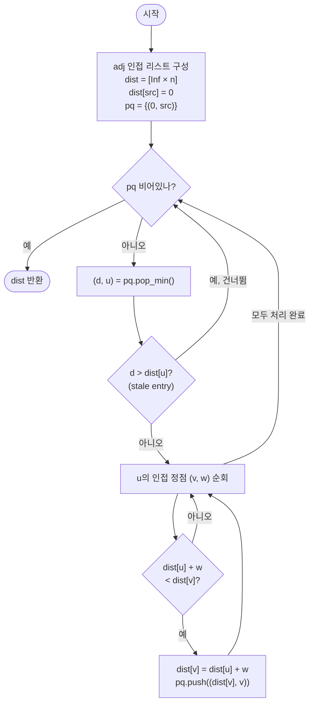

# Dijkstra 최단 경로 해설

## 성능 목표 예측

| 항목 | 값 |
|------|-----|
| V (정점 수) | $1 \leq V \leq 10^5$ |
| E (간선 수) | $0 \leq E \leq 2 \times 10^5$ |
| 가중치 범위 | $0 \leq w(u, v) \leq 10^9$ |

### Naive 접근의 한계

가장 단순한 구현은 매 단계마다 아직 확정되지 않은 정점 전체를 선형 탐색해 거리 최솟값을 찾는 것이다.

- 최소값 탐색: $O(V)$, 이를 $V$번 반복 → $O(V^2)$
- $V = 10^5$일 때 $O(V^2) = 10^{10}$ 연산 → 시간 초과

### 목표 복잡도와 근거

이진 힙(min-heap) 기반 우선순위 큐를 사용하면:

- 힙에서 최솟값 추출: $O(\log V)$
- 간선 완화 후 힙 삽입: $O(\log V)$
- 총 $O((V + E) \log V) \approx 10^5 \times 17 \approx 3.4 \times 10^6$ → 여유 있게 통과

### 공간 복잡도

- 인접 리스트: $O(V + E)$
- 거리 배열: $O(V)$
- 힙: 최악의 경우 중복 삽입으로 $O(E)$개 항목 → 전체 $O(V + E)$

## 목표 함수

```ts
function dijkstra(
  n: number,
  edges: [number, number, number][],
  src: number,
): number[]
```

| 파라미터 | 의미 | 제약 |
|---------|------|------|
| `n` | 정점의 개수 $V$ | $1 \leq n \leq 10^5$ |
| `edges` | 방향 간선 목록 `[u, v, w]` | $w \geq 0$, 0-indexed |
| `src` | 시작 정점 $s$ | $0 \leq src < n$ |

**반환값**: 길이 $V$의 배열 `dist`. `dist[v]`는 $s \to v$의 최단 경로 비용이며, 도달 불가능한 경우 `Infinity`.

**엣지케이스**:
1. `src` 자기 자신: `dist[src] = 0` (초기화로 자동 처리됨)
2. 고립된 정점(연결 간선 없음): `Infinity`로 유지
3. 같은 정점 쌍에 다중 간선: 더 짧은 경로가 자동으로 선택됨
4. 간선이 없는 그래프 ($E = 0$): `dist[src] = 0`, 나머지 모두 `Infinity`

## 핵심 아이디어

### 원형 아이디어와 naive 접근

문제를 가장 단순하게 푼다면, 모든 경로를 BFS/DFS로 열거해 최솟값을 찾는다. 정점 수 $V$, 간선 수 $E$인 그래프에서 단순 경로의 수는 최악 $O(V!)$이므로 불가능하다.

조금 개선하면, `dist` 배열을 두고 매 단계마다 아직 "확정"되지 않은 정점 중 `dist`가 최소인 정점을 선형 탐색하여 그 이웃을 완화한다.

```
dist = [Infinity] * n; dist[src] = 0
visited = [false] * n

반복 V번:
    u = visited가 false인 정점 중 dist[u]가 최소인 것  // O(V)
    visited[u] = true
    for (v, w) in adj[u]:
        if dist[u] + w < dist[v]: dist[v] = dist[u] + w
```

이 naive 구현의 최소값 탐색이 $O(V)$씩 $V$번 반복되어 $O(V^2) = 10^{10}$ → 시간 초과.

### 어떤 관찰이 돌파구가 되는가

- **관찰 1**: 매 단계에서 필요한 것은 "현재 dist 최솟값 정점"이다. 이를 선형 탐색으로 구하는 대신, 자동으로 최솟값을 유지하는 자료구조를 쓰면 된다.
- **관찰 2**: 음수 간선이 없으므로, 힙에서 꺼낸 정점 $u$의 `dist[u]`는 이후 절대 줄어들지 않는다. 이것이 greedy 확정 원리의 핵심이다.
- **관찰 3**: decrease-key 연산 없이, 갱신 시 힙에 새 항목을 삽입하고 꺼낼 때 stale(낡은) 항목을 무시하는 "lazy deletion" 패턴으로 구현을 단순화할 수 있다.

### 관찰을 형식화: 상태/구조 정의

**상태 정의**: `dist[v]` = 현재까지 발견한 $s \to v$의 최단 경로 비용.

min-heap에는 `(dist[v], v)` 쌍을 저장한다. 힙의 최상단은 항상 현재 dist가 가장 작은 정점을 가리킨다.

왜 이 정의여야 하는가: `dist`를 "확정된 최단 거리"가 아니라 "현재까지 발견한 최선값"으로 정의해야 완화 과정에서 단조 감소가 보장된다. 만약 도달 전에 확정으로 표시하면 이후 더 짧은 경로를 놓친다.

**greedy 확정 원리 형식화**:

미확정 정점 중 `dist[u]`가 최소라 하자. 다른 미확정 정점 $x$를 경유해 $s \to x \to \cdots \to u$로 가는 경로는:

$$d(s, x) + w(x, \ldots, u) \geq dist[x] + 0 \geq dist[u]$$

따라서 $u$를 돌아가는 경로는 절대 `dist[u]`보다 짧을 수 없다. **`dist[u]`는 확정이다.**

### 점화식 또는 핵심 연산

**완화(relaxation) 연산**: 정점 $u$를 확장할 때 $u$의 모든 이웃 $v$에 대해

$$dist[v] \leftarrow \min\bigl(dist[v],\; dist[u] + w(u, v)\bigr)$$

- $dist[u]$: 이미 확정된 $s \to u$ 최단 거리
- $w(u, v)$: 간선 $(u, v)$의 가중치
- 갱신이 발생하면 $(dist[v], v)$를 힙에 삽입

**처리 순서**: 힙에서 `dist`가 작은 정점부터 꺼낸다. 이 순서가 greedy 확정 원리를 만족하는 유일한 순서다.

### 정당성 — 왜 이것이 옳은가

**귀납적 주장**: 힙에서 정점 $u$를 꺼낸 순간 `dist[u]`는 $s \to u$의 진짜 최단 거리다.

**기저**: $u = s$일 때 `dist[s] = 0`이 분명히 최단 거리다.

**귀납 단계**: 이미 확정된 정점 집합 $S$에서의 최단 거리가 올바르다고 가정하자. 힙에서 꺼낸 $u \notin S$는 $S$ 외부에서 `dist`가 최소다. 음수 간선이 없으므로, $S$ 밖의 다른 경로로 $u$에 도달하는 비용은 $dist[u]$보다 작을 수 없다(위의 greedy 확정 원리). 따라서 `dist[u]`는 확정이다.

**까다로운 케이스**: 가중치 0인 간선 다수 존재 시 - `dist[u] + 0 < dist[v]`인 경우도 정상적으로 완화되며, greedy 원리가 무너지지 않는다 ($w \geq 0$ 조건 유지).

### 구현 디테일과 최적화

**lazy deletion 패턴**: decrease-key 연산이 없는 단순 힙을 사용한다. `dist[v]`가 줄어들 때마다 힙에 새 항목 `(new_dist, v)`를 삽입하고, 꺼낼 때 `d > dist[u]`이면 stale 항목으로 건너뛴다. 이 패턴으로 구현이 단순해지고, 힙 항목 수는 최악 $O(E)$로 복잡도에 영향 없다.

**함정**: `dist[u] = Infinity`인 정점을 힙에 넣지 않도록 주의해야 한다. 초기에 `(0, src)`만 삽입하고, 완화 성공 시에만 삽입한다. 그렇지 않으면 불필요한 처리가 발생하고 stale 검사가 복잡해진다.

**루프 순서**: 힙에서 꺼낸 $u$에 대해 모든 이웃 $v$를 순회한다. 이웃 순서는 결과에 영향 없다.

**조기 종료 최적화**: 특정 목표 정점 $t$만 필요하다면, $u = t$를 힙에서 꺼낸 순간 반환할 수 있다.

## 수도 코드와 Activity Diagram

### 의사코드

```
function dijkstra(n, edges, src):
  // 인접 리스트 구성
  adj ← array of empty lists, size n
  for (u, v, w) in edges:
    adj[u].append((v, w))

  // 초기화
  dist ← [Infinity] * n          // 불변식: dist[v]는 현재까지 발견한 s→v 최선값
  dist[src] ← 0
  pq ← MinHeap()                 // (dist값, 정점) 쌍을 저장
  pq.push((0, src))

  // 주 루프
  while pq is not empty:
    (d, u) ← pq.pop_min()
    if d > dist[u]:              // stale entry: 이미 더 짧은 경로를 발견한 낡은 항목
      continue
    // 불변식: 이 시점에서 dist[u]는 s→u의 확정된 최단 거리
    for (v, w) in adj[u]:
      newDist ← dist[u] + w
      if newDist < dist[v]:
        dist[v] ← newDist        // 불변식 유지: dist[v] 단조 감소
        pq.push((dist[v], v))

  return dist
```

**핵심 불변식**: 힙에서 정점 $u$를 꺼낸 순간(stale 아닌 경우), `dist[u]`는 $s \to u$의 확정된 최단 거리다.

### Activity Diagram



**핵심 불변식**: 힙에서 정점을 꺼내 stale이 아님을 확인한 시점에, 그 정점의 `dist` 값은 최종 최단 거리로 확정된다.
