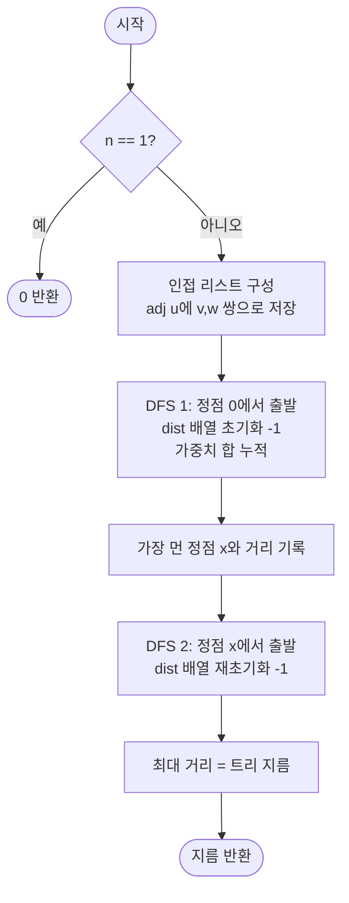

# treeDiameter 해설

## 성능 목표 예측

### 제약 표

| 항목 | 값 |
|------|-----|
| 정점 수 $n$ | $1 \leq n \leq 10^5$ |
| 간선 가중치 $w$ | $w \geq 0$ |
| 간선 수 | $n - 1$ |

### Naive 접근의 한계

트리 지름을 구하는 가장 단순한 방법은 모든 정점 쌍 $(u, v)$에 대해 경로 거리를 계산하여 최댓값을 찾는 것이다.

```
// naive: 모든 쌍 BFS
diameter = 0
for each u in V:
    BFS from u → dist[u][v] for all v
    diameter = max(diameter, max(dist[u]))
```

- BFS 1회: $O(n)$
- $n$번 반복: 총 $O(n^2) = O(10^{10})$ → 시간 초과

### 목표 복잡도와 근거

| 연산 | 목표 복잡도 | 근거 |
|------|-------------|------|
| 트리 지름 계산 | $O(n)$ | BFS/DFS 2회, 각 $O(n)$ |
| 공간 | $O(n)$ | 인접 리스트 + 거리 배열 |

$n = 10^5$에서 $O(n) = 10^5$는 문제 없다. 대안으로 트리 DP도 $O(n)$에 동일한 문제를 해결하지만, 2-BFS 방법이 구현이 더 단순하다.

---

## 목표 함수

```ts
function treeDiameter(n: number, edges: [number, number, number][]): number
```

### 파라미터 표

| 파라미터 | 의미 | 제약 |
|----------|------|------|
| `n` | 정점 수 | $1 \leq n \leq 10^5$ |
| `edges` | 간선 목록 $[u, v, w]$ | 길이 $n-1$, 양방향, $w \geq 0$ |

### 반환값

두 정점 사이 경로 가중치 합의 최댓값. 즉 $\max_{u, v \in V} \text{dist}(u, v)$.

### 엣지케이스

| 케이스 | 조건 | 기대 출력 |
|--------|------|-----------|
| 단일 정점 | $n = 1$, 간선 없음 | `0` |
| 모든 가중치 0 | 모든 $w = 0$ | `0` |
| 선형 체인 | $0 - 1 - 2 - \cdots - (n-1)$ | 전체 가중치 합 |
| 별 모양 | 루트 하나에 모든 리프 연결 | 가장 긴 두 간선의 합 |

---

## 핵심 아이디어

### 원형 아이디어와 naive 접근

트리 지름이란 두 정점 사이 경로 중 가중치 합이 가장 큰 경로의 길이다. 이를 직접 찾으려면 모든 정점 쌍에 대해 경로를 계산해야 한다.

```
// naive
for u in 0..n-1:
    for v in u+1..n-1:
        dist = pathWeight(u, v)   // O(n) BFS/DFS
        diameter = max(diameter, dist)
```

- 총 $\binom{n}{2} \approx n^2/2$개의 쌍에 대해 각 $O(n)$이므로 $O(n^3)$ 또는 Floyd로 $O(n^3)$, BFS 반복으로 $O(n^2)$이어도 $n = 10^5$에서는 시간 초과다.
- 낭비의 본질: 지름의 끝점 두 개를 직접 식별하지 않고 모든 쌍을 탐색한다.

### 어떤 관찰이 돌파구가 되는가

- **관찰 1**: 트리에서 임의의 정점 $s$로부터 가장 먼 정점을 $x$라 하면, $x$는 반드시 트리 지름 경로의 한쪽 끝점이다. (아래에서 정당성 증명)
- **관찰 2**: 위 관찰을 이용하면 BFS를 두 번만 수행해도 지름을 구할 수 있다. 첫 번째 BFS로 지름 끝점 $x$를 찾고, 두 번째 BFS로 $x$에서 가장 먼 거리를 구하면 그것이 지름이다.
- **관찰 3**: 트리에서 두 정점 사이 경로는 유일하므로 BFS 거리와 실제 경로 거리가 일치한다.

### 관찰을 형식화: 상태/구조 정의

**2-BFS 알고리즘**:

$$\text{treeDiameter}(T) = \text{dist}_{\text{BFS}}(x, \cdot)|_{\max}$$

여기서 $x = \arg\max_{v \in V} \text{dist}_{\text{BFS}}(0, v)$ (임의 시작점 0에서 가장 먼 정점).

상태: BFS 탐색 중 관리하는 거리 배열 $\text{dist}[0..n-1]$.

이 정의가 이 형태여야 하는 이유: 트리 DP 방식도 $O(n)$이지만 각 정점에서 "가장 긴 두 경로 합"을 추적해야 하므로 구현이 복잡하다. 2-BFS 방식은 단순한 거리 배열만으로 충분하다.

### 점화식 또는 핵심 연산

**BFS 거리 계산**:

$$\text{dist}[\text{start}] = 0$$
$$\text{dist}[v] = \text{dist}[u] + w_{uv} \quad (\text{u에서 v로 처음 방문 시})$$

이는 점화식이 아닌 BFS 전파 규칙이다. 트리에서 각 정점은 정확히 한 번 방문되므로 경로가 유일하고 BFS는 올바른 거리를 보장한다.

**알고리즘 흐름**:

$$\text{BFS}(0) \to x = \arg\max \text{dist}$$
$$\text{BFS}(x) \to \text{diameter} = \max \text{dist}$$

### 정당성 — 왜 이것이 옳은가

**핵심 주장**: 임의의 정점 $s$에서 가장 먼 정점 $x$는 반드시 어떤 지름 경로의 끝점이다.

**증명 (귀류법)**: 지름 경로의 두 끝점을 $a, b$라 하자. $x$가 $a$도 $b$도 아니라고 가정한다.

트리에서 임의의 두 경로는 분기점에서 만난다. $s \to x$ 경로와 $a \to b$ 경로가 점 $m$에서 처음 교차한다고 하자 (교차하지 않으면 $s \to x$ 경로가 $a \to b$와 완전히 분리되어 있는 것이므로 아래 논리가 더 단순해진다).

- $\text{dist}(s, x) \geq \text{dist}(s, a)$ ($x$가 $s$에서 가장 먼 정점이므로)
- $\text{dist}(s, x) = \text{dist}(s, m) + \text{dist}(m, x)$
- $\text{dist}(s, a) \geq \text{dist}(m, a) - \text{dist}(s, m)$ (삼각부등식)

위 관계들로부터 $\text{dist}(m, x) \geq \text{dist}(m, a)$를 도출할 수 있다. 그러면 $\text{dist}(x, b) = \text{dist}(x, m) + \text{dist}(m, b) \geq \text{dist}(m, a) + \text{dist}(m, b) = \text{dist}(a, b)$이므로 $\text{dist}(x, b) \geq \text{dist}(a, b)$이다. 이는 지름이 $a \to b$가 아니라 $x \to b$임을 의미하므로 모순이다.

따라서 $x$는 반드시 어떤 지름 경로의 끝점이다. 두 번째 BFS에서 $x$로부터 가장 먼 정점까지의 거리가 트리 지름이 된다.

**가중치 0인 경우**: 모든 거리가 0이어도 BFS는 정상 동작한다. `dist[v]`가 모두 0이면 지름 = 0을 올바르게 반환한다.

**단일 정점**: $n = 1$이면 BFS 결과 모두 $\text{dist}[0] = 0$이므로 지름 = 0이 반환된다.

### 구현 디테일과 최적화

**BFS vs DFS**: 가중치가 있으므로 BFS는 일반적인 최단 경로 BFS가 아니라 DFS(또는 스택 기반)로 거리를 추적하는 것이 더 적합하다. BFS는 비가중 그래프에서 홉 수를 세므로, 가중치 합은 DFS로 누적하는 것이 자연스럽다.

**반복적 DFS**: $n = 10^5$에서 재귀 깊이가 스택 한계를 초과할 수 있으므로 반복적 DFS를 사용한다.

**인접 리스트 구조**: `adj[u]`에 `[v, w]` 쌍으로 저장하면 가중치를 함께 관리할 수 있다.

**함정 - dist 초기화**: 방문 여부를 -1로 초기화해야 한다. 0으로 초기화하면 아직 방문하지 않은 정점과 시작 정점(dist = 0)을 구분하지 못한다.

**함정 - BFS에서 가중치 합 누적**: 일반 BFS는 홉 수를 세므로 가중치를 누적하려면 각 간선 탐색 시 `dist[next] = dist[cur] + weight`를 명시적으로 계산해야 한다.

---

## 수도 코드와 Activity Diagram

### 의사코드

```
function treeDiameter(n, edges):
    if n == 1: return 0

    // 인접 리스트 구성
    adj[0..n-1] = []
    for each [u, v, w] in edges:
        adj[u].push([v, w])
        adj[v].push([u, w])

    // 반복적 DFS: 시작점에서 가장 먼 정점과 거리 반환
    function dfs(start) -> (farthest, maxDist):
        dist[0..n-1] = -1           // 불변식: 미방문 = -1
        dist[start] = 0
        stack = [start]
        farthest = start
        maxDist = 0
        while stack not empty:
            cur = stack.pop()
            for [next, w] in adj[cur]:
                if dist[next] == -1:
                    dist[next] = dist[cur] + w   // 불변식: dist[v] = start에서 v까지 가중치 합
                    stack.push(next)
                    if dist[next] > maxDist:
                        maxDist = dist[next]
                        farthest = next
        return (farthest, maxDist)

    // 1단계: 임의 정점 0에서 가장 먼 정점 x 탐색
    (x, _) = dfs(0)

    // 2단계: x에서 가장 먼 거리 = 트리 지름
    (_, diameter) = dfs(x)

    return diameter
```

**핵심 불변식**: `dist[v]`는 DFS 종료 후 시작점으로부터 $v$까지의 유일한 트리 경로 가중치 합이다. 트리에서 경로는 유일하므로 DFS 방문 순서에 무관하게 항상 올바른 값이 설정된다.

### Activity Diagram



**핵심 불변식**: `dist[v] >= 0`이면 $v$는 이미 방문된 정점이며 `dist[v]`는 출발점으로부터의 유일한 경로 가중치 합이다.
