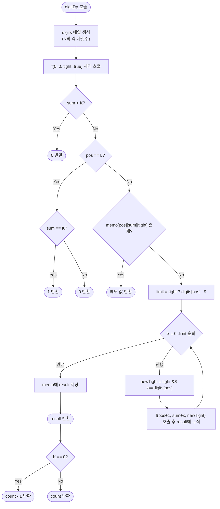

# digitDp — 자릿수 합이 K인 수의 개수 해설

## 성능 목표 예측

| 제약 | 값 |
|------|-----|
| 상한 $N$ | $1 \leq N \leq 10^{15}$ (최대 15자리) |
| 목표 자릿수 합 $K$ | $0 \leq K \leq 135$ ($15 \times 9 = 135$) |

**Naive 접근의 복잡도 분석**

가장 단순한 방법은 $1$부터 $N$까지 모든 정수에 대해 자릿수 합을 계산하는 것이다. 정수 하나당 자릿수 합 계산이 $O(\log N)$이므로 전체 복잡도는 $O(N \log N)$이다. $N = 10^{15}$이면 $10^{15}$번의 반복이 필요하므로 완전히 불가능하다. 이 접근법은 **입력 크기가 아닌 입력 값에 비례하는 루프** 때문에 실패한다.

**목표 복잡도**

자릿수 DP는 상태 수가 $O(L \times K \times 2)$이고 각 상태에서 최대 10개의 숫자를 시도하므로:

$$O(L \cdot K \cdot 10) = O(15 \times 135 \times 10) \approx 20{,}250$$

$N$이 아무리 커져도 자릿수 $L$은 최대 15이므로 이 복잡도는 상수에 가깝다. 시간 초과 걱정이 없다.

**공간 복잡도**

메모이제이션 테이블 크기 $O(L \times K) = O(15 \times 136) \approx 2{,}040$. 극히 작다.

---

## 목표 함수

```ts
function digitDp(N: number, K: number): number
```

| 파라미터 | 의미 | 제약 |
|----------|------|------|
| `N` | 탐색 상한 정수 | $1 \leq N \leq 10^{15}$ |
| `K` | 목표 자릿수 합 | $0 \leq K \leq 135$ |
| 반환값 | $[1, N]$ 범위에서 자릿수 합이 $K$인 수의 개수 | $\geq 0$ |

**엣지케이스 목록**

| 입력 | 기대 출력 | 이유 |
|------|-----------|------|
| `N=9, K=9` | `1` | 1~9 중 자릿수 합이 9인 수는 9 하나 |
| `N=100, K=0` | `0` | 범위 [1,100]에서 자릿수 합이 0인 수는 없음 (0은 제외) |
| `N=999, K=28` | `0` | 세 자리 최대 합은 27; K=28은 불가 |
| `N=1000000000000000, K=1` | `16` | $10^k$ 꼴 수들: $1, 10, 100, \ldots, 10^{15}$가 해당 |

---

## 핵심 아이디어

### 원형 아이디어와 naive 접근

$1$부터 $N$까지 모든 정수를 순회하며 각 정수의 자릿수 합을 계산하는 접근을 생각해 보자.

```
count = 0
for x = 1 to N:
    s = 0
    while x > 0:
        s += x % 10
        x = floor(x / 10)
    if s == K:
        count++
return count
```

이 방법은 $N = 10^{15}$에서 $10^{15}$번의 반복이 필요하므로 수십 년이 걸린다. **$N$의 크기가 아닌 $N$의 자릿수(최대 15)로 복잡도를 줄여야 한다.**

자릿수 합 조건은 각 자리의 숫자를 독립적으로 선택하면서 합산하는 구조여서, 자리별로 탐색하는 분기적 접근이 가능하다. 하지만 단순 분기 탐색도 $10^{15}$가지 경우의 수를 낳으므로, **동일한 (자리 위치, 누적 합) 상태에서의 결과를 재사용**해야 한다.

### 어떤 관찰이 돌파구가 되는가

- **관찰 1 — "N 이하"라는 제약의 구조**: $N$을 자릿수 배열 $d_0 d_1 \ldots d_{L-1}$로 보면, 어떤 자리에서 $d_{pos}$보다 작은 숫자를 선택하는 순간 이후 자리들을 0~9 중 아무 숫자나 자유롭게 선택해도 $N$을 초과하지 않는다. 반면 모든 자리에서 $d_{pos}$를 선택하면 정확히 $N$에 도달한다. 이 두 상황을 `tight` 플래그로 구분하면 상태 공간이 크게 줄어든다.
- **관찰 2 — 중복 부분문제**: `(자리 위치 pos, 누적 합 sum, tight)`가 동일한 상태는 서로 다른 탐색 경로에서 여러 번 등장한다. 한 번 계산한 결과를 메모이제이션하면 중복 계산이 사라진다.
- **관찰 3 — tight=false인 상태는 $N$에 독립**: `tight=false`가 된 순간부터 이후 자리 선택은 $d_{pos}$와 무관하게 0~9 중 아무거나 가능하다. 즉, `(pos, sum, tight=false)` 상태의 결과는 $N$의 나머지 자릿수와 무관하게 재사용할 수 있다.

### 관찰을 형식화: 상태/구조 정의

상태를 세 변수의 튜플로 정의한다.

$$f(pos,\; sum,\; tight)$$

- $pos$: 현재 결정 중인 자릿수 위치 ($0$이 최상위 자리, $L-1$이 최하위)
- $sum$: 이미 결정된 자리들의 숫자 합
- $tight$: 지금까지 선택한 자리 숫자가 $N$의 대응 자리와 동일한지 여부

이 상태는 "자리 $pos$부터 끝까지 숫자를 채웠을 때, 현재까지 누적 합이 $sum$인 상태에서 자릿수 합이 $K$가 되는 수의 개수"를 나타낸다.

왜 이 세 변수로 충분한가? $tight = \text{false}$가 되면 이후 결정은 $N$과 무관해지므로 $(pos, sum)$ 두 변수만으로 결과가 결정된다. $tight = \text{true}$이면 현재 자리의 상한 $d_{pos}$까지만 선택 가능하므로 $pos$가 필요하다. 이 세 변수 이외의 정보는 결과에 영향을 주지 않는다.

### 점화식 또는 핵심 연산

**종료 조건** ($pos = L$, 즉 모든 자리를 결정했을 때):

$$f(L,\; sum,\; *) = [sum = K]$$

아직 $K$에 도달하지 못했으면 0, 정확히 $K$이면 1이다.

**조기 가지치기**: $sum > K$이면 이후 어떤 숫자를 선택해도 합을 줄일 수 없으므로 0을 즉시 반환한다.

**일반 전이** ($pos < L$, $sum \leq K$):

$$f(pos,\; sum,\; tight) = \sum_{x=0}^{\,limit} f\!\left(pos+1,\; sum+x,\; tight \wedge (x = d_{pos})\right)$$

여기서:
- $limit = \begin{cases} d_{pos} & \text{if } tight = \text{true} \\ 9 & \text{if } tight = \text{false} \end{cases}$
- $x$: 현재 자리에 넣을 숫자 (0부터 $limit$까지)
- $tight \wedge (x = d_{pos})$: $x$가 $d_{pos}$보다 작으면 이후 tight가 해제됨

각 항의 의미:
- $x$ 이후 자리들을 자유롭게 채웠을 때 자릿수 합 $= K$가 되는 수의 개수
- 모든 가능한 $x$의 기여를 합산

**결과에서 0 제외**:

$$\text{digitDp}(N, K) = f(0, 0, \text{true}) - [K = 0]$$

$f(0, 0, \text{true})$는 수 $0$(자릿수 합 0)도 포함해 셀 수 있다. 문제는 $[1, N]$을 요구하므로 $K = 0$일 때 1을 뺀다.

### 정당성 — 왜 이것이 옳은가

재귀 함수 $f$는 자릿수를 한 자리씩 위에서 아래로 결정하며 모든 유효한 숫자를 빠짐없이 탐색한다. `tight` 플래그를 통해 $N$을 초과하는 숫자는 탐색 대상에서 제외된다. 메모이제이션은 동일한 `(pos, sum, tight)` 상태에 대해 최초 계산 결과를 저장하고 재사용하므로, 탐색 결과가 변하지 않는다.

특수 케이스 검증:
- $K = 0$: $f(0, 0, \text{true})$는 수 $0$을 포함하므로 1을 빼서 제외한다.
- $K > L \times 9$: $sum$이 절대 $K$에 도달할 수 없으므로 $sum > K$ 가지치기에 걸려 0을 반환한다.
- $N = 1$: 자릿수 배열이 `[1]`이 되며, $K = 1$이면 $f(0, 0, \text{true})$에서 $x = 1$만 허용되어 $f(1, 1, \text{true}) = 1$이 반환된다. 올바르다.

### 구현 디테일과 최적화

**$N$을 자릿수 배열로 변환**: JavaScript/TypeScript에서 `N.toString().split('').map(Number)`로 처리한다. `10^{15}$는 `Number.MAX_SAFE_INTEGER`($2^{53} - 1 \approx 9 \times 10^{15}$)보다 작으므로 `number` 타입으로 안전하게 처리할 수 있다.

**메모이제이션 테이블**: `memo[pos][sum][tight ? 1 : 0]`를 $-1$로 초기화하고, 계산 완료 후 저장한다. `tight=false` 상태만 메모이제이션해도 충분하지만, 양쪽 모두 메모이제이션하면 구현이 단순해진다.

**흔한 함정 — 0 제외 누락**: $K = 0$일 때 1을 빼지 않으면 $0$을 카운트에 포함시켜 틀린 결과를 낸다. $K \neq 0$이면 자릿수 합이 0인 수는 0뿐이므로 별도 처리가 불필요하다.

**tight 전달 실수**: 현재 자리에서 $x < d_{pos}$를 선택했는데도 `tight=true`를 유지하면 이후 자리에서 잘못된 상한이 적용되어 $N$을 초과하는 수를 카운트하게 된다. 반드시 `tight && (x == digits[pos])`를 다음 단계에 전달해야 한다.

---

## 수도 코드와 Activity Diagram

### 의사코드

```
function digitDp(N, K):
    digits = N을 십진 자릿수 배열로 변환 (길이 L)
    // memo[pos][sum][tight]: -1이면 미계산
    memo = L × (K+1) × 2 크기 배열, -1로 초기화

    function f(pos, sum, tight):
        // 불변식: sum <= K (가지치기로 보장)
        if sum > K: return 0
        if pos == L: return sum == K ? 1 : 0

        key = tight ? 1 : 0
        if memo[pos][sum][key] != -1:
            return memo[pos][sum][key]

        limit = tight ? digits[pos] : 9   // 현재 자리의 최댓값
        result = 0
        for x = 0 to limit:               // 현재 자리에 넣을 숫자
            newTight = tight && (x == digits[pos])
            result += f(pos + 1, sum + x, newTight)

        memo[pos][sum][key] = result
        return result

    count = f(0, 0, true)
    return K == 0 ? count - 1 : count    // 수 0 제외
```

### Activity Diagram



**핵심 불변식**: `memo[pos][sum][tight]`가 채워진 후, 그 값은 "자리 $0 \ldots pos-1$을 이미 결정해 합이 $sum$이고 `tight` 상태에서, 자리 $pos$부터 끝까지 적절히 채웠을 때 자릿수 합이 $K$인 수의 개수"로 항상 유효하다.
