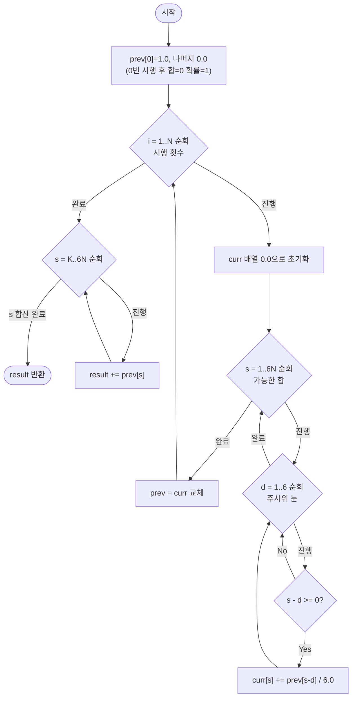

# expectedValueDp — 주사위 N회 합이 K 이상일 확률 해설

## 성능 목표 예측

| 제약 | 값 |
|------|-----|
| 시행 횟수 $N$ | $1 \leq N \leq 1000$ |
| 목표 합 임계값 $K$ | $0 \leq K \leq 6N$ |
| 최대 가능 합 | $6N \leq 6000$ |

**Naive 접근의 복잡도 분석**

주사위를 $N$번 던지는 모든 결과를 열거하면 가능한 경우의 수는 $6^N$이다. $N = 1000$이면 $6^{1000}$가지를 탐색해야 한다는 의미로, 우주의 나이보다 긴 시간이 걸린다. 각 시퀀스에서 합산하면 $O(N \cdot 6^N)$ 연산이 필요하다.

**목표 복잡도**

$$O(N \cdot 6N \cdot 6) = O(N^2) = O(10^6)$$

$N$번 시행에서 발생하는 최대 합은 $6N$이므로, 상태는 $(시행 횟수, 현재 합)$의 $N \times 6N$가지이다. 각 상태를 6번의 연산으로 채우므로 전체 연산량은 $O(N^2)$이다.

**공간 복잡도**

- 2D 배열 $O(N \times 6N) = O(N^2)$도 가능하지만, 각 단계에서 바로 이전 단계만 참조하므로 **롤링 배열**로 $O(6N) = O(N)$으로 줄일 수 있다.
- $N = 1000$이면 롤링 배열 크기는 6,001 원소 — 매우 작다.

---

## 목표 함수

```ts
function expectedValueDp(N: number, K: number): number
```

| 파라미터 | 의미 | 제약 |
|----------|------|------|
| `N` | 주사위 시행 횟수 | $1 \leq N \leq 1000$ |
| `K` | 목표 합 임계값 | $0 \leq K \leq 6N$ |
| 반환값 | $N$회 합이 $K$ 이상일 확률 | $\in [0, 1]$ |

**엣지케이스 목록**

| 입력 | 기대 출력 | 이유 |
|------|-----------|------|
| `N=1, K=0` | `1.0` | 합은 항상 1~6 ≥ 0 이므로 확률 100% |
| `N=1, K=7` | `0.0` | 한 번 던져 7 이상은 불가 |
| `N=1, K=4` | `0.5` | 4,5,6이 나올 확률 = 3/6 = 0.5 |
| `N=1000, K=0` | `1.0` | 합은 항상 ≥ N ≥ 1 > 0 |

---

## 핵심 아이디어

### 원형 아이디어와 naive 접근

$N$번 주사위를 던져 모든 결과 배열 $(d_1, d_2, \ldots, d_N)$($d_i \in \{1,\ldots,6\}$)을 열거하고, 그 중 합이 $K$ 이상인 배열의 비율을 구한다.

```
count = 0
total = 6^N
for each sequence (d1, d2, ..., dN) in {1..6}^N:
    if d1 + d2 + ... + dN >= K:
        count++
return count / total
```

이 방식은 $6^N$가지 시퀀스를 모두 탐색해야 한다. $N = 100$에서도 $6^{100} \approx 10^{77}$가지이므로 전혀 불가능하다. **핵심 낭비**: 합이 같은 서로 다른 시퀀스들(예: $(1,2,3)$과 $(3,1,2)$와 $(2,1,3)$ 등)을 따로 계산한다.

### 어떤 관찰이 돌파구가 되는가

- **관찰 1 — 합의 분포만 추적하면 충분하다**: 합이 $K$ 이상인 확률을 구하는 데 있어 시퀀스의 순서는 중요하지 않다. 시행 $i$를 마쳤을 때 합이 $s$일 확률만 알면 다음 단계를 계산할 수 있다. 즉, **"합의 확률 분포"만 추적**하면 된다.
- **관찰 2 — 마르코프 성질**: $i$번째 시행 결과는 이전 시행 결과와 독립이다. 따라서 $i$번 시행 후 합이 $s$일 확률 $p[i][s]$는 $i-1$번 시행 후 상태 $p[i-1][\cdot]$만으로 결정된다. 전체 시퀀스 이력을 저장할 필요가 없다.
- **관찰 3 — 롤링 배열 가능**: $p[i][s]$를 계산할 때 $p[i-1][\cdot]$만 필요하다. 따라서 배열 두 개를 번갈아 쓰면 공간을 $O(N)$으로 줄일 수 있다.

### 관찰을 형식화: 상태/구조 정의

$$p[i][s] = \text{주사위를 정확히 } i \text{번 던진 후 합이 정확히 } s \text{일 확률}$$

초기 조건:

$$p[0][0] = 1.0, \quad p[0][s] = 0 \;\; (s > 0)$$

$p[0][0] = 1$의 의미: 0번 던진 후 합은 확실히 0이다.

왜 2D 상태로 정의해야 하는가? 만약 "최종 합의 분포"만 저장하면 중간 단계를 잃어버려 점화식을 세울 수 없다. $i$번째 결과가 $i-1$번째 상태로부터 유도되므로 "단계"를 명시하는 차원이 필요하다. 반면 단계 $i$에서 단계 $i-1$만 참조하므로 2D 전체를 저장하지 않아도 된다.

### 점화식 또는 핵심 연산

$i$번 시행 후 합이 $s$인 경우, 이번 시행에서 눈 $d$ ($1 \leq d \leq 6$)가 나왔고 이전 합이 $s - d$였어야 한다. 눈 $d$의 확률은 $\frac{1}{6}$이다.

$$p[i][s] = \frac{1}{6} \sum_{d=1}^{6} p[i-1][s - d] \quad (s \geq d \text{인 항만 합산})$$

각 항의 의미:
- $p[i-1][s-d]$: $i-1$번 던진 후 합이 $s-d$일 확률
- $\frac{1}{6}$: 이번 시행에서 눈 $d$가 나올 확률
- 합산: 눈 $d$가 1~6인 모든 경우의 기여를 더함

결과 계산:

$$\text{expectedValueDp}(N, K) = \sum_{s=K}^{6N} p[N][s]$$

### 정당성 — 왜 이것이 옳은가

귀납으로 증명한다. $i = 0$에서 $p[0][0] = 1$이므로 초기 조건이 올바르다. $p[i-1][\cdot]$이 $i-1$번 시행 후 합의 정확한 확률 분포라고 가정하면, $p[i][s]$는 이번 시행에서 가능한 눈 $d = 1, \ldots, 6$에 대해 각각 이전 합 $s - d$에 도달할 확률을 $\frac{1}{6}$의 가중치로 합산한다. 이는 전체 확률의 법칙(Law of Total Probability)을 정확히 따른다.

불변식 검증: 임의의 $i$에서 $\sum_{s=0}^{6i} p[i][s] = 1$이어야 한다. $p[0]$에서 합이 1이고, 전이식이 확률을 보존하므로 귀납적으로 유지된다.

특수 케이스:
- $K = 0$: 합이 0 이상인 확률 = 1.0 (모든 합은 $\geq 0$이므로)
- $K > 6N$: 최대 합이 $6N$이므로 $s = K$인 항이 없어 0.0이 반환된다.
- $s - d < 0$인 경우: 인덱스 범위 밖이므로 해당 항을 0으로 취급한다.

### 구현 디테일과 최적화

**롤링 배열**: 매 단계마다 새로운 `curr` 배열을 0으로 초기화하고, `prev`로부터 계산한 후 `prev = curr`로 교체한다. 이렇게 하면 $O(N)$ 공간으로 충분하다.

**루프 순서**: 합 $s$를 바깥 루프, 눈 $d$를 안쪽 루프로 하거나 반대로 해도 결과가 같다. 그러나 $s - d < 0$인 경우를 체크해야 한다.

**부동 소수점 오차**: $\frac{1}{6}$을 매 단계 곱하면 수가 매우 작아질 수 있다. 각 단계에서 정규화하거나, 정수 카운트로 계산 후 마지막에 $6^N$으로 나누는 방법도 있다. 단, 후자는 $6^N$이 매우 커져 `BigInt`가 필요할 수 있다.

**흔한 함정**: `curr[s] += prev[s - d] / 6.0`에서 `prev`가 아닌 `curr`을 참조하면 같은 단계 내에서 이미 갱신된 값을 읽어 결과가 틀어진다. 반드시 `prev`와 `curr`을 분리해야 한다.

---

## 수도 코드와 Activity Diagram

### 의사코드

```
function expectedValueDp(N, K):
    maxSum = 6 * N
    prev = 크기 (maxSum+1)인 배열, 0.0으로 초기화
    prev[0] = 1.0
    // 불변식: prev[s]는 "주사위를 현재까지 던진 횟수 후 합이 s일 확률"
    // 불변식: sum(prev[0..maxSum]) == 1.0

    for i = 1 to N:
        curr = 크기 (maxSum+1)인 배열, 0.0으로 초기화
        for s = 1 to maxSum:
            for d = 1 to 6:
                if s - d >= 0:
                    curr[s] += prev[s - d] / 6.0
        prev = curr
        // 루프 불변식: i번 던진 후 합 s의 확률이 prev[s]에 저장됨

    // K 이상인 합의 확률 합산
    result = 0.0
    for s = K to maxSum:
        result += prev[s]
    return result
```

### Activity Diagram



**핵심 불변식**: 바깥 루프 $i$회가 완료된 시점에 `prev[s]`는 정확히 "공정한 주사위를 $i$번 던졌을 때 합이 $s$일 확률"이며, 모든 $s$에 대한 합이 1.0이다.
