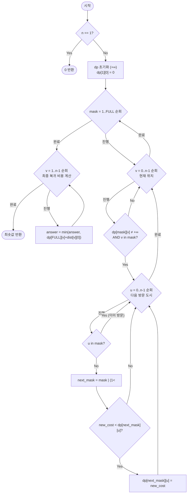

# tspBitmask — 외판원 문제 비트마스크 DP 해설

## 성능 목표 예측

| 제약 | 값 |
|------|-----|
| 도시 수 $n$ | $1 \leq n \leq 20$ |
| 거리 $dist[i][j]$ | $0 \leq dist[i][j] \leq 10^6$ |

**Naive 접근의 복잡도 분석**

도시 0에서 출발해 모든 도시를 순서대로 방문하는 모든 순열을 열거하면, 고려해야 할 순열의 수는 $(n-1)!$이다(출발지 고정). $n = 20$이면 $19! \approx 1.2 \times 10^{17}$가지로, 각 순열의 비용 계산이 $O(n)$이면 전체 $O(n \cdot n!) \approx 2.4 \times 10^{18}$ 연산이다. 이는 현재 컴퓨터로 수십 년이 걸린다.

TSP는 NP-완전 문제이므로 다항 시간 알고리즘이 없다. 하지만 $n \leq 20$ 제약에서는 지수 시간 알고리즘이더라도 기저를 줄이면 실용적으로 해결할 수 있다.

**목표 복잡도**

$$O(n^2 \cdot 2^n) = O(20^2 \times 2^{20}) \approx O(4 \times 10^8)$$

상수가 작아 실용적으로 허용 가능하다. $n! \approx 10^{17}$에서 $n^2 \cdot 2^n \approx 4 \times 10^8$으로 줄어드는 것이 핵심 개선이다.

**공간 복잡도**

$$O(n \cdot 2^n) = O(20 \times 2^{20}) \approx O(2 \times 10^7)$$

약 $2 \times 10^7$개의 정수 저장 — 대략 80~160MB. 메모리 제한이 있는 경우 주의가 필요하다.

---

## 목표 함수

```ts
function tspBitmask(dist: number[][]): number
```

| 파라미터 | 의미 | 제약 |
|----------|------|------|
| `dist` | $n \times n$ 거리 행렬 | $1 \leq n \leq 20$, $dist[i][i] = 0$ |
| 반환값 | 도시 0 출발·귀환 최소 투어 비용 | $\geq 0$ |

**엣지케이스 목록**

| 입력 | 기대 출력 | 이유 |
|------|-----------|------|
| `dist=[[0]]` | `0` | 도시 1개, 출발지로 돌아오는 비용 0 |
| `dist=[[0,10],[10,0]]` | `20` | 도시 2개: 0→1→0, 비용 10+10 |
| `dist=[[0,1,2],[2,0,1],[1,2,0]]` | `3` | 0→1→2→0: 1+1+1=3 |
| 방향 그래프 ($dist[i][j] \neq dist[j][i]$) | (올바른 최솟값) | 방향성도 동일하게 처리 |

---

## 핵심 아이디어

### 원형 아이디어와 naive 접근

도시 0에서 출발해 나머지 도시들을 순서대로 방문하는 모든 경우를 재귀로 탐색한다.

```
function search(current, visited, cost):
    if all cities visited:
        return cost + dist[current][0]    // 출발지 복귀 비용 추가
    best = Infinity
    for next = 0 to n-1:
        if next not in visited:
            best = min(best, search(next, visited ∪ {next}, cost + dist[current][next]))
    return best
```

이 재귀는 $(n-1)!$개의 리프를 가진 트리를 탐색하므로 $O(n!)$ 시간이 걸린다.

핵심 낭비는 **중복 부분문제**이다. 예를 들어 "0→1→2→3에 있을 때"와 "0→2→1→3에 있을 때"는 방문 도시 집합이 $\{0,1,2,3\}$이고 현재 위치가 $3$으로 같다. 나머지 경로의 최솟값이 동일하므로 이를 재계산할 필요가 없다. 상태를 `(방문한 도시 집합, 현재 위치)`로 정의하면 중복을 제거할 수 있다.

### 어떤 관찰이 돌파구가 되는가

- **관찰 1 — 부분 경로의 최적값은 "방문 집합 + 현재 위치"에만 의존한다**: 어떤 순서로 방문했는지는 중요하지 않다. 남은 도시들을 최소 비용으로 방문하는 방법은 현재까지 방문한 집합과 현재 위치만으로 결정된다.
- **관찰 2 — 방문 집합을 비트마스크로 표현할 수 있다**: $n$개 도시의 방문 여부를 $n$비트 정수로 표현하면, 집합 포함/배제 연산을 $O(1)$ 비트 연산으로 수행할 수 있다.
- **관찰 3 — 상태 공간의 크기가 manageable하다**: 가능한 `(mask, v)` 쌍의 수는 $2^n \times n$이다. $n = 20$에서 약 $2 \times 10^7$가지 — 메모이제이션/테이블로 관리 가능하다.

### 관찰을 형식화: 상태/구조 정의

$$dp[mask][v] = \text{"도시 0에서 출발해, 방문 집합이 } mask \text{이고 현재 위치가 } v \text{일 때까지의 최소 비용"}$$

여기서 $mask$는 방문한 도시들의 집합을 비트마스크로 나타낸다. 비트 $i$가 1이면 도시 $i$를 방문했음을 의미한다.

초기 조건:

$$dp[1 \ll 0][0] = 0$$

도시 0에서 출발하면 방문 집합이 $\{0\}$(= $1 \ll 0 = 1$)이고 현재 위치가 0이며 비용이 0이다. 나머지 모든 값은 $+\infty$로 초기화한다.

왜 이 2D 정의여야 하는가? 방문 집합만으로는 다음 이동의 비용(`dist[v][next]`)을 계산할 수 없다. 현재 위치 $v$가 있어야 다음 도시까지의 거리를 알 수 있다. 반대로, 도시를 방문한 순서는 남은 경로에 영향을 주지 않으므로 방문 집합으로 충분하다.

### 점화식 또는 핵심 연산

**Push 방식** (현재 상태에서 다음 상태로 전이):

현재 방문 집합 $mask$, 현재 위치 $v$에서 미방문 도시 $u$로 이동:

$$dp[mask \mid (1 \ll u)][u] = \min\!\bigl(dp[mask \mid (1 \ll u)][u],\; dp[mask][v] + dist[v][u]\bigr)$$

각 항의 의미:
- $mask \mid (1 \ll u)$: 도시 $u$를 방문 집합에 추가한 새 마스크
- $dp[mask][v]$: 현재까지의 최소 비용
- $dist[v][u]$: 도시 $v$에서 도시 $u$로 이동하는 비용

**결과 계산**:

모든 도시를 방문한 마스크 $FULL = (1 \ll n) - 1$에서, 각 도시 $v \neq 0$로부터 출발지 0으로 돌아오는 비용:

$$\text{answer} = \min_{v = 1}^{n-1} \bigl(dp[FULL][v] + dist[v][0]\bigr)$$

### 정당성 — 왜 이것이 옳은가

$dp[mask][v]$가 "집합 $mask$를 방문하고 $v$에서 끝나는, 도시 0 출발 경로의 최솟값"임을 귀납으로 보인다.

초기 상태 $dp[1][0] = 0$은 도시 0에서 출발해 도시 0을 방문한 비용이 0임을 나타내며 자명하다.

$|mask| = k$인 모든 상태가 올바르다고 가정하면, $|mask'| = k+1$인 상태는 $mask' = mask \mid (1 \ll u)$, $v = u$ 형태이다. $dp[mask'][u]$를 계산할 때, 이전 위치 $v \in mask$($v \neq u$)로부터의 $dp[mask][v] + dist[v][u]$의 최솟값을 취한다. 귀납 가정에 의해 $dp[mask][v]$가 올바르므로, $dp[mask'][u]$도 올바르다.

특수 케이스: $n = 1$이면 $FULL = 1$, $dp[1][0] = 0$이고 결과 계산 루프가 $v = 1 \ldots 0$으로 비어 있다. 이 경우 별도로 0을 반환해야 한다.

### 구현 디테일과 최적화

**마스크 순회 순서**: $mask$를 1부터 $FULL$까지 오름차순으로 순회하면, $|mask|$가 작은 상태가 먼저 처리된다. $dp[mask][v]$를 채우려면 $dp[mask \setminus \{v\}][\cdot]$이 필요하므로, 비트 수가 작은 마스크가 먼저 계산되어야 한다는 의존성이 자동으로 만족된다.

**Push vs Pull 방식**: Push 방식(현재 상태 → 다음 상태)과 Pull 방식(다음 상태 ← 이전 상태) 모두 가능하다. Push 방식에서는 $dp[mask][v]$가 $+\infty$가 아닌 경우(= 유효한 상태)에서만 전이하면 불필요한 계산을 줄일 수 있다.

**메모리 최적화**: $n = 20$에서 $dp$ 배열 크기는 $(2^{20}) \times 20 \approx 2 \times 10^7$이다. 32비트 정수로 저장하면 약 80MB이다. 시스템 메모리 제한에 따라 문제가 될 수 있으므로, 값의 범위에 따라 자료형을 선택한다.

**흔한 함정**:
- 비트 $v$가 $mask$에 포함되지 않은 상태에서 $dp[mask][v]$를 유효 상태로 취급하면 경로가 꼬인다. 반드시 비트 $v$가 $mask$에 있는 경우에만 처리한다.
- 결과 계산 시 $v = 0$도 포함해 $dp[FULL][0] + dist[0][0] = dp[FULL][0]$를 취하면, 도시 0을 경유지로 포함하는 경로가 비정상적으로 유리해질 수 있다. 반드시 $v \neq 0$ 조건을 유지한다.
- $n = 1$인 경우 반환값을 명시적으로 0으로 처리해야 한다.

---

## 수도 코드와 Activity Diagram

### 의사코드

```
function tspBitmask(dist):
    n = dist.length
    if n == 1: return 0

    FULL = (1 << n) - 1
    // dp[mask][v]: 집합 mask를 방문하고 v에 있을 때의 최소 비용
    dp = (FULL+1) × n 배열, +Infinity로 초기화
    dp[1][0] = 0    // 도시 0만 방문, 위치 0, 비용 0
    // 불변식: dp[mask][v]가 유한값이면, v가 mask의 비트에 포함됨

    for mask = 1 to FULL:               // 비트 수 오름차순 자동 보장
        for v = 0 to n-1:
            if dp[mask][v] == +Infinity: continue
            if bit v not in mask: continue       // 유효 상태 확인

            for u = 0 to n-1:
                if bit u in mask: continue       // 이미 방문한 도시 제외
                next_mask = mask | (1 << u)
                new_cost = dp[mask][v] + dist[v][u]
                if new_cost < dp[next_mask][u]:
                    dp[next_mask][u] = new_cost

    // 모든 도시 방문 후 출발지 복귀
    answer = +Infinity
    for v = 1 to n-1:
        cost = dp[FULL][v] + dist[v][0]
        answer = min(answer, cost)
    return answer
```

### Activity Diagram



**핵심 불변식**: $dp[mask][v]$가 유한값일 때, 그 값은 "비트 $v$가 $mask$에 포함되어 있고, 도시 0에서 출발해 $mask$의 도시들을 정확히 모두 방문하고 현재 위치가 $v$인 최소 경로 비용"이다.
