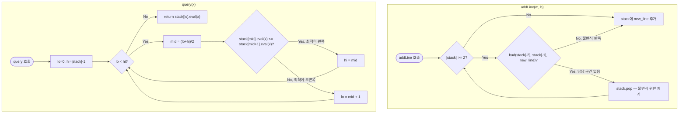

# convexHullTrick 해설

## 성능 목표 예측

| 항목 | 값 |
|------|-----|
| 직선 수 $n$ | 최대 $10^5$ 수준 |
| 기울기 범위 | $-10^9 \leq m \leq 10^9$, 비감소 순서 입력 |
| 절편 범위 | $-10^{18} \leq b \leq 10^{18}$ |
| 쿼리 지점 범위 | $-10^9 \leq x \leq 10^9$, 임의 순서 |

**naive 접근의 한계.** 쿼리마다 등록된 모든 직선을 순회하면 `query` 하나에 $O(n)$, $q$개 쿼리에 $O(nq)$가 된다. $n = q = 10^5$이면 $10^{10}$ 연산으로 제한 시간 초과다.

**목표 복잡도.**

| 연산 | 복잡도 | 근거 |
|------|--------|------|
| `addLine` | $O(1)$ 분할 상환 | 각 직선은 스택에 최대 1회 추가·제거 |
| `query` (임의 순서) | $O(\log n)$ | 볼록 껍질 위 이진 탐색 |
| 전체 ($n$ 추가 + $q$ 쿼리) | $O(n + q \log n)$ | — |

**공간 복잡도.** 스택에 최대 $n$개의 직선을 유지하므로 $O(n)$. 추가 자료구조는 불필요하다.

---

## 목표 함수

```ts
class ConvexHullTrick {
  addLine(m: number, b: number): void
  query(x: number): number
}
```

### 파라미터 표

| 파라미터 | 의미 | 제약 |
|---------|------|------|
| `m` | 직선 $y = mx + b$의 기울기 | $-10^9 \leq m \leq 10^9$, **비감소 순서**로만 호출 |
| `b` | 직선의 절편 | $-10^{18} \leq b \leq 10^{18}$ |
| `x` | 쿼리 평가 지점 | $-10^9 \leq x \leq 10^9$ |

**반환값.** `query(x)`는 등록된 모든 직선 $\ell_i(x) = m_i x + b_i$ 중 $x$에서의 최솟값 $\min_i(m_i x + b_i)$를 반환한다.

### 엣지케이스

1. **직선이 1개뿐일 때** — 스택에 직선이 하나뿐이므로 `query`는 그 직선의 값을 반환해야 한다.
2. **동일한 기울기의 직선이 추가될 때** — 같은 기울기 $m$이면 절편 $b$가 더 작은 직선만 최솟값에 기여할 수 있다. 새 직선의 $b$가 더 크면 스택 교체 없이 폐기해야 한다.
3. **모든 직선이 평행할 때** ($m$이 모두 동일) — 볼록 껍질은 절편이 가장 작은 직선 하나만 남는다. 어떤 $x$에서도 그 직선이 최솟값이다.
4. **쿼리 $x$가 극단값일 때** — $x = \pm 10^9$에서 $m \cdot x + b$는 최대 $\approx 2 \times 10^{18}$ 크기가 될 수 있으므로, 내부 연산에서 정수 오버플로(JS `number`의 정밀도 한계)에 주의해야 한다.

---

## 핵심 아이디어

**핵심 아이디어**: "쿼리마다 모든 직선을 검사하는 대신, 최솟값에 기여할 수 있는 직선들만 볼록 껍질로 추려 이진 탐색한다."

직선 $n$개 중에서 특정 $x$에서 최솟값을 담당하는 직선은 기껏해야 하나뿐이다. 직선들을 기울기 오름차순으로 정렬하면 "최솟값 담당 구간"이 겹치지 않고 순서대로 배열되어 하한 볼록 껍질을 이룬다. 이 껍질 위의 직선들에 대해서만 이진 탐색하면 쿼리 하나를 $O(\log n)$에 처리할 수 있다.

**풀이 구조**
1. 새 직선을 기울기 오름차순으로 스택에 추가한다.
2. 추가 시 스택 상단의 직선이 새 직선과 그 아래 직선 사이에서 완전히 가려지는지 판정해 제거한다.
3. 쿼리 $x$가 들어오면 볼록 껍질 스택에서 이진 탐색으로 최솟값을 주는 직선을 찾는다.

**조건**: 직선이 기울기 비감소 순서로 추가되어야 한다(단조 입력 조건).

**대표 예시**: DP 최적화 — "구간 비용을 직선으로 모델링한 DP"
$n$개의 도시를 방문하는 문제에서 각 이동 비용이 $m \cdot x + b$ 형태로 표현된다고 하자. 직선 하나를 $dp[j]$와 연결하고 새 상태 $dp[i]$를 $\min_j(\text{line}_j(i))$로 구하면, 매 상태마다 $O(n)$ 탐색 대신 볼록 껍질 트릭으로 $O(\log n)$에 처리된다.

**언제 쓰나**
DP 점화식이 $dp[i] = \min_j(m_j \cdot x_i + b_j)$ 형태로 분리되고, 기울기가 단조적으로 추가되는 상황에서 유효하다. 최댓값 버전은 부호를 반전해 동일하게 적용한다.

---

### 원형 아이디어와 naive 접근

가장 단순한 접근은 직선들의 리스트를 유지하고 쿼리마다 전부 평가해 최솟값을 찾는 것이다.

```
query(x):
    result = +∞
    for each line (m, b) in lines:
        result = min(result, m * x + b)
    return result
```

이 방법의 **폭발 지점**: 직선이 $n$개 등록된 상태에서 쿼리 $q$개를 처리하면 총 $O(nq)$ 연산이 필요하다. $n = q = 10^5$이면 $10^{10}$ 번의 곱셈·비교가 발생해 현실적으로 불가능하다.

또한 직선 중 일부는 어떤 $x$에서도 최솟값을 담당하지 않는 "쓸모없는 직선"이다. naive 접근은 이를 걸러내지 않고 매번 계산하므로 중복 비용이 발생한다.

### 어떤 관찰이 돌파구가 되는가

- **관찰 1.** 기울기 오름차순으로 정렬된 직선 집합에서, 쿼리 $x$가 커질수록 최솟값을 담당하는 직선의 기울기도 단조 증가한다. 즉 "현재 최소 담당 직선"이 오른쪽으로만 이동한다.
- **관찰 2.** 세 직선 $\ell_1, \ell_2, \ell_3$ (기울기 오름차순)이 있을 때, $\ell_2$가 어떤 $x$에서도 $\ell_1$과 $\ell_3$ 중 하나보다 크다면 $\ell_2$는 영구히 제거해도 최솟값이 바뀌지 않는다.
- **관찰 3.** 위 두 관찰을 결합하면, 실제로 최솟값을 담당할 수 있는 직선들의 집합이 하한 볼록 껍질(lower convex hull)을 이루며, 이 껍질 위의 교차점들은 $x$ 좌표 기준으로 단조 증가한다. 따라서 이진 탐색이 적용된다.

### 관찰을 형식화: 상태/구조 정의

볼록 껍질 스택을 기울기 오름차순으로 유지한다. 스택의 각 인접 쌍 $(\ell_k, \ell_{k+1})$에 대해 교차점 $x_k^*$를 정의하면:

$$x_k^* = \frac{b_{k+1} - b_k}{m_k - m_{k+1}}$$

불변식: 스택의 $x_k^*$ 수열은 순증가($x_1^* < x_2^* < \cdots$)한다. 이 구조이어야 하는 근거는, 교차점이 단조 증가해야 각 $\ell_k$가 구간 $[x_{k-1}^*, x_k^*)$에서 유일하게 최소를 담당할 수 있기 때문이다. 단조성이 깨진 직선은 담당 구간이 공집합이므로 제거한다.

### 점화식 또는 핵심 연산

**직선 $\ell_3 = (m_3, b_3)$를 추가할 때 스택 상단 $\ell_2 = (m_2, b_2)$가 불필요한 조건.**

$\ell_1$-$\ell_2$ 교차점 $x_{12}$와 $\ell_1$-$\ell_3$ 교차점 $x_{13}$을 비교한다:

$$x_{12} = \frac{b_2 - b_1}{m_1 - m_2}, \quad x_{13} = \frac{b_3 - b_1}{m_1 - m_3}$$

$x_{12} \geq x_{13}$이면 $\ell_2$가 최솟값을 담당하는 구간이 없으므로 제거한다. 나눗셈 대신 교차 곱 형태로 변환해 정수 연산으로 판정한다:

$$\underbrace{(b_3 - b_1)}_{\Delta b_{13}} \cdot \underbrace{(m_1 - m_2)}_{\Delta m_{12}} \;\leq\; \underbrace{(b_2 - b_1)}_{\Delta b_{12}} \cdot \underbrace{(m_1 - m_3)}_{\Delta m_{13}}$$

각 항의 의미:
- $(b_3 - b_1)(m_1 - m_2)$: $\ell_1$-$\ell_2$ 교차 $x$ 좌표의 분자 방향 스케일
- $(b_2 - b_1)(m_1 - m_3)$: $\ell_1$-$\ell_3$ 교차 $x$ 좌표의 분자 방향 스케일

부등식이 성립하면 교차점 순서가 뒤집혀 $\ell_2$의 담당 구간이 공집합이 된다.

**query(x)에서 이진 탐색.**

스택 인덱스 $[0, \text{size})$에서 이진 탐색한다. 중간 인덱스 `mid`에서 $\ell_{mid}(x) \leq \ell_{mid+1}(x)$이면 최적은 왼쪽 절반에 있으므로 `hi = mid`, 아니면 `lo = mid + 1`로 좁힌다.

### 정당성 — 왜 이것이 옳은가

**귀납적 정당성.** 스택 불변식(교차점 단조 증가)이 항상 성립함을 귀납으로 보인다.

- 기저: 직선 1개 → 교차점 수열 공집합, 조건 성립.
- 귀납: 스택 불변식이 성립하는 상태에서 새 직선 $\ell_{new}$를 추가한다. `bad` 조건으로 불변식을 위반하는 상단 직선을 모두 제거한 뒤 $\ell_{new}$를 추가하면 새 교차점이 직전 교차점보다 크므로 불변식 유지.
- **까다로운 케이스**: 같은 기울기 $m$의 직선이 연속 추가될 때. $m_1 = m_2$이면 $m_1 - m_2 = 0$이 되어 교차 곱이 0이 되어 `bad` 판정이 $\leq 0$을 만족한다(절편 큰 쪽이 제거됨). TypeScript `number`가 부동소수점이므로 큰 값의 곱에서 정밀도 손실이 발생할 수 있다. 실제 구현에서는 `BigInt` 변환 또는 범위 검증이 필요하다.

**이진 탐색의 정당성.** 볼록 껍질 위에서 $\ell_k(x)$는 $x < x_k^*$ 구간에서 $\ell_{k+1}$보다 작고, $x \geq x_k^*$에서는 $\ell_{k+1}$이 더 작다. 교차점 단조성으로 인해 "최적 직선 인덱스"가 $x$에 대해 단조 비감소이므로, 이진 탐색으로 $O(\log n)$에 찾을 수 있다.

### 구현 디테일과 최적화

- **`bad` 함수의 정수 오버플로**: $\Delta b \approx 2 \times 10^{18}$, $\Delta m \approx 2 \times 10^9$이므로 곱은 최대 $4 \times 10^{27}$. JavaScript `number`(64비트 부동소수점, 유효 숫자 53비트)는 이 범위를 정확히 표현할 수 없다. 정밀도가 필요하면 `BigInt`를 사용하거나, 문제 제약상 오버플로가 없음을 보장해야 한다.
- **쿼리가 단조 증가할 때**: 포인터를 한 방향으로만 이동하면 `query`가 $O(1)$ 분할 상환으로 줄어든다. 이 경우 이진 탐색 대신 인덱스 포인터를 유지하면 된다.
- **최댓값 쿼리로 전환**: `addLine`에서 부호를 반전해 최솟값 CHT로 최댓값 쿼리를 구현할 수 있다.
- **기울기가 임의 순서일 때**: Li Chao Tree 또는 정렬 후 오프라인 처리가 필요하다. 본 구현은 기울기 비감소 가정에만 동작한다.

---

## 수도 코드와 Activity Diagram

### 의사코드

```
class ConvexHullTrick:
    stack: list of (m, b)   // 불변식: 기울기 오름차순, 교차점 x좌표 단조 증가

    // 세 직선 중 가운데(l2)가 불필요한지 판정
    // 반환 true → l2 제거 가능
    function bad(l1, l2, l3):
        // (b3-b1)*(m1-m2) <= (b2-b1)*(m1-m3) 이면 l2의 담당 구간 공집합
        return (l3.b - l1.b) * (l1.m - l2.m) <= (l2.b - l1.b) * (l1.m - l3.m)

    function addLine(m, b):
        new_line = (m, b)
        // 스택 상단이 new_line에 의해 불필요해지면 제거
        while |stack| >= 2 and bad(stack[-2], stack[-1], new_line):
            stack.pop()                // 불변식 복원을 위해 위반 직선 제거
        stack.append(new_line)         // 불변식: 추가 후에도 교차점 단조 증가 유지

    function query(x):
        // 이진 탐색: x에서 최솟값을 주는 직선 인덱스 탐색
        lo = 0
        hi = |stack| - 1              // 불변식: [lo, hi] 안에 최적 인덱스 존재
        while lo < hi:
            mid = (lo + hi) / 2
            if stack[mid].eval(x) <= stack[mid+1].eval(x):
                hi = mid               // 최적은 왼쪽 절반
            else:
                lo = mid + 1          // 최적은 오른쪽 절반
        return stack[lo].eval(x)      // eval(x) = m * x + b
```

**핵심 불변식:** 스택의 직선들은 기울기 오름차순이며, 인접 직선들의 교차점 $x$ 좌표는 순증가 — 어떤 쿼리 $x$에 대해서도 최솟값을 주는 직선이 반드시 스택에 존재한다.

### Activity Diagram


