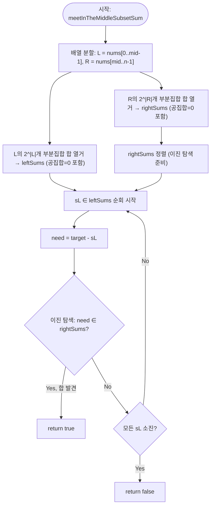

import { AlgorithmSimulation } from "#guide-sim";

# meetInTheMiddleSubsetSum 해설

## 성능 목표 예측

| 항목 | 값 |
|------|-----|
| 입력 크기 $n$ | $1 \leq n \leq 40$ |
| 원소 값 범위 | $-10^9 \leq \text{nums}[i] \leq 10^9$ |
| 목표 합 범위 | $-10^{18} \leq \text{target} \leq 10^{18}$ |

**naive 전수 탐색의 한계.** 부분집합의 수는 $2^n$개다. 각 부분집합의 합을 구하는 비용은 $O(n)$이므로 전체 $O(n \cdot 2^n)$. $n = 40$이면 $40 \times 2^{40} \approx 4.4 \times 10^{13}$ 연산으로 현실적으로 불가능하다.

**목표 복잡도와 근거.** 배열을 절반으로 나누면 각 절반의 부분집합 수가 $2^{n/2} \approx 2^{20} = 10^6$으로 줄어든다. 한 절반의 모든 합을 열거하는 데 $O(2^{n/2} \cdot n/2)$, 정렬 후 이진 탐색으로 판정에 $O(2^{n/2} \cdot \log 2^{n/2}) = O(2^{n/2} \cdot n/2)$. 전체 $O(2^{n/2} \cdot n)$. $n = 40$에서 $\approx 4 \times 10^7$으로 충분히 빠르다.

**공간 복잡도와 트레이드오프.** 두 절반의 부분집합 합 배열 각각 $O(2^{n/2})$. $n = 40$이면 각 $2^{20} \approx 10^6$개의 `number`(8바이트)로 약 8 MB — 허용 범위 안이다. 단, `target`과 부분집합 합은 $-10^{18}$에서 $10^{18}$ 사이로 JavaScript `number`의 정수 정밀도($2^{53} \approx 9 \times 10^{15}$)를 초과할 수 있음에 주의한다.

---

## 목표 함수

```ts
function meetInTheMiddleSubsetSum(nums: number[], target: number): boolean
```

### 파라미터 표

| 파라미터 | 의미 | 제약 |
|---------|------|------|
| `nums` | 부분집합 합을 구할 정수 배열 | 길이 $n$, $1 \leq n \leq 40$, $|\text{nums}[i]| \leq 10^9$ |
| `target` | 찾고자 하는 목표 합 | $-10^{18} \leq \text{target} \leq 10^{18}$ |

**반환값.** `nums`의 어떤 부분집합(공집합 포함)의 합이 `target`과 같으면 `true`, 그렇지 않으면 `false`.

### 엣지케이스

1. **`target = 0`** — 공집합(합 = 0)이 항상 존재하므로 `true`. mask = 0인 경우가 자동으로 처리된다.
2. **`n = 0` 또는 배열이 비어 있을 때** — 가능한 부분집합은 공집합뿐이다. `target == 0`이면 `true`, 아니면 `false`.
3. **원소가 모두 양수이고 `target < 0`** — 어떤 부분집합의 합도 음수가 될 수 없으므로 `false`. (early exit 최적화 가능)
4. **`target`이 $\pm 10^{18}$ 근방일 때** — 원소 최대 20개, 최대값 $10^9$이면 부분집합 합 최대 $20 \times 10^9 = 2 \times 10^{10}$. 이는 JavaScript `number`로 정확히 표현 가능하다. 단, `target` 자체가 $10^{18}$ 수준이면 `need = target - sL`이 $10^{18}$ 범위에서 나올 수 있어, `rightSums` 어떤 값도 이에 해당하지 않으면 `false`다. 이 케이스는 이진 탐색이 자동으로 처리하지만 `number` 정밀도 손실이 없는지 확인해야 한다.

---

## 핵심 아이디어

**핵심 아이디어**: "전체를 한 번에 탐색하는 대신 반으로 쪼개 따로 열거한 뒤, 두 절반의 합이 목표를 이루는 쌍을 이진 탐색으로 찾는다."

$n = 40$에서 전체 부분집합 $2^{40} \approx 10^{12}$개를 직접 열거하는 것은 불가능하다. 그러나 배열을 절반으로 나누면 각 절반의 부분집합은 $2^{20} \approx 10^6$개에 불과하다. 앞 절반의 모든 부분집합 합을 열거하고, 뒤 절반의 합들을 정렬해 두면, $s_L + s_R = \text{target}$을 만족하는 쌍을 이진 탐색으로 $O(\log 2^{n/2})$에 찾을 수 있다. 지수를 절반으로 줄이는 것만으로 수십 조 번 연산이 수백만 번으로 줄어든다.

**풀이 구조**
1. 배열을 앞 절반 $L$과 뒤 절반 $R$로 분할한다.
2. $L$의 모든 $2^{|L|}$개 부분집합 합을 열거해 `leftSums`에 저장한다.
3. $R$의 모든 $2^{|R|}$개 부분집합 합을 열거해 `rightSums`에 저장하고 정렬한다.
4. `leftSums`의 각 $s_L$에 대해 $\text{need} = \text{target} - s_L$이 `rightSums`에 있는지 이진 탐색으로 확인한다.

**조건**: $n \leq 40$ 정도의 크기여야 $2^{n/2}$ 열거가 현실적이다. $n$이 더 크면 DP나 다른 접근이 필요하다.

**대표 예시**: 부분집합 합 존재 판정 ($n = 40$)
40개의 정수 중 일부를 골라 합이 정확히 $T$가 되는 부분집합이 존재하는지 확인하는 문제. 전수 탐색 $O(2^{40}) \approx 10^{12}$은 불가능하지만, 반으로 나누면 $O(2^{20} \cdot 20) \approx 2 \times 10^7$로 해결 가능하다.

**언제 쓰나**
$n \leq 40$ 수준의 완전 탐색 문제에서 전수 탐색이 $2^n$으로 너무 느릴 때 사용한다. 두 그룹의 결과를 조합해야 하며, 조합 조건이 이진 탐색이나 해시셋으로 판별 가능한 형태여야 한다.

---

### 원형 아이디어와 naive 접근

"모든 부분집합을 열거해서 합이 `target`인 것을 찾자"는 가장 직접적인 생각이다. 비트마스크로 표현하면:

```
for mask in 0 .. 2^n - 1:
    s = 0
    for i in 0..n-1:
        if (mask >> i) & 1: s += nums[i]
    if s == target: return true
return false
```

**폭발 지점**: 부분집합 수가 $2^n$개다. $n = 30$에서 $\approx 10^9$, $n = 40$에서 $\approx 10^{12}$로 기하급수적으로 증가한다. 시간 제한 내 처리가 불가능하다.

### 어떤 관찰이 돌파구가 되는가

- **관찰 1.** 찾고자 하는 것은 두 수의 합 $s_L + s_R = \text{target}$이다. $s_L$은 앞 절반에서, $s_R$은 뒤 절반에서 각각 독립적으로 선택할 수 있다. 두 절반이 독립적이면 탐색 공간을 분리할 수 있다.
- **관찰 2.** $n/2 = 20$이면 한 절반의 부분집합 수는 $2^{20} \approx 10^6$에 불과하다. 이 절반을 전수 열거하는 것은 가능하다.
- **관찰 3.** $s_L + s_R = \text{target}$을 판정할 때, $s_R$들의 집합을 정렬해 두면 $\text{target} - s_L$이 존재하는지를 $O(\log 2^{n/2})$에 이진 탐색으로 확인할 수 있다. 이 조합이 지수 탐색을 $O(2^{n/2} \cdot n)$으로 끌어내린다.

### 관찰을 형식화: 상태/구조 정의

배열을 두 그룹으로 분할한다:

$$L = \text{nums}[0..\lfloor n/2 \rfloor - 1], \quad R = \text{nums}[\lfloor n/2 \rfloor..n-1]$$

각각의 모든 부분집합 합 집합:

$$S_L = \left\{ \sum_{i \in T} L[i] \;\middle|\; T \subseteq \{0, \ldots, |L|-1\} \right\}, \quad S_R = \left\{ \sum_{i \in T} R[i] \;\middle|\; T \subseteq \{0, \ldots, |R|-1\} \right\}$$

이 형태여야 하는 이유: 어떤 `nums`의 부분집합 $U$도 $U_L = U \cap L$과 $U_R = U \cap R$로 분리된다. 두 부분의 합이 각각 $S_L$과 $S_R$의 원소이므로, $s_L \in S_L$이고 $s_R \in S_R$이며 $s_L + s_R = \text{target}$인 경우를 찾는 문제로 정확히 환원된다. 이 환원에서 정보 손실이 없다.

### 점화식 또는 핵심 연산

판정 조건:

$$\exists\, s_L \in S_L,\; s_R \in S_R \;:\; s_L + s_R = \text{target}$$

이를 다음과 동치로 변환한다:

$$\exists\, s_L \in S_L \;:\; (\text{target} - s_L) \in S_R$$

각 $s_L$에 대해 $\text{need} = \text{target} - s_L$을 계산하고, $\text{need}$가 $S_R$에 속하는지를 $S_R$의 정렬 배열에서 이진 탐색으로 확인한다.

**이진 탐색의 복잡도 유도:**

- $|S_L| = 2^{|L|}$, $|S_R| = 2^{|R|}$. 각 최대 $2^{20}$.
- $S_R$ 정렬: $O(2^{n/2} \cdot n/2)$.
- 각 $s_L$에 대한 이진 탐색: $O(\log 2^{n/2}) = O(n/2)$.
- 전체: $O(2^{n/2} \cdot n/2)$.

### 정당성 — 왜 이것이 옳은가

**완전성.** 합이 `target`인 부분집합 $U$가 존재한다면, $U_L = U \cap L$의 합 $s_L \in S_L$이고 $U_R = U \cap R$의 합 $s_R = \text{target} - s_L \in S_R$이다. 따라서 이진 탐색에서 $\text{need} = \text{target} - s_L$이 발견되어 `true`를 반환한다.

**건전성.** 알고리즘이 `true`를 반환했다면, 어떤 $s_L \in S_L$과 $s_R \in S_R$이 존재해 $s_L + s_R = \text{target}$. $s_L$은 $L$의 부분집합 합, $s_R$은 $R$의 부분집합 합이므로 둘을 합친 부분집합이 `nums`의 부분집합이고 합은 `target`이다.

**까다로운 케이스.**

1. **공집합**: `mask = 0`은 합 0을 생성하며 $S_L$과 $S_R$ 모두에 포함된다. `target = 0`이면 $s_L = 0 \in S_L$에서 `need = 0 \in S_R`이 발견되어 자동으로 처리된다.
2. **`n`이 홀수**: $|L| = \lfloor n/2 \rfloor$, $|R| = \lceil n/2 \rceil$. $|R|$이 $|L|$보다 1 크지만, $2^{\lceil n/2 \rceil} \leq 2 \cdot 2^{n/2}$로 여전히 허용 범위다.
3. **중복 원소**: $S_L$이나 $S_R$에 동일한 합이 여러 번 나올 수 있다. 중복을 허용한 채로 처리하면 이진 탐색이 그 값을 찾을 수 있다. 해시셋을 사용하면 중복이 자동으로 제거되어 공간을 줄일 수 있다.

### 구현 디테일과 최적화

- **정렬 vs. 해시셋**: 정렬 + 이진 탐색은 worst-case $O(2^{n/2} \cdot n)$이 보장되며 추가 메모리가 적다. 해시셋은 평균 $O(1)$ 탐색이지만 해시 충돌 시 worst-case가 나빠진다. 경쟁 프로그래밍에서는 정렬 방식이 더 안전하다.
- **열거 순서**: mask를 0부터 $2^m - 1$까지 순회하면 순서대로 열거된다. Gray Code 순으로 순회하면 비트 변화가 1개씩이어서 합을 $O(1)$에 갱신할 수 있지만, 구현 복잡도가 높아진다.
- **`BigInt` 사용 여부**: `target`이 $10^{18}$ 수준이어도, `nums[i]`의 절댓값이 $10^9$이고 절반의 원소 수가 최대 20이면 부분집합 합의 절댓값은 최대 $2 \times 10^{10}$. `need = target - sL`이 $10^{18}$ 수준이 될 수 있으나, 이 값이 $S_R$에 없으면 false로 처리하면 된다. JavaScript `number`의 정밀도 한계($2^{53}$) 안에서 `target`과의 뺄셈이 정확한지 확인한다.
- **조기 종료**: 모든 원소가 양수이면 $s_L > \text{target}$인 경우 이후를 건너뛸 수 있다. 하지만 음수 원소가 있으면 이 최적화를 적용할 수 없다.

---

## 시뮬레이션

예시 `nums = [3, 5, 1, 2]`, `target = 8`에 대해 meet-in-the-middle을 실행한다. 배열을 `L = [3,5]`, `R = [1,2]`로 나눠 각 절반의 모든 부분집합 합을 열거하고, `rightSums`를 정렬한 뒤 각 `sL`마다 `need = target - sL`을 이진 탐색으로 찾는다. keyValue 패널은 열거된 합 집합과 현재 검사 중인 값을 보여준다.

실제 반환값은 `true`(부분집합 {5} + {1,2} = 8) 이며, 시뮬레이션 마지막 프레임과 일치한다.

> 대화형 시뮬레이션은 MDX 런타임에서 표시됩니다.

export const steps = [
  {
    title: "분할",
    detail: "nums를 L=[3,5], R=[1,2]로 나눈다. mid=2.",
    entries: [
      { label: "nums", value: "[3, 5, 1, 2]" },
      { label: "target", value: 8 },
      { label: "L / R", value: "[3,5] / [1,2]" },
    ],
  },
  {
    title: "leftSums 열거",
    detail: "L의 부분집합 합: {}=0, {3}=3, {5}=5, {3,5}=8.",
    entries: [
      { label: "leftSums", value: "[0, 3, 5, 8]" },
    ],
  },
  {
    title: "rightSums 열거 + 정렬",
    detail: "R의 부분집합 합: {}=0, {1}=1, {2}=2, {1,2}=3. 정렬하여 이진 탐색 준비.",
    entries: [
      { label: "rightSums (정렬)", value: "[0, 1, 2, 3]" },
    ],
  },
  {
    title: "sL = 0 검사",
    detail: "need = 8 - 0 = 8. rightSums에서 이진 탐색 → 없음.",
    entries: [
      { label: "sL", value: 0 },
      { label: "need", value: 8 },
      { label: "발견?", value: "아니오" },
    ],
  },
  {
    title: "sL = 3 검사",
    detail: "need = 8 - 3 = 5. rightSums에서 이진 탐색 → 없음.",
    entries: [
      { label: "sL", value: 3 },
      { label: "need", value: 5 },
      { label: "발견?", value: "아니오" },
    ],
  },
  {
    title: "sL = 5 검사 → 발견",
    detail: "need = 8 - 5 = 3. rightSums에 3 존재 → true. 부분집합 {5}+{1,2}=8.",
    entries: [
      { label: "sL", value: 5 },
      { label: "need", value: 3 },
      { label: "발견?", value: "예" },
    ],
  },
  {
    title: "완료: true",
    detail: "합이 target=8인 부분집합이 존재한다.",
    entries: [
      { label: "반환값", value: "true" },
    ],
  },
];

<AlgorithmSimulation view="keyValue" steps={steps} title="Meet in the Middle 부분집합 합" />

## 수도 코드와 Activity Diagram

### 의사코드

```
function meetInTheMiddleSubsetSum(nums, target):
    n   = |nums|
    mid = floor(n / 2)

    L = nums[0..mid-1]       // 앞 절반: 크기 mid
    R = nums[mid..n-1]       // 뒤 절반: 크기 n - mid

    // 좌측 모든 부분집합 합 열거
    leftSums = []             // 불변식: |leftSums| = 2^|L|, 공집합(합=0) 포함
    for mask in 0 .. 2^|L| - 1:
        s = 0
        for i in 0..|L|-1:
            if (mask >> i) & 1: s += L[i]
        leftSums.append(s)

    // 우측 모든 부분집합 합 열거 + 정렬
    rightSums = []            // 불변식: |rightSums| = 2^|R|, 공집합(합=0) 포함
    for mask in 0 .. 2^|R| - 1:
        s = 0
        for i in 0..|R|-1:
            if (mask >> i) & 1: s += R[i]
        rightSums.append(s)
    sort(rightSums)           // 이진 탐색 전제 조건

    // 판정: 각 sL에 대해 need = target - sL이 rightSums에 있는지
    for sL in leftSums:
        need = target - sL
        // 불변식: need가 rightSums에 있으면 target = sL + need 달성 가능
        if binarySearch(rightSums, need) found:
            return true

    return false              // 어떤 조합도 target을 만들지 못함
```

**핵심 불변식:** `leftSums`와 `rightSums` 열거 완료 시 각각 $2^{|L|}$, $2^{|R|}$개의 합을 포함하며, 공집합(mask=0, 합=0)이 반드시 포함된다. `rightSums` 정렬 후 이진 탐색은 존재 여부를 정확히 판별한다.

### Activity Diagram


