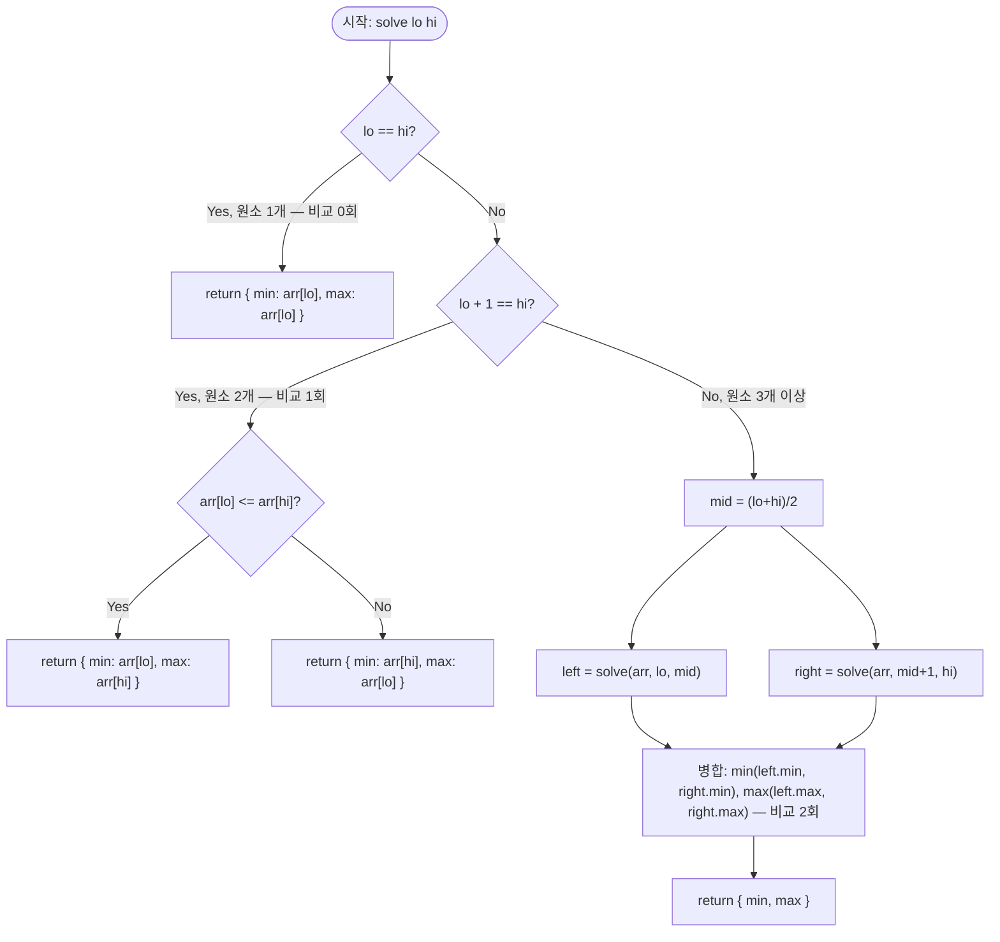

import { AlgorithmSimulation } from "#guide-sim";

# minMaxPair 해설

## 성능 목표 예측

| 항목 | 값 |
|------|-----|
| 입력 크기 $n$ | $1 \leq n \leq 10^5$ |
| 값 범위 | 정수, 비교 연산만 사용 |

**naive 선형 탐색의 한계.** 최솟값과 최댓값을 별도로 구하는 가장 단순한 방법:

```
min_val = arr[0]
for i in 1..n-1: if arr[i] < min_val: min_val = arr[i]
max_val = arr[0]
for i in 1..n-1: if arr[i] > max_val: max_val = arr[i]
```

비교 횟수: $(n-1) + (n-1) = 2n - 2$. 시간복잡도는 여전히 $O(n)$이라 "불가능한 속도"는 아니지만, 비교 횟수 기준으로 최적이 아니다. 최솟값과 최댓값 탐색을 각각 독립 스캔으로 처리하기 때문에 원소를 두 번씩 방문한다.

**목표 복잡도와 근거.** 시간복잡도는 $O(n)$으로 동일하지만, **비교 횟수를 $\lfloor 3n/2 \rfloor - 2$로 줄이는 것이 목표**다. 분할 정복으로 두 원소를 한 번의 비교로 "최솟값 후보군"과 "최댓값 후보군"에 동시에 배정할 수 있어, 두 스캔을 하나로 합쳐 약 25%의 비교를 줄인다. 비교 자체가 비싼 연산이거나 비교 횟수가 알고리즘 하한 기준인 경우에 이 최적화가 실질적 의미를 가진다.

**공간 복잡도.** 재귀 스택 $O(\log n)$. 구간 크기가 1 또는 2이면 즉시 반환하므로 깊이가 $\log n$을 넘지 않는다.

---

## 목표 함수

```ts
function minMaxPair(arr: number[]): { min: number; max: number }
```

### 파라미터 표

| 파라미터 | 의미 | 제약 |
|---------|------|------|
| `arr` | 최솟값과 최댓값을 구할 정수 배열 | 길이 $n$, $1 \leq n \leq 10^5$ |

**반환값.** `{ min, max }` — `min`은 배열 전체의 최솟값, `max`는 배열 전체의 최댓값.

### 엣지케이스

1. **`n = 1`** — 원소 하나뿐이므로 `{ min: arr[0], max: arr[0] }` 반환. 비교 횟수 0.
2. **`n = 2`** — 두 원소를 한 번 비교해 더 작은 것이 min, 더 큰 것이 max. 비교 횟수 1.
3. **모든 원소가 같을 때** — `min === max`로 같은 값을 가진 결과 반환. 알고리즘 흐름은 정상이다.
4. **배열이 내림차순 정렬된 경우** — `min = arr[n-1]`, `max = arr[0]`. 분할 정복이 이를 자연스럽게 발견한다.

---

## 핵심 아이디어

**핵심 아이디어**: "두 원소를 한 번 비교하면 min 후보와 max 후보를 동시에 가려낼 수 있다 — 분할 정복으로 비교 횟수를 $2n$에서 $\frac{3n}{2}$으로 줄인다."

최솟값과 최댓값을 따로 구하면 각각 $n-1$번씩 총 $2(n-1)$번 비교가 필요하다. 그러나 두 원소를 한 번 비교하면 "더 작은 쪽은 min 경쟁에만, 더 큰 쪽은 max 경쟁에만" 참여시킬 수 있다. 이 아이디어를 분할 정복으로 체계화하면 비교 횟수가 $\lfloor 3n/2 \rfloor - 2$로 줄어드는데, 이는 이론적 하한과 정확히 일치한다.

**풀이 구조**
1. 배열을 반으로 나눠 왼쪽과 오른쪽 각각의 `(min, max)` 쌍을 재귀적으로 구한다.
2. 기저 케이스: 원소가 1개면 비교 없이 `{min, max}` 반환, 2개면 1번 비교해 반환한다.
3. 병합: 좌측 min과 우측 min 중 더 작은 것, 좌측 max와 우측 max 중 더 큰 것을 각각 1번씩 비교해 총 2번 만에 전체 `(min, max)`를 확정한다.

**조건**: 배열 크기 $n \geq 1$이어야 하며, 원소 간 비교 연산이 정의되어 있으면 자료형에 무관하게 적용된다.

**대표 예시**: 하드웨어 제약 환경에서의 최솟값·최댓값 동시 탐색
비교 연산이 비싼 환경(예: 부동소수점 비교, 외부 API 호출)에서 $n$개의 값 중 최솟값과 최댓값을 동시에 구해야 할 때, 분할 정복을 사용하면 약 25%의 비교를 절약한다.

**언제 쓰나**
비교 횟수가 성능 기준이 되는 상황, 또는 최솟값과 최댓값을 동시에 구해야 할 때 사용한다. 단순한 시간복잡도($O(n)$)는 naive 방법과 같지만 비교 횟수의 상수 계수가 개선된다.

---

### 원형 아이디어와 naive 접근

"배열을 처음부터 끝까지 스캔하면서 현재까지의 min과 max를 갱신한다"는 방법이 가장 직관적이다. 이 접근의 폭발 지점은 비교 횟수가 $2(n-1)$이라는 것이다. 즉, 각 원소를 min용으로 한 번, max용으로 한 번 비교해 총 두 번 비교한다. 원소 수가 클수록 비교 횟수의 비효율이 누적된다.

### 어떤 관찰이 돌파구가 되는가

- **관찰 1.** 두 원소 $a$, $b$를 한 번 비교하면 "더 작은 것은 min 후보, 더 큰 것은 max 후보"임을 동시에 알 수 있다. 즉 1번의 비교로 두 가지 정보를 동시에 얻는다.
- **관찰 2.** 배열을 절반으로 나눠 각각의 `(min, max)` 쌍을 재귀적으로 구하면, 병합 단계에서 `min(minL, minR)`과 `max(maxL, maxR)` 비교 2회만으로 전체 답을 얻는다. 좌·우 각각의 최솟값/최댓값이 이미 보장되어 있으므로 다른 비교가 필요 없다.
- **관찰 3.** 점화식 $T(n) = 2T(n/2) + 2$를 풀면 $T(n) = \lfloor 3n/2 \rfloor - 2$가 나온다. 이는 비교 횟수의 이론적 하한과 일치한다(정보이론적으로 최솟값과 최댓값을 동시에 찾으려면 적어도 $\lceil 3n/2 \rceil - 2$번의 비교가 필요함이 증명되어 있다).

### 관찰을 형식화: 상태/구조 정의

재귀 함수 `solve(arr, lo, hi)`는 다음을 반환한다:

$$\text{solve}(arr, lo, hi) = \left( \min_{lo \leq i \leq hi} arr[i],\; \max_{lo \leq i \leq hi} arr[i] \right)$$

이 형태여야 하는 이유: 병합 단계에서 "두 (min, max) 쌍을 합쳐 전체 (min, max)를 얻는다"는 조합이 $O(1)$ 비교만으로 가능하기 때문이다. `(min, max)` 쌍을 한 단위로 전파함으로써, 좌·우 절반의 정보를 독립적으로 구축한 뒤 최소한의 비교로 합칠 수 있다.

**비교 횟수 점화식 유도:**

- 기저 $T(1) = 0$ (비교 없음), $T(2) = 1$ (한 번 비교).
- 재귀: $T(n) = 2T(n/2) + 2$.
- 마스터 정리 또는 전개로 해결:

$$T(n) = 2T(n/2) + 2 = 4T(n/4) + 2 + 2 = \cdots = n \cdot T(1) + 2(\log_2 n - 1 \text{회 병합})$$

보다 정밀하게: $T(n) = 3n/2 - 2$ (짝수 $n$ 기준). 홀수 $n$이면 $T(n) = \lceil 3n/2 \rceil - 2$.

### 점화식 또는 핵심 연산

**병합 단계의 핵심 연산** — 좌·우 결과 $(\text{minL}, \text{maxL})$, $(\text{minR}, \text{maxR})$이 주어졌을 때:

$$\text{result.min} = \min(\text{minL}, \text{minR}), \quad \text{result.max} = \max(\text{maxL}, \text{maxR})$$

이 두 비교가 병합의 전부다. 각 항의 의미:

- $\min(\text{minL}, \text{minR})$: 좌측 절반과 우측 절반의 각 최솟값 중 더 작은 것이 전체 최솟값. 좌·우 각각 내부에서 이미 최솟값이 확정되어 있으므로 다른 원소와 비교할 필요가 없다.
- $\max(\text{maxL}, \text{maxR})$: 마찬가지로 두 최댓값 중 더 큰 것이 전체 최댓값.

### 정당성 — 왜 이것이 옳은가

**귀납적 정당성.** 구간 크기 $k$에 대한 귀납법:

- 기저: $k = 1$이면 `arr[lo]`가 자명하게 최솟값이자 최댓값. $k = 2$이면 한 번의 비교로 두 원소 중 min, max가 결정된다.
- 귀납: 크기 $< k$인 구간에서 `solve`가 올바른 `(min, max)`를 반환한다고 가정한다. 크기 $k$인 구간에서 재귀 호출로 좌·우 각각의 올바른 `(minL, maxL)`, `(minR, maxR)`을 얻는다(귀납 가정). 병합 단계의 두 비교가 전체 min, max를 정확히 결정한다(관찰 2).

**비교 횟수가 최적인 이유.** 최솟값을 찾으려면 $n-1$번의 비교가 필요하다(각 원소가 적어도 한 번씩 "졌다"는 증거 필요). 최댓값도 마찬가지다. 두 정보를 완전히 독립으로 구하면 $2(n-1)$회지만, 한 비교의 결과가 두 문제에 동시에 기여하면 절감할 수 있다. 분할 정복에서 기저 $T(2) = 1$이 이를 실현한다.

**까다로운 케이스.** `n`이 홀수이면 분할 시 한 쪽이 한 원소 더 많다. 예를 들어 $n = 5$이면 왼쪽 $[0, 2]$, 오른쪽 $[3, 4]$. 각각 재귀로 처리되어 비교 횟수는 $T(3) + T(2) + 2$. 홀수 $n$에서도 $\lceil 3n/2 \rceil - 2$를 달성한다.

### 구현 디테일과 최적화

- **기저 케이스 2가지 명시**: `lo == hi` (원소 1개)와 `lo + 1 == hi` (원소 2개)를 별도로 처리해야 한다. 2개짜리 기저를 처리하지 않으면 `mid = lo`가 되어 재귀가 종료되지 않는다.
- **반복문 버전**: 재귀 대신 반복문으로 원소를 두 개씩 묶어 처리할 수 있다. `n`이 홀수이면 첫 원소를 초기 min, max로 사용하고 나머지를 쌍으로 처리한다. 이 방식도 동일한 비교 횟수를 달성하면서 재귀 오버헤드를 피할 수 있다.
- **빈 배열 처리**: $n \geq 1$ 제약이 있으므로 빈 배열은 고려하지 않아도 되지만, 방어적으로 처리하는 것이 좋다.

---

## 시뮬레이션

예시 배열 `arr = [3, 1, 4, 2]`(n=4)에 대해 분할 정복으로 최솟값과 최댓값을 동시에 구하는 과정이다. keyValue 패널은 각 재귀 구간이 반환한 `(min, max)` 쌍과 병합 결과를 보여준다. 병합은 비교 2회(min끼리, max끼리)만 사용한다.

실제 반환값은 `{ min: 1, max: 4 }` 이며, 시뮬레이션 마지막 프레임과 일치한다.

> 대화형 시뮬레이션은 MDX 런타임에서 표시됩니다.

export const steps = [
  {
    title: "분할",
    detail: "[3,1,4,2]를 왼쪽 [3,1], 오른쪽 [4,2]로 나눈다. mid=1.",
    entries: [
      { label: "arr", value: "[3, 1, 4, 2]" },
      { label: "왼쪽", value: "[3, 1]" },
      { label: "오른쪽", value: "[4, 2]" },
    ],
  },
  {
    title: "왼쪽 [3,1] 기저 (비교 1회)",
    detail: "원소 2개 → 3 <= 1 거짓이므로 min=1, max=3.",
    entries: [
      { label: "left.min", value: 1 },
      { label: "left.max", value: 3 },
    ],
  },
  {
    title: "오른쪽 [4,2] 기저 (비교 1회)",
    detail: "원소 2개 → 4 <= 2 거짓이므로 min=2, max=4.",
    entries: [
      { label: "right.min", value: 2 },
      { label: "right.max", value: 4 },
    ],
  },
  {
    title: "병합 min (비교 1회)",
    detail: "min(left.min=1, right.min=2) = 1.",
    entries: [
      { label: "min(1, 2)", value: 1 },
    ],
  },
  {
    title: "병합 max (비교 1회)",
    detail: "max(left.max=3, right.max=4) = 4.",
    entries: [
      { label: "max(3, 4)", value: 4 },
    ],
  },
  {
    title: "완료: { min: 1, max: 4 }",
    detail: "전체 비교 4회로 최솟값 1, 최댓값 4를 확정.",
    entries: [
      { label: "min", value: 1 },
      { label: "max", value: 4 },
    ],
  },
];

<AlgorithmSimulation view="keyValue" steps={steps} title="분할 정복 최소·최대 동시 탐색" />

## 수도 코드와 Activity Diagram

### 의사코드

```
function minMaxPair(arr):
    return solve(arr, 0, |arr| - 1)

function solve(arr, lo, hi):
    // 불변식 진입: lo <= hi

    // 기저 1: 원소 1개 — 비교 0회
    if lo == hi:
        return { min: arr[lo], max: arr[lo] }

    // 기저 2: 원소 2개 — 비교 1회
    if lo + 1 == hi:
        if arr[lo] <= arr[hi]:
            return { min: arr[lo], max: arr[hi] }
        else:
            return { min: arr[hi], max: arr[lo] }

    mid = (lo + hi) / 2
    left  = solve(arr, lo, mid)        // 귀납: arr[lo..mid]의 정확한 (min, max)
    right = solve(arr, mid+1, hi)      // 귀납: arr[mid+1..hi]의 정확한 (min, max)

    // 병합: 비교 2회
    // 불변식: 아래 결과는 arr[lo..hi] 전체의 정확한 min, max
    return {
        min: min(left.min, right.min),
        max: max(left.max, right.max)
    }
```

**핵심 불변식:** `solve(arr, lo, hi)`가 반환하는 `{ min, max }`는 `arr[lo..hi]` 구간의 정확한 최솟값과 최댓값이며, 사용된 비교 횟수는 $T(hi - lo + 1) = \lfloor 3(hi - lo + 1)/2 \rfloor - 2$를 넘지 않는다.

### Activity Diagram


