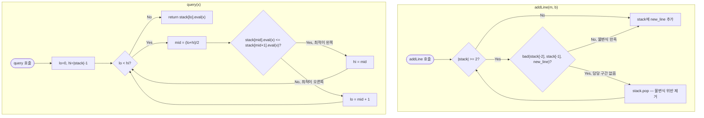

import { AlgorithmSimulation } from "#guide-sim";

# convexHullTrick — 직선 무리 중 최솟값을, 살아남는 직선만 골라 이진 탐색으로 찾는 이유

## 한눈에 보는 컨셉

직선을 하나씩 등록하고, 임의의 $x$에서 등록된 모든 직선 중 최솟값 $\min_i(m_i x + b_i)$을 빠르게 구하는 자료구조예요. 핵심 관찰은 "어떤 $x$에서도 절대 최솟값을 담당하지 못하는 직선은 미리 버려도 안전하다"는 것이고, 살아남는 직선들만 남기면 그 집합이 하한 볼록 껍질(lower convex hull)을 이루어 이진 탐색이 통합니다. 그 결과 등록은 `O(1)` 분할 상환, 조회는 `O(log n)`으로 끝나요.

## 출발점: 가장 순진한 방법부터

문제를 먼저 정확히 잡을게요.

```ts
class ConvexHullTrick {
  addLine(m: number, b: number): void;
  query(x: number): number;
}
```

| 파라미터 | 의미 | 제약 |
|---------|------|------|
| `m` | 직선 $y=mx+b$의 기울기 | $-10^9 \le m \le 10^9$, **`addLine` 호출 순서가 비감소(non-decreasing)** |
| `b` | 직선의 $y$절편 | $-10^{18} \le b \le 10^{18}$ |
| `x` | 조회 지점 | $-10^9 \le x \le 10^9$, 임의 순서 |

`addLine`은 반환값이 없고, `query(x)`는 그 시점까지 등록된 모든 직선 $\ell_i(x) = m_i x + b_i$ 중 $x$에서의 최솟값 $\min_i \ell_i(x)$를 돌려줍니다. `query`는 `addLine`이 최소 한 번 호출된 뒤에만 불려요.

문제 명세에 직선 개수의 상한이 못 박혀 있지는 않지만, 1초 시간 제한과 256MB 메모리 제한 아래에서 이런 "등록+조회" 자료구조 문제는 보통 등록 수 $n$과 조회 수 $q$가 각각 $10^5$ 수준까지 간다고 가정하는 편이 안전해요.

여러 후보 중 최솟값을 구하는 문제니, 가장 정직한 방법은 등록된 직선을 전부 순회하며 최솟값을 취하는 겁니다.

```ts
function queryNaive(lines: { m: number; b: number }[], x: number): number {
  let best = Infinity;
  for (const l of lines) best = Math.min(best, l.m * x + l.b); // 전부 평가
  return best;
}
```

```text
직선 n개 등록, 질의 q개
질의마다:  n개 직선을 전부 평가해서 min   →  질의당 O(n)
전체:      O(n) × q개 질의                →  O(nq)

n = q = 10^5 이면  nq = 10^10   →  1초 안에 절대 불가능
```

등록(`addLine`)은 배열에 밀어 넣기만 하면 되니 그 자체로는 빠릅니다. 병목은 항상 `query` 쪽이에요. 그런데 나열해서 살펴보면 낌새가 하나 보입니다 — 등록된 직선 중 상당수는 **어떤 $x$를 넣어도 절대 최솟값을 담당하지 못하는** 직선입니다. 이런 직선을 미리 걸러내고 남은 직선들만 좋은 순서로 정리해 둘 수 있다면, 매 질의가 그 정리된 목록만 보면 됩니다. **목표 복잡도**는 `addLine` `O(1)` 분할 상환, `query` `O(log n)`, 전체 `O(n + q log n)`이고, 뒤에서 이 값을 하나씩 증명해 나갈 거예요.

## 아이디어 자세히 들여다보기

### 직선이 담당하는 구간 — 수식과 그림

직선 $n$개가 있을 때, 특정 $x$에서 최솟값 $\min_i \ell_i(x)$을 내는 직선은 (동률이 아니라면) 딱 하나입니다. 그 직선이 "이기는" $x$의 범위를 그 직선의 **담당 구간**이라고 부를게요.

직선 세 개로 감을 잡아 봅시다: $\ell_0: y=-2x,\; \ell_1: y=-x+5,\; \ell_2: y=-1$.

```text
x       -10    -5     0      5     6      10
ℓ0(x)=  20     10     0     -10   -12    -20
ℓ1(x)=  15     10     5      0    -1      -5
ℓ2(x)=  -1     -1    -1     -1    -1      -1

x=-10에서 최소: ℓ2(-1)   x=0에서 최소: ℓ2(-1)   x=10에서 최소: ℓ0(-20)
```

표를 훑어보면 $\ell_1$은 어느 열에서도 최솟값을 내지 못해요. $\ell_1$의 담당 구간이 통째로 비어 있다는 뜻입니다. 반대로 $\ell_0$은 $x$가 커질수록, $\ell_2$는 $x$가 작을수록 담당 구간을 가져요.

기울기 오름차순으로 정렬된 인접한 두 직선 $\ell_k, \ell_{k+1}$의 교차점은 다음과 같이 정의됩니다.

$$x_k^{*} = \frac{b_{k+1}-b_k}{m_k - m_{k+1}}$$

이 정의가 하필 "인접한 두 직선의 교차점"이어야 하는 이유는, 기울기 순서대로 정렬해 두면 담당 구간의 경계가 정확히 이 교차점들에서만 바뀌기 때문이에요. 만약 정렬하지 않은 채 아무 두 직선의 교차점을 기준으로 삼으면 담당 구간이 어디서 바뀌는지 예측할 수 없습니다(기울기 순서가 곧 "누가 왼쪽/오른쪽을 담당하는지"의 순서와 일치해야 구간 경계가 단조롭게 정리돼요).

> 잠깐 확인해 볼까요? 위 표에서 $\ell_0$과 $\ell_2$의 교차점은 $x_{02}^{*} = \dfrac{-1-0}{-2-0} = 0.5$입니다. $x=0$(왼쪽)에서 $\ell_2$가 이기고 $x=10$(오른쪽)에서 $\ell_0$이 이긴다는 표의 결과와 맞아떨어지나요? 맞습니다 — $0 < 0.5$이니 $\ell_2$, $10 > 0.5$이니 $\ell_0$이 이깁니다.

### 단서를 설명해 주는 이론 — 분할상환분석(amortized analysis, aggregate method)

`addLine`이 "왜" `O(1)` 분할 상환인지는 각 호출을 따로따로 보면 설명이 안 됩니다. 어떤 한 번의 `addLine` 호출은 담당 구간을 잃은 직선을 한꺼번에 여러 개 팝(pop)할 수도 있기 때문이에요. 이럴 때 쓰는 게 **집계법(aggregate method)** 분할상환분석입니다: 개별 호출이 아니라 **전체 $n$번 호출의 총비용**을 먼저 구하고, 그걸 $n$으로 나눠 평균을 냅니다.

핵심 관찰: 직선 하나는 스택에 **최대 한 번만 push**되고, **최대 한 번만 pop**됩니다(한 번 pop되면 영원히 버려지고 다시 들어오지 않아요). 그러니 $n$번의 `addLine` 호출 동안 발생하는 push와 pop의 총 횟수는 각각 최대 $n$번, 합쳐서 최대 $2n$번입니다.

```text
addLine 5번 호출, 그중 4번째 호출에서 팝이 3번 연쇄로 일어난 경우

호출 1: push        (누적 push=1, pop=0)
호출 2: push        (누적 push=2, pop=0)
호출 3: push        (누적 push=3, pop=0)
호출 4: pop,pop,pop, push   (누적 push=4, pop=3)  ← 이 호출 하나만 보면 O(3)
호출 5: push         (누적 push=5, pop=3)

총 push+pop = 5+3 = 8 ≤ 2×5 = 10   →  5번 호출 평균 8/5 = O(1)
```

호출 4번째 하나만 떼어 보면 `O(3)`이라 "상수 시간"이라 부르기 애매해 보이지만, **전체 $n$번의 호출을 합산하면 총 작업량이 $O(n)$을 넘지 못하므로 평균(분할 상환)은 $O(1)$**입니다. 이 논증을 기억해 두세요 — 뒤에서 전체 복잡도 `O(n + q log n)`을 결론지을 때 다시 씁니다.

### 왜 모순 없이 작동하는가

스택이 지키는 불변식은 하나입니다.

> 스택은 기울기 오름차순으로 정렬돼 있고, 인접한 두 직선의 교차점 $x$좌표 수열 $x_1^{*} < x_2^{*} < \cdots$은 순증가한다.

**귀납적 정당화.**

- **기저**: 직선이 0개 또는 1개면 교차점 수열이 아예 없으므로 불변식은 공허하게(vacuously) 참입니다.
- **귀납 단계**: 불변식이 성립하는 스택에 새 직선 $\ell_{new}$를 추가한다고 합시다. `addLine`이 하는 일은 다음 세 경우 중 정확히 하나이고, 이 세 경우가 전부입니다(스택 길이가 2 미만인지, 2 이상이면 `bad()`가 참인지 거짓인지로 완전히 나뉘므로 빠지는 경우가 없어요).
  1. 스택 길이가 2 미만 — 교차점 비교 자체가 불가능하니 그냥 추가합니다. 새 불변식은 교차점이 0~1개뿐이라 자명하게 성립합니다.
  2. 스택 길이가 2 이상이고 `bad(stack[-2], stack[-1], new)`가 거짓 — 상단 직선의 담당 구간이 여전히 비어 있지 않다는 뜻이므로 그대로 추가합니다. 새로 생기는 교차점은 직전 마지막 교차점보다 오른쪽에 생기도록 `bad()`가 보장하므로(다음 문단에서 계산으로 확인) 순증가가 유지됩니다.
  3. `bad(...)`가 참 — 상단 직선의 담당 구간이 사라졌다는 뜻이므로 팝하고 같은 검사를 반복합니다. 팝한 직후의 스택은 팝하기 직전보다 원소가 하나 적은 상태에서 이미 불변식을 만족하던 스택이므로(귀납 가정 적용), 다시 경우 1~3 중 하나로 재귀적으로 떨어집니다.

세 경우 모두에서 불변식이 유지되므로, `addLine`을 몇 번 호출해도 스택은 항상 불변식을 만족합니다.

여기서 **헷갈리기 쉬운 포인트**가 둘 있습니다.

- **`bad()` 부등호 방향을 반대로 쓰기 쉽습니다.** `bad(l1, l2, l3)`은 "$\ell_1$과 $\ell_2$가 만나는 점 $x_{12}^{*}$에서, 새 직선 $\ell_3$이 이미 그 둘보다 같거나 작은지"를 묻는 검사예요. 방향을 반대로 쓰면 지워야 할 직선을 놔두고 엉뚱한 직선을 지우는 사고가 납니다. 실제로 확인해 보죠. $\ell_0=(-2,0), \ell_1=(-1,5), \ell_2=(0,-1), \ell_3=(2,0)$을 이 순서로 추가하면 정답은 `query(0) = -1`이어야 합니다(직선 $(0,-1)$이 $x=0$에서 최소). 그런데 부등호를 반대로 쓴 `bad()`로 같은 시퀀스를 넣으면, 원래 지워져야 할 $(-1,5)$는 살아남고 대신 진짜 필요한 $(0,-1)$이 지워져서 최종 스택이 `[(-2,0), (-1,5), (2,0)]`이 되고 `query(0)`이 `0`을 반환합니다 — 조용히 틀린 값이에요.
- **같은 기울기의 직선은 `bad()`만으로 안전하지 않습니다.** `bad()`의 교차점 계산은 기울기가 서로 다르다는 것을 전제로 해요. 새 직선의 기울기가 스택 맨 위와 같다면 교차점 자체가 정의되지 않으므로(두 직선이 평행), `bad()` 검사에 들어가기 전에 별도로 걸러야 합니다. 규칙은 간단해요 — 같은 기울기면 절편 $b$가 더 작은 쪽만 살아남습니다. `addLine(1,5)` → `addLine(1,2)` → `addLine(1,8)` 순서로 넣으면 스택에는 `(1,2)` 하나만 남고(`5`와 `8`은 모두 `2`보다 크므로 폐기), `query(0)`은 `2`, `query(100)`은 `102`가 됩니다.

엣지 케이스도 불변식 위에서 확인해 둘게요.

```text
직선 1개만 등록          → 교차점 없음, query는 그 직선 값을 그대로 반환
모든 직선이 평행(m 동일)  → 절편이 가장 작은 직선 하나만 스택에 남는다
쿼리 x가 ±10^9 극단값     → m*x+b가 최대 ~2×10^18까지 커질 수 있어
                            JS number(배정밀도, 정수 정확 표현 한계 2^53≈9×10^15)에서
                            정밀도 손실 가능성을 늘 염두에 둬야 한다
```

## 아이디어를 코드로 옮기기

담당 구간을 잃은 직선을 걸러내는 로직부터 코드로 옮겨 볼게요. 조회는 아직 최적화하지 않고 남아있는 직선을 선형으로 훑습니다.

```ts
type Line = { m: number; b: number };

function evalLine(l: Line, x: number): number {
  return l.m * x + l.b;
}

// l2(스택 맨 위)가 l1, l3 사이에서 담당 구간을 잃어 제거해도 되는지 판정한다.
// 전제: m1 <= m2 <= m3 (addLine이 기울기 비감소 순서로 호출된다)
function bad(l1: Line, l2: Line, l3: Line): boolean {
  return (l3.b - l1.b) * (l1.m - l2.m) >= (l2.b - l1.b) * (l1.m - l3.m);
}

class ConvexHullTrickBasic {
  private stack: Line[] = [];

  addLine(m: number, b: number): void {
    const newLine: Line = { m, b };
    // ① 같은 기울기 가드: 교차점이 정의되지 않으므로 bad() 이전에 먼저 처리
    while (this.stack.length > 0 && this.stack[this.stack.length - 1]!.m === m) {
      if (this.stack[this.stack.length - 1]!.b <= b) return; // 새 직선이 더 나쁘면 폐기
      this.stack.pop(); // 새 직선이 더 좋으면 기존 것을 대체
    }
    // ② 담당 구간을 잃는 직선들을 팝
    while (
      this.stack.length >= 2 &&
      bad(this.stack[this.stack.length - 2]!, this.stack[this.stack.length - 1]!, newLine)
    ) {
      this.stack.pop();
    }
    this.stack.push(newLine);
  }

  query(x: number): number {
    let best = Infinity;
    for (const l of this.stack) best = Math.min(best, evalLine(l, x)); // 선형 스캔
    return best;
  }
}
```

**가장 중요한 줄은 ①의 같은 기울기 가드가 ②의 `bad()` 루프보다 먼저 오는 순서입니다.** 순서를 바꿔서 `bad()`부터 검사하면, 기울기가 같은 두 직선 사이에서 `m1 - m2` 같은 항이 `0`이 되는 경우를 `bad()`가 암묵적으로 "구간이 딱 한 점"인 경우와 구분하지 못해 잘못된 판정을 낼 수 있습니다. 초기값은 빈 배열이고, `addLine`은 항상 스택 끝(가장 기울기가 큰 쪽)에서만 push/pop합니다 — 중간 삽입은 없습니다.

## 더 빠르게 만들 단서 찾기

지금 `query`는 스택에 남은 직선을 전부 훑습니다. 등록 단계에서 쓸모없는 직선을 걸러냈다고 해도, 최악의 경우 스택에는 여전히 $n$개가 남을 수 있어 `query` 하나가 `O(n)`이고 전체는 여전히 `O(nq)`에 가까울 수 있어요.

그런데 앞 절에서 이미 증명해 둔 사실이 하나 있습니다 — **스택의 교차점 $x_1^{*} < x_2^{*} < \cdots$은 순증가**한다는 것이요. 이는 곧 "$x$가 커질수록 최솟값을 담당하는 직선의 인덱스도 왼쪽에서 오른쪽으로만 이동한다"는 뜻입니다.

```text
스택:      ℓ0        ℓ1        ℓ2        ℓ3
교차점:        x1*       x2*       x3*
담당구간:  [-∞,x1*) [x1*,x2*) [x2*,x3*) [x3*,+∞)

x가 어느 구간에 속하는지만 찾으면 되고, 구간 경계가 정렬돼 있으니
"전부 훑기" 대신 "이분 탐색으로 경계 찾기"가 가능하다
```

즉 스택 전체를 정렬된 배열처럼 다룰 수 있고, 목표 인덱스를 찾는 문제는 정렬된 배열에서 조건을 만족하는 첫 위치를 찾는 표준 이진 탐색 문제로 그대로 환원됩니다.

## 단서를 최적화로 연결하기

이진 탐색 구간을 $[\text{lo}, \text{hi}]$로 잡고, 이 구간 안에 항상 정답 인덱스가 있다는 불변식을 유지합니다. 중간 지점 `mid`에서 $\ell_{mid}(x) \le \ell_{mid+1}(x)$이면 `mid`보다 오른쪽 직선은 전부 후보에서 제외해도 안전합니다(정답이 `mid`이거나 더 왼쪽).

```text
Before: lo=0, hi=size-1 (전체가 후보)
mid = (lo+hi)/2 에서 ℓ[mid](x) <= ℓ[mid+1](x) 라면

  ℓ[lo] ... ℓ[mid] | ℓ[mid+1] ... ℓ[hi]
  └─ 후보로 유지 ─┘   └─ 정답일 수 없음, 폐기 ─┘

After: hi = mid 로 좁힌다 (반대 경우는 lo = mid+1)
```

> 무료 기억법: **"왼쪽이 이기거나 비기면, 정답은 왼쪽에 있다."** `<=`를 써야 동률일 때도 왼쪽을 후보로 남깁니다.

## 최적화 코드

`addLine`은 그대로 두고, `query`만 선형 스캔에서 이진 탐색으로 바꿉니다.

```ts
class ConvexHullTrick {
  private stack: Line[] = [];

  addLine(m: number, b: number): void {
    const newLine: Line = { m, b };
    while (this.stack.length > 0 && this.stack[this.stack.length - 1]!.m === m) {
      if (this.stack[this.stack.length - 1]!.b <= b) return;
      this.stack.pop();
    }
    while (
      this.stack.length >= 2 &&
      bad(this.stack[this.stack.length - 2]!, this.stack[this.stack.length - 1]!, newLine)
    ) {
      this.stack.pop();
    }
    this.stack.push(newLine);
  }

  query(x: number): number {
    let lo = 0;
    let hi = this.stack.length - 1;
    while (lo < hi) {
      const mid = Math.floor((lo + hi) / 2);
      if (evalLine(this.stack[mid]!, x) <= evalLine(this.stack[mid + 1]!, x)) {
        hi = mid; // 정답이 왼쪽 절반에 있다
      } else {
        lo = mid + 1; // 정답이 오른쪽 절반에 있다
      }
    }
    return evalLine(this.stack[lo]!, x);
  }
}
```

**가장 중요한 줄은 `while (lo < hi)`의 종료 조건과 비교 방향입니다.** `<=`를 `<`로 바꾸면 동률(`ℓ[mid](x) === ℓ[mid+1](x)`)일 때 오른쪽으로 넘어가 버려, 정답 후보 하나를 근거 없이 배제하는 셈이 됩니다. 이 문제에서는 동률이어도 왼쪽 직선을 골라도 값은 같으니 최종 반환값 자체는 우연히 맞을 수 있지만, 불변식이 깨진 채로 탐색 구간이 좁혀지는 방식이라 다른 입력에서는 신뢰할 수 없습니다.

$n$개의 후보 중 정렬된 순서를 이용해 하나를 고르는 비교 기반 탐색은 결정 트리 논증에 의해 최악 $\Omega(\log n)$ 비교가 필요하므로, `query` 하나를 `O(\log n)`보다 더 줄이려면 비교 기반 탐색이 아닌 다른 구조가 필요합니다. 앞서 분할상환분석으로 확인한 `addLine`의 `O(1)` 분할 상환과 합치면, 전체는 직선 등록 $n$번과 질의 $q$번에 대해 $O(n + q \log n)$입니다 — 애초에 세운 목표 복잡도를 그대로 달성했습니다.

더 줄일 여지가 있을까요? 만약 질의 $x$가 **미리 정렬돼 들어온다는 보장**이 있다면, 이진 탐색 대신 인덱스 포인터를 한쪽으로만 이동시켜 `query`를 `O(1)` 분할 상환으로 줄이는 특화 기법이 존재합니다. 또 기울기가 비감소라는 전제 자체가 없다면(임의 순서로 직선이 들어온다면) Li Chao Tree 같은 다른 자료구조가 필요합니다. 그럼에도 이 스택 기반 풀이를 배우는 이유는 **기울기가 정렬돼 들어온다는 전제만 있으면 별도의 트리 없이 배열 하나로 `O(n + q log n)`을 달성**하는 단순함과 낮은 상수 계수예요.

## 실행 시각화

최솟값 CHT에 직선 네 개를 기울기 비감소 순서로 추가한 뒤 `query(0)`을 수행하는 과정입니다. 추가하는 직선은 `(-2,0), (-1,5), (0,-1), (2,0)`이고, `(-1,5)`는 담당 구간이 공집합이라 제거됩니다. matrix 패널의 각 행은 스택에 쌓인 직선 `[m, b]`이고(위에서 아래로 기울기 증가), 빨간 셀은 그 단계에서 추가·제거·평가되는 직선입니다. keyValue 패널은 현재 동작과 핵심 변수를 보여줍니다. 실제 반환값은 `query(0) = -1`(직선 `(0,-1)`이 `x=0`에서 최솟값)이며, 마지막 프레임의 평가 결과와 일치합니다.

> 대화형 시뮬레이션은 MDX 런타임에서 표시됩니다.

export const cols = ["m", "b"];

export const steps = [
  {
    title: "addLine(-2, 0)",
    detail: "스택이 비어 있으므로 그대로 추가. stack = [(-2,0)].",
    rowLabels: ["L0"], colLabels: cols,
    matrix: [[-2, 0]],
    cells: [[0, 0], [0, 1]],
    entries: [{ label: "동작", value: "push (-2,0)" }, { label: "size", value: 1 }],
  },
  {
    title: "addLine(-1, 5)",
    detail: "size < 2라 bad 검사 없이 추가. stack = [(-2,0), (-1,5)].",
    rowLabels: ["L0", "L1"], colLabels: cols,
    matrix: [[-2, 0], [-1, 5]],
    cells: [[1, 0], [1, 1]],
    entries: [{ label: "동작", value: "push (-1,5)" }, { label: "size", value: 2 }],
  },
  {
    title: "addLine(0, -1): bad 검사",
    detail: "bad((-2,0),(-1,5),(0,-1)) = true. (-1,5)의 담당 구간이 공집합이므로 pop.",
    rowLabels: ["L0", "L1"], colLabels: cols,
    matrix: [[-2, 0], [-1, 5]],
    cells: [[1, 0], [1, 1]],
    entries: [{ label: "bad 결과", value: "true → pop (-1,5)" }],
  },
  {
    title: "addLine(0, -1): push",
    detail: "(-1,5) 제거 후 size=1이라 추가. stack = [(-2,0), (0,-1)].",
    rowLabels: ["L0", "L1"], colLabels: cols,
    matrix: [[-2, 0], [0, -1]],
    cells: [[1, 0], [1, 1]],
    entries: [{ label: "동작", value: "push (0,-1)" }, { label: "size", value: 2 }],
  },
  {
    title: "addLine(2, 0): bad 검사",
    detail: "bad((-2,0),(0,-1),(2,0)) = false. (0,-1)은 담당 구간이 있으므로 유지하고 추가.",
    rowLabels: ["L0", "L1", "L2"], colLabels: cols,
    matrix: [[-2, 0], [0, -1], [2, 0]],
    cells: [[2, 0], [2, 1]],
    entries: [{ label: "bad 결과", value: "false → push" }, { label: "size", value: 3 }],
  },
  {
    title: "query(0): 이진 탐색",
    detail: "lo=0, hi=2. mid=1: L1(0)=-1 <= L2(0)=0 → hi=1. mid=0: L0(0)=0 > L1(0)=-1 → lo=1.",
    rowLabels: ["L0", "L1", "L2"], colLabels: cols,
    matrix: [[-2, 0], [0, -1], [2, 0]],
    cells: [[1, 0], [1, 1]],
    entries: [
      { label: "x", value: 0 },
      { label: "수렴 인덱스", value: 1 },
      { label: "선택 직선", value: "(0,-1)" },
    ],
  },
  {
    title: "완료: query(0) = -1",
    detail: "lo == hi == 1. 반환 L1.eval(0) = 0*0 + (-1) = -1. 최솟값 직선은 (0,-1).",
    rowLabels: ["L0", "L1", "L2"], colLabels: cols,
    matrix: [[-2, 0], [0, -1], [2, 0]],
    cells: [[1, 0], [1, 1]],
    entries: [{ label: "반환값", value: -1 }],
  },
];

<AlgorithmSimulation view={["matrix", "keyValue"]} steps={steps} title="CHT: 직선 추가 + query(0)" />

## 흐름 한눈에 보기



## 스스로 점검하기

1. `addLine(1, 0)`, `addLine(2, -5)` 순서로 등록한 뒤 `query(0)`, `query(5)`, `query(10)`을 손으로 계산해 보세요. (답: 각각 `-5`, `5`, `10`입니다. `x=5`에서는 두 직선이 정확히 같은 값 `5`를 내는 지점이라는 것도 확인해 보세요.)
2. `bad()`의 부등호 방향을 반대로 뒤집으면 `(-2,0), (-1,5), (0,-1), (2,0)`을 순서대로 추가한 뒤 `query(0)`이 어떤 값을 반환할지 예측하고, 왜 그런 값이 나오는지 스택 상태 변화로 추적해 보세요. (힌트: 본문 "왜 모순 없이 작동하는가"의 첫 번째 헷갈리기 쉬운 포인트를 참고하세요. 정답은 `0`이고, 원인은 지워야 할 `(-1,5)`가 남고 지우면 안 될 `(0,-1)`이 지워지기 때문입니다.)
3. 이 자료구조를 최솟값이 아니라 **최댓값** 조회용으로 바꾸려면 무엇을 바꿔야 할까요? (힌트: $\max_i \ell_i(x) = -\min_i(-m_i x - b_i)$이지만, 기울기 부호를 뒤집으면 `addLine` 호출 순서 요건도 반대로 뒤집힙니다 — 어떤 순서 요건이 새로 필요할지 생각해 보세요.)
