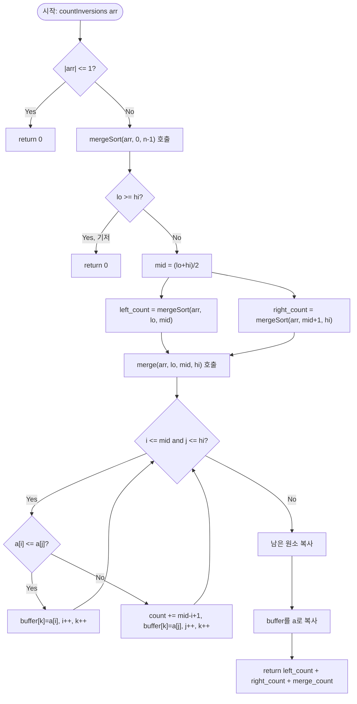

import { AlgorithmSimulation } from "#guide-sim";

# countInversions — 정렬이 끝나는 순간 역순쌍을 통째로 세는 이유

## 한눈에 보는 컨셉

배열이 오름차순에서 얼마나 벗어나 있는지를 세는 문제예요. 모든 쌍을 직접 비교하면 `O(n^2)`이지만, 배열을 반으로 쪼개 각각 정렬하면서 병합하는 순간에 "왼쪽에 아직 못 옮긴 원소가 몇 개인지"를 한 번에 더하면 `O(n log n)`에 끝납니다. 핵심은 **정렬이라는 부산물이 개별 비교 없이도 "오른쪽 원소보다 큰 왼쪽 원소가 몇 개인가"를 알려준다는 점**이에요.

## 출발점: 가장 순진한 방법부터

먼저 무엇을 반환해야 하는지 정확히 잡을게요.

```ts
function countInversions(arr: number[]): number
```

- `arr` — 길이 `n`인 정수 배열, $1 \leq n \leq 10^5$ (값 범위는 제약 없음, 비교 연산만 사용)
- 반환값 — $|\{(i, j) \mid 0 \leq i < j < n,\; arr[i] > arr[j]\}|$, 즉 인덱스 순서는 앞인데 값은 더 큰 쌍의 개수

문제를 그대로 읽으면 "$i < j$이면서 $arr[i] > arr[j]$인 쌍이 몇 개인가"를 묻고 있으니, 가장 정직한 출발은 그 쌍을 전부 나열해 세어 보는 겁니다.

```ts
function countInversionsNaive(arr: number[]): number {
  let count = 0;
  for (let i = 0; i < arr.length; i++) {
    for (let j = i + 1; j < arr.length; j++) {
      if (arr[i]! > arr[j]!) count++;
    }
  }
  return count;
}
```

왜 이게 느린가: 가능한 쌍의 개수 자체가 $\binom{n}{2}$개이고, 이중 루프는 그 쌍을 하나도 빠짐없이 훑습니다.

```text
n = 6  이면 쌍의 개수 = C(6,2) = 15
n = 10^5 이면 쌍의 개수 ≈ 5 × 10^9   → 1초 제한에서 시간 초과
```

여기서 낌새 하나가 보입니다. 이중 루프가 낭비하는 지점은 "이미 답이 정해진 비교를 반복해서 다시 하는 것"이에요. 만약 배열의 어떤 부분이 이미 정렬되어 있다면, 그 안에서는 더 큰 값이 항상 뒤에 옵니다 — 즉 정렬된 구간끼리는 서로 비교할 필요가 없다는 뜻이죠. **"정렬된 두 조각을 합칠 때는 개별 비교를 줄일 수 있지 않을까?"** 이것이 다음 절의 출발점입니다.

## 아이디어 자세히 들여다보기

### 쪼개서 세고 합치기 — 수식과 그림

배열을 반으로 나눠 왼쪽 $L$, 오른쪽 $R$을 각각 재귀적으로 처리한다고 생각해 봅시다. 그러면 전체 역순쌍은 세 그룹으로 완전히 나뉩니다.

$$\text{inv}(arr[lo..hi]) = \underbrace{\text{inv}(arr[lo..mid])}_{L \text{ 내부}} + \underbrace{\text{inv}(arr[mid+1..hi])}_{R \text{ 내부}} + \underbrace{\text{cross}(lo, mid, hi)}_{L\text{와 } R \text{ 사이}}$$

세 그룹이 겹치지 않는 이유는 간단해요 — $L$ 내부 쌍은 두 인덱스가 모두 $L$ 안에, $R$ 내부 쌍은 모두 $R$ 안에, 교차 쌍은 하나는 $L$ 하나는 $R$에 있으니 이 세 경우가 $i<j$인 모든 쌍을 정확히 한 번씩 덮습니다.

문제는 $\text{cross}$를 어떻게 개별 비교 없이 구하느냐예요. 여기서 **"L과 R이 이미 정렬되어 있다"**는 가정을 씁니다. 이미 정렬된 두 조각을 병합한다고 가정하고 손으로 따라가 볼게요.

$$L = [1, 2, 4], \qquad R = [3, 5]$$

```text
L = [1, 2, 4]      R = [3, 5]

i=0 j=0: L[0]=1 <= R[0]=3 → 1 출력, i=1
i=1 j=0: L[1]=2 <= R[0]=3 → 2 출력, i=2
i=2 j=0: L[2]=4 >  R[0]=3 → count += |L|-i = 3-2 = 1   (4보다 뒤에 남은 게 없지만
                                                          "4 자신"이 3보다 크므로 1개)
         3 출력, j=1
i=2 j=1: L[2]=4 <= R[1]=5 → 4 출력, i=3 (L 소진)
남은 R 복사: 5 출력

병합 결과: [1, 2, 3, 4, 5],  교차 역순쌍 = 1
```

$L[i] > R[j]$가 발생하는 순간 $L[i], L[i+1], \ldots, L[|L|-1]$은 전부 $R[j]$보다 큽니다 — $L$이 정렬되어 있으니 $L[i]$보다 뒤에 있는 원소는 전부 $L[i]$ 이상이기 때문이에요. 그래서 개별 비교 없이 **$|L| - i$개를 한 번에** 더할 수 있습니다.

$$\text{cross} \mathrel{+}= |L| - i \quad (L[i] > R[j] \text{인 매 순간})$$

잠깐, 확인 하나만 해 볼까요? 만약 $L = [1, 2, 4, 6]$이고 같은 순간 $L[2]=4 > R[0]=3$을 만난다면 $|L|-i = 4-2 = 2$를 더하게 됩니다. 이건 "$4$와 $6$ 둘 다 $3$보다 크다"는 뜻이고, 실제로 $(4,3)$과 $(6,3)$ 두 쌍 모두 역순쌍이니 맞습니다.

**왜 하필 "정렬하면서 세는" 형태여야 하는가.** cross만 따로 계산하려면 $L$과 $R$을 나눈 뒤 그 안에서 각각 정렬을 먼저 끝내야 합니다. 그런데 $L$과 $R$을 정렬하는 방법도 결국 "반으로 쪼개 정렬 + 병합"이라는 같은 구조를 재귀적으로 타므로, 정렬과 카운팅을 **같은 재귀 함수**에서 동시에 처리하는 편이 자연스럽습니다. 정렬 따로, 카운팅 따로 하면 정렬된 결과를 카운팅 단계에 다시 넘겨야 해서 구조가 이중이 되고 이득이 없어요.

### 왜 모순 없이 작동하는가

**귀납적 정당화.** `mergeSort(arr, lo, hi)`가 "`arr[lo..hi]`를 정렬하면서 그 안의 역순쌍 수를 정확히 반환한다"고 주장합니다.

- **기저**: $lo \geq hi$, 즉 원소가 0개나 1개면 역순쌍은 있을 수 없으니 `0`을 반환하고, 배열도 이미(자명하게) 정렬 상태입니다. 성립.
- **귀납 가정**: 길이가 $hi - lo$보다 짧은 모든 구간에서 `mergeSort`가 옳게 동작한다.
- **귀납 단계**: 길이 $hi - lo + 1$인 구간에서, 재귀 호출로 얻은 $L = arr[lo..mid]$와 $R = arr[mid+1..hi]$는 각각 귀납 가정에 의해 정렬되어 있고 내부 역순쌍도 정확합니다. 병합 단계에서 매 비교는 "$L[i] \leq R[j]$"와 "$L[i] > R[j]$" 딱 두 경우로 완전히 나뉘고(정수는 전순서이므로 다른 경우가 없습니다), 각 경우의 처리가 옳다는 것은 위 절에서 이미 확인했습니다. 따라서 세 그룹의 합인 전체 반환값도 옳습니다.

**여기서 헷갈리기 쉬운 포인트는 동률(같은 값)을 어느 쪽으로 흘려보내느냐입니다.** 병합 조건을 `L[i] <= R[j]`가 아니라 `L[i] < R[j]`로 잘못 쓰면, 값이 같을 때도 "L이 R보다 크다"는 else 분기로 빠지면서 `count += |L| - i`가 실행됩니다. 하지만 $arr[i] = arr[j]$는 역순쌍이 아니에요(`>` 조건, `=`는 제외). 실측으로 확인해 보면:

```text
arr = [2, 2, 2, 2]

올바른 조건(<=)으로 센 값: 0   (같은 값끼리는 역순쌍이 아니므로)
잘못된 조건(<)으로 센 값:  6   (모든 동률 쌍을 역순쌍으로 착각)
```

`<=`와 `<`처럼 부등호 하나 차이로 정답이 조용히 어긋나는 대표적인 지점입니다.

엣지 케이스도 이 불변식 위에서 점검해 둘게요.

```text
n = 0 또는 n = 1        → 비교할 쌍이 없음 → 0
이미 오름차순 정렬       → 모든 병합에서 L[i] <= R[j]만 발생 → 0
완전 내림차순 (n=5)      → 모든 쌍이 역순 → n(n-1)/2 = 10
중복 원소만 있는 배열     → L[i] <= R[j] 조건 덕분에 항상 0
```

## 아이디어를 코드로 옮기기

위 점화식을 그대로 옮긴 기본 구현입니다. 매 병합마다 `slice()`로 왼쪽·오른쪽 조각을 새 배열로 떠냅니다.

```ts
function countInversionsBasic(arr: number[]): number {
  const n = arr.length;
  if (n <= 1) return 0;
  const a = arr.slice();

  function merge(lo: number, mid: number, hi: number): number {
    const L = a.slice(lo, mid + 1);
    const R = a.slice(mid + 1, hi + 1);
    let i = 0;
    let j = 0;
    let k = lo;
    let count = 0;
    while (i < L.length && j < R.length) {
      if (L[i]! <= R[j]!) {
        a[k++] = L[i]!;
        i++;
      } else {
        count += L.length - i;
        a[k++] = R[j]!;
        j++;
      }
    }
    while (i < L.length) a[k++] = L[i++]!;
    while (j < R.length) a[k++] = R[j++]!;
    return count;
  }

  function mergeSort(lo: number, hi: number): number {
    if (lo >= hi) return 0;
    const mid = Math.floor((lo + hi) / 2);
    let count = mergeSort(lo, mid);
    count += mergeSort(mid + 1, hi);
    count += merge(lo, mid, hi);
    return count;
  }

  return mergeSort(0, n - 1);
}
```

결정 지점만 짚을게요.

- **기저 조건은 `lo >= hi`입니다.** 원소 0개(`lo > hi`는 이 문제에서는 발생하지 않지만 방어적으로)와 1개(`lo === hi`)를 한 조건으로 함께 잡습니다.
- **`mid`는 `Math.floor((lo + hi) / 2)`로, 왼쪽에 짝수 경계를 둡니다.** 어느 쪽에 남는 원소를 몰아줘도 정확성엔 영향이 없지만, 재귀가 항상 구간을 최소 1개씩은 줄이도록(`lo < hi`일 때 `lo <= mid < hi`) 보장해야 무한 재귀를 피합니다.
- **가장 실수가 잦은 줄은 `if (L[i]! <= R[j]!)`입니다.** 앞 절에서 본 것처럼 `<=`를 `<`로 바꾸면 동률을 역순쌍으로 잘못 셉니다.
- 남은 `L`을 복사하는 `while` 루프는 교차 역순쌍을 추가하지 않습니다 — 이미 `R`을 전부 병합했다는 뜻이고, 남은 `L`은 이미 지나간 `R`의 원소들보다 크다고 판정이 끝난 뒤이기 때문입니다.

## 더 빠르게 만들 단서 찾기

이 구현을 그대로 실행하면 맞는 답을 내지만, `merge` 호출 하나마다 `slice()`로 배열을 두 개씩 새로 할당합니다. 재귀 트리를 그려 보면 이 할당이 얼마나 반복되는지 보여요.

```text
n = 8 재귀 트리 (내부 노드 하나 = merge 호출 한 번):

                    [0..7]
             [0..3]        [4..7]
          [0..1] [2..3]  [4..5] [6..7]
         [0][1] [2][3]  [4][5] [6][7]

리프(원소 1개) 개수 = 8, 내부 노드(merge 호출) 개수 = 8 - 1 = 7
매 merge 호출마다 slice()로 배열 2개(L, R)를 새로 할당 → 총 14번의 배열 할당
```

$n$개의 리프를 가진 이 이진 트리는 내부 노드가 정확히 $n-1$개입니다(리프 하나가 늘 때마다 내부 노드도 정확히 하나씩 늘어나는 구조라서요). 즉 `merge` 호출 횟수 자체는 $n=10^5$에서도 약 $10^5$번이고 점근 복잡도에는 영향이 없지만, **매 호출마다 새 배열을 할당하고 버리는 비용**은 가비지 컬렉터에 실측 가능한 부담을 줍니다. 비교 횟수는 그대로인데 할당·해제라는 부가 작업만 쌓이는 셈이에요.

## 단서를 최적화로 연결하기

할당을 줄이는 방법은 단순합니다 — **매번 새 배열을 만드는 대신, 크기 $n$짜리 버퍼 하나를 처음에 한 번만 만들고 모든 병합이 그 버퍼를 공유해서 쓰는 것**입니다.

```text
Before: merge(lo, mid, hi)
        L = a.slice(lo, mid+1)   ← 호출마다 새 배열
        R = a.slice(mid+1, hi+1) ← 호출마다 새 배열

After:  merge(lo, mid, hi)
        a[lo..mid], a[mid+1..hi]를 인덱스로 직접 읽는다 (복사 없음)
        결과는 미리 만들어 둔 buffer[lo..hi]에 쓴 뒤 a[lo..hi]로 복사
```

이 재사용이 안전한 이유를 짚어 둘게요. 재귀는 깊이 우선으로 진행되므로, 어느 순간이든 "지금 실행 중인" `merge` 호출들은 서로 조상-자손 관계에 있는 것들뿐이고 형제 호출은 하나가 완전히 끝난 뒤에야 다음이 시작됩니다. 그래서 `buffer[lo..hi]`에 쓰는 시점에 다른 활성 호출이 같은 인덱스 구간을 동시에 건드릴 일이 없습니다. **"버퍼는 공유하되, 한 순간에 한 구간만 쓴다"**가 이 최적화가 지키는 약속(불변식)이에요.

## 최적화 코드

바뀌는 곳은 `merge` 함수 하나입니다. `slice()` 대신 인덱스로 직접 읽고, 미리 할당한 `buffer`에 쓴 뒤 `a`로 복사합니다.

```ts
function countInversions(arr: number[]): number {
  const n = arr.length;
  if (n <= 1) return 0;
  const a = arr.slice();
  const buffer = new Array<number>(n);

  function merge(lo: number, mid: number, hi: number): number {
    let i = lo;
    let j = mid + 1;
    let k = lo;
    let count = 0;
    while (i <= mid && j <= hi) {
      if (a[i]! <= a[j]!) {
        buffer[k++] = a[i++]!;
      } else {
        count += mid - i + 1; // L에서 아직 안 옮긴 개수 = |L| - i 와 동일한 값
        buffer[k++] = a[j++]!;
      }
    }
    while (i <= mid) buffer[k++] = a[i++]!;
    while (j <= hi) buffer[k++] = a[j++]!;
    for (let x = lo; x <= hi; x++) a[x] = buffer[x]!; // ← 가장 중요한 줄
    return count;
  }

  function mergeSort(lo: number, hi: number): number {
    if (lo >= hi) return 0;
    const mid = (lo + hi) >> 1;
    let count = mergeSort(lo, mid);
    count += mergeSort(mid + 1, hi);
    count += merge(lo, mid, hi);
    return count;
  }

  return mergeSort(0, n - 1);
}
```

**가장 중요한 줄은 `buffer`를 다시 `a`로 복사하는 마지막 `for` 루프입니다.** 이 줄을 빼먹으면 `a[lo..hi]`가 여전히 병합 전 상태로 남고, 다음 상위 레벨의 `merge`는 "L과 R이 정렬되어 있다"는 전제를 더 이상 만족하지 못한 채로 `count += mid - i + 1`을 실행하게 됩니다 — 정렬되지 않은 구간에서 `|L|-i`를 더하는 순간 교차 역순쌍 개수가 조용히 틀어집니다. `count += mid - i + 1`은 인덱스 버전의 `|L|-i`로, `mid`가 $L$의 마지막 인덱스이므로 `mid - i + 1`이 정확히 아직 옮기지 않은 $L$의 원소 개수입니다.

> 기억법: "세는 로직은 그대로, 복사만 한 배열로" — 알고리즘의 골격(어디서 세는지)은 바뀌지 않고, 할당 방식만 바뀌었다는 걸 잊지 마세요.

더 최적화할 여지가 있을까요? 점근 복잡도 관점에서는 여기가 끝입니다. 비교 기반 정렬은 $\Omega(n \log n)$ 하한을 가지며, 병합 정렬은 그 하한을 정확히 달성하는 정렬이자 이 카운팅을 부산물로 얹은 것이므로 더 줄일 여지가 없습니다. 참고로 값의 범위가 좁다면 좌표 압축 후 **Fenwick Tree(BIT)** 로 오른쪽에서 왼쪽으로 스캔하며 "지금까지 나온 값 중 나보다 작은 개수"를 누적하는 특화 해법도 존재하고, 이 역시 $O(n \log n)$입니다. 그럼에도 병합 정렬 변형을 배우는 이유는 **범용성**이에요 — 별도 자료구조 없이 표준 정렬 도구만으로 해결되고, "병합 시점에 부가 정보를 함께 집계한다"는 같은 틀을 인접 교환 횟수·역순 부분수열 등 다른 통계량에도 그대로 재사용할 수 있습니다.

## 실행 시각화

고정 입력 `arr = [3, 1, 2]`에 대해 위 최적화 알고리즘이 실제로 반환하는 값은 `2`(역순쌍 `(3,1)`과 `(3,2)`)입니다. array 패널은 현재 처리 중인 부분 배열 또는 병합 결과를 보여주고, 빨간 하이라이트(`highlight`)는 지금 비교 중인 원소, 회색(`marked`)은 이미 정렬이 확정된 구간이에요. 마지막 프레임의 누적 `count`가 실제 반환값과 일치하는지 눈으로 확인해 보세요.

> 대화형 시뮬레이션은 MDX 런타임에서 표시됩니다.

export const steps = [
  {
    title: "초기 배열, count = 0",
    detail: "[3,1,2]를 반으로 분할: 왼쪽 [3,1], 오른쪽 [2].",
    array: [3, 1, 2],
  },
  {
    title: "왼쪽 [3,1] 병합",
    detail: "L=[3], R=[1]. 3 > 1 이므로 |L|-i = 1 누적. count += 1 → 1. 정렬 결과 [1,3].",
    array: [3, 1],
    highlight: [0, 1],
  },
  {
    title: "왼쪽 정렬 완료",
    detail: "[3,1] → [1,3]. 내부 역순쌍 1개 확정. count = 1.",
    array: [1, 3],
    marked: [0, 1],
  },
  {
    title: "최종 병합: L=[1,3], R=[2]",
    detail: "i=0,j=0: L[0]=1 <= 2 → 1 출력, i=1. 교차 역순쌍 없음.",
    array: [1, 3, 2],
    highlight: [0, 2],
  },
  {
    title: "병합 계속: 3 vs 2",
    detail: "L[1]=3 > R[0]=2 → |L|-i = 2-1 = 1 누적. count += 1 → 2. 2 출력.",
    array: [1, 2, 3],
    highlight: [1, 2],
  },
  {
    title: "남은 L 복사",
    detail: "남은 3을 복사. 병합 완료, 배열 [1,2,3] 정렬됨.",
    array: [1, 2, 3],
    marked: [0, 1, 2],
  },
  {
    title: "완료: count = 2",
    detail: "왼쪽 내부 1 + 오른쪽 0 + 교차 1 = 2. 역순쌍 총 2개.",
    array: [1, 2, 3],
    marked: [0, 1, 2],
  },
];

<AlgorithmSimulation view="array" steps={steps} title="역순쌍 세기 (Merge Sort)" />

## 흐름 한눈에 보기



## 스스로 점검하기

1. `arr = [4, 1, 3, 2]`에 대해 병합 정렬 방식으로 역순쌍 개수를 손으로 따라가 보세요. (정답: 4. `[4,1]`을 병합할 때 1개, `[3,2]`를 병합할 때 1개, 마지막에 `[1,4]`와 `[2,3]`을 교차 병합할 때 `4`가 `2`, `3` 둘 다보다 커서 2개가 더해집니다.)
2. 병합 조건을 `L[i] <= R[j]` 대신 `L[i] < R[j]`로 바꾸면 `arr = [2, 2, 2, 2]`에서 정확히 어느 병합 단계부터 몇 개가 잘못 누적되는지 짚어 보세요. (정답 값만 먼저 보면: 올바른 결과는 `0`, 버그가 있는 조건으로는 `6`이 나옵니다.)
3. "인접한 두 원소만 교환할 수 있는 정렬에서, 정렬을 완성하기까지 필요한 최소 교환 횟수"를 구하고 싶다면 `countInversions`를 그대로 재사용할 수 있습니다. 그 이유를 한 문장으로 설명해 보세요. (힌트: 인접 교환 1회는 배열의 역순쌍 개수를 정확히 몇 개 줄이거나 늘릴까요?)
