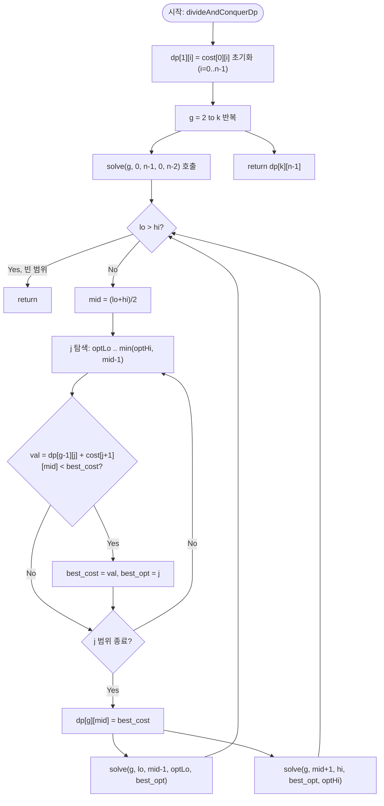

import { AlgorithmSimulation } from "#guide-sim";

# divideAndConquerDp — 최적 분할점이 줄지어 선다면, 탐색 범위를 반씩 접어도 되는 이유

## 한눈에 보는 컨셉

배열을 $k$개의 연속 구간으로 나눌 때 각 구간의 비용 합을 최소화하는 DP는, 그대로 구현하면 계층마다 분할점 후보를 전부 뒤지느라 `O(n^2)`이 듭니다. 그런데 비용 함수가 "사각 부등식(Quadrangle Inequality)"이라는 조건을 만족하면, 각 계층의 최적 분할점이 구간 끝 `i`가 커질수록 뒤로만 움직인다는 사실이 보장돼요. 이 단조성 하나로 탐색 범위를 매번 반씩 잘라낼 수 있어 계층당 비용이 `O(n log n)`, 전체가 `O(kn log n)`으로 줄어듭니다.

## 출발점: 가장 순진한 방법부터

문제를 먼저 정확히 잡을게요.

```ts
function divideAndConquerDp(cost: number[][], k: number): number
```

`cost`는 $n \times n$ 비용 행렬이고 `cost[i][j]`는 구간 $[i, j]$를 하나의 그룹으로 묶는 비용입니다($i \leq j$). `k`는 나눠야 할 연속 구간의 개수예요. 반환값은 $[0, n-1]$을 정확히 $k$개의 연속 구간으로 나눴을 때 비용 합의 최솟값입니다. 제약은 $1 \leq n \leq 500$, $0 \leq \text{cost}[i][j]$, $1 \leq k \leq n$이고, **비용 행렬이 사각 부등식을 만족한다**는 전제가 붙습니다(만족하지 않으면 이번 가이드의 최적화가 성립하지 않아요 — 뒤에서 바로 이 지점을 다룹니다).

DP 문제니까 상태부터 잡아봅시다. "$[0, i]$를 정확히 $g$개 구간으로 나눈 최소 비용"을 `dp[g][i]`라 하면, 마지막 구간의 시작을 어디서 끊을지 $j$를 전부 시도해 보는 게 가장 정직한 접근이에요.

$$dp[g][i] = \min_{g-2 \,\leq\, j \,<\, i} \bigl( dp[g-1][j] + \text{cost}[j+1][i] \bigr)$$

이걸 그대로 코드로 옮기면 이렇습니다.

```ts
function kPartitionNaive(cost: number[][], k: number): number {
  const n = cost.length;
  const INF = Number.MAX_SAFE_INTEGER / 2;
  const dp: number[][] = Array.from({ length: k + 1 }, () => new Array(n).fill(INF));
  for (let i = 0; i < n; i++) dp[1]![i] = cost[0]![i]!;
  for (let g = 2; g <= k; g++) {
    for (let i = g - 1; i < n; i++) {
      for (let j = g - 2; j < i; j++) {
        const val = dp[g - 1]![j]! + cost[j + 1]![i]!;
        if (val < dp[g]![i]!) dp[g]![i] = val;
      }
    }
  }
  return dp[k]![n - 1]!;
}
```

작은 예로 얼마나 도는지 직접 세어 봅시다. `n = 6, k = 3`이면 안쪽 `j` 루프가 도는 총 횟수는 다음과 같아요.

```text
g=2: i=1..5, j는 0..i-1  →  1+2+3+4+5 = 15회
g=3: i=2..5, j는 1..i-1  →  1+2+3+4   = 10회
합계: 25회의 (g, i, j) 조합을 전부 검사
```

이 숫자 자체는 작지만, `j` 루프의 길이가 `i`에 비례해서 늘어나는 구조라는 게 문제예요. 제약대로 `n = 500, k = 500`까지 커지면 계층마다 최대 `n`번씩 `j`를 훑는 만큼, 전체는 $k \times n \times n$ 규모 — $500 \times 500 \times 500 = 1.25 \times 10^8$까지 불어납니다. 1초 제한 안에서 아슬아슬하거나 넘칠 수 있는 크기예요.

`j` 루프를 매번 처음부터 끝까지 돌 필요가 정말 있을까요? 여기서 낌새 하나를 눈여겨봐야 합니다 — **`i`가 커질 때 최적의 `j`도 따라서 커지기만 한다면**, 탐색 범위를 매번 좁혀갈 수 있지 않을까요? 이 낌새가 이번 가이드의 출발점입니다.

## 아이디어 자세히 들여다보기

### 최적 분할점이 줄지어 선다 — 수식과 그림

$dp[g][i]$의 최솟값을 만드는 분할점 $j$를 $\text{opt}(g, i)$라고 이름 붙일게요.

$$\text{opt}(g, i) = \operatorname*{argmin}_{g-2 \,\leq\, j \,<\, i} \bigl( dp[g-1][j] + \text{cost}[j+1][i] \bigr)$$

**왜 하필 "구간의 끝 `i`"를 기준으로 상태를 잡을까요?** 시작점 기준으로 상태를 잡으면(`dp[g][시작점]`) 마지막 구간의 비용이 아직 정해지지 않은 "미래" 정보에 의존하게 돼서 재귀적으로 풀 수가 없어요. 끝점 기준으로 잡아야 `dp[g-1][j]`(과거, 이미 확정)와 `cost[j+1][i]`(현재 구간, 즉시 계산 가능)가 깔끔히 분리됩니다. 이 분리가 있어야 사각 부등식을 적용할 자리가 생겨요(뒤에서 바로 씁니다).

핵심 주장은 이겁니다: 비용 행렬이 사각 부등식을 만족하면, $\text{opt}(g, i)$는 $i$가 커질수록 뒤로 밀리기만 합니다.

$$i_1 < i_2 \;\;\Longrightarrow\;\; \text{opt}(g, i_1) \leq \text{opt}(g, i_2)$$

실제 숫자로 확인해 볼게요. $a = [1, 2, 3, 4, 5, 6, 7, 8]$의 구간 합 제곱을 비용으로 쓰면(즉 $\text{cost}[i][j] = (\sum_{t=i}^{j} a[t])^2$, 이 형태는 사각 부등식을 만족합니다), $g = 3$일 때 각 `i`(0..7)에 대한 $\text{opt}(3, i)$를 실제로 계산한 값은 다음과 같습니다.

```text
i        : 0  1  2  3  4  5  6  7
opt(3, i): 0  0  1  2  3  4  5  5      ← 감소하는 구간이 단 한 번도 없다
```

한 번도 거꾸로 내려가지 않고 계속 유지되거나 증가만 하죠? 잠깐 확인 하나만 해 볼까요 — 이 배열에서 `opt(3, 4) = 3`인데 `opt(3, 6)`이 `2`처럼 `opt(3, 4)`보다 작아질 수 있을까요? 단조성이 성립한다면 그럴 수 없고, 실제로도 `opt(3, 6) = 5`로 오히려 더 큽니다.

이 단조성이 있으면 탐색 범위를 이렇게 접을 수 있어요. 구간 `[lo, hi]` 안의 모든 `i`에 대한 최적점을 구해야 한다고 합시다. 가운데 `mid`의 최적점을 먼저 구하면(선형 탐색, 하지만 범위가 좁혀진 상태), 단조성 덕분에 왼쪽(`i < mid`)의 최적점은 `mid`의 최적점 이하로, 오른쪽(`i > mid`)의 최적점은 그 이상으로 확정됩니다. 즉 왼쪽·오른쪽 재귀가 봐야 할 `j` 범위가 각각 줄어들어요.

```text
solve(g=2, lo=0, hi=3, optLo=0, optHi=2)  →  mid=1의 최적점을 [0,0]에서 탐색 → opt(2,1)=0 확정
                    │
        ┌───────────┴───────────┐
        ▼                       ▼
solve(g=2,0,0,0,0)      solve(g=2,2,3,0,2)  →  mid=2의 최적점을 [0,1]에서 탐색 → opt(2,2)=1 확정
(빈 범위: 갱신 없음)                │
                        ┌───────────┴───────────┐
                        ▼                       ▼
                (빈 범위)          solve(g=2,3,3,1,2) → mid=3의 최적점을 [1,2]에서 탐색 → opt(2,3)=2 확정
```

이 트리(실제로 뒤에 나올 시뮬레이션의 대표 예시 그대로입니다)에서 각 레벨이 담당하는 `j` 탐색 범위의 합은 `n`을 넘지 않고, 레벨 수는 $O(\log n)$입니다. 그래서 한 계층 전체가 $O(n \log n)$에 끝나요.

### 단서를 설명해 주는 이론 — 사각 부등식(Quadrangle Inequality)

방금 쓴 단조성은 그냥 우연이 아니라, **사각 부등식**이라는 이미 이론화된 조건에서 나옵니다.

> **정의.** 비용 함수 $\text{cost}$가 사각 부등식(QI)을 만족한다는 것은, $a \leq b \leq c \leq d$인 모든 인덱스 쌍에 대해 다음이 성립함을 뜻합니다.
> $$\text{cost}[a][c] + \text{cost}[b][d] \;\leq\; \text{cost}[a][d] + \text{cost}[b][c]$$

그림으로 보면 이렇습니다.

```text
인덱스 순서:  a ──── b ──── c ──── d

"교차 결합"   cost[a][c] + cost[b][d]   (안쪽끼리, 바깥쪽끼리)
"겹침 결합"   cost[a][d] + cost[b][c]   (한쪽은 전체를, 한쪽은 안쪽만)

QI: 교차 결합이 겹침 결합보다 항상 싸거나 같다
    → 구간을 "덜 겹치게" 재배열할수록 비용 합이 커지거나 그대로다
```

QI는 divide-and-conquer DP 최적화(Knuth's optimization, SMAWK 알고리즘 등과 함께 "최적 결정 단조성" 계열로 묶이는 이론)의 핵심 전제입니다. 이 조건이 성립하는 비용 함수 계열에서는 항상 최적 분할점이 단조성을 가지며, 그 덕분에 분할 정복으로 탐색 범위를 줄이는 최적화가 정당화됩니다. `cost[i][j] = (\text{구간 합})^2`처럼 "구간이 넓어질수록 초선형으로 비싸지는" 비용 함수들이 전형적으로 QI를 만족해요 — 뒤 `### 왜 모순 없이 작동하는가`에서 이 부등식을 직접 사용해 단조성을 증명할 것이니 기억해 두세요.

보조 자료구조는 필요 없습니다. `dp` 배열과 재귀 호출 스택만으로 충분해요.

### 왜 모순 없이 작동하는가

**귀납적으로 정당화해 볼게요.**

- **기저($g=1$).** `dp[1][i] = cost[0][i]`. 그룹이 하나뿐이면 나눌 여지가 없으니, $[0, i]$ 전체를 하나로 묶는 것이 유일한 선택이고 자명하게 정확합니다.
- **귀납 단계($g-1 \to g$).** `dp[g-1][*]`이 완전히 옳다고 가정할게요. `dp[g][i]`를 구할 때 후보 `j`는 원래 $[g-2, i-1]$ 전체입니다(경우의 완전성: 이 범위 밖의 `j`는 그룹 수·인덱스 제약상 애초에 불가능하므로 후보에서 빠져도 됩니다). 분할 정복은 이 범위를 줄여서 보는데, **줄어든 범위 밖의 `j`가 최적일 수 없다는 것**을 보여야 완전성이 깨지지 않습니다.

이걸 보이는 게 바로 QI를 쓰는 대목이에요. $j_1 < j_2$가 각각 $i_1 < i_2$에서 후보라고 하고, $j_2$가 $i_1$에서도 $j_1$을 이겼다고(또는 비겼다고) 해봅시다.

$$dp[g-1][j_2] + \text{cost}[j_2+1][i_1] \;\leq\; dp[g-1][j_1] + \text{cost}[j_1+1][i_1]$$

이때 $i_2$에서도 $j_2$가 여전히 $j_1$을 이기는지 봐야 하는데, 양변에서 `dp[g-1]` 항을 지우면 남는 질문은 "$\text{cost}[j_1+1][i] - \text{cost}[j_2+1][i]$가 $i$에 대해 감소하지 않는가"입니다. $j_1 + 1 \leq j_2 + 1 \leq i_1 \leq i_2$ 순서에 QI를 그대로 적용하면

$$\text{cost}[j_1+1][i_1] + \text{cost}[j_2+1][i_2] \;\leq\; \text{cost}[j_1+1][i_2] + \text{cost}[j_2+1][i_1]$$

이고, 이를 정리하면 정확히 원하는 부등식 $\text{cost}[j_1+1][i_2] - \text{cost}[j_2+1][i_2] \geq \text{cost}[j_1+1][i_1] - \text{cost}[j_2+1][i_1]$이 나옵니다. 즉 $j_1$이 $j_2$보다 비싸지는 폭이 $i$가 커질수록 줄어들지 않아요. 그러니 $i_1$에서 이미 $j_2$가 이겼다면 $i_2$에서도 $j_2$가 집니다(이기는 쪽이 바뀌지 않아요). 이 논증을 뒤집으면 "$j_1$보다 작은 후보들은 $i_2$ 이상에서 다시는 최적이 되지 못한다"가 되고, 이것이 곧 왼쪽 재귀가 `optLo`를 `bestOpt`로 올려도 안전한 이유이자 오른쪽 재귀가 `optHi`를 그대로 열어 둬도 되는 이유입니다. 범위 밖으로 밀려난 후보는 정말로 다시 최적이 될 수 없으므로, 완전성도 최적성도 그대로 유지됩니다.

여기서 **헷갈리기 쉬운 포인트**는 탐색 범위의 상한을 `optHi` 그대로 쓰면 된다고 생각하는 것입니다. 실제로는 `j < i`(자기 자신보다 앞선 분할점만 유효)라는 제약이 있어서, `mid`를 볼 때 상한은 반드시 `min(optHi, mid - 1)`이어야 해요. 이걸 빠뜨리면 무슨 일이 생기는지 실제로 확인해 봅시다. $a = [1,2,3,4]$의 비용 행렬로 `solve(2, 0, 0, 0, 0)`을 계산할 차례(`mid = 0`)에서, 캡을 생략하고 `j`를 `[optLo, optHi] = [0, 0]`에서 그대로 찾으면 `j = 0`이 후보에 들어옵니다. 그런데 `j = 0`은 `mid = 0`과 같아서 `cost[j+1][mid] = cost[1][0]`을 참조하게 되고, 이건 애초에 정의되지 않은(하삼각) 칸이라 실제로는 `0`으로 읽힙니다.

```text
캡을 생략했을 때: dp[2][0] = dp[1][0] + cost[1][0] = 1 + 0 = 1   ✗ (실측값)
정상: solve(2,0,0,0,0)의 유효 j 범위는 [0, min(0,-1)] = [0,-1] → 공집합 → dp[2][0]은 갱신되지 않아야 함
      (인덱스 0 하나로는 2개 그룹을 만들 수 없으니 애초에 도달 불가능한 상태)
```

`dp[2][0] = 1`이라는 값 자체가 "불가능한 상태에 그럴듯한 값이 채워지는" 조용한 오류예요. 이번 예시에서는 `dp[2][0]`이 최종 답 계산에 쓰이지 않아 결과가 우연히 맞았지만, 계층이 하나 더 있어서(`k = 3`) 이 오염된 값이 다음 계층의 후보로 들어가면 최종 답까지 틀어질 수 있습니다.

엣지 케이스도 짚어 둘게요.

```text
k = 1        → 나눌 필요 없이 cost[0][n-1] 그대로 반환 (귀납 기저만 쓰고 끝)
k = n        → 각 원소가 그룹 하나씩. dp[g][i]는 항상 cost[i][i]만 더해 가는 형태로 수렴
n = 1, k = 1 → 기저 한 칸, cost[0][0] 반환
QI 불만족    → 단조성이 깨져 최적점을 놓칠 수 있다. 이 경우 이번 가이드의 최적화 대신
               '출발점'의 O(kn²) naive DP를 그대로 써야 한다
```

## 아이디어를 코드로 옮기기

```ts
function kPartitionDivideConquer(cost: number[][], k: number): number {
  const n = cost.length;
  const INF = Number.MAX_SAFE_INTEGER / 2;
  const dp: number[][] = Array.from({ length: k + 1 }, () => new Array(n).fill(INF));
  for (let i = 0; i < n; i++) dp[1]![i] = cost[0]![i]!;

  const solve = (g: number, lo: number, hi: number, optLo: number, optHi: number) => {
    if (lo > hi) return;
    const mid = (lo + hi) >> 1;
    let bestCost = INF;
    let bestOpt = optLo;
    const upper = Math.min(optHi, mid - 1);
    for (let j = optLo; j <= upper; j++) {
      const val = dp[g - 1]![j]! + cost[j + 1]![mid]!;
      if (val < bestCost) {
        bestCost = val;
        bestOpt = j;
      }
    }
    dp[g]![mid] = bestCost;
    solve(g, lo, mid - 1, optLo, bestOpt);
    solve(g, mid + 1, hi, bestOpt, optHi);
  };

  for (let g = 2; g <= k; g++) {
    solve(g, 0, n - 1, 0, n - 2);
  }
  return dp[k]![n - 1]!;
}
```

**가장 실수가 잦은 줄은 `const upper = Math.min(optHi, mid - 1);`입니다.** 바로 앞 절에서 본 오염 사례가 정확히 이 줄을 빼먹었을 때 벌어지는 일이에요. 그 외 결정 지점들도 짚어 둘게요.

- `dp[1][i] = cost[0][i]`로 기저를 채운 뒤에야 `g = 2`부터 `solve`를 호출합니다 — 계층 순서를 반드시 지켜야 `dp[g-1]`이 완전히 채워진 상태에서 `dp[g]`를 계산할 수 있어요.
- `solve(g, 0, n-1, 0, n-2)`의 초기 `optHi = n - 2`는 "마지막 분할점이 최대 `n-2`까지만 가능하다"(`j+1 \leq n-1`)는 경계를 반영한 값입니다.
- `if (lo > hi) return;`이 재귀의 유일한 종료 조건입니다. 이걸 빠뜨리면 무한 재귀예요.

## 더 빠르게 만들 단서 찾기

시간 복잡도는 `O(kn log n)`으로 잡았는데, 공간은 어떨까요? `dp` 배열이 `(k+1) × n` 크기라서 `O(kn)`을 그대로 씁니다. 그런데 실제로 각 계층이 참조하는 이전 데이터를 보면 낭비가 보여요.

```text
dp 테이블의 모양 (k+1) x n:

g=0  [ .  .  .  . ]
g=1  [ 1  9 36 100]   ← g=2를 계산하는 동안만 필요
g=2  [ .  5 18  52]   ← g=3을 계산하는 동안만 필요 (g=2 계산이 끝나면 g=1 행은 다시 안 읽힘)
g=3  [ .  .  .  . ]
  ⋮
g=k  [ .  .  .  . ]   ← 최종 답이 담길 단 한 칸

"어느 시점에서든 실제로 읽히는 행은 dp[g-1]과 지금 채우는 dp[g] 둘뿐이다"
```

`solve` 함수 안을 보면 `dp[g - 1][j]`만 읽고 `dp[g][mid]`만 씁니다. `dp[g-2]` 이하 행은 계층 `g`를 계산하는 동안 단 한 번도 참조되지 않아요 — 이전 계층 하나만 있으면 다음 계층을 완전히 계산할 수 있다는 뜻입니다(바로 앞 계층에만 의존하고 그 이전은 완전히 잊어도 되는 구조).

## 단서를 최적화로 연결하기

이 관찰을 그대로 옮기면, `(k+1) × n` 테이블 전체를 들고 있을 필요 없이 **행 두 개(이전 계층, 현재 계층)만 굴리면** 됩니다.

```text
Before (풀 테이블, O(kn) 공간)
dp[0..k][0..n-1] 전부를 메모리에 유지

After (롤링 배열, O(n) 공간)
prev = dp[g-1] 한 행
cur  = dp[g]   한 행
계층 g의 계산이 끝나면 prev ← cur 로 교체하고, 이전 prev는 버려진다
```

불변식은 하나예요: **`solve`를 호출하는 시점에 `prev`는 항상 `dp[g-1]`이어야 하고, `cur`는 이번 계층 `g`를 위해 매번 새로 만든 빈 배열이어야 한다.** `cur`를 새로 만들지 않고 `prev`를 그대로 재사용하면, 같은 계층 안에서 방금 쓴 값을 또 읽는 사고가 납니다 — 이 함정은 바로 다음 절에서 실측값으로 보여드릴게요.

## 최적화 코드

바뀌는 부분은 **2차원 `dp` 배열을 `prev`/`cur` 두 개의 1차원 배열로 바꾸는 것**뿐입니다.

```ts
function divideAndConquerDp(cost: number[][], k: number): number {
  const n = cost.length;
  const INF = Number.MAX_SAFE_INTEGER / 2;

  let prev = new Array<number>(n).fill(INF); // dp[g-1]
  for (let i = 0; i < n; i++) prev[i] = cost[0]![i]!; // g=1 기저

  for (let g = 2; g <= k; g++) {
    const cur = new Array<number>(n).fill(INF); // dp[g]

    const solve = (lo: number, hi: number, optLo: number, optHi: number) => {
      if (lo > hi) return;
      const mid = (lo + hi) >> 1;
      let bestCost = INF;
      let bestOpt = optLo;
      const upper = Math.min(optHi, mid - 1);
      for (let j = optLo; j <= upper; j++) {
        const val = prev[j]! + cost[j + 1]![mid]!;
        if (val < bestCost) {
          bestCost = val;
          bestOpt = j;
        }
      }
      cur[mid] = bestCost;
      solve(lo, mid - 1, optLo, bestOpt);
      solve(mid + 1, hi, bestOpt, optHi);
    };

    solve(0, n - 1, 0, n - 2);
    prev = cur; // 다음 계층을 위해 교체
  }

  return prev[n - 1]!;
}
```

**가장 중요한 줄은 `const cur = new Array<number>(n).fill(INF);`와 그 다음 계층 끝의 `prev = cur;`입니다.** `cur`를 계층마다 새로 만들지 않고 `const cur = prev;`처럼 같은 배열을 그대로 쓰면 어떻게 되는지 실제로 확인해 봤습니다. $a=[1,2,3,4,5,6]$, `k=4`인 경우 정상 구현은 `113`을 반환하는데(naive `O(kn^2)` 구현과도 일치), `cur`를 새로 만들지 않은 버전은 계산 도중 자기 자신이 방금 쓴 값을 다시 읽어 들여 INF에 가까운 값을 최종 반환값으로 뱉어냈습니다 — 계층 하나 안에서도 `cur[mid]`를 쓰는 시점과 다른 `mid'`을 계산하며 `prev[j]`를 읽는 시점이 뒤섞여, "아직 계산 안 된 이번 계층 값을 이전 계층 값인 것처럼" 읽어버리는 겁니다. 작은 예시($n=4,k=2$)에서도 정상은 `52`, 오염된 버전은 `30`으로 갈립니다.

> 기억법: **"이번 계층을 채우는 동안 지난 계층은 절대 바뀌지 않는다"** — `cur`는 계층마다 새 종이여야 합니다.

더 최적화할 여지가 있을까요? 시간 복잡도 `O(kn log n)`을 더 줄이려면 완전히 다른 접근이 필요합니다. QI가 만드는 "완전 단조 행렬(totally monotone matrix)" 구조에 SMAWK 알고리즘을 적용하면 로그 인자를 없앤 `O(kn)`까지 내려갈 수 있어요. 하지만 SMAWK는 구현이 훨씬 까다롭고 상수도 커서, 실무에서는 이번 가이드의 분할 정복 DP가 구현 난이도 대비 충분히 빠른 절충점으로 널리 쓰입니다. 공간은 이미 `O(n)`으로 최소화했고(더 줄이면 재구성에 필요한 정보를 잃습니다), 이 지점에서 최적화를 마칩니다.

## 실행 시각화

`n = 4`, `k = 2`, 비용 행렬 `cost[i][j] = (a[i..j] 구간 합)^2`(`a = [1, 2, 3, 4]`, QI를 만족)에 대해 분할 정복 DP를 실행한 과정입니다. 표는 `dp[g][i]`(행 `g` = 그룹 수, 열 `i` = 구간 끝)이고, `null`은 아직 계산되지 않은 칸, 빨간 셀은 그 단계에서 새로 확정된 칸이에요. keyValue 패널은 각 단계에서 확정한 최적 분할점 `opt(g, i)`를 보여줍니다(단조 증가를 눈으로 확인하는 용도). 실제 반환값은 `dp[2][3] = 52`이며(분할 `[0,2] | [3,3]`), 마지막 프레임의 우하단 칸과 일치합니다.

> 대화형 시뮬레이션은 MDX 런타임에서 표시됩니다.

export const colLabels = [0, 1, 2, 3];
export const rowLabels = ["g=1", "g=2"];

export const steps = [
  {
    title: "기저 계층 g=1",
    detail: "dp[1][i] = cost[0][i]: [0,i] 전체를 한 그룹으로. 값: 1, 9, 36, 100.",
    rowLabels, colLabels,
    matrix: [
      [1, 9, 36, 100],
      [null, null, null, null],
    ],
    cells: [[0, 0], [0, 1], [0, 2], [0, 3]],
    entries: [{ label: "처리 계층", value: "g=1 (기저)" }],
  },
  {
    title: "g=2, solve(2, 0, 3, 0, 2) → mid=1",
    detail: "mid=1 최적점을 [0, min(2,0)]=[0,0]에서 탐색. j=0: dp[1][0]+cost[1][1]=1+4=5. dp[2][1]=5, opt=0.",
    rowLabels, colLabels,
    matrix: [
      [1, 9, 36, 100],
      [null, 5, null, null],
    ],
    cells: [[1, 1]],
    entries: [
      { label: "mid", value: 1 },
      { label: "dp[2][1]", value: 5 },
      { label: "opt(2,1)", value: 0 },
    ],
  },
  {
    title: "왼쪽 재귀 solve(2, 0, 0, 0, 0) → mid=0",
    detail: "i=0은 그룹 2개가 불가능(분할점 없음)하여 갱신 없음. 좌측 구간 처리 종료.",
    rowLabels, colLabels,
    matrix: [
      [1, 9, 36, 100],
      [null, 5, null, null],
    ],
    entries: [
      { label: "범위", value: "[0, 0]" },
      { label: "결과", value: "갱신 없음" },
    ],
  },
  {
    title: "오른쪽 재귀 solve(2, 2, 3, 0, 2) → mid=2",
    detail: "mid=2 최적점을 [0, min(2,1)]=[0,1]에서 탐색. j=0: 1+25=26, j=1: 9+9=18. dp[2][2]=18, opt=1.",
    rowLabels, colLabels,
    matrix: [
      [1, 9, 36, 100],
      [null, 5, 18, null],
    ],
    cells: [[1, 2]],
    entries: [
      { label: "mid", value: 2 },
      { label: "dp[2][2]", value: 18 },
      { label: "opt(2,2)", value: 1 },
    ],
  },
  {
    title: "오른쪽-오른쪽 재귀 solve(2, 3, 3, 1, 2) → mid=3",
    detail: "mid=3 최적점을 [1, min(2,2)]=[1,2]에서 탐색. j=1: 9+49=58, j=2: 36+16=52. dp[2][3]=52, opt=2.",
    rowLabels, colLabels,
    matrix: [
      [1, 9, 36, 100],
      [null, 5, 18, 52],
    ],
    cells: [[1, 3]],
    entries: [
      { label: "mid", value: 3 },
      { label: "dp[2][3]", value: 52 },
      { label: "opt(2,3)", value: 2 },
    ],
  },
  {
    title: "완료: 반환 dp[2][3] = 52",
    detail: "opt(2,0..3) = 0, 1, 2가 단조 증가. 최소 분할 비용은 52 (분할 [0,2] | [3,3]).",
    rowLabels, colLabels,
    matrix: [
      [1, 9, 36, 100],
      [null, 5, 18, 52],
    ],
    cells: [[1, 3]],
    entries: [
      { label: "결과", value: 52 },
      { label: "opt 단조성", value: "0 <= 1 <= 2" },
    ],
  },
];

<AlgorithmSimulation view={["matrix", "keyValue"]} steps={steps} title="분할 정복 DP: n=4, k=2" />

## 흐름 한눈에 보기



## 스스로 점검하기

1. $a = [1, 1, 1]$의 비용 행렬(`cost[i][j] = (a[i..j] 구간 합)^2`)로 `k = 2`일 때 답을 손으로 구해 보세요. (힌트: `cost[0][0]=1, cost[1][2]=4`인 분할과 `cost[0][1]=4, cost[2][2]=1`인 분할을 비교하면, 둘 다 총 `5`로 같습니다.)
2. 본문에서 `min(optHi, mid-1)` 캡을 빼먹으면 `n=4, k=2` 예시에서 `dp[2][0]`이 `1`로 잘못 채워진다고 했습니다. `k`를 `3`으로 늘렸을 때 이 오염이 `dp[3][*]` 계산에 실제로 영향을 주려면 어떤 조건이 필요할지 — 즉 `dp[2][0]`이 어느 `solve` 호출의 후보 범위 안에 들어와야 하는지 — 추적해 보세요.
3. 만약 각 구간의 최소 길이가 `1`이 아니라 `2` 이상이어야 한다는 제약이 추가된다면, `solve` 호출의 `optLo`/`optHi` 계산과 `upper = Math.min(optHi, mid - 1)` 상한을 어떻게 고쳐야 할까요? (힌트: `j`와 `mid` 사이에 최소 두 칸이 남아야 하니, `mid - 1`이었던 자리가 어떻게 바뀔지 생각해 보세요.)
