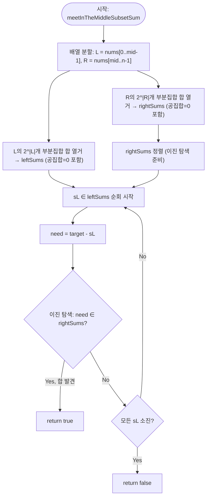

import { AlgorithmSimulation } from "#guide-sim";

# meetInTheMiddleSubsetSum — 지수를 반으로 접으면 이진 탐색이 통하는 이유

## 한눈에 보는 컨셉

정수 배열의 부분집합 중 합이 `target`인 것이 있는지 판정하는 문제예요. 전체를 한 번에 뒤지면 부분집합이 `2^n`개라 `n = 40`에서 이미 계산이 불가능하지만, 배열을 절반으로 쪼개면 각 절반의 부분집합은 `2^(n/2)`개뿐이라 전수 열거가 가능해져요. 왼쪽 절반의 합들과 오른쪽 절반의 합들 중 서로 더해 `target`을 만드는 짝을, 오른쪽을 정렬해 두고 이진 탐색으로 찾으면 전체가 `O(2^(n/2) · n)`에 끝납니다.

## 출발점: 가장 순진한 방법부터

문제를 먼저 정확히 잡을게요.

```ts
function meetInTheMiddleSubsetSum(nums: number[], target: number): boolean
```

`nums`의 부분집합(공집합 포함) 중 원소 합이 정확히 `target`과 같은 것이 하나라도 있으면 `true`, 없으면 `false`를 반환합니다.

| 항목 | 값 |
|------|-----|
| 배열 길이 `n` | $0 \leq n \leq 40$ |
| 원소 값 | $-10^9 \leq \text{nums}[i] \leq 10^9$ |
| 목표 합 | $-10^{18} \leq \text{target} \leq 10^{18}$ |

공집합도 부분집합으로 인정하므로, `target = 0`이면 항상 `true`예요(아무것도 고르지 않았을 때 합이 0이니까요).

가장 정직한 방법은 모든 부분집합을 직접 나열해 보는 겁니다. 부분집합은 원소마다 "고른다/안 고른다" 두 가지 선택의 조합이니, 비트마스크 `mask`의 각 비트를 원소 선택 여부로 대응시키면 `0`부터 `2^n - 1`까지 순회하는 것만으로 모든 부분집합을 빠짐없이 만들 수 있어요.

```ts
function subsetSumNaive(nums: number[], target: number): boolean {
  const n = nums.length;
  for (let mask = 0; mask < 1 << n; mask++) {
    let s = 0;
    for (let i = 0; i < n; i++) {
      if ((mask >> i) & 1) s += nums[i]!; // mask의 i번째 비트가 1이면 nums[i]를 포함
    }
    if (s === target) return true;
  }
  return false;
}
```

왜 이게 느린가: 부분집합 수 자체가 `2^n`개이고, 각 부분집합의 합을 구하는 데 `O(n)`이 걸리니 전체는 `O(n · 2^n)`이에요. 실측 규모로 체감해 볼게요.

```text
n   2^n (부분집합 수)     n·2^n (naive 연산 수)
10  1,024                10,240
20  1,048,576             20,971,520      (≈ 2×10^7)
30  1,073,741,824         32,212,254,720  (≈ 3×10^10)
40  1,099,511,627,776     43,980,465,111,040  (≈ 4.4×10^13)  ← 1초 안에 불가능
```

`n = 40`이면 대략 `4.4×10^13`번 연산이 필요해요. 1초에 처리 가능한 연산이 보통 `10^8` ~ `10^9` 수준이니 수만 배 초과입니다.

그런데 나열해 보면 낌새가 하나 보여요. 우리가 진짜로 원하는 건 "합이 `target`인 부분집합"이지, "부분집합을 한 번에 통째로 검사하는 것"이 아니에요. 배열을 앞뒤 절반으로 나눠서 **각 절반의 합을 따로 구한 뒤, 두 합을 더해 `target`을 만드는 조합만 찾으면 어떨까요?** 이것이 이번 알고리즘의 출발 단서입니다.

## 아이디어 자세히 들여다보기

### 두 조각의 합으로 쪼개기 — 수식과 그림

배열 `nums`(길이 `n`)를 앞 절반 `L`과 뒤 절반 `R`로 나눕니다.

$$L = \text{nums}[0 .. \lfloor n/2 \rfloor - 1], \qquad R = \text{nums}[\lfloor n/2 \rfloor .. n-1]$$

각 절반의 **모든 부분집합 합의 집합**을 정의합니다.

$$S_L = \left\{ \sum_{i \in T} L[i] \;\middle|\; T \subseteq \{0, \ldots, |L|-1\} \right\}, \qquad S_R = \left\{ \sum_{i \in T} R[i] \;\middle|\; T \subseteq \{0, \ldots, |R|-1\} \right\}$$

`nums`의 어떤 부분집합 `U`도 `L`에 속하는 부분과 `R`에 속하는 부분으로 정확히 갈라집니다 — 이 둘은 서로 겹치지 않고, 합치면 `U` 전체가 됩니다. 갈라진 두 부분의 합을 각각 $s_L, s_R$이라 하면 $s_L \in S_L$, $s_R \in S_R$이고 $\text{합}(U) = s_L + s_R$이에요. 그러니 원래 문제는 다음과 동치입니다.

$$\exists\, s_L \in S_L,\; s_R \in S_R \;:\; s_L + s_R = \text{target}$$

예시로 직접 채워 볼게요. `nums = [3, 5, 1, 2]`라면 `L = [3, 5]`, `R = [1, 2]`입니다.

```text
L = [3, 5]                      R = [1, 2]
mask=00 → {}    합 0            mask=00 → {}    합 0
mask=01 → {3}   합 3            mask=01 → {1}   합 1
mask=10 → {5}   합 5            mask=10 → {2}   합 2
mask=11 → {3,5} 합 8            mask=11 → {1,2} 합 3

S_L = {0, 3, 5, 8}               S_R = {0, 1, 2, 3}
```

잠깐, 확인 하나만 해 볼까요? `target = 8`이라면 `S_L`의 원소 `5`와 `S_R`의 원소 `3`을 더하면 `8`이 됩니다. 이건 `L`의 부분집합 `{5}`와 `R`의 부분집합 `{1,2}`를 합친 `{5,1,2}`가 `nums`의 부분집합이고 합이 `8`이라는 뜻이에요 — 실제로 `5+1+2=8`, 맞습니다.

**왜 하필 반으로 쪼개야 할까요?** `|L| = k`로 두면 `S_L`의 최대 크기는 `2^k`, `S_R`의 최대 크기는 `2^(n-k)`입니다. 둘 중 더 큰 쪽이 우리가 감당해야 할 열거 비용을 결정하는데, `2^k`와 `2^(n-k)`는 `k`가 `0`이나 `n`에 가까울수록 한쪽이 지수적으로 커지고, `k = n/2`일 때 둘 다 `2^(n/2)`로 가장 작게 균형 잡힙니다. 즉 `n/2` 분할은 "가장 큰 쪽을 최소화한다"는 명확한 이유가 있는 선택이에요 — 아무 지점에서나 잘라도 되는 게 아닙니다.

### 단서를 설명해 주는 이론 — 이진 탐색

`S_R`에 `need`라는 값이 있는지 확인하는 일을 얼마나 빠르게 할 수 있을까요? `S_R`을 정렬해 두면 이진 탐색을 쓸 수 있습니다. 이진 탐색이 지키는 불변식은 하나예요.

> 배열이 정렬되어 있다면, 중앙값과 목표를 비교하는 것만으로 목표가 있을 수 없는 절반을 통째로 버릴 수 있다.

```text
정렬된 배열: [-3, 0, 2, 5, 7, 9]     목표: 5
                     ↑ mid=2, 값=2
2 < 5 이므로 목표가 있다면 오른쪽 절반뿐 → 왼쪽 절반(-3,0,2) 통째로 버림

[5, 7, 9]           목표: 5
   ↑ mid=1, 값=7
7 > 5 이므로 왼쪽 절반뿐 → 오른쪽(9) 버림

[5]  ↑ mid=0, 값=5 → 일치, 발견
```

한 번 비교할 때마다 후보가 절반으로 줄어드니, 크기 `m`인 배열에서 최대 `log2(m)`번 비교하면 끝나요. `S_R`의 크기가 `2^(n/2)`라면 이진 탐색 한 번의 비용은 `O(log 2^(n/2)) = O(n/2)`입니다. **이 도구를 뒤의 "단서를 최적화로 연결하기" 절에서 다시 소환할 거예요** — `S_L`의 원소마다 `S_R` 전체를 훑는 대신 이 이진 탐색으로 바꾸는 것이 이번 최적화의 전부입니다.

### 왜 모순 없이 작동하는가

**enumerateSums가 정확히 모든 부분집합 합을 한 번씩 만든다는 것부터 증명해 볼게요.** 배열 크기 `m`에 대한 귀납법입니다.

- **기저 (`m = 0`)**: 부분집합은 공집합 하나뿐이고, 합은 `0`입니다. `mask`는 `0`부터 `2^0 - 1 = 0`까지, 즉 `mask = 0` 하나만 순회하므로 정확히 일치합니다.
- **귀납 단계**: 크기 `m`인 배열에서 `mask`가 `0..2^m-1`을 순회하며 모든 `2^m`개 부분집합 합을 정확히 한 번씩 만든다고 가정합니다. 크기 `m+1`인 배열(마지막 원소 `x`를 추가)에서 `mask`가 `0..2^(m+1)-1`을 순회할 때, `mask < 2^m`인 구간은 `x`를 제외한 이전과 동일한 `2^m`개 부분집합이고, `mask ≥ 2^m`인 구간은 `x`를 포함한 나머지 `2^m`개 부분집합입니다(비트 하나가 늘어난 자리가 정확히 `x`의 포함 여부를 결정). 두 구간이 서로 겹치지 않고 합쳐서 `2^(m+1)`개를 모두 덮으므로, 명제는 `m+1`에서도 성립합니다.

이로써 `leftSums`와 `rightSums`가 각각 `S_L`, `S_R`을 빠짐없이(완전성) 중복 없이(각 부분집합 정확히 한 번) 표현한다는 것이 보장됩니다. 여기에 앞 절의 동치 관계 $\exists s_L \in S_L, s_R \in S_R : s_L + s_R = \text{target}$를 결합하면, "`S_L`의 각 원소마다 `target - s_L`이 `S_R`에 있는지 확인"하는 절차가 **완전**(답이 존재하면 반드시 발견)하고 **건전**(발견했다면 실제로 답이 존재)하다는 것이 그대로 따라옵니다.

여기서 **헷갈리기 쉬운 포인트**가 둘 있습니다.

- **공집합(`mask = 0`)을 빠뜨리는 것**입니다. `mask`를 `1`부터 시작하면 "아무것도 고르지 않는" 경우가 `S_L`, `S_R`에서 사라져요. `nums = [5]`, `target = 0`을 생각해 보면, 정상적으로는 `L = []`, `R = [5]`이고 `S_L = {0}`, `S_R = {0, 5}`라서 `s_L = 0, s_R = 0`으로 즉시 발견됩니다. 그런데 `mask`를 `1`부터 시작하는 결함 버전은 `R`의 열거에서 공집합(`mask=0`, 합 `0`)을 빼먹어 `S_R = {5}`만 남고, `S_L`도 `L`이 비어 있어 원래는 `{0}`이어야 하는데 결함 로직을 그대로 적용하면 아예 빈 배열이 되어 `target = 0`인데도 `false`를 반환합니다 — 실제로 실행해 보면 정상 버전은 `true`, 결함 버전은 `false`입니다.
- **`S_L`과 `S_R`은 서로 완전히 독립적인 조합**이라는 것입니다. "`L`의 `mask`와 `R`의 `mask`가 같은 값이어야 짝이 맞는 거 아닐까?" 하고 오해하기 쉬운데, 전혀 아니에요. 앞의 예시 `nums = [3,5,1,2]`, `target=8`에서 답은 `L`의 부분집합 `{5}`(mask=10)와 `R`의 부분집합 `{1,2}`(mask=11)의 조합이었죠. `mask` 값 자체는 서로 아무 관계가 없고, 오직 **합의 값**끼리만 짝을 맞추면 됩니다.

엣지 케이스에서도 이 논증이 그대로 성립하는지 점검해 볼게요.

```text
빈 배열([])         → L=[], R=[]. 둘 다 부분집합은 공집합(합 0)뿐.
                       target=0  → true (S_L={0}, S_R={0} → 0+0=0)
                       target≠0 → false

n=1, mid=0          → L=[], R=[x]. S_L={0} 하나뿐이라 need=target 딱 하나만 검사.
                       S_R={0, x} → target이 0 또는 x일 때만 true.

n이 홀수 (n=5)       → mid=⌊5/2⌋=2. |L|=2, |R|=3.
                       |S_R|=2^3=8 ≤ 2·2^2=8  → 여전히 2^⌈n/2⌉ 규모 안에 있다.
```

## 아이디어를 코드로 옮기기

`S_L`, `S_R`을 열거하는 도우미와, 그 둘의 모든 조합을 확인하는 첫 구현입니다. 아직 이진 탐색은 쓰지 않고, 나올 수 있는 조합을 그대로 이중 루프로 다 확인해요.

```ts
function enumerateSums(arr: number[]): number[] {
  const m = arr.length;
  const sums: number[] = [];
  for (let mask = 0; mask < 1 << m; mask++) {
    let s = 0;
    for (let i = 0; i < m; i++) {
      if ((mask >> i) & 1) s += arr[i]!;
    }
    sums.push(s);
  }
  return sums;
}

function subsetSumSplitPairs(nums: number[], target: number): boolean {
  const n = nums.length;
  const mid = Math.floor(n / 2);
  const L = nums.slice(0, mid);
  const R = nums.slice(mid);

  const leftSums = enumerateSums(L);
  const rightSums = enumerateSums(R);

  for (const sL of leftSums) {
    for (const sR of rightSums) {
      if (sL + sR === target) return true; // 모든 (sL, sR) 조합을 직접 확인
    }
  }
  return false;
}
```

**가장 중요한 부분은 `mid`를 기준으로 배열을 나누는 줄과, 두 겹 `for`문으로 모든 조합을 확인하는 부분입니다.** `Math.floor(n / 2)`로 앞쪽을 `L`, 나머지를 `R`로 나누는데, 이 경계를 잘못 잡아 원소를 빠뜨리거나 중복 포함하면 `S_L`, `S_R`의 정의 자체가 깨집니다. 안쪽 `for`문은 `leftSums`의 원소 하나마다 `rightSums` 전체를 순회하며 `sL + sR === target`을 직접 확인하는데, 이 비교 조건이 바로 앞 절에서 세운 동치 관계 $s_L + s_R = \text{target}$ 그 자체예요.

## 더 빠르게 만들 단서 찾기

이 구현이 얼마나 빠른지 세어 볼게요. `leftSums`와 `rightSums`는 각각 최대 `2^(n/2)`개고, 안쪽 이중 루프는 그 둘의 모든 조합을 하나하나 비교합니다.

```text
leftSums (2^20개)  ×  rightSums (2^20개)  =  전수 격자 스캔

           rightSums[0]  rightSums[1]  ...  rightSums[2^20-1]
leftSums[0]     ?             ?        ...        ?
leftSums[1]     ?             ?        ...        ?
     ⋮                                             ⋮
leftSums[2^20-1] ?            ?        ...        ?

칸 수 = 2^20 × 2^20 = 2^40 ≈ 1.1×10^12
```

`n = 40`이면 `2^40 ≈ 1.1×10^12`번 비교가 필요해요. 원래 naive의 `4.4×10^13`보다는 40배 가까이 줄었지만(원소당 `O(n)` 합산 비용을 없앴을 뿐), 조합을 세는 비용 자체가 다시 지수로 부풀어 오른 거예요. **각 `sL`마다 `rightSums` 전체를 훑을 필요가 정말 있을까요?** 우리가 확인하려는 건 "`rightSums`에 `target - sL`이라는 특정 값이 존재하는가"뿐입니다 — 이건 정렬 + 이진 탐색이 정확히 잘하는 일이라는 걸 앞의 이론 절에서 이미 봤어요.

## 단서를 최적화로 연결하기

`rightSums`를 미리 한 번 정렬해 두면, `sL`마다 전체를 훑는 대신 이진 탐색으로 `need = target - sL`의 존재 여부만 확인하면 됩니다.

```text
Before (정렬 없이 순차 스캔):
  sL 고정 → rightSums[0], rightSums[1], ..., rightSums[2^20-1] 전부 비교  (최악 2^20번)

After (정렬 + 이진 탐색):
  rightSums 정렬 (딱 한 번) → [r_0 ≤ r_1 ≤ ... ≤ r_{2^20-1}]
  sL 고정 → mid 비교 → 절반 버림 → 절반 버림 → ...  (최대 log2(2^20) = 20번)
```

여기서 지켜야 할 불변식은 하나예요.

> 이진 탐색을 시작하기 전, `rightSums`는 반드시 오름차순으로 정렬되어 있어야 한다.

이 불변식이 깨지면 무슨 일이 생기는지는 바로 다음 절에서 실제 값으로 확인해 볼게요.

## 최적화 코드

`subsetSumSplitPairs`에서 바뀌는 곳은 안쪽 이중 루프를 **정렬 + 이진 탐색**으로 바꾸는 것뿐입니다.

```ts
function binarySearchExists(sortedArr: number[], value: number): boolean {
  let lo = 0;
  let hi = sortedArr.length - 1;
  while (lo <= hi) {
    const mid = (lo + hi) >> 1;
    const v = sortedArr[mid]!;
    if (v === value) return true;
    if (v < value) lo = mid + 1;
    else hi = mid - 1;
  }
  return false;
}

function meetInTheMiddleSubsetSum(nums: number[], target: number): boolean {
  const n = nums.length;
  const mid = Math.floor(n / 2);
  const L = nums.slice(0, mid);
  const R = nums.slice(mid);

  const leftSums = enumerateSums(L);
  const rightSums = enumerateSums(R);
  rightSums.sort((a, b) => a - b); // 이진 탐색의 전제 조건

  for (const sL of leftSums) {
    const need = target - sL;
    if (binarySearchExists(rightSums, need)) return true;
  }
  return false;
}
```

**가장 중요한 줄은 `rightSums.sort((a, b) => a - b);`입니다.** 이 줄을 빠뜨리면 이진 탐색이 "정렬되어 있다"는 전제를 믿고 절반씩 버리는데, 실제로는 정렬돼 있지 않으니 존재하는 값도 못 찾을 수 있어요 — 겉보기엔 코드가 잘 돌아가는 것처럼 보이지만 조용히 틀린 답을 냅니다.

실제 값으로 확인해 볼게요. `nums = [1, 2, 5, -3]`, `target = -3`이면 `L = [1, 2]`, `R = [5, -3]`이고, `R`을 `mask` 순서 그대로 열거하면 `rightSums = [0, 5, -3, 2]`(정렬 안 됨)입니다. 정답은 `{-3}` 하나만으로도 `true`인데(`leftSums`의 `sL=0`에 대해 `need = -3`), 정렬을 빼먹은 채 이 배열에 이진 탐색을 돌리면 `mid` 비교가 엉뚱한 절반을 버려 `-3`을 찾지 못하고 전체 결과가 `false`로 나옵니다. `rightSums`를 `[-3, 0, 2, 5]`로 정렬한 뒤에야 같은 이진 탐색이 `true`를 정확히 돌려줘요.

> 기억법: "정렬 없는 이진 탐색은 지도 없이 절반씩 찍는 것" — 절반을 버리는 규칙(왼쪽이 작다) 자체가 정렬을 전제로 해요.

이제 더 최적화할 여지가 있을까요? `leftSums`와 `rightSums`를 만드는 데 각각 `O(2^(n/2) · n/2)`, 정렬에 `O(2^(n/2) · n/2)`, `2^(n/2)`번의 이진 탐색에 각 `O(n/2)` — 합쳐서 전체 `O(2^(n/2) · n)`입니다. `n = 40`이면 `2^20 · 40 ≈ 4.2×10^7`로, 애초 목표였던 `10^8` 미만에 여유 있게 들어와요. 이 알고리즘 자체로 더 줄일 여지는 크지 않습니다 — `2^(n/2)`개의 부분집합 합을 열거하는 것 자체가 이 접근의 최소 비용이라, 그 아래로는 내려갈 수 없어요(정렬 대신 해시셋을 쓰면 이론상 평균 `O(2^(n/2))`까지 줄지만, 해시 충돌 시 최악 성능이 나빠질 수 있어 경쟁 프로그래밍에서는 정렬 방식이 더 안전하다고 여겨집니다). 참고로 이 **특정** 부분집합 합 문제에 한해서는 원소가 작은 범위의 정수라면 비트셋 DP로 `O(n · \text{target})` 같은 다른 특화 해법도 있지만, `target`이 `10^{18}` 규모까지 갈 수 있는 이 문제에서는 비트셋 크기 자체가 감당이 안 돼요. Meet in the middle의 가치는 **원소·목표값의 범위와 무관하게 `n`에만 의존하는 범용성**에 있습니다.

## 실행 시각화

예시 `nums = [3, 5, 1, 2]`, `target = 8`에 대해 meet-in-the-middle을 실행합니다. 배열을 `L = [3,5]`, `R = [1,2]`로 나눠 각 절반의 모든 부분집합 합을 열거하고, `rightSums`를 정렬한 뒤 각 `sL`마다 `need = target - sL`을 이진 탐색으로 찾습니다. keyValue 패널은 열거된 합 집합과 현재 검사 중인 값을 보여줍니다.

실제 반환값은 `true`(부분집합 `{5}` + `{1,2}` = `8`)이며, 시뮬레이션 마지막 프레임과 일치합니다.

> 대화형 시뮬레이션은 MDX 런타임에서 표시됩니다.

export const steps = [
  {
    title: "분할",
    detail: "nums를 L=[3,5], R=[1,2]로 나눈다. mid=2.",
    entries: [
      { label: "nums", value: "[3, 5, 1, 2]" },
      { label: "target", value: 8 },
      { label: "L / R", value: "[3,5] / [1,2]" },
    ],
  },
  {
    title: "leftSums 열거",
    detail: "L의 부분집합 합: {}=0, {3}=3, {5}=5, {3,5}=8.",
    entries: [
      { label: "leftSums", value: "[0, 3, 5, 8]" },
    ],
  },
  {
    title: "rightSums 열거 + 정렬",
    detail: "R의 부분집합 합: {}=0, {1}=1, {2}=2, {1,2}=3. 정렬하여 이진 탐색 준비.",
    entries: [
      { label: "rightSums (정렬)", value: "[0, 1, 2, 3]" },
    ],
  },
  {
    title: "sL = 0 검사",
    detail: "need = 8 - 0 = 8. rightSums에서 이진 탐색 → 없음.",
    entries: [
      { label: "sL", value: 0 },
      { label: "need", value: 8 },
      { label: "발견?", value: "아니오" },
    ],
  },
  {
    title: "sL = 3 검사",
    detail: "need = 8 - 3 = 5. rightSums에서 이진 탐색 → 없음.",
    entries: [
      { label: "sL", value: 3 },
      { label: "need", value: 5 },
      { label: "발견?", value: "아니오" },
    ],
  },
  {
    title: "sL = 5 검사 → 발견",
    detail: "need = 8 - 5 = 3. rightSums에 3 존재 → true. 부분집합 {5}+{1,2}=8.",
    entries: [
      { label: "sL", value: 5 },
      { label: "need", value: 3 },
      { label: "발견?", value: "예" },
    ],
  },
  {
    title: "완료: true",
    detail: "합이 target=8인 부분집합이 존재한다.",
    entries: [
      { label: "반환값", value: "true" },
    ],
  },
];

<AlgorithmSimulation view="keyValue" steps={steps} title="Meet in the Middle 부분집합 합" />

## 흐름 한눈에 보기



## 스스로 점검하기

1. `nums = [6, -2, 4, 1]`, `target = 3`일 때 `L = [6,-2]`, `R = [4,1]`로 나눠 `leftSums`, `rightSums`를 손으로 구하고, 어떤 `sL`, `sR` 조합이 `target`을 만드는지 찾아보세요. (힌트: `leftSums = [0, 6, -2, 4]`, `rightSums`를 정렬하면 `[0, 1, 4, 5]`입니다. `sL = -2`일 때 `need = 5`가 존재합니다 — 부분집합 `{-2, 4, 1}`의 합이 `3`인지 직접 검산해 보세요.)
2. `nums = [1, 2, 5, -3]`, `target = -3`에서 "최적화 코드" 절의 `rightSums.sort(...)` 줄을 빼먹으면 어떤 값이 왜 잘못되는지 추적해 보세요. `rightSums`를 `mask` 순서 그대로(`[0, 5, -3, 2]`) 두고 `sL = 0`, `need = -3`에 대해 이진 탐색의 `lo`, `hi`, `mid`가 어떻게 움직이는지 한 단계씩 적어 보면, 왜 `-3`이 배열 안에 있는데도 못 찾는지 보일 거예요.
3. 만약 같은 `nums`에 대해 서로 다른 `target`이 여러 개(`target_1, target_2, \ldots`) 주어진다면, 매번 `leftSums`와 `rightSums`를 처음부터 다시 만들어야 할까요, 아니면 재사용할 수 있는 부분이 있을까요? (힌트: `leftSums`, `rightSums`는 `nums`에만 의존하고 `target`과는 무관합니다.)
