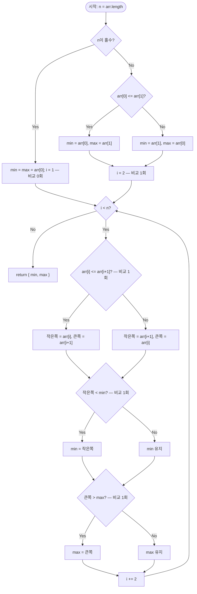

import { AlgorithmSimulation } from "#guide-sim";

# minMaxPair — 두 원소를 짝지어 비교하면 비교 횟수가 25% 줄어드는 이유

## 한눈에 보는 컨셉

배열에서 최솟값과 최댓값을 동시에 구하는 문제예요. 각각 따로 훑으면 원소마다 "min 후보인가"와 "max 후보인가"를 두 번씩 따로 심문하게 되는데, 두 원소를 짝지어 딱 한 번만 비교하면 그 결과로 min 후보와 max 후보를 동시에 가려낼 수 있습니다. 이 관찰을 분할 정복으로 체계화하면 시간복잡도는 여전히 `O(n)`이지만, 비교 횟수는 `2n`대에서 `3n/2`대로 — 이론적 하한까지 — 낮아집니다.

## 출발점: 가장 순진한 방법부터

문제를 먼저 정확히 잡을게요.

```ts
function minMaxPair(arr: number[]): { min: number; max: number }
```

`arr`은 길이 `n`($1 \leq n \leq 10^5$)인 정수 배열이고(음수 포함 가능, 빈 배열은 주어지지 않습니다), 반환값은 `{ min, max }` — 배열 전체의 최솟값과 최댓값입니다. 원소가 모두 같으면 `min === max`가 됩니다.

최솟값을 구하는 가장 정직한 방법은 무엇일까요? 처음 값을 기준 삼아 끝까지 훑으며 더 작은 값이 나올 때마다 교체하는 것 — 전형적인 "누적 갱신" 패턴입니다. 최댓값도 똑같은 패턴으로 구할 수 있으니, 둘을 각각 한 번씩 스캔하면 끝나는 것처럼 보입니다.

```ts
function minMaxPairNaive(arr: number[]): { min: number; max: number } {
  let minVal = arr[0]!;
  for (let i = 1; i < arr.length; i++) {
    if (arr[i]! < minVal) minVal = arr[i]!; // min 스캔
  }
  let maxVal = arr[0]!;
  for (let i = 1; i < arr.length; i++) {
    if (arr[i]! > maxVal) maxVal = arr[i]!; // max 스캔 — 배열을 통째로 다시 읽는다
  }
  return { min: minVal, max: maxVal };
}
```

작은 예로 비용을 직접 세어 봅시다.

```text
arr = [5, 3, 8, 1, 9, 2]   (n = 6)

min 스캔: 5 vs 3, 3 vs 8, 3 vs 1, 1 vs 9, 1 vs 2   → 5회 비교 (n-1)
max 스캔: 5 vs 3, 5 vs 8, 8 vs 1, 8 vs 9, 9 vs 2   → 5회 비교 (n-1)
총 비교 횟수 = 5 + 5 = 10 = 2n - 2

배열을 두 번 읽으면서, 원소 하나하나가 min 스캔에서 한 번,
max 스캔에서 또 한 번 — 총 두 번씩 "심문"당한다.
```

시간복잡도는 `O(n)`으로 "불가능한 속도"는 아니에요. 그런데 min 스캔의 "5 vs 3"과 max 스캔의 "5 vs 3"을 나란히 보면, 사실 같은 두 값을 놓고 벌어지는 **같은 비교**입니다. 이 비교 결과를 한 번만 계산해서 두 문제(min 후보 찾기, max 후보 찾기)에 동시에 재사용할 수 있다면 어떨까요? 이것이 다음 절의 출발점입니다.

## 아이디어 자세히 들여다보기

### 두 원소를 한 번에 심사하기 — 수식과 그림

두 원소 $a$, $b$를 한 번 비교하면 다음이 동시에 결정됩니다.

$$\text{winner} = \max(a, b) \;\text{는 max 후보},\qquad \text{loser} = \min(a, b) \;\text{는 min 후보}$$

이 "한 번의 비교로 두 정보"라는 원자적 단위를 배열 전체로 확장하는 방법이 분할 정복이에요. 재귀 함수 `solve(arr, lo, hi)`가 반환하는 값을 다음과 같이 정의합니다.

$$\text{solve}(arr, lo, hi) = \left( \min_{lo \leq i \leq hi} arr[i],\; \max_{lo \leq i \leq hi} arr[i] \right)$$

즉 `solve`는 "이 구간의 (min, max) 쌍"을 통째로 반환해요. 그림으로 보면 이렇습니다.

```text
arr = [3, 1, 4, 2]

              solve(0, 3)
             /            \
      solve(0,1)        solve(2,3)
      [3, 1]             [4, 2]
      (min=1,max=3)      (min=2,max=4)
             \            /
              merge: min(1,2)=1, max(3,4)=4
                     결과: (1, 4)
```

**왜 하필 (min, max) "쌍"으로 반환해야 할까요?** 만약 min과 max를 따로따로 재귀로 구한다면(최솟값 재귀 한 벌, 최댓값 재귀 한 벌) naive와 다를 게 없습니다 — 여전히 배열을 두 번 훑는 셈이니까요. `(min, max)`를 **한 단위**로 묶어 전파해야, 병합 단계에서 "좌측 쌍과 우측 쌍을 합쳐 전체 쌍을 얻는" 연산이 비교 **2번**(min끼리 1번, max끼리 1번)만으로 끝납니다.

확인 질문 하나 — `[3, 1, 4, 2]`를 반으로 나누면 어떤 두 그룹이 되고, 각 그룹의 `(min, max)`는 무엇일까요? 정답은 위 그림과 같습니다: `[3, 1]` → `(1, 3)`, `[4, 2]` → `(2, 4)`.

### 단서를 설명해 주는 이론 — 비교 기반 탐색의 정보이론적 하한

앞 절의 "한 번의 비교로 두 정보"라는 관찰을 일반 이론의 언어로 승격해 봅시다. 비교 연산만으로 최솟값과 최댓값을 **동시에** 찾을 때, 어떤 알고리즘도 피할 수 없는 최소 비교 횟수가 있다는 걸 보일 수 있어요.

각 원소는 지금까지의 비교 이력에 따라 네 가지 상태 중 하나에 있습니다.

```text
unknown      : 아직 한 번도 비교되지 않음               → 가중치 2
only-won     : 이겨만 봤음(진 적 없음) → max 후보 자격 유지  → 가중치 1
only-lost    : 져만 봤음(이긴 적 없음) → min 후보 자격 유지  → 가중치 1
both         : 이기고 진 적 모두 있음 → min도 max도 아님    → 가중치 0
```

알고리즘이 끝났을 때는 딱 한 원소만 `only-won`(그게 max)이고 딱 한 원소만 `only-lost`(그게 min)이며, 나머지는 전부 `both`여야 해요. 그래서 시작 시점의 총 가중치 $2n$에서 끝나는 시점의 총 가중치 $1 + 1 = 2$까지, **$2n - 2$만큼의 가중치를 깎아야** 알고리즘이 끝날 수 있습니다.

한 번의 비교가 깎을 수 있는 가중치는 최대 얼마일까요? 두 `unknown` 원소를 비교하면 승자는 `only-won`(가중치 $2 \to 1$), 패자는 `only-lost`(가중치 $2 \to 1$)가 되어 **가중치 4가 2로, 즉 2만큼** 줄어듭니다 — 이게 가장 효율적인 경우예요. 반면 이미 상태가 있는 원소끼리(또는 상태 있는 원소와 `unknown`을 나쁜 쪽으로) 비교하면 가중치는 많아야 1만 줄어듭니다.

`unknown`끼리 짝지을 수 있는 비교는 많아야 $\lfloor n/2 \rfloor$번(원소 $n$개를 두 개씩 묶는 횟수)이므로, 이 "효율 2" 비교로 깎을 수 있는 가중치는 최대 $2\lfloor n/2 \rfloor$입니다. 나머지 $(2n - 2) - 2\lfloor n/2 \rfloor$만큼은 한 번에 최대 1씩만 깎이는 비교로 메워야 해요. 정리하면 최소 비교 횟수는

$$\lfloor n/2 \rfloor + \big[(2n - 2) - 2\lfloor n/2 \rfloor\big] = 2n - 2 - \lfloor n/2 \rfloor$$

이고, $n$이 짝수면 $\frac{3n}{2} - 2$, 홀수면 $\frac{3(n-1)}{2}$ — 두 경우를 합쳐 $\left\lceil \frac{3n}{2} \right\rceil - 2$로 씁니다. 표로 검증해 볼게요. `arr = [3, 1, 4, 2]`에서:

| 단계 | 비교 | 가중치 변화 |
|------|------|------|
| 시작 | — | $\{3,1,4,2\}$ 모두 unknown, 합계 $2{\times}4=8$ |
| $3$ vs $1$ | 승자 3(only-won), 패자 1(only-lost) | $8 \to 6$ (−2) |
| $4$ vs $2$ | 승자 4(only-won), 패자 2(only-lost) | $6 \to 4$ (−2) |
| $1$ vs $2$ (min 병합) | 2가 이겨 both로, 1은 only-lost 유지 | $4 \to 3$ (−1) |
| $3$ vs $4$ (max 병합) | 4가 이겨 only-won 유지, 3은 both로 | $3 \to 2$ (−1) |

총 비교 4회, 가중치 $8 \to 2$. $n=4$에 대한 하한 $\lceil 12/2 \rceil - 2 = 4$와 정확히 일치합니다. 이 "unknown끼리 짝짓기가 가장 효율적"이라는 사실은 뒤에서 최적화를 고를 때 다시 소환할 테니 기억해 두세요.

### 왜 모순 없이 작동하는가

**귀납적 정당성.** 구간 크기 $k$에 대한 귀납법으로 `solve`의 정확성을 보입니다.

- **기저.** $k=1$이면 `arr[lo]`가 자명하게 최솟값이자 최댓값입니다. $k=2$면 한 번의 비교로 두 원소 중 작은 쪽이 min, 큰 쪽이 max로 확정됩니다.
- **귀납.** 크기 $< k$인 모든 구간에서 `solve`가 올바른 `(min, max)`를 반환한다고 가정합니다. 크기 $k \geq 3$인 구간은 `mid`를 기준으로 왼쪽 `[lo, mid]`와 오른쪽 `[mid+1, hi]`로 나뉘는데, 두 부분 구간 모두 크기가 $k$보다 작으므로(왼쪽은 최소 1, 오른쪽은 최소 1, 둘 다 원래 구간보다 진짜로 작습니다) 귀납 가정으로 좌·우 각각의 정확한 `(minL, maxL)`, `(minR, maxR)`을 얻습니다. 이때 이 두 구간이 `[lo, hi]`를 **빠짐없이 겹침 없이** 덮으므로(경우의 완전성), 전체 최솟값은 반드시 `minL` 또는 `minR` 중 하나이고 전체 최댓값도 반드시 `maxL` 또는 `maxR` 중 하나입니다(각 경우의 정확성) — 그래서 $\min(\text{minL}, \text{minR})$과 $\max(\text{maxL}, \text{maxR})$이라는 비교 2회로 전체 답이 확정됩니다.

여기서 **헷갈리기 쉬운 포인트**가 하나 있습니다. "분할 정복이니까 항상 정확히 이론적 하한 $\lceil 3n/2 \rceil - 2$에 도달하겠지"라고 생각하기 쉬운데, **균등하게 반으로 나누는 이 방식은 일부 $n$에서 하한보다 비교를 더 씁니다.** 예를 들어 `arr = [5, 3, 8, 1, 9, 2]`($n=6$)를 손으로 따라가 보면:

```text
solve(0,5): mid=2 → left=solve(0,2)=[5,3,8], right=solve(3,5)=[1,9,2]

solve(0,2): mid=1 → left=solve(0,1)=[5,3] (1회) → (3,5)
                     right=solve(2,2)=[8]  (0회) → (8,8)
                     병합(2회) → (3,8)         [소계 3회]

solve(3,5): mid=4 → left=solve(3,4)=[1,9] (1회) → (1,9)
                     right=solve(5,5)=[2]  (0회) → (2,2)
                     병합(2회) → (1,9)         [소계 3회]

최상위 병합(2회): min(3,1)=1, max(8,9)=9

총 비교 = 3 + 3 + 2 = 8회   (하한 ⌈3·6/2⌉-2 = 7회보다 1회 많다)
```

크기 3짜리 구간이 `2 + 1`로 쪼개지면서, 크기 1짜리 조각이 병합 비용(2회)을 "혼자" 떠안는 순간이 생기기 때문이에요. 결과값(`min=1, max=9`)은 여전히 정확하지만(정확성 자체는 귀납으로 보장), 비교 횟수는 균등 분할 전략이 만드는 트리 모양에 따라 하한보다 많아질 수 있습니다. 이 관찰은 뒤에서 최적화의 단서로 다시 쓰입니다.

엣지 케이스도 점검해 둡시다.

```text
n = 1            → lo == hi 기저, 비교 0회, { min: arr[0], max: arr[0] }
n = 2 (내림차순)  → lo+1 == hi 기저, arr[lo] <= arr[hi] 거짓 → min=arr[hi], max=arr[lo]
모든 원소 동일     → 모든 비교에서 "<="가 항상 참 → min과 max가 같은 값으로 수렴
내림차순 정렬됨    → min=arr[n-1], max=arr[0]. 분할 정복이 이를 자연스럽게 찾아낸다
```

## 아이디어를 코드로 옮기기

앞 절의 정의를 그대로 옮긴 기본 구현입니다.

```ts
function minMaxPairRecursive(arr: number[]): { min: number; max: number } {
  function solve(lo: number, hi: number): { min: number; max: number } {
    if (lo === hi) {
      return { min: arr[lo]!, max: arr[lo]! }; // 기저 1: 원소 1개
    }
    if (lo + 1 === hi) {
      return arr[lo]! <= arr[hi]! // 기저 2: 원소 2개 — 비교 1회
        ? { min: arr[lo]!, max: arr[hi]! }
        : { min: arr[hi]!, max: arr[lo]! };
    }
    const mid = Math.floor((lo + hi) / 2);
    const left = solve(lo, mid);
    const right = solve(mid + 1, hi);
    return {
      min: Math.min(left.min, right.min), // 병합 비교 1회
      max: Math.max(left.max, right.max), // 병합 비교 1회
    };
  }
  return solve(0, arr.length - 1);
}
```

**가장 중요한 줄은 두 개의 기저 케이스(`lo === hi`, `lo + 1 === hi`)입니다.** 크기 2짜리 기저를 빼고 크기 1짜리만 남겨 두면 어떻게 될까요? 재귀는 여전히 끝나지만(무한 루프가 아닙니다), 크기 2 구간도 일반 분기로 떨어져 `solve(lo,lo)`와 `solve(lo+1,lo+1)`로 쪼개진 뒤 병합 비교 2회를 씁니다 — 원래는 1회로 끝날 일이 2회로 늘어나는 거예요. 이게 트리 전체에 누적되면, 리프가 $n$개인 이진트리는 내부(병합) 노드가 정확히 $n-1$개이므로 **비교 횟수가 정확히 $2(n-1) = 2n-2$**가 됩니다 — 바로 naive와 완전히 같은 수치입니다. 분할 정복이라는 형태만 빌렸을 뿐, 크기 2 기저라는 지름길이 없으면 얻는 게 하나도 없다는 뜻이죠.

## 더 빠르게 만들 단서 찾기

이제 두 가지가 눈에 걸립니다.

```text
단서 1 (재귀 오버헤드)
  n = 10^5이면 재귀 깊이는 log2(10^5) ≈ 17. 스택 프레임 O(log n)개가 쌓였다 풀린다.
  함수 호출 자체의 비용(프레임 생성/해제)이 반복문보다 크다.

단서 2 (비교 횟수의 비최적성)
  균등 분할은 n=6에서 8회를 쓴다(하한 7회). n=10에서는 14회(하한 13회).
  n=24에서는 38회(하한 34회) — 격차가 점점 벌어진다.
  원인: 크기 3 이상인 구간이 "2+1"처럼 불균등하게 더 쪼개질 때마다
  병합 비교 2회를 아주 작은 조각(원소 1개)이 떠안는 낭비가 생긴다.
```

3.2절에서 본 이론을 다시 불러오면 실마리가 보입니다 — **가장 효율적인 비교는 "아직 한 번도 비교되지 않은 두 원소"를 짝짓는 것**이었죠. 재귀 트리의 병합 단계는 "이미 한 번씩 비교를 거친 대표값(minL, minR 등)"끼리 비교하는 것이라 효율이 1(가중치 -1)에 그칩니다. 그렇다면 애초에 **트리를 만들지 않고, 배열을 앞에서부터 두 개씩 직접 짝지어 나가면** 어떨까요? 모든 비교가 "unknown끼리의 첫 만남"이 되도록 만드는 겁니다.

## 단서를 최적화로 연결하기

재귀 대신 반복문으로, 원소를 앞에서부터 두 개씩 묶어 처리합니다. 불변식은 다음과 같습니다.

> 루프의 매 반복이 끝날 때, `min`과 `max`는 **지금까지 처리한 모든 원소**의 최솟값·최댓값과 정확히 같다.

```text
Before: arr = [7, 2, 9, 4, 1, 6], 아직 아무것도 처리 안 함

n=6은 짝수 → 첫 페어 (7,2)로 시작(비교 1회): min=2, max=7
남은 원소를 페어로 순회: (9,4), (1,6)

  페어 (a,b) 하나를 처리하는 비용 = 비교 3회
    ① a와 b를 비교해 누가 더 큰지 안다      (unknown끼리 첫 비교 — 효율 좋음)
    ② 작은 쪽을 min과 비교해 필요하면 갱신
    ③ 큰 쪽을 max와 비교해 필요하면 갱신

After (9,4) 처리: 9>4 → 4 vs min(2) 갱신 안 함, 9 vs max(7) → max=9
After (1,6) 처리: 1<6 → 1 vs min(2) → min=1,      6 vs max(9) 갱신 안 함

최종: min=1, max=9
```

$n$이 홀수면 첫 원소 하나를 비교 없이 `min`이자 `max`로 초기화하고 나머지를 페어로 처리합니다(0번째 원소가 자기 자신과 비교될 필요는 없으니까요).

## 최적화 코드

```ts
function minMaxPair(arr: number[]): { min: number; max: number } {
  const n = arr.length;
  let i = 0;
  let min: number;
  let max: number;

  if (n % 2 === 1) {
    min = max = arr[0]!; // 홀수: 첫 원소는 비교 없이 시드
    i = 1;
  } else {
    if (arr[0]! <= arr[1]!) { // 짝수: 첫 페어로 시드(비교 1회)
      min = arr[0]!;
      max = arr[1]!;
    } else {
      min = arr[1]!;
      max = arr[0]!;
    }
    i = 2;
  }

  while (i < n) {
    const a = arr[i]!;
    const b = arr[i + 1]!;
    if (a <= b) {
      if (a < min) min = a; // 작은 쪽만 min 후보로 심사
      if (b > max) max = b; // 큰 쪽만 max 후보로 심사
    } else {
      if (b < min) min = b;
      if (a > max) max = a;
    }
    i += 2;
  }

  return { min, max };
}
```

**가장 중요한 줄은 `while` 안의 `if (a <= b) { ... } else { ... }` 분기입니다.** 페어 안에서 미리 작은 쪽·큰 쪽을 가려 둔 뒤에야 `min`/`max`와 비교하기 때문에, 작은 쪽은 `max`와, 큰 쪽은 `min`과는 아예 비교하지 않습니다 — 이게 바로 "쓸모없는 비교를 안 한다"는 원칙의 구현이에요. 순서를 바꿔서 `a`를 항상 `min`과, `b`를 항상 `max`와만 비교하면(페어 내부 대소 비교를 생략하면) `a > b`인 페어에서 `a`가 진짜 max 후보인데도 `max`와 비교되지 않아 조용히 틀립니다 — 예를 들어 페어 `(9, 4)`를 이 잘못된 방식으로 처리하면 `4`만 `max`와 비교되어 `9`라는 진짜 최댓값 후보를 영영 놓칩니다.

이 방식은 페어마다 정확히 비교 3회를 쓰고, 시드 비용(홀수 0회 / 짝수 1회)을 더하면 전체 비교 횟수가 정확히 $\lceil 3n/2 \rceil - 2$입니다 — 재귀와 달리 트리 구조에 좌우되지 않고 **모든 $n$에서** 하한을 정확히 달성합니다(3.2절 이론이 예측한 대로, 모든 비교가 "unknown끼리의 첫 만남"이기 때문입니다). 게다가 재귀 스택을 쓰지 않으므로 추가 공간이 $O(\log n)$에서 $O(1)$로 줄어듭니다.

더 최적화할 여지가 있을까요? 비교 횟수 $\lceil 3n/2 \rceil - 2$는 3.2절에서 증명한 정보이론적 하한과 정확히 일치하므로, 비교 기반 알고리즘으로는 이보다 적은 비교 횟수를 낼 수 없습니다 — 여기서 종료를 선언합니다. (참고로 SIMD 벡터화나 병렬 처리 같은 하드웨어 특화 기법은 "비교 횟수"라는 척도 자체를 우회해 더 빠를 수 있지만, 이는 비교 기반 모델 밖의 이야기이고 이 알고리즘의 가치는 어떤 비교 가능한 자료형에도 그대로 적용되는 범용성에 있습니다.)

## 실행 시각화

예시 배열 `arr = [7, 2, 9, 4, 1, 6]`(n=6)에 대해 최적화 코드(반복문 pairwise 버전)가 최솟값과 최댓값을 동시에 구하는 과정입니다. keyValue 패널은 시드 단계와 각 페어 처리 단계에서 `min`, `max`가 어떻게 갱신되는지 보여줍니다. 이 예시는 '단서를 최적화로 연결하기' 절에서 손으로 짚어본 것과 같은 입력이에요. 실제 반환값은 `{ min: 1, max: 9 }`이며, 시뮬레이션 마지막 프레임과 일치합니다.

> 대화형 시뮬레이션은 MDX 런타임에서 표시됩니다.

export const steps = [
  {
    title: "초기화: 짝수 n → 첫 페어로 시드 (비교 1회)",
    detail: "arr=[7,2,9,4,1,6], n=6(짝수) → 7 <= 2 거짓이므로 min=2, max=7. i=2부터 페어 순회 시작.",
    entries: [
      { label: "arr", value: "[7, 2, 9, 4, 1, 6]" },
      { label: "min", value: 2 },
      { label: "max", value: 7 },
      { label: "i", value: 2 },
    ],
  },
  {
    title: "페어 (9, 4) 처리 (비교 3회)",
    detail: "9 <= 4 거짓 → 작은쪽=4, 큰쪽=9. 4 < min(2) 거짓(갱신 안 함). 9 > max(7) 참 → max=9.",
    entries: [
      { label: "작은쪽", value: 4 },
      { label: "큰쪽", value: 9 },
      { label: "min", value: 2 },
      { label: "max", value: 9 },
    ],
  },
  {
    title: "페어 (1, 6) 처리 (비교 3회)",
    detail: "1 <= 6 참 → 작은쪽=1, 큰쪽=6. 1 < min(2) 참 → min=1. 6 > max(9) 거짓(갱신 안 함).",
    entries: [
      { label: "작은쪽", value: 1 },
      { label: "큰쪽", value: 6 },
      { label: "min", value: 1 },
      { label: "max", value: 9 },
    ],
  },
  {
    title: "완료: { min: 1, max: 9 }",
    detail: "총 비교 1(시드) + 3 + 3 = 7회 = ⌈3·6/2⌉-2, 이론적 하한과 정확히 일치.",
    entries: [
      { label: "min", value: 1 },
      { label: "max", value: 9 },
    ],
  },
];

<AlgorithmSimulation view="keyValue" steps={steps} title="반복문 pairwise 최소·최대 동시 탐색" />

## 흐름 한눈에 보기

최적화 코드 절의 반복문 `minMaxPair` 흐름입니다. 시드 단계와 페어 처리 루프가 어떻게 이어지는지 한눈에 보여줍니다.



## 스스로 점검하기

1. `arr = [7, 2, 9, 4, 1, 6]`에 대해 최적화 코드(반복문 pairwise 버전)의 흐름을 손으로 따라가며 `min`, `max`를 구해 보세요. 힌트: `n=6`은 짝수이므로 첫 페어 `(7, 2)`로 시드합니다. (답: `min=1, max=9`)
2. 최적화 코드에서 `if (a <= b) { ... } else { ... }` 분기를 없애고, 그냥 `a`는 항상 `min`과, `b`는 항상 `max`와만 비교하도록 바꾸면 어떤 입력에서 조용히 틀릴까요? 위 예시의 페어 `(9, 4)`로 직접 짚어 보세요.
3. "두 번째로 작은 값(second minimum)"까지 함께 구해야 한다면, 지금의 `(min, max)` 쌍 방식을 어떻게 확장하면 좋을까요? (힌트: 토너먼트에서 우승자에게 "직접" 패배를 안긴 상대들 중 최솟값을 후보로 남겨 두는 방법을 생각해 보세요.)
