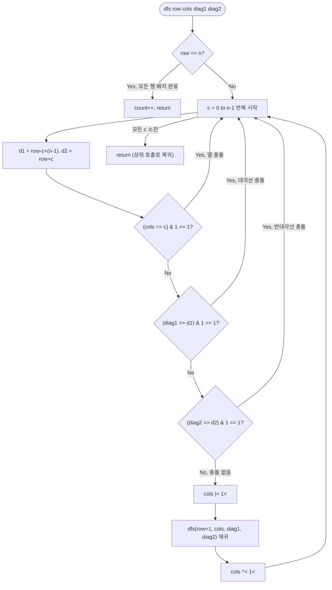

import { AlgorithmSimulation } from "#guide-sim";

# N-Queens — 충돌이 확정되는 순간 가지를 접으면 탐색량이 $n!$에서 해의 개수 수준으로 줄어드는 이유

## 한눈에 보는 컨셉

$n \times n$ 체스판에 퀸 $n$개를 서로 공격하지 않게 배치하는 방법의 수를 세는 문제예요. 각 행에 정확히 퀸 하나씩 놓는다는 제약 아래, 열·대각선 충돌이 확정되는 순간 그 가지를 통째로 포기하는 백트래킹(가지치기)을 쓰면 탐색량이 순열 전체(`n!`)가 아니라 실제로 살아남는 부분 배치 수준으로 줄어들어요. 여기에 열·대각선 사용 여부를 정수 3개의 비트마스크로 압축하면 충돌 검사와 상태 복원이 각각 `O(1)`에 끝나, 상수 계수까지 함께 줄어듭니다.

## 출발점: 가장 순진한 방법부터

문제를 먼저 정확히 잡을게요.

```ts
function nQueens(n: number): number
```

$n \times n$ 체스판에 퀸 $n$개를 배치하되, 어느 두 퀸 $(r_1, c_1)$, $(r_2, c_2)$도 아래 세 조건 중 하나도 만족하면 안 됩니다.

$$r_1 = r_2 \quad \text{(같은 행)}, \qquad c_1 = c_2 \quad \text{(같은 열)}, \qquad |r_1 - r_2| = |c_1 - c_2| \quad \text{(같은 대각선)}$$

이를 만족하는 배치의 수를 반환합니다. 제약은 $1 \leq n \leq 12$이고, 시간 제한은 1초예요.

"경우의 수를 센다"는 문제를 만나면 가장 정직한 첫 반응은 "가능한 배치를 전부 만들어서 세어 보자"입니다. 여기서는 각 행에 퀸을 하나씩 놓으면 열 충돌이 자동으로 배제된다는 점을 이용해, 열 배치를 순열로 표현하고 대각선만 사후에 검사하는 방법이 가장 단순한 출발점이에요.

```ts
function nQueensNaive(n: number): number {
  const cols = Array.from({ length: n }, (_, i) => i); // [0,1,...,n-1] 열 배치 후보
  let count = 0;

  function isValid(p: number[]): boolean {
    for (let r1 = 0; r1 < n; r1++) {
      for (let r2 = r1 + 1; r2 < n; r2++) {
        if (Math.abs(p[r1] - p[r2]) === Math.abs(r1 - r2)) return false; // 대각선 충돌
      }
    }
    return true;
  }

  function permute(arr: number[], k: number) {
    if (k === arr.length) {
      if (isValid(arr)) count++;
      return;
    }
    for (let i = k; i < arr.length; i++) {
      [arr[k], arr[i]] = [arr[i], arr[k]];
      permute(arr, k + 1);
      [arr[k], arr[i]] = [arr[i], arr[k]];
    }
  }

  permute(cols, 0);
  return count;
}
```

`permute`가 배열 `cols`를 뒤섞어 만드는 모든 순서(순열) 하나하나가 "행 $r$에는 열 `cols[r]`에 퀸을 놓는다"는 배치 하나예요. 순열이므로 같은 열이 두 번 나오지 않고, 그 덕분에 열 충돌은 신경 쓸 필요가 없습니다. 문제는 대각선인데, 이건 순열을 끝까지 완성한 뒤 `isValid`로 모든 행 쌍을 $O(n^2)$에 훑어야 확인할 수 있어요.

```text
순열 하나를 만드는 비용 자체는 자연스럽다
  (각 행에 서로 다른 열 하나씩 → 열 충돌은 순열이 저절로 막아 준다)

n=4:   4! =           24개 순열   → 대각선 검사만 통과하면 끝, 아직 여유 있음
n=8:   8! =       40,320개 순열   → 슬슬 버거워짐
n=12: 12! = 479,001,600개 순열   → 대각선 검사를 시작하기도 전에 이미 시간 초과
```

폭발 지점은 명확해요 — 순열을 **끝까지 다 만든 뒤에야** 대각선을 검사한다는 것입니다. 사실 첫 두 행만 놓아 봐도 대각선이 겹치는지는 바로 알 수 있는데, 그 뒤로 몇 행이 남았든 상관없이 나머지 순열을 계속 만들어 보는 거죠. **"이미 망가진 걸 알면서 왜 끝까지 가나?"** — 이 질문이 다음 절의 출발점입니다.

## 아이디어 자세히 들여다보기

### 충돌 조건을 좌표식으로 접기 — 수식과 그림

먼저 "행에 하나씩 놓는다"는 전제를 명시적으로 세 가지 충돌 조건으로 다시 씁니다. 행 $r$, 열 $c$에 퀸을 놓는다고 할 때, 두 퀸 $(r_1, c_1)$과 $(r_2, c_2)$가 충돌하는 경우는 다음 셋뿐이에요.

$$\text{같은 행: } r_1 = r_2, \qquad \text{같은 열: } c_1 = c_2, \qquad \text{같은 대각선: } r_1 - c_1 = r_2 - c_2 \;\text{ 또는 }\; r_1 + c_1 = r_2 + c_2$$

행마다 정확히 하나씩 놓으므로 "같은 행" 충돌은 애초에 발생하지 않아요(그래서 순열 아이디어가 통했던 거죠). 남는 건 열, 그리고 두 종류의 대각선입니다. 이 세 조건을 각각 **집합**으로 관리하면 검사가 쉬워져요.

- `cols`: 지금까지 사용한 열들의 집합
- `diag1`: 지금까지 사용한 $r - c$ 값들의 집합 (좌상→우하 방향, `\` 대각선)
- `diag2`: 지금까지 사용한 $r + c$ 값들의 집합 (우상→좌하 방향, `/` 대각선)

문제는 $r - c$가 음수가 될 수 있다는 점이에요($r=0, c=3$이면 $-3$). 배열 인덱스나 비트 위치로 바로 쓰려면 음수가 없어야 하니, $n-1$만큼 오프셋을 더합니다.

$$d_1 = r - c + (n-1) \in [0,\, 2n-2], \qquad d_2 = r + c \in [0,\, 2n-2]$$

$d_2 = r + c$는 애초에 $r, c \geq 0$이라 음수가 될 수 없어서 오프셋이 필요 없어요. 왜 하필 이 형태여야 할까요? 대안으로 "충돌한 두 퀸의 쌍을 매번 순회해서 비교"하는 방법(순열 아이디어의 `isValid`)도 있지만, 그건 $O(n)$개의 이전 퀸과 매번 비교해야 해서 검사 자체가 $O(n)$입니다. 반면 $d_1, d_2$를 **좌표 하나의 값**으로 압축해 두면, "이 대각선이 이미 쓰였는가"를 집합 하나의 멤버십 확인만으로 $O(1)$에 답할 수 있어요.

$n=4$ 보드에서 각 칸의 $d_1$, $d_2$ 값을 직접 채워 보면 이렇습니다.

```text
d1 = r - c + 3          d2 = r + c
r\c  0  1  2  3          r\c  0  1  2  3
0    3  2  1  0          0    0  1  2  3
1    4  3  2  1          1    1  2  3  4
2    5  4  3  2          2    2  3  4  5
3    6  5  4  3          3    3  4  5  6

같은 "\" 대각선(예: (0,0)(1,1)(2,2)(3,3))은 d1이 모두 3으로 같다
같은 "/" 대각선(예: (0,3)(1,2)(2,1)(3,0))은 d2가 모두 3으로 같다
```

확인 질문 하나 — 칸 $(2, 0)$의 $d_1$, $d_2$는 각각 얼마일까요? 표에서 $r=2$행, $c=0$열을 찾으면 $d_1 = 5$, $d_2 = 2$입니다. 이 두 값이 이미 `diag1`, `diag2` 집합에 있다면 $(2,0)$에는 퀸을 놓을 수 없다는 뜻이에요.

### 단서를 설명해 주는 이론 — 백트래킹과 제약 충족 문제(CSP)

앞서 던진 질문 "이미 망가진 걸 알면서 왜 끝까지 가나?"를 일반적인 언어로 옮기면, 이 문제는 **제약 충족 문제(Constraint Satisfaction Problem, CSP)**의 한 사례예요. CSP는 세 가지로 구성됩니다.

- **변수(variable)**: 행마다 하나 — "이 행에는 어느 열에 퀸을 놓을까?"
- **도메인(domain)**: 각 변수가 가질 수 있는 값 — $0$부터 $n-1$까지의 열 번호
- **제약(constraint)**: 변수들 사이에 지켜야 할 관계 — 열 충돌 없음, 대각선 충돌 없음

순열 방식(naive)은 **generate-and-test**라고 불리는 CSP 해법이에요. 변수 전부에 값을 다 채운 뒤에야 제약을 검사합니다. 반면 **백트래킹(backtracking)**은 변수를 하나씩 채우면서, 그 변수에 값을 배정하는 **즉시** 지금까지의 제약을 검사해요. 제약을 어기면 그 값은 아예 시도조차 마무리 짓지 않고 즉시 포기(가지치기, pruning)하고 다음 후보로 넘어갑니다. 남은 변수들에 어떤 값을 넣어도 이미 어긴 제약은 되돌릴 수 없기 때문에, 그 아래로 내려가 볼 이유가 없는 거죠.

```text
generate-and-test (순열):  행0 행1 행2 행3 모두 채움 → 그제서야 검사
backtracking:              행0 채움 → 검사 → 행1 채움 → 검사 → ... → 어긴 순간 즉시 중단
```

N-Queens는 "각 행(변수)마다 선택지(열)를 하나씩 고르되, 이전 선택들과 충돌하지 않아야 한다"는 전형적인 CSP 형태라서 백트래킹이 특히 잘 맞아요. 이 문제뿐 아니라 스도쿠, 그래프 색칠 같은 문제도 같은 틀(변수·도메인·제약)로 백트래킹을 적용할 수 있다는 점을 기억해 두세요 — 뒤에서 이 알고리즘의 "범용성"을 다시 이야기할 때 이 틀을 다시 소환합니다.

### 왜 모순 없이 작동하는가

백트래킹으로 셈한 결과가 정답과 정확히 같다는 것을 확인해 볼게요. 재귀 함수 `dfs(row, cols, diag1, diag2)`는 "행 $row$부터 $n-1$행까지, 지금 상태(`cols`, `diag1`, `diag2`)와 충돌하지 않게 배치하는 방법의 수"를 반환한다고 정의합니다.

**완전성(모든 유효한 배치를 놓치지 않는가).** 기저 사례는 $row = n$일 때이고, 이때는 이미 $0 \sim n-1$행이 전부 채워졌으니 유효한 배치 하나를 그대로 인정합니다(`count++`). 귀납 단계에서는 $dfs(row, \ldots)$가 열 $0$부터 $n-1$까지 **가능한 모든 후보를 하나도 빠짐없이** 시도합니다 — 반복문이 $c$를 $0$에서 $n-1$까지 전부 훑으므로, "시도해 보지 않은 열"이 남을 수 없어요. 각 후보 $c$에 대해 유효하면 $dfs(row+1, \ldots)$를 호출해 나머지 행을 마저 채우는데, 이 호출도 귀납 가정에 의해 자신이 맡은 범위($row+1 \sim n-1$)에서 완전합니다. 따라서 행 $0$부터 시작한 `dfs(0, 0, 0, 0)`은 유효한 전체 배치를 전부 방문합니다.

**건전성(유효하지 않은 배치를 세지 않는가).** `count`가 늘어나는 시점은 오직 $row = n$에 도달했을 때뿐이고, 그 경로 위의 모든 행은 배치 직전에 `cols`, `diag1`, `diag2` 세 조건을 모두 통과했을 때만 진행됩니다. 즉 $row=n$에 도달한 경로는 예외 없이 열·대각선·반대각선 충돌이 전혀 없는 배치예요.

**백트래킹(복원)의 정당성.** 비트를 `|=`로 설정하고 `^=`로 복원하는 방식이 실제로 "배치 전 상태"로 정확히 돌아간다는 것도 확인이 필요해요. $A \oplus B \oplus B = A$이므로, 어떤 값 `cols`에 `1 << c`를 OR로 한 번 더한 뒤 같은 값을 XOR로 한 번 빼면 정확히 원래의 `cols`로 돌아갑니다.

여기서 **헷갈리기 쉬운 포인트**가 몇 가지 있습니다.

- **"각 행에 하나씩 놓으니까 열 충돌은 저절로 안 생기는 거 아닌가?"** — 이건 순열 방식(naive)에서만 참인 이야기예요. 순열은 배열 원소를 뒤섞을 뿐이라 같은 값이 중복될 수 없지만, 백트래킹은 각 행마다 열 $0$부터 $n-1$까지 **독립적으로** 고릅니다. `cols` 검사를 생략하면 아무 제약이 없으니 같은 열을 여러 행이 공유할 수 있어요. 실제로 `n=4`에서 열 검사를 빼고 대각선 검사만 남기면 답이 `2`가 아니라 `24`로 부풀어 오릅니다(우연히 `4!`과 같은 값이에요) — 대각선만 맞으면 열이 겹쳐도 세어 버리기 때문입니다.
- **XOR 복원은 "직전에 OR로 켠 비트"에만 써도 안전합니다.** 이미 꺼져 있는 비트를 XOR하면 오히려 그 비트가 켜져 버려서 상태가 오염돼요. `valid` 검사가 "아직 사용되지 않은 비트"만 통과시키기 때문에 이 전제가 항상 성립하지만, 되돌리기 자체를 생략해 버리면 이야기가 달라집니다. `n=4`에서 복원 세 줄을 통째로 빼고 실행하면 이전 가지에서 설정한 비트가 다음 형제 가지에도 그대로 남아, 정답이 `2`가 아니라 `0`으로 무너집니다(멀쩡한 열까지 "이미 사용됨"으로 오판해 버리는 탓이에요).
- **$d_1$의 오프셋을 빼먹지 않아야 합니다.** $d_1 = r - c$를 오프셋 없이 그대로 쓰면 $r < c$일 때 음수가 나옵니다. 자바스크립트의 `<<` 연산은 음수 시프트 양을 32로 나눈 나머지로 취급해 버려서, 겉으로는 실행되지만 전혀 다른 비트를 건드리는 조용한 오류가 됩니다.

엣지 케이스도 이 정의 위에서 그대로 확인됩니다.

```text
n = 1: dfs(0, 0, 0, 0) → row(0) < n(1) → c=0 시도, 충돌 없음(아무 것도 안 놓였으니까)
                       → dfs(1, ...) → row == n → count = 1                      ✓ (정답 1)
n = 2, 3: 모든 배치 경로가 도중에 valid(row, c)를 통과하지 못해 count = 0       ✓ (정답 0)
n = 12: d1, d2의 최댓값은 2n-2 = 22 → 32비트 정수 범위 안에서 안전하게 표현됨   ✓ (정답 14200)
```

## 아이디어를 코드로 옮기기

앞 절의 정의를 그대로 코드로 옮기되, 아직 비트마스크는 쓰지 않고 `cols`, `diag1`, `diag2`를 boolean 배열 세 개로 표현하는 가장 직접적인 형태부터 만들어 봅니다.

```ts
function nQueensBacktrack(n: number): number {
  const usedCol = new Array(n).fill(false);
  const usedDiag1 = new Array(2 * n - 1).fill(false); // 인덱스: row - c + (n - 1)
  const usedDiag2 = new Array(2 * n - 1).fill(false); // 인덱스: row + c
  let count = 0;

  function dfs(row: number) {
    if (row === n) {
      count++;
      return;
    }
    for (let c = 0; c < n; c++) {
      const d1 = row - c + (n - 1);
      const d2 = row + c;
      if (usedCol[c] || usedDiag1[d1] || usedDiag2[d2]) continue; // 충돌 → 이 열은 건너뛴다(가지치기)

      usedCol[c] = usedDiag1[d1] = usedDiag2[d2] = true; // 배치
      dfs(row + 1);
      usedCol[c] = usedDiag1[d1] = usedDiag2[d2] = false; // 되돌리기
    }
  }

  dfs(0);
  return count;
}
```

**가장 중요한 줄은 `if (usedCol[c] || usedDiag1[d1] || usedDiag2[d2]) continue;`입니다.** 이 한 줄이 "충돌이 확정되는 순간 가지를 접는다"는 핵심 아이디어 그 자체예요. `continue`로 넘어가면 그 열 아래로는 재귀 호출 자체가 일어나지 않으니, naive 버전처럼 나머지 행을 채워 보는 낭비가 원천적으로 사라집니다.

그 외에 결정 지점 몇 가지를 짚어 둘게요.

- 세 배열은 재귀 전체에서 **딱 하나씩만** 존재합니다(클로저로 공유). 매 호출마다 새로 만들지 않는 이유는, 배치와 복원을 그 자리에서 바로 하면 되기 때문이에요 — 매번 배열을 복사하면 그 자체가 $O(n)$ 비용입니다.
- 배치(`= true`)와 복원(`= false`)은 반드시 **같은 세 자리**를 가리켜야 합니다. `d1`, `d2`를 루프 안에서 매번 다시 계산하는 이유가 여기 있어요 — 재귀에서 돌아온 뒤에도 같은 `c`에 대한 값이라야 정확히 원래 자리를 끕니다.
- 배치 조건 검사 순서(`usedCol` → `usedDiag1` → `usedDiag2`)는 결과에 영향을 주지 않습니다(셋 다 만족해야 통과하는 AND 조건이므로). 다만 어느 하나라도 걸리면 나머지는 평가하지 않는 단락 평가(`||`)라서, 가장 자주 걸리는 조건을 앞에 두면 실전에서 약간 더 빠릅니다.

## 더 빠르게 만들 단서 찾기

`nQueensBacktrack`은 이미 정답이고, 가지치기 덕분에 naive보다 훨씬 적은 경로만 방문합니다. 그런데 열 하나를 검사할 때 실제로 벌어지는 일을 들여다보면 아직 낭비가 남아 있어요.

```text
열 c 하나를 검사하는 데 필요한 일:
  usedCol[c]      → 배열1의 인덱스 c번째 칸에 접근 (경계 검사 + 메모리 역참조)
  usedDiag1[d1]   → 배열2의 인덱스 d1번째 칸에 접근 (경계 검사 + 메모리 역참조)
  usedDiag2[d2]   → 배열3의 인덱스 d2번째 칸에 접근 (경계 검사 + 메모리 역참조)

  = 서로 다른 배열 세 곳을 매번 오가며 "참/거짓 하나"만 읽어 온다
```

`usedCol`, `usedDiag1`, `usedDiag2`가 담고 있는 정보는 사실 "이 위치가 켜져 있는가/꺼져 있는가"라는 비트 하나씩뿐이에요. $n \leq 12$이므로 각 배열의 크기도 최대 $22$칸(=$2n-2+1$)을 넘지 않습니다. 배열 하나에 흩어 담아 둘 이유 없이, **정수 하나의 서로 다른 비트 자리**에 전부 욱여넣을 수 있다는 게 이번 단서예요. 정수 연산(`|`, `&`, `^`, `>>`, `<<`)은 CPU가 레지스터 위에서 한 번에 처리하니, 배열 세 곳을 오가는 것보다 훨씬 가볍습니다.

## 단서를 최적화로 연결하기

상태를 "배열 3개"에서 "정수 3개"로 압축하는 설계를 정리해 봅니다.

```text
Before (배열 3개, 재귀 전체가 공유하는 하나의 상태):
  usedCol   = [ F, F, F, F ]              길이 n
  usedDiag1 = [ F, F, F, F, F, F, F ]      길이 2n-1
  usedDiag2 = [ F, F, F, F, F, F, F ]      길이 2n-1

After (정수 3개, 재귀 호출마다 자신만의 값을 인자로 받음):
  cols   = 0b0000   (비트 c가 1이면 열 c 사용 중)
  diag1  = 0b0000000 (비트 d1이 1이면 그 "\" 대각선 사용 중)
  diag2  = 0b0000000 (비트 d2가 1이면 그 "/" 대각선 사용 중)
```

핵심 규칙은 하나예요 — **비트 위치는 앞 절에서 정의한 인덱스($c$, $d_1$, $d_2$)를 그대로 쓴다.** 배열 인덱스로 쓰던 자리가 그대로 비트 자리가 되니, 이미 세운 정의를 재사용할 뿐 새로 설계할 게 없습니다. 검사는 "그 비트가 켜져 있는가"로 바뀌고, 배치는 OR로 비트를 켜고, 복원은 XOR로 비트를 끄는 연산이 됩니다.

```text
Before (배열 갱신):  usedCol[c] = true;    ...    usedCol[c] = false;
After (비트 연산):   cols |= 1 << c;       ...    cols ^= 1 << c;
```

배열 세 개를 재귀 전체가 공유하던 것과 달리, 이제 `cols`, `diag1`, `diag2`는 **`dfs`의 매개변수**로 넘어갑니다. 자바스크립트의 숫자는 값으로 전달되므로, 재귀 호출 하나하나가 자기만의 스냅샷을 갖는 셈이에요. 다만 같은 행 안에서 열 후보를 바꿔 가며 시도하는 루프 자체는 여전히 "설정 → 재귀 → 복원"의 순서를 지켜야 합니다 — 그렇지 않으면 이전 후보의 흔적이 다음 후보 시도에 새어 들어가니까요.

## 최적화 코드

```ts
function nQueens(n: number): number {
  let count = 0;

  function dfs(row: number, cols: number, diag1: number, diag2: number) {
    if (row === n) {
      count++;
      return;
    }
    for (let c = 0; c < n; c++) {
      const d1 = row - c + (n - 1); // 대각선(\) 인덱스, 범위 [0, 2n-2]
      const d2 = row + c; // 반대각선(/) 인덱스, 범위 [0, 2n-2]

      if ((cols >> c) & 1) continue; // 열 충돌
      if ((diag1 >> d1) & 1) continue; // 대각선 충돌
      if ((diag2 >> d2) & 1) continue; // 반대각선 충돌

      cols |= 1 << c; // 배치: 비트 설정
      diag1 |= 1 << d1;
      diag2 |= 1 << d2;

      dfs(row + 1, cols, diag1, diag2); // 다음 행으로 재귀

      cols ^= 1 << c; // 되돌리기: XOR로 비트 복원 (A ⊕ B ⊕ B = A)
      diag1 ^= 1 << d1;
      diag2 ^= 1 << d2;
    }
  }

  dfs(0, 0, 0, 0);
  return count;
}
```

기본 구현과 달라진 부분은 딱 두 곳이에요. 조건 검사가 `usedX[i]`에서 `(x >> i) & 1`로, 배치·복원이 배열 대입에서 `|=`/`^=`로 바뀐 것뿐, 루프 구조와 재귀 순서는 그대로입니다.

**가장 중요한 줄은 `cols ^= 1 << c;`로 시작하는 세 줄의 복원부입니다.** 이 줄이 없으면 재귀에서 돌아온 뒤에도 방금 시도한 열·대각선이 계속 "사용 중"으로 남아, 다음 형제 후보(`c+1`)를 검사할 때 애먼 충돌로 오판하거나(과소 계산) 심하면 상태가 완전히 무너집니다. 실제로 이 세 줄을 지우고 `n=4`를 돌리면 정답 `2` 대신 `0`이 나옵니다 — 첫 가지에서 설정된 비트가 지워지지 않은 채 다음 가지로 새어 들어가 정상적인 배치까지 "충돌"로 판정해 버리기 때문이에요.

> 기억법: "켤 때 쓴 비트 그대로, 끌 때도 그 비트만." OR로 켠 자리를 XOR로 정확히 그 자리만 꺼야 상태가 원래대로 돌아옵니다.

이 시점에서 처음에 세운 목표를 다시 확인해 볼게요. naive 순열 방식은 $n=12$에서 이미 $12! \approx 4.79 \times 10^8$개 순열을 만드는 단계에서 막혔지만, 비트마스크 백트래킹은 실제로 존재하는 해(14,200개)에 비례하는 수준의 가지만 방문하고 각 검사·복원이 `O(1)`이라 $n=12$까지 여유 있게 처리됩니다.

더 짜낼 여지가 있을까요? 두 갈래가 있습니다. 하나는 상수 계수를 더 줄이는 미세 최적화예요 — `available = ((1 << n) - 1) & ~(cols | diag1 | diag2)`로 "지금 놓을 수 있는 열 전체"를 한 번에 구하고, `available & -available`로 최하위 켜진 비트만 뽑아가며 도는 방식을 쓰면 애초에 막힌 열은 루프에 들어오지도 않습니다. 다른 하나는 좌우 대칭을 이용해 첫 행의 절반만 탐색하고 결과를 2배 하는 방법이에요(단, 홀수 $n$이면 가운데 열은 따로 처리해야 합니다). 두 가지 모두 **점근 복잡도 자체를 바꾸지는 못하고** 상수 계수만 줄이는 기법이라 이 가이드의 최종 코드로 삼지는 않았습니다. 참고로 $n$-Queens를 정확히 세는 문제 자체에 다항 시간 알고리즘은 알려져 있지 않고(해의 개수가 $n$에 지수적으로 증가하는 조합 문제라서), 실전에서는 비트마스크 백트래킹이 사실상 표준적인 접근이에요. 이 방법의 가치는 스도쿠·그래프 색칠 같은 다른 CSP에도 "변수·도메인·제약"의 틀 그대로 재사용할 수 있다는 **범용성**에 있습니다.

## 실행 시각화

`n = 4`에 대해 백트래킹을 실행하는 과정입니다. matrix 패널은 4x4 보드(`Q`는 퀸, `.`은 빈 칸)이며, `cells`로 강조된 칸은 방금 배치/검사 중인 위치예요. 행 0부터 차례로 퀸을 놓고, 충돌이 나면 그 가지를 버리고 되돌아갑니다. 고정 입력 `n=4`에 대한 실제 반환값은 `2`이며, 시뮬레이션 마지막 프레임의 누적 카운트와 일치합니다.

> 대화형 시뮬레이션은 MDX 런타임에서 표시됩니다.

export const empty = [
  [".", ".", ".", "."],
  [".", ".", ".", "."],
  [".", ".", ".", "."],
  [".", ".", ".", "."],
];

export const steps = [
  {
    title: "초기 보드, count = 0",
    detail: "4x4 빈 보드. 행 0부터 퀸을 배치한다.",
    matrix: empty,
  },
  {
    title: "행0: c=0 배치 시도",
    detail: "(0,0)에 퀸을 놓는다. cols={0}.",
    matrix: [
      ["Q", ".", ".", "."],
      [".", ".", ".", "."],
      [".", ".", ".", "."],
      [".", ".", ".", "."],
    ],
    cells: [[0, 0]],
  },
  {
    title: "행1: (1,2) 배치",
    detail: "c=0(열), c=1(대각선) 충돌 → c=2 배치. cols={0,2}.",
    matrix: [
      ["Q", ".", ".", "."],
      [".", ".", "Q", "."],
      [".", ".", ".", "."],
      [".", ".", ".", "."],
    ],
    cells: [[1, 2]],
  },
  {
    title: "행2: 유효 열 없음 → 백트래킹",
    detail: "남은 열 모두 열/대각선 충돌. 행1로 되돌아가 다른 열을 시도한다.",
    matrix: [
      ["Q", ".", ".", "."],
      [".", ".", ".", "."],
      [".", ".", ".", "."],
      [".", ".", ".", "."],
    ],
    cells: [[1, 2]],
  },
  {
    title: "행1 재시도→행3까지 막힘, 행0 백트래킹",
    detail: "(0,0) 시작 가지에서는 4행 완성 불가. 행0을 c=1로 변경한다.",
    matrix: empty,
  },
  {
    title: "행0: (0,1) 배치",
    detail: "새 가지 시작. cols={1}.",
    matrix: [
      [".", "Q", ".", "."],
      [".", ".", ".", "."],
      [".", ".", ".", "."],
      [".", ".", ".", "."],
    ],
    cells: [[0, 1]],
  },
  {
    title: "행1: (1,3) 배치",
    detail: "충돌 없는 c=3 선택. cols={1,3}.",
    matrix: [
      [".", "Q", ".", "."],
      [".", ".", ".", "Q"],
      [".", ".", ".", "."],
      [".", ".", ".", "."],
    ],
    cells: [[1, 3]],
  },
  {
    title: "행2: (2,0) 배치",
    detail: "c=0이 충돌 없음. cols={1,3,0}.",
    matrix: [
      [".", "Q", ".", "."],
      [".", ".", ".", "Q"],
      ["Q", ".", ".", "."],
      [".", ".", ".", "."],
    ],
    cells: [[2, 0]],
  },
  {
    title: "행3: (3,2) 배치 → 해 1 완성",
    detail: "c=2가 충돌 없음. row=4 도달 → count=1. 해: (0,1)(1,3)(2,0)(3,2).",
    matrix: [
      [".", "Q", ".", "."],
      [".", ".", ".", "Q"],
      ["Q", ".", ".", "."],
      [".", ".", "Q", "."],
    ],
    cells: [[3, 2]],
  },
  {
    title: "백트래킹 후 대칭 해 2 발견",
    detail: "계속 탐색하면 (0,2)(1,0)(2,3)(3,1) 배치를 찾는다. count=2.",
    matrix: [
      [".", ".", "Q", "."],
      ["Q", ".", ".", "."],
      [".", ".", ".", "Q"],
      [".", "Q", ".", "."],
    ],
    cells: [[0, 2], [1, 0], [2, 3], [3, 1]],
  },
  {
    title: "완료: count = 2",
    detail: "모든 가지 탐색 완료. n=4의 유효한 배치는 2가지.",
    matrix: empty,
  },
];

<AlgorithmSimulation view="matrix" steps={steps} title="N-Queens 백트래킹 (n=4)" />

## 흐름 한눈에 보기



## 스스로 점검하기

1. `n = 5`일 때 최종 답은 `10`입니다. `dfs(0, 0, 0, 0)`에서 `c = 0`으로 첫 퀸을 놓았다고 할 때, 행 1에서 시도 가능한(충돌 없는) 열은 몇 개인지 $d_1$, $d_2$ 공식으로 직접 짚어 보세요. (힌트: 행 0에서 $c=0$이면 `cols={0}`, `diag1`에는 $d_1 = 0-0+4=4$, `diag2`에는 $d_2=0$이 들어갑니다. 행 1의 $c=0,1,2,3,4$ 중 이 세 값과 겹치지 않는 열만 셉니다.)
2. `## 아이디어를 코드로 옮기기` 절의 배열 기반 구현에서, 복원 줄(`usedCol[c] = usedDiag1[d1] = usedDiag2[d2] = false;`)을 지우면 `n=4`의 결과가 어떻게 되는지 앞 절의 "헷갈리기 쉬운 포인트"를 참고해 짚어 보세요. 왜 하필 `0`이 나오는지, 어떤 비트가 지워지지 않아서인지까지 설명할 수 있나요?
3. 이 알고리즘을 그대로 재사용해 "8×8 체스판에서 퀸 대신 룩(rook) $n$개를 서로 공격하지 않게 놓는 방법의 수"를 센다면, `diag1`/`diag2` 검사는 그대로 둬야 할까요, 빼야 할까요? (룩은 대각선으로 움직이지 못합니다.) 이 질문에 답하면서 왜 열 검사만으로 충분해지는지, 그리고 그 결과가 $n!$과 같아지는 이유도 함께 생각해 보세요.
