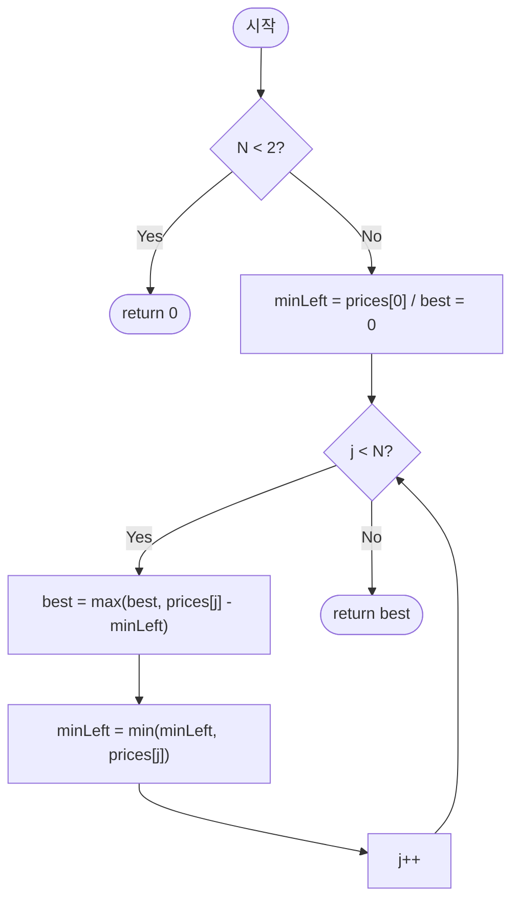

import { AlgorithmSimulation } from "#guide-sim";

# bestTimeToBuyAndSellStock — 지금까지 본 최저가 하나만 흘려보내면 되는 이유

## 한눈에 보는 컨셉

이 문제는 "언제 사서 언제 팔아야 이익이 최대인가"를 **딱 한 번의 거래**로 묻습니다. 핵심 관찰은 "오늘 팔 때의 최대 이익은, 오늘 가격에서 지금까지 본 가장 싼 매수가를 빼면 나온다"는 것이에요. naive하게 모든 매수·매도 쌍을 비교하면 `O(N^2)`이지만, 이 관찰을 쓰면 "지금까지의 최저가"라는 변수 하나만 오른쪽으로 흘려보내는 것만으로 `O(N)` 시간, `O(1)` 공간에 끝납니다.

## 출발점: 가장 순진한 방법부터

먼저 문제를 정확히 고정할게요.

```ts
function bestTimeToBuyAndSellStock(prices: number[]): number
```

| 파라미터 | 의미 | 제약 |
|----------|------|------|
| `prices` | 날짜 순서로 정렬된 종가 배열 | $1 \leq N \leq 100{,}000$, $0 \leq prices[i] \leq 10{,}000$ (정수) |

**반환값**: 매수일 $i$, 매도일 $j$ ($i \leq j$)를 골라 $prices[j] - prices[i]$를 최대화한 값. 어떤 조합도 이익이 나지 않으면 $0$을 반환합니다(거래를 하지 않은 것으로 처리).

"최댓값을 구하는 문제"를 보면 가장 정직한 출발은 **후보를 전부 나열해서 최댓값을 취하는 것**이에요. 여기서 후보는 매수일·매도일의 모든 조합 $(i, j)$, $i \leq j$입니다.

```ts
function bestTimeToBuyAndSellStockNaive(prices: number[]): number {
  let best = 0;
  for (let i = 0; i < prices.length; i++) {
    for (let j = i; j < prices.length; j++) {
      best = Math.max(best, prices[j] - prices[i]);
    }
  }
  return best;
}
```

작은 예로 비용을 체감해 볼게요. `prices = [7, 1, 5, 3, 6, 4]`(원소 6개)만 해도 조합이 $\binom{6}{2} + 6 = 21$개입니다.

```text
N = 6   조합 수 ≈ N(N+1)/2 = 21개   (아직은 감당할 만함)

N = 100,000 이면:
조합 수 ≈ N^2/2 = 5,000,000,000개  →  1초 제한 안에 절대 불가능
```

**목표 복잡도**: 시간 $O(N)$, 공간 $O(1)$. 배열을 한 번만 훑으면 충분하다는 것이 이번 가이드의 결론이에요.

naive를 그대로 돌려 보면 낌새가 하나 보입니다. $j$를 하나 늘릴 때마다 안쪽 루프에서 "$i = 0 \ldots j$ 중 가장 싼 값"을 처음부터 다시 찾고 있어요. 그런데 그 값은 바로 전 $j$에서 이미 거의 다 구해 놓은 값입니다. **"매번 처음부터 다시 찾지 않고, 지금까지의 최저가를 들고 다니면 안 될까?"** — 이것이 이번 알고리즘의 출발 단서예요.

## 아이디어 자세히 들여다보기

### 오늘 팔 때 최적의 매수일 고르기 — 수식과 그림

$j$일에 팔기로 정했다면, 매수일 $i$는 $0 \leq i \leq j$ 범위 안에서 자유롭게 고를 수 있어요. 이익 $prices[j] - prices[i]$를 최대화하려면 $prices[i]$를 최소화하면 되니, 최적 매수일은 항상 "$j$일 이전(포함) 중 가격이 가장 낮은 날"입니다. 이 값을 다음과 같이 정의합니다.

$$minLeft_j = \min_{0 \leq i \leq j} prices[i]$$

$$best_j = \max_{0 \leq k \leq j} \bigl(prices[k] - minLeft_k\bigr)$$

$best_j$는 "$j$일까지 훑었을 때 지금까지 구한 최대 이익"이고, 최종 답은 $best_{N-1}$이에요. 왜 하필 "왼쪽 최솟값"으로 정의할까요? 대안으로 "오른쪽에서부터 최댓값을 추적"하는 정의도 같은 복잡도를 줄 수 있지만, 왼쪽 최솟값 방식은 배열을 **왼쪽에서 오른쪽으로 딱 한 번**만 훑으면 끝나기 때문에 캐시 접근이 순차적이고 구현이 가장 단순합니다.

`prices = [7, 1, 5, 3, 6, 4]`로 직접 채워 볼게요.

```text
j          :  0   1   2   3   4   5
prices[j]  :  7   1   5   3   6   4
minLeft_j  :  7   1   1   1   1   1     (지금까지 본 최저가)
prices[j]-minLeft_j :
              0   0   4   2   5   3
best_j (누적 최댓값) :
              0   0   4   4   5   5
```

$best_5 = 5$가 최종 답입니다(1일에 가격 1로 사서 4일에 가격 6으로 파는 경우).

잠깐, 확인 하나만 해 볼까요? `prices = [3, 2, 6, 5, 0, 3]`일 때 `minLeft_j`를 손으로 채워 보면 `[3, 2, 2, 2, 0, 0]`이 됩니다. 그러면 `prices[j] - minLeft_j`는 `[0, 0, 4, 3, 0, 3]`이고, 누적 최댓값 `best_j`는 `[0, 0, 4, 4, 4, 4]`예요. 답은 4(2에 사서 6에 파는 경우)입니다.

### 단서를 설명해 주는 이론 — Kadane's Algorithm(최대 부분합)

방금 세운 단서 — "매번 처음부터 찾지 않고 누적값을 들고 다닌다" — 는 사실 더 일반적인 이론의 특수한 경우예요. 바로 **Kadane's Algorithm**, 즉 "연속된 부분 배열의 합 중 최댓값"을 구하는 표준 기법입니다.

우선 이 문제를 최대 부분합 문제로 바꿔 볼게요. 하루 사이의 가격 변화를 $d[k] = prices[k] - prices[k-1]$ ($k = 1, \ldots, N-1$)로 정의하면, 망원급수처럼 항이 지워져서

$$prices[j] - prices[i] = \sum_{k=i+1}^{j} d[k]$$

가 성립합니다. 즉 "매수일 $i$, 매도일 $j$의 이익"은 정확히 "$d$ 배열에서 구간 $[i+1, j]$의 합"이에요($i = j$면 빈 구간, 합은 $0$). 그러니 우리 문제는 "$d$ 배열의 부분합 중 최댓값(단, 빈 구간도 허용해 최소 $0$)을 구하라"는 **최대 부분합 문제**와 동치입니다.

Kadane's Algorithm은 이 최대 부분합을 다음 점화식 하나로 $O(N)$에 풉니다. `curSum`을 "현재 위치에서 끝나는 최선의 부분합"이라 하면,

$$curSum_k = \max\bigl(d[k],\; curSum_{k-1} + d[k]\bigr), \qquad ans = \max_k curSum_k$$

"지금까지 이어 붙인 합이 오히려 손해($curSum_{k-1} < 0$)라면 버리고 오늘부터 다시 시작한다"는 것이 이 점화식의 직관이에요. `prices = [7, 1, 5, 3, 6, 4]`의 `d = [-6, 4, -2, 3, -2]`에 대해 직접 굴려 보면:

```text
k        :   1     2     3     4     5
d[k]     :  -6     4    -2     3    -2
curSum_k :  -6     4     2     5     3     (max(d[k], curSum_{k-1}+d[k]))
ans(누적) :   0     4     4     5     5     (빈 구간 0 포함, 누적 최댓값)
```

`ans`의 진행 `[0, 4, 4, 5, 5]`가 앞 절 표의 `best_j`(1일차 이후 값) `[0, 4, 4, 5, 5]`와 정확히 일치합니다. 실제로 `minLeft`를 유지하는 우리의 그리디는 Kadane의 `curSum`을 다른 모양으로 표현한 것뿐이에요 — $curSum_k = prices[k] - minLeft_{k-1}$ 로 정의하면,

$$curSum_{k-1} + d[k] = (prices[k-1] - minLeft_{k-2}) + (prices[k] - prices[k-1]) = prices[k] - minLeft_{k-2}$$

이고 $d[k]$ 단독은 $prices[k] - prices[k-1]$이므로, 둘 중 큰 값을 취하는 것은 곧 $minLeft_{k-1} = \min(minLeft_{k-2}, prices[k-1])$을 골라 $prices[k] - minLeft_{k-1}$을 계산하는 것과 같습니다. 즉 "누적 합이 손해면 리셋한다"는 Kadane의 규칙이, 우리 문제에서는 "최저가 갱신"이라는 형태로 자연스럽게 나타난 것이에요. 이 대응은 뒤에서 코드를 최적화할 때 "왜 변수 하나로 충분한지"를 다시 뒷받침하니 기억해 두세요.

(참고로 이 문제는 빈 구간, 즉 이익 $0$을 허용한다는 점에서 표준 Kadane과 살짝 다릅니다. 표준 Kadane은 원소를 최소 1개는 포함해야 해서 모든 값이 음수여도 그중 가장 덜 손해인 값을 반환하지만 — 이 프로젝트의 [kadane 가이드](../kadane/kadane-guide.mdx)가 그 버전을 다룹니다 — 우리 문제는 "거래를 안 해도 된다"는 규칙 덕분에 `ans`의 시작값을 $0$으로 두어 빈 구간을 자연스럽게 포함시킵니다.)

### 왜 모순 없이 작동하는가

`minLeft`와 `best`를 유지하는 알고리즘이 항상 옳은 답을 낸다는 것을 귀납으로 보일게요.

**기저($j = 0$)**: `minLeft = prices[0]`, `best = 0`으로 초기화합니다. $minLeft_0 = \min_{0 \leq i \leq 0} prices[i] = prices[0]$이 정의 그대로 성립하고, $j = 0$에서는 매도 후보가 매수 후보와 같아 이익이 $0$뿐이므로 $best_0 = 0$도 정의와 일치합니다.

**귀납 단계**: $j - 1$까지 순회를 마친 시점에 `minLeft` $= minLeft_{j-1}$, `best` $= best_{j-1}$가 성립한다고 가정합니다. $j$번째 반복에서 두 갱신이 일어나요.

1. `best = max(best, prices[j] - minLeft)` — 이때 `minLeft`는 아직 $minLeft_{j-1}$(즉 $\min(prices[0..j-1])$)이므로, 이 식은 "매수일을 $0 \ldots j-1$ 중에서 고르고 $j$일에 파는" 최선의 이익을 계산합니다. $j$일에 팔 때 선택 가능한 매수일은 정확히 $0 \ldots j$이지만, $i = j$(같은 날 매수·매도)는 이익이 항상 $0$이라 이미 `best`의 초기값 $0$에 포함돼 있으므로 따로 볼 필요가 없어요. 즉 경우의 수 $0 \ldots j-1$과 $i=j$ 두 갈래를 **빠짐없이** 덮습니다.
2. `minLeft = min(minLeft, prices[j])` — $\min(prices[0..j-1], prices[j]) = \min(prices[0..j]) = minLeft_j$이므로 갱신 후 불변식이 다음 라운드를 위해 정확히 유지됩니다.

두 갱신을 마치면 `best` $= best_j$, `minLeft` $= minLeft_j$가 되어 귀납이 완성됩니다. 루프가 $j = N-1$까지 끝나면 `best` $= best_{N-1}$, 이는 정의상 전체 문제의 답입니다.

여기서 **헷갈리기 쉬운 포인트**가 두 가지 있습니다.

- **"오늘의 최저가만 있으면 충분하지, 매일 전날 가격과만 비교해도 되지 않을까?"** — 아닙니다. `d[j] = prices[j] - prices[j-1]`처럼 **바로 전날 가격**과만 비교하면, 여러 날 전의 더 싼 매수가를 놓칩니다. `prices = [7, 1, 5, 3, 6, 4]`에서 전날 비교만 하면 매 구간의 차이 `[-6, 4, -2, 3, -2]` 중 최댓값 `4`를 답으로 냅니다. 하지만 실제 답은 `5`(1일 가격 1에 사서 4일 가격 6에 파는 경우)예요. 전날 비교는 "누적된 최저가"라는 정보를 잃어버리기 때문에 틀립니다.

  ```text
  전날 비교만 사용(오답):  max([-6, 4, -2, 3, -2]) = 4        ✗ (정답은 5)
  누적 최저가 사용(정답):  minLeft가 계속 1을 기억 → best = 5  ✓
  ```

- **"매수일이 매도일보다 나중이면 안 되는데, 이 알고리즘이 그걸 어떻게 보장하나?"** — `minLeft`가 항상 "지금까지(오늘 포함 이전)"의 최솟값만 담기 때문입니다. 루프가 $j$까지 왔다는 것 자체가 그 이전 날짜만 `minLeft`에 반영됐다는 뜻이라, 미래 날짜를 매수일로 착각할 수가 없어요.

엣지 케이스도 짚어 볼게요.

```text
prices = []         → 루프 진입 전 조기 반환, best = 0
prices = [5]        → N < 2 조기 반환, best = 0 (매도 가능한 날이 없음)
prices = [5,4,3,2,1] (단조 감소) → 모든 prices[j]-minLeft ≤ 0 → best는 0에서 갱신 안 됨 → 0
prices = [1, 10000]  → minLeft=1 유지, best = 10000-1 = 9999
```

## 아이디어를 코드로 옮기기

앞 절의 정의 $minLeft_j$, $best_j$를 그대로 배열에 옮기면 이렇습니다. 아직 롤링 최적화는 하지 않고, "왼쪽 최솟값 배열을 미리 다 만들어 두는" 가장 직접적인 형태예요.

```ts
function bestTimeToBuyAndSellStockBasic(prices: number[]): number {
  const n = prices.length;
  if (n < 2) return 0;

  const leftMin = new Array<number>(n);
  leftMin[0] = prices[0];
  for (let j = 1; j < n; j++) {
    leftMin[j] = Math.min(leftMin[j - 1], prices[j]);
  }

  let best = 0;
  for (let j = 1; j < n; j++) {
    best = Math.max(best, prices[j] - leftMin[j - 1]);
  }
  return best;
}
```

시간은 $O(N)$(두 루프 모두 선형), 공간은 $O(N)$(`leftMin` 배열)입니다. 결정 지점 몇 가지만 짚을게요.

- `leftMin[0] = prices[0]`로 초기화하는 것이 **가장 실수가 잦은 줄**입니다. 여기를 `0`으로 잘못 초기화하면 어떻게 될까요? `prices = [7, 1, 5, 3, 6, 4]`에서 `leftMin[0] = 0`으로 두면 이후 `leftMin`이 항상 `0`(가격이 모두 $0$ 이상이므로 `min(0, prices[j])`은 계속 `0`)이 되어 `best`가 `prices[j] - 0`, 즉 가격 그 자체의 최댓값으로 계산됩니다. 실제로 돌려 보면 `6`이 나오는데, 정답은 `5`예요 — 존재하지 않는 "가격 0에 매수"를 가정한 셈입니다.
- `best` 계산 루프는 `leftMin[j - 1]`(오늘을 **포함하지 않은** 왼쪽 최솟값)을 씁니다. 오늘까지 포함한 `leftMin[j]`를 써도 최종 답은 같지만(오늘이 새 최저가인 경우 이익이 정확히 `0`이 더해질 뿐이라 최댓값에 영향이 없습니다), 의미상 "매수는 매도보다 앞선 날"이라는 조건을 헷갈리지 않게 짚기 위해 `j - 1`을 씁니다.
- `n < 2` 가드는 매도 가능한 날이 없는 경우(빈 배열, 원소 1개)를 조기에 처리합니다.

## 더 빠르게 만들 단서 찾기

`leftMin` 배열을 채우는 루프를 다시 볼게요. `leftMin[j]`를 계산할 때 실제로 읽는 값은 `leftMin[j - 1]`, 딱 하나뿐입니다. `leftMin[0]`부터 `leftMin[j-2]`까지는 이미 다 지나간 값인데, 배열은 그 값들을 끝까지 붙들고 있어요.

```text
leftMin :  [7, 1, 1, 1, 1, 1]
                       ↑
             leftMin[4]를 구할 때 읽는 건 leftMin[3] 딱 하나뿐

인덱스 0~2는 이미 다시 읽히지 않는데도 배열 안에 계속 살아 있다  →  공간 낭비
```

`best` 계산 루프도 마찬가지로 `leftMin[j-1]` 한 칸만 읽습니다. 즉 **"leftMin[j]는 leftMin[j-1]과 prices[j]에만 의존한다"** — 이전 절에서 Kadane의 `curSum` 갱신이 딱 직전 값 하나에만 의존했던 것과 같은 모양이에요. 참조 범위가 "바로 직전 값 1개"로 좁으므로, 배열 전체를 들고 있을 필요 없이 변수 하나로 그 값을 흘려보내면 충분합니다.

## 단서를 최적화로 연결하기

배열을 스칼라 변수로 굴려 볼게요. 지켜야 할 불변식은 하나입니다.

> 루프가 $j$번째 반복을 시작하는 시점에, `minLeft` $= \min(prices[0..j-1])$이다.

```text
Before (배열 버전):
  leftMin = [7, 1, 1, 1, 1, 1]   ← N칸을 전부 저장
  best 계산 시 leftMin[j-1] 인덱싱

After (롤링 변수 버전):
  minLeft = 1  (스칼라 하나)     ← 직전 값만 기억
  best 계산 후 그 자리에서 바로 minLeft 갱신
```

배열의 각 칸을 "왼쪽에서 오른쪽으로 흘러가며 값이 바뀌는 변수 하나"로 대체하는 것뿐이라, 계산 결과는 그대로 유지되면서 공간만 $O(N) \to O(1)$로 줄어듭니다.

## 최적화 코드

바뀌는 부분은 `leftMin` 배열을 `minLeft` 스칼라로 접고, 두 루프를 하나로 합치는 것뿐입니다.

```ts
function bestTimeToBuyAndSellStock(prices: number[]): number {
  const n = prices.length;
  if (n < 2) return 0;

  let minLeft = prices[0];
  let best = 0;

  for (let j = 1; j < n; j++) {
    best = Math.max(best, prices[j] - minLeft);
    minLeft = Math.min(minLeft, prices[j]);
  }
  return best;
}
```

**가장 중요한 줄은 `best = Math.max(best, prices[j] - minLeft)`입니다.** 이 줄이 실행되는 시점에 `minLeft`는 아직 갱신 전이라 $\min(prices[0..j-1])$을 담고 있고, 그래서 이 한 줄이 "$j$일에 팔 때의 최선"을 정확히 계산합니다. 흥미로운 점은, 만약 실수로 두 줄의 순서를 바꿔 `minLeft`를 먼저 갱신해도 결과가 달라지지 않는다는 거예요 — 그 경우 `minLeft`가 $prices[j]$까지 포함하게 되지만, 앞서 3.4절에서 본 것처럼 "오늘 사서 오늘 파는" 이익은 항상 $0$이라 전역 최댓값에 영향을 주지 않기 때문입니다. 실제로 `prices = [3, 2, 6, 5, 0, 3]`에 두 순서를 모두 돌려 보면 둘 다 `4`로 같습니다. (다만 코드의 의도를 읽기 쉽게 하려면 지금 순서 — 이익 계산 후 최솟값 갱신 — 를 그대로 쓰는 것을 권합니다.)

> 기억법: "오늘 팔기 전에, 오늘 값으로 최저가를 갱신하지 않는다."

이제 목표였던 시간 $O(N)$, 공간 $O(1)$을 달성했습니다. 더 줄일 여지가 있을까요? 시간 쪽은 하한이 명확합니다 — 배열의 원소 하나를 바꾸면 답이 달라질 수 있으므로(예: 가장 낮은 가격을 더 낮추면 최적 이익이 커집니다), 어떤 정확한 알고리즘도 모든 원소를 최소 한 번은 읽어야 해요. 따라서 $\Omega(N)$이 하한이고, 우리 알고리즘은 그 하한과 정확히 일치합니다. 공간도 비교에 필요한 값을 최소 하나는 들고 있어야 하므로 $O(1)$이 사실상 최소입니다. 즉 이 알고리즘은 점근적으로 더 개선할 여지가 없습니다.

참고로 "거래를 최대 $k$번까지 허용"하는 일반화(이 프로젝트의 `bestTimeToBuyAndSellStockK` 문제)는 그리디만으로는 풀리지 않고 DP가 필요합니다. 그럼에도 지금 배운 "누적 최저가 하나로 흘려보내는" 발상은 Kadane류 문제 전반(최대 부분합, 최대 곱 부분배열 등)에 재사용되는 범용 패턴이라는 데 가치가 있습니다.

## 실행 시각화

입력 `prices = [7, 1, 5, 3, 6, 4]`에 대해 1회 거래 최대 이익을 구하는 과정입니다. `pointers`의 `j`는 현재 매도 후보일, `minLeftIdx`는 지금까지의 최저 매수가 인덱스예요. `highlight`(빨강)는 현재 검사 중인 `prices[j]`, `marked`(회색)는 최적 매수일 후보입니다. keyValue 패널은 `minLeft`(최저가)와 `best`(최대 이익)를 보여줍니다.

실제 반환값은 `5`이며(1일 매수 가격 `1`, 4일 매도 가격 `6`), 시뮬레이션 마지막 프레임의 `best`와 일치합니다.

> 대화형 시뮬레이션은 MDX 런타임에서 표시됩니다.

export const P = [7, 1, 5, 3, 6, 4];

export const steps = [
  {
    title: "초기화 (j=1 진입 전)",
    detail: "minLeft = prices[0] = 7, best = 0.",
    array: P,
    marked: [0],
    pointers: { minLeftIdx: 0 },
    entries: [
      { label: "minLeft", value: 7 },
      { label: "best", value: 0 },
    ],
  },
  {
    title: "j=1: prices[1]=1",
    detail: "1 < minLeft(7) → minLeft = 1. (else 분기 미실행, best 유지)",
    array: P,
    highlight: [1],
    marked: [1],
    pointers: { j: 1, minLeftIdx: 1 },
    entries: [
      { label: "minLeft", value: 1 },
      { label: "best", value: 0 },
    ],
  },
  {
    title: "j=2: prices[2]=5",
    detail: "5 >= minLeft(1). 이익 5-1=4 > best(0) → best = 4.",
    array: P,
    highlight: [2],
    marked: [1],
    pointers: { j: 2, minLeftIdx: 1 },
    entries: [
      { label: "minLeft", value: 1 },
      { label: "best", value: 4 },
    ],
  },
  {
    title: "j=3: prices[3]=3",
    detail: "3 >= minLeft(1). 이익 3-1=2 <= best(4) → best 유지.",
    array: P,
    highlight: [3],
    marked: [1],
    pointers: { j: 3, minLeftIdx: 1 },
    entries: [
      { label: "minLeft", value: 1 },
      { label: "best", value: 4 },
    ],
  },
  {
    title: "j=4: prices[4]=6",
    detail: "6 >= minLeft(1). 이익 6-1=5 > best(4) → best = 5.",
    array: P,
    highlight: [4],
    marked: [1],
    pointers: { j: 4, minLeftIdx: 1 },
    entries: [
      { label: "minLeft", value: 1 },
      { label: "best", value: 5 },
    ],
  },
  {
    title: "j=5: prices[5]=4",
    detail: "4 >= minLeft(1). 이익 4-1=3 <= best(5) → best 유지.",
    array: P,
    highlight: [5],
    marked: [1],
    pointers: { j: 5, minLeftIdx: 1 },
    entries: [
      { label: "minLeft", value: 1 },
      { label: "best", value: 5 },
    ],
  },
  {
    title: "완료: best = 5",
    detail: "순회 종료. 1일 매수(1) → 4일 매도(6), 이익 5.",
    array: P,
    marked: [1, 4],
    entries: [
      { label: "결과 best", value: 5 },
      { label: "매수/매도", value: "j=1 사고 j=4 팔기" },
    ],
  },
];

<AlgorithmSimulation view={["array", "keyValue"]} steps={steps} title="주식 1회 거래 최대 이익: prices=[7,1,5,3,6,4]" />

## 흐름 한눈에 보기



## 스스로 점검하기

1. `prices = [3, 2, 6, 5, 0, 3]`에 대해 `minLeft`와 `best`의 값을 $j = 0$부터 $5$까지 직접 표로 채워 보세요. (힌트: `minLeft`는 `[3, 2, 2, 2, 0, 0]`, 최종 `best`는 `4`입니다.)
2. "바로 전날 가격과만 비교해도 되지 않을까?"라는 함정을 다시 떠올려 보세요. `prices = [4, 8, 1, 9, 2, 10]`에서 전날 비교(각 `d[k] = prices[k]-prices[k-1]`의 최댓값)와 실제 정답이 각각 얼마인지 구하고, 왜 둘이 다른지 설명해 보세요. (힌트: 두 값이 다릅니다 — 실제 정답이 전날 비교보다 큽니다.)
3. 만약 거래 규칙이 바뀌어 **"공매도"도 허용**(먼저 팔고 나중에 되사서 갚아도 됨, 이익은 $prices[i] - prices[j]$, $i \leq j$)된다면, 지금까지의 알고리즘을 어떤 변수를 하나 더 추가해서 확장할 수 있을까요? (힌트: 이번엔 "지금까지 본 최고가"가 필요합니다.)
