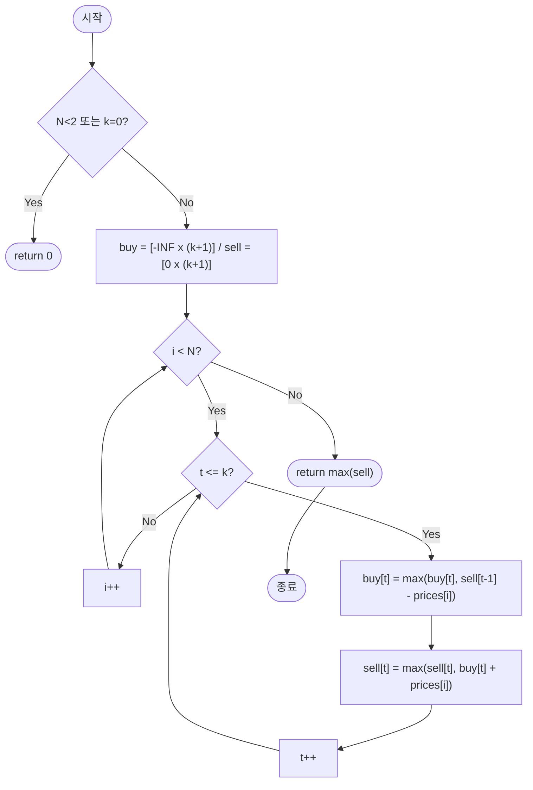

import { AlgorithmSimulation } from "#guide-sim";

# bestTimeToBuyAndSellStockK — 거래 번호와 날짜를 축으로 쪼개면 지수 폭발이 다항식으로 무너지는 이유

## 한눈에 보는 컨셉

최대 `k`번까지 거래할 수 있을 때, 날짜별 주가로 얻을 수 있는 최대 이익을 구하는 문제예요. 핵심 관찰은 "거래 횟수 `t`"와 "날짜 `i`"를 서로 다른 축으로 분리해서, 각 거래 번호마다 딱 두 개의 상태(`t`번째 매수를 마친 상태 / `t`번째 매도를 마친 상태)만 추적하면 된다는 것입니다. 이렇게 하면 조합적으로 폭발하던 완전 탐색이 `O(Nk)` 동적 계획법으로 줄고, 하루하루 상태를 굴려 나가듯 갱신하면 공간도 `O(k)`로 압축됩니다.

## 출발점: 가장 순진한 방법부터

문제를 먼저 정확히 잡을게요.

```ts
function bestTimeToBuyAndSellStockK(k: number, prices: number[]): number
```

| 파라미터 | 의미 | 제약 |
|----------|------|------|
| `k` | 허용되는 최대 매수·매도 쌍의 수 | $0 \leq k \leq 100$ |
| `prices` | 날짜 순서로 정렬된 주식 종가 배열 | $1 \leq N \leq 1{,}000$, $0 \leq prices[i] \leq 10{,}000$ |

반환값은 최대 `k`번의 매수·매도 쌍으로 얻을 수 있는 최대 이익입니다. 동시에 두 주식을 보유할 수 없고(팔아야 다시 살 수 있음), 같은 날 팔고 바로 사는 것은 허용됩니다. 거래를 전혀 하지 않아도 되며 그 경우 이익은 `0`이에요.

최댓값을 구하는 문제이니, 가장 정직한 출발은 **가능한 모든 거래 조합을 나열해서 최댓값을 취하는 것**입니다. 매수일과 매도일을 겹치지 않게 `k`쌍 고르는 모든 경우를 재귀로 뽑아 봅시다.

```ts
function naiveCombinations(k: number, prices: number[]): number {
  const n = prices.length;
  if (n < 2 || k === 0) return 0;

  let best = 0;

  // startDay 이후로, remainingK개의 매수-매도 쌍을 더 고를 수 있다.
  function search(startDay: number, remainingK: number, profit: number) {
    best = Math.max(best, profit);
    if (remainingK === 0) return;
    for (let buyDay = startDay; buyDay < n; buyDay++) {
      for (let sellDay = buyDay + 1; sellDay < n; sellDay++) {
        search(sellDay + 1, remainingK - 1, profit + (prices[sellDay]! - prices[buyDay]!));
      }
    }
  }

  search(0, k, 0);
  return best;
}
```

이 함수가 실제로 몇 번이나 재귀 호출을 하는지 세어 보면(실측):

```text
N=6,  k=2  →  재귀 호출 31회
N=10, k=3  →  재귀 호출 466회
N=14, k=4  →  재귀 호출 7,099회
```

원소와 `k`가 겨우 몇 개 늘었을 뿐인데 호출 수가 수십 배씩 뜁니다. 실제 제약은 `N=1,000`, `k=100`이니, 이 나열이 도달할 조합의 수는 사실상 셀 수 없는 수준이에요 — 매수·매도 날짜를 겹치지 않게 `k`쌍 고르는 방법의 수는 $N$과 $k$가 커질수록 조합적으로 폭발합니다.

그런데 나열 과정을 가만히 보면 낌새가 하나 보입니다. `search`가 매번 하는 일은 결국 "지금까지 이익이 얼마인지"와 "몇 번 거래를 더 쓸 수 있는지" 두 가지뿐이에요. 구체적으로 **어느 날 샀고 어느 날 팔았는지**는 최종 답에 전혀 중요하지 않습니다. **거래 횟수와 날짜라는 두 축으로 상태를 압축할 수 있지 않을까?** — 이것이 이번 알고리즘의 출발 단서입니다.

## 아이디어 자세히 들여다보기

### 거래 번호와 날짜를 축으로 쪼개보기 — 수식과 그림

날짜 `i`까지 살펴봤다고 가정하고, 두 가지 상태만 정의해 봅시다.

$$buy[t][i] = \text{0..}i\text{일 중에서 }t\text{번째 매수까지 마친 상태의 최대 누적 이익}$$

$$sell[t][i] = \text{0..}i\text{일 중에서 }t\text{번째 매도까지 마친 상태의 최대 누적 이익}$$

왜 하필 "거래 번호 `t`"를 상태에 넣어야 할까요? `(날짜, 보유 여부)`만으로 상태를 잡으면, 지금까지 몇 번 거래했는지가 사라져서 `k`번 제한을 검사할 방법이 없습니다. 거래 횟수 제한이 있는 문제이니 제한을 지키는지 확인할 축이 상태 안에 반드시 있어야 해요.

작은 예로 손을 움직여 봅시다. `prices = [3, 2, 6, 5, 0, 3]`, `t = 1`(첫 거래)만 놓고 `i = 0, 1, 2`까지 채워 보면:

```text
i         0     1     2
price     3     2     6

buy[1][i]  -3    -2    -2   ← "0일에 사기"(-3)와 "그 전 상태 유지" 중 더 큰 값
sell[1][i]  0     0     4   ← i=2에서 buy[1][1]=-2로 6에 팔면 -2+6=4 (최댓값 갱신)
```

$buy[1][2] = -2$는 "1일(가격 2)에 산 채로 아직 안 판 상태"를 뜻하고, $sell[1][2] = 4$는 그 매수를 2일(가격 6)에 팔아 이익 $4$를 확정한 상태예요. 확인 질문 하나 — `sell[0][i]`는 `i`가 몇이든 항상 어떤 값이어야 할까요? 답은 **항상 `0`**입니다. 거래를 0번으로 제한했으니 어떤 날짜를 봐도 이익은 늘 `0`이어야 하죠.

### 단서를 설명해 주는 이론 — 최적 부분 구조와 상태 압축(마르코프 성질)

방금 쓴 상태 정의가 왜 동작하는지는 동적 계획법의 두 조건으로 설명됩니다.

**최적 부분 구조(optimal substructure)**: `t`번째 거래까지의 최적해는 `(t-1)`번째 거래까지의 최적해 위에서만 만들어집니다. `t`번째 매수를 어디서 하든, 그 전에 `(t-1)`번 거래로 벌 수 있는 최대 이익이 `sell[t-1]`이라면, 그 값 위에 `t`번째 거래를 얹는 것이 항상 최선이에요. 더 낮은 `(t-1)`번 거래 이익 위에 `t`번째를 얹어서 전체 최적이 되는 경우는 없습니다.

**마르코프 성질(Markov property)**: `buy[t][i]`와 `sell[t][i]`라는 숫자 하나씩만 있으면, 그 값이 "정확히 어느 날 샀고 어느 날 팔았는지"를 몰라도 다음 결정을 내리는 데 아무 지장이 없습니다. 과거의 경로 전체가 아니라 "지금까지 확보한 이익"이라는 **요약값**만 넘겨주면 충분하다는 뜻이에요. 이 성질이 뒤에서 배열을 2차원에서 1차원으로 굴려 압축할 때 다시 소환됩니다 — 기억해 두세요.

### 왜 모순 없이 작동하는가

이 알고리즘이 지키는 불변식은 다음과 같습니다.

> 날짜 `i`까지 처리를 마친 시점에, 모든 `t`에 대해 `buy[t][i]`는 "0..i일 중 t번째 매수를 완료하고 아직 보유 중인 최선의 누적 이익"이고, `sell[t][i]`는 "0..i일 중 최대 t번 거래로 얻을 수 있는 최선의 누적 이익"이다.

**기저(귀납 시작점)**: 날짜를 하나도 안 본 상태에서 `sell[0]`은 항상 `0`(거래 0번이니 이익도 0), `buy[t]`(`t ≥ 1`)는 아직 아무것도 사지 않았으니 `-∞`(도달 불가능한 상태를 표시)로 둡니다. 이 두 초기값이 배열 채우기(`fill`)로 이미 반영됩니다.

**귀납 단계(날짜 `i-1` → `i`)**: 날짜 `i`에 `buy[t]`가 취할 수 있는 행동은 정확히 두 가지뿐입니다 — ① 아무것도 안 하고 전날 상태를 그대로 유지, ② 오늘 `t`번째로 매수(직전까지 `(t-1)`번 거래를 마친 `sell[t-1]`에서 오늘 가격을 뺀다). 이 둘 외의 제3의 선택지는 없습니다(보유 중이 아니라면 살 수만 있고, 이미 보유 중이면 유지할 수만 있어요). 각 경우 중 더 큰 쪽을 취하면 그 경우 안에서는 최적이고, 두 경우가 전부이니 `max`가 전체 최적이 됩니다. `sell[t]`도 같은 논리로 "유지" 또는 "오늘 매도"만 존재합니다. 이 논증이 모든 `i`, `t`에서 반복되므로, 마지막 날 `N-1`까지 처리를 마치면 `sell[t][N-1]`은 정확히 "최대 `t`번 거래로 얻는 최선의 이익"이 됩니다.

한 가지만 더 확인할게요. 거래 횟수를 더 준다고 손해를 볼 수 있을까요? 아닙니다 — `sell[t] \geq sell[t-1]` (완료된 값 기준)이 항상 성립하는데, 그 이유는 "오늘 사서 오늘 판다"라는 이익 `0`짜리 선택지가 항상 존재하기 때문이에요. 여분의 거래 기회를 이렇게 소모하면 이익이 늘지도 줄지도 않으니, 예산이 많다고 손해 볼 일은 없습니다.

여기서 **헷갈리기 쉬운 포인트**가 둘 있습니다.

- **루프 순서: 날짜 `i`가 바깥, 거래 번호 `t`가 안쪽이어야 합니다.** 만약 거꾸로 `t`를 바깥, `i`를 안쪽에 두면 어떻게 될까요? `t`번째 거래를 계산할 때 참조하는 `sell[t-1]`이 "지금까지의 날짜"가 아니라 **전체 `N`일을 다 본 뒤의 최종값**이 되어 버립니다. 그러면 `t`번째 매수가 `(t-1)`번째 매도보다 **시간상 앞선 날짜**에서 일어나는 것도 허용되는 모순이 생겨요.

```text
prices = [3, 2, 6, 5, 0, 3], k=2, 올바른 답 = 7

루프를 t 바깥 / i 안쪽으로 두면:
  t=1 완료 후 sell[1] = 4 (1일에 사서 2일에 판 거래)
  t=2 루프에서 sell[1]=4를 "고정값"처럼 참조 → buy[2] = sell[1] - price[0] = 4 - 3 = 1
  즉 "2번째 매수"가 0일(price=3)에 일어나는데, 이건 1번째 거래의 매도일(2일)보다 앞선 날짜!
  결과: 8  ← 실측으로 재현됨(정답 7보다 큼 = 시간 역행으로 이익이 부풀려짐)
```

즉 `i`를 바깥에 둬야 `sell[t-1]`이 "오늘까지의 날짜"만 반영하는 인과적인 값이 됩니다. `t`를 안쪽에 두면(오름차순이든 내림차순이든) 이 인과성이 지켜집니다.

- **`buy`의 초기값은 반드시 `-∞`여야 하고, `0`이면 안 됩니다.** `0`으로 두면 "아직 한 번도 안 샀는데 이익이 `0`인 상태"가 되어, 매수를 실제로 하지 않고도 매도 이익을 챙기는 모순된 전이가 생겨요.

```text
k=1, prices=[5, 1], 올바른 답 = 0 (하락만 하니 거래 안 하는 게 최선)

buy[1] 초기값을 0으로 두면:
  i=0(가격5): sell[1] = max(0, buy[1]+5) = max(0, 0+5) = 5  ← 사지도 않았는데 판 것처럼 이익 5 발생
  결과: 5  ← 실측으로 재현됨(정답 0과 다름 = "공짜로 산 척"하는 유령 매수)
```

엣지 케이스에서도 이 불변식이 깨지지 않는지 점검해 둘게요.

```text
k = 0                     → buy/sell 루프 자체를 안 돔, 반환 0
N < 2 (원소 0~1개)        → 매도할 날이 없음, 반환 0
계속 하락하는 배열         → 모든 buy[t] < 0으로 남고 sell[t]는 0에서 안 움직임, 반환 0
k >= floor(N/2)            → 사실상 무제한 거래와 동치(뒤에서 다시 다룹니다)
```

## 아이디어를 코드로 옮기기

방금 세운 정의를 그대로 2차원 배열로 옮긴 기본 구현입니다.

```ts
function bestTimeToBuyAndSellStockKBasic(k: number, prices: number[]): number {
  const n = prices.length;
  if (n < 2 || k === 0) return 0;

  // buy[t][i]: 0..i일 중에서 t번째 매수까지 완료한 상태의 최대 누적 이익
  // sell[t][i]: 0..i일 중에서 t번째 매도까지 완료한 상태의 최대 누적 이익
  const buy: number[][] = Array.from({ length: k + 1 }, () =>
    new Array<number>(n).fill(-Infinity),
  );
  const sell: number[][] = Array.from({ length: k + 1 }, () =>
    new Array<number>(n).fill(0),
  );

  for (let i = 0; i < n; i++) {
    for (let t = 1; t <= k; t++) {
      const carryBuy = i > 0 ? buy[t]![i - 1]! : -Infinity;
      const carrySell = i > 0 ? sell[t]![i - 1]! : 0;
      buy[t]![i] = Math.max(carryBuy, sell[t - 1]![i]! - prices[i]!);
      sell[t]![i] = Math.max(carrySell, buy[t]![i]! + prices[i]!);
    }
  }

  let best = 0;
  for (let t = 0; t <= k; t++) best = Math.max(best, sell[t]![n - 1]!);
  return best;
}
```

결정 지점 위주로만 짚을게요. 초기값은 `buy`는 `-Infinity`, `sell`은 `0`(위 불변식 그대로). 순회 방향은 **날짜 `i`가 바깥, 거래 번호 `t`가 안쪽**이어야 `sell[t-1][i]`가 "오늘까지"만 반영합니다. `t` 루프가 `1`부터 시작하는 이유는 `sell[0]`은 항상 `0`으로 고정(거래 0번)이라 갱신할 필요가 없기 때문이에요.

**가장 실수가 잦은 줄은 `carryBuy` / `carrySell`을 구하는 삼항 연산입니다.** `i = 0`일 때는 "전날"이 없으므로 `buy[t][-1]`, `sell[t][-1]`은 배열에 아예 존재하지 않아요(자바스크립트에서는 `undefined`가 됩니다). 이걸 그냥 `buy[t][i-1]`로 읽어 버리면 `undefined`가 산술 비교에 섞여 들어가 `NaN`으로 오염됩니다. 그래서 "전날이 없으면 초기값과 같은 값을 쓴다"는 규칙을 명시적으로 넣어야 해요.

## 더 빠르게 만들 단서 찾기

이 2차원 구현이 실제로 각 칸에서 읽는 값을 표시해 봅시다.

```text
2차원 표 (행: t, 열: i)

           i-1      i
  t-1:      .      [sell[t-1][i]] ← 오늘 값(같은 열 i, 이미 갱신됨)
  t  :  [buy/sell   [buy[t][i], sell[t][i]] ← 지금 채우는 칸
         [t][i-1]]  ↑ 어제 값(왼쪽 열, 같은 행)

buy[t][i]  는  buy[t][i-1]  과  sell[t-1][i]  딱 두 칸만 읽는다
sell[t][i] 는  sell[t][i-1] 과  buy[t][i]     딱 두 칸만 읽는다
```

한 칸을 채우는 데 필요한 정보는 "어제의 같은 행"과 "오늘의 바로 위 행" 딱 두 개뿐입니다. 그런데 `buy`와 `sell` 배열은 `(k+1) × N` 크기를 통째로 들고 있어요 — 앞서 말한 **마르코프 성질**(과거 경로가 아니라 숫자 하나만 있으면 충분하다는 성질) 덕분에, 사실 이 큰 표 대부분은 채워진 순간 다시는 읽히지 않는 죽은 메모리입니다. `N = 1{,}000, k = 100`이면 배열 두 개가 각각 `100{,}100`칸인데, 실제로 동시에 필요한 칸은 "어제 값"과 "오늘 값"뿐이에요.

## 단서를 최적화로 연결하기

날짜 축을 통째로 없애고, `t`마다 값 하나씩만 들고 있는 1차원 배열로 굴려 봅시다.

```text
Before: buy[t][i], sell[t][i]         — (k+1) × N 크기, i별로 따로 저장
After : buy[t],    sell[t]            — (k+1) 크기, "지금까지의 최선"만 계속 덮어씀
```

핵심은 **덮어쓰지 않으면 자동으로 어제 값이 유지된다**는 점입니다. 날짜 `i`에서 `buy[t]`를 갱신하지 않으면, 그 칸은 여전히 어제(`i-1`)에 채워 둔 값 그대로예요 — 앞서 `carryBuy`로 명시했던 "전날 값 유지"가 배열을 굴리는 것만으로 공짜로 됩니다. 그리고 `t`를 안쪽 루프로 두면, `sell[t-1]`을 읽는 시점에 그 값은 이미 "오늘 날짜까지" 갱신이 끝난 상태라 인과성도 그대로 지켜져요. 불변식은 하나로 요약됩니다: **`buy[t]`, `sell[t]`는 항상 "지금까지 관측한 날짜 프리픽스에서의 최선"을 담고 있다.**

## 최적화 코드

2차원 배열에서 날짜 차원만 걷어내면 이렇게 됩니다.

```ts
function bestTimeToBuyAndSellStockK(k: number, prices: number[]): number {
  const n = prices.length;
  if (n < 2 || k === 0) return 0;

  const buy = new Array<number>(k + 1).fill(-Infinity);
  const sell = new Array<number>(k + 1).fill(0);

  for (let i = 0; i < n; i++) {
    for (let t = 1; t <= k; t++) {
      buy[t] = Math.max(buy[t]!, sell[t - 1]! - prices[i]!);
      sell[t] = Math.max(sell[t]!, buy[t]! + prices[i]!);
    }
  }

  let best = 0;
  for (let t = 0; t <= k; t++) best = Math.max(best, sell[t]!);
  return best;
}
```

기본 구현과 달라진 부분은 딱 두 가지예요 — `buy`, `sell`이 `number[][]`에서 `number[]`로 바뀌었고, `i > 0 ? ... : ...` 가드가 사라졌습니다(배열이 알아서 어제 값을 들고 있으니까요).

**가장 중요한 줄은 이중 루프의 순서, `for (i ...) { for (t ...) { ... } }`입니다.** 앞 절의 "왜 모순 없이 작동하는가"에서 실측으로 보였듯, 이 순서를 뒤집으면(`t` 바깥, `i` 안쪽) 같은 입력(`k=2, prices=[3,2,6,5,0,3]`)에서 정답 `7`이 아니라 `8`이 나옵니다 — 시간이 거꾸로 흐르는 거래가 허용되기 때문이에요.

> 기억법: **"오늘 하루를 다 살아야 내일로 넘어간다"** — 날짜가 바깥 루프여야 `sell[t-1]`이 "지금까지"만 아는 값이 됩니다.

| 접근 방식 | 시간 | 공간 | 비고 |
|-----------|------|------|------|
| 완전 탐색 (조합 나열) | 조합적 폭발 | $O(k)$ | $N=1{,}000$에서 불가능 |
| 2D DP `buy[t][i]`, `sell[t][i]` | $O(Nk)$ | $O(Nk)$ | 정확하지만 공간 낭비 |
| 1D 롤링 DP | $O(Nk)$ | $O(k)$ | 최종 |

$N \le 1{,}000$, $k \le 100$이므로 $N \cdot k \le 10^5$ — 목표 복잡도 $O(Nk)$면 충분히 통과합니다(실측: $N=1{,}000, k=100$ 무작위 입력에서 2ms 이내). 매 날짜마다 매 거래 번호에 대해 최소 한 번은 "사거나 팔거나 유지"를 결정해야 하므로, 이 DP 구조 안에서는 $O(Nk)$ 아래로 더 줄이기 어렵습니다.

더 최적화할 여지가 있을까요? 일반적인 `k`에 대해서는 이 자리가 사실상 끝입니다. 다만 **`k`가 `⌊N/2⌋` 이상이면 사실상 무제한 거래**와 같아지는 특수한 경우가 있고, 이때는 연속하는 상승 구간을 그리디하게 모두 취하는 $O(N)$ 특화 해법이 존재합니다(실측으로 교차검증: `prices=[1,2,3,4,5]`에서 두 방식 모두 `4`를 반환). 그럼에도 이 자리에서 일반 `k`용 $O(Nk)$ DP를 배우는 이유는 **어떤 `k`값에도 그대로 적용되는 범용성** 때문이에요 — `k`가 작을 때(예: `k=1,2`)는 특화가 통하지 않지만 이 DP는 그대로 작동합니다.

## 실행 시각화

입력 `k = 2`, `prices = [3, 2, 6, 5, 0, 3]`에 대해 위 1차원 롤링 DP를 실행하는 과정입니다. 날짜 `i`를 바깥, 거래 번호 `t`를 안쪽 루프로 돌려 같은 날 안에서 `t=1 → t=2` 순으로 갱신합니다(그래야 `sell[t-1]`이 그 날까지의 매도만 반영합니다). `array` 패널의 `highlight`(빨강)는 처리 중인 날 `i`이고, `keyValue` 패널은 `buy[1..2]`(t번 매수 완료 최대 이익)와 `sell[1..2]`(t번 매도 완료 최대 이익)의 스냅샷입니다.

실제 반환값은 `7`이며(거래 `[2,6]`으로 +4, `[0,3]`으로 +3), 시뮬레이션 마지막 프레임의 `max(sell)`과 일치합니다.

> 대화형 시뮬레이션은 MDX 런타임에서 표시됩니다.

export const prices = [3, 2, 6, 5, 0, 3];

export const steps = [
  {
    title: "초기화",
    detail: "buy = [-INF, -INF], sell = [0, 0] (인덱스는 거래 번호 t=1,2). sell[0]=0 기준.",
    array: prices,
    entries: [
      { label: "buy[1], buy[2]", value: "-INF, -INF" },
      { label: "sell[1], sell[2]", value: "0, 0" },
    ],
  },
  {
    title: "i=0, prices[0]=3",
    detail: "t=1: buy[1]=max(-INF,0-3)=-3, sell[1]=max(0,-3+3)=0. t=2: buy[2]=-3, sell[2]=0.",
    array: prices,
    highlight: [0],
    entries: [
      { label: "buy[1], buy[2]", value: "-3, -3" },
      { label: "sell[1], sell[2]", value: "0, 0" },
    ],
  },
  {
    title: "i=1, prices[1]=2",
    detail: "t=1: buy[1]=max(-3,0-2)=-2, sell[1]=0. t=2: buy[2]=max(-3,0-2)=-2, sell[2]=0.",
    array: prices,
    highlight: [1],
    entries: [
      { label: "buy[1], buy[2]", value: "-2, -2" },
      { label: "sell[1], sell[2]", value: "0, 0" },
    ],
  },
  {
    title: "i=2, prices[2]=6",
    detail: "t=1: sell[1]=max(0,-2+6)=4 (저점 2 매수→6 매도). t=2: buy[2]=max(-2,4-6)=-2, sell[2]=max(0,-2+6)=4.",
    array: prices,
    highlight: [2],
    entries: [
      { label: "buy[1], buy[2]", value: "-2, -2" },
      { label: "sell[1], sell[2]", value: "4, 4" },
    ],
  },
  {
    title: "i=3, prices[3]=5",
    detail: "t=1: sell[1]=max(4,-2+5=3)=4 유지. t=2: buy[2]=max(-2,4-5=-1)=-1, sell[2]=max(4,-1+5=4)=4.",
    array: prices,
    highlight: [3],
    entries: [
      { label: "buy[1], buy[2]", value: "-2, -1" },
      { label: "sell[1], sell[2]", value: "4, 4" },
    ],
  },
  {
    title: "i=4, prices[4]=0",
    detail: "t=1: buy[1]=max(-2,0-0=0)=0. t=2: buy[2]=max(-1,sell[1]-0=4)=4 (이익 4 들고 0원에 재매수).",
    array: prices,
    highlight: [4],
    entries: [
      { label: "buy[1], buy[2]", value: "0, 4" },
      { label: "sell[1], sell[2]", value: "4, 4" },
    ],
  },
  {
    title: "i=5, prices[5]=3",
    detail: "t=1: sell[1]=max(4,0+3=3)=4. t=2: sell[2]=max(4,buy[2]+3=4+3=7)=7 (0원 매수→3 매도).",
    array: prices,
    highlight: [5],
    entries: [
      { label: "buy[1], buy[2]", value: "0, 4" },
      { label: "sell[1], sell[2]", value: "4, 7" },
    ],
  },
  {
    title: "완료: max(sell) = 7",
    detail: "순회 종료. sell=[4,7] 중 최댓값 7. 두 거래 [2,6](+4)와 [0,3](+3).",
    array: prices,
    entries: [
      { label: "sell[1], sell[2]", value: "4, 7" },
      { label: "결과 max(sell)", value: 7 },
    ],
  },
];

<AlgorithmSimulation view={["array", "keyValue"]} steps={steps} title="주식 매매 최대 k회: k=2, prices=[3,2,6,5,0,3]" />

## 흐름 한눈에 보기



## 스스로 점검하기

1. `k=1, prices=[7,6,4,3,1]`(계속 하락)일 때 `buy[1]`, `sell[1]`이 날짜별로 어떻게 흘러가는지 손으로 채워 보세요. (`buy[1]`은 매일 더 낮은 가격을 만나며 계속 갱신되지만 한 번도 양수가 되지 않고, `sell[1]`은 끝까지 `0`에 머뭅니다 — 최종 답은 `0`이에요.)
2. 이중 루프를 "`t` 바깥, `i` 안쪽"으로 바꾸면 `k=2, prices=[3,2,6,5,0,3]`에서 정답이 `7`이 아니라 `8`이 됩니다. `sell[1]`이 어느 시점에 "미래의 날짜"를 반영해 버리는지, 그리고 그 값이 `buy[2]` 계산에 어떻게 섞여 드는지 단계별로 짚어 보세요.
3. `k`가 `⌊N/2⌋` 이상으로 충분히 크다고 알려진 경우, 이 DP를 그대로 돌리는 대신 어떤 관찰로 $O(N)$ 그리디로 바꿀 수 있을까요? (힌트: 이 경우 매수·매도 시점을 굳이 `k`쌍으로 묶을 필요 없이, 연속하는 상승 구간 하나하나를 독립된 거래로 봐도 됩니다.)
