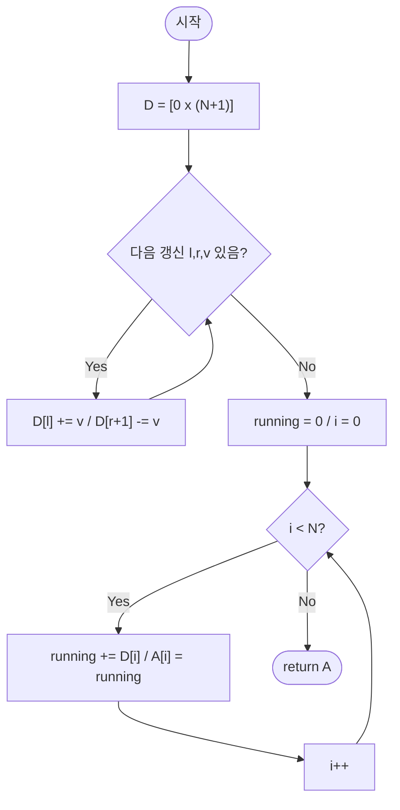

import { AlgorithmSimulation } from "#guide-sim";

# diffArrayRangeUpdate — 구간을 통째로 손대지 않고 경계 두 점만 기록하는 이유

## 한눈에 보는 컨셉

길이 `N`인 배열에 구간 `[l, r]`마다 값 `v`를 더하는 갱신을 `Q`번 수행한 뒤, 마지막에 전체 배열 상태를 한 번만 돌려주면 되는 문제예요. 매 갱신을 배열에 직접 반영하는 대신, 구간이 **시작되는 지점**과 **끝난 직후 지점** 두 곳에만 흔적을 남기고, 모든 갱신이 끝난 뒤 누적합 한 번으로 실제 배열을 복원합니다. 이 관찰 덕분에 갱신은 `O(1)`, 복원은 `O(N)`으로 전체 `O(N+Q)`에 끝나요.

## 출발점: 가장 순진한 방법부터

문제를 먼저 정확히 잡을게요.

```ts
function diffArrayRangeUpdate(
  N: number,
  updates: Array<[number, number, number]>,
): number[]
```

| 파라미터 | 의미 | 제약 |
|----------|------|------|
| `N` | 배열 길이(초기값은 모두 `0`) | $1 \leq N \leq 100{,}000$ |
| `updates` | 구간 갱신 목록 $[(l, r, v), \ldots]$ | $0 \leq l \leq r \leq N-1$, $-10{,}000 \leq v \leq 10{,}000$, 갱신 개수 $Q \leq 100{,}000$ |

**반환값**: 모든 갱신 `[l, r, v]`(각 인덱스 `i`에서 `l ≤ i ≤ r`일 때 `A[i] += v`)를 순서대로 적용한 뒤의 길이 `N` 배열입니다.

"구간에 값을 더하라"는 요청을 있는 그대로 읽으면, 가장 정직한 구현은 **그 구간을 순회하며 하나씩 더하는 것**입니다. 문제 정의 자체가 순회를 지시하는 형태라 이게 자연스러운 첫 시도예요.

```ts
function diffArrayRangeUpdateNaive(
  N: number,
  updates: Array<[number, number, number]>,
): number[] {
  const A = new Array<number>(N).fill(0);
  for (const [l, r, v] of updates) {
    for (let i = l; i <= r; i++) A[i] += v; // 구간을 매번 통째로 순회
  }
  return A;
}
```

작은 예로 비용을 세어 봅시다. `N=5`, `updates=[[1,3,2],[0,2,-1]]`이면:

```text
갱신 (1,3,2): i=1,2,3 방문 → 3칸
갱신 (0,2,-1): i=0,1,2 방문 → 3칸
총 방문 칸 수 = 3 + 3 = 6칸
```

이 정도는 아무렇지 않아 보이지만, 제약을 그대로 대입하면 얘기가 달라집니다. `N`과 `Q`가 각각 최대 `100,000`이고 각 갱신이 구간 전체(`l=0, r=N-1`)를 덮는 최악의 경우:

```text
갱신 1개당 최대 방문 = N = 100,000
갱신 개수            = Q = 100,000
총 방문 칸 수         = N × Q = 10,000,000,000  (10^10)
```

1초에 대략 `10^8`~`10^9`번 수준의 단순 연산을 처리할 수 있다고 잡아도 `10^10`은 시간 제한을 크게 넘깁니다. **목표 복잡도는 갱신 전체를 합쳐 `O(N+Q)`** 정도까지 낮춰야 해요.

낭비의 정체는 "같은 칸을 여러 갱신이 겹쳐서 방문할 때마다 매번 다시 써넣는다"는 점입니다. 겹치는 구간을 인덱스별로 다시 훑지 않고, **이 구간이 어디서 시작해서 어디서 끝나는지만 기억해 둘 수는 없을까** — 이게 다음 절의 출발점입니다.

## 아이디어 자세히 들여다보기

### 구간을 경계 이벤트로 압축하기 — 수식과 그림

길이 `N+1`짜리 **차분 배열(difference array)** `D`를 하나 둡니다(끝에 여분 칸 하나를 더 두는 이유는 잠시 뒤에 나와요). 구간 갱신 `update(l, r, v)`를 배열 전체에 즉시 반영하는 대신, `D`에 딱 두 자리만 건드립니다.

$$D[l] \mathrel{+}= v, \qquad D[r+1] \mathrel{-}= v$$

그림으로 보면, 구간 `[1,3]`에 `+2`를 적용하는 갱신 하나가 이렇게 압축됩니다.

```text
목표: A = [0, 2, 2, 2, 0]   (인덱스 1,2,3에 +2)

D 이전: [0, 0, 0, 0, 0, 0]
         D[1] += 2 ─┐          D[4] -= 2 ─┐
                     ▼                     ▼
D 이후: [0, 2, 0, 0, -2, 0]
         ↑ "여기서부터 +2 시작"   ↑ "여기서부터 +2 취소"
```

잠깐, 확인 하나만 해 볼까요? 구간 `[2,4]`에 `+7`을 기록하려면 `D`의 어느 인덱스에 무엇을 더해야 할까요? — 정답은 `D[2] += 7`, `D[5] -= 7`입니다. 시작 인덱스에는 그대로 더하고, **끝난 다음 칸**에서 되돌려 놓는다는 규칙만 지키면 됩니다.

**왜 하필 `D[r+1]`이어야 할까요?** `D[r]`에 `-v`를 기록하면 어떻게 되는지 같은 예로 대비해 봅시다.

```text
올바른 버전  D[r+1] -= v:  D = [0, 2, 0,  0, -2, 0]  →  A = [0, 2, 2, 2, 0]
잘못된 버전  D[r]   -= v:  D = [0, 2, 0, -2,  0, 0]  →  A = [0, 2, 2, 0, 0]
                                                                     ↑
                                                     인덱스 3(=r)이 잘려나감
```

`D[r]`에서 빼면 누적합이 인덱스 `r`에 도달하는 **바로 그 순간** `+v`가 취소되어 버려서, 정작 갱신 대상이어야 할 `r` 자신이 효과를 못 받습니다. "구간이 끝난 **다음** 칸에서 취소한다"는 `+1`이 반드시 필요한 이유가 바로 이거예요.

이제 두 개의 갱신을 순서대로 적용해 실제 예시로 채워 봅시다. `N=5`, `updates=[[1,3,2],[0,2,-1]]`입니다.

| 단계 | 연산 | D |
|------|------|---|
| 초기 | — | `[0, 0, 0, 0, 0, 0]` |
| 갱신 (1,3,2) | `D[1]+=2`, `D[4]-=2` | `[0, 2, 0, 0, -2, 0]` |
| 갱신 (0,2,-1) | `D[0]+=-1`, `D[3]-=-1` | `[-1, 2, 0, 1, -2, 0]` |

두 갱신 모두 `D`에서 딱 두 자리씩만 건드렸을 뿐, 배열 전체를 순회하지 않았다는 점을 확인하세요.

### 단서를 설명해 주는 이론 — 이산 미분·적분과 선형성(linearity)

방금 만든 `D`가 왜 하필 "시작에서 `+v`, 끝+1에서 `-v`" 형태인지, 그리고 여러 갱신을 왜 그냥 더하기만 해도 되는지를 일반적인 언어로 승격해 봅시다.

배열 `A`에 대해 **이산 미분(discrete derivative)**과 그 역연산인 **이산 적분(prefix sum)**을 정의합니다.

$$\Delta A[i] = A[i] - A[i-1] \quad (A[-1] \equiv 0), \qquad A[i] = \sum_{k=0}^{i} \Delta A[k]$$

구간 `[l,r]`에 `v`를 더하는 갱신 하나는, 결과적으로 "`l`부터 `r`까지는 `v`, 그 외에는 `0`"인 계단 함수를 `A`에 더하는 일입니다. 이 계단 함수를 직접 미분(`Δ`)해 보면, 값이 바뀌는 지점 딱 두 곳에서만 `0`이 아닌 값이 나옵니다 — `i=l`에서 `+v`(0에서 v로 뛰어오름), `i=r+1`에서 `-v`(v에서 0으로 떨어짐). 이게 정확히 `D`의 정의예요. **`D`는 우리가 원하는 결과 배열의 이산 미분 그 자체**인 겁니다.

`Δ`와 그 역연산인 누적합은 **선형(linear) 연산자**입니다.

$$\Delta(A_1 + A_2) = \Delta A_1 + \Delta A_2$$

즉 여러 갱신이 만드는 각각의 "이상적인 결과 배열"을 다 더한 게 최종 `A`라면, 그 미분(`D`)도 각 갱신의 `D`를 그냥 더한 것과 같습니다. 이것이 `Q`개의 갱신을 처리할 때 순서와 상관없이 `D[l] += v`, `D[r+1] -= v`를 그때그때 누적해도 되는 이유예요 — **선형성에 의한 중첩(superposition)**이 갱신 순서 교환을 정당화합니다. 이 성질은 바로 다음 절의 귀납 증명에서 다시 쓸 것이니 기억해 두세요.

### 왜 모순 없이 작동하는가

갱신을 하나씩 적용해 가는 과정을 갱신 개수 `k`에 대한 귀납법으로 증명합니다.

**기저(k=0)**: 갱신이 없으면 `D`는 전부 `0`이고, 복원한 `A`도 전부 `0`입니다. 문제 정의상 "갱신 없음 → 전부 0"과 정확히 일치합니다.

**귀납 단계**: `k`개의 갱신을 처리한 뒤 `D`의 누적합이 정확한 `A_k`(그 `k`개 갱신만 반영된 배열)를 만든다고 가정합니다. `(k+1)`번째 갱신 `(l,r,v)`를 처리하면 `D[l] += v`, `D[r+1] -= v`가 추가됩니다. 앞 절의 선형성에 의해, 새 누적합은 "기존 누적합" + "이 갱신 하나만 있었을 때의 누적합"입니다. 그런데 갱신 하나만 있을 때의 누적합은 인덱스 `i`에 대해 정확히 세 경우로 나뉘고, 각 경우가 모두 옳다는 것을 확인할 수 있습니다.

- $i < l$: `D[l]`의 `+v`가 아직 누적에 포함되지 않아 이 갱신의 효과 $=0$
- $l \leq i \leq r$: `D[l]`의 `+v`는 포함, `D[r+1]`의 `-v`는 아직 포함되지 않아 효과 $=+v$
- $i > r$: `D[l]`의 `+v`와 `D[r+1]`의 `-v`가 모두 포함되어 효과 $=0$

`l ≤ r`이 항상 성립하므로(제약 조건), 임의의 인덱스 `i`는 이 세 경우 중 정확히 하나에만 속합니다 — 빠지는 경우가 없습니다. 따라서 `A_{k+1}[i] = A_k[i] + v·1[l≤i≤r]`이 정확히 성립하고, 이는 우리가 원하는 정의(`(k+1)`개 갱신이 반영된 배열)와 같습니다. 귀납이 닫히므로, `Q`개 갱신 후 최종 `A[i] = Σ(l≤i≤r인 갱신들의 v)`가 정확히 성립합니다.

**여기서 헷갈리기 쉬운 포인트는 `D[r+1] -= v`를 깜빡 빠뜨리는 것입니다.** 대표 예시 `N=5, updates=[[1,3,2],[0,2,-1]]`에서 첫 번째 갱신만 이 이벤트를 빠뜨렸다고 해 봅시다.

```text
빠뜨린 D: D[1]+=2 (O), D[4]-=2 (누락!)
          D[0]+=-1, D[3]+=1 은 정상 기록
        → D = [-1, 2, 0, 1, 0, 0]

복원하면: A = [-1, 1, 1, 2, 2]
                            ↑
             원래는 0이어야 할 인덱스 4가 2로 "새어나감"

올바른 A: [-1, 1, 1, 2, 0]
```

`+2`라는 효과가 `r=3`을 넘어서도 계속 살아남아 인덱스 4까지 오염시킵니다. `D[r+1] -= v`는 장식이 아니라 "여기서부터는 효과가 끝난다"는 취소 신호 그 자체예요.

엣지 케이스도 짚어 둡니다.

```text
updates = []                   → D 전부 0 → A 전부 0                          (정상)
N = 1, updates=[[0,0,10000]]   → D=[10000, -10000], A=[10000]                  (경계 최대값)
r = N-1인 갱신(전체 구간 갱신)  → D[N]에 -v가 기록되지만 복원 루프는 i<N까지만  (D[N]은 안전 버퍼, 실제로 읽히지 않아도 무방)
같은 구간을 겹쳐 갱신          → 여러 갱신의 D 이벤트가 선형적으로 합산됨      (교환법칙)
```

## 아이디어를 코드로 옮기기

```ts
function diffArrayRangeUpdate(
  N: number,
  updates: Array<[number, number, number]>,
): number[] {
  const D = new Array<number>(N + 1).fill(0);
  for (const [l, r, v] of updates) {
    D[l] += v;
    D[r + 1] -= v;
  }

  const A = new Array<number>(N);
  let running = 0;
  for (let i = 0; i < N; i++) {
    running += D[i];
    A[i] = running;
  }
  return A;
}
```

결정 지점만 짚을게요.

- `D`는 반드시 **`N+1` 크기**로 잡아야 합니다. `N` 크기로 잡으면 `r = N-1`인 갱신(전체 구간 갱신)에서 `D[N]` 접근 시 범위를 벗어납니다.
- **가장 실수가 잦은 줄은 `D[r + 1] -= v;`입니다.** 이 줄을 빠뜨리면 방금 확인한 대로 갱신 효과가 `r`을 넘어서까지 "새어나가는" 조용한 버그가 됩니다 — 예외가 던져지지 않으니 눈으로 결과를 대조하지 않으면 알아채기 어렵습니다.
- 복원 루프에서 `running`은 "지금까지의 `D` 합"을 들고 다니는 누적 변수예요. `running += D[i]`를 `A[i] = running` **전에** 해야 현재 인덱스의 경계 이벤트가 그 인덱스 자신에 반영됩니다.

공간을 조금 더 줄일 여지도 있습니다. `running`은 오직 바로 이전 인덱스까지의 누적값에만 의존하므로(`D[i]`는 `D[i-1]`까지의 누적에 더해지기만 하면 됩니다), 별도의 `A` 배열이나 `running` 변수 없이 `D[i] += D[i-1]`로 `D` 자체에 in-place 누적해도 동일한 값을 얻습니다. 시간 복잡도는 그대로 `O(N)`이지만 보조 배열 하나를 아낄 수 있는 선택지예요.

여기서 더 빠르게 만들 수 있을까요? 이 알고리즘에는 자연스러운 추가 개선 단계가 없습니다 — naive에서 diff array로 가는 도약이 "구간을 순회하는 대신 경계만 기록한다"는 단일 통찰이고, 이보다 더 잘게 쪼갤 중간 단계가 존재하지 않아요. 그리고 이 도약 자체가 이미 하한에 닿아 있습니다: 어떤 알고리즘이든 `Q`개의 갱신을 **읽기라도** 해야 하니 `Ω(Q)`가 강제되고, `N`칸짜리 배열을 **출력이라도** 해야 하니 `Ω(N)`이 강제됩니다. 따라서 `Ω(N+Q)`는 피할 수 없는 하한이고, 우리가 만든 `O(N+Q)` 풀이는 이 하한에 정확히 맞닿아 있어 점근적으로 더 줄일 여지가 없습니다.

다만 문제 패턴이 달라지면 얘기가 다릅니다. 만약 "모든 갱신이 끝난 뒤 한 번에 조회"가 아니라 **갱신과 조회가 섞여서 실시간으로** 들어온다면(예: 갱신 중간에 특정 인덱스 값을 즉시 알아야 하는 경우), 매번 누적합을 다시 계산해야 해서 이 방법은 비효율적입니다. 그런 상황에는 Fenwick Tree(BIT) 기반의 range-update/point-query 구조가 더 적합해요. 그럼에도 "갱신을 다 모은 뒤 전체 배열을 한 번만 본다"는 이 문제의 패턴에서는 차분 배열 쪽이 구현이 가장 단순하고 상수 인자도 가장 작습니다.

## 실행 시각화

입력 `N = 5`, `updates = [[1,3,2], [0,2,-1]]`에 대해 차분 배열로 구간 갱신을 처리하는 과정입니다. 위쪽 array 패널은 차분 배열 `D`(길이 `N+1=6`), keyValue 패널은 현재 단계 설명과 복원 중인 실제 배열 `A`의 스냅샷이에요. `highlight`(빨강)는 이번 단계에서 변경되는 인덱스입니다.

실제 반환값은 `[-1, 1, 1, 2, 0]`이며, 시뮬레이션 마지막 프레임의 `A`와 일치합니다.

> 대화형 시뮬레이션은 MDX 런타임에서 표시됩니다.

export const steps = [
  {
    title: "초기화",
    detail: "차분 배열 D = [0,0,0,0,0,0] (길이 N+1=6).",
    array: [0, 0, 0, 0, 0, 0],
    entries: [
      { label: "D", value: "[0, 0, 0, 0, 0, 0]" },
    ],
  },
  {
    title: "갱신 (1,3,+2): D[1]+=2, D[4]-=2",
    detail: "구간 [1,3]에 +2. 경계 이벤트 두 개만 기록.",
    array: [0, 2, 0, 0, -2, 0],
    highlight: [1, 4],
    entries: [
      { label: "D", value: "[0, 2, 0, 0, -2, 0]" },
    ],
  },
  {
    title: "갱신 (0,2,-1): D[0]+=-1, D[3]-=-1",
    detail: "구간 [0,2]에 -1. D[3]에 +1 기록.",
    array: [-1, 2, 0, 1, -2, 0],
    highlight: [0, 3],
    entries: [
      { label: "D", value: "[-1, 2, 0, 1, -2, 0]" },
    ],
  },
  {
    title: "복원 i=0: running += D[0] = -1",
    detail: "A[0] = -1.",
    array: [-1, 2, 0, 1, -2, 0],
    highlight: [0],
    entries: [
      { label: "running", value: -1 },
      { label: "A", value: "[-1]" },
    ],
  },
  {
    title: "복원 i=1: running += D[1] = 1",
    detail: "running = -1+2 = 1. A[1] = 1.",
    array: [-1, 2, 0, 1, -2, 0],
    highlight: [1],
    entries: [
      { label: "running", value: 1 },
      { label: "A", value: "[-1, 1]" },
    ],
  },
  {
    title: "복원 i=2: running += D[2] = 0",
    detail: "running = 1+0 = 1. A[2] = 1.",
    array: [-1, 2, 0, 1, -2, 0],
    highlight: [2],
    entries: [
      { label: "running", value: 1 },
      { label: "A", value: "[-1, 1, 1]" },
    ],
  },
  {
    title: "복원 i=3: running += D[3] = 1",
    detail: "running = 1+1 = 2. A[3] = 2.",
    array: [-1, 2, 0, 1, -2, 0],
    highlight: [3],
    entries: [
      { label: "running", value: 2 },
      { label: "A", value: "[-1, 1, 1, 2]" },
    ],
  },
  {
    title: "복원 i=4: running += D[4] = -2",
    detail: "running = 2+(-2) = 0. A[4] = 0.",
    array: [-1, 2, 0, 1, -2, 0],
    highlight: [4],
    entries: [
      { label: "running", value: 0 },
      { label: "A", value: "[-1, 1, 1, 2, 0]" },
    ],
  },
  {
    title: "완료: A = [-1, 1, 1, 2, 0]",
    detail: "누적합 복원 종료. 두 구간 갱신이 모두 반영된 최종 배열.",
    array: [-1, 2, 0, 1, -2, 0],
    entries: [
      { label: "결과 A", value: "[-1, 1, 1, 2, 0]" },
    ],
  },
];

<AlgorithmSimulation view={["array", "keyValue"]} steps={steps} title="차분 배열 구간 갱신: N=5, updates=[[1,3,2],[0,2,-1]]" />

## 흐름 한눈에 보기



**핵심 불변식**: 복원 루프 진입 시점에 `running` $= \sum_{k=0}^{i-1} D[k]$, 즉 인덱스 `i-1`까지의 모든 갱신 효과가 이미 합산된 값이며, 루프가 끝난 뒤 `A[i]` $= \sum_{\text{갱신}(l,r,v):\, l \leq i \leq r} v$가 정확히 성립합니다.

## 스스로 점검하기

1. `N=4`, `updates=[[0,1,3],[1,3,-2]]`일 때 차분 배열 `D`를 손으로 채우고, 복원한 최종 배열 `A`를 구해 보세요. (정답: `D[0]+=3, D[2]-=3, D[1]+=-2, D[4]+=2` → `D=[3,-2,-3,0,2]` → `A=[3,1,-2,-2]`)
2. 대표 예시 `N=5, updates=[[1,3,2],[0,2,-1]]`에서 첫 번째 갱신의 `D[r+1] -= v`만 빠뜨리면 `A[4]`가 몇으로 잘못 나올까요? 왜 하필 인덱스 4에서 문제가 드러나는지도 설명해 보세요. (정답: 2. 원래대로면 0이어야 할 자리인데, `+2` 효과를 취소하는 이벤트가 없어 인덱스 4까지 계속 살아남습니다.)
3. 만약 구간이 원형(circular)으로 주어져서, `l > r`일 때 "인덱스 `l`부터 배열 끝까지, 그리고 처음부터 인덱스 `r`까지"를 갱신하라는 뜻이라면 이 방법을 어떻게 고쳐야 할까요? (힌트: 하나의 원형 구간 갱신을 `[l, N-1]`과 `[0, r]` 두 개의 일반 구간 갱신으로 쪼갤 수 있는지 생각해 보세요.)
