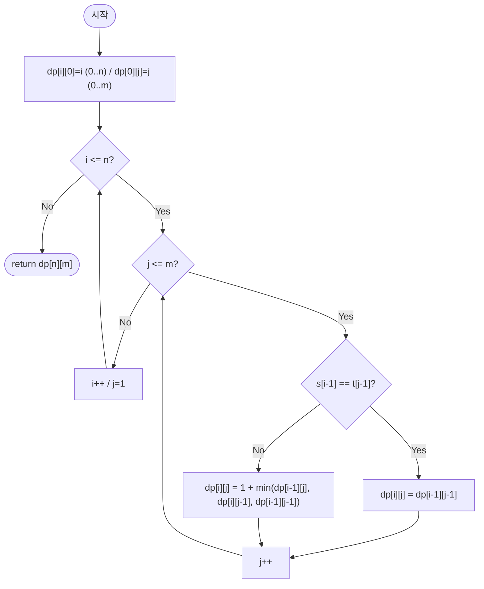

import { AlgorithmSimulation } from "#guide-sim";

# editDistance — 편집 거리 (Levenshtein Distance)

## 한눈에 보는 컨셉

두 문자열 `s`, `t`를 `t`로 바꾸는 최소 편집 횟수를 구하는 문제예요. 핵심 관찰은 "**접두어 쌍을 상태로 잡으면, 마지막에 어떤 연산을 했는지에 따라 문제가 더 작은 접두어 쌍 문제로 쪼개진다**"는 것입니다. 이 관찰을 $(n+1)\times(m+1)$ 표에 순서대로 채워 넣으면 지수 시간 재귀가 `O(nm)` 시간·공간으로, 더 나아가 `O(m)` 공간으로까지 접힙니다.

## 출발점: 가장 순진한 방법부터

문제를 먼저 정확히 고정할게요.

```ts
function editDistance(s: string, t: string): number
```

`s`를 `t`로 바꾸는 데 필요한 최소 편집 횟수(삽입·삭제·교체 각 비용 1)를 반환합니다. 제약은 다음과 같습니다.

| 항목 | 값 |
|------|-----|
| `s`, `t` 길이 | $0 \leq |s|, |t| \leq 1{,}000$ |
| 연산 비용 | 삽입, 삭제, 교체 각 $1$ |
| 시간/메모리 제한 | 1초 / 256MB |

"두 시퀀스를 서로 바꾸는 최소 비용" 문제는 재귀적으로 분해하는 게 가장 정직한 출발입니다. $s[0..i-1]$을 $t[0..j-1]$로 바꾸는 비용을 $f(i, j)$라 하면, 맨 마지막 문자에서 무엇을 할지로 경우를 나눌 수 있어요 — 마지막 문자가 같으면 그대로 넘어가고, 다르면 삭제·삽입·교체 중 하나를 시도한 뒤 더 작은 문제로 재귀합니다.

```ts
function editDistanceNaive(s: string, t: string): number {
  function f(i: number, j: number): number {
    if (i === 0) return j; // t의 남은 j글자를 전부 삽입
    if (j === 0) return i; // s의 남은 i글자를 전부 삭제
    if (s[i - 1] === t[j - 1]) return f(i - 1, j - 1); // 마지막 글자 일치, 비용 없음
    return 1 + Math.min(f(i - 1, j), f(i, j - 1), f(i - 1, j - 1)); // 삭제/삽입/교체
  }
  return f(s.length, t.length);
}
```

이 재귀를 직접 돌려서 호출 횟수를 세어 보면, 문제가 뚜렷하게 드러납니다.

```text
호출 횟수 실측 (editDistanceNaive):
  f("ab",    "ba")     →    9회 호출  (고유 (i,j) 상태:  3×3 =  9개)
  f("abcde", "edcba")  →  834회 호출  (고유 (i,j) 상태:  6×6 = 36개)

"abcde"/"edcba"에서는 36개의 서로 다른 (i,j) 상태를 구하는 데
834번이나 재귀 호출이 발생합니다 — 같은 상태를 평균 23번 넘게 다시 계산한 셈이에요.
```

$n = m = 1{,}000$이면 이 재귀는 최악의 경우 $O(3^{\max(n,m)})$ 수준까지 커질 수 있습니다. 그런데 위 실측에서 보듯 **고유한 $(i, j)$ 조합의 수 자체는 겨우 $(n+1)(m+1)$개**입니다. 같은 상태를 반복해서 계산하고 있다는 것이 이 재귀의 진짜 문제이고, 여기서 다음 단서가 나옵니다 — "**이 $(n+1)(m+1)$개의 상태를 한 번씩만 계산해서 저장해 두면 어떨까?**"

## 아이디어 자세히 들여다보기

### 접두어 쌍을 상태로 잡기 — 수식과 그림

상태 $dp[i][j]$를 다음과 같이 정의합니다.

$$dp[i][j] = s[0..i-1] \text{을 } t[0..j-1] \text{로 변환하는 최소 편집 횟수}$$

왜 하필 "접두어 쌍"일까요? 접두어 쌍으로 상태를 잡으면 부분 문제들 사이에 방향성이 생깁니다 — $dp[i][j]$는 오직 $i$ 또는 $j$가 더 작은 상태에만 의존하므로, 왼쪽 위에서 오른쪽 아래로 순서대로 채우면 순환 의존성 없이 끝까지 채울 수 있어요. 만약 상태를 "임의의 부분 문자열 쌍"으로 잡았다면 상태 수가 $O(n^2m^2)$으로 폭발해서 표 자체가 감당이 안 됩니다.

```text
              t[0..j-2]      t[0..j-1]
s[0..i-2]   dp[i-1][j-1] ↘   dp[i-1][j]
                            ↓
s[0..i-1]   dp[i][j-1]   →  dp[i][j] ?
```

$dp[i][j]$ 칸은 왼쪽(`dp[i][j-1]`), 위(`dp[i-1][j]`), 대각선(`dp[i-1][j-1]`) 세 칸에서만 값을 받아 옵니다. 점화식은 다음과 같습니다.

$$dp[i][j] = \begin{cases} dp[i-1][j-1] & \text{if } s[i-1] = t[j-1] \\ 1 + \min\bigl(dp[i-1][j],\; dp[i][j-1],\; dp[i-1][j-1]\bigr) & \text{otherwise} \end{cases}$$

경계 조건은 $dp[i][0] = i$ (전부 삭제), $dp[0][j] = j$ (전부 삽입)입니다.

잠깐, 확인 하나만 해 볼까요? `s="ho"`, `t="r"`일 때 $dp[2][1]$은 얼마일까요? "ho"를 "r"로 바꾸려면 최소 몇 번의 편집이 필요할까요 — h든 o든 r과 다르니 매칭이 안 되고, "h를 r로 교체 + o 삭제" 또는 "h 삭제 + o를 r로 교체"로 2번이면 충분합니다. 실제로 뒤에서 볼 `s="horse"`, `t="ros"` 표에서도 $dp[2][1] = 2$로 나옵니다.

### 단서를 설명해 주는 이론 — 동적 계획법의 최적 부분 구조

앞서 본 "같은 상태를 반복 계산한다"는 관찰은 이미 이론화되어 있는 이름이 있습니다. 바로 **동적 계획법(dynamic programming)**을 정당화하는 두 가지 성질이에요.

- **최적 부분 구조(optimal substructure)**: 전체 문제의 최적해가 부분 문제의 최적해로부터 구성될 수 있다는 성질입니다. 여기서는 "$s[0..i-1] \to t[0..j-1]$의 최적 편집 시퀀스는, 마지막 연산을 뺀 나머지가 반드시 더 작은 부분 문제의 최적 편집 시퀀스여야 한다"는 형태로 나타나요. 만약 나머지 부분이 최적이 아니라면 그 자리를 더 짧은 편집으로 바꿔치기해서 전체를 더 줄일 수 있으므로, 애초에 최적이 아니었다는 모순이 됩니다(Bellman의 최적성 원리).
- **중복 부분 문제(overlapping subproblems)**: 재귀 트리에서 같은 부분 문제가 여러 경로로 반복해서 등장하는 성질입니다. 위 실측에서 "abcde"/"edcba"가 36개의 고유 상태를 834번 다시 계산한 것이 바로 이 성질의 증거예요.

이 두 성질이 **함께** 있어야 "표에 한 번씩만 채워서 재사용"하는 전략이 이득입니다 — 최적 부분 구조가 없으면 표를 채워도 답을 조합할 수 없고, 중복이 없으면 애초에 캐싱할 이유가 없습니다.

이 이론을 적용하면 목표 복잡도도 바로 계산됩니다. 고유 상태 수는 $(n+1)(m+1) = O(nm)$개이고, 상태 하나당 $O(1)$ 시간이면 채워지므로 전체 $O(nm)$입니다. $n, m \leq 1{,}000$이면 $nm \leq 10^6$이라 1초 제한 안에 충분히 들어옵니다.

### 왜 모순 없이 작동하는가

점화식이 항상 옳은 값을 만든다는 것을 귀납법으로 확인해 볼게요.

**기저**: $dp[i][0] = i$, $dp[0][j] = j$는 정의 그대로입니다. 빈 문자열을 $j$글자짜리 $t[0..j-1]$로 만들려면 $j$번 삽입해야 하고, $i$글자짜리 $s[0..i-1]$을 빈 문자열로 만들려면 $i$번 삭제해야 합니다. 다른 방법으로는 이보다 적게 할 수 없으므로(글자 하나당 최소 연산 하나는 필요) 최적입니다.

**귀납 단계**: $dp[i-1][j]$, $dp[i][j-1]$, $dp[i-1][j-1]$가 모두 올바르다고 가정합니다. $s[0..i-1] \to t[0..j-1]$의 최적 편집 시퀀스에서, **마지막 연산**은 반드시 다음 네 가지 중 하나입니다.

1. $s[i-1]$을 삭제 — 나머지는 $s[0..i-2] \to t[0..j-1]$, 비용 $dp[i-1][j] + 1$.
2. $t[j-1]$을 삽입 — 나머지는 $s[0..i-1] \to t[0..j-2]$, 비용 $dp[i][j-1] + 1$.
3. $s[i-1]$을 $t[j-1]$로 교체 — 나머지는 $s[0..i-2] \to t[0..j-2]$, 비용 $dp[i-1][j-1] + 1$.
4. 아무것도 안 함(마지막 글자가 이미 같음, $s[i-1] = t[j-1]$일 때만 가능) — 나머지는 $s[0..i-2] \to t[0..j-2]$, 비용 $dp[i-1][j-1]$.

이 네 가지 말고 다른 "마지막 연산"은 없습니다 — 문자열 편집 연산 자체가 삽입·삭제·교체 세 가지뿐이고, 일치하는 마지막 글자를 그대로 두는 선택까지 합쳐 경우가 완전히 나열됐습니다(완전성). 각 경우의 비용은 귀납 가정에 의해 정확한 값이므로, 네 후보 중 최솟값을 취하면 전체 최적값과 정확히 일치합니다(각 경우의 최적성). $s[i-1] = t[j-1]$이 아니면 4번 선택지 자체가 불가능하므로 자동으로 제외되고, 나머지 세 후보 중 최소를 취하는 것이 바로 점화식의 `otherwise` 분기입니다.

여기서 **헷갈리기 쉬운 포인트**가 둘 있습니다.

- **일치 케이스에서 왜 "교체 비용 0"이라고 쓰지 않고 그냥 대각선 값을 그대로 쓰는가.** "그래도 교체를 고려해야 하지 않나?"라고 생각하기 쉬운데, 매칭할 때 교체를 강행하면 비용이 $1 + dp[i-1][j-1]$이 되어 그냥 이어받는 $dp[i-1][j-1]$보다 항상 크므로 `min` 연산에서 절대 선택되지 않습니다. 문제는 이 분기 자체를 통째로 빠뜨리면 완전히 다른 결과가 나온다는 점이에요. 아래처럼 일치 여부를 확인하지 않고 항상 `1 + min(...)`을 적용하면:

  ```text
  s = "same", t = "same" (완전히 같은 문자열)
  올바른 결과: 0
  일치 분기를 빠뜨린 결과: 4   ← 같은 문자열인데 4번 편집했다고 나온다

  s = "horse", t = "ros"
  올바른 결과: 3
  일치 분기를 빠뜨린 결과: 5
  ```

  일치 분기가 없으면 이미 같은 글자에도 매번 "+1"을 강제로 붙이게 되어, 같은 문자열조차 편집이 필요하다고 잘못 판단합니다.

- **인덱스 오프셋 — `dp` 인덱스와 문자열 인덱스가 하나 어긋난다는 것.** $dp[i][j]$는 "$i$글자짜리 접두어"를 가리키므로 그 마지막 글자는 `s[i-1]`이지, `s[i]`가 아닙니다. 이걸 헷갈려서 `s[i]`, `t[j]`로 비교하면:

  ```text
  s = "horse", t = "ros"
  올바른 결과: 3
  오프셋을 s[i], t[j]로 잘못 쓴 결과: 2   ← 조용히 다른 값이 나온다
  ```

  1칸 어긋난 비교라 눈으로 코드만 봐서는 티가 잘 안 나고, 몇몇 케이스에서는 우연히 답이 비슷하게 나올 수도 있어서 더 위험합니다.

엣지 케이스도 점검해 볼게요.

```text
s="",    t="abc"  → dp[0][3] = 3 (전부 삽입, 경계 조건 그대로 반환)
s="abc", t=""     → dp[3][0] = 3 (전부 삭제)
s="abc", t="abc"  → 모든 칸에서 일치 분기 → dp[3][3] = 0
s="a",   t="b"     → 유일한 비교에서 불일치 → dp[1][1] = 1 + min(1,1,0) = 1
```

빈 문자열이 관여할 때는 경계 조건이, 완전히 같은 문자열일 때는 일치 분기가, 길이 1짜리 비교에서는 세 후보 중 최소를 고르는 일반 분기가 각각 담당하고 있어서 별도의 특수 처리가 필요 없습니다.

## 아이디어를 코드로 옮기기

앞의 점화식을 그대로 2차원 표에 옮기면 다음과 같습니다.

```ts
function editDistanceDP(s: string, t: string): number {
  const n = s.length;
  const m = t.length;
  const dp: number[][] = Array.from({ length: n + 1 }, () => new Array(m + 1).fill(0));

  for (let i = 0; i <= n; i++) dp[i][0] = i;
  for (let j = 0; j <= m; j++) dp[0][j] = j;

  for (let i = 1; i <= n; i++) {
    for (let j = 1; j <= m; j++) {
      if (s[i - 1] === t[j - 1]) {
        dp[i][j] = dp[i - 1][j - 1];
      } else {
        dp[i][j] = 1 + Math.min(dp[i - 1][j], dp[i][j - 1], dp[i - 1][j - 1]);
      }
    }
  }

  return dp[n][m];
}
```

**가장 실수가 잦은 줄은 `if (s[i - 1] === t[j - 1])`입니다.** 앞서 본 오프셋 함정이 바로 이 줄에서 발생해요 — `dp` 인덱스 `i`, `j`는 1부터 시작하는 "접두어 길이"이고, 문자열 인덱스는 0부터 시작하므로 항상 `-1`을 붙여야 합니다. 그 외 결정 지점은 다음과 같습니다.

- **초기화 순서**: `dp[i][0]`, `dp[0][j]` 경계를 먼저 채워야 합니다. 이걸 빠뜨리면 `i=1, j=1`에서 참조하는 `dp[0][0]`이 `undefined`가 되어 `NaN`이 전파됩니다.
- **순회 방향**: `i`(행)가 바깥, `j`(열)가 안쪽입니다. `dp[i][j]`가 `dp[i][j-1]`(같은 행의 왼쪽 칸)을 참조하므로, `j`가 작은 값부터 큰 값 순으로 채워져 있어야 해요.
- **가드 순서**: 일치 검사(`if`)를 먼저 하고, 불일치일 때만 `min` 세 개를 비교합니다. 순서를 바꿔 `min`을 먼저 계산해 버리면(일치 케이스에서 값 낭비는 없지만) 코드가 읽는 사람 입장에서 "왜 이미 자명한 값을 다시 min으로 재확인하나"를 헷갈리게 만듭니다.

## 더 빠르게 만들 단서 찾기

이 2차원 구현이 실제로 메모리를 어떻게 쓰는지 살펴볼게요. `n = m = 1,000`이면 `dp` 배열은 $1{,}001 \times 1{,}001 \approx 10^6$개의 숫자를 담습니다. 그런데 점화식을 다시 보면 $dp[i][j]$가 참조하는 칸은 딱 세 개 — 왼쪽(`dp[i][j-1]`), 위(`dp[i-1][j]`), 대각선(`dp[i-1][j-1]`)뿐이고, 셋 다 **바로 이전 행 또는 현재 행**에만 있습니다.

```text
행 i-2:  [ 이제 다시는 안 읽는다 ]
행 i-1:  [ dp[i-1][j-1]  dp[i-1][j]  ...  ]   ← 이 행만 있으면 충분
행 i  :  [ ...  dp[i][j-1]  dp[i][j] 계산 중 ]

행 i를 다 채우고 나면 행 i-1은 완전히 필요 없어진다
```

$i$번째 행을 다 채우고 나면, $i-1$번째보다 더 이전 행들은 이후 계산에 전혀 쓰이지 않습니다. 그런데도 2차원 구현은 그 전 행들을 전부 메모리에 붙들고 있어요 — 여기서 낭비가 보입니다. **"이전 행 하나만 남기고 나머지는 버려도 되지 않을까?"**가 다음 단서입니다.

## 단서를 최적화로 연결하기

행 전체를 보관하는 2차원 배열 대신, "이전 행"과 "현재 행" 두 개의 1차원 배열만 유지하는 방식으로 바꿉니다.

```text
Before (2D):  dp[0][*], dp[1][*], dp[2][*], ..., dp[n][*]   모두 메모리에 상주  →  O(nm) 공간
After  (1D):  prev[*] (직전 행), curr[*] (계산 중인 행)만 유지            →  O(m) 공간

행 i 계산 끝나면:  prev ← curr (다음 행을 위해 교체)
```

불변식은 이렇습니다 — **행 $i$를 계산하는 동안, `prev`는 항상 행 $i-1$의 완성된 값을, `curr`는 행 $i$의 지금까지 채운 값을 담고 있다.** 대각선 값 `dp[i-1][j-1]`은 `prev[j-1]`로, 왼쪽 값 `dp[i][j-1]`은 같은 배열의 방금 채운 `curr[j-1]`로, 위쪽 값 `dp[i-1][j]`는 `prev[j]`로 바로 대응됩니다. `curr`와 `prev`가 서로 다른 배열이므로, `curr[j]`를 채워도 `prev[j-1]`(대각선 값)이 덮어써질 위험이 없습니다.

## 최적화 코드

바뀌는 부분은 2차원 배열을 1차원 두 개(`prev`, `curr`)로 바꾸는 것뿐입니다.

```ts
function editDistance(s: string, t: string): number {
  const n = s.length;
  const m = t.length;

  let prev = new Array<number>(m + 1);
  for (let j = 0; j <= m; j++) prev[j] = j;

  for (let i = 1; i <= n; i++) {
    const curr = new Array<number>(m + 1);
    curr[0] = i;
    for (let j = 1; j <= m; j++) {
      if (s[i - 1] === t[j - 1]) {
        curr[j] = prev[j - 1];
      } else {
        curr[j] = 1 + Math.min(prev[j], curr[j - 1], prev[j - 1]);
      }
    }
    prev = curr;
  }

  return prev[m];
}
```

**가장 중요한 줄은 `prev = curr;`입니다.** 이 줄이 "행 i의 계산이 끝났으니 다음 행을 위해 prev를 교체한다"는 불변식을 실제로 지키는 지점이에요. 이 줄을 빠뜨리면 `prev`가 계속 첫 행(모두 `j`)에 머물러 있어서, 모든 행이 첫 행을 기준으로 잘못 계산됩니다.

여기서 흔히 저지르는 다른 실수는, 배열을 새로 만들지 않고 **배열 하나를 제자리(in-place)에서 덮어쓰려는 시도**입니다. `curr` 없이 `dp`라는 배열 하나만 두고 `dp[j] = dp[j-1]`처럼 왼쪽 값으로 갱신해 버리면, 그 `dp[j-1]`은 이미 **이번 행**으로 갱신된 값이라 대각선(이전 행) 값이 아닙니다. 실제로 이렇게 짜면:

```text
s = "horse", t = "ros"     올바른 결과: 3
대각선 값을 저장하지 않고 배열 하나만 in-place로 덮어쓴 결과: 6

s = "kitten", t = "sitting"  올바른 결과: 3
같은 방식의 결과: 9
```

정답의 두 배 이상으로 튀는 걸 볼 수 있어요. 배열 하나로 진짜 $O(\min(n,m))$까지 줄이려면 대각선 값을 갱신 직전에 별도 변수에 저장해 둬야 하는데, 그 관리가 번거롭고 실수하기 쉬워서 이 가이드에서는 `prev`/`curr` 두 배열로 안전하게 $O(m)$ 공간을 확보하는 선을 택했습니다.

> 기억법: "왼쪽은 이번 행, 위는 저번 행, 대각선은 저번 행의 왼쪽 — 배열을 하나로 합치기 전에 셋 중 어디가 '저번 행'인지부터 확인한다."

**더 최적화할 여지가 있을까요?** 공간은 `s`, `t` 중 더 짧은 쪽을 열(column) 방향으로 놓으면 $O(\min(n,m))$까지 더 줄일 수 있습니다(현재 코드는 항상 `t`의 길이 `m`을 기준으로 배열을 만들므로, `m > n`인 입력에서는 호출 전에 `s`, `t`를 바꿔주면 됩니다). 시간 쪽은 여기가 사실상 한계입니다 — 편집 거리를 일반적인 두 문자열에 대해 엄밀하게 구하려면 $(n+1)(m+1)$개의 상태를 모두 살펴봐야 한다는 것이 이 점화식의 최적 부분 구조가 말해주는 바이고, 실제로 "일반적인 두 문자열의 편집 거리는 강지수시간가설(SETH)을 참이라고 가정하면 $O(nm)$보다 점근적으로 훨씬 빠르게(strongly subquadratic) 풀 수 없다"는 조건부 하한이 알려져 있습니다(Backurs & Indyk, 2015). 다만 답이 작다는 것이 미리 알려진 경우(예: 편집 거리가 $k$ 이하인지만 확인)에는 대각선 띠만 계산하는 Ukkonen의 알고리즘으로 $O(nk)$까지 좁힐 수 있고, `git diff` 같은 실전 도구는 워드 단위 비트 병렬 연산으로 상수를 줄인 Myers 알고리즘을 씁니다. 이런 특화 해법들이 존재하긴 하지만, 이 가이드의 $O(nm)$ DP는 "비용이 무엇이든(삽입·삭제·교체 비용이 서로 달라도) 그대로 적용되는 범용성"에서 여전히 가치가 있습니다.

## 실행 시각화

입력 `s = "horse"`, `t = "ros"`에 대해 `(n+1)×(m+1)` DP 테이블을 채우는 과정입니다. 행 라벨은 `s`의 접두어(`""`, `h`, `ho`, ...), 열 라벨은 `t`의 접두어(`""`, `r`, `ro`, `ros`)입니다. `cells`(강조)는 방금 채운 셀이며, `matrix`의 `null`은 아직 채우지 않은 칸입니다.

실제 반환값은 `3`이며(`dp[5][3]`), `"horse"`를 `"ros"`로 바꾸는 최소 편집 수입니다(h→r 교체, r 삭제, e 삭제). 이 값은 위 스크래치 실행으로 실측했고, 시뮬레이션 마지막 프레임의 우하단 셀과 일치합니다.

> 대화형 시뮬레이션은 MDX 런타임에서 표시됩니다.

export const rowLabels = ["∅", "h", "ho", "hor", "hors", "horse"];

export const colLabels = ["∅", "r", "ro", "ros"];

export const steps = [
  {
    title: "경계 초기화",
    detail: "dp[i][0]=i (s를 i번 삭제), dp[0][j]=j (t를 j번 삽입).",
    matrix: [
      [0, 1, 2, 3],
      [1, null, null, null],
      [2, null, null, null],
      [3, null, null, null],
      [4, null, null, null],
      [5, null, null, null],
    ],
    rowLabels, colLabels,
    cells: [[0, 0], [0, 1], [0, 2], [0, 3], [1, 0], [2, 0], [3, 0], [4, 0], [5, 0]],
  },
  {
    title: "i=1 (s[0]='h') 행 채우기",
    detail: "h vs r/o/s 모두 불일치. dp[1]=[1,1,2,3] (1+min(왼쪽,위,대각선)).",
    matrix: [
      [0, 1, 2, 3],
      [1, 1, 2, 3],
      [2, null, null, null],
      [3, null, null, null],
      [4, null, null, null],
      [5, null, null, null],
    ],
    rowLabels, colLabels,
    cells: [[1, 1], [1, 2], [1, 3]],
  },
  {
    title: "i=2 (s[1]='o') 행 채우기",
    detail: "j=2에서 o==o → 대각선 dp[1][1]=1 이어받음. dp[2]=[2,2,1,2].",
    matrix: [
      [0, 1, 2, 3],
      [1, 1, 2, 3],
      [2, 2, 1, 2],
      [3, null, null, null],
      [4, null, null, null],
      [5, null, null, null],
    ],
    rowLabels, colLabels,
    cells: [[2, 1], [2, 2], [2, 3]],
  },
  {
    title: "i=3 (s[2]='r') 행 채우기",
    detail: "j=1에서 r==r → 대각선 dp[2][0]=2 이어받음. dp[3]=[3,2,2,2].",
    matrix: [
      [0, 1, 2, 3],
      [1, 1, 2, 3],
      [2, 2, 1, 2],
      [3, 2, 2, 2],
      [4, null, null, null],
      [5, null, null, null],
    ],
    rowLabels, colLabels,
    cells: [[3, 1], [3, 2], [3, 3]],
  },
  {
    title: "i=4 (s[3]='s') 행 채우기",
    detail: "j=3에서 s==s → 대각선 dp[3][2]=2 이어받음. dp[4]=[4,3,3,2].",
    matrix: [
      [0, 1, 2, 3],
      [1, 1, 2, 3],
      [2, 2, 1, 2],
      [3, 2, 2, 2],
      [4, 3, 3, 2],
      [5, null, null, null],
    ],
    rowLabels, colLabels,
    cells: [[4, 1], [4, 2], [4, 3]],
  },
  {
    title: "i=5 (s[4]='e') 행 채우기",
    detail: "e vs r/o/s 모두 불일치. dp[5]=[5,4,4,3]. dp[5][3]=1+min(dp[4][3]=2,...)=3.",
    matrix: [
      [0, 1, 2, 3],
      [1, 1, 2, 3],
      [2, 2, 1, 2],
      [3, 2, 2, 2],
      [4, 3, 3, 2],
      [5, 4, 4, 3],
    ],
    rowLabels, colLabels,
    cells: [[5, 1], [5, 2], [5, 3]],
  },
  {
    title: "완료: dp[5][3] = 3",
    detail: "우하단 셀이 답. horse → ros 최소 편집 3회 (h→r 교체, r 삭제, e 삭제).",
    matrix: [
      [0, 1, 2, 3],
      [1, 1, 2, 3],
      [2, 2, 1, 2],
      [3, 2, 2, 2],
      [4, 3, 3, 2],
      [5, 4, 4, 3],
    ],
    rowLabels, colLabels,
    cells: [[5, 3]],
  },
];

<AlgorithmSimulation view="matrix" steps={steps} title='편집 거리: s="horse", t="ros"' />

## 흐름 한눈에 보기



## 스스로 점검하기

1. `s = "abc"`, `t = "abc"`일 때 DP 표를 손으로 채워 보세요. 대각선(일치) 분기만 계속 타는 이유와, 그 결과 `dp[3][3]`이 왜 `0`이어야 하는지를 설명해 보세요.
2. "일치 분기를 확인하지 않고 항상 `1 + min(...)`을 적용"하는 실수를 저지르면 `s = "same"`, `t = "same"`에서 어떤 값이 나올까요? 본문에서 실측한 값과 비교하고, 왜 그런 값이 나오는지 점화식으로 설명해 보세요.
3. 이 문제를 "s를 t로 바꾸는 편집 시퀀스 자체(구체적인 삽입/삭제/교체 순서)"를 반환하도록 확장하려면, DP 테이블에 어떤 정보를 추가로 저장해야 할까요? (힌트: 각 칸에서 어떤 분기를 선택했는지를 함께 기록하면, 마지막 칸에서 시작 칸까지 거꾸로 따라가며 경로를 복원할 수 있습니다.)
