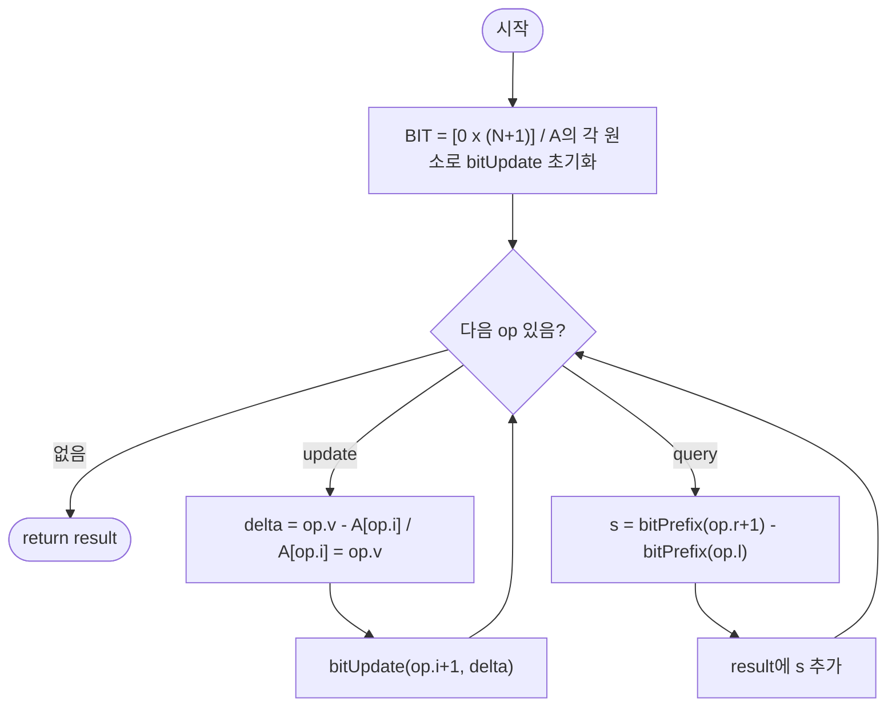

import { AlgorithmSimulation } from "#guide-sim";

# fenwickRangeSum — 인덱스의 최하위 비트가 갱신과 질의를 동시에 접어주는 이유

## 한눈에 보는 컨셉

배열 원소가 실시간으로 바뀌는데 구간 합을 계속 물어야 하는 상황이에요. 인덱스를 이진수로 보면, 각 칸이 "자신의 최하위 비트(LSB) 크기만큼의 구간"을 책임지도록 나눠 맡길 수 있습니다. 이 분업 덕분에 갱신도 `O(log N)`, 구간 합 질의도 `O(log N)`으로 동시에 빨라져요 — Fenwick Tree(Binary Indexed Tree)의 전부가 이 한 문장에 담겨 있습니다.

## 출발점: 가장 순진한 방법부터

문제를 정확히 잡고 갈게요.

```ts
type FenwickOp =
  | { type: "update"; i: number; v: number }
  | { type: "query"; l: number; r: number };

function fenwickRangeSum(A: number[], ops: FenwickOp[]): number[]
```

`A`는 초기 정수 배열, `ops`는 순서대로 처리할 연산 목록입니다. `update(i, v)`는 `A[i]`를 `v`로 덮어쓰고(누적이 아니라 교체), `query(l, r)`는 `A[l..r]`의 합을 묻습니다. 반환값은 `query` 결과만 등장 순서대로 담은 배열이에요.

| 항목 | 값 |
|------|-----|
| 배열 길이 $N$ | $1 \leq N \leq 100{,}000$ |
| 연산 수 $Q$ | $0 \leq Q \leq 100{,}000$ |
| 원소·갱신값 범위 | $-10{,}000 \leq A[i],\, v \leq 10{,}000$ |
| 인덱스 범위 | `update`: $0 \le i < N$, `query`: $0 \le l \le r < N$ |

가장 정직한 접근은 배열을 그대로 들고 있다가, 질의가 오면 그 자리에서 직접 더하는 겁니다.

```ts
function fenwickRangeSumNaive(A: number[], ops: FenwickOp[]): number[] {
  const arr = A.slice();
  const result: number[] = [];
  for (const op of ops) {
    if (op.type === "update") {
      arr[op.i] = op.v;                              // O(1) 덮어쓰기
    } else {
      let sum = 0;
      for (let k = op.l; k <= op.r; k++) sum += arr[k]; // O(N) 직접 순회
      result.push(sum);
    }
  }
  return result;
}
```

```text
update:  O(1)         갱신은 칸 하나만 바꾸니 빠르다
query:   O(N)          매번 [l, r]을 처음부터 끝까지 다시 더한다

N = Q = 100,000 이면?
query가 최악의 경우 Q번 모두 O(N) → O(N·Q) = 10,000,000,000  ✗ 시간 초과
```

"구간 합이면 누적합(prefix sum) 배열을 미리 만들어 두면 되잖아?"라는 생각이 자연스럽게 떠오를 텐데, 여기서 반대쪽 벽에 부딪힙니다. 누적합 배열을 쓰면 `query`는 `O(1)`이 되지만, `update` 한 번마다 그 인덱스 뒤에 있는 모든 누적값을 다시 계산해야 해서 `O(N)`이 됩니다. 결국 어느 쪽을 빠르게 만들어도 반대쪽이 `O(N)`으로 밀려나는 시소 관계예요.

```text
배열 그대로 유지     update O(1)      query O(N)      O(NQ) = 10^10  ✗
누적합 배열 유지     update O(N)      query O(1)      O(NQ) = 10^10  ✗
```

두 연산이 섞여서 대량으로(각 최대 `100,000`번) 들어오기 때문에, **갱신과 질의 둘 다 어느 정도 느리더라도 균형 잡힌 자료구조**가 필요하다는 낌새가 남습니다.

## 아이디어 자세히 들여다보기

### 인덱스의 최하위 비트가 담당 구간을 결정한다 — 수식과 그림

직관부터 짚을게요. 정수 하나를 이진수로 쓰면 항상 "가장 낮은 자리의 1비트"가 하나 존재합니다. 그 비트의 크기를 그 인덱스가 담당하는 구간의 길이로 삼으면 어떨까요? 그러면 큰 구간을 책임지는 칸은 적고, 작은 구간을 책임지는 칸은 많아지면서, 접두어 합을 "몇 개의 큰 조각"으로 쪼개 더할 수 있게 됩니다.

이 최하위 비트를 LSB(least significant bit)라고 부르고, 다음처럼 계산해요.

$$\text{LSB}(i) = i \mathbin{\&} (-i)$$

```text
i  = 6 = 0110₂
-i     = 1010₂   (2의 보수: 비트 반전 + 1)
────────────────
i & -i = 0010₂ = 2    →  LSB(6) = 2
```

이제 BIT(Binary Indexed Tree) 배열을 1-indexed로 정의합니다. $BIT[i]$는 "$i$에서 끝나고 길이가 $\text{LSB}(i)$인 구간"의 합을 저장해요.

$$BIT[i] = \sum_{k = i - \text{LSB}(i) + 1}^{i} A[k-1] \qquad \text{(A는 0-indexed 기준)}$$

$N=8$일 때 각 칸이 책임지는 구간을 그려 보면 이렇습니다.

```text
i  LSB(i)  담당 구간(1-indexed)
1    1     [1]
2    2     [1,2]
3    1     [3]
4    4     [1,2,3,4]
5    1     [5]
6    2     [5,6]
7    1     [7]
8    8     [1,2,3,4,5,6,7,8]
```

작은 예로 직접 채워 봅시다. `A = [1, 3, 5, 7]` (0-indexed)이면 $N=4$이고, $BIT[1]=A[0]=1$, $BIT[2]=A[0]{+}A[1]=1{+}3=4$, $BIT[3]=A[2]=5$, $BIT[4]=A[0..3]=1{+}3{+}5{+}7=16$입니다.

> 확인 하나만 해 볼까요? $N=8$ 기준으로 $BIT[6]$이 담당하는 구간은 어디일까요? — $\text{LSB}(6)=2$이므로 $A[4..5]$(0-indexed) 두 칸입니다.

**왜 하필 이 형태여야 하는가**: 만약 구간 길이를 LSB 대신 고정된 블록 크기 $B$로 나눈다면(평방 분할처럼), 갱신은 자기 블록 하나만 고치면 되니 `O(1)`이지만 질의는 최대 `B`개의 블록 부분합을 훑어야 해서 `O(N/B)`가 되고, 반대로 블록을 세분화하면 질의가 빨라지는 대신 갱신이 여러 블록에 걸쳐 느려집니다. 결국 고정 크기 블록으로는 갱신·질의 어느 한쪽을 `O(log N)` 아래로 눌러도 반대쪽이 그만큼 손해를 봅니다. LSB 기반 분할은 이진 표현의 자릿수 구조를 그대로 활용해서, **갱신과 질의 모두를 동시에 `O(log N)`으로 묶는 유일하게 단순한 방법**이에요.

### 셈을 맡는 자료구조 — Fenwick Tree

이 알고리즘의 핵심 저장소는 방금 정의한 `BIT` 배열 자체입니다. `BIT`는 이 문제에서 "동적 접두어 합 질의응답기" 역할을 해요 — 값이 계속 바뀌는 배열 위에서 언제든 `prefix(r)`을 `O(log N)`에 내어 줍니다.

`lowbit` 연산의 성질, 트리 형태로 본 모양, `update`/`prefix`가 왜 정확히 필요한 칸만 건드리는지에 대한 완전한 유도는 이 프로젝트의 [Fenwick Tree 자료구조 가이드](../../../data-structures/range-query/fenwickTree/fenwickTree-guide.mdx)에서 깊게 다룹니다. 이 가이드에서는 그 구조 위에 **이 문제의 연산(점 갱신 + 구간 합 질의)을 어떻게 얹는지**에 집중할게요 — 구체적으로는 "덮어쓰기 `update(i, v)`를 BIT가 이해하는 `delta` 형태로 바꾸는 법"과 "구간 합을 두 번의 접두어 합 차이로 바꾸는 법"입니다.

### 왜 모순 없이 작동하는가

핵심 연산 두 개를 먼저 정식화합니다.

**접두어 합** $\text{prefix}(r) = \sum_{k=1}^{r} A[k-1]$: $r$에서 LSB를 빼가며 $r>0$인 동안 $BIT[r]$을 누적합니다.

**구간 합**: $\text{sum}(l, r) = \text{prefix}(r+1) - \text{prefix}(l)$ ($\text{prefix}(r{+}1)$은 $A[0..r]$의 합, $\text{prefix}(l)$은 $A[0..l-1]$의 합이므로 그 차가 $A[l..r]$의 합입니다).

**점 갱신** $\text{update}(i, \delta)$: $i$에서 LSB를 더해가며 $i \le N$인 동안 $BIT[i] \mathrel{+}= \delta$를 반복합니다.

**정당성(귀납)**: $\text{prefix}(r)$이 $A[0..r-1]$의 합과 같다는 것을 $r$에 대한 강한 귀납으로 봅니다.
- **기저**: $r=0$이면 루프가 한 번도 돌지 않아 합이 $0$이고, $A[0..{-1}]$은 빈 구간이니 합도 $0$ — 성립합니다.
- **귀납 단계**: $r>0$이면 $r$의 이진 표현은 반드시 1비트를 하나 이상 가지므로 $\text{LSB}(r) > 0$이고, $r' = r - \text{LSB}(r)$은 $r$보다 항상 작습니다(경우는 이 하나뿐 — $r>0$이면 LSB가 존재하지 않는 경우는 없습니다, 완전성). 귀납 가정에 의해 $\text{prefix}(r')$은 $A[0..r'-1]$의 합이고, 여기에 더하는 $BIT[r]$은 정의상 $A[r-\text{LSB}(r)..r-1] = A[r'..r-1]$의 합이므로, 둘을 더하면 정확히 $A[0..r-1]$의 합이 됩니다(두 구간이 겹치지 않고 이어 붙어 전체를 덮는다는 것이 정확성의 핵심).

$\text{update}(i,\delta)$의 정당성도 비슷합니다: $BIT[j]$가 $A[i]$를 포함하는 조건은 $j - \text{LSB}(j) < i \le j$이고, $i$에서 LSB를 더해가는 이동이 정확히 이 조건을 만족하는 모든 $j$를 순서대로 방문합니다. 음수 $\delta$도 덧셈이 그대로 적용되므로 동일하게 성립해요.

여기서 **헷갈리기 쉬운 포인트**가 둘 있습니다.

- **오프셋을 잘못 맞추는 것입니다.** $\text{sum}(l,r) = \text{prefix}(r{+}1) - \text{prefix}(l)$인데, `r+1`을 깜빡하고 `prefix(r)`을 그대로 쓰면 조용히 틀립니다. `A=[1,3,5,7]`, `sum(1,3)`을 예로 들면, 올바른 계산은 $\text{prefix}(4)-\text{prefix}(1) = 16-1 = 15$이지만, `r+1` 대신 `r`을 쓰면 $\text{prefix}(3)-\text{prefix}(1) = 5-1 = 8$이 나와 정답(15)과 다른 값이 실제로 계산됩니다.
- **`update(i, v)`를 그대로 BIT에 더하는 것입니다.** 이 문제의 `update`는 "그 자리 값을 `v`로 덮어쓰기"이지 "`v`를 누적"이 아니므로, BIT에는 $\delta = v - A[i]$(변화량)만 반영해야 합니다. `A=[1,3,5,7]`에서 `update(i=1, v=10)`을 예로 들면, 갱신 전 전체 합은 16입니다. 올바르게 $\delta = 10-3=7$을 반영하면 전체 합이 $16+7=23$이 되어야 하는데, `v=10`을 그대로(델타 계산 없이) 더해 버리면 전체 합이 $16+10=26$으로 나와 정답(23)보다 3만큼 더 크게 틀립니다.

엣지 케이스에서도 이 정의가 그대로 버텨 주는지 점검해 둘게요.

```text
N=1, ops=[]                     → BIT=[_,A[0]], 결과=[]  (연산이 없으니 그대로)
ops에 query만 있음               → 초기 배열 기준 구간 합만 계산
ops에 update만 있음               → query가 없으니 결과=[]
l == r 인 query                  → prefix(r+1)-prefix(r) = 단일 원소 A[r]
음수 v로 update                  → δ가 음수여도 덧셈 루프는 동일하게 동작
```

## 아이디어를 코드로 옮기기

```ts
function fenwickRangeSumBasic(A: number[], ops: FenwickOp[]): number[] {
  const n = A.length;
  const arr = A.slice();                    // BIT와 항상 동기화할 논리 배열
  const tree = new Array(n + 1).fill(0);     // 1-indexed, tree[0]은 미사용

  const update = (i: number, delta: number) => {
    for (; i <= n; i += i & -i) tree[i] += delta;
  };
  const prefix = (i: number) => {
    let sum = 0;
    for (; i > 0; i -= i & -i) sum += tree[i];
    return sum;
  };

  for (let i = 0; i < n; i++) update(i + 1, arr[i]); // 초기 배열을 BIT에 반영

  const result: number[] = [];
  for (const op of ops) {
    if (op.type === "update") {
      const delta = op.v - arr[op.i];
      arr[op.i] = op.v;
      update(op.i + 1, delta);
    } else {
      result.push(prefix(op.r + 1) - prefix(op.l));
    }
  }
  return result;
}
```

결정 지점만 짚을게요. `tree`는 크기 `n+1`로 잡아 인덱스 `0`을 비워 둡니다(`LSB(0)=0`이라 `0`부터 시작하면 갱신 루프가 멈추지 않아요). `update`의 반복 조건은 `i <= n`(초과하면 배열 밖), `prefix`의 반복 조건은 `i > 0`(0에 닿으면 더 뺄 게 없음)입니다. 초기 배열 반영은 `A`의 각 원소를 `update` 한 번씩 호출하는 방식이에요.

**가장 실수가 잦은 줄은 `const delta = op.v - arr[op.i];`입니다.** 이 줄은 반드시 `arr[op.i] = op.v`보다 **먼저** 와야 해요. 순서를 바꿔서 `arr[op.i]`를 먼저 `op.v`로 덮어쓴 뒤 `delta`를 계산하면 `op.v - op.v = 0`이 되어 BIT가 전혀 갱신되지 않는 채로 조용히 넘어갑니다.

## 더 빠르게 만들 단서 찾기

방금 코드의 초기화 루프(`for (let i = 0; i < n; i++) update(i + 1, arr[i])`)를 관찰해 봅시다. `update`를 호출할 때마다 LSB를 따라 여러 칸을 다시 씁니다. $N=8$일 때 각 인덱스가 몇 번이나 다시 쓰이는지 세어 보면 이렇습니다.

```text
i            1  2  3  4  5  6  7  8
쓰기 횟수     1  2  1  4  1  2  1  8     합계 = 20회
```

`BIT[8]`은 개별 `update` 8번 호출 중 **8번 모두**에서 다시 쓰입니다 — 자신보다 작은 모든 인덱스의 부분합이 결국 `BIT[8]`까지 올라오기 때문이에요. 일반화하면 초기화 전체 비용은 $O(N \log N)$이고, $N=100{,}000$이면 대략 $100{,}000 \times 17 \approx 1{,}700{,}000$번의 덧셈입니다. 이 문제의 시간 제한 안에서는 이미 충분히 빠르지만, 낭비가 눈에 보이는 지점이긴 합니다: **`BIT[i]`의 최종값은 "자기 몫" + "자기보다 작은 인덱스의 부분합"으로 딱 한 번만 결정되는데, 지금은 그 값을 여러 번에 걸쳐 나눠서 쌓고 있습니다.**

## 단서를 최적화로 연결하기

한 번에 결정되는 값을 여러 번 나눠 쓰지 말고, **자기 값을 채운 뒤 부모에게 정확히 한 번만 넘겨주는** 방식으로 바꿔 봅시다.

```text
Before (개별 update N회):        i=1 → {1,2,4,8} 다시 쓰기
                                  i=2 → {2,4,8} 다시 쓰기
                                  ...
                                  합계 20회 쓰기 (N=8 기준)

After (2-pass 선형 빌드):
  1단계: tree[i] = A[i-1]         각 칸에 "자기 값"만 채운다      (8회)
  2단계: j = i + LSB(i)
         tree[j] += tree[i]       자기 몫을 부모에게 한 번만 전달  (최대 7회, j>N이면 skip)
                                  합계 15회 쓰기 (N=8 기준)
```

이게 안전한 이유는 인덱스를 **오름차순으로** 훑기 때문입니다. `tree[i]`가 부모 `j = i + \text{LSB}(i)`로 값을 넘길 때, `j`는 항상 `i`보다 큽니다(`LSB(i) > 0`이므로). 즉 "자식은 항상 부모보다 작은 인덱스"라는 순서가 성립하고, 오름차순으로 처리하면 어떤 칸을 방문할 때 그 칸의 모든 자식이 **이미** 자기 몫을 넘겨준 뒤라는 게 보장돼요. 그래서 각 칸은 정확히 한 번, 자기 몫이 완성된 순간에만 부모에게 전달하면 충분합니다.

## 최적화 코드

바뀌는 부분은 **초기화 두 줄뿐**입니다. `update`/`prefix`와 이후 연산 루프는 그대로예요.

```ts
// Before: for (let i = 0; i < n; i++) update(i + 1, arr[i]);   // O(n log n)

// After:
for (let i = 1; i <= n; i++) tree[i] += arr[i - 1];  // ① 자기 몫 채우기
for (let i = 1; i <= n; i++) {
  const j = i + (i & -i);
  if (j <= n) tree[j] += tree[i];                    // ② 부모에게 한 번만 전달
}
```

**가장 중요한 줄은 `if (j <= n) tree[j] += tree[i];`입니다.** 이 줄이 오름차순 `for` 루프 안에서 실행된다는 것이 핵심이에요 — 순서를 바꿔 내림차순으로 돌리면, `tree[i]`가 아직 자기 자식들의 몫을 못 받은 상태에서 부모에게 넘겨 버려 최종값이 덜 채워진 채로 굳어 버립니다. `A=[1,3,5,7]`로 손 검산해 보면 ①단계 후 `tree=[_,1,3,5,7]`이고, ②단계에서 `i=1`(LSB=1) → `tree[2]+=tree[1]` → `tree=[_,1,4,5,7]`, `i=2`(LSB=2) → `tree[4]+=tree[2]` → `tree[4]=7+4=11`, `i=3`(LSB=1) → `tree[4]+=tree[3]` → `tree[4]=11+5=16`, `i=4`(LSB=4, `j=8>4`) → skip. 최종 `tree=[_,1,4,5,16]` — 개별 `update` 4회로 만든 것과 정확히 같은 값이에요.

> 기억법: **"자식이 먼저, 부모는 그다음"** — 인덱스가 작을수록 자식이라는 성질을 그대로 이용해 오름차순 한 바퀴로 끝냅니다.

이제 목표 복잡도를 확인해 볼게요. 초기화는 $O(N)$(선형 2-pass), 이후 각 연산은 `update`/`query` 모두 $O(\log N)$입니다. $N=Q=100{,}000$을 대입하면 전체는 $O(N + Q\log N) \approx 100{,}000 + 100{,}000 \times 17 \approx 1{,}800{,}000$ 수준으로, 애초 naive 접근이 만들던 $10^{10}$과는 비교가 안 되게 여유롭게 시간 제한을 통과합니다.

더 최적화할 여지가 있을까요? `update`/`query` 각각의 `O(log N)`은 값이 계속 바뀌는 동적 상황에서 일반적으로 더 줄이기 어렵습니다 — 정적 배열이라면 접두어 합을 미리 깔아 `O(1)` 질의가 가능하지만, 갱신이 섞이는 순간 어느 자료구조든 갱신·질의 중 적어도 하나는 로그 비용을 치릅니다. Segment Tree도 같은 $O(\log N)$을 내지만 코드가 더 길고 상수 인자가 큽니다(대신 구간 갱신 + lazy propagation처럼 이 문제 범위 밖의 기능을 지원합니다). 그래서 **점 갱신 + 구간 합 질의**라는 이 조합에서는 Fenwick Tree가 배열 하나와 두 개의 짧은 루프만으로 같은 복잡도를 훨씬 적은 코드로 낸다는 점이 실전에서의 가치입니다.

## 실행 시각화

입력 `A = [1, 3, 5, 7]`에 대해 BIT를 구성한 뒤 `ops = [query(1,3), update(i=1,v=10), query(1,3)]`을 처리하는 과정입니다. `array` 패널은 1-indexed BIT 배열(인덱스 0은 미사용), `highlight`(빨강)는 현재 갱신/조회 중 접근하는 셀, `keyValue` 패널은 논리 배열 `A`와 진행 중인 누적합 스냅샷을 보여줍니다. 위에서 검증한 2-pass 빌드도 개별 `update` 4회와 동일한 `BIT=[_,1,4,5,16]`을 만들어 내므로, 아래 시뮬레이션은 최적화 코드 기준으로도 그대로 유효합니다.

실제 반환값은 `[15, 22]`이며(첫 query는 `3+5+7=15`, update로 `A[1]`이 3→10이 된 뒤 두 번째 query는 `10+5+7=22`), 시뮬레이션 마지막 프레임과 일치합니다.

> 대화형 시뮬레이션은 MDX 런타임에서 표시됩니다.

export const steps = [
  {
    title: "BIT 초기 구성",
    detail: "A=[1,3,5,7]를 반영. BIT[1]=1, BIT[2]=1+3=4, BIT[3]=5, BIT[4]=1+3+5+7=16. (인덱스 0 미사용)",
    array: ["_", 1, 4, 5, 16],
    entries: [
      { label: "A (논리 배열)", value: "[1, 3, 5, 7]" },
      { label: "결과", value: "[]" },
    ],
  },
  {
    title: "query(1,3): prefix(4)",
    detail: "sum(1,3) = prefix(4) - prefix(1). prefix(4): i=4 → BIT[4]=16, i=4-4=0 종료. prefix(4)=16.",
    array: ["_", 1, 4, 5, 16],
    highlight: [4],
    entries: [
      { label: "prefix(4)", value: 16 },
      { label: "결과", value: "[]" },
    ],
  },
  {
    title: "query(1,3): prefix(1)",
    detail: "prefix(1): i=1 → BIT[1]=1, i=1-1=0 종료. prefix(1)=1.",
    array: ["_", 1, 4, 5, 16],
    highlight: [1],
    entries: [
      { label: "prefix(4)", value: 16 },
      { label: "prefix(1)", value: 1 },
      { label: "결과", value: "[]" },
    ],
  },
  {
    title: "query(1,3) 결과 = 15",
    detail: "sum = prefix(4) - prefix(1) = 16 - 1 = 15. 결과 배열에 추가.",
    array: ["_", 1, 4, 5, 16],
    entries: [
      { label: "sum(1,3)", value: 15 },
      { label: "결과", value: "[15]" },
    ],
  },
  {
    title: "update(i=1, v=10): delta",
    detail: "A[1]을 3→10으로 교체. delta = 10 - 3 = 7. A[1]=10 동기화. BIT 인덱스는 i+1=2.",
    array: ["_", 1, 4, 5, 16],
    entries: [
      { label: "delta", value: 7 },
      { label: "A (논리 배열)", value: "[1, 10, 5, 7]" },
    ],
  },
  {
    title: "update: BIT[2] += 7",
    detail: "i=2 → BIT[2]=4+7=11. 다음: i += LSB(2)=2 → i=4.",
    array: ["_", 1, 11, 5, 16],
    highlight: [2],
    entries: [
      { label: "delta", value: 7 },
      { label: "i", value: 2 },
    ],
  },
  {
    title: "update: BIT[4] += 7",
    detail: "i=4 → BIT[4]=16+7=23. 다음: i += LSB(4)=4 → i=8 > N=4, 종료.",
    array: ["_", 1, 11, 5, 23],
    highlight: [4],
    entries: [
      { label: "delta", value: 7 },
      { label: "i", value: 4 },
    ],
  },
  {
    title: "query(1,3): prefix(4) - prefix(1)",
    detail: "prefix(4): BIT[4]=23. prefix(1): BIT[1]=1. sum = 23 - 1 = 22.",
    array: ["_", 1, 11, 5, 23],
    highlight: [1, 4],
    entries: [
      { label: "prefix(4)", value: 23 },
      { label: "prefix(1)", value: 1 },
      { label: "sum(1,3)", value: 22 },
    ],
  },
  {
    title: "완료: 결과 = [15, 22]",
    detail: "모든 op 처리 완료. query 결과만 순서대로 반환한다.",
    array: ["_", 1, 11, 5, 23],
    entries: [
      { label: "A (논리 배열)", value: "[1, 10, 5, 7]" },
      { label: "결과", value: "[15, 22]" },
    ],
  },
];

<AlgorithmSimulation view={["array", "keyValue"]} steps={steps} title="Fenwick Tree: A=[1,3,5,7], query+update+query" />

## 흐름 한눈에 보기



## 스스로 점검하기

1. `A = [2, 4, 6, 8, 10]`에 대해 `query(0, 4)`의 결과를 손으로 구해 보세요. 그다음 `update(i=3, v=1)`을 적용한 뒤 같은 `query(0, 4)`를 다시 계산해 보세요. (힌트: 갱신 전 합은 30이고, `A[3]`이 8→1로 바뀌므로 δ=-7입니다.)
2. `sum(l, r) = prefix(r+1) - prefix(l)`에서 실수로 `prefix(r) - prefix(l)`을 썼다고 해 봅시다. `A = [5, 5, 5]`에서 `query(0, 2)`(정답 15)를 계산하면 어떤 값이 나오고, 왜 그 값이 나오는지 `prefix` 정의를 따라가며 설명해 보세요.
3. 이 가이드는 점 갱신(단일 원소 변경)만 다룹니다. 만약 "구간 `[l, r]`의 모든 원소에 `+v`를 더하라"는 **구간 갱신**이 추가로 필요해진다면, 지금의 `BIT` 하나로는 부족합니다. 어떤 보조 장치(차분 배열 등)를 더해야 할지 생각해 보세요.
