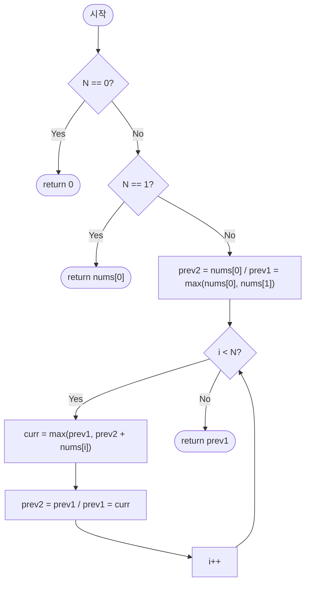

import { AlgorithmSimulation } from "#guide-sim";

# House Robber — 최근 두 칸만 기억하면 충분한 이유

## 한눈에 보는 컨셉

인접한 두 집을 동시에 털 수 없다는 제약은, "$i$번째 집까지 봤을 때의 최댓값"이 바로 이전 두 결정 — "$i-1$까지의 최댓값"과 "$i-2$까지의 최댓값" — 에만 의존한다는 사실로 이어져요. 이 관찰 하나로 점화식이 나오고, 배열 전체를 들고 있을 필요 없이 최근 두 값만 굴리면 끝납니다.

```text
점화식   dp[i] = max( dp[i-1],  dp[i-2] + nums[i] )
                      ↑ 안 턴다   ↑ 턴다(직전 집은 못 쓴다)

시간 O(N) · 공간 O(1),  둘 다 최악 보장 — 해시도 상환 분석도 확률도 쓰지 않는다
```

이번 가이드의 핵심은 **"왜 최근 두 칸만으로 충분한가"** 를 증명 수준으로 납득하는 것이에요. 그리고 그 전에, 더 간단해 보이는 설계 둘이 왜 틀리는지를 반례로 먼저 봅니다.

## 출발점: 가장 순진한 방법부터

문제를 먼저 정확히 잡고 갈게요.

```ts
function houseRobber(nums: number[]): number;
```

- `nums` — 각 집의 현금. `nums[i]`는 $i$번째 집의 현금입니다.
- 반환 — 인접하지 않은 집들을 골라 얻을 수 있는 현금 합의 최댓값. 집을 하나도 안 골라도 되고 그러면 $0$이에요.
- 제약 — $0 \leq N \leq 100{,}000$, $0 \leq nums[i] \leq 10{,}000$, 시간 제한 1초.

$N$이 최대 10만까지 가고 시간 제한이 1초이니, 목표 복잡도는 $O(N)$ 근방으로 잡아야 해요. $O(N^2)$만 돼도 $10^{10}$이라 1초 안에 어림없습니다.

이 문제는 "얻을 수 있는 값의 최댓값을 구하라"는 형태니까, 가장 정직한 출발은 **가능한 모든 선택 조합을 나열해서, 제약(인접 금지)을 만족하는 것들 중 합이 최대인 걸 고르는 것**입니다. 집이 $N$개면 각 집을 "턴다/안 턴다" 두 가지로 결정할 수 있으니, 조합은 정확히 $2^N$가지예요.

```text
nums = [1, 2, 3, 1]  (N=4, 부분집합 2^4=16개)

mask   선택된 집       인접 위반?      합
0000   {}              -               0
0001   {0}             -               1
0010   {1}             -               2
0011   {0,1}           위반(0,1 인접)   -
0100   {2}             -               3
0101   {0,2}           -               4   ← 최댓값 후보
0110   {1,2}           위반             -
0111   {0,1,2}         위반             -
1000   {3}             -               1
1001   {0,3}           -               2
1010   {1,3}           -               3
1011   {0,1,3}         위반             -
1100   {2,3}           위반             -
1101   {0,2,3}         위반(2,3 인접)   -
1110   {1,2,3}         위반             -
1111   {0,1,2,3}       위반             -

최댓값 = 4  (mask 0101 = {0,2})  ✓ 예시와 일치
```

코드로 옮기면 이렇습니다.

```ts
function houseRobberNaive(nums: number[]): number {
  const n = nums.length;
  let best = 0;
  for (let mask = 0; mask < (1 << n); mask++) {
    let valid = true;
    let sum = 0;
    for (let i = 0; i < n; i++) {
      if ((mask & (1 << i)) === 0) continue;
      if (i > 0 && (mask & (1 << (i - 1)))) { valid = false; break; }
      sum += nums[i];
    }
    if (valid) best = Math.max(best, sum);
  }
  return best;
}
```

이 비트마스크 나열은 **작은 $N$($\leq 30$) 시연용**입니다 — JS의 비트 연산은 32비트라 $N \geq 31$이면 `1 << n`이 깨지고, 애초에 $O(2^N)$이라 큰 $N$에는 쓸 수 없어요.

```text
N        2^N (부분집합 수)
4        16
10       1,024
20       1,048,576
100,000  사실상 계산 불가능한 천문학적 수
```

부분집합이 $2^N$개이고 각 부분집합마다 최대 $N$개 집을 훑어 인접 여부와 합을 확인하니, 이 완전탐색의 비용은 정확히는 $O(N \cdot 2^N)$입니다. $N \leq 100{,}000$ 규모에서는 시작도 못 해요.

### 같은 목표를 노리는 설계가 둘 더 있다 — 그리고 둘 다 틀린다

완전탐색이 폭발한다는 것은 알겠는데, 그렇다고 곧장 DP로 뛰지는 않습니다. 이 문제 앞에서 **먼저 떠오르는 더 단순한 설계가 둘** 있고, 둘 다 실명으로 세워 반례를 찾아 봤어요.

```text
값 큰 순 그리디      집을 현금 내림차순으로 훑으며, 이미 담은 집과 인접하지 않으면 담는다
                    "제일 비싼 집을 놓칠 리는 없잖아?"

홀짝 인덱스 분할     짝수 인덱스를 전부 담은 합과 홀수 인덱스를 전부 담은 합 중 큰 쪽
                    "인접을 피하는 방법은 결국 한 칸씩 건너뛰는 것 아닌가?"
```

각각을 무너뜨리는 **가장 짧은 반례**를 전수 탐색으로 찾았습니다. 셋 다 완전탐색으로 정답을 확인했어요.

| `nums` | 값 큰 순 그리디 | 홀짝 인덱스 분할 | 정답(완전탐색) |
| --- | --- | --- | --- |
| `[3, 4, 3]` | **4** (4 하나만) | 6 | 6 |
| `[2, 1, 1, 2]` | 4 | **3** (짝수 2+1 · 홀수 1+2) | 4 |
| `[1, 2, 2]` | **2** | 3 | 3 |
| `[1, 0, 0, 1]` | 2 | **1** | 2 |

**그리디가 지는 자리는 `[3, 4, 3]`입니다.** 가장 비싼 4를 먼저 집으면 양옆 3 둘이 통째로 잠겨요.

```text
nums = [3, 4, 3]

그리디:  4(i=1) 담는다  →  3(i=0) 인접 skip  →  3(i=2) 인접 skip   합 4
정답  :  3(i=0) + 3(i=2)                                          합 6
         ↑ 큰 것 하나를 포기하고 작은 것 둘을 얻는 것이 이긴다
```

**홀짝 분할이 지는 자리는 `[2, 1, 1, 2]`입니다.** 답이 되는 조합이 홀짝 어느 한쪽에도 안 들어가요.

```text
nums = [2, 1, 1, 2]
인덱스   0  1  2  3

짝수만: {0, 2} = 2+1 = 3      홀수만: {1, 3} = 1+2 = 3
정답  : {0, 3} = 2+2 = 4      ← 짝수 하나 + 홀수 하나. 두 줄 어디에도 없다
```

**두 설계가 무서운 것은 대부분의 입력에서 맞기 때문입니다.** 무작위 입력 10만 건에 셋을 다 돌려 완전탐색과 대조했어요.

```text
설계                 틀린 횟수        틀렸을 때 평균 손실
점화식 DP            0건 (0.0%)       —
값 큰 순 그리디       19,885건 (19.9%)   11.2%
홀짝 인덱스 분할      31,735건 (31.7%)   11.9%
```

여덟 건 중 여섯~일곱 건은 그리디도 정답을 냅니다. 예제 몇 개 돌려 보고 채택하면 **안 걸러져요** — 그래서 "돌려 보니 맞더라"가 아니라 왜 옳은지를 따져야 하고, 그 따짐이 다음 절입니다.

## 아이디어 자세히 들여다보기

### 마지막 집에서 결정하기 — 수식과 그림

$i$번째 집까지의 상황만 본다고 생각해 봅시다. 상태를 이렇게 정의할게요.

$$dp[i] = \text{집 } 0, 1, \dots, i \text{ 중에서 인접 조건을 지키며 얻을 수 있는 현금 합의 최댓값}$$

$i$번째 집에 대해 선택지는 딱 두 가지, "턴다" 또는 "안 턴다"뿐이에요. 안 턴다면 $i-1$까지의 최선을 그대로 물려받고, 턴다면 인접한 $i-1$은 못 쓰니 $i-2$까지의 최선에 지금 집의 현금을 더합니다.

```text
안 턴다:  [ 0 .. i-1 의 최선 ]  i        →  dp[i-1]
                                ↑ 손 안 댐

턴다  :  [ 0 .. i-2 의 최선 ]  ✗   i     →  dp[i-2] + nums[i]
                              ↑    ↑ 턴다
                        i-1 은 잠긴다

거리가 2 이상이면 인접이 아니므로, dp[i-2] 의 최적해가 고른 집들은
집 i 와 절대 충돌하지 않는다 — 이것이 부분문제를 안전하게 붙일 수 있는 근거다
```

둘 중 큰 쪽이 답이고, 식으로 쓰면 이렇습니다.

$$dp[i] = \max\bigl(dp[i-1],\; dp[i-2] + nums[i]\bigr), \qquad dp[0] = nums[0],\quad dp[1] = \max(nums[0], nums[1])$$

**왜 하필 이 형태여야 할까요?** "집 $i$를 반드시 턴 경우"와 "반드시 안 턴 경우"를 따로 배열로 관리하는 정의도 생각해 볼 수 있어요 — `takeI[i]`, `skipI[i]`처럼요.

```text
takeI[i] = skipI[i-1] + nums[i]              털려면 직전은 무조건 안 턴 경우여야 한다
skipI[i] = max(takeI[i-1], skipI[i-1])       안 털면 직전은 아무 쪽이나 된다
                └──────────────────┘
                    이게 곧 dp[i-1] 이다

→ skipI 는 dp 의 다른 이름이고, takeI 는 dp 에서 즉석에서 만들어진다.
  배열만 둘로 늘고 담는 정보는 똑같다.
```

즉 "턴다/안 턴다를 나눠 기억하기"는 정보량이 같은데 변수만 두 배로 늘리는 셈이라, "$i$까지의 최댓값" 하나로 뭉친 지금 정의가 더 최소한의 상태예요. `nums = [2, 7, 9, 3, 1]`로 표를 직접 채워 봅시다.

```text
i     :  0    1    2    3    4
nums  :  2    7    9    3    1
dp    :  2    7   11   11   12
```

- $dp[0] = nums[0] = 2$ (집이 하나뿐이라 후보는 "고른다"와 "안 고른다"인데, $nums[0] \geq 0$이라 고르는 쪽이 최적)
- $dp[1] = \max(2, 7) = 7$
- $dp[2] = \max(dp[1]{=}7,\; dp[0]{+}nums[2]{=}2{+}9{=}11) = 11$ — 집 2를 터는 쪽이 이깁니다.
- $dp[3] = \max(dp[2]{=}11,\; dp[1]{+}nums[3]{=}7{+}3{=}10) = 11$
- $dp[4] = \max(dp[3]{=}11,\; dp[2]{+}nums[4]{=}11{+}1{=}12) = 12$

잠깐, $dp[3]$이 왜 $dp[2]$와 똑같이 11인지 확인해 볼까요? 집 3을 털면 $7+3=10$인데, 이건 $dp[2]=11$보다 작습니다. 그러니 집 3은 포기하고 $dp[2]$ 값을 그대로 물려받는 거예요 — 즉 $dp[3]$이 "집 3을 턴 결과"라고 단정할 수 없습니다. 이 포인트는 뒤에서 다시 짚을게요.

### 단서를 설명해 주는 이론 — 마르코프 성질과 상태공간 축소

방금 세운 점화식을 다시 보면, $dp[i]$를 계산하는 데 쓰인 건 $dp[i-1]$과 $dp[i-2]$ 딱 둘뿐이에요. $dp[i-3]$이나 그 이전 값은 점화식 어디에도 등장하지 않습니다.

일반적으로 DP의 점화식이 $dp[i] = f(dp[i-1], \dots, dp[i-k], nums[i])$처럼 **고정된 폭 $k$**만 참조한다면, $dp[i]$를 계산하는 시점의 "앞으로도 읽히는 값"은 최근 $k$개뿐입니다. 그보다 이전 값들은 이후 계산에서 다시는 조회되지 않아요.

```text
dp:  [ dp0  dp1  dp2  dp3  dp4  dp5 ... ]
       ✗    ✗    ●    ●    ?           ← dp4 를 계산할 때 읽는 것은 dp2·dp3 둘뿐
       └────┘
     다시는 안 읽힌다 — 들고 있을 이유가 없다

이 폭 k 가 상수이면 공간을 O(N) 에서 O(k) 로 줄일 수 있다
```

이건 확률 모델의 **마르코프 성질**(미래는 과거 전체 경로가 아니라 현재 상태에만 의존한다는 성질)에 빗댄 관점으로 이해하면 편해요 — 여기서는 결정론적 DP라 확률 개념이 실제로 필요한 건 아니고, 의존 범위의 비유일 뿐입니다.

지금 문제는 $k=2$입니다. 피보나치 수열을 $O(1)$ 공간으로 도는 것, 0/1 배낭 문제에서 이전 행 하나만으로 충분한 것과 똑같은 이야기예요. 뒤에서 이 관찰을 다시 쓸 거니 **기억해 두세요**.

### 왜 모순 없이 작동하는가

점화식이 정말 옳은지 귀납으로 확인해 봅시다.

**기저**: $dp[0]$은 집 하나만 놓고 "고른다/안 고른다"를 비교하는데, $nums[0] \geq 0$이므로 안 고를 때의 $0$보다 고를 때의 $nums[0]$이 크거나 같아 $dp[0] = nums[0]$이 맞습니다. $dp[1] = \max(nums[0], nums[1])$도 인접한 두 집 중 하나만 고를 수 있으니 둘 중 큰 값이 맞아요.

> 참고: 이 기저는 $nums[i] \geq 0$이라는 제약에 기댑니다. 음수 현금을 허용하도록 일반화한다면 "안 고르는 편이 나은" 경우가 생기므로 기저를 $dp[0] = \max(0,\, nums[0])$로 바꿔야 해요.

**귀납 단계**: $dp[0], \dots, dp[i-1]$이 모두 정확하다고 가정합니다. $dp[i]$를 만드는 경우의 수는 "집 $i$를 턴다"와 "안 턴다" 딱 둘뿐이고, 집 $i$에 대한 선택이 이진적이므로 이 둘이 전부입니다 — **경우의 완전성**이 여기서 확보돼요.

| 집 $i$ | 이 경우의 최선 | 왜 그 값인가 | 인접 규칙 |
| --- | --- | --- | --- |
| 안 턴다 | $dp[i-1]$ | 답이 $0..i-1$ 범위 안의 최선이어야 하고, 귀납 가정이 그것을 보장 | 건드린 것이 없으니 위반 없음 |
| 턴다 | $dp[i-2] + nums[i]$ | $0..i-2$ 최선을 귀납 가정이 보장, 거기에 $nums[i]$ | $i$와 $i-2$의 거리는 2 — 인접 아님 |

두 경우 각각이 정확하므로, 둘 중 더 큰 쪽을 취하는 $\max$가 $dp[i]$의 정확한 값이 됩니다. 여기서 **헷갈리기 쉬운 포인트**가 둘 있어요.

**첫째, $dp[i]$가 "집 $i$를 턴 결과"라고 착각하기 쉽습니다.** 실제로는 "$0..i$ 중 최선"이며, 집 $i$를 안 털어도 얻을 수 있는 값이에요.

```text
nums  :   3    100    1
dp[0] =   3
dp[1] = max(3, 100) = 100
dp[2] = max(dp[1]=100, dp[0]+nums[2]=3+1=4) = 100

dp[2] = 100인데, 이건 집 2를 턴 값이 아니라
집 1만 턴 결과(100)를 그대로 물려받은 것 — 집 2는 선택되지 않았다.
```

**둘째, $dp[i-2]$의 밑변 처리입니다.** $i=1$일 때 필요한 $dp[-1]$은 존재하지 않아요. 이걸 "$dp[-1] = 0$"으로 개념상 정의해 통일할 수도 있지만, 구현에서는 배열 인덱스 $-1$이 없으니 $dp[0]$과 $dp[1]$을 별도 기저로 명시하는 쪽이 안전합니다.

```text
N = 0             → dp가 정의되지 않음 → 별도 분기로 0 반환 (훔칠 집이 없음)
N = 1             → dp[0] = nums[0]   → 무조건 그 집 (선택의 여지 없음)
N = 2             → dp[1] = max(nums[0], nums[1]) → 인접한 두 집 중 큰 값만
모든 nums[i] = 0  → dp 전부 0 → 반환값 0 (양수가 없으니 훔쳐도 의미 없음)
```

## 아이디어를 코드로 옮기기

앞의 점화식을 그대로 배열에 옮기면 이렇습니다.

```ts
function houseRobberDp(nums: number[]): number {
  const n = nums.length;
  if (n === 0) return 0;                                  // ① 집이 없다
  if (n === 1) return nums[0];                            // ② 집이 하나뿐이다

  const dp = new Array<number>(n);
  dp[0] = nums[0];
  dp[1] = Math.max(nums[0], nums[1]);

  for (let i = 2; i < n; i++) {                           // ③ 아직 볼 집이 남았는가
    dp[i] = Math.max(dp[i - 1], dp[i - 2] + nums[i]);     // ④ 안 턴다 vs 턴다
  }

  return dp[n - 1];
}
```

**가장 실수가 잦은 줄은 `dp[1] = Math.max(nums[0], nums[1]);`입니다.** ②의 `n === 1` 가드가 없으면 `nums[1]`이 `undefined`가 되어 계산이 조용히 깨져요.

```text
① ② 가 없을 때   nums = [7]  →  dp[1] = max(7, undefined) = NaN  →  반환 NaN
                  예외가 아니라 NaN 이다. 비교도 산술도 전부 통과하며 끝까지 흐른다

루프 시작이 i=2   기저 둘(dp[0]·dp[1])을 채운 뒤부터 ③ 이 돈다
순회 방향        앞에서 뒤로 한 번. dp[i] 가 자기보다 작은 인덱스만 참조하니 충분하다
```

실제로 무슨 값이 만들어지는지는 다음 절이 끝까지 보여 줄게요.

## 코드를 한 번 끝까지 굴려 보기

고정 입력 `nums = [2, 7, 9, 3, 1]`에 위 기본 구현을 넣고 굴려 봅니다. 아래 `실행 시각화` 절의 시뮬레이션과 **같은 입력**이에요.

```text
i     :  0    1    2    3    4          n = 5
nums  :  2    7    9    3    1
dp    :  ?    ?    ?    ?    ?          아직 비어 있다
```

**T1 — 두 가드를 통과합니다.** ①②가 둘 다 거짓이라 어느 쪽으로도 조기 반환하지 않아요.

```text
T1   ① n === 0 ?   5 === 0  → 거짓, 통과
     ② n === 1 ?   5 === 1  → 거짓, 통과
     dp = new Array(5) 할당
```

**T2 — 기저 두 칸.** 점화식이 아니라 정의에서 바로 나오는 값입니다.

```text
T2   dp[0] = nums[0] = 2
     dp[1] = max(nums[0]=2, nums[1]=7) = 7
     dp = [2, 7, ?, ?, ?]
```

**T3 — ③ 첫 진입, `i = 2`. ④에서 "턴다" 쪽이 이깁니다.**

```text
T3   ③ 2 < 5 → 참, 진입
     ④ max( 안 턴다 dp[1]=7 ,  턴다 dp[0]+nums[2]=2+9=11 )  →  11
                                ↑ 오른쪽이 이긴다. 집 2를 터는 것이 이득
     dp[2] = 11     dp = [2, 7, 11, ?, ?]
```

**T4 — `i = 3`. 이번에는 ④의 왼쪽이 이깁니다 — 집 3을 포기하는 자리예요.**

```text
T4   ③ 3 < 5 → 참
     ④ max( 안 턴다 dp[2]=11 ,  턴다 dp[1]+nums[3]=7+3=10 )  →  11
              ↑ 왼쪽이 이긴다. 집 3(현금 3)을 털면 집 2(현금 9)를 잃는다
     dp[3] = 11     dp = [2, 7, 11, 11, ?]

     여기가 "dp[i] 는 집 i 를 턴 결과가 아니다" 가 실제로 드러나는 칸이다
```

**T5 — `i = 4`. 다시 오른쪽이 이깁니다.**

```text
T5   ③ 4 < 5 → 참
     ④ max( 안 턴다 dp[3]=11 ,  턴다 dp[2]+nums[4]=11+1=12 )  →  12
                                 ↑ 오른쪽. 집 4는 집 3을 안 턴 덕에 자유롭다
     dp[4] = 12     dp = [2, 7, 11, 11, 12]
```

**T6 — ③ 거짓, 반환.**

```text
T6   ③ 5 < 5 → 거짓, 탈출
     반환 dp[4] = 12

     검산  {0, 2, 4} = 2 + 9 + 1 = 12   인접 없음  ✓
           {1, 3}    = 7 + 3     = 10   더 작다
           {1, 4}    = 7 + 1     =  8   더 작다
```

이 입력으로는 ①②가 한 번도 참이 되지 않아요. 두 가드를 **참으로 만드는 짧은 입력 둘**을 따로 굴립니다.

```text
T7   nums = []    n = 0  →  ① 0 === 0 참  →  즉시 return 0
                            ②③④ 는 도달하지 않는다

T8   nums = [7]   n = 1  →  ① 1 === 0 거짓, 통과
                            ② 1 === 1 참  →  즉시 return nums[0] = 7
                            ③④ 는 도달하지 않는다
```

네 자리 ①②③④를 참·거짓 양쪽으로 모두 밟았습니다 — ①은 T7에서 참이고 T1·T8에서 거짓, ②는 T8에서 참이고 T1에서 거짓, ③은 T3~T5에서 참이고 T6에서 거짓, ④는 T3·T5에서 오른쪽이 T4에서 왼쪽이 이겼어요. 반환값 `12`는 아래 시뮬레이션의 마지막 프레임과 같습니다.

## 더 빠르게 만들 단서 찾기

트레이스의 ④ 세 줄(**T3·T4·T5**)에서 `dp` 배열의 어느 칸을 읽었는지만 뽑아 봅시다.

```text
      읽은 칸            그 시점의 dp
T3    dp[1], dp[0]       [2, 7, ?, ?, ?]
T4    dp[2], dp[1]       [2, 7, 11, ?, ?]      ← dp[0] 은 여기서 이미 죽었다
T5    dp[3], dp[2]       [2, 7, 11, 11, ?]     ← dp[1] 도 죽었다

어느 단계에서도 읽는 칸은 딱 둘, 그것도 바로 앞 두 칸이다
```

**T5에서 `dp[0]`과 `dp[1]`은 앞으로 영영 조회되지 않아요.** 그런데 길이 5짜리 배열은 그 둘을 계속 들고 있습니다. 앞 절에서 "기억해 두라"고 했던 마르코프 성질이 여기서 쓰여요 — 필요한 상태가 $(dp[i-1], dp[i-2])$ 둘뿐이니, 길이 $N$짜리 배열($O(N)$ 공간)을 들고 있을 이유가 없습니다.

## 단서를 최적화로 연결하기

배열 대신 최근 두 값만 변수 두 개로 굴려 봅시다.

```text
Before (배열 전체 보관):
dp = [dp0, dp1, dp2, dp3, dp4, ...]        공간 O(N)

After (최근 두 칸만 슬라이딩):
prev2 = dp[i-2]
prev1 = dp[i-1]
curr  = max(prev1, prev2 + nums[i])
→ 다음 라운드를 위해:  prev2 ← prev1,  prev1 ← curr    공간 O(1)
```

루프가 유지해야 할 불변식은 하나예요.

> 루프가 $i$번째 반복에 진입하는 순간, `prev2`는 항상 $dp[i-2]$, `prev1`은 항상 $dp[i-1]$과 같은 값을 들고 있다.

## 최적화 코드

```ts
function houseRobber(nums: number[]): number {
  const n = nums.length;
  if (n === 0) return 0;                                  // ① 집이 없다
  if (n === 1) return nums[0];                            // ② 집이 하나뿐이다

  let prev2 = nums[0];
  let prev1 = Math.max(nums[0], nums[1]);

  for (let i = 2; i < n; i++) {                           // ③ 아직 볼 집이 남았는가
    const curr = Math.max(prev1, prev2 + nums[i]);        // ④ 안 턴다 vs 턴다
    prev2 = prev1;
    prev1 = curr;
  }

  return prev1;
}
```

트레이스로 대조하면 **T3·T4·T5의 ④가 글자 그대로 남고, 읽는 대상만 `dp[i-1]`→`prev1`, `dp[i-2]`→`prev2`로 바뀝니다.** 단계 수도 값도 그대로예요.

| 단계 | 배열 판 | 슬라이딩 판 | 값 |
| --- | --- | --- | --- |
| T2 | `dp[0]=2`, `dp[1]=7` | `prev2=2`, `prev1=7` | 같음 |
| T3 | `dp[2] = max(dp[1], dp[0]+9)` | `curr = max(prev1, prev2+9)` | 11 |
| T4 | `dp[3] = max(dp[2], dp[1]+3)` | `curr = max(prev1, prev2+3)` | 11 |
| T5 | `dp[4] = max(dp[3], dp[2]+1)` | `curr = max(prev1, prev2+1)` | 12 |
| 공간 | 배열 $N$칸 | 변수 3개 | $O(N) \to O(1)$ |

**가장 중요한 줄은 `const curr = Math.max(prev1, prev2 + nums[i]);`입니다.** 앞서 증명한 점화식 그대로예요. 그다음 두 줄의 **순서**도 못지않게 중요합니다 — `prev2 = prev1;`이 먼저 와야, 아직 이전 값을 담고 있는 `prev1`을 `prev2`로 옮길 수 있어요.

순서를 바꾸면 무슨 값이 나오는지 실제로 돌렸습니다.

```text
nums = [2, 7, 9, 3, 1]

올바른 순서  prev2 = prev1;  prev1 = curr;   →  curr = [11, 11, 12]   반환 12  ✓
뒤집은 순서  prev1 = curr;   prev2 = prev1;  →  curr = [11, 14, 15]   반환 15  ✗
                                                        ↑ T4 부터 갈라진다

이유: prev1 을 먼저 덮어쓰면 그다음 줄의 prev1 은 이미 curr 이라
      prev2 가 dp[i-1] 이 아니라 dp[i] 가 된다 — 한 칸 건너뛰기가 무너진다
```

반환값 15는 정답 12보다 **큽니다.** 인접한 집을 같이 턴 조합을 세고 있다는 뜻이고, 예외도 안 나고 그럴듯한 숫자라 눈으로는 안 걸려요.

> 새 값을 대입하기 전에 옛 값부터 옮겨라 — 먼저 밀고, 나중에 덮어써라.

한 가지 짚어 둘 점 — 이 롤링 버전은 **최댓값(금액)만** 돌려주고, 어떤 집을 골랐는지 인덱스는 복원하지 않습니다. 선택된 집까지 알아내려면 `dp` 배열을 남겨 두고 뒤에서부터 "$dp[i] = dp[i-1]$이면 집 $i$를 안 턴 것, 아니면 턴 것"으로 역추적해야 해요(동률이면 최적해가 여러 개일 수 있어, 복원되는 선택 조합도 하나로 정해지지 않습니다).

**여기서 최적화를 마칩니다.** 더 줄일 여지가 있는지 하한으로 확인하고 끝낼게요.

```text
하한 논증
  정답을 결정하려면 nums 의 모든 원소를 최소 한 번은 읽어야 한다   →  Ω(N)
  상태는 상수 개(prev1, prev2)면 충분하다는 것을 위에서 보였다     →  Ω(1) 공간

달성한 것
  시간 O(N) · 공간 O(1)                                          ← 둘 다 하한에 맞닿음
  보장 종류는 전부 최악(worst case) — 입력에 따라 흔들리지 않는다
```

## 실행 시각화

트레이스와 **같은 입력**입니다 — `nums = [2, 7, 9, 3, 1]`, 실제 반환값은 12예요. `array` 패널은 현재 보고 있는 `nums`와 하이라이트된 인덱스를, `keyValue` 패널은 그 시점의 `prev2`/`prev1`(또는 `curr`) 값을 보여 줍니다. 프레임마다 대응하는 트레이스 단계를 `trace` 필드에 적어 두었어요. 마지막 프레임에서 `prev1 = 12`로 수렴하고, 선택된 집은 인덱스 0, 2, 4($2+9+1=12$)입니다.

> 대화형 시뮬레이션은 MDX 런타임에서 표시됩니다.

export const nums = [2, 7, 9, 3, 1];

export const steps = [
  {
    trace: "T2",
    title: "초기화",
    detail: "prev2 = dp[0] = nums[0] = 2. prev1 = dp[1] = max(nums[0], nums[1]) = max(2, 7) = 7.",
    array: nums,
    highlight: [0, 1],
    entries: [
      { label: "prev2 (dp[0])", value: 2 },
      { label: "prev1 (dp[1])", value: 7 },
    ],
  },
  {
    trace: "T3",
    title: "i=2: nums[2]=9",
    detail: "curr = max(prev1=7, prev2+nums[2]=2+9=11) = 11 → ④ 오른쪽(턴다)이 이긴다. 슬라이딩: prev2=7, prev1=11.",
    array: nums,
    highlight: [2],
    entries: [
      { label: "prev2 (dp[0])", value: 2 },
      { label: "prev1 (dp[1])", value: 7 },
      { label: "curr (dp[2])", value: 11 },
    ],
  },
  {
    trace: "T4",
    title: "i=3: nums[3]=3",
    detail: "curr = max(prev1=11, prev2+nums[3]=7+3=10) = 11 → ④ 왼쪽(안 턴다)이 이긴다. 슬라이딩: prev2=11, prev1=11.",
    array: nums,
    highlight: [3],
    entries: [
      { label: "prev2 (dp[1])", value: 7 },
      { label: "prev1 (dp[2])", value: 11 },
      { label: "curr (dp[3])", value: 11 },
    ],
  },
  {
    trace: "T5",
    title: "i=4: nums[4]=1",
    detail: "curr = max(prev1=11, prev2+nums[4]=11+1=12) = 12 → ④ 오른쪽(턴다)이 이긴다. 슬라이딩: prev2=11, prev1=12.",
    array: nums,
    highlight: [4],
    entries: [
      { label: "prev2 (dp[2])", value: 11 },
      { label: "prev1 (dp[3])", value: 11 },
      { label: "curr (dp[4])", value: 12 },
    ],
  },
  {
    trace: "T6",
    title: "완료: prev1 = 12",
    detail: "③ 이 거짓이 되어 순회 종료. dp[N-1] = prev1 = 12. 선택된 집은 0, 2, 4 (값 2+9+1=12).",
    array: nums,
    marked: [0, 2, 4],
    entries: [
      { label: "결과 prev1", value: 12 },
      { label: "선택한 집", value: "0, 2, 4" },
    ],
  },
];

<AlgorithmSimulation view={["array", "keyValue"]} steps={steps} title="House Robber: nums=[2,7,9,3,1]" />

## 흐름 한눈에 보기



## 스스로 점검하기

1. `nums = [2, 1, 1, 2]`에 대해 $dp[0..3]$ 표를 직접 채워 보세요. 최종 답은 4가 나와야 하고, 그 값을 만드는 선택된 집 인덱스도 함께 답해 보세요. (이 입력은 앞에서 홀짝 인덱스 분할을 무너뜨린 반례였습니다 — 왜 그 설계가 3밖에 못 냈는지도 표 위에서 확인해 보세요.)
2. 트레이스 T4에서 ④의 **왼쪽**이 이겼습니다. 그렇다면 `nums[3]`을 3에서 몇으로 올리면 T4에서 오른쪽이 이기게 될까요? 그 값으로 바꿨을 때 T5의 `dp[4]`와 최종 반환값이 어떻게 달라지는지도 따라가 보세요. (힌트: T4의 오른쪽은 `dp[1] + nums[3] = 7 + nums[3]`입니다.)
3. 집들이 원형으로 배치되어 있어서 **첫 집과 마지막 집도 인접**하다면 어떻게 풀까요? (힌트: 지금 만든 `houseRobber` 함수를 그대로 두 번 재사용할 방법을 생각해 보세요 — "첫 집을 아예 후보에서 뺀 구간"과 "마지막 집을 아예 후보에서 뺀 구간" 각각에 대해 지금 함수를 돌리고 더 큰 쪽을 취하면 됩니다.)
