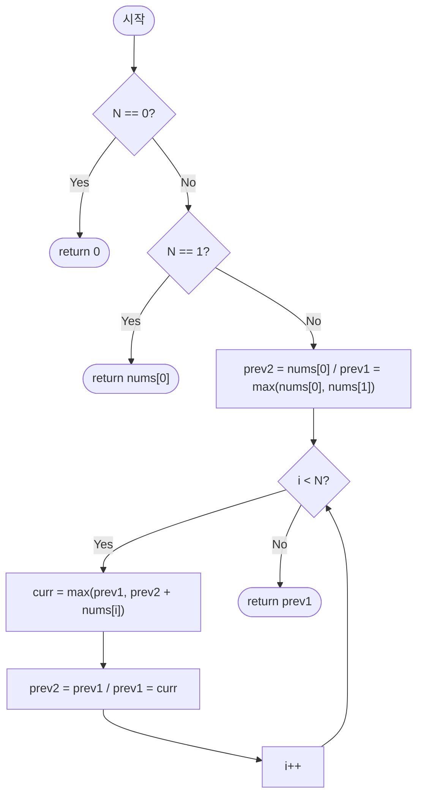

import { AlgorithmSimulation } from "#guide-sim";

# House Robber — 최근 두 칸만 기억하면 충분한 이유

## 한눈에 보는 컨셉

인접한 두 집을 동시에 털 수 없다는 제약은, "$i$번째 집까지 봤을 때의 최댓값"이 바로 이전 두 결정 — "$i-1$까지의 최댓값"과 "$i-2$까지의 최댓값" — 에만 의존한다는 사실로 이어져요. 이 관찰 하나로 $dp[i] = \max(dp[i-1],\, dp[i-2]+nums[i])$라는 점화식이 나오고, 배열 전체를 들고 있을 필요 없이 최근 두 값만 굴리면 `O(N)` 시간과 `O(1)` 공간으로 끝납니다. 이번 가이드의 핵심은 "왜 최근 두 칸만으로 충분한가"를 증명 수준으로 납득하는 것이에요.

## 출발점: 가장 순진한 방법부터

문제를 먼저 정확히 잡고 갈게요.

```ts
function houseRobber(nums: number[]): number;
```

- `nums` — 각 집의 현금. `nums[i]`는 $i$번째 집의 현금입니다.
- 반환 — 인접하지 않은 집들을 골라 얻을 수 있는 현금 합의 최댓값. 집을 하나도 안 골라도 되고 그러면 $0$이에요.
- 제약 — $0 \leq N \leq 100{,}000$, $0 \leq nums[i] \leq 10{,}000$, 시간 제한 1초.

$N$이 최대 10만까지 가고 시간 제한이 1초이니, 목표 복잡도는 $O(N)$ 근방으로 잡아야 해요. $O(N^2)$만 돼도 $10^{10}$이라 1초 안에 어림없고, $O(N \log N)$까지는 여유가 있지만 굳이 그럴 이유도 없습니다.

이 문제는 "얻을 수 있는 값의 최댓값을 구하라"는 형태니까, 가장 정직한 출발은 **가능한 모든 선택 조합을 나열해서, 제약(인접 금지)을 만족하는 것들 중 합이 최대인 걸 고르는 것**입니다. 집이 $N$개면 각 집을 "턴다/안 턴다" 두 가지로 결정할 수 있으니, 조합은 정확히 $2^N$가지예요.

```text
nums = [1, 2, 3, 1]  (N=4, 부분집합 2^4=16개)

mask   선택된 집       인접 위반?      합
0000   {}              -               0
0001   {0}             -               1
0010   {1}             -               2
0011   {0,1}           위반(0,1 인접)   -
0100   {2}             -               3
0101   {0,2}           -               4   ← 최댓값 후보
0110   {1,2}           위반             -
0111   {0,1,2}         위반             -
1000   {3}             -               1
1001   {0,3}           -               2
1010   {1,3}           -               3
1011   {0,1,3}         위반             -
1100   {2,3}           위반             -
1101   {0,2,3}         위반(2,3 인접)   -
1110   {1,2,3}         위반             -
1111   {0,1,2,3}       위반             -

최댓값 = 4  (mask 0101 = {0,2})  ✓ 예시와 일치
```

코드로 옮기면 이렇습니다.

```ts
function houseRobberNaive(nums: number[]): number {
  const n = nums.length;
  let best = 0;
  for (let mask = 0; mask < (1 << n); mask++) {
    let valid = true;
    let sum = 0;
    for (let i = 0; i < n; i++) {
      if ((mask & (1 << i)) === 0) continue;
      if (i > 0 && (mask & (1 << (i - 1)))) { valid = false; break; }
      sum += nums[i];
    }
    if (valid) best = Math.max(best, sum);
  }
  return best;
}
```

문제는 $N$이 커질 때예요.

```text
N        2^N (부분집합 수)
4        16
10       1,024
20       1,048,576
100,000  사실상 계산 불가능한 천문학적 수
```

$N \leq 100{,}000$ 규모에서는 이 방식이 애초에 시작도 못 합니다. 그런데 표를 다시 보면 낌새가 하나 보여요. `{0,2}`가 최댓값이 된 이유는, 사실 "집 3까지 본 최댓값"이 "집 2까지 본 결과들의 조합"으로 쪼개지기 때문입니다 — 매번 $2^N$개를 통째로 다시 나열할 필요 없이, 한 집씩 넓혀가며 이전 결과를 재사용할 수 있지 않을까요? 이게 다음 절의 출발점이에요.

## 아이디어 자세히 들여다보기

### 마지막 집에서 결정하기 — 수식과 그림

$i$번째 집까지의 상황만 본다고 생각해 봅시다. 상태를 이렇게 정의할게요.

$$
dp[i] = \text{집 } 0, 1, \dots, i \text{ 중에서 인접 조건을 지키며 얻을 수 있는 현금 합의 최댓값}
$$

$i$번째 집에 대해 선택지는 딱 두 가지, "턴다" 또는 "안 턴다"뿐이에요. 안 턴다면 $i-1$까지의 최선을 그대로 물려받고($dp[i-1]$), 턴다면 인접한 $i-1$은 못 쓰니 $i-2$까지의 최선에 지금 집의 현금을 더합니다($dp[i-2] + nums[i]$). 둘 중 큰 쪽이 답이에요.

$$
dp[i] = \max\bigl(dp[i-1],\; dp[i-2] + nums[i]\bigr), \qquad dp[0] = nums[0],\quad dp[1] = \max(nums[0], nums[1])
$$

**왜 하필 이 형태여야 할까요?** "집 $i$를 반드시 턴 경우"와 "반드시 안 턴 경우"를 따로 배열로 관리하는 정의도 생각해 볼 수 있어요 — `takeI[i]`, `skipI[i]`처럼요. 그런데 풀어보면 `takeI[i] = skipI[i-1] + nums[i]`(털려면 직전은 무조건 안 턴 경우여야 함)이고 `skipI[i] = max(takeI[i-1], skipI[i-1]) = dp[i-1]`이라, 결국 두 배열이 담는 정보는 지금의 `dp[i]` 하나로 합쳐집니다. 즉 "턴다/안 턴다를 나눠 기억하기"는 정보량이 똑같은데 변수만 두 배로 늘리는 셈이라, "$i$까지의 최댓값" 하나로 뭉친 지금 정의가 더 최소한의 상태예요.

`nums = [2, 7, 9, 3, 1]`로 표를 직접 채워 봅시다.

```text
i     :  0    1    2    3    4
nums  :  2    7    9    3    1
dp    :  2    7   11   11   12
```

- $dp[0] = nums[0] = 2$ (집 하나뿐이니 무조건 선택)
- $dp[1] = \max(2, 7) = 7$
- $dp[2] = \max(dp[1]{=}7,\; dp[0]{+}nums[2]{=}2{+}9{=}11) = 11$ — 집 2를 터는 쪽이 이깁니다.
- $dp[3] = \max(dp[2]{=}11,\; dp[1]{+}nums[3]{=}7{+}3{=}10) = 11$
- $dp[4] = \max(dp[3]{=}11,\; dp[2]{+}nums[4]{=}11{+}1{=}12) = 12$

잠깐, $dp[3]$이 왜 $dp[2]$와 똑같이 11인지 확인해 볼까요? 집 3을 털면 $7+3=10$인데, 이건 $dp[2]=11$보다 작습니다. 그러니 집 3은 포기하고 $dp[2]$ 값을 그대로 물려받는 거예요 — 즉 $dp[3]$이 "집 3을 턴 결과"라고 단정할 수 없습니다. 이 포인트는 뒤에서 다시 짚을게요.

### 단서를 설명해 주는 이론 — 마르코프 성질과 상태공간 축소

방금 세운 점화식을 다시 보면, $dp[i]$를 계산하는 데 쓰인 건 $dp[i-1]$과 $dp[i-2]$ 딱 둘뿐이에요. $dp[i-3]$이나 그 이전 값은 점화식 어디에도 등장하지 않습니다.

일반적으로 DP의 점화식이 $dp[i] = f(dp[i-1], \dots, dp[i-k], nums[i])$처럼 **고정된 폭 $k$**만 참조한다면, $dp[i]$를 계산하는 시점의 "다음 계산에 필요한 상태"는 최근 $k$개 값으로 완전히 요약됩니다. 그보다 이전 값들은 앞으로 다시는 조회되지 않으니, 굳이 배열에 남겨 둘 이유가 없어요. 이걸 **마르코프 성질**(미래는 과거 전체 경로가 아니라 현재 상태에만 의존한다는 성질)을 DP 점화식에 적용한 관점으로 볼 수 있습니다 — "현재 상태"가 곧 최근 $k$개 값의 묶음인 셈이죠.

지금 문제는 $k=2$입니다. $(dp[i-1], dp[i-2])$ 쌍이 "충분 통계량"이라, $dp[0..i-3]$은 계산이 끝나는 즉시 버려도 이후 결과에 아무 영향이 없어요. 이 원리는 피보나치 수열을 $O(1)$ 공간으로 도는 것, 0/1 배낭 문제에서 이전 행 하나만으로 충분한 것과 똑같은 이야기입니다. 뒤에서 이 이론을 다시 쓸 거니 **기억해 두세요**.

### 왜 모순 없이 작동하는가

점화식이 정말 옳은지 귀납으로 확인해 봅시다.

**기저**: $dp[0] = nums[0]$은 집이 하나뿐이니 선택의 여지 없이 맞습니다. $dp[1] = \max(nums[0], nums[1])$도 인접한 두 집 중 하나만 고를 수 있으니 둘 중 큰 값이 맞아요.

**귀납 단계**: $dp[0], \dots, dp[i-1]$이 모두 정확하다고 가정합니다. $dp[i]$를 만드는 경우의 수는 "집 $i$를 턴다"와 "안 턴다" 딱 둘뿐이고, 이 둘이 전부라는 건 자명해요(집 $i$에 대한 선택은 이진적이니까요) — **경우의 완전성**은 여기서 확보됩니다.

- 안 턴다면, 답은 $0..i-1$ 범위 안에서의 최선이어야 하고 이건 귀납 가정에 의해 정확히 $dp[i-1]$입니다.
- 턴다면, 인접 규칙 때문에 집 $i-1$은 절대 같이 고를 수 없어요. 그렇다고 $i-2$ 이하의 집들과는 아무 충돌이 없습니다($i$와 $i-2$의 거리는 2, 인접이 아니에요). 그러니 이 경우의 최선은 $dp[i-2]$가 이미 보장하는 "$0..i-2$ 최선"에 $nums[i]$를 더한 값이고, 이것도 귀납 가정에 의해 정확합니다.

두 경우 각각이 정확하므로, 둘 중 더 큰 쪽을 취하는 $\max$가 $dp[i]$의 정확한 값이 됩니다.

여기서 **헷갈리기 쉬운 포인트**가 둘 있어요.

- **$dp[i]$가 "집 $i$를 턴 결과"라고 착각하기 쉽습니다.** 실제로는 "$0..i$ 중 최선"이며, 집 $i$를 안 털어도 얻을 수 있는 값이에요. `nums = [3, 100, 1]`로 확인해 봅시다.

```text
nums  :   3    100    1
dp[0] =   3
dp[1] = max(3, 100) = 100
dp[2] = max(dp[1]=100, dp[0]+nums[2]=3+1=4) = 100

dp[2] = 100인데, 이건 집 2를 턴 값이 아니라
집 1만 턴 결과(100)를 그대로 물려받은 것 — 집 2는 선택되지 않았다.
```

- **$dp[i-2]$의 밑변 처리입니다.** $i=1$일 때 필요한 $dp[-1]$은 존재하지 않아요. 이걸 "$dp[-1] = 0$"으로 개념상 정의해 통일할 수도 있지만, 구현에서는 배열 인덱스 $-1$이 없으니 $dp[0]$과 $dp[1]$을 별도 기저로 명시하는 쪽이 안전합니다.

엣지 케이스도 점화식 위에서 점검해 둘게요.

```text
N = 0             → dp가 정의되지 않음 → 별도 분기로 0 반환 (훔칠 집이 없음)
N = 1             → dp[0] = nums[0]   → 무조건 그 집 (선택의 여지 없음)
N = 2             → dp[1] = max(nums[0], nums[1]) → 인접한 두 집 중 큰 값만
모든 nums[i] = 0  → dp 전부 0 → 반환값 0 (양수가 없으니 훔쳐도 의미 없음)
```

## 아이디어를 코드로 옮기기

앞의 점화식을 그대로 배열에 옮기면 이렇습니다.

```ts
function houseRobberDp(nums: number[]): number {
  const n = nums.length;
  if (n === 0) return 0;
  if (n === 1) return nums[0];

  const dp = new Array<number>(n);
  dp[0] = nums[0];
  dp[1] = Math.max(nums[0], nums[1]);

  for (let i = 2; i < n; i++) {
    dp[i] = Math.max(dp[i - 1], dp[i - 2] + nums[i]);
  }

  return dp[n - 1];
}
```

**가장 실수가 잦은 줄은 `dp[1] = Math.max(nums[0], nums[1]);`입니다.** 이 줄 앞에 `n === 1` 가드가 없으면 `nums[1]`이 `undefined`가 되어 계산이 조용히 깨져요. 그래서 `n === 0`, `n === 1`을 먼저 걸러내고, 루프는 `dp[1]`까지 기저를 다 채운 뒤 `i = 2`부터 시작합니다 — 순회 방향은 앞에서 뒤로 한 번만 지나가면 충분합니다(각 $dp[i]$가 자신보다 작은 인덱스만 참조하니까요).

## 더 빠르게 만들 단서 찾기

방금 만든 `dp` 배열의 접근 패턴을 다시 봅시다. $i=4$를 계산하는 순간 실제로 읽은 건 `dp[2]`, `dp[3]` 두 칸뿐이었어요.

```text
dp = [2, 7, 11, 11, 12]
              ^    ^
i=4 계산에 필요한 건 dp[2]=11, dp[3]=11 뿐
dp[0], dp[1]은 이미 다 썼고 앞으로 다시 조회되지 않는다 → 배열에 남겨둘 이유가 없다
```

앞 절에서 "기억해 두라"고 했던 마르코프 성질이 여기서 쓰입니다 — $dp[i]$를 계산하는 데 필요한 상태는 $(dp[i-1], dp[i-2])$ 두 값뿐이므로, 길이 $N$짜리 배열 전체($O(N)$ 공간)를 들고 있을 이유가 없어요.

## 단서를 최적화로 연결하기

배열 대신 최근 두 값만 변수 두 개로 굴려 봅시다.

```text
Before (배열 전체 보관):
dp = [dp0, dp1, dp2, dp3, dp4, ...]        공간 O(N)

After (최근 두 칸만 슬라이딩):
prev2 = dp[i-2]
prev1 = dp[i-1]
curr  = max(prev1, prev2 + nums[i])
→ 다음 라운드를 위해:  prev2 ← prev1,  prev1 ← curr    공간 O(1)
```

루프가 유지해야 할 불변식은 하나예요.

> 루프가 $i$번째 반복에 진입하는 순간, `prev2`는 항상 $dp[i-2]$, `prev1`은 항상 $dp[i-1]$과 같은 값을 들고 있다.

## 최적화 코드

```ts
function houseRobber(nums: number[]): number {
  const n = nums.length;
  if (n === 0) return 0;
  if (n === 1) return nums[0];

  let prev2 = nums[0];
  let prev1 = Math.max(nums[0], nums[1]);

  for (let i = 2; i < n; i++) {
    const curr = Math.max(prev1, prev2 + nums[i]);
    prev2 = prev1;
    prev1 = curr;
  }

  return prev1;
}
```

**가장 중요한 줄은 `const curr = Math.max(prev1, prev2 + nums[i]);`입니다.** 앞서 증명한 점화식 그대로예요. 그다음 두 줄의 **순서**도 못지않게 중요합니다 — `prev2 = prev1;`이 먼저 와야, 아직 이전 값을 담고 있는 `prev1`을 `prev2`로 옮길 수 있어요. 순서를 바꿔서 `prev1 = curr;`을 먼저 쓰면, 그다음 줄의 `prev1`은 이미 `curr`로 덮어써진 새 값이라 `prev2`가 $dp[i-1]$이 아니라 $dp[i]$가 되어버립니다.

`nums = [2, 7, 9, 3, 1]`로 실제로 확인해 보면, 정상 실행은 `curr` 값이 $[11, 11, 12]$로 이어지며 최종 12를 반환해요. 그런데 순서를 뒤집으면(`prev1 = curr; prev2 = prev1;`) `curr` 값이 $[11, 14, 15]$로 완전히 다르게 흐르고, 최종 반환값도 12가 아니라 **15**라는 틀린 값이 조용히 나옵니다.

> 새 값을 대입하기 전에 옛 값부터 옮겨라 — 먼저 밀고, 나중에 덮어써라.

여기서 최적화를 마칩니다. 시간 $O(N)$, 공간 $O(1)$ — 처음에 세운 목표를 달성했어요. 더 줄일 여지가 있을까요? 정답을 결정하려면 `nums`의 모든 원소를 최소 한 번은 읽어야 하니 시간 하한은 $\Omega(N)$이고, 지금 풀이가 이미 그 하한과 같은 점근 복잡도입니다. 즉 이 이상의 점근적 개선은 없습니다.

## 실행 시각화

고정 입력 `nums = [2, 7, 9, 3, 1]`에 대한 진행 과정입니다. 실제 반환값은 12예요. `array` 패널은 현재 보고 있는 `nums`와 하이라이트된 인덱스를, `keyValue` 패널은 그 시점의 `prev2`/`prev1`(또는 `curr`) 값을 보여줍니다. 마지막 프레임에서 `prev1 = 12`로 수렴하고, 선택된 집은 인덱스 0, 2, 4($2+9+1=12$)예요 — 앞서 손으로 채운 dp 표와 정확히 같은 값입니다.

> 대화형 시뮬레이션은 MDX 런타임에서 표시됩니다.

export const nums = [2, 7, 9, 3, 1];

export const steps = [
  {
    title: "초기화",
    detail: "prev2 = dp[0] = nums[0] = 2. prev1 = dp[1] = max(nums[0], nums[1]) = max(2, 7) = 7.",
    array: nums,
    highlight: [0, 1],
    entries: [
      { label: "prev2 (dp[0])", value: 2 },
      { label: "prev1 (dp[1])", value: 7 },
    ],
  },
  {
    title: "i=2: nums[2]=9",
    detail: "curr = max(prev1=7, prev2+nums[2]=2+9=11) = 11 → 집 2를 턴다. 슬라이딩: prev2=7, prev1=11.",
    array: nums,
    highlight: [2],
    entries: [
      { label: "prev2 (dp[0])", value: 2 },
      { label: "prev1 (dp[1])", value: 7 },
      { label: "curr (dp[2])", value: 11 },
    ],
  },
  {
    title: "i=3: nums[3]=3",
    detail: "curr = max(prev1=11, prev2+nums[3]=7+3=10) = 11 → 집 3 건너뛰기. 슬라이딩: prev2=11, prev1=11.",
    array: nums,
    highlight: [3],
    entries: [
      { label: "prev2 (dp[1])", value: 7 },
      { label: "prev1 (dp[2])", value: 11 },
      { label: "curr (dp[3])", value: 11 },
    ],
  },
  {
    title: "i=4: nums[4]=1",
    detail: "curr = max(prev1=11, prev2+nums[4]=11+1=12) = 12 → 집 4를 턴다. 슬라이딩: prev2=11, prev1=12.",
    array: nums,
    highlight: [4],
    entries: [
      { label: "prev2 (dp[2])", value: 11 },
      { label: "prev1 (dp[3])", value: 11 },
      { label: "curr (dp[4])", value: 12 },
    ],
  },
  {
    title: "완료: prev1 = 12",
    detail: "순회 종료. dp[N-1] = prev1 = 12. 선택된 집은 0, 2, 4 (값 2+9+1=12).",
    array: nums,
    marked: [0, 2, 4],
    entries: [
      { label: "결과 prev1", value: 12 },
      { label: "선택한 집", value: "0, 2, 4" },
    ],
  },
];

<AlgorithmSimulation view={["array", "keyValue"]} steps={steps} title="House Robber: nums=[2,7,9,3,1]" />

## 흐름 한눈에 보기



## 스스로 점검하기

1. `nums = [2, 1, 1, 2]`에 대해 $dp[0..3]$ 표를 직접 채워 보세요. 최종 답은 4가 나와야 하고, 그 값을 만드는 선택된 집 인덱스도 함께 답해 보세요.
2. 최적화 코드에서 만약 `prev1 = curr;`을 `prev2 = prev1;`보다 먼저 쓰면 어떻게 될까요? `nums = [2, 7, 9, 3, 1]`을 손으로 따라가며, $i=3$에서 `curr`이 몇으로 틀어지는지, 최종 반환값이 얼마로 잘못 나오는지 추적해 보세요. (힌트: 정상 흐름의 `curr` 값은 $11, 11, 12$입니다.)
3. 집들이 원형으로 배치되어 있어서 **첫 집과 마지막 집도 인접**하다면 어떻게 풀까요? (힌트: 지금 만든 `houseRobber` 함수를 그대로 두 번 재사용할 방법을 생각해 보세요 — "첫 집을 아예 후보에서 뺀 구간"과 "마지막 집을 아예 후보에서 뺀 구간" 각각에 대해 지금 함수를 돌리고 더 큰 쪽을 취하면 됩니다.)
