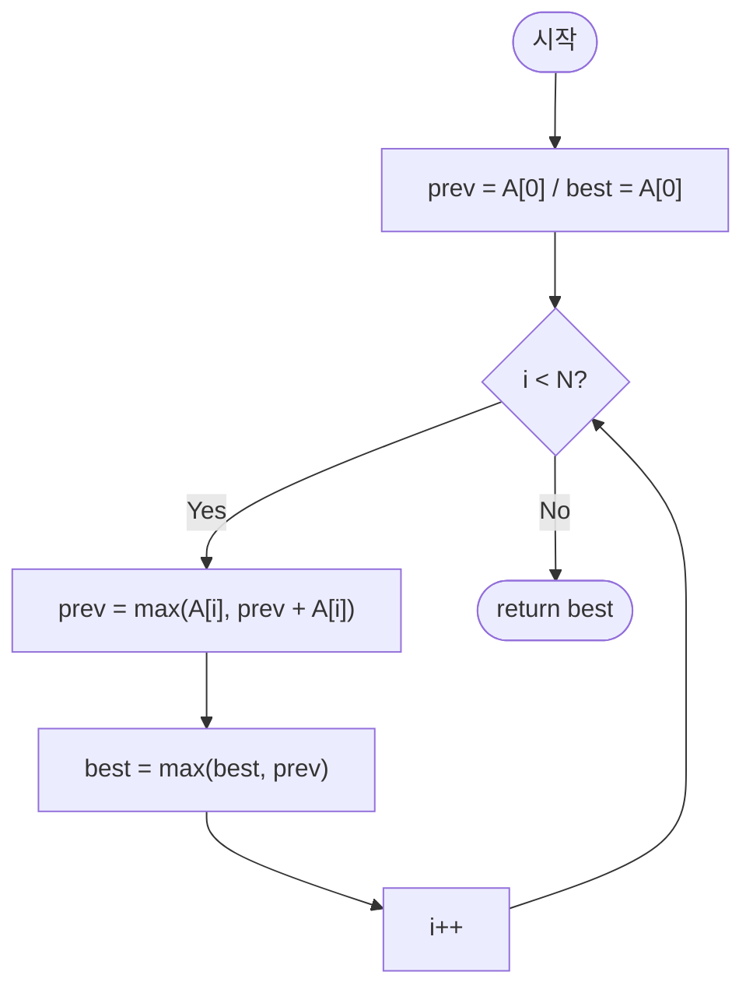

import { AlgorithmSimulation } from "#guide-sim";

# kadane — 지금까지의 누적이 마이너스면, 미련 없이 버리고 새로 시작해도 되는 이유

## 한눈에 보는 컨셉

연속된 부분 배열의 최대합을 구하는 문제예요. 핵심 관찰은 하나입니다 — "여기까지 이어온 누적합이 마이너스라면, 그걸 다음 원소에 얹느니 지금 원소 하나로 새로 시작하는 편이 항상 더 좋거나 같다"는 것이죠. 이 관찰 하나로 모든 시작점·끝점 쌍을 다 뒤지는 `O(N^2)` 탐색이, 배열을 단 한 번만 훑는 `O(N)` 순회로 줄어듭니다.

## 출발점: 가장 순진한 방법부터

문제를 먼저 정확히 잡을게요.

```ts
function kadane(A: number[]): number
```

정수 배열 `A`를 받아, 길이 1 이상인 연속 부분 배열의 합 중 최댓값을 반환합니다. 빈 부분 배열은 허용되지 않아요 — 그래서 배열의 모든 원소가 음수라도 그중 가장 덜 나쁜 원소 하나를 반드시 골라 반환해야 합니다. 제약은 $1 \leq N \leq 100{,}000$, $-10{,}000 \leq A[i] \leq 10{,}000$이에요.

"최댓값을 구하는 문제니까, 일단 후보를 전부 나열해 보자"는 게 가장 정직한 출발이에요. 부분 배열은 시작점 `i`와 끝점 `j`(`i ≤ j`)로 결정되니, 가능한 `(i, j)` 쌍을 전부 순회하며 합을 구하고 최댓값을 갱신하면 됩니다.

```ts
function kadaneNaive(A: number[]): number {
  let best = A[0];
  for (let i = 0; i < A.length; i++) {
    let s = 0;
    for (let j = i; j < A.length; j++) {
      s += A[j];
      best = Math.max(best, s);
    }
  }
  return best;
}
```

작은 예로 비용을 체감해 볼게요. `A = [-2, 1, -3]`이면 시작점마다 부분합을 처음부터 다시 누적합니다.

```text
i=0: s=-2, s=-2+1=-1, s=-1-3=-4     → 3번 덧셈
i=1: s=1,  s=1-3=-2                  → 2번 덧셈
i=2: s=-3                            → 1번 덧셈
합계: 3+2+1 = 6번 덧셈 (N=3일 때 N(N+1)/2 = 6)
```

원소가 3개일 때도 벌써 6번인데, $N = 10^5$이면 $N(N+1)/2 \approx 5 \times 10^9$번의 덧셈이 필요해요. 시간 제한 1초 안에서 감당할 수 있는 연산량이 대략 $10^8$ 수준임을 감안하면 자릿수가 두 자리나 넘칩니다 — 그대로는 시간 초과예요. 목표는 배열을 한 번만 훑는 $O(N)$, 즉 $10^5$ 규모의 연산으로 끝내는 것입니다.

왜 이렇게 느린가 뜯어보면, 시작점 `i`가 하나 바뀔 때마다 안쪽 루프가 부분합을 **처음부터 다시** 쌓아 올리고 있어요. `i=0`일 때 이미 `A[0..2]`까지 훑었는데, `i=1`에서 또 `A[1..2]`를 처음부터 훑습니다. 겹치는 계산을 매번 버리고 있는 셈이죠. **"끝점을 고정하고, 그 끝점에서 끝나는 최대합을 한 번만 계산해서 재사용할 수는 없을까?"** — 이게 이번 알고리즘의 출발 단서예요.

## 아이디어 자세히 들여다보기

### 위치 i에서 끝나는 최대합 — 수식과 그림

앞서 남긴 단서를 정식으로 세워 볼게요. "끝점 `i`를 고정"한 상태 하나를 정의합니다.

$$dp[i] = \text{위치 } i \text{에서 끝나는 연속 부분 배열의 합 중 최댓값}$$

왜 하필 "끝점 고정"이어야 할까요? 만약 대신 "구간 `[l, r]`의 최댓값"처럼 시작점과 끝점을 둘 다 걸고 정의하면, `dp[l][r]`이 다른 여러 `dp[l'][r']`을 참조하게 되어 부분 문제들 사이에 뚜렷한 순서가 안 생겨요. 반면 "끝점만 고정"하면 $dp[i]$는 오직 $dp[i-1]$ 하나만 필요로 하게 되어, 부분 문제가 왼쪽에서 오른쪽으로 일렬로 늘어섭니다. 이 "일렬로 늘어선다"는 성질이 뒤에서 단일 순회로 풀리는 이유예요.

그림으로 보면 위치 `i`에서 끝나는 부분 배열의 후보는 딱 두 갈래입니다.

```text
A = [ ... , A[i-1], A[i] ]

갈래 1: A[i] 하나로 새로 시작       →  합 = A[i]
갈래 2: A[i-1]에서 끝나는 최대합에 A[i]를 이어 붙임   →  합 = dp[i-1] + A[i]

dp[i] = max( 갈래1, 갈래2 )
```

작은 배열 `A = [-2, 1, -3]`으로 손을 움직여 볼게요. $dp[0] = A[0] = -2$입니다(위치 0에서 끝나는 부분 배열은 `[A[0]]` 하나뿐이니까요). $dp[1]$은 갈래 1이 `A[1]=1`, 갈래 2가 `dp[0]+A[1] = -2+1 = -1`이니 $dp[1] = \max(1, -1) = 1$이에요. $dp[2]$는 갈래 1이 `A[2]=-3`, 갈래 2가 `dp[1]+A[2] = 1-3 = -2`이니 $dp[2] = \max(-3, -2) = -2$가 됩니다.

> 잠깐, 확인 하나만 해 볼까요? `A = [3, -1, 4]`라면 $dp[1]$은 얼마일까요? 갈래 1은 `A[1]=-1`, 갈래 2는 `dp[0]+A[1] = 3-1=2`이니 $dp[1] = \max(-1, 2) = 2$입니다 — 이전 누적이 양수(`3`)라 이어 붙이는 쪽이 이깁니다.

전체 답은 이 $dp$ 값들 중 최댓값이에요.

$$\text{kadane}(A) = \max_{0 \leq i < N} dp[i]$$

### 단서를 설명해 주는 이론 — 마르코프성(제한된 의존 범위)

방금 세운 정의를 다시 보면 흥미로운 성질이 하나 있어요. $dp[i]$를 계산하는 데 필요한 정보가 $dp[i-1]$과 $A[i]$뿐이고, $dp[i-2], dp[i-3], \ldots$ 같은 더 먼 과거는 전혀 필요하지 않습니다. 이렇게 "다음 상태가 오직 바로 직전 상태에만 의존하고, 그보다 먼 과거는 이미 직전 상태에 다 녹아들어 있어서 다시 볼 필요가 없는" 성질을 **마르코프성(Markov property)**이라고 불러요.

여기서 "이미 다 녹아들어 있다"는 말이 중요합니다. $dp[i-1]$ 자체가 "위치 $i-2$까지의 모든 정보를 요약한 최종 결론"이기 때문에, $dp[i]$ 입장에서는 그 요약본 하나만 들고 있으면 충분하고, 요약되기 전의 원본 이력을 다시 뒤질 이유가 없어요. 마치 오늘의 은행 잔고만 알면 내일 잔고를 계산할 수 있고, 지난 100일간의 입출금 내역을 다시 훑을 필요가 없는 것과 같은 이치예요.

이 성질이 왜 중요한지는 지금 당장은 "정의가 재귀적으로 잘 선다"는 정도로만 기억해 두시고, **이 관찰이 나중에 "dp 배열 전체를 저장할 필요가 있는가?"라는 질문에 직접적인 답을 준다는 것**을 기억해 두세요. 곧 "더 빠르게 만들 단서 찾기" 절에서 정확히 이 지점으로 돌아옵니다.

### 왜 모순 없이 작동하는가

이 재귀 정의가 항상 옳은 답을 낸다는 것을 귀납적으로 확인해 볼게요.

**기저**: $dp[0] = A[0]$입니다. 위치 0에서 끝나는 부분 배열은 `[A[0]]` 하나뿐이니, 이 값이 최댓값이라는 데 이견이 없어요.

**귀납 가정**: $dp[i-1]$이 위치 $i-1$에서 끝나는 부분 배열들의 합 중 진짜 최댓값이라고 가정합니다.

**귀납 단계**: 위치 $i$에서 끝나는 임의의 부분 배열은 반드시 $A[l..i]$ ($0 \leq l \leq i$) 꼴이에요. 시작점 $l$의 선택지는 "$l = i$"이거나 "$l < i$"인 경우 딱 둘로 완전히 나뉩니다(그 사이의 제3의 경우는 없어요).

- $l = i$이면 부분 배열은 `[A[i]]` 하나뿐이고 합은 $A[i]$입니다.
- $l < i$이면 이 부분 배열은 "$A[l..i-1]$에 $A[i]$를 이어 붙인 것"과 정확히 같아요. $A[l..i-1]$은 위치 $i-1$에서 끝나는 부분 배열이므로, 귀납 가정에 의해 그중 최댓값은 $dp[i-1]$입니다. 따라서 $l < i$인 경우들 중 최댓값은 $dp[i-1] + A[i]$예요.

두 갈래가 경우의 전부이고, 각 갈래 안에서의 최댓값이 각각 $A[i]$와 $dp[i-1]+A[i]$로 확정되었으니, 전체 최댓값은 이 둘 중 큰 쪽 $dp[i] = \max(A[i], dp[i-1]+A[i])$입니다. 귀납이 성립해요.

여기서 **헷갈리기 쉬운 포인트**는 "이전 누적이 음수면 무조건 버려야 한다"는 규칙을 $\max$가 알아서 강제한다는 걸 놓치는 것입니다. $dp[i-1] < 0$이면 $dp[i-1] + A[i] < A[i]$가 성립하니(음수를 더했으니 당연히 작아지죠), $\max$ 연산이 자동으로 $A[i]$ 쪽을 선택합니다. 즉 "버릴지 말지"를 따로 조건문으로 짤 필요 없이, $\max$ 하나가 이미 그 판단을 포함하고 있어요.

엣지 케이스에서도 이 정의가 그대로 작동하는지 짚어 볼게요.

```text
모두 음수: A=[-3,-1,-2]  → dp=[-3,-1,-2], best=-1 (가장 덜 나쁜 원소 -1)
원소 1개:  A=[7]         → dp=[7], best=7
원소 0 포함: A=[0,0,0]   → dp=[0,0,0], best=0
경계값:    A=[-10000,10000,-10000] → dp[1]=max(10000, -10000+10000=0)=10000, best=10000
```

## 아이디어를 코드로 옮기기

정의를 그대로 코드로 옮기면 이렇습니다. 재귀식이 배열 하나로 그대로 번역돼요.

```ts
function kadaneDpArray(A: number[]): number {
  const n = A.length;
  const dp = new Array<number>(n);
  dp[0] = A[0];
  for (let i = 1; i < n; i++) {
    dp[i] = Math.max(A[i], dp[i - 1] + A[i]);
  }
  let best = dp[0];
  for (let i = 1; i < n; i++) {
    best = Math.max(best, dp[i]);
  }
  return best;
}
```

결정 지점만 짚을게요. 초기값은 `dp[0] = A[0]`으로 시작하고, 루프는 `i = 1`부터 `n-1`까지 돌면서 $dp[i] = \max(A[i], dp[i-1]+A[i])$를 그대로 옮깁니다. 답은 `dp` 배열 전체의 최댓값이지, 마지막 원소 `dp[n-1]`이 아니라는 점을 기억하세요 — 최대합 구간이 배열 중간에서 끝날 수도 있으니까요.

**가장 실수가 잦은 부분은 답을 `dp[n-1]`로 착각하는 것입니다.** 앞서 본 대표 예시 `A = [-2, 1, -3, 4, -1, 2, 1, -5, 4]`를 이 코드로 실행하면 `dp = [-2, 1, -2, 4, 3, 5, 6, 1, 5]`가 나오는데, 최댓값 `6`은 `dp[6]`에서 나오지 마지막 원소 `dp[8]=5`가 아닙니다. 배열 전체를 훑어 최댓값을 뽑아야 하는 이유가 바로 이거예요.

## 더 빠르게 만들 단서 찾기

방금 짠 코드를 다시 보면, `dp` 배열에 원소를 `n`개나 저장하고 있어요. 그런데 루프 안에서 실제로 읽는 값은 매 순간 `dp[i-1]` 하나뿐입니다. `dp[0]`은 `dp[1]`을 계산할 때 딱 한 번 읽히고, 그 뒤로는 영원히 다시 읽히지 않아요.

```text
dp = [ dp[0], dp[1], dp[2], dp[3], ..., dp[i-1], dp[i], ... ]
                                          ↑
                            dp[i]를 계산할 때 실제로 읽는 칸은 이거 하나뿐

dp[0], dp[1], ..., dp[i-2]는 이미 다 지나간 값 — 다시는 읽히지 않는데도
배열에 그대로 눌러앉아 메모리를 차지하고 있다
```

앞서 3.2절에서 짚어 둔 마르코프성이 정확히 이 낭비의 근거예요. $dp[i]$는 $dp[i-1]$만 있으면 계산되니, $dp[i-2]$ 이전 값들을 배열에 붙들어 둘 이유가 애초에 없었던 겁니다. "직전 값 하나만 기억하면 충분하다"는 이론적 사실이, 지금 눈앞의 "배열 전체를 왜 저장하고 있지?"라는 구체적 낭비와 정확히 맞아떨어집니다.

## 단서를 최적화로 연결하기

배열 대신 스칼라 변수 두 개만 유지하면 됩니다.

- `prev` — 방금 계산한 $dp[i-1]$의 값 (다음 계산에 필요한 유일한 과거)
- `best` — 지금까지 본 $dp$ 값들의 최댓값 (지금까지의 답)

```text
Before (배열):  dp = [ -2, 1, -2, 4, 3, 5, 6, 1, 5 ]   → O(N) 공간

After (롤링):   prev, best  두 칸짜리 변수              → O(1) 공간

              i가 한 칸 전진할 때마다:
              prev ← max(A[i], prev + A[i])   (dp[i]로 갱신)
              best ← max(best, prev)          (전역 최댓값 갱신)
              이전 prev 값은 버려도 안전 — 다음 계산에 다시 쓰이지 않으므로
```

지켜야 할 불변식은 이거예요: **루프에서 인덱스 `i`를 처리하기 직전, `prev`는 항상 $dp[i-1]$이고 `best`는 항상 $\max(dp[0], \ldots, dp[i-1])$이다.** 이 불변식이 매 반복에서 유지되기만 하면, 루프가 끝난 시점에 `best`는 정확히 $\max_{0 \leq i < N} dp[i]$가 됩니다.

## 최적화 코드

바뀌는 곳은 `dp` 배열을 스칼라 두 개로 바꾸는 것뿐입니다.

```ts
function kadane(A: number[]): number {
  let prev = A[0];
  let best = A[0];
  for (let i = 1; i < A.length; i++) {
    prev = Math.max(A[i], prev + A[i]);
    best = Math.max(best, prev);
  }
  return best;
}
```

**가장 중요한 줄은 `prev`를 먼저 갱신하고 그다음 `best`를 갱신하는 순서입니다.** 이 순서를 바꾸면 조용히 틀립니다 — 실제로 손 검산해 볼게요. `A = [-1, -1, 5]`에서 `best`를 먼저 갱신하도록 순서를 뒤집으면:

```text
정상 순서 (prev 먼저):
  i=1: prev=max(-1,-1-1=-2)=-1, best=max(-1,-1)=-1
  i=2: prev=max(5,-1+5=4)=5,    best=max(-1,5)=5      → 최종 5 (정답)

버그 순서 (best 먼저):
  i=1: best=max(-1, prev=-1)=-1,  prev=max(-1,-2)=-1     ← 아직 갱신 전 prev 사용
  i=2: best=max(-1, prev=-1)=-1,  prev=max(5,4)=5         ← 이번에도 갱신 전 prev 사용
  루프 종료 → 최종 -1 (오답, 정답 5를 한 번도 못 봄)
```

`best`를 먼저 갱신하면 그 시점의 `prev`는 아직 `dp[i-1]`을 담고 있을 뿐 `dp[i]`로 업데이트되기 전이라, `best`가 `dp[i]`를 영원히 보지 못하고 한 박자씩 밀립니다. 이 배열에서는 최댓값이 마지막 인덱스에서만 만들어지기 때문에, 밀린 채로 루프가 끝나 최댓값을 통째로 놓쳐 버려요.

또 하나 흔한 함정은 `best`의 초깃값입니다. `best = 0`으로 시작하면 어떻게 될까요? `A = [-3, -1, -2]`(모두 음수)로 확인해 보면, 정상 코드는 `-1`을 반환하지만 `best = 0`으로 초기화한 버전은 끝까지 `0`을 반환합니다 — 문제가 금지한 "빈 부분 배열(합 0)"을 몰래 답으로 채택해 버리는 셈이에요. 그래서 `best`는 반드시 `A[0]`으로 시작해야 합니다.

> 기억법: "먼저 다음 칸을 채우고(prev), 그다음 지금까지의 최고 기록을 갱신한다(best)." 순서를 이 문장 그대로 외워 두면 됩니다.

여기서 더 최적화할 여지가 있을까요? 없습니다 — 그리고 이건 근거가 있는 결론이에요. 정답을 구하려면 배열의 어떤 원소든 최소 한 번은 들여다봐야 합니다(한 원소를 아예 보지 않으면, 그 자리에 아주 큰 양수를 몰래 끼워 넣어도 알고리즘이 눈치챌 방법이 없으니까요). 따라서 어떤 알고리즘도 $\Omega(N)$ 시간보다 빨라질 수 없고, 지금 코드는 정확히 $O(N)$ 시간·$O(1)$ 공간이므로 시간·공간 모두 이 문제의 하한에 도달했습니다. 참고로 "같은 배열에 대해 구간이 계속 바뀌며 반복 질의가 들어오는" 변형이라면 세그먼트 트리 같은 자료구조로 질의당 $O(\log N)$을 낼 수 있지만, 이는 **한 번의 질의를 푸는 이 문제와는 다른 문제**(반복 질의 + 갱신)예요. 지금 풀고 있는 "배열 하나, 질의 한 번" 문제에서는 Kadane의 $O(N)$이 이미 최선입니다.

## 실행 시각화

입력 `A = [-2, 1, -3, 4, -1, 2, 1, -5, 4]`에 대해 위 최적화 코드를 실행하는 과정입니다. `highlight`(빨강)는 현재 검사 중인 원소 `A[i]`, `marked`(회색)는 현재 `best`를 만든 최적 구간이에요. keyValue 패널은 롤링 변수 `prev`(위치 i에서 끝나는 최대합)와 전역 `best`의 스냅샷을 보여줍니다. 실제 반환값은 `6`이며(구간 `[3..6]`의 합 `4+(-1)+2+1`), 이 값은 앞 절 코드를 직접 실행해 확인한 값이자 시뮬레이션 마지막 프레임의 `best`와도 일치합니다.

> 대화형 시뮬레이션은 MDX 런타임에서 표시됩니다.

export const A = [-2, 1, -3, 4, -1, 2, 1, -5, 4];

export const steps = [
  {
    title: "초기화 (i=0)",
    detail: "prev = A[0] = -2, best = A[0] = -2.",
    array: A,
    highlight: [0],
    marked: [0],
    entries: [
      { label: "i", value: 0 },
      { label: "prev (dp[i])", value: -2 },
      { label: "best", value: -2 },
    ],
  },
  {
    title: "i=1: A[1]=1",
    detail: "prev = max(1, -2+1=-1) = 1 → 새로 시작. best = max(-2, 1) = 1.",
    array: A,
    highlight: [1],
    marked: [1],
    entries: [
      { label: "i", value: 1 },
      { label: "prev (dp[i])", value: 1 },
      { label: "best", value: 1 },
    ],
  },
  {
    title: "i=2: A[2]=-3",
    detail: "prev = max(-3, 1+(-3)=-2) = -2 → 이어 붙이기. best = max(1, -2) = 1.",
    array: A,
    highlight: [2],
    marked: [1],
    entries: [
      { label: "i", value: 2 },
      { label: "prev (dp[i])", value: -2 },
      { label: "best", value: 1 },
    ],
  },
  {
    title: "i=3: A[3]=4",
    detail: "prev = max(4, -2+4=2) = 4 → 새로 시작. best = max(1, 4) = 4.",
    array: A,
    highlight: [3],
    marked: [3],
    entries: [
      { label: "i", value: 3 },
      { label: "prev (dp[i])", value: 4 },
      { label: "best", value: 4 },
    ],
  },
  {
    title: "i=4: A[4]=-1",
    detail: "prev = max(-1, 4+(-1)=3) = 3 → 이어 붙이기. best = max(4, 3) = 4.",
    array: A,
    highlight: [4],
    marked: [3],
    entries: [
      { label: "i", value: 4 },
      { label: "prev (dp[i])", value: 3 },
      { label: "best", value: 4 },
    ],
  },
  {
    title: "i=5: A[5]=2",
    detail: "prev = max(2, 3+2=5) = 5 → 이어 붙이기. best = max(4, 5) = 5.",
    array: A,
    highlight: [5],
    marked: [3, 4, 5],
    entries: [
      { label: "i", value: 5 },
      { label: "prev (dp[i])", value: 5 },
      { label: "best", value: 5 },
    ],
  },
  {
    title: "i=6: A[6]=1",
    detail: "prev = max(1, 5+1=6) = 6 → 이어 붙이기. best = max(5, 6) = 6.",
    array: A,
    highlight: [6],
    marked: [3, 4, 5, 6],
    entries: [
      { label: "i", value: 6 },
      { label: "prev (dp[i])", value: 6 },
      { label: "best", value: 6 },
    ],
  },
  {
    title: "i=7: A[7]=-5",
    detail: "prev = max(-5, 6+(-5)=1) = 1 → 이어 붙이기. best = max(6, 1) = 6.",
    array: A,
    highlight: [7],
    marked: [3, 4, 5, 6],
    entries: [
      { label: "i", value: 7 },
      { label: "prev (dp[i])", value: 1 },
      { label: "best", value: 6 },
    ],
  },
  {
    title: "i=8: A[8]=4",
    detail: "prev = max(4, 1+4=5) = 5 → 이어 붙이기. best = max(6, 5) = 6.",
    array: A,
    highlight: [8],
    marked: [3, 4, 5, 6],
    entries: [
      { label: "i", value: 8 },
      { label: "prev (dp[i])", value: 5 },
      { label: "best", value: 6 },
    ],
  },
  {
    title: "완료: best = 6",
    detail: "순회 종료. 최대 부분합은 구간 [3..6]의 4+(-1)+2+1 = 6.",
    array: A,
    marked: [3, 4, 5, 6],
    entries: [
      { label: "결과 best", value: 6 },
      { label: "최적 구간", value: "[3..6]" },
    ],
  },
];

<AlgorithmSimulation view={["array", "keyValue"]} steps={steps} title="Kadane 최대 부분합: A=[-2,1,-3,4,-1,2,1,-5,4]" />

## 흐름 한눈에 보기



## 스스로 점검하기

1. `A = [3, -2, 5, -1]`에 대해 `dp` 배열을 손으로 채워 보세요. (힌트: $dp[0]=3$부터 시작해 $dp[i] = \max(A[i], dp[i-1]+A[i])$를 순서대로 계산하면 `dp = [3, 1, 6, 5]`가 나오고, 답은 `max(dp) = 6`입니다.)
2. "최적화 코드" 절에서 본 함정처럼, 이번엔 `best`의 초기값을 `A[0]` 대신 `Math.min(...A)`로 잘못 설정했다고 가정해 보세요. `A = [1, 2, 3]`에서 이 버그가 실제로 답을 틀리게 만드는지, 아니면 우연히 정답이 나오는지 직접 손으로 따라가 확인해 보세요. (`best`가 이미 배열 내 최솟값에서 출발하므로 이 배열에서는 우연히 정답이 나옵니다 — 그렇다면 어떤 배열을 골라야 이 버그가 실제로 드러날지도 생각해 보세요.)
3. 배열이 원형으로 이어져 있어서 "끝에서 처음으로 다시 넘어가는" 구간도 후보가 될 수 있다면 어떻게 접근을 바꿔야 할까요? (힌트: 전체 합에서 "최소합 부분 배열"을 빼는 방식을 생각해 보고, 모든 원소가 음수인 경우는 왜 예외로 따로 처리해야 하는지도 짚어 보세요.)
