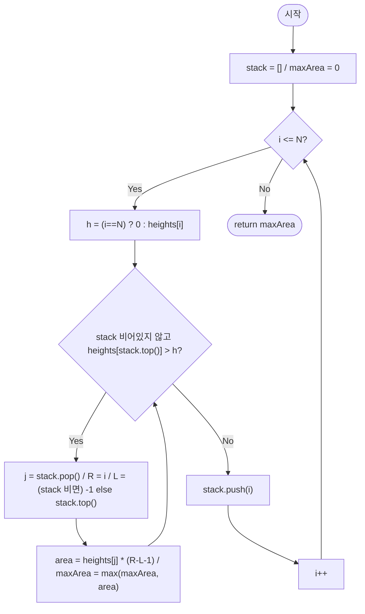

import { AlgorithmSimulation } from "#guide-sim";

# largestRectangleInHistogram — 막대가 스택에서 팝되는 순간이 곧 경계가 확정되는 순간인 이유

## 한눈에 보는 컨셉

히스토그램 막대들 사이에서 가장 큰 직사각형을 찾는 문제예요. 핵심 관찰은 이거예요 — 어떤 막대가 "나보다 낮은 막대를 만나 옆으로 밀려나는(pop되는) 순간", 그 막대가 만들 수 있는 최대 너비의 오른쪽 끝이 그 자리에서 확정됩니다. 이 순간을 스택으로 포착하면 모든 막대를 딱 한 번씩만 push/pop해서 `O(N)`에 답을 구할 수 있어요.

## 출발점: 가장 순진한 방법부터

문제를 먼저 정확히 잡아 볼게요.

```ts
function largestRectangleInHistogram(heights: number[]): number
```

| 항목 | 의미 | 제약 |
|------|------|------|
| `heights` | 히스토그램 각 막대의 높이(너비는 모두 1) | $1 \leq N \leq 100{,}000$, $0 \leq heights[i] \leq 10{,}000$ |
| 반환값 | 만들 수 있는 가장 큰 직사각형의 넓이 | — |

"가장 큰 값을 찾는다"는 문제를 만나면, 가장 정직한 출발은 **후보를 전부 나열하고 그중 최댓값을 고르는 것**이에요. 여기서 후보란 "막대 $i$를 직사각형의 높이로 삼았을 때 만들 수 있는 최대 너비"입니다. 막대 $i$의 높이를 그대로 쓰려면, 그 높이보다 낮은 막대를 만날 때까지 좌우로 최대한 넓혀야 해요.

```ts
function largestRectangleInHistogramNaive(heights: number[]): number {
  const n = heights.length;
  let best = 0;
  for (let i = 0; i < n; i++) {
    const h = heights[i]!;
    let left = i;
    let right = i;
    while (left > 0 && heights[left - 1]! >= h) left--;   // h 이상인 동안 왼쪽으로 확장
    while (right < n - 1 && heights[right + 1]! >= h) right++; // h 이상인 동안 오른쪽으로 확장
    best = Math.max(best, h * (right - left + 1));
  }
  return best;
}
```

작은 예로 비용을 체감해 볼게요. `heights = [2, 1, 5, 6, 2, 3]`이면 막대 6개마다 좌우로 최대 6칸씩 훑을 수 있어서 최악 `36`번 비교가 필요합니다.

```text
n = 6      각 막대마다 좌우 확장 최악 O(n)  ×  n개 막대  =  O(n²) ≈ 36회
n = 10^5   각 막대마다 좌우 확장 최악 O(n)  ×  n개 막대  =  O(n²) ≈ 10^10회  →  1초 안에 불가능
```

목표 복잡도는 시간 `O(N)`, 공간 `O(N)`입니다. 각 막대가 좌우 확장을 매번 처음부터 다시 하는 게 낭비라면, "어떤 막대가 자신의 확장 한계에 부딪히는 순간"을 미리 알아채는 방법은 없을까요? — 이것이 다음 절의 출발 단서입니다.

## 아이디어 자세히 들여다보기

### 팝되는 순간이 곧 경계가 확정되는 순간 — 수식과 그림

막대 $j$가 만들 수 있는 최대 직사각형은, $j$보다 **낮은** 막대를 왼쪽에서 처음 만나는 지점과 오른쪽에서 처음 만나는 지점 사이입니다. 정식으로 쓰면 이렇습니다.

$$L(j) = \max\{\, i < j : heights[i] < heights[j] \,\} \; (\text{없으면 } -1)$$

$$R(j) = \min\{\, i > j : heights[i] < heights[j] \,\} \; (\text{없으면 } N)$$

$$\text{area}(j) = heights[j] \times (R(j) - L(j) - 1)$$

**왜 하필 "더 낮은" 막대여야 할까요?** "더 낮거나 같은" 막대로 정의하면, 높이가 같은 막대들이 여러 개 있을 때 어느 막대를 경계로 볼지 애매해집니다. "엄격히 더 낮은" 막대로 정의해야 $[L(j)+1, R(j)-1]$ 구간의 모든 막대가 $heights[j]$ **이상**임이 흔들림 없이 보장돼요.

`heights = [2, 1, 5, 6, 2, 3]`에 직접 채워 보면 이렇습니다.

```text
index:    0   1   2   3   4   5
heights:  2   1   5   6   2   3

j=2 (h=5)를 볼게요.
  왼쪽에서 5보다 낮은 첫 막대 → index 1 (h=1)   → L(2) = 1
  오른쪽에서 5보다 낮은 첫 막대 → index 4 (h=2)  → R(2) = 4
  width = R - L - 1 = 4 - 1 - 1 = 2,  area = 5 * 2 = 10
```

전체 막대에 대해 채운 표는 다음과 같습니다(직접 손으로 짚어 보고 아래 값과 맞춰 보세요).

| $j$ | $heights[j]$ | $L(j)$ | $R(j)$ | width | area |
|---|---|---|---|---|---|
| 0 | 2 | -1 | 1 | 1 | 2 |
| 1 | 1 | -1 | 6(가상) | 6 | 6 |
| 2 | 5 | 1 | 4 | 2 | **10** |
| 3 | 6 | 2 | 4 | 1 | 6 |
| 4 | 2 | 1 | 6(가상) | 4 | 8 |
| 5 | 3 | 4 | 6(가상) | 1 | 3 |

잠깐, 확인 질문 하나 — $j=4$($h=2$)의 $L, R$을 표를 가리고 손으로 짚어 보세요. 왼쪽에서 2보다 낮은 첫 막대는 index 1($h=1$)이니 $L(4)=1$이고, 오른쪽에는 2보다 낮은 막대가 더 없으니 $R(4)=6$(배열 끝을 벗어난 가상의 경계)이 됩니다. 표와 맞았나요?

답은 표에서 가장 큰 값인 `10`(높이 5, 너비 2, $j=2$)입니다. 문제는 이제 "모든 $j$에 대해 $L(j)$, $R(j)$를 얼마나 빠르게 구하느냐"로 좁혀졌습니다.

### 셈을 맡는 자료구조 — 단조 스택

$L(j)$와 $R(j)$를 구하려면 "지금까지 본 막대 중, 아직 자신보다 낮은 막대를 못 만나 오른쪽 경계가 미정인 후보들"을 계속 들고 있어야 해요. 이 역할을 정확히 해내는 자료구조가 **단조 스택(Monotonic Stack)** 입니다 — 스택에 쌓인 인덱스들의 높이가 항상 오름차순을 유지하도록 관리하고, 새 막대가 이 순서를 깨뜨리는 순간 깨뜨린 만큼 팝하면서 팝되는 막대의 경계를 확정합니다.

이 자료구조 자체의 일반 원리(언제 쓰는지, 왜 각 원소가 최대 한 번만 push/pop되는지)는 이 프로젝트의 [monotonicStack 가이드](../../../data-structures/linear/monotonicStack/monotonicStack-guide.mdx)에 정리되어 있으니, 여기서는 "이 문제에서 스택이 무슨 일을 하는지"만 짚을게요 — 스택은 **아직 오른쪽 경계가 정해지지 않은 후보들을 높이 오름차순으로 보관하는 대기열**입니다. 새 막대가 대기열 맨 위보다 낮으면, 대기열 맨 위 막대는 그 자리에서 오른쪽 경계를 확정받고 대기열을 떠납니다(pop).

### 왜 모순 없이 작동하는가

이 알고리즘이 순회 내내 지키는 약속(불변식)은 하나입니다.

> 어느 시점이든, 스택에 남아 있는 인덱스 $s_0 < s_1 < \cdots < s_k$에 대해 $heights[s_0] \leq heights[s_1] \leq \cdots \leq heights[s_k]$가 성립한다.

**기저**: 순회 시작 시 스택이 비어 있으므로 공허하게 성립합니다.

**귀납 단계**: 인덱스 $i$를 처리하기 직전 불변식이 성립한다고 가정합니다. $i$를 처리하는 동안 일어나는 일은 정확히 두 가지 중 하나이고, 이 둘이 전부입니다(경우의 완전성) — while 조건 `heights[stack top] > heights[i]`은 참 또는 거짓 둘 중 하나이므로 세 번째 경우는 없습니다.

- **while 조건이 참인 동안(팝)**: $j = \text{stack.pop}()$일 때, 남은 스택의 top이 $j$의 왼쪽에서 처음으로 $heights[j]$보다 낮은 막대라는 것이 불변식으로부터 보장됩니다 — top보다 아래 원소들은 모두 top 이하이므로 $heights[j]$보다 낮은 막대는 top이 처음입니다. 그리고 지금 막 `heights[i] < heights[j]`임을 확인했으니 $i$가 $j$의 오른쪽에서 처음으로 $heights[j]$보다 낮은 막대입니다. 즉 $L=$top, $R=i$가 정확히 $L(j)$, $R(j)$이고, `area = heights[j] * (R-L-1)`은 정의 그대로 계산된 넓이라 정확합니다.
- **while 조건이 거짓이 되면(푸시)**: 이제 스택 top의 높이가 $heights[i]$ 이하이므로, $i$를 push해도 $heights[s_0] \leq \cdots \leq heights[s_k] \leq heights[i]$로 단조 비감소가 유지됩니다.

두 경우 모두 불변식을 보존하므로, 귀납에 의해 순회 내내 성립합니다. 그리고 모든 인덱스는 (팝 여부와 무관하게) 루프 끝에서 반드시 한 번 push되고, 이후 언젠가 정확히 한 번 pop됩니다 — 그러므로 모든 막대 $j$에 대해 area가 정확히 한 번 계산됩니다.

여기서 **헷갈리기 쉬운 포인트**가 있습니다. 스택이 비어서 `L`을 정할 수 없을 때 `-1` 대신 `0`을 쓰면 어떻게 될까요? "왼쪽 경계가 없다"는 뜻으로 `0`을 쓰면 그럴듯해 보이지만, 실제로는 구간이 index `0`부터 시작하는 게 아니라 index `1`부터 시작하는 것처럼 너비가 줄어듭니다.

```text
heights = [5]  (막대 하나, 정답은 5)

정상(L=-1): j=0 pop, R=1, L=-1, width = 1-(-1)-1 = 1, area = 5*1 = 5   ✓
버그(L=0):  j=0 pop, R=1, L=0,  width = 1-0-1     = 0, area = 5*0 = 0   ✗ (정답 5인데 0)
```

또 하나, 스택에는 **높이가 아니라 인덱스**를 저장해야 합니다. 높이만 저장하면 팝될 때 그 막대가 배열의 몇 번째였는지 역추적할 수 없어서 `L`, `R`을 계산할 방법이 없어져요.

엣지 케이스도 이 불변식 위에서 그대로 성립하는지 점검해 볼게요.

```text
heights = [7]            → 단일 막대. flush 시 L=-1, R=1 → area = 7*1 = 7
heights = [0, 0, 0]      → 모든 area가 height=0을 곱하므로 항상 0
heights = [1, 2, 3, 4, 5] → 단조 증가. 팝이 전혀 일어나지 않다가 끝에서 한꺼번에 확정 → 9
heights = [5, 4, 3, 2, 1] → 단조 감소. 새 막대가 올 때마다 즉시 팝 → 9
```

## 아이디어를 코드로 옮기기

위 아이디어를 그대로 옮기면, 메인 순회가 끝난 뒤에도 스택에 남아 있는 막대들이 있을 수 있습니다 — 이들은 끝까지 자신보다 낮은 막대를 못 만난 것이므로, 오른쪽 경계를 배열의 끝(`n`)으로 놓고 **따로** 처리해야 해요.

```ts
function largestRectangleInHistogramBase(heights: number[]): number {
  const n = heights.length;
  const stack: number[] = []; // 인덱스 저장, 높이 단조 비감소 유지
  let maxArea = 0;

  for (let i = 0; i < n; i++) {
    while (stack.length > 0 && heights[stack[stack.length - 1]!]! > heights[i]!) {
      const j = stack.pop()!;
      const R = i;
      const L = stack.length > 0 ? stack[stack.length - 1]! : -1;
      maxArea = Math.max(maxArea, heights[j]! * (R - L - 1));
    }
    stack.push(i);
  }

  // 메인 루프가 끝나도 스택에 남은 막대들 — 오른쪽 경계가 없으므로 n으로 간주해 따로 flush
  while (stack.length > 0) {
    const j = stack.pop()!;
    const R = n;
    const L = stack.length > 0 ? stack[stack.length - 1]! : -1;
    maxArea = Math.max(maxArea, heights[j]! * (R - L - 1));
  }

  return maxArea;
}
```

**가장 실수가 잦은 부분은 마지막 `while (stack.length > 0)` flush 블록입니다.** 이걸 빠뜨리면 스택에 남은 막대들의 area가 영영 계산되지 않아요. 단조 증가 배열 `heights = [1, 2, 3, 4, 5]`로 확인해 보면, 메인 루프에서는 팝이 단 한 번도 일어나지 않으므로(항상 push만 함) flush가 없으면 `maxArea`가 `0`인 채로 끝나 버립니다.

```text
정상(flush 있음): largestRectangleInHistogramBase([1,2,3,4,5]) = 9
버그(flush 없음): largestRectangleInHistogramNoFlush([1,2,3,4,5]) = 0   ← 정답 9인데 0
```

## 더 빠르게 만들 단서 찾기

방금 짠 코드를 다시 들여다보면, 메인 루프 안의 while 블록과 flush의 while 블록이 **글자 그대로 거의 같은 코드**라는 게 보입니다.

```text
메인 루프 while:  heights[stack top] > heights[i]  →  pop, R=i,  L=top, area 계산   (i = 0..n-1 동안 반복 확인)
flush 루프 while: stack이 비어 있지 않음            →  pop, R=n,  L=top, area 계산   (똑같은 4줄, R만 n으로 고정)
```

두 블록 모두 "스택 top이 어떤 기준 높이보다 크면 팝하고 area를 계산한다"는 같은 일을 합니다. 차이는 딱 하나 — 메인 루프는 기준 높이가 `heights[i]`이고, flush 루프는 기준 높이가 **항상 `0`으로 취급되는 것과 같다**는 점입니다(`heights[j] > 0`인 이상 스택에 남은 막대는 전부 팝되니까요). 기준 높이를 `0`으로 만드는 가상의 막대 하나를 배열 끝에 세워 두면, flush 루프를 따로 쓸 필요 없이 **메인 루프의 while 조건 하나로 두 가지 경우를 전부 처리**할 수 있지 않을까요?

## 단서를 최적화로 연결하기

인덱스 `N` 자리에 높이 `0`짜리 가상 막대가 있다고 치고, 순회 범위를 `i = 0..N`(포함)으로 한 칸 늘립니다. 이 가상 막대는 어떤 실제 막대보다도 낮으므로, 순회가 `i = N`에 도달하는 순간 메인 루프의 while 조건이 스택에 남은 모든 막대를 자동으로 팝시킵니다 — 별도의 flush 코드가 필요 없어지는 거예요.

```text
Before: for i in 0..n-1 { while(...) {...} push(i) }
        while (stack 남음) { ...flush 4줄 중복... }

After:  for i in 0..n     { h = (i==n) ? 0 : heights[i]; while(...) {...} push(i) }
        // 가상 막대(h=0)가 while 조건 안으로 flush를 흡수한다
```

불변식은 그대로입니다 — 스택은 여전히 높이 단조 비감소를 유지하고, `i = N`에서의 가상 막대도 "더 낮은 막대를 만나면 판다"는 같은 규칙을 따를 뿐입니다.

## 최적화 코드

바뀌는 곳은 **순회 범위와 높이를 읽는 한 줄**뿐이고, flush 루프 전체가 사라집니다.

```ts
function largestRectangleInHistogram(heights: number[]): number {
  const n = heights.length;
  const stack: number[] = [];
  let maxArea = 0;

  for (let i = 0; i <= n; i++) {                 // n 포함: 가상의 높이 0 막대
    const h = i === n ? 0 : heights[i]!;
    while (stack.length > 0 && heights[stack[stack.length - 1]!]! > h) {
      const j = stack.pop()!;
      const R = i;
      const L = stack.length > 0 ? stack[stack.length - 1]! : -1;
      maxArea = Math.max(maxArea, heights[j]! * (R - L - 1));
    }
    stack.push(i);
  }

  return maxArea;
}
```

**가장 중요한 줄은 `const h = i === n ? 0 : heights[i]!;`입니다.** 이 한 줄이 앞 절에서 본 "가상 막대"를 실제로 만들어 내고, flush 전체를 while 조건 안으로 흡수시킵니다. 순서를 바꿔 `i < n`까지만 순회하고 이 줄을 빼먹으면, 바로 앞 절에서 확인한 "flush 누락" 버그로 조용히 되돌아갑니다.

> 기억법: "배열 끝에 보이지 않는 키 0짜리 막대를 하나 세워 두면, 마지막 순간 모두가 알아서 줄을 선다."

이제 더 최적화할 여지가 있을까요? 이 알고리즘은 각 인덱스를 정확히 한 번 push, 한 번 pop하므로 `O(N)`이고, 애초에 입력 `heights` 전체를 최소 한 번은 읽어야 하니 `Ω(N)`보다 빠를 수 없습니다 — 즉 이미 점근적으로 최적입니다. 더 빠른 점근 복잡도의 일반해는 존재하지 않고, 지금 구조가 바로 이 문제의 표준적인 최종 형태입니다.

## 실행 시각화

입력 `heights = [2, 1, 5, 6, 2, 3]`에 대해 위 최적화 코드(가상 막대 포함 단조 스택)로 최대 직사각형을 구하는 과정입니다. `highlight`(빨강)는 현재 순회 인덱스 `i`, `marked`(회색)는 스택에 들어 있는 인덱스들이에요. keyValue 패널은 스택 내용과 그 시점의 `maxArea` 스냅샷입니다.

실제 반환값은 `10`이며(3.1절 표의 $j=2$, 높이 5를 너비 2로 확장한 구간 `[2,3]`과 일치), 시뮬레이션 마지막 프레임의 `maxArea`와도 일치합니다.

> 대화형 시뮬레이션은 MDX 런타임에서 표시됩니다.

export const H = [2, 1, 5, 6, 2, 3];

export const steps = [
  {
    title: "i=0: push 0",
    detail: "스택 비어 있음. 인덱스 0을 push. 스택 = [0].",
    array: H,
    highlight: [0],
    marked: [0],
    entries: [
      { label: "스택(인덱스)", value: "[0]" },
      { label: "maxArea", value: 0 },
    ],
  },
  {
    title: "i=1: h=1 < heights[0]=2 → pop 0",
    detail: "j=0 pop. R=1, L=-1, area=2*(1-(-1)-1)=2. maxArea=2. 그 후 1 push.",
    array: H,
    highlight: [1],
    marked: [1],
    entries: [
      { label: "스택(인덱스)", value: "[1]" },
      { label: "직전 pop area", value: "2 (j=0)" },
      { label: "maxArea", value: 2 },
    ],
  },
  {
    title: "i=2: h=5 > heights[1]=1 → push 2",
    detail: "pop 조건 불충족. 인덱스 2 push. 스택 = [1, 2].",
    array: H,
    highlight: [2],
    marked: [1, 2],
    entries: [
      { label: "스택(인덱스)", value: "[1, 2]" },
      { label: "maxArea", value: 2 },
    ],
  },
  {
    title: "i=3: h=6 > heights[2]=5 → push 3",
    detail: "pop 조건 불충족. 인덱스 3 push. 스택 = [1, 2, 3].",
    array: H,
    highlight: [3],
    marked: [1, 2, 3],
    entries: [
      { label: "스택(인덱스)", value: "[1, 2, 3]" },
      { label: "maxArea", value: 2 },
    ],
  },
  {
    title: "i=4: h=2 < heights[3]=6 → pop 3",
    detail: "j=3 pop. R=4, L=2, area=6*(4-2-1)=6. maxArea=6.",
    array: H,
    highlight: [4],
    marked: [1, 2],
    entries: [
      { label: "스택(인덱스)", value: "[1, 2]" },
      { label: "직전 pop area", value: "6 (j=3)" },
      { label: "maxArea", value: 6 },
    ],
  },
  {
    title: "i=4: h=2 < heights[2]=5 → pop 2",
    detail: "j=2 pop. R=4, L=1, area=5*(4-1-1)=10. maxArea=10.",
    array: H,
    highlight: [4],
    marked: [1],
    entries: [
      { label: "스택(인덱스)", value: "[1]" },
      { label: "직전 pop area", value: "10 (j=2)" },
      { label: "maxArea", value: 10 },
    ],
  },
  {
    title: "i=4: h=2 > heights[1]=1 → push 4",
    detail: "pop 조건 불충족. 인덱스 4 push. 스택 = [1, 4].",
    array: H,
    highlight: [4],
    marked: [1, 4],
    entries: [
      { label: "스택(인덱스)", value: "[1, 4]" },
      { label: "maxArea", value: 10 },
    ],
  },
  {
    title: "i=5: h=3 > heights[4]=2 → push 5",
    detail: "pop 조건 불충족. 인덱스 5 push. 스택 = [1, 4, 5].",
    array: H,
    highlight: [5],
    marked: [1, 4, 5],
    entries: [
      { label: "스택(인덱스)", value: "[1, 4, 5]" },
      { label: "maxArea", value: 10 },
    ],
  },
  {
    title: "i=6: 가상 막대 h=0 → flush",
    detail: "j=5 pop: area=3*(6-4-1)=3. j=4 pop: area=2*(6-1-1)=8. j=1 pop: area=1*(6-(-1)-1)=6. 모두 maxArea=10 미만.",
    array: H,
    marked: [],
    entries: [
      { label: "스택(인덱스)", value: "[]" },
      { label: "flush 최대 area", value: 8 },
      { label: "maxArea", value: 10 },
    ],
  },
  {
    title: "완료: maxArea = 10",
    detail: "스택이 비어 종료. 최대 직사각형 넓이는 10 (높이 5, 너비 2).",
    array: H,
    marked: [2, 3],
    entries: [
      { label: "결과 maxArea", value: 10 },
      { label: "최적 구간", value: "[2,3] 높이 5" },
    ],
  },
];

<AlgorithmSimulation view={["array", "keyValue"]} steps={steps} title="히스토그램 최대 직사각형: heights=[2,1,5,6,2,3]" />

## 흐름 한눈에 보기



**핵심 불변식**: 임의 시점에 스택 내 인덱스들의 `heights` 값은 아래에서 위로 단조 비감소이며, 인덱스 $j$가 팝될 때 $[L+1, j]$ 구간의 모든 막대가 $heights[j]$ 이상임이 보장됩니다.

## 스스로 점검하기

1. `heights = [3, 1, 3, 2, 2]`에 대해 3.1절 표처럼 각 $j$의 $L(j)$, $R(j)$, area를 손으로 채워 보세요. (정답은 `6`입니다 — $j=3$과 $j=4$가 각각 높이 2, 너비 3으로 area `6`을 만듭니다. $j=1$은 $L=-1, R=5$로 area `5`, $j=0$과 $j=2$는 area `3`입니다.)
2. "아이디어를 코드로 옮기기" 절의 flush 루프를 통째로 지운 코드로 `heights = [4, 4, 4, 4]`를 돌리면 몇이 나올까요? 그리고 왜 그 값이 나오는지, 메인 루프에서 pop이 몇 번 일어나는지 짚어 힘있게 설명해 보세요. (힌트: 높이가 전부 같으면 메인 루프 안에서 `heights[stack top] > heights[i]`가 한 번도 참이 되지 않습니다. 정답 `16`과 대조해 보세요.)
3. 이 배열이 원형(맨 끝과 맨 처음이 이어짐)이라면 어떻게 될까요? 예를 들어 `heights = [2, 1, 2]`가 원형이라면 index `2`와 index `0`이 인접한 것으로 봐야 합니다. 지금의 "가상 막대로 flush" 트릭을 그대로 쓸 수 있을지, 아니면 배열을 두 번 이어 붙이는 등의 변형이 필요할지 생각해 보세요.
