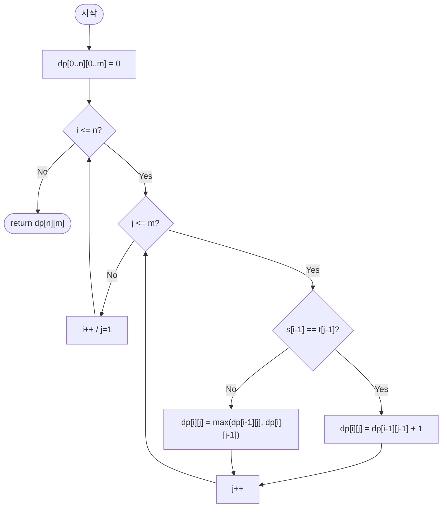

import { AlgorithmSimulation } from "#guide-sim";

# longestCommonSubsequence — 마지막 글자가 같으면 공짜로 얻고, 다르면 최선만 물려받는 이유

## 한눈에 보는 컨셉

두 문자열의 접두어 쌍 `(i, j)`마다 "지금까지의 최장 공통 부분 수열 길이"를 표로 채워 나가는 방법이에요 — 마지막 글자가 같으면 대각선 칸의 값에 1을 더해 공짜로 챙기고, 다르면 위 칸과 왼쪽 칸 중 더 큰 값을 그대로 물려받습니다. 상태를 접두어 쌍으로 한정하면 겹치는 부분 문제가 `(n+1)(m+1)`가지로 유한해져 `O(nm)` 시간에 끝나고, 점화식이 바로 이전 행만 참조한다는 사실을 알아채면 공간도 `O(min(n,m))`까지 줄일 수 있어요.

## 출발점: 가장 순진한 방법부터

문제를 먼저 정확히 잡을게요.

```ts
function longestCommonSubsequence(s: string, t: string): number
```

| 파라미터 | 의미 | 제약 |
|----------|------|------|
| `s` | 첫 번째 문자열 | $0 \leq |s| \leq 1{,}000$ |
| `t` | 두 번째 문자열 | $0 \leq |t| \leq 1{,}000$, ASCII |

**반환값**: `s`와 `t`에 공통으로 존재하는 부분 수열(순서는 유지하되 연속일 필요는 없음) 중 가장 긴 것의 **길이**입니다. 부분 수열 문자열 자체가 아니라 길이만 구하면 됩니다.

목표를 먼저 명확히 해 둘게요. $n \cdot m \leq 10^6$이니 `O(nm)` 시간이면 1초 제한 안에 충분히 통과합니다. 공간은 일단 `O(nm)`으로 시작하지만, 뒤에서 점화식의 의존 구조를 뜯어보면 `O(min(n,m))`까지 줄일 실마리가 보일 거예요.

두 문자열의 공통 부분 수열 길이를 구하는 문제라면, 가장 정직한 접근은 "공통 부분 수열이 될 수 있는 후보를 직접 만들어 보고 그중 가장 긴 것을 고르자"는 생각이에요. 이걸 재귀로 옮기면, $f(i, j)$를 "$s$의 앞 $i$글자와 $t$의 앞 $j$글자의 LCS 길이"라 할 때 이렇게 됩니다.

```text
f(i, j):
    i == 0 또는 j == 0 이면 0
    s[i-1] == t[j-1] 이면 f(i-1, j-1) + 1
    아니면 max(f(i-1, j), f(i, j-1))
```

코드로 그대로 옮기면 이렇습니다.

```ts
function longestCommonSubsequenceNaive(s: string, t: string): number {
  function f(i: number, j: number): number {
    if (i === 0 || j === 0) return 0;
    if (s[i - 1] === t[j - 1]) return f(i - 1, j - 1) + 1;
    return Math.max(f(i - 1, j), f(i, j - 1));
  }
  return f(s.length, t.length);
}
```

이 재귀에 메모이제이션이 없으면 같은 `(i, j)`가 몇 번이나 다시 계산될까요? 서로 공통 문자가 전혀 없는 두 문자열(`s`와 `t`의 모든 글자가 다름)로 직접 호출 횟수를 세어 보면 이렇습니다.

```text
길이(n=m)   호출 횟수
   2           11
   3           39
   4          139
   5          503
   6        1,847      ← 길이가 하나 늘 때마다 3배 넘게 폭증
```

매 호출마다 최대 두 갈래로 갈라지고 트리 깊이가 $n+m$이니, 최악은 $O(2^{n+m})$입니다. `n = m = 1{,}000`이면 상상도 할 수 없는 크기죠. 그런데 표를 보면 낌새가 하나 보여요 — 같은 `(i, j)` 인자로 재귀가 몇 번이고 다시 불립니다. **이 중복 호출을 한 번만 계산하고 재사용할 수 있다면?** 이것이 이번 문제의 돌파구입니다.

### 같은 목표를 노리는 설계가 둘 더 있다 — 하나는 부풀리고 하나는 깎는다

지수 폭발을 피하려고 곧장 표를 그리기 전에, **훨씬 싸 보이는 설계 둘**을 먼저 세워 봅시다. 둘 다 `O(n+m)`이라 표 DP보다 압도적으로 빠른데, 둘 다 틀립니다 — 그리고 **틀리는 방향이 서로 반대**예요.

```text
문자 빈도 교집합   두 문자열의 글자 개수를 세어 겹치는 만큼 더한다. 순서는 안 본다
                  "공통 부분 수열이라면 결국 양쪽에 다 있는 글자들 아닌가?"

탐욕 좌측 매칭     s 를 왼쪽부터 훑으며 t 의 아직 안 쓴 가장 왼쪽 같은 글자에 붙인다.
                  못 붙이면 그 글자만 버리고 t 포인터는 그대로 둔다
                  "왼쪽부터 붙일 수 있는 대로 붙이면 되지 않나?"
```

각각을 무너뜨리는 **가장 짧은 반례**를 알파벳 `{a,b,c}` 위에서 전수 탐색으로 찾았습니다.

| `s` | `t` | 문자 빈도 교집합 | 탐욕 좌측 매칭 | 정답(DP) |
| --- | --- | --- | --- | --- |
| `"ab"` | `"ba"` | **2** | 1 | 1 |
| `"aba"` | `"ba"` | 2 | **1** | 2 |
| `"cab"` | `"abc"` | **3** | **1** | 2 |
| `"abcde"` | `"ace"` | 3 | 3 | 3 |

**빈도 교집합은 순서를 버려서 부풀립니다.** `s="ab"`, `t="ba"`에서 `a`도 `b`도 양쪽에 있으니 2를 내지만, 부분 수열은 순서를 지켜야 하므로 둘 중 하나밖에 못 씁니다.

```text
s = a b        t = b a
    ↓ ↓            ↓ ↓
    a 는 s 에서 먼저, t 에서 나중   →  "ab" 도 "ba" 도 양쪽 순서를 동시에 만족 못 한다
    빈도만 세면 2, 실제로 고를 수 있는 것은 1
```

**탐욕 좌측 매칭은 되돌아가지 않아서 깎습니다.** `s="cab"`, `t="abc"`에서 첫 글자 `c`를 `t`의 맨 끝에 붙여 버리는 순간, 그 뒤에 있던 `a`·`b`가 통째로 잠겨요.

```text
s = c a b        t = a b c
    ↑                    ↑ 여기에 붙인다 (t 포인터가 끝으로 간다)
    첫 글자를 붙이는 데 성공했다  →  남은 a·b 는 붙일 자리가 없다      결과 1

c 를 포기하면:  a → t[0],  b → t[1]                                 정답 2
                ↑ 한 글자를 버려야 두 글자를 얻는다. 탐욕은 이 버리기를 못 한다
```

**두 설계가 무서운 것은 대부분의 입력에서 맞기 때문입니다.** 무작위 문자열 10만 쌍에 셋을 다 돌려 표 DP와 대조했어요.

```text
설계                 틀린 횟수          틀리는 방향
점화식 DP            0건 (0.0%)         —
문자 빈도 교집합      27,657건 (27.7%)   27,657건 전부 답을 부풀린다
탐욕 좌측 매칭        16,747건 (16.7%)   16,747건 전부 답을 깎는다
```

**방향이 한쪽으로만 몰린다는 것이 이 표의 핵심입니다.** 빈도 교집합은 실제 답보다 작아지는 일이 단 한 번도 없고, 탐욕은 커지는 일이 단 한 번도 없어요 — 각각 상한과 하한을 주는 셈이라 **둘 다 정답의 근사값으로는 쓸 수 있지만 정답은 아닙니다.** 그리고 여덟 쌍 중 여섯 쌍은 둘 다 맞으니, 예제를 몇 개 돌려 보고 채택하면 안 걸러져요.

## 아이디어 자세히 들여다보기

### 접두어 쌍을 상태로 삼기 — 수식과 그림

중복되는 부분 문제를 없애려면, "무엇이 중복되는가"부터 정확히 정의해야 해요. 상태를 이렇게 잡습니다.

$$dp[i][j] = s[0..i-1] \text{와 } t[0..j-1] \text{의 최장 공통 부분 수열 길이}$$

즉 $dp[i][j]$는 "s의 앞 i글자, t의 앞 j글자"라는 접두어 쌍 하나에 대응하는 답입니다. 작은 예로 직접 채워 볼게요. `s = "ab"`, `t = "ba"`라 하면:

```text
        ∅   b   a     ← t의 접두어
    ∅ [ 0,  0,  0 ]
    a [ 0,  0,  1 ]    dp[1][2]: a와 t[1]='a' 일치 → dp[0][1]+1 = 1
    b [ 0,  1,  1 ]    dp[2][1]: b와 t[0]='b' 일치 → dp[1][0]+1 = 1
      ↑ s의 접두어
```

`dp[2][2] = 1`이 나옵니다 — `s="ab"`와 `t="ba"`의 공통 부분 수열은 `"a"` 또는 `"b"` 하나뿐(둘 다 취할 순 없어요, 순서가 반대니까요)이니 맞는 답이에요.

잠깐, 확인 하나만 해 볼까요? 위 표에서 `dp[1][1]`은 왜 `0`일까요? `s`의 앞 1글자는 `"a"`, `t`의 앞 1글자는 `"b"`인데 서로 다른 글자라 공통 부분 수열이 없고, 그래서 `0`입니다.

**왜 하필 "접두어 쌍"으로 상태를 잡을까요?** 만약 "임의의 부분 문자열 쌍"(시작·끝 인덱스가 자유로운)으로 상태를 확장하면 상태 수가 $O(n^2 m^2)$으로 폭발합니다. 반면 접두어 쌍은 시작이 항상 인덱스 `0`으로 고정돼 있어서 상태를 `(i, j)` 두 숫자만으로 표현할 수 있고, 그 수는 정확히 $(n+1)(m+1)$개입니다. 게다가 접두어 쌍은 "한 글자씩 늘려가는" 자연스러운 순서가 있어서, $dp[i][j]$가 항상 더 작은 접두어 쌍의 값에서만 유도됩니다.

### 단서를 설명해 주는 이론 — 최적 부분 구조와 중복 부분 문제

앞서 본 "같은 `(i, j)`가 반복 호출된다"는 관찰은 이미 이론화되어 있는 현상이에요. 동적계획법이 성립하려면 두 조건이 필요합니다.

**최적 부분 구조(optimal substructure)**: 문제의 최적해가 더 작은 부분 문제들의 최적해를 조합해서 만들어지는 성질입니다. LCS에서는 $dp[i][j]$의 최적해가 $dp[i-1][j-1]$, $dp[i-1][j]$, $dp[i][j-1]$이라는 더 작은 부분 문제의 최적해로부터 정확히 결정됩니다(다음 절에서 이걸 증명할 거예요).

**중복 부분 문제(overlapping subproblems)**: 재귀 트리를 그렸을 때 같은 부분 문제가 여러 경로에서 반복 등장하는 성질입니다. 위 naive 재귀의 호출 횟수 표가 바로 이 중복을 숫자로 보여준 거예요 — 서로 다른 두 경로가 같은 `(i, j)`에 도달하니까요.

`f(3, 2)` 호출 하나만 재귀 트리로 펼쳐 봐도 바로 보입니다.

```text
                    f(3,2)
                   /      \
              f(2,2)        f(3,1)
             /      \       /     \
        f(1,2)   f(2,1)  f(2,1)  f(3,0)
                    ↑        ↑
              같은 f(2,1)이 서로 다른 두 경로에서 다시 호출됨
```

`f(2,1)`이 `f(2,2)`를 거치는 경로와 `f(3,1)`을 거치는 경로 양쪽에서 각각 처음부터 다시 계산됩니다 — 이게 바로 "중복"입니다.

이 두 조건이 성립하면, 각 부분 문제를 **딱 한 번만** 계산해서 표에 저장해 두고 재사용하면 됩니다.

```text
부분 문제 수      (n+1)(m+1) = O(nm)      ← 접두어 쌍 (i, j) 하나가 부분 문제 하나
칸 하나의 비용     O(1)                    ← 문자 비교 한 번 + 최댓값 한 번
전체              O(nm)

naive 는 O(2^(n+m)) 이었다 — 같은 칸을 몇 번 다시 계산하느냐가 지수와 다항식을 갈랐다
```

여기서 짚어 둘 점이 하나 있어요: $dp[i][j]$는 오직 $dp[i-1][j-1]$, $dp[i-1][j]$, $dp[i][j-1]$ — 즉 **바로 이전 행과 현재 행의 왼쪽 칸**에만 의존합니다. 이 의존 범위가 좁다는 사실을 뒤 최적화 절에서 다시 소환할 것이니 기억해 두세요.

### 왜 모순 없이 작동하는가

점화식을 정식으로 쓰면 이렇습니다. $1 \leq i \leq n$, $1 \leq j \leq m$에 대해:

$$dp[i][j] = \begin{cases} dp[i-1][j-1] + 1 & \text{if } s[i-1] = t[j-1] \\ \max\bigl(dp[i-1][j],\; dp[i][j-1]\bigr) & \text{otherwise} \end{cases}$$

기저 조건은 $dp[0][j] = dp[i][0] = 0$ — 빈 문자열과의 공통 부분 수열은 항상 빈 수열이니 길이 `0`이 정확합니다.

```text
      j=0  1   2   3
i=0  [ 0   0   0   0 ]   ← s 가 빈 문자열이면 무엇과 비교해도 0
i=1  [ 0   ·   ·   · ]
i=2  [ 0   ·   ·   · ]     ↑ t 가 빈 문자열이면 무엇과 비교해도 0
       └ 이 테두리는 계산으로 얻는 값이 아니라 정의에서 바로 나온 값이다
```

**귀납 가정**: $i' + j' < i + j$인 모든 $(i', j')$에 대해 $dp[i'][j']$가 정확하다고 가정합니다.

먼저 보조 관찰 하나를 세워 둘게요 — **단조성**: $dp[i][j] \leq dp[i-1][j] + 1$이고 $dp[i][j] \leq dp[i][j-1] + 1$입니다.

```text
접두어를 한 글자 늘렸을 때 LCS 길이가 얼마나 늘 수 있는가

  늘어난 글자를 최적해가 안 쓴다  →  길이 그대로     (+0)
  늘어난 글자를 최적해가 쓴다     →  딱 한 글자 추가  (+1)
  세 번째 경우는 없다 — 글자를 하나 더 줬는데 두 글자가 생길 수는 없다

따라서  dp[i][j] ≤ dp[i-1][j] + 1  이고  dp[i][j] ≤ dp[i][j-1] + 1
```

이제 두 경우로 나눕니다. 문자 비교는 "같다" 또는 "다르다" 둘 중 하나이므로 이 두 경우가 전부이고, 서로 겹치지 않습니다.

**경우 1 — $s[i-1] = t[j-1]$인 경우**: 이 글자를 LCS에 포함하는 것이 항상 최적입니다.
- (하한) $dp[i-1][j-1]$짜리 LCS 뒤에 공통 글자를 하나 더 붙이면 길이 $dp[i-1][j-1]+1$짜리 공통 부분 수열이 만들어지므로 $dp[i][j] \geq dp[i-1][j-1]+1$.
- (상한) 이 글자를 포함하지 않는 해는 "s의 마지막 글자를 안 쓰거나" "t의 마지막 글자를 안 쓴" 것과 같으므로 길이가 $dp[i-1][j]$ 또는 $dp[i][j-1]$을 넘지 못하고, 단조성에 의해 둘 다 $dp[i-1][j-1]+1$을 넘지 못합니다. 그러니 포함하지 않아서 더 길어질 수는 없어요.
- 두 방향을 합치면 $dp[i][j] = dp[i-1][j-1]+1$.

**경우 2 — $s[i-1] \neq t[j-1]$인 경우**: 이번엔 이 두 글자를 동시에 마지막 매칭으로 쓸 수 없습니다(서로 다른 글자니까요). 그래서 최적해는 반드시 "s의 마지막 글자를 안 쓰거나" "t의 마지막 글자를 안 쓴" 것 중 하나이고, 이는 각각 $dp[i-1][j]$, $dp[i][j-1]$로 귀결됩니다. 두 경우 다 실제로 달성 가능한 값이므로(더 작은 접두어 쌍의 정확한 해이자 그대로 더 큰 접두어 쌍의 공통 부분 수열이기도 하니까요) $dp[i][j] = \max(dp[i-1][j], dp[i][j-1])$.

| 마지막 두 글자 | 최적해가 그 글자를 | 값 | 왜 그 값이 상한이자 하한인가 |
| --- | --- | --- | --- |
| 같다 | 반드시 쓴다 | $dp[i-1][j-1]+1$ | 하한은 붙여서 달성, 상한은 단조성이 막는다 |
| 다르다 | 둘 중 하나는 못 쓴다 | $\max(dp[i-1][j],\, dp[i][j-1])$ | 두 후보가 경우의 전부이고 둘 다 달성 가능하다 |

여기서 **헷갈리기 쉬운 포인트**는 "불일치할 때도 그냥 대각선 값을 쓰면 되지 않을까?"라는 생각입니다. 실제로 짜 보면 이렇게 됩니다.

```text
s = "abcde", t = "ace"  (정답 dp[5][3] = 3)

올바른 점화식:                    불일치 시 대각선을 그대로 쓰는 오답:
dp[i][j] = dp[i-1][j-1] + 1       dp[i][j] = dp[i-1][j-1]   (불일치인데도!)
        or max(위, 왼쪽)

정답 dp 테이블 마지막 행: [0, 1, 2, 3]     오답 dp 테이블 마지막 행: [0, 0, 0, 1]
                        dp[5][3] = 3                        dp[5][3] = 1   ✗
```

`d`처럼 어느 쪽에도 매칭이 안 되는 글자를 만나면, 대각선 값은 "그 글자를 아예 무시한 결과"가 아니라 "양쪽 다 한 글자씩 줄인 결과"라서 이미 확보한 매칭 정보까지 같이 잃어버립니다. `max(위, 왼쪽)`이어야 "지금까지 확보한 것 중 더 나은 쪽을 그대로 이어받는" 동작이 됩니다.

엣지 케이스도 이 점화식 위에서 정상 작동하는지 확인해 둘게요.

```text
s="", t="abc"      → dp[0][*] = 0 이므로 즉시 0
s="abc", t="xyz"   → 모든 칸이 불일치, max 체인이 전부 0 → 0
s="abc", t="abc"   → 대각선이 계속 이어져 dp[3][3] = 3
s="a", t="a"       → dp[1][1] = dp[0][0]+1 = 1
```

## 아이디어를 코드로 옮기기

점화식을 그대로 2차원 테이블에 옮기면 됩니다.

```ts
function longestCommonSubsequenceBasic(s: string, t: string): number {
  const n = s.length;
  const m = t.length;
  const dp: number[][] = Array.from({ length: n + 1 }, () =>
    new Array(m + 1).fill(0),
  );

  for (let i = 1; i <= n; i++) {          // ① 아직 볼 s 글자가 남았는가
    for (let j = 1; j <= m; j++) {        // ② 아직 볼 t 글자가 남았는가
      if (s[i - 1] === t[j - 1]) {        // ③ 마지막 글자가 같다 — 대각선 + 1
        dp[i][j] = dp[i - 1][j - 1] + 1;
      } else {                            // ④ 다르다 — 위·왼쪽 중 큰 쪽
        dp[i][j] = Math.max(dp[i - 1][j], dp[i][j - 1]);
      }
    }
  }

  return dp[n][m];
}
```

**가장 실수가 잦은 줄은 ④ 분기입니다.** 앞 절에서 확인했듯, 불일치일 때 `dp[i-1][j-1]`을 쓰면(대각선 재사용) 조용히 틀린 값을 냅니다 — `s="abcde"`, `t="ace"`에서 정답 `3` 대신 `1`이 나오는 걸 이미 봤어요.

이 절은 코드를 **정적으로** 읽습니다. 실제로 표가 어떻게 채워지는지는 다음 절이 끝까지 보여 줄게요.

```text
s[i-1] · t[j-1]   dp 인덱스는 1-based, 문자열 인덱스는 0-based다.
                  s[i] 로 쓰면 마지막 글자를 비교하지 못한 채 범위를 벗어난다

i·j 가 1부터       dp[0][*] · dp[*][0] 을 건드리지 않는다.
                  fill(0) 로 깔아 둔 경계값이 그대로 기저 조건이 된다

③ 과 ④ 는 배타적   문자 비교는 같다/다르다 둘뿐이라 두 분기가 경우의 전부다
```

## 코드를 한 번 끝까지 굴려 보기

고정 입력 `s = "abcde"`, `t = "ace"`에 위 기본 구현을 넣고 표를 끝까지 채워 봅니다. 아래 `실행 시각화` 절의 시뮬레이션과 **같은 입력**이에요.

```text
        ∅   a   c   e     ← t 의 접두어 (j = 0, 1, 2, 3)
    ∅ [ 0   0   0   0 ]   ← i = 0, 기저
    a [ 0   ?   ?   ? ]
    b [ 0   ?   ?   ? ]
    c [ 0   ?   ?   ? ]
    d [ 0   ?   ?   ? ]
    e [ 0   ?   ?   ? ]
      ↑ s 의 접두어
```

**T1 — 경계 초기화.** 아직 ①에 들어가기 전이고, `fill(0)`이 기저 조건을 이미 만족시켜 둡니다.

```text
T1   dp[0][*] = 0,  dp[*][0] = 0     빈 문자열과의 LCS 는 항상 0
```

**T2 — `i = 1`, `s[0] = 'a'`.** ①이 참이라 진입하고, ②가 세 번 돌며 ③과 ④를 둘 다 밟습니다.

```text
T2   ① 1 <= 5 참 → 진입
     j=1  ③ 'a' = 'a' 참  →  대각 dp[0][0]=0 + 1 = 1
     j=2  ④ 'a' ≠ 'c'     →  max(위 dp[0][2]=0, 왼 dp[1][1]=1) = 1
     j=3  ④ 'a' ≠ 'e'     →  max(위 dp[0][3]=0, 왼 dp[1][2]=1) = 1
     ② 4 <= 3 거짓 → 안쪽 루프 탈출
     행 = [0, 1, 1, 1]
```

`a` 하나를 잡은 뒤 오른쪽 칸들이 그 값을 그대로 물려받았어요. ④가 하는 일이 "이미 확보한 것을 잃지 않기"라는 것이 여기서 보입니다.

**T3 — `i = 2`, `s[1] = 'b'`. ③이 한 번도 안 밟히는 행입니다.**

```text
T3   ① 2 <= 5 참
     j=1  ④ 'b' ≠ 'a'  →  max(위 1, 왼 0) = 1
     j=2  ④ 'b' ≠ 'c'  →  max(위 1, 왼 1) = 1
     j=3  ④ 'b' ≠ 'e'  →  max(위 1, 왼 1) = 1
     행 = [0, 1, 1, 1]     ← 앞 행과 글자 하나 다르지 않다
```

**T4 — `i = 3`, `s[2] = 'c'`. 대각선이 실제로 쓰이는 자리입니다.**

```text
T4   ① 3 <= 5 참
     j=1  ④ 'c' ≠ 'a'  →  max(위 1, 왼 0) = 1
     j=2  ③ 'c' = 'c' 참  →  대각 dp[2][1]=1 + 1 = 2
                              ↑ 위(1)도 왼쪽(1)도 아닌 "한 칸 위 왼쪽"을 읽는다
     j=3  ④ 'c' ≠ 'e'  →  max(위 1, 왼 2) = 2
     행 = [0, 1, 2, 2]
```

**T5 — `i = 4`, `s[3] = 'd'`. `t` 어디에도 없는 글자입니다.**

```text
T5   ① 4 <= 5 참
     j=1  ④ 'd' ≠ 'a'  →  max(위 1, 왼 0) = 1
     j=2  ④ 'd' ≠ 'c'  →  max(위 2, 왼 1) = 2
     j=3  ④ 'd' ≠ 'e'  →  max(위 2, 왼 2) = 2
     행 = [0, 1, 2, 2]     ← 앞 행 복사. 매칭 없는 글자는 표를 전진시키지 않는다
```

**T6 — `i = 5`, `s[4] = 'e'`. 마지막 매칭이 여기서 붙습니다.**

```text
T6   ① 5 <= 5 참
     j=1  ④ 'e' ≠ 'a'  →  max(위 1, 왼 0) = 1
     j=2  ④ 'e' ≠ 'c'  →  max(위 2, 왼 1) = 2
     j=3  ③ 'e' = 'e' 참  →  대각 dp[4][2]=2 + 1 = 3
     행 = [0, 1, 2, 3]
```

**T7 — ① 거짓, 반환.**

```text
T7   ① 6 <= 5 거짓 → 바깥 루프 탈출
     반환 dp[5][3] = 3

     검산  공통 부분 수열 "ace" — s 에서 인덱스 0·2·4, t 에서 0·1·2, 양쪽 다 오름차순  ✓
```

①②가 **처음부터** 거짓이 되는 경우는 빈 문자열이 들어올 때뿐이라 짧은 입력으로 따로 봅니다.

```text
T8   s = "", t = "ace"   →  n = 0 이라 ① 이 첫 판정에서 거짓. 표는 기저 행 하나뿐. 반환 0
T9   s = "abcde", t = ""  →  m = 0 이라 ② 가 첫 판정에서 거짓. 매 행이 즉시 끝난다. 반환 0
```

네 자리 ①②③④를 참·거짓 양쪽으로 모두 밟았습니다 — ①은 T2~T6에서 참이고 T7·T8에서 거짓, ②는 T2~T6 안에서 세 번씩 참이고 매 행 끝과 T9에서 거짓, ③은 T2·T4·T6에서 참, ④는 ③이 거짓인 자리마다 실행됐어요. 반환값 `3`은 아래 시뮬레이션 마지막 프레임의 우하단 셀과 같습니다.

## 더 빠르게 만들 단서 찾기

트레이스의 다섯 행(**T2~T6**)에서 각 행이 **어느 행을 읽었는지**만 뽑아 봅시다.

```text
       읽은 것                                    이 시점에 죽은 행
T2     기저 행(i=0)                               —
T3     T2 의 행                                   기저 행
T4     T3 의 행                                   T2 의 행
T5     T4 의 행                                   T2 · T3 의 행
T6     T5 의 행                                   T2 · T3 · T4 의 행
       ↑ 어느 단계도 "바로 앞 행" 말고는 안 읽는다
```

**T6이 `dp[4][2]`를 대각선으로 읽을 때, T2와 T3의 행은 이미 두 단계 전에 죽었습니다.** 그런데 `n = m = 1{,}000`이면 `dp` 배열은 `1,002,001`개의 칸을 통째로 들고 있어요.

```text
행 i를 채우는 중:

  행 i-2  [ 다시 안 쓰임 ]
  행 i-1  [■■■■■■■■]  ← 이 행만 참조
  행 i    [■■□□□□□□]  ← 지금 채우는 중 (왼쪽 칸도 같은 행에서 참조)
             ↑ 현재 위치

1,002,001칸을 통째로 들고 있지만, 실제로 "살아 있는" 정보는 두 행(2,002칸) 뿐
```

이건 3.2절에서 예고했던 그 관찰이에요 — $dp[i][j]$가 바로 이전 행과 현재 행의 왼쪽 칸에만 의존한다는 좁은 의존 범위가, 지금 이 낭비를 없앨 실마리입니다.

## 단서를 최적화로 연결하기

이전 행 전체를 따로 들고 있을 필요 없이, **배열 하나를 계속 덮어쓰면서** 재사용하면 됩니다. `dp[j]`라는 1차원 배열이 있다고 할 때, 행 `i`를 처리하는 동안:

```text
행 갱신 전:  dp[j] 는 dp[i-1][j] (이전 행 값)
                  │
                  ▼  j를 왼쪽에서 오른쪽으로 진행하며 덮어쓰기
행 갱신 후:  dp[j] 는 dp[i][j]   (현재 행 값)
```

문제는 대각선입니다. $dp[i][j]$를 계산하려면 $dp[i-1][j-1]$이 필요한데, `dp[j-1]`은 이미 **이번 행 값(`dp[i][j-1]`)으로 덮어써진 뒤**입니다. 그래서 불변식을 하나 더 유지해야 해요.

> `prevDiag` 변수는 항상 "지금 막 덮어쓰려는 칸의 이전 행 값"을 들고 있다 — 덮어쓰기 **직전에** 저장해 둔다.

## 최적화 코드

바뀌는 부분은 2차원 배열이 1차원으로 줄고, `prevDiag`가 추가되는 것뿐입니다. 덧붙여 배열 크기를 항상 더 짧은 문자열에 맞추도록 필요하면 `s`, `t`를 교환해서 공간을 `O(min(n,m))`으로 확정합니다.

```ts
function longestCommonSubsequence(s: string, t: string): number {
  if (s.length < t.length) {
    [s, t] = [t, s]; // 배열 크기를 항상 더 짧은 문자열 길이에 맞춘다
  }
  const n = s.length;
  const m = t.length;
  const dp: number[] = new Array(m + 1).fill(0);

  for (let i = 1; i <= n; i++) {          // ① 아직 볼 s 글자가 남았는가
    let prevDiag = 0; // dp[i-1][0]
    for (let j = 1; j <= m; j++) {        // ② 아직 볼 t 글자가 남았는가
      const temp = dp[j]; // 덮어쓰기 전에 dp[i-1][j]를 보존 → 다음 열의 대각선이 됨
      if (s[i - 1] === t[j - 1]) {        // ③ 같다 — 보존해 둔 대각선 + 1
        dp[j] = prevDiag + 1;
      } else {                            // ④ 다르다 — 위(아직 안 덮은 dp[j])·왼쪽
        dp[j] = Math.max(dp[j], dp[j - 1]);
      }
      prevDiag = temp;
    }
  }

  return dp[m];
}
```

트레이스로 대조하면 **T2~T6의 판정이 글자 그대로 남고, 읽는 대상의 이름만 바뀝니다.**

| 트레이스 | 2차원 판이 읽은 것 | 1차원 판이 읽는 것 |
| --- | --- | --- |
| T4 `j=2`, ③ | `dp[2][1]` (대각선) | `prevDiag` — T3 행의 `j=1` 값을 `temp`로 챙겨 둔 것 |
| T4 `j=3`, ④ | `dp[2][3]` (위) | `dp[3]` — 아직 이번 행으로 안 덮인 값 |
| T4 `j=3`, ④ | `dp[3][2]` (왼쪽) | `dp[2]` — 방금 이번 행으로 덮은 값 |
| T6 `j=3`, ③ | `dp[4][2]` (대각선) | `prevDiag` — T5 행의 `j=2` 값 |

**"위"와 "왼쪽"이 같은 배열의 같은 칸을 시점만 달리해 가리킨다는 것이 이 최적화의 전부예요.** 덮기 전이면 위, 덮은 뒤면 왼쪽입니다. 대각선만 그 규칙으로 안 잡혀서 `temp`가 필요해요.

**가장 중요한 줄은 `const temp = dp[j];` 와 그다음 줄 끝의 `prevDiag = temp;` 두 줄입니다.** 이 순서를 지키지 않고 대각선을 따로 저장하지 않은 채 "그냥 옆 칸(`dp[j-1]`)을 대각선처럼 쓰면 되겠지"라고 생각하면 어떻게 될까요? 직접 손으로 따라가 보죠. `s = "bab"`, `t = "aaaa"`(정답은 `1` — 공통 글자는 `s`에 하나뿐인 `"a"`)에 이 버그 있는 버전을 돌리면:

```text
버그: dp[j] = dp[j-1] + 1  (매칭 시, 대각선 대신 "이미 갱신된 왼쪽 칸"을 사용)

i=1 (s[0]='b', 전부 불일치)  → dp = [0, 0, 0, 0, 0]
i=2 (s[1]='a', t 전체와 매칭) → dp = [0, 1, 2, 3, 4]
                                        ↑  ↑  ↑  ↑
                              각 칸이 "바로 왼쪽의 이미 갱신된 값"에 1을 더하며 사슬처럼 이어짐
i=3 (s[2]='b', 전부 불일치)  → dp = [0, 1, 2, 3, 4]   (그대로 유지)

버그 결과 dp[4] = 4   /   정답은 1
```

`i=2` 행에서 `t`의 네 `'a'`가 전부 매칭되긴 하지만, `s`에는 `'a'`가 딱 한 글자뿐이라 실제로는 하나만 골라야 해요. 그런데 `dp[j-1]`을 대각선 대용으로 쓰면 "방금 이 행에서 갱신한 값"에 계속 `+1`을 얹는 사슬이 만들어져서, 마치 같은 글자를 네 번 재사용한 것처럼 셉니다. 심지어 `dp[4]=4`는 `s`의 길이(`3`)보다도 큰 값이라 — LCS 길이가 원본 문자열보다 길 수 없다는 최소한의 상식과도 어긋납니다. `temp`에 미리 담아 둔 **이전 행의 값**을 쓰는 것과, 방금 **같은 행에서 덮어쓴 값**을 쓰는 것은 전혀 다른 데이터라는 점, 여기서 꼭 짚고 넘어갈게요.

> 기억법: "옆을 보기 전에, 위를 먼저 챙겨 둔다." (`temp`로 위 값을 챙긴 뒤에야 옆 갱신이 안전합니다.)

이 최적화로 공간이 $O(nm)$에서 $O(\min(n,m))$으로 줄었지만, 시간 복잡도는 여전히 각 칸을 한 번씩 채우는 $O(nm)$ 그대로입니다.

```text
n = m = 1,000 기준

배열 칸 수   1,002,001칸  →  1,001칸        약 1,000분의 1
채운 칸 수   1,000,000칸  →  1,000,000칸    그대로 (시간은 안 줄었다)
복잡도       O(nm) 시간 · O(nm) 공간  →  O(nm) 시간 · O(min(n,m)) 공간
보장 종류    전부 최악 — 입력 내용과 무관하게 모든 칸을 정확히 한 번씩 채운다
```

더 최적화할 여지가 있을까요? 일반적인 두 문자열에 대한 LCS 길이 계산은, 강한 지수 시간 가설(SETH)이 참이라면 $O(nm)$보다 유의미하게 빠른(진다항 개선) 알고리즘이 존재하지 않는다는 조건부 하한 결과가 알려져 있습니다(Abboud–Backurs–Vassilevska Williams, 2015). 그러니 이 알고리즘 틀 안에서 더 짜낼 여지는 사실상 없다고 봐야 해요. 다만 입력 특성에 따라 유리한 특화 해법은 있습니다 — 두 문자열 사이의 일치하는 문자 쌍 개수 $r$이 적을 때는 Hunt–Szymanski 알고리즘이 $O((r+n)\log n)$까지 내려갑니다. 그럼에도 지금 배운 $O(nm)$ DP를 익혀 둘 가치는 분명합니다. 일치하는 쌍이 많을 때(예: 알파벳이 작거나 반복이 많은 문자열)는 $r$ 자체가 $nm$에 가까워져 특화 해법의 이점이 사라지고, 이 알고리즘은 그런 가정 없이 항상 안정적으로 동작하니까요.

## 실행 시각화

입력 `s = "abcde"`, `t = "ace"`에 대해 `(n+1)×(m+1)` LCS DP 테이블을 채우는 과정입니다. 행 라벨은 `s`의 접두어, 열 라벨은 `t`의 접두어이며, 0번 행/열(`∅`)은 빈 문자열로 모두 0입니다. `cells`(강조)는 방금 채운 셀, `matrix`의 `null`은 아직 채우지 않은 칸입니다. 문자가 같으면 대각선+1, 다르면 위/왼쪽의 최댓값을 취합니다.

실제 반환값은 `3`이며(`dp[5][3]`, 공통 부분 수열 `"ace"`), 시뮬레이션 마지막 프레임의 우하단 셀과 일치합니다. 이 값은 위 "아이디어를 코드로 옮기기"의 기본 구현과 "최적화 코드"의 롤링 구현 양쪽으로 실행해 동일하게 확인했습니다.

> 대화형 시뮬레이션은 MDX 런타임에서 표시됩니다.

export const rowLabels = ["∅", "a", "ab", "abc", "abcd", "abcde"];

export const colLabels = ["∅", "a", "ac", "ace"];

export const steps = [
  {
    title: "경계 초기화",
    detail: "dp[0][j]=0, dp[i][0]=0 (빈 문자열과의 LCS는 0).",
    matrix: [
      [0, 0, 0, 0],
      [0, null, null, null],
      [0, null, null, null],
      [0, null, null, null],
      [0, null, null, null],
      [0, null, null, null],
    ],
    rowLabels, colLabels,
    cells: [[0, 0], [0, 1], [0, 2], [0, 3], [1, 0], [2, 0], [3, 0], [4, 0], [5, 0]],
  },
  {
    title: "i=1 (s='a') 행",
    detail: "j=1: a==a → 대각선+1=1. j=2,3: 불일치 → max(위,왼쪽)=1. dp[1]=[0,1,1,1].",
    matrix: [
      [0, 0, 0, 0],
      [0, 1, 1, 1],
      [0, null, null, null],
      [0, null, null, null],
      [0, null, null, null],
      [0, null, null, null],
    ],
    rowLabels, colLabels,
    cells: [[1, 1], [1, 2], [1, 3]],
  },
  {
    title: "i=2 (s='b') 행",
    detail: "b는 a,c,e와 모두 불일치 → max(위,왼쪽). dp[2]=[0,1,1,1].",
    matrix: [
      [0, 0, 0, 0],
      [0, 1, 1, 1],
      [0, 1, 1, 1],
      [0, null, null, null],
      [0, null, null, null],
      [0, null, null, null],
    ],
    rowLabels, colLabels,
    cells: [[2, 1], [2, 2], [2, 3]],
  },
  {
    title: "i=3 (s='c') 행",
    detail: "j=2: c==c → dp[2][1]+1=2. dp[3]=[0,1,2,2].",
    matrix: [
      [0, 0, 0, 0],
      [0, 1, 1, 1],
      [0, 1, 1, 1],
      [0, 1, 2, 2],
      [0, null, null, null],
      [0, null, null, null],
    ],
    rowLabels, colLabels,
    cells: [[3, 1], [3, 2], [3, 3]],
  },
  {
    title: "i=4 (s='d') 행",
    detail: "d는 모두 불일치 → max(위,왼쪽). dp[4]=[0,1,2,2].",
    matrix: [
      [0, 0, 0, 0],
      [0, 1, 1, 1],
      [0, 1, 1, 1],
      [0, 1, 2, 2],
      [0, 1, 2, 2],
      [0, null, null, null],
    ],
    rowLabels, colLabels,
    cells: [[4, 1], [4, 2], [4, 3]],
  },
  {
    title: "i=5 (s='e') 행",
    detail: "j=3: e==e → dp[4][2]+1=3. dp[5]=[0,1,2,3].",
    matrix: [
      [0, 0, 0, 0],
      [0, 1, 1, 1],
      [0, 1, 1, 1],
      [0, 1, 2, 2],
      [0, 1, 2, 2],
      [0, 1, 2, 3],
    ],
    rowLabels, colLabels,
    cells: [[5, 1], [5, 2], [5, 3]],
  },
  {
    title: "완료: dp[5][3] = 3",
    detail: "우하단 셀이 답. 최장 공통 부분 수열은 'ace' (길이 3).",
    matrix: [
      [0, 0, 0, 0],
      [0, 1, 1, 1],
      [0, 1, 1, 1],
      [0, 1, 2, 2],
      [0, 1, 2, 2],
      [0, 1, 2, 3],
    ],
    rowLabels, colLabels,
    cells: [[5, 3]],
  },
];

<AlgorithmSimulation view="matrix" steps={steps} title='LCS: s="abcde", t="ace"' />

## 흐름 한눈에 보기



## 스스로 점검하기

1. `s = "abc"`, `t = "bca"`에 대해 `dp` 테이블을 손으로 채워 보고 `dp[3][3]`을 구해 보세요. (힌트: `b`, `c`가 각각 `s`와 `t`에서 순서를 지키며 등장하는 공통 부분 수열이 하나 있습니다. 답: `2`.)
2. "최적화 코드" 절의 버그 버전(대각선을 `temp`에 저장하지 않고 `dp[j-1]`을 그대로 쓰는 버전)을 `s = "babb"`, `t = "bbab"`에 돌리면 몇이 나올지, 그리고 정답과 왜 다른지 손으로 짚어 보세요.
3. 만약 "부분 수열"이 아니라 **연속된** 부분 문자열(substring)의 최장 공통 길이를 구해야 한다면, 점화식이 어떻게 바뀌어야 할까요? (힌트: 불일치할 때 `max(위, 왼쪽)`을 그대로 이어받을 수 있을지 생각해 보세요 — 연속이어야 한다는 조건이 "이어받기"를 허용하지 않는다면, 불일치 시 값은 무엇이어야 하고, 최종 답은 `dp[n][m]`이 아니라 어디서 찾아야 할까요?)
