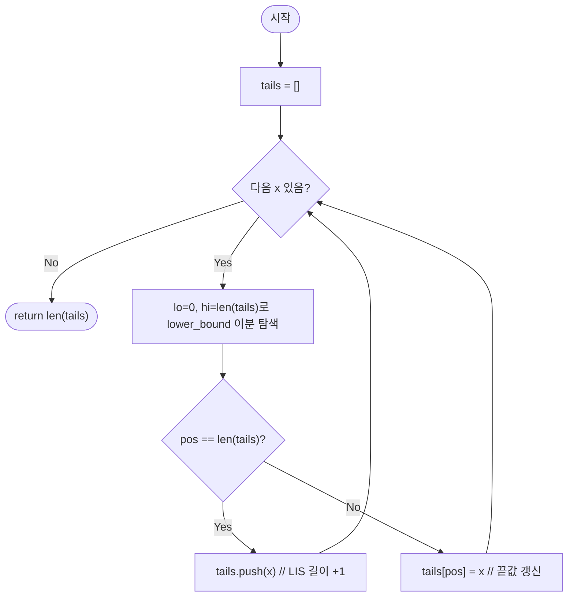

import { AlgorithmSimulation } from "#guide-sim";

# longestIncreasingSubsequence — 각 길이의 최소 끝값만 기억하면 이분 탐색이 열리는 이유

## 한눈에 보는 컨셉

배열을 한 번 훑으면서, "지금까지 만든 각 길이의 증가 부분수열 중 가장 작은 끝값"만 `tails`라는 보조 배열에 저장해 둡니다. 이 끝값들이 항상 정렬 상태를 유지한다는 사실을 알면, 새 원소가 `tails`의 어느 위치에 들어갈지를 `O(log N)`에 찾을 수 있어요. 원소 `N`개를 이렇게 처리하면 `O(N log N)`에 최장 증가 부분 수열의 길이를 구할 수 있습니다.

## 출발점: 가장 순진한 방법부터

문제를 먼저 정확히 잡을게요.

```ts
function longestIncreasingSubsequence(A: number[]): number
```

| 파라미터 | 의미 | 제약 |
|----------|------|------|
| `A` | 정수 배열 | $1 \leq N \leq 100{,}000$, $-10^9 \leq A[i] \leq 10^9$ |

**반환값**: 인덱스 $i_0 < i_1 < \cdots < i_{L-1}$이면서 $A[i_0] < A[i_1] < \cdots < A[i_{L-1}]$을 만족하는 최대 $L$ (엄격하게 증가하는 부분 수열의 최대 길이, 항상 $\geq 1$).

**엣지케이스**:

| 입력 | 기대 출력 | 이유 |
|------|-----------|------|
| `[5]` | `1` | 단일 원소 |
| `[3, 3, 3]` | `1` | 엄격 증가 아님 — 같은 값 연속은 이어붙일 수 없음 |
| `[1, 2, 3, 4, 5]` | `5` | 단조 증가 전체가 LIS |
| `[5, 4, 3, 2, 1]` | `1` | 단조 감소 — 하나씩만 선택 가능 |

"부분 수열 중 가장 긴 것의 길이"를 구하는 문제는, 각 위치에서 끝나는 부분 수열의 최적값을 먼저 안다면 전체 답은 그 값들의 최댓값이라는 방식으로 자연스럽게 풀립니다. 그래서 가장 정직한 접근은 $dp[i]$ = "인덱스 $i$에서 끝나는 증가 부분 수열의 최대 길이"로 정의하고, $i$ 앞의 모든 $j$를 훑어 이어붙일 수 있는지 확인하는 것입니다.

```text
for i from 0 to N-1:
    dp[i] = 1
    for j from 0 to i-1:
        if A[j] < A[i]:
            dp[i] = max(dp[i], dp[j] + 1)
answer = max(dp)
```

코드로 그대로 옮기면 이렇습니다.

```ts
function longestIncreasingSubsequenceNaive(A: number[]): number {
  const n = A.length;
  const dp = new Array<number>(n).fill(1);
  let best = 1;
  for (let i = 0; i < n; i++) {
    for (let j = 0; j < i; j++) {
      if (A[j] < A[i]) dp[i] = Math.max(dp[i], dp[j] + 1);
    }
    best = Math.max(best, dp[i]);
  }
  return best;
}
```

왜 이게 느린가: $dp[i]$를 구할 때마다 앞의 모든 $j < i$를 다시 확인하므로, 원소당 $O(i)$가 $N$번 반복되어 총 $O(N^2)$입니다.

```text
naive DP:  각 i마다 j = 0..i-1 전부 확인
비용:      원소당 O(i) × N개 ≈ O(N^2)

N = 100,000 이면  N^2 = 10,000,000,000 ≈ 10^10 연산
1초 제한 안에서 처리하기엔 너무 큰 규모 → 시간 초과
```

**목표 복잡도**: 시간 $O(N \log N)$, 공간 $O(N)$. $N = 100{,}000$이면 $N \log_2 N \approx 1{,}660{,}964$ 연산 — $10^{10}$ 대비 4자리 가까이 줄어듭니다.

그런데 $dp[i]$를 구할 때, 정말 앞의 $j$를 전부 하나하나 다시 봐야 할까요? $dp[j]$ 값이 같은 $j$들끼리는 그중 $A[j]$가 가장 작은 것 하나만 알면 충분해 보입니다. 이 낌새를 따라가 봅시다.

## 아이디어 자세히 들여다보기

### 각 길이의 최소 끝값만 남기기 — 수식과 그림

핵심 관찰은 이렇습니다. 길이 $k$인 증가 부분 수열이 여러 개 있을 수 있는데, **그중 끝값이 가장 작은 것**만 남겨 둬도 손해가 없습니다. 끝값이 작을수록 이후에 더 많은 원소를 이어붙일 수 있기 때문이에요. 그래서 보조 배열 `tails`를 다음과 같이 정의합니다.

$$tails[k] = \text{지금까지 처리한 원소들로 만들 수 있는 길이 } k+1 \text{인 증가 부분 수열의 끝값 최솟값}$$

왜 하필 "최솟값"이어야 할까요? 만약 길이 $k$짜리 후보를 전부 저장해 둔다면 공간과 비교 대상이 $O(N)$개로 늘어나 원래의 $O(N^2)$ 문제로 되돌아갑니다. 반면 각 길이마다 "가장 유리한 끝값 하나"만 남기면, 새 원소 $x$가 어떤 길이를 연장할 수 있는지 판단할 정보가 딱 필요한 만큼만 남습니다.

작은 예로 직접 채워 봅시다. `A = [10, 9, 2, 5]`를 앞에서부터 처리하면:

```text
x=10 →  tails = [10]              (길이 1의 끝값 10)
x=9  →  tails = [9]               (9 < 10 이므로 더 유리한 끝값으로 교체)
x=2  →  tails = [2]               (2 < 9 이므로 다시 교체)
x=5  →  tails = [2, 5]            (2 < 5 이므로 길이 2로 확장)
```

`tails`가 처리 도중 계속 **엄격 증가 순서**를 유지한다는 점에 주목하세요.

$$tails[0] < tails[1] < \ldots < tails[|tails|-1]$$

이 성질이 왜 성립하는지는 바로 다음 절(왜 모순 없이 작동하는가)에서 증명합니다. 여기서는 일단 "유지된다"는 사실을 받아들이고, 이 성질을 어떻게 쓸지 봅시다. 새 원소 $x$가 오면, `tails`에서 $x$ **이상**인 첫 위치 $pos$를 찾아야 합니다.

$$pos = \min\{k \mid tails[k] \geq x\}$$

두 경우로 나뉩니다.

1. $pos = |tails|$ (그런 위치가 없음): $x$가 `tails`의 모든 값보다 크므로, 가장 긴 증가 수열 뒤에 이어붙일 수 있습니다 → `tails.push(x)` (LIS 길이 $+1$).
2. $pos < |tails|$: 길이 $pos+1$짜리 수열의 끝값을 $x$로 교체하면 더 유리해집니다 → `tails[pos] = x`.

확인 질문 하나 풀어 볼까요? `tails = [2, 5]`인 상태에서 새 원소 `x = 3`이 들어오면 어떻게 바뀔까요? (힌트: `3`은 `5`보다 작으니, 길이 2 자리를 더 작은 끝값으로 바꿀 수 있는지 봅니다.)

`3 >= 2`이지만 `3 < 5`이므로 $pos = 1$입니다. `tails[1] = 3`으로 교체되어 `tails = [2, 3]`이 됩니다 — 길이는 여전히 2지만, 끝값이 더 작아져 이후 확장에 더 유리해졌습니다.

### 왜 모순 없이 작동하는가

`tails`가 정의대로 작동한다는 것을 귀납적으로 보입니다.

**기저**: 처리 전 `tails = []`입니다. 아무 원소도 없으므로 정의가 공허하게 성립합니다.

**귀납 단계**: `tails`가 지금까지 정의를 만족한다고 가정하고, 새 원소 $x$를 처리합니다. $pos = \min\{k \mid tails[k] \geq x\}$를 구했을 때 경우는 정확히 둘뿐입니다 ($pos = |tails|$이거나 $pos < |tails|$인 경우 — 이 둘이 전부이고 겹치지 않습니다).

- $pos = |tails|$ **인 경우**: `tails`의 모든 값이 $x$보다 작다는 뜻입니다. 그렇다면 `tails[|tails|-1]`로 끝나는 길이 $|tails|$짜리 수열 뒤에 $x$를 이어붙이면 길이 $|tails|+1$짜리 증가 수열이 만들어집니다. `tails.push(x)` 후 `tails[|tails|-1] = x`가 되므로, 이것이 길이 $|tails|$(갱신 후 기준)인 수열의 끝값 최솟값이라는 정의가 유지됩니다.
- $pos < |tails|$ **인 경우**: `tails[pos-1] < x \leq tails[pos]`입니다(존재한다면). 길이 $pos$인 수열(끝값 `tails[pos-1]`, 혹은 $pos=0$이면 빈 수열) 뒤에 $x$를 이어붙이면 길이 $pos+1$인 증가 수열이 만들어지고, 그 끝값 $x$는 기존 `tails[pos]`보다 작거나 같습니다. 따라서 `tails[pos] = x`로 교체하는 것이 더 유리한(혹은 동등한) 갱신이며, 정의가 유지됩니다.

두 경우 모두에서 갱신 후 `tails`가 여전히 엄격 증가 순서를 유지한다는 점도 함께 확인할 수 있습니다. $pos$가 "$x$ 이상인 첫 위치"라는 정의상 `tails[pos-1] < x`이고(존재한다면), `push`든 `교체`든 그 자리에 정확히 $x$가 들어가므로 좌우 이웃과의 순서가 깨지지 않습니다.

여기서 **헷갈리기 쉬운 포인트**는, `tails`의 실제 원소 나열이 유효한 증가 부분 수열이 아닐 수 있다는 점입니다. 위 예시 `tails = [2, 3]`을 보면 원본 배열에서 `2`(인덱스 2)와 `3`(인덱스 4)이 실제로 이 순서로 등장하니 우연히 유효하지만, 일반적으로는 서로 다른 시점에 교체된 값들이 섞여 인덱스 순서가 뒤엉킬 수 있습니다. **`tails`가 보장하는 것은 오직 "길이"뿐**입니다 — 실제 LIS 원소를 복원하려면 각 원소가 갱신될 때 "직전 원소가 무엇이었는지"를 가리키는 전임자 포인터를 별도 $O(N)$ 배열에 저장해야 합니다.

엣지 케이스도 점검해 둡니다.

```text
원소 1개 [5]         → tails=[5] 처리 후 길이 1. 올바름(정의상 최소 1).
전부 같은 값 [3,3,3] → 매번 pos=0(자기 자신 이상인 첫 위치) → 계속 교체.
                       tails=[3] 유지, 길이 1. 엄격 증가라 중복 불가가 정확히 반영됨.
완전 오름차순         → 매번 push. tails 길이가 N까지 그대로 자람.
완전 내림차순         → 매번 pos=0 교체. tails 길이 항상 1로 유지.
```

## 아이디어를 코드로 옮기기

앞 절의 정의를 가장 직관적인 방식 그대로 옮겨 봅니다. "`tails`에서 $x$ 이상인 첫 위치를 찾는다"를 코드로 옮기는 가장 단순한 방법은 앞에서부터 하나씩 훑는 **선형 탐색**입니다.

```ts
function longestIncreasingSubsequenceLinear(A: number[]): number {
  const tails: number[] = [];
  for (const x of A) {
    let pos = 0;
    while (pos < tails.length && tails[pos] < x) pos++;
    if (pos === tails.length) tails.push(x);
    else tails[pos] = x;
  }
  return tails.length;
}
```

**가장 실수가 잦은 줄은 `pos === tails.length` 판정입니다.** 이 판정이 push(길이 확장)와 교체(끝값 갱신)를 가르는 유일한 분기점이에요. `while` 루프의 조건 `tails[pos] < x`도 눈여겨보세요 — `<=`가 아니라 `<`를 써야, `tails[pos] >= x`인 첫 위치에서 정확히 멈춥니다(부등호를 바꾸면 뒤에서 다룰 함정과 같은 문제가 생깁니다).

이 코드는 앞 절의 정의를 그대로 반영하므로 정확합니다 — 대표 예시 `A = [10, 9, 2, 5, 3, 7, 101, 18]`에 대해 실행하면 `4`가 나오고, 이는 뒤에 나올 이분 탐색 버전과 정확히 같은 결과입니다. 다만 아직 속도 문제를 해결하지는 못했습니다. `while` 루프가 매번 `tails`를 처음부터 훑기 때문에, 최악의 경우 `tails` 길이만큼 비교가 필요합니다.

## 더 빠르게 만들 단서 찾기

방금 만든 코드를 관찰해 봅시다. `while` 루프는 `tails`를 앞에서부터 순서대로 훑습니다. 그런데 바로 앞 절에서 이미 증명했듯이, **`tails`는 언제나 엄격 증가 순서를 유지합니다.** 정렬된 배열을 선형으로 훑는 건, 이미 알고 있는 구조(정렬 상태)를 활용하지 않고 낭비하는 것과 같습니다.

숫자로 확인해 보면 낭비가 뚜렷합니다. 오름차순 배열 `A = [1, 2, ..., 16]`을 처리하면 매번 `tails`가 끝까지 자라는 최악의 패턴이 반복됩니다.

```text
A = [1, 2, ..., 16]  (N=16, tails가 매번 끝까지 자람)

선형 탐색 총 비교 횟수 = 120   (0 + 1 + 2 + ... + 15)
이분 탐색 총 비교 횟수 = 38

tails 길이가 15인 상태에서 새 최댓값 16이 들어오는 단 한 번의 삽입만 보면:
  선형 탐색: 15번 비교 (끝까지 훑어야 "더 큰 값 없음"을 확인)
  이분 탐색:  4번 비교 (log2(15) ≈ 3.9 → 4)
```

`tails`가 정렬돼 있다는 사실을 이미 증명해 뒀는데도, 그 사실을 탐색 방법에 반영하지 않은 게 이 낭비의 정체입니다. **정렬된 배열에서 원하는 위치를 찾을 때 쓰는 표준 도구가 이분 탐색(binary search)**입니다. 이 문제에서는 특히 "특정 값 이상인 첫 위치"를 찾는 변형인 lower bound가 정확히 필요한 연산입니다.

## 단서를 최적화로 연결하기

이분 탐색의 원리는 간단합니다. 탐색 구간 `[lo, hi)`를 유지하면서, 중간 지점 `mid`를 확인해 **정답이 있을 수 없는 절반을 매번 통째로 버립니다.** 구간이 절반씩 줄어드니, 길이 $m$인 배열에서 $O(\log m)$번이면 충분합니다.

```text
Before (선형 탐색):  tails = [2, 3, 7, 18], x = 6
  pos=0: 2 < 6 → 다음
  pos=1: 3 < 6 → 다음
  pos=2: 7 >= 6 → 멈춤 (pos=2)         비교 3회

After (이분 탐색):   tails = [2, 3, 7, 18], x = 6
  lo=0, hi=4, mid=2: tails[2]=7 >= 6 → hi=2
  lo=0, hi=2, mid=1: tails[1]=3 <  6 → lo=2
  lo=2, hi=2 → 종료, pos=2                비교 2회
```

`lower bound` 이분 탐색의 불변식은 다음과 같습니다: 루프 내내 "`hi`가 가리키는 위치는 조건($tails[k] \geq x$)을 만족하는 후보이거나 배열 끝"이고 "`lo`가 가리키는 위치는 조건을 만족하지 않는 마지막 확인 지점의 다음"입니다. `lo == hi`가 되면 그 위치가 바로 답입니다.

```
lo ← 0,  hi ← len(tails)
while lo < hi:
    mid ← (lo + hi) >> 1
    if tails[mid] < x:
        lo ← mid + 1      // mid는 답이 될 수 없음 (x보다 작음) → 왼쪽 절반 버림
    else:
        hi ← mid           // mid는 답의 후보 → 오른쪽 절반(mid 제외) 버림
```

## 최적화 코드

바뀌는 곳은 **탐색 부분 하나**뿐입니다. 앞의 `while` 선형 탐색을 `lo`/`hi` 이분 탐색으로 교체합니다.

```ts
function longestIncreasingSubsequence(A: number[]): number {
  const tails: number[] = [];
  for (const x of A) {
    let lo = 0;
    let hi = tails.length;
    while (lo < hi) {
      const mid = (lo + hi) >> 1;
      if (tails[mid] < x) lo = mid + 1;
      else hi = mid;
    }
    if (lo === tails.length) tails.push(x);
    else tails[lo] = x;
  }
  return tails.length;
}
```

**가장 중요한 줄은 `let hi = tails.length;`입니다.** 매 원소를 처리할 때마다 탐색 구간을 `tails`의 현재 길이 전체로 다시 잡아야, `pos = tails.length`(새 최댓값이라 push해야 하는 경우)를 이분 탐색으로도 정확히 찾아낼 수 있습니다.

여기서 실제로 조용히 틀리는 함정 두 가지를 구체적인 숫자로 확인해 봅시다.

**함정 1 — `hi`를 `tails.length - 1`로 초기화하면**: 탐색 구간이 처음부터 마지막 인덱스보다 하나 좁게 잡혀서, `lo`가 `tails.length`에 영영 도달하지 못합니다. 그러면 "새 최댓값이라 push해야 하는" 경우가 한 번도 발동하지 않아요. 오름차순 배열 `[1, 2, 3, 4, 5]`로 확인하면, 정상 버전은 `5`를 반환하지만 이 버그 버전은 계속 `tails[0]`만 교체해 `1`을 반환합니다. 대표 예시 `A = [10, 9, 2, 5, 3, 7, 101, 18]`에서도 정상은 `4`인데 버그판은 `1`이 나옵니다.

**함정 2 — `tails[mid] < x` 대신 `tails[mid] <= x`를 쓰면**: 이건 lower bound가 아니라 upper bound가 되어, 같은 값도 "이어붙일 수 있다"고 판단해 버립니다. 그러면 이 함수는 엄격 증가가 아니라 **비감소(non-decreasing)** 부분 수열의 길이를 구하게 돼요. `[3, 3, 3]`으로 확인하면, 정상(엄격 증가) 버전은 `1`을 반환하지만 `<=`로 바꾼 버전은 `3`을 반환합니다 — 같은 값 세 개를 전부 하나의 "증가" 수열로 잘못 이어붙인 것입니다.

> 이분 탐색 경계는 "hi는 항상 tails의 현재 길이에서 시작, 부등호는 `<`(이상 아님)"로 기억하세요.

지금까지의 여정을 정리하면, $O(N^2)$ DP(원형) → $O(N^2)$ tails + 선형 탐색(개선, 여전히 느리지만 아이디어는 완성) → $O(N \log N)$ tails + 이분 탐색(최종)의 세 단계를 거쳤습니다. 앞서 세운 목표($O(N \log N)$, $N=100{,}000$일 때 약 166만 연산)를 달성했습니다.

여기서 더 빠르게 만들 자연스러운 다음 단계는 없습니다. 각 원소를 최소 한 번은 봐야 하고, 매번 정렬된 구조에서 위치를 찾는 데는 이분 탐색이 이미 최선이기 때문이에요. 참고로 "LIS를 이루는 실제 원소들"까지 복원해야 하는 변형 문제라면, 여기서 다룬 길이 계산에 더해 전임자 포인터를 저장하는 $O(N)$ 공간이 추가로 필요합니다 — 이 가이드는 길이만 구하는 버전에 집중했습니다.

## 실행 시각화

입력 `A = [10, 9, 2, 5, 3, 7, 101, 18]`에 대해 `tails` 배열과 이분 탐색으로 LIS 길이를 구하는 과정입니다. `array` 패널에서 `highlight`(빨강)는 현재 처리 중인 원소 `x = A[i]`입니다. `keyValue` 패널은 `tails`(각 길이의 LIS 최솟 끝값, 엄격 증가 유지)와 lower bound 위치 `pos`, 현재 LIS 길이를 보여줍니다.

실제 반환값은 `4`이며(예: 부분 수열 `2,3,7,18` 또는 `2,3,7,101`), 시뮬레이션 마지막 프레임의 `tails` 길이와 일치합니다.

> 대화형 시뮬레이션은 MDX 런타임에서 표시됩니다.

export const A = [10, 9, 2, 5, 3, 7, 101, 18];

export const steps = [
  {
    title: "초기화",
    detail: "tails = [].",
    array: A,
    entries: [
      { label: "tails", value: "[]" },
      { label: "LIS 길이", value: 0 },
    ],
  },
  {
    title: "x=10",
    detail: "pos=0=len → push. tails=[10].",
    array: A,
    highlight: [0],
    entries: [
      { label: "pos", value: 0 },
      { label: "tails", value: "[10]" },
      { label: "LIS 길이", value: 1 },
    ],
  },
  {
    title: "x=9",
    detail: "lower_bound(9)=0 (10>=9) → 갱신. tails[0]=9. tails=[9].",
    array: A,
    highlight: [1],
    entries: [
      { label: "pos", value: 0 },
      { label: "tails", value: "[9]" },
      { label: "LIS 길이", value: 1 },
    ],
  },
  {
    title: "x=2",
    detail: "lower_bound(2)=0 (9>=2) → 갱신. tails[0]=2. tails=[2].",
    array: A,
    highlight: [2],
    entries: [
      { label: "pos", value: 0 },
      { label: "tails", value: "[2]" },
      { label: "LIS 길이", value: 1 },
    ],
  },
  {
    title: "x=5",
    detail: "lower_bound(5)=1=len (2<5) → push. tails=[2,5].",
    array: A,
    highlight: [3],
    entries: [
      { label: "pos", value: 1 },
      { label: "tails", value: "[2, 5]" },
      { label: "LIS 길이", value: 2 },
    ],
  },
  {
    title: "x=3",
    detail: "lower_bound(3)=1 (5>=3) → 갱신. tails[1]=3. tails=[2,3].",
    array: A,
    highlight: [4],
    entries: [
      { label: "pos", value: 1 },
      { label: "tails", value: "[2, 3]" },
      { label: "LIS 길이", value: 2 },
    ],
  },
  {
    title: "x=7",
    detail: "lower_bound(7)=2=len (3<7) → push. tails=[2,3,7].",
    array: A,
    highlight: [5],
    entries: [
      { label: "pos", value: 2 },
      { label: "tails", value: "[2, 3, 7]" },
      { label: "LIS 길이", value: 3 },
    ],
  },
  {
    title: "x=101",
    detail: "lower_bound(101)=3=len (7<101) → push. tails=[2,3,7,101].",
    array: A,
    highlight: [6],
    entries: [
      { label: "pos", value: 3 },
      { label: "tails", value: "[2, 3, 7, 101]" },
      { label: "LIS 길이", value: 4 },
    ],
  },
  {
    title: "x=18",
    detail: "lower_bound(18)=3 (101>=18) → 갱신. tails[3]=18. tails=[2,3,7,18].",
    array: A,
    highlight: [7],
    entries: [
      { label: "pos", value: 3 },
      { label: "tails", value: "[2, 3, 7, 18]" },
      { label: "LIS 길이", value: 4 },
    ],
  },
  {
    title: "완료: LIS 길이 = 4",
    detail: "순회 종료. len(tails) = 4가 정답. (tails 내용 자체가 유효한 LIS는 아닐 수 있으나 길이는 정확)",
    array: A,
    entries: [
      { label: "tails", value: "[2, 3, 7, 18]" },
      { label: "결과 LIS 길이", value: 4 },
    ],
  },
];

<AlgorithmSimulation view={["array", "keyValue"]} steps={steps} title="LIS: A=[10,9,2,5,3,7,101,18]" />

## 흐름 한눈에 보기



**핵심 불변식**: 임의 시점에 `tails`는 엄격 증가 순서이며, `tails[k]`는 지금까지 처리한 원소들로 만들 수 있는 길이 $k+1$인 증가 부분 수열의 끝값 최솟값입니다. `tails`의 실제 원소 나열이 유효한 LIS가 아닐 수 있으나 $|tails|$ = LIS 길이는 항상 정확합니다.

## 스스로 점검하기

1. `A = [3, 10, 2, 1, 20]`에 대해 `tails`가 원소를 하나씩 처리하며 어떻게 바뀌는지 손으로 따라가 보세요. 최종 LIS 길이는 얼마일까요? (힌트: `3 → 10 → 2로 교체 → 1로 교체 → 20 push` 순서로 진행되고, 최종 `tails` 길이는 `3`입니다. 실제 LIS의 예로는 `3, 10, 20`이 있습니다.)
2. 이분 탐색의 `hi` 초기값을 `tails.length - 1`로 바꾸면 어떤 입력에서, 왜, 어떻게 틀리는지 설명해 보세요. (힌트: `pos == tails.length` 케이스가 언제 발동하지 않게 되는지 생각해 보세요. 오름차순 배열 `[1,2,3,4,5]`로 직접 확인하면 답이 `1`로 조용히 틀립니다.)
3. 이 문제를 "비감소(non-decreasing) 부분 수열"의 최대 길이를 구하는 문제로 바꾸려면 이분 탐색 부분을 어떻게 고쳐야 할까요? (힌트: lower bound와 upper bound 중 어느 쪽이 "같은 값도 이어붙임"을 허용하는지 떠올려 보세요.)
