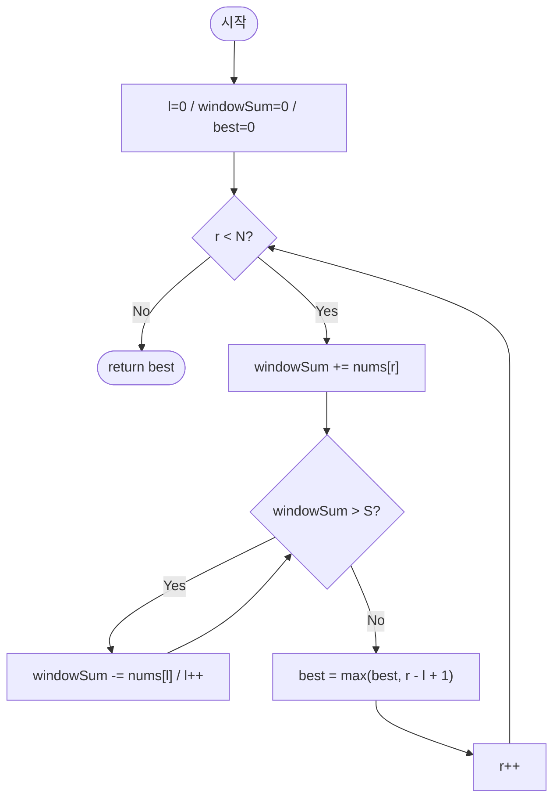

import { AlgorithmSimulation } from "#guide-sim";

# longestSubarrayAtMostSum — 왼쪽 경계는 한 번 밀면 다시 돌아오지 않는 이유

## 한눈에 보는 컨셉

합이 `S` 이하인 가장 긴 연속 구간을 찾는 문제예요. 배열 원소가 모두 비음수라는 조건 덕분에 구간 합은 오른쪽 끝을 늘릴수록 커지고 왼쪽 끝을 줄일수록(왼쪽 원소를 뺄수록) 작아지는 단조성을 가집니다. 이 단조성 하나 때문에 왼쪽 포인터를 한 번 오른쪽으로 옮기고 나면 다시 왼쪽으로 되돌릴 필요가 없어지고, 그 덕분에 두 포인터가 배열을 각각 최대 한 바퀴만 돌아 `O(N)`에 답을 구할 수 있습니다.

## 출발점: 가장 순진한 방법부터

문제를 먼저 정확히 고정할게요.

```ts
function longestSubarrayAtMostSum(nums: number[], S: number): number
```

| 파라미터 | 의미 | 제약 |
|----------|------|------|
| `nums` | 비음의 정수 배열 | $1 \leq N \leq 100{,}000$, $0 \leq nums[i] \leq 10{,}000$ |
| `S` | 합 상한 | $0 \leq S \leq 10^9$ |

**반환값**: 합이 `S` 이하인 연속 부분 배열 중 가장 긴 것의 길이. 그런 부분 배열이 없으면 `0`이에요.

| 입력 | 기대 출력 | 이유 |
|------|-----------|------|
| `S=0, nums=[1,2,3]` | `0` | 합 ≤ 0인 구간이 없음(모두 양수) |
| `S=0, nums=[0,0,0]` | `3` | 모든 원소가 0이면 합이 항상 0 ≤ S |
| `S=100, nums=[1,2,3]` | `3` | 전체 합 6 ≤ 100 |
| `S=3, nums=[4,1,2]` | `2` | 첫 원소 4가 이미 S 초과라 포함 불가 |

"가장 긴 구간"을 찾으라고 하면, 일단 **모든 구간을 다 시도해 보는 것**이 가장 정직한 출발이에요. 시작점 `l`과 끝점 `r`을 전부 조합해 합을 재고, `S` 이하인 것 중 가장 긴 것을 고르면 됩니다.

```ts
function longestSubarrayAtMostSumNaive(nums: number[], S: number): number {
  const n = nums.length;
  let best = 0;
  for (let l = 0; l < n; l++) {
    let s = 0;
    for (let r = l; r < n; r++) {
      s += nums[r];
      if (s <= S) {
        best = Math.max(best, r - l + 1);
      } else {
        break; // 비음수라 더 늘려도 합이 줄지 않으므로 이 l은 여기서 포기
      }
    }
  }
  return best;
}
```

작은 예로 비용을 직접 세어 봅시다. `nums = [1, 2, 3, 4]`(N=4)라면 시작점-끝점 쌍은 이렇게 나옵니다.

```text
l=0: r=0,1,2,3   → 4쌍
l=1: r=1,2,3     → 3쌍
l=2: r=2,3       → 2쌍
l=3: r=3         → 1쌍
합계: 4+3+2+1 = 10 = N(N+1)/2
```

`N=100{,}000`으로 키우면 $N(N+1)/2 \approx 5 \times 10^9$, `break`로 일부를 쳐내도 최악의 경우(예: 모든 원소가 0이라 어떤 구간도 초과하지 않는 경우)엔 `break`가 걸리지 않아 그대로 $O(N^2) \approx 10^{10}$ 연산까지 치솟습니다. 1초 제한 안에 어림도 없는 규모예요.

그런데 나열해 보면 낌새가 하나 보입니다 — `l`을 하나 늘렸을 때 `r`을 정말 처음부터 다시 훑어야 할까요? 이전 `l`에서 이미 계산해 둔 정보를 재사용할 수는 없을까요?

## 아이디어 자세히 들여다보기

### 왼쪽 경계는 한 번 밀면 되돌아오지 않는다 — 수식과 그림

구간 $[l, r]$의 합을 다음처럼 정의할게요.

$$\text{sum}(l, r) = \sum_{k=l}^{r} nums[k]$$

`nums`의 모든 원소가 비음수이므로 이 함수는 두 방향으로 단조입니다.

$$r_1 < r_2 \implies \text{sum}(l, r_1) \leq \text{sum}(l, r_2) \qquad \text{(오른쪽 끝을 늘리면 합은 줄지 않는다)}$$
$$l_1 < l_2 \implies \text{sum}(l_1, r) \geq \text{sum}(l_2, r) \qquad \text{(왼쪽 끝을 줄이면 합은 늘지 않는다)}$$

그림으로 보면 이렇습니다. `r`을 고정하고 `l`을 오른쪽으로 한 칸 옮기면(맨 왼쪽 원소를 뺀다는 뜻) 합은 절대 늘지 않아요.

```text
nums = [1, 2, 3, 4],  구간 [l=0, r=3]

Before: [ 1  2  3  4 ]   sum = 10
          ^l        ^r

After (l을 1로): [ 1  2  3  4 ]   sum = 9  (10 - nums[0])
                     ^l     ^r

l이 오른쪽으로 이동하면 합은 반드시 줄어들거나 그대로다 — 다시 늘어나는 일은 없다
```

**왜 하필 이 형태로 정의해야 할까요?** 대안으로 "각 `r`마다 접두사 합 배열에 이분 탐색을 걸어 조건을 만족하는 가장 작은 `l`을 찾는다"는 방법도 있어요. 원소가 비음수라 접두사 합이 단조 증가하니 이분 탐색이 성립하긴 합니다. 하지만 이건 `r`마다 매번 새로 탐색하는 방식이라 `O(N \log N)`이 되고, "이전 `l`의 위치를 다음 `r`에서도 그대로 이어 쓸 수 있다"는 사실을 활용하지 못해요. 반면 두 포인터로 상태(`l`, `windowSum`)를 유지하는 정의는 `r`이 진행되는 동안 `l`이 **누적된 정보를 잃지 않고** 이어받게 해 줍니다 — 그래서 굳이 매번 다시 찾지 않고 `O(N)`까지 줄어드는 거예요.

작은 입력으로 표를 직접 채워 봅시다. `nums=[1,2,3,4]`, `S=6`일 때 `r`이 0부터 3까지 진행하는 동안 `l`과 `windowSum`이 어떻게 움직이는지 볼게요.

| r | nums[r] | 확장 직후 windowSum | 축소 후 l | 축소 후 windowSum | 구간 길이 |
|---|---------|----------------------|-----------|--------------------|-----------|
| 0 | 1 | 1 | 0 | 1 | 1 |
| 1 | 2 | 3 | 0 | 3 | 2 |
| 2 | 3 | 6 | 0 | 6 | 3 |
| 3 | 4 | 10 | 3 | 4 | 1 |

잠깐, 확인 하나 해 볼까요? `r=2`일 때 합이 정확히 6이라 `S=6`과 같아요. 이때도 `l`을 옮겨야 할까요? — 아니요. 조건은 "합이 `S`를 **초과**하면" 축소이므로, 같을 때는 그대로 둡니다. 그래서 표에서 `r=2`까지는 `l=0`이 유지되고, 길이 3(구간 `[0,2]`)이 지금까지의 최댓값이 됩니다.

### 왜 모순 없이 작동하는가

이 알고리즘이 각 `r`에서 지키는 약속(불변식)은 하나예요.

> `r`을 처리하는 `while` 축소 루프가 끝난 시점에 `windowSum \leq S`이고, `[l, r]`은 오른쪽 끝을 `r`로 고정했을 때 합이 `S` 이하인 구간 중 **가장 왼쪽으로 `l`을 밀어 둔(=가장 긴)** 구간이다.

**기저**: `r=0` 직전, `l=0, windowSum=0`이고 빈 구간이므로 불변식이 자명하게 성립합니다.

**귀납 단계**: `r-1`까지 불변식이 성립한다고 가정해요. `r`로 넘어가며 `windowSum += nums[r]`을 하면 경우는 정확히 둘로 나뉩니다(다른 경우는 없어요 — `windowSum \leq S`이거나 `windowSum > S`이거나 둘 중 하나이므로 완전합니다).

- **`windowSum \leq S`인 경우**: 이미 조건을 만족하므로 `l`을 옮길 이유가 없습니다. `l`을 그대로 두는 것이 최적인 이유는, `l`을 더 오른쪽으로 옮기면 구간이 짧아지기만 하고 얻는 게 없기 때문이에요.
- **`windowSum > S`인 경우**: `while` 루프가 `nums[l] \geq 0`을 하나씩 빼며 `l`을 늘립니다. 비음수이므로 뺄 때마다 `windowSum`이 반드시 **감소하거나 그대로**이지, 다시 커지지 않아요. 그래서 루프는 유한 번 만에 `windowSum \leq S`에 도달하고 멈춥니다(최악의 경우 `l`이 `r`까지 도달하면 구간이 원소 하나 또는 빈 구간이 되어 합이 `nums[r]` 이하로 줄어듭니다). 이때도 `l`을 그 이상 옮기지 않는 이유는 앞선 관찰과 같습니다 — 이미 조건을 만족했는데 더 옮기면 손해예요.

두 경우 모두에서 "조건을 만족하는 한 `l`을 최대한 왼쪽에 둔다"는 목표가 유지되므로, `r` 시점의 불변식이 그대로 이어집니다. 이렇게 `r=0`부터 `r=N-1`까지 귀납이 이어지고, 매 단계 `best = \max(best, r-l+1)`로 갱신하므로 최종 `best`는 모든 `r`에 대해 "그 `r`을 오른쪽 끝으로 하는 가장 긴 유효 구간" 중 최댓값, 즉 전체 최적값입니다.

여기서 **헷갈리기 쉬운 포인트**가 둘 있습니다.

- **`best` 갱신은 반드시 축소가 끝난 뒤여야 합니다.** 축소 전에 `best`를 기록하면, 아직 `S`를 넘는(무효한) 구간의 길이를 정답 후보로 잘못 채택할 수 있어요. `nums=[1,1,1,1,1]`, `S=3`으로 직접 확인해 봅시다.

```text
올바른 순서(축소 → 기록):
r=3: windowSum = 1+1+1+1 = 4 > 3 → l을 1로 옮겨 windowSum=3 → 그 다음 best 기록 → 길이 3
r=4: windowSum = 3+1 = 4 > 3 → l을 2로 옮겨 windowSum=3 → 그 다음 best 기록 → 길이 3
최종 best = 3 (정답)

잘못된 순서(기록 → 축소):
r=3: windowSum = 4 > 3 인 채로 best = max(3, r-l+1=3-0+1=4) 로 먼저 기록  ✗
     그 다음에야 축소해서 l=1, windowSum=3으로 맞춤
최종 best = 4  ← 합이 4로 S=3을 넘는 구간을 "길이 4"로 잘못 인정한 값
```

  합이 4인 구간을 길이 4짜리 정답으로 세는 건 명백히 틀렸는데, 기록 순서 하나만 바꿔도 이런 값이 조용히 나옵니다. 그래서 코드에서 축소 `while` 루프가 `best` 갱신보다 **먼저** 와야 해요.

- **비음수 조건이 왜 필수인지.** 만약 음수가 섞여 있으면 "왼쪽을 줄이면 합이 줄어든다"는 전제 자체가 깨집니다. 제약상 `nums[i] \geq 0`이라 실제 입력에는 없지만, 왜 이 조건이 필요한지 가상의 예시로 확인해 볼게요. `nums=[5,-10,100]`, `S=3`에 이 알고리즘을 그대로 적용하면 `best=1`이 나오는데, 실제로 합이 3 이하인 가장 긴 구간은 `[5,-10]`(합 -5, 길이 2)이라 정답은 2입니다.

```text
nums = [5, -10, 100],  S = 3  (제약을 벗어난 가상 예시)

r=0: windowSum=5>3 → l을 1로 옮겨 windowSum=0 → best=0
r=1: windowSum=0+(-10)=-10 ≤ 3 → best=1  (구간 [1,1])
r=2: windowSum=-10+100=90>3
     → l=1에서 nums[1]=-10을 빼면 windowSum=100(!) 더 커짐 — 단조성이 깨진 것
     → l을 계속 옮겨 l=3, windowSum=0 → best=max(1, 2-3+1=0)=1

알고리즘 결과 best=1,  실제 정답(전수 조사) = 2  ← 불일치
```

  `l`을 옮겨도 합이 줄지 않고 오히려 늘어날 수 있으니(`nums[1]=-10`을 뺐더니 `windowSum`이 커짐), "한 번 옮긴 `l`은 되돌릴 필요 없다"는 이 알고리즘의 핵심 전제가 무너집니다. 그래서 문제 제약에 비음수 조건이 박혀 있는 거예요.

엣지 케이스도 불변식 위에서 짚어 둘게요.

```text
N=1, nums=[5], S=10        → r=0에서 windowSum=5≤10, best=1
N=1, nums=[5], S=1         → r=0에서 windowSum=5>1, l이 1로 이동, best=0
모든 원소가 0, S=0         → windowSum이 항상 0≤0, l이 전혀 움직이지 않아 best=N
S=0, 모든 원소 양수         → r=0에서 이미 windowSum>0=S, l이 계속 밀려 best=0
```

## 아이디어를 코드로 옮기기

```ts
function longestSubarrayAtMostSum(nums: number[], S: number): number {
  let l = 0;
  let windowSum = 0;
  let best = 0;

  for (let r = 0; r < nums.length; r++) {
    windowSum += nums[r];

    while (windowSum > S) {
      windowSum -= nums[l];
      l++;
    }

    best = Math.max(best, r - l + 1);
  }

  return best;
}
```

결정 지점만 짚을게요.

- **초기값**: `l=0, windowSum=0, best=0` — 아직 아무 원소도 보지 않은 빈 구간에서 시작합니다.
- **인덱스 경계**: `r`은 `0`부터 `nums.length - 1`까지, `l`은 `r`을 넘어설 일이 없습니다(비음수라 `nums[r]` 자체가 `S`를 넘는 순간 `windowSum`이 결국 `0`으로 줄어 루프가 멈추기 때문이에요).
- **순회 방향**: `r`이 왼쪽에서 오른쪽으로 한 방향으로만 전진하고, `l`도 마찬가지로 왼쪽에서 오른쪽으로만 전진합니다 — 둘 다 절대 되돌아가지 않습니다.
- **가드 순서**: `while` 축소가 `best` 갱신보다 반드시 먼저 옵니다.

**가장 실수가 잦은 줄은 `best = Math.max(best, r - l + 1);`이 놓인 위치입니다.** 이 줄을 `while` 루프보다 앞에 두면, 앞 절에서 확인한 것처럼 `nums=[1,1,1,1,1]`, `S=3`에서 정답 `3` 대신 `4`가 나옵니다 — 아직 `S`를 초과한 구간의 길이를 정답 후보로 잘못 채택하기 때문이에요. 항상 "먼저 축소해서 조건을 맞추고, 그다음에 기록한다" 순서를 지켜야 합니다.

이 구현은 이미 시간 `O(N)`, 공간 `O(1)`입니다. 답을 결정하려면 각 원소를 최소 한 번은 읽어야 하므로 시간 하한은 `Ω(N)`이고, 두 포인터는 `l`과 `r`이 각각 배열을 최대 한 바퀴만 돌므로 이 하한과 맞닿아 있어요. 더 줄일 여지가 없어서, 이 문제는 "더 빠르게 만들 단서 찾기" 이후의 추가 최적화 단계를 밟지 않습니다.

## 실행 시각화

입력 `nums = [1, 2, 3, 4]`, `S = 6`에 대해 슬라이딩 윈도우로 합 ≤ S인 가장 긴 구간을 찾는 과정입니다. `highlight`(빨강)는 현재 오른쪽 끝 `r`, `pointers`는 두 포인터 `l`, `r` 위치이고, keyValue 패널은 `windowSum`과 지금까지의 `best`(최대 길이) 스냅샷이에요. 실제 반환값은 `3`이며(구간 `[0,2]`의 합 `1+2+3=6 ≤ 6`), 시뮬레이션 마지막 프레임의 `best`와 일치합니다.

> 대화형 시뮬레이션은 MDX 런타임에서 표시됩니다.

export const A = [1, 2, 3, 4];

export const steps = [
  {
    title: "초기화",
    detail: "l=0, windowSum=0, best=0.",
    array: A,
    pointers: { l: 0, r: 0 },
    entries: [
      { label: "windowSum", value: 0 },
      { label: "best", value: 0 },
    ],
  },
  {
    title: "r=0: windowSum += 1 = 1 ≤ 6",
    detail: "축소 불필요. 구간 [0,0] 길이 1. best=1.",
    array: A,
    highlight: [0],
    pointers: { l: 0, r: 0 },
    entries: [
      { label: "windowSum", value: 1 },
      { label: "best", value: 1 },
    ],
  },
  {
    title: "r=1: windowSum += 2 = 3 ≤ 6",
    detail: "축소 불필요. 구간 [0,1] 길이 2. best=2.",
    array: A,
    highlight: [1],
    pointers: { l: 0, r: 1 },
    entries: [
      { label: "windowSum", value: 3 },
      { label: "best", value: 2 },
    ],
  },
  {
    title: "r=2: windowSum += 3 = 6 ≤ 6",
    detail: "축소 불필요. 구간 [0,2] 길이 3. best=3.",
    array: A,
    highlight: [2],
    pointers: { l: 0, r: 2 },
    entries: [
      { label: "windowSum", value: 6 },
      { label: "best", value: 3 },
    ],
  },
  {
    title: "r=3: windowSum += 4 = 10 > 6 → 축소",
    detail: "합 10 > 6. l을 이동해 윈도우를 줄인다.",
    array: A,
    highlight: [3],
    pointers: { l: 0, r: 3 },
    entries: [
      { label: "windowSum", value: 10 },
      { label: "best", value: 3 },
    ],
  },
  {
    title: "축소: windowSum -= nums[0]=1 = 9, l=1",
    detail: "여전히 9 > 6 → 계속 축소.",
    array: A,
    highlight: [3],
    pointers: { l: 1, r: 3 },
    entries: [
      { label: "windowSum", value: 9 },
      { label: "best", value: 3 },
    ],
  },
  {
    title: "축소: windowSum -= nums[1]=2 = 7, l=2",
    detail: "여전히 7 > 6 → 계속 축소.",
    array: A,
    highlight: [3],
    pointers: { l: 2, r: 3 },
    entries: [
      { label: "windowSum", value: 7 },
      { label: "best", value: 3 },
    ],
  },
  {
    title: "축소: windowSum -= nums[2]=3 = 4, l=3",
    detail: "4 ≤ 6 → 멈춤. 구간 [3,3] 길이 1. best=max(3,1)=3.",
    array: A,
    highlight: [3],
    pointers: { l: 3, r: 3 },
    entries: [
      { label: "windowSum", value: 4 },
      { label: "best", value: 3 },
    ],
  },
  {
    title: "완료: best = 3",
    detail: "순회 종료. 합 ≤ 6인 가장 긴 구간은 [0,2] 길이 3.",
    array: A,
    marked: [0, 1, 2],
    entries: [
      { label: "결과 best", value: 3 },
      { label: "최적 구간", value: "[0,2] 합 6" },
    ],
  },
];

<AlgorithmSimulation view={["array", "keyValue"]} steps={steps} title="합 ≤ S 최장 구간: nums=[1,2,3,4], S=6" />

## 흐름 한눈에 보기



## 스스로 점검하기

1. `nums=[2,1,5,1,1]`, `S=8`일 때 `r`이 0부터 4까지 진행하는 동안 `windowSum`, `l`, `best`가 어떻게 바뀌는지 손으로 표를 채워 보세요. (힌트: `r=2`에서 `windowSum`이 `8`이 되고, `r=4`에서 `best=4`로 정답이 확정됩니다.)
2. `best = Math.max(best, r - l + 1);`을 `while` 축소 루프보다 **앞**에 두면 어떤 일이 생기는지, `nums=[1,1,1,1,1]`, `S=3` 예시로 어느 `r`에서 몇으로 잘못된 값이 기록되는지 짚어 보세요.
3. 이번엔 "합이 `S` **이상**인 가장 짧은 연속 구간"을 구하려 한다고 해 봅시다. 같은 두 포인터 틀을 재사용하려면 확장/축소 조건과 `best` 갱신 방향(최댓값 → 최솟값)이 각각 어떻게 바뀌어야 할까요?
