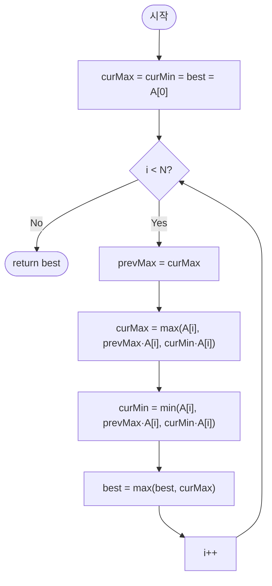

import { AlgorithmSimulation } from "#guide-sim";

# maximumProductSubarray — 최대 곱 부분 배열

## 성능 목표 예측

| 항목 | 값 |
|------|-----|
| 입력 크기 | $1 \leq N \leq 100{,}000$ |
| 원소 범위 | $-10 \leq A[i] \leq 10$ |

**naive 접근의 문제점**: 모든 구간 $[l, r]$의 곱을 계산하면 $O(N^2)$ 또는 누적곱을 사용해도 $O(N^2)$이다. $N = 10^5$에서 $10^{10}$ 연산으로 시간 초과가 발생한다.

**목표 복잡도**: 시간 $O(N)$, 공간 $O(1)$. 배열을 한 번만 순회하며 두 변수만 유지한다.

**공간 복잡도**: `curMax`, `curMin`, `best` 세 변수로 $O(1)$이다.

---

## 목표 함수

```ts
function maximumProductSubarray(A: number[]): number
```

| 파라미터 | 의미 | 제약 |
|----------|------|------|
| `A` | 정수 배열 | $1 \leq N \leq 100{,}000$, $-10 \leq A[i] \leq 10$ |

**반환값**: 연속된 부분 배열의 곱의 최댓값.

**엣지케이스**:

| 입력 | 기대 출력 | 이유 |
|------|-----------|------|
| `[-3]` | `-3` | 단일 원소 — 선택 안 할 수 없음 |
| `[-2, -3, -4]` | `12` | 짝수 개 음수의 곱이 양수 |
| `[2, 0, 3]` | `3` | $0$이 구간을 분리 |
| `[-2, 0, -1]` | `0` | $0$ 포함 — 최대가 $0$ |

---

## 핵심 아이디어

**핵심 아이디어**: "곱에서는 현재 최솟값(음수)이 다음 음수 원소를 만나면 최댓값이 될 수 있으므로, 최댓값과 최솟값을 동시에 추적해야 한다."

합의 Kadane과 달리 곱에서는 음수 × 음수 = 양수가 되는 반전이 발생한다. 따라서 "현재 위치에서 끝나는 곱의 최댓값"뿐 아니라 "최솟값"도 함께 유지해야 한다. 각 원소에서 세 후보(단독 시작, 이전 최대에 현재 곱, 이전 최소에 현재 곱) 중 최대와 최소를 구하면 된다.

**풀이 구조**
1. `curMax = curMin = best = A[0]`으로 초기화한다.
2. i=1..N-1을 순회하며 `prevMax = curMax`로 이전 최댓값을 저장한다.
3. `curMax = max(A[i], prevMax*A[i], curMin*A[i])`, `curMin = min(A[i], prevMax*A[i], curMin*A[i])`를 계산한다.
4. `best = max(best, curMax)`로 전역 최댓값을 갱신한다.
5. `best`를 반환한다.

**조건**: 연속 부분 배열을 반드시 하나 이상 선택해야 한다. A[i]=0이면 구간이 자동으로 리셋된다.

**대표 예시**: `A=[2,3,-2,4]`
curMax/curMin 변화: (2,2) → (6,6) → (-2,-12) → (4,-48). best는 2→6→6→6. 최대 곱은 6([2,3]).

**언제 쓰나**
부분 배열의 곱 최적화 문제에서 사용한다. 음수 원소가 있어 "부호 반전"이 발생하는 곱 문제에 특화된 패턴으로, 단순 Kadane 확장이 실패하는 이유를 이해하면 자연스럽게 이 접근이 도출된다.

---

### 원형 아이디어와 naive 접근

연속 부분 배열의 최대 합 문제(Kadane)처럼 단일 변수로 추적한다고 가정한다.

```
curMax = A[0],  best = A[0]
for i from 1 to N-1:
    curMax = max(A[i], curMax * A[i])
    best = max(best, curMax)
```

이 방식은 합에서는 동작하지만 곱에서는 실패한다. $curMax = -3$이고 $A[i] = -2$이면 $curMax \times A[i] = 6$인데, `max(-2, -3 * -2) = max(-2, 6) = 6`으로 올바르다. 그러나 $curMax = 3$이고 $A[i] = -2$이면 다음 원소가 $-5$일 때 $curMax = -6$이 되어 $(-6) \times (-5) = 30$을 계산할 수 없다 — 최솟값 $-6$을 버렸기 때문이다.

### 어떤 관찰이 돌파구가 되는가

- **관찰 1**: 곱에서는 음수 × 음수 = 양수가 된다. 현재 최솟값(음수)이 이후 음수 원소를 만나면 최댓값이 될 수 있다. 따라서 최솟값도 추적해야 한다.
- **관찰 2**: 위치 $i$에서 끝나는 연속 부분 배열의 곱의 최댓값은 세 후보 중 하나다: $A[i]$ 단독, 이전 최댓값에 $A[i]$를 곱한 것, 이전 최솟값에 $A[i]$를 곱한 것.
- **관찰 3**: $A[i] = 0$이면 $curMax = curMin = 0$이 되어 구간이 자연스럽게 리셋된다. 별도 처리가 필요 없다.

### 관찰을 형식화: 상태/구조 정의

두 상태를 정의한다.

$$mx[i] = \text{위치 } i \text{에서 끝나는 연속 부분 배열의 곱의 최댓값}$$
$$mn[i] = \text{위치 } i \text{에서 끝나는 연속 부분 배열의 곱의 최솟값}$$

이 정의가 왜 이 형태여야 하는가: "끝 위치를 고정"하면 $mx[i]$와 $mn[i]$가 $mx[i-1]$과 $mn[i-1]$에만 의존해 $O(1)$ 갱신이 가능하다. 두 변수로 충분한 이유는 $\max$ 또는 $\min$이 될 수 있는 후보가 세 개이며, 세 값 중 최대/최소가 $mx[i]$/$mn[i]$이기 때문이다.

초기 조건: $mx[0] = mn[0] = best = A[0]$.

### 점화식 또는 핵심 연산

$i = 1, 2, \ldots, N-1$에 대해 (이전 값을 $prevMax, prevMin$으로 저장 후 계산):

$$mx[i] = \max\bigl(A[i],\; prevMax \cdot A[i],\; prevMin \cdot A[i]\bigr)$$

$$mn[i] = \min\bigl(A[i],\; prevMax \cdot A[i],\; prevMin \cdot A[i]\bigr)$$

각 항의 의미:
- $A[i]$: 이전 구간을 버리고 $i$에서 새로 시작
- $prevMax \cdot A[i]$: 이전 최댓값에 $A[i]$를 곱함 ($A[i] > 0$이면 최대화에 유리)
- $prevMin \cdot A[i]$: 이전 최솟값에 $A[i]$를 곱함 ($A[i] < 0$이면 부호 반전으로 최대화)

결과: $best = \max_{0 \leq i < N} mx[i]$

### 정당성 — 왜 이것이 옳은가

귀납적으로 $mx[i]$와 $mn[i]$의 정의를 증명한다. 기저: $mx[0] = mn[0] = A[0]$은 단일 원소 구간의 유일한 곱이다.

귀납 가정: $mx[i-1]$과 $mn[i-1]$이 위치 $i-1$에서 끝나는 모든 연속 부분 배열 곱의 최대/최솟값이라고 가정한다. 위치 $i$에서 끝나는 연속 부분 배열은 $A[i]$ 하나이거나, 위치 $i-1$에서 끝나는 어떤 구간에 $A[i]$를 이어 붙인 것이다. 이어 붙인 구간의 곱은 (이전 구간의 곱) $\times A[i]$이다. $A[i] > 0$이면 이전 최댓값 곱이 최대, $A[i] < 0$이면 이전 최솟값 곱이 최대, $A[i] = 0$이면 모두 $0$이다. 세 후보의 $\max$/$\min$이 $mx[i]$/$mn[i]$이므로 귀납이 성립한다.

까다로운 케이스 ($A[i] = 0$): 세 후보 모두 $0$이므로 $mx[i] = mn[i] = 0$이 되어 구간이 리셋된다. 이후 원소는 새로운 구간에서 시작한다.

### 구현 디테일과 최적화

- **동시 갱신 문제**: `curMax`와 `curMin`을 갱신할 때, `curMax` 계산에 이전 `curMin`이 필요하고 `curMin` 계산에 이전 `curMax`가 필요하다. `curMax`를 먼저 갱신하면 이전 `curMax` 값이 손실된다. 반드시 `prevMax = curMax`를 먼저 저장한 후 두 값을 모두 계산해야 한다.
- **함정**: 동시 갱신 없이 `curMin`을 갱신된 `curMax`를 참조해 계산하면 오답이 발생한다.
- **함정**: `best`를 `0`으로 초기화하면 모두 음수인 배열에서 $0$을 반환하는 오류가 발생한다. 반드시 `A[0]`으로 초기화한다.
- 원소 범위가 $[-10, 10]$으로 제한되어 있으므로 $N$번 곱해도 값이 $10^N$인데, $N = 10^5$이면 이 값이 표현 불가능하다. 실제 구현에서는 중간 결과가 매우 커질 수 있으므로 BigInt를 사용하거나, 이 문제에서 $A[i]$ 범위가 작다는 점을 활용한다.

---

## 시뮬레이션

입력 `A = [2, 3, -2, 4]`에 대해 최댓값/최솟값을 동시에 추적하며 최대 곱 부분 배열을 구하는 과정이다. `array` 패널에서 `highlight`(빨강)는 현재 원소 `A[i]`이다. `keyValue` 패널은 위치 i에서 끝나는 곱의 `curMax`/`curMin`과 전역 `best`의 스냅샷이다. 음수를 만나면 최솟값(음수)이 최댓값으로 반전될 수 있으므로 둘 다 유지한다.

실제 반환값은 `6` 이며(부분 배열 `[2,3]`의 곱), 시뮬레이션 마지막 프레임의 `best`와 일치한다.

> 대화형 시뮬레이션은 MDX 런타임에서 표시됩니다.

export const A = [2, 3, -2, 4];

export const steps = [
  {
    title: "초기화 (i=0)",
    detail: "curMax = curMin = best = A[0] = 2.",
    array: A,
    highlight: [0],
    marked: [0],
    entries: [
      { label: "curMax", value: 2 },
      { label: "curMin", value: 2 },
      { label: "best", value: 2 },
    ],
  },
  {
    title: "i=1: A[1]=3",
    detail: "후보 3, prevMax*3=6, curMin*3=6. curMax=6, curMin=3. best=max(2,6)=6.",
    array: A,
    highlight: [1],
    marked: [0, 1],
    entries: [
      { label: "curMax", value: 6 },
      { label: "curMin", value: 3 },
      { label: "best", value: 6 },
    ],
  },
  {
    title: "i=2: A[2]=-2",
    detail: "prevMax=6. 후보 -2, 6*-2=-12, 3*-2=-6. curMax=max=-2, curMin=min=-12. best=6 유지.",
    array: A,
    highlight: [2],
    marked: [0, 1],
    entries: [
      { label: "curMax", value: -2 },
      { label: "curMin", value: -12 },
      { label: "best", value: 6 },
    ],
  },
  {
    title: "i=3: A[3]=4",
    detail: "prevMax=-2. 후보 4, -2*4=-8, -12*4=-48. curMax=4, curMin=-48. best=6 유지.",
    array: A,
    highlight: [3],
    marked: [0, 1],
    entries: [
      { label: "curMax", value: 4 },
      { label: "curMin", value: -48 },
      { label: "best", value: 6 },
    ],
  },
  {
    title: "완료: best = 6",
    detail: "순회 종료. 최대 곱은 부분 배열 [2,3]의 2*3 = 6.",
    array: A,
    marked: [0, 1],
    entries: [
      { label: "결과 best", value: 6 },
      { label: "최적 구간", value: "[0..1]" },
    ],
  },
];

<AlgorithmSimulation view={["array", "keyValue"]} steps={steps} title="최대 곱 부분 배열: A=[2,3,-2,4]" />

## 수도 코드와 Activity Diagram

### 의사코드

```
function maximumProductSubarray(A):
    curMax ← A[0]          // 불변식: 위치 i에서 끝나는 곱의 최댓값
    curMin ← A[0]          // 불변식: 위치 i에서 끝나는 곱의 최솟값
    best   ← A[0]          // 불변식: 지금까지의 전역 최댓값

    for i from 1 to N-1:
        prevMax ← curMax   // 동시 갱신 충돌 방지: 이전 최댓값 저장

        curMax ← max(A[i], prevMax * A[i], curMin * A[i])   // 세 후보 중 최대
        curMin ← min(A[i], prevMax * A[i], curMin * A[i])   // 세 후보 중 최소
        best   ← max(best, curMax)

    return best
```

### Activity Diagram



**핵심 불변식**: 루프 변수 $i$ 진입 시점에 `curMax` $= mx[i-1]$ (위치 $i-1$에서 끝나는 곱의 최댓값), `curMin` $= mn[i-1]$ (최솟값)이며, 루프 종료 후 `best` $= \max_{0 \leq i < N} mx[i]$가 정답이다.

---

## 복잡도 분석 심화

| 접근 방식 | 시간 | 공간 | 비고 |
|-----------|------|------|------|
| 이중 루프 (naive) | $O(N^2)$ | $O(1)$ | $N=10^5$에서 불가 |
| max·min 동시 추적 (Kadane 변형) | $O(N)$ | $O(1)$ | 최적 |

**변형 1 — 최대 합 대신 최대 곱**: 합 Kadane와 달리 곱은 $0$이 구간을 "리셋"한다는 점이 핵심이다. `curMax = max(A[i], curMax * A[i])` 단순 확장은 음수 원소에서 실패한다.

**변형 2 — $0$이 없는 경우**: $0$이 없으면 전체 배열 곱 또는 좌끝이나 우끝을 제외한 곱 중 하나가 최대다. 시간 $O(N)$에 양끝을 제거해가는 방식으로 처리할 수 있다.

**변형 3 — 원소 범위에 따른 오버플로 주의**: 이 문제는 $|A[i]| \leq 10$으로 제한되어 있지만, 일반적인 경우 $N$번 곱하면 값이 $10^{100N}$에 달해 표준 정수형을 초과한다. 실제 코딩 테스트에서는 BigInt 사용 또는 로그 변환을 고려해야 한다.

**함정 재확인 — prevMax 저장 필수**: `curMax`와 `curMin`을 동시에 갱신할 때 `prevMax = curMax`를 반드시 먼저 저장해야 한다. 이를 빠뜨리면 `curMin`이 이미 갱신된 `curMax`를 참조해 오답이 발생한다.
